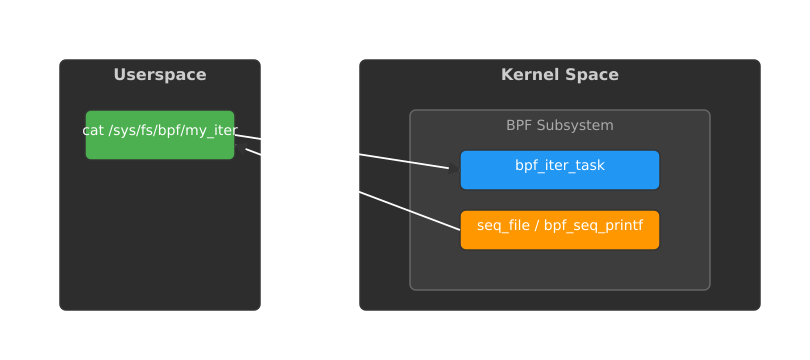
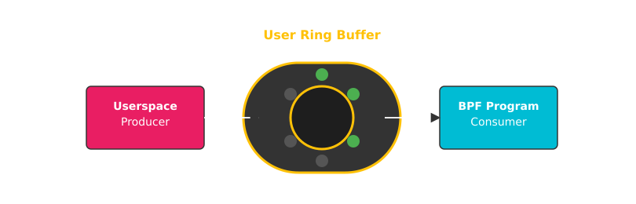

# Ітератори BPF (bpf_iter) та User Ring Buffer

<preknowlist>
- [Концепції ядра Linux](book:unix-linux/kernel-and-userspace) — базові поняття системних викликів та VFS.
</preknowlist>

Підсистема eBPF (Extended Berkeley Packet Filter) у ядрі Linux продовжує розвиватися шаленими темпами, пропонуючи все нові і нові механізми для взаємодії між простором ядра (kernel space) та простором користувача (user space). Серед найпотужніших нововведень останніх років виділяються два механізми: BPF Iterators (`bpf_iter`) та BPF User Ring Buffer (`BPF_MAP_TYPE_USER_RINGBUF`). Обидва механізми спрямовані на вирішення класичних проблем продуктивності та гнучкості при обміні даними, але роблять це з різних боків.

BPF Iterators дозволяють замінити традиційні механізми експорту структур даних ядра (такі як `procfs` або `sysfs`) на повністю програмовані, безпечні та високопродуктивні ітератори, що працюють без блокувань (lockless) або з мінімальними накладними витратами. З іншого боку, User Ring Buffer вирішує проблему швидкої та надійної передачі подій або команд *від простору користувача до ядра*, уникаючи дорогих системних викликів (syscalls), що є ідеальним для сучасних систем observability та tracing.

У цій статті ми детально розглянемо обидва механізми, їхню архітектуру, приклади використання та те, як вони змінюють підхід до створення утиліт для моніторингу та діагностики систем Linux.

---

## 1. BPF Iterators (`bpf_iter`)

До появи BPF-ітераторів стандартним способом отримання інформації про стан системи з простору користувача було читання віртуальних файлових систем, таких як `/proc` або `/sys`, або використання інтерфейсу netlink. Наприклад, утиліти `ps`, `top` або `netstat` (і її сучасніший аналог `ss`) читають `/proc/PID/*` або використовують netlink для отримання списку процесів чи мережевих з'єднань.

### Проблеми традиційних підходів

1. **Негнучкість формату:** Ядро експортує дані у фіксованому форматі (часто текстовому), який простір користувача повинен розпарсити. Якщо вам потрібно додати нове поле, потрібно змінювати код ядра.
2. **Накладні витрати на парсинг:** Ядро витрачає процесорний час на форматування даних у текст (через `seq_file`), а userspace — на зворотне перетворення тексту в структури даних (наприклад, через `scanf`).
3. **Гонки даних (Race conditions) та блокування:** При ітерації по великих структурах ядра (наприклад, списку всіх завдань або мережевих сокетів) ядро повинно брати блокування (locks), щоб структури не змінилися під час ітерації. Це може викликати затримки (latency) в системі. Якщо замість цього використовуються безблокувальні підходи, ітерація може перериватися або пропускати елементи при одночасних змінах.

### Рішення: BPF-ітератори

BPF Iterator (тип програми `BPF_PROG_TYPE_TRACING` з типом прив'язки `BPF_LINK_TYPE_ITER`) — це механізм, який дозволяє завантажити BPF-програму в ядро і призначити їй завдання ітерувати по певній структурі даних ядра (наприклад, по всіх процесах, потоках, сокетах, мапах BPF тощо).

Головна ідея: замість того, щоб ядро форматувало всі дані і відправляло їх у userspace, BPF-програма виконується *в контексті ядра* для кожного елемента колекції. Ця програма може відфільтрувати непотрібні елементи, зібрати лише необхідну інформацію і відформатувати її (у текст або бінарний формат) за допомогою допоміжної функції `bpf_seq_printf()`. Результат цього форматування потім читається з userspace через спеціальний віртуальний файл у файловій системі `bpffs` (BPF File System, зазвичай змонтованій у `/sys/fs/bpf`).


*Рис. М.Р.Т.1: Архітектура взаємодії BPF-ітераторів між userspace та ядром*

### Як це працює зсередини

Під капотом BPF-ітератори тісно інтегровані з підсистемою `seq_file` у ядрі Linux. `seq_file` — це стандартний API ядра для створення віртуальних файлів, які повертають послідовності даних (наприклад, файли в `/proc`).

1. **Завантаження програми:** Ви пишете BPF-програму (C-код, скомпільований за допомогою Clang у байт-код BPF) і завантажуєте її в ядро.
2. **Створення BPF Link:** Ви прив'язуєте цю програму до певного типу ітератора (наприклад, `task`, `task_file`, `tcp`, `udp`, `bpf_map_elem`). Ядро створює об'єкт `bpf_link`.
3. **Створення файлу:** Ви закріплюєте (pin) цей `bpf_link` у BPF-файловій системі. Це створює звичайний файл, скажімо, `/sys/fs/bpf/my_processes`.
4. **Читання файлу:** Коли будь-який процес у userspace робить `open()` і `read()` цього файлу, ядро ініціалізує ітератор відповідного типу. Для кожного знайденого об'єкта (наприклад, для кожного процесу) ядро викликає вашу BPF-програму.
5. **Генерація виводу:** BPF-програма отримує вказівник на об'єкт (наприклад, `struct task_struct *`). Вона може читати поля цього об'єкта. За допомогою `bpf_seq_printf()`, програма записує дані в буфер `seq_file`. Якщо об'єкт не відповідає критеріям фільтрації, програма просто завершується, не записуючи нічого. Це суттєво економить пам'ять і процесорний час, оскільки до userspace доходять лише потрібні дані.
6. **Повернення даних:** Коли буфер `seq_file` заповнюється, ядро повертає ці дані як результат виклику `read()` процесу в userspace.

### Переваги BPF-ітераторів

- **Безпека:** BPF-програми перевіряються верифікатором ядра перед виконанням. Вони не можуть обвалити ядро.
- **Гнучкість:** Ви самі визначаєте, які дані вам потрібні і в якому форматі. Хочете JSON? Форматуйте як JSON прямо в ядрі. Хочете бінарний формат? Використовуйте `bpf_seq_write()`.
- **Продуктивність (Фільтрація in-kernel):** Це найважливіша перевага. Уявіть, що вам потрібно знайти всі процеси, які використовують більше 1 ГБ пам'яті. З `/proc` вам довелося б прочитати файли `/proc/*/status` для *всіх* тисяч процесів, розпарсити їх у userspace і відфільтрувати. З BPF-ітератором, програма в ядрі швидко перевіряє `task->mm->total_vm` і генерує вивід лише для процесів, що відповідають умові. Кількість даних, що перетинають межу ядро-userspace (context switch overhead), зменшується в сотні разів.
- **Агрегація in-kernel:** Ви можете не лише фільтрувати, але й агрегувати дані (наприклад, використовуючи глобальні змінні BPF або мапи) під час ітерації, і вивести лише фінальний результат наприкінці (ітератори викликаються зі спеціальним маркером кінця ітерації).

### Приклад BPF-ітератора: список процесів (task iterator)

Розглянемо спрощений приклад BPF-програми, яка ітерує по всіх процесах (завданнях) у системі і виводить їх PID та назву.

```c
#include "vmlinux.h"
#include <bpf/bpf_helpers.h>
#include <bpf/bpf_tracing.h>

SEC("iter/task")
int dump_task(struct bpf_iter__task *ctx)
{
    struct seq_file *seq = ctx->meta->seq;
    struct task_struct *task = ctx->task;

    /* Коли task == NULL, це означає кінець ітерації */
    if (task == NULL)
        return 0;

    /* Використовуємо bpf_seq_printf для запису у seq_file */
    bpf_seq_printf(seq, "PID: %d, Comm: %s\n", task->pid, task->comm);
    return 0;
}

char _license[] SEC("license") = "GPL";
```

Структура `bpf_iter__task` генерується автоматично (частина CO-RE — Compile Once - Run Everywhere, використовуючи vmlinux.h) і виглядає приблизно так:

```c
struct bpf_iter__task {
    union {
        struct bpf_iter_meta *meta;
    };
    union {
        struct task_struct *task;
    };
};
```

Після компіляції та завантаження цієї програми (наприклад, за допомогою бібліотеки `libbpf`), userspace частина (або утиліта `bpftool`) може "прикріпити" (pin) цей ітератор:

```bash
# Приклад використання bpftool
bpftool iter pin ./my_iter.o /sys/fs/bpf/my_tasks
```

Тепер, будь-який користувач (з відповідними правами) може прочитати цей файл:

```bash
cat /sys/fs/bpf/my_tasks
```

Вивід буде згенеровано BPF-програмою в реальному часі:
```
PID: 1, Comm: systemd
PID: 2, Comm: kthreadd
...
```

### Розширені можливості та Lockless ітерація

Окрім базової ітерації, BPF-ітератори постійно отримують нові можливості:

- **Ітерація по BPF мапах (`iter/bpf_map_elem`):** Дозволяє ітерувати по елементах будь-якої BPF мапи (навіть мап, створених іншими програмами) без необхідності робити syscall `bpf_map_get_next_key()` для кожного елемента. Це набагато швидше для великих мап.
- **Ітерація по відкритих файлах процесу (`iter/task_file`):** Дозволяє проаналізувати всі відкриті файлові дескриптори певного процесу (або всіх процесів).
- **VMA ітератори (`iter/task_vma`):** Дозволяють ітерувати по ділянках віртуальної пам'яті (Virtual Memory Areas) процесу.
- **Мережеві ітератори (`iter/tcp`, `iter/udp`, `iter/ipv6_route`, `iter/netlink`):** Замінюють необхідність парсити `/proc/net/tcp` і подібні файли. Забезпечують доступ до внутрішніх структур ядра (наприклад, `struct sock`), що дозволяє отримати набагато більше інформації, ніж доступно у стандартному `/proc`.

Особливої уваги заслуговує підхід до синхронізації. Ітерація по структурах ядра завжди є складною проблемою через те, що ці структури можуть змінюватися під час ітерації. Традиційний `procfs` часто використовує читацькі блокування (read locks) або RCU (Read-Copy-Update), щоб забезпечити узгодженість. BPF-ітератори також інтенсивно використовують RCU, що робить їх здебільшого "lockless" (безблокувальними) для пишучих потоків. Це означає, що запуск BPF-ітератора має мінімальний вплив на загальну продуктивність і затримки (latency) ядра, на відміну від деяких важких механізмів `/proc`, які можуть викликати contention (боротьбу) за блокування.

---

## 2. BPF User Ring Buffer (`BPF_MAP_TYPE_USER_RINGBUF`)

Якщо BPF Iterators — це спосіб ефективно *читати* стан ядра, то що робити, коли userspace хоче активно *керувати* BPF-програмами або відправляти їм потоки даних (наприклад, команди конфігурації, оновлення політик або payload для обробки мережевих пакетів)?

Традиційно для передачі даних від userspace до BPF використовувалися:
1.  **BPF Arrays / Hash Maps:** Userspace робить syscall `bpf_map_update_elem()`. Це добре для статичної конфігурації, але дуже повільно для потокової передачі (streaming) через накладні витрати syscall-ів для кожного повідомлення.
2.  **Perf Event Array:** Історично це був основний спосіб передачі подій від BPF до userspace (через `bpf_perf_event_output()`). Але цей механізм є односпрямованим (тільки Kernel -> Userspace).
3.  **BPF Ring Buffer (`BPF_MAP_TYPE_RINGBUF`):** Введений у ядрі 5.8, це значно оптимізований, багатовиробничий (multi-producer), односпоживацький (single-consumer) кільцевий буфер для передачі даних **від ядра до userspace**. Він швидший за Perf Event Array і краще використовує пам'ять.

Проте, жоден з цих механізмів не був ідеальним для потокової передачі даних у зворотному напрямку: **від userspace до BPF (ядра)**. Для вирішення цієї прогалини у ядрі 6.1 був представлений `BPF_MAP_TYPE_USER_RINGBUF`.

### Що таке User Ring Buffer?

`BPF_MAP_TYPE_USER_RINGBUF` — це тип BPF мапи, який реалізує кільцевий буфер (ring buffer) з одним виробником (single-producer, яким є userspace програма) та одним споживачем (single-consumer, яким є BPF-програма в ядрі).

Ключова особливість User Ring Buffer полягає в тому, що після його створення та відображення в пам'ять (mmap), userspace програма може записувати події (повідомлення) у цей буфер **без жодного системного виклику (syscall)**. BPF-програма, у свою чергу, може читати ці події під час свого виконання за допомогою допоміжних функцій.

Це кардинально змінює правила гри для високопродуктивних мережевих додатків (XDP/TC) або систем моніторингу, яким потрібно динамічно і дуже швидко змінювати правила фільтрації або надсилати команди BPF-програмам.


*Рис. М.Р.Т.2: Потокова передача даних від userspace до BPF без syscalls через User Ring Buffer*

### Архітектура та принципи роботи

1. **Створення мапи:** Userspace створює мапу типу `BPF_MAP_TYPE_USER_RINGBUF`.
2. **Відображення пам'яті (mmap):** Userspace викликає `mmap()` для файлового дескриптора мапи. Це відображає пам'ять кільцевого буфера (яка фізично знаходиться в просторі ядра) у адресний простір процесу userspace.
3. **Запис у буфер (Userspace - Producer):**
    Коли userspace хоче надіслати подію, він не робить syscall. Замість цього він працює з відображеною пам'яттю за певним протоколом:
    - Резервує місце в буфері, оновлюючи атомарно вказівники.
    - Копіює дані повідомлення безпосередньо у виділену пам'ять.
    - Фіксує (commits) запис, оновлюючи вказівник "хвоста" (producer position).
    Ці операції вимагають використання атомарних інструкцій процесора та бар'єрів пам'яті (memory barriers), щоб гарантувати когерентність кешів між CPU ядрами. На щастя, бібліотека `libbpf` надає зручний API (`user_ring_buffer__reserve`, `user_ring_buffer__submit`), який ховає всю цю складність атомарних операцій.
4. **Сповіщення ядра (опціонально):** Оскільки запис відбувається без syscall-у, BPF-програма не запускається автоматично при кожному записі. Є два основні патерни читання:
    - **Синхронний/Подієвий:** Після запису однієї або кількох подій, userspace викликає легковагий syscall (наприклад, `epoll` або спеціальний bpf syscall) або відправляє сигнал (наприклад, через існуючий мережевий пакет або tracepoint), який тригерить виконання BPF-програми.
    - **Асинхронний/Polling:** BPF-програма може бути прив'язана до події, яка відбувається часто (наприклад, обробка кожного мережевого пакета в XDP). При кожному запуску (для кожного пакета) програма перевіряє User Ring Buffer на наявність нових команд. Це найпоширеніший і найефективніший патерн.
5. **Читання з буфера (Kernel/BPF - Consumer):**
    Всередині BPF-програми використовується спеціальна допоміжна (helper) функція `bpf_user_ringbuf_drain()`. Ця функція читає всі доступні події з буфера і для кожної події викликає вашу callback-функцію (також написану на BPF).

### Приклад використання User Ring Buffer

Припустимо, ми пишемо мережевий фільтр (XDP), який повинен динамічно блокувати IP-адреси. Userspace аналізує логи і дуже швидко надсилає IP-адреси для блокування в XDP-програму.

**BPF-код (Kernel):**

```c
#include "vmlinux.h"
#include <bpf/bpf_helpers.h>

/* Визначення мапи User Ring Buffer */
struct {
    __uint(type, BPF_MAP_TYPE_USER_RINGBUF);
    __uint(max_entries, 256 * 1024); /* Розмір буфера 256 KB */
} ip_block_commands SEC(".maps");

/* Мапа для зберігання заблокованих IP */
struct {
    __uint(type, BPF_MAP_TYPE_HASH);
    __uint(max_entries, 10000);
    __type(key, __u32);   /* IP адреса */
    __type(value, __u8);  /* Флаг блокування */
} blocked_ips SEC(".maps");

/* Callback-функція, яка викликається для кожної команди з userspace */
static __always_inline int
process_command(struct bpf_dynptr *dynptr, void *context)
{
    __u32 ip_to_block;
    
    /* Читаємо дані з dynptr. User Ringbuf використовує dynptr API для доступу до даних. */
    if (bpf_dynptr_read(&ip_to_block, sizeof(ip_to_block), dynptr, 0, 0)) {
        return 0; /* Помилка читання, ігноруємо */
    }

    __u8 val = 1;
    /* Оновлюємо Hash Map, щоб заблокувати IP */
    bpf_map_update_elem(&blocked_ips, &ip_to_block, &val, BPF_ANY);

    return 0; /* Продовжити обробку (drain) наступних повідомлень */
}

SEC("xdp")
int xdp_filter(struct xdp_md *ctx)
{
    /* 1. Обробляємо всі нові команди з User Ringbuf.
     * Прапор BPF_RB_NO_WAKEUP означає, що ми не будемо "будити" userspace
     * якщо буфер звільнився (в даному контексті це не має сенсу).
     */
    bpf_user_ringbuf_drain(&ip_block_commands, process_command, NULL, 0);

    /* 2. Далі йде звичайна логіка XDP: парсинг пакетів
     * і перевірка IP в мапі blocked_ips.
     */
    // ...
    // if (bpf_map_lookup_elem(&blocked_ips, &src_ip))
    //     return XDP_DROP;
    // ...

    return XDP_PASS;
}
```

**С-код (Userspace):**

```c
#include <stdio.h>
#include <unistd.h>
#include <bpf/libbpf.h>
#include "my_bpf_prog.skel.h" /* Згенерований skeleton */

int main(int argc, char **argv)
{
    struct my_bpf_prog *skel;
    struct user_ring_buffer *urb;
    int err;

    /* Завантаження BPF програми */
    skel = my_bpf_prog__open_and_load();
    // ... обробка помилок ...

    /* Ініціалізація User Ring Buffer через libbpf */
    urb = user_ring_buffer__new(bpf_map__fd(skel->maps.ip_block_commands), NULL);
    // ... обробка помилок ...

    __u32 ip_to_block = 0xC0A80164; /* Наприклад, 192.168.1.100 */

    /* Надсилання команди в ядро (БЕЗ SYSCALL!) */
    __u32 *cmd;
    
    /* Резервуємо місце в буфері */
    cmd = user_ring_buffer__reserve(urb, sizeof(__u32));
    if (cmd) {
        *cmd = ip_to_block; /* Записуємо дані */
        /* Фіксуємо (commit) дані, щоб BPF програма могла їх побачити */
        user_ring_buffer__submit(urb, cmd); 
        printf("Команда надіслана успішно!\n");
    } else {
        printf("Буфер переповнений!\n");
    }

    /* Прибирання */
    user_ring_buffer__free(urb);
    my_bpf_prog__destroy(skel);
    return 0;
}
```

Зверніть увагу на використання `struct bpf_dynptr` (Dynamic Pointer) у callback-функції. Оскільки розмір повідомлення в User Ring Buffer може бути змінним, ядро не може надати прямий вказівник на пам'ять, який верифікатор міг би перевірити статично під час завантаження. Натомість, ядро передає `dynptr` — безпечну обгортку, яка відстежує розмір і межі буфера в runtime, що дозволяє безпечно читати дані змінного розміру.

### Переваги та Use Cases User Ring Buffer

1. **Zero-Syscall Overhead:** Це найшвидший спосіб передати дані з userspace в BPF. Замість дорогих контекстних перемикань при кожному `bpf_map_update_elem()`, userspace просто виконує кілька атомарних інструкцій у пам'яті. Це критично для систем, що генерують мільйони подій на секунду.
2. **Впорядкована доставка:** Оскільки це кільцевий буфер (черга FIFO), порядок, в якому userspace записує події, гарантовано зберігається, коли BPF-програма їх читає. Це не завжди гарантується при паралельному використанні Hash-мап.
3. **Пакетування (Batching):** Userspace може зарезервувати і відправити відразу багато повідомлень, а BPF-програма за один виклик `bpf_user_ringbuf_drain()` обробить їх усі пакетом.

**Основні сценарії використання:**
- **Динамічний firewall / DDoS protection:** Швидке надсилання тисяч IP-адрес або сигнатур для блокування в XDP-програму.
- **Tracepoint / Kprobe конфігурація:** Потокова передача складних правил фільтрації до програм трасування на льоту, без необхідності перекомпілювати або перезавантажувати самі програми.
- **Мережева телеметрія:** Надсилання команд для зміни рівня деталізації збору метрик для конкретних мережевих потоків або контейнерів.

## Підсумок

BPF Iterators та BPF User Ring Buffer демонструють фундаментальний зсув у парадигмі розробки системних інструментів під Linux. Замість того, щоб покладатися на жорсткі, розроблені десятиліття тому інтерфейси (такі як `procfs` або `ioctl`), сучасні розробники отримують можливість писати власний "клейовий" код (glue code), який виконується безпосередньо в ядрі з нативною продуктивністю та суворими гарантіями безпеки.

BPF Iterators радикально прискорюють експорт даних про стан системи (lockless in-kernel filtering та форматування), роблячи традиційні утиліти моніторингу повільним пережитком минулого. А User Ring Buffer замикає коло, надаючи ультрашвидкий канал керування (control plane) від користувача до ядра, дозволяючи системам observability та безпеки реагувати на події в мікросекундних масштабах без накладних витрат на системні виклики. Разом вони формують фундамент для нового покоління хмарно-орієнтованих (cloud-native) інструментів управління Linux.
