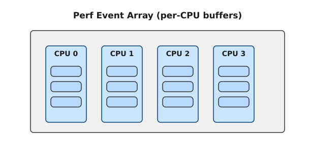
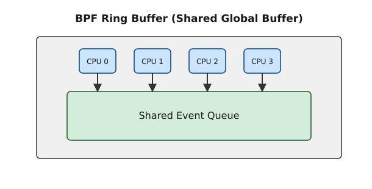

<preknowlist>
- Базові знання про механізми eBPF (розширені Berkeley Packet Filters) в ядрі Linux.
- Розуміння концепції BPF Maps (карт BPF), їх ролі для передачі даних між простором ядра та простором користувача (kernel space vs user space).
- Загальні знання про механізми поллінгу (epoll) та кільцеві буфери.
- Базовий досвід використання libbpf для написання BPF-програм.
</preknowlist>

# Порівняльний аналіз механізмів доставки подій BPF Ring Buffer vs Perf Event Array

Розробка сучасних засобів спостережливості (observability) в ОС Linux немислима без технології eBPF. Одним з ключових аспектів роботи eBPF є передача зібраних даних з простору ядра до застосунків у просторі користувача. Історично стандартом де-факто для цього завдання була карта `BPF_MAP_TYPE_PERF_EVENT_ARRAY` (скорочено `perfbuf`). Проте з виходом ядра Linux 5.8 з'явилася нова, більш оптимізована альтернатива — `BPF_MAP_TYPE_RINGBUF` (`ringbuf`). 

Ця стаття є детальним та комплексним порівняльним аналізом цих двох механізмів. Ми дослідимо їхню архітектуру, принципи роботи, продуктивність (зокрема, затримки та використання пам'яті), гарантії впорядкування подій (global ordering), а також надамо практичні рекомендації щодо міграції з `perfbuf` на `ringbuf` з використанням сучасного API `libbpf` (функції `bpf_ringbuf_reserve`, `bpf_ringbuf_submit` тощо).

## 1. Архітектурні відмінності: Per-CPU vs Global Shared Buffer

Фундаментальна різниця між цими двома механізмами полягає у тому, як вони організовують пам'ять для буферів та як відбувається доступ до них з різних ядер процесора (CPU).

### 1.1 Perf Event Array (`perfbuf`)

Карти типу `BPF_MAP_TYPE_PERF_EVENT_ARRAY` використовують архітектуру *per-CPU* буферів. Це означає, що для кожного логічного процесора (CPU) в системі створюється окремий кільцевий буфер.


*Рис. 1. Архітектура Perf Event Array: кожен CPU має свій ізольований буфер.*

**Переваги per-CPU архітектури:**
1. **Відсутність конкуренції (Contention):** Оскільки кожне ядро пише лише у свій власний буфер, немає потреби у складних механізмах блокування (locks) або атомарних операціях на етапі запису (producer side). Це забезпечує мінімальний overhead при додаванні нових подій з BPF-програми.
2. **Локальність кешу (Cache Locality):** Робота з локальними структурами даних позитивно впливає на використання L1/L2 кешів процесора.

**Недоліки per-CPU архітектури:**
1. **Неефективне використання пам'яті:** Розмір буфера задається однаково для всіх CPU. У реальних системах навантаження часто буває незбалансованим: одні ядра (наприклад, ті, що обробляють переривання мережевої карти) можуть генерувати тисячі подій за мілісекунду, тоді як інші ядра простоюють. Щоб уникнути втрати подій (drops) на навантажених ядрах, розробники змушені виділяти великі буфери для *всіх* ядер, що призводить до значного марнотратства оперативної пам'яті.
2. **Відсутність глобального впорядкування (Global Ordering):** Події, що виникають на різних ядрах, потрапляють у різні буфери. Коли простір користувача читає ці буфери (через epoll), він отримує події з різних буферів несинхронно. Відновлення хронологічного порядку вимагає додаткових зусиль (наприклад, додавання мітки часу в кожну подію та подальше сортування в user-space), що збільшує затримки та витрати процесорного часу.
3. **Overhead поллінгу:** Для пробудження простору користувача використовується механізм IPI (Inter-Processor Interrupt). При великій кількості CPU та інтенсивному потоці подій, це створює значне навантаження на систему.

### 1.2 BPF Ring Buffer (`ringbuf`)

Карта `BPF_MAP_TYPE_RINGBUF` (доступна починаючи з ядра 5.8) вирішує вищезгадані проблеми, використовуючи єдиний, спільний (shared) кільцевий буфер для всіх CPU.


*Рис. 2. Архітектура BPF Ring Buffer: єдиний буфер, спільний для всіх CPU.*

**Як вирішується проблема конкуренції?**
Спільний буфер вимагає синхронізації між ядрами. Розробники ядра Linux реалізували надзвичайно ефективний lockless механізм, використовуючи атомарні операції для резервування місця в буфері.
- Спочатку BPF-програма резервує слот у буфері (`bpf_ringbuf_reserve`). Це єдина операція, що вимагає атомарності і може викликати contention.
- Після успішного резервування, BPF-програма безпечно записує дані у свій слот.
- Нарешті, програма публікує слот (`bpf_ringbuf_submit`), роблячи дані видимими для простору користувача. Ця операція є дуже легкою.

Завдяки тому, що резервування є короткочасним (буквально кілька інструкцій), contention залишається на мінімальному рівні навіть на системах з великою кількістю ядер.

**Переваги Ring Buffer:**
1. **Глобальне впорядкування (Total Order):** Події потрапляють у буфер у тому порядку, в якому для них було зарезервовано місце (хронологічно). Простір користувача отримує події вже відсортованими, що кардинально спрощує логіку обробки.
2. **Ефективне використання пам'яті:** Загальний буфер динамічно адаптується до дисбалансу навантаження між ядрами. Якщо одне ядро генерує 99% подій, воно просто використає відповідну частку спільного буфера. Це дозволяє значно зменшити загальний розмір виділеної пам'яті порівняно з per-CPU підходом.
3. **Менший overhead (включаючи IPI):** Механізм повідомлень (notifications) у Ring Buffer оптимізовано. Він надсилає wake-up сигнали лише тоді, коли це дійсно необхідно, зменшуючи непотрібні IPI та context switches.

## 2. API та практичне використання (libbpf)

Розглянемо, як виглядає код (в ядрі та в просторі користувача) для обох підходів.

### 2.1 Код BPF (Ядро)

**Perf Event Array:**
У класичному підході з `perfbuf` ми використовуємо `bpf_perf_event_output`. Ця функція копіює дані, підготовлені на стеку, безпосередньо у відповідний per-CPU буфер.

```c
// BPF-код для perfbuf
struct {
    __uint(type, BPF_MAP_TYPE_PERF_EVENT_ARRAY);
    __uint(key_size, sizeof(int));
    __uint(value_size, sizeof(int));
} events SEC(".maps");

SEC("kprobe/sys_execve")
int bpf_prog_perfbuf(struct pt_regs *ctx) {
    struct event_t event = {};
    // ... заповнення події ...
    
    // Копіювання події в буфер поточного CPU
    bpf_perf_event_output(ctx, &events, BPF_F_CURRENT_CPU, &event, sizeof(event));
    return 0;
}
```

**BPF Ring Buffer:**
З `ringbuf` з'являється двокроковий підхід: `reserve` та `submit` (або `discard`). Це усуває необхідність у додатковому копіюванні даних (zero-copy), оскільки BPF-програма записує дані безпосередньо в область пам'яті буфера, а не на стек.

```c
// BPF-код для ringbuf
struct {
    __uint(type, BPF_MAP_TYPE_RINGBUF);
    __uint(max_entries, 256 * 1024); // Розмір буфера в байтах
} events SEC(".maps");

SEC("kprobe/sys_execve")
int bpf_prog_ringbuf(struct pt_regs *ctx) {
    struct event_t *event;
    
    // 1. Резервування місця в глобальному буфері
    event = bpf_ringbuf_reserve(&events, sizeof(*event), 0);
    if (!event)
        return 0; // Буфер переповнений (drop)
        
    // 2. Прямий запис у пам'ять буфера (без копіювання зі стека!)
    // ... заповнення події ...
    
    // 3. Публікація події
    bpf_ringbuf_submit(event, 0);
    return 0;
}
```

Можливість уникнути виділення великих структур на BPF-стеку (який обмежений 512 байтами) є ще однією величезною перевагою `bpf_ringbuf_reserve`. У випадку `perfbuf`, якщо подія більша за 512 байт, розробникам доводилося використовувати хаки (наприклад, Per-CPU Arrays) для зберігання тимчасових даних. З `ringbuf` ця проблема зникає.

Крім того, є зручна функція-обгортка `bpf_ringbuf_output`, яка працює аналогічно `bpf_perf_event_output` (копіює дані), але використовує кільцевий буфер:

```c
    bpf_ringbuf_output(&events, &event, sizeof(event), 0);
```

### 2.2 Простір користувача (libbpf)

Бібліотека `libbpf` надає зручні абстракції для обох механізмів.

**Perf Event Array (User Space):**

```c
void handle_event(void *ctx, int cpu, void *data, __u32 data_sz) {
    // Обробка події
}

// ...
struct perf_buffer_opts pb_opts = {};
pb_opts.sample_cb = handle_event;
struct perf_buffer *pb = perf_buffer__new(bpf_map__fd(skel->maps.events), 8 /* pages */, &pb_opts);

// Цикл поллінгу (викликає epoll)
while (true) {
    perf_buffer__poll(pb, 100 /* timeout ms */);
}
```

**BPF Ring Buffer (User Space):**

```c
int handle_event(void *ctx, void *data, size_t data_sz) {
    // Обробка події
    return 0;
}

// ...
struct ring_buffer *rb = ring_buffer__new(bpf_map__fd(skel->maps.events), handle_event, NULL, NULL);

// Цикл поллінгу (викликає epoll)
while (true) {
    ring_buffer__poll(rb, 100 /* timeout ms */);
}
```

Інтерфейс дуже схожий, але зверніть увагу: callback для `ringbuf` не отримує номер CPU, оскільки події вже впорядковані. Міграція існуючих проектів з `perfbuf` на `ringbuf` в user space зазвичай є тривіальною задачею.

## 3. Порівняльний бенчмарк та вимірювання (Performance & Overhead)

Щоб зробити об'єктивний вибір, необхідно проаналізувати продуктивність в різних сценаріях. На практиці `ringbuf` демонструє чудові результати і часто перевершує `perfbuf`.

### 3.1 Споживання пам'яті (Memory Overhead)

Як згадувалося раніше, `perfbuf` виділяє пам'ять окремо для кожного ядра.
Припустимо, ми маємо сервер з 128 ядрами (CPU). Ми хочемо мати буфер, достатній для зберігання сплесків подій, скажімо, 1 МБ.
- **Perfbuf:** 1 МБ * 128 CPU = 128 МБ.
- **Ringbuf:** 2 МБ - 4 МБ загалом задовольнять ті ж потреби завдяки спільному доступу.

Це означає, що **Ring Buffer може заощадити десятки або сотні мегабайт пам'яті** в системах з великою кількістю ядер.

### 3.2 Затримки та пропускна здатність (Latency & Throughput)

Бенчмарки ядра Linux показують такі тенденції:

1. **Одноядерний сценарій:** `ringbuf` перевершує `perfbuf` за рахунок архітектури zero-copy та зменшення накладних витрат. Функція `bpf_ringbuf_reserve` дуже оптимізована.
2. **Багатоядерний сценарій з рівномірним навантаженням:** `perfbuf` може показати дещо кращу максимальну пропускну здатність при екстремально високих навантаженнях, оскільки абсолютно не має contention між ядрами. Однак `ringbuf` також масштабується дуже добре завдяки оптимізованим атомарним операціям.
3. **Обробка в просторі користувача (споживання CPU):** Збір подій з 128 окремих буферів (`perfbuf`) вимагає набагато більше контекстних перемикань, циклів та обробки IPI в просторі користувача. Завдяки одному спільному буферу та впорядкованому потоку подій, процес в user space (наприклад, агент моніторингу) споживає значно менше процесорного часу при використанні `ringbuf`.

### 3.3 Втрата подій (Event Drops)

Втрата подій відбувається, коли BPF-програма генерує події швидше, ніж user space встигає їх прочитати, і буфер переповнюється.
З `perfbuf` втрати часто трапляються локально: одне перевантажене ядро може швидко заповнити свій буфер і почати втрачати події, тоді як буфери інших ядер стоять порожні.
З `ringbuf` вся доступна пам'ять буфера використовується для згладжування сплесків навантаження (bursts) з будь-якого ядра, що статистично призводить до значно меншої кількості drop-ів.

## 4. Висновки: Коли що використовувати?

Виходячи з нашого детального порівняльного аналізу, можна сформулювати наступні рекомендації.

**BPF Ring Buffer (BPF_MAP_TYPE_RINGBUF) — це новий стандарт.**
Його слід використовувати у **більшості нових проектів**, особливо якщо:
- Вам необхідне збереження хронологічного порядку подій (Total Order).
- Ви розробляєте для систем з великою кількістю ядер і хочете оптимізувати споживання пам'яті.
- Ви передаєте великі об'єкти (понад 512 байт), і zero-copy через `bpf_ringbuf_reserve` дозволяє уникнути проблем зі стеком.
- Ви використовуєте відносно сучасні ядра (Linux 5.8+).

**Perf Event Array (BPF_MAP_TYPE_PERF_EVENT_ARRAY) залишається актуальним лише у випадках:**
- Необхідність підтримки старих ядер (Linux < 5.8). Це найчастіша причина, чому багато проектів досі підтримують `perfbuf`. Деякі Enterprise Linux дистрибутиви (наприклад, RHEL 7/8 з ядрами 3.10/4.18) не підтримують `ringbuf`.
- Дуже специфічні edge-cases з екстремальним навантаженням (мільйони подій на секунду рівномірно з усіх ядер), де навіть мінімальний contention від атомарних операцій `ringbuf` може стати вузьким місцем.

Загалом, поява `ringbuf` значно спростила розробку eBPF-застосунків та зробила їх ще більш продуктивними та ефективними.

> [!TIP]
> У сучасних версіях libbpf з'явилася можливість прозорого фолбеку. Ви можете використовувати BPF Ring Buffer там, де він підтримується, і прозоро деградувати до Perf Event Array на старіших ядрах, використовуючи макроси ядра або абстракції вищого рівня в просторі користувача.

## 5. Додаткові матеріали
- Документація ядра Linux (BPF Ring Buffer)
- Матеріали Andrii Nakryiko (розробника BPF Ring Buffer)
- Довідник libbpf (ring_buffer)
