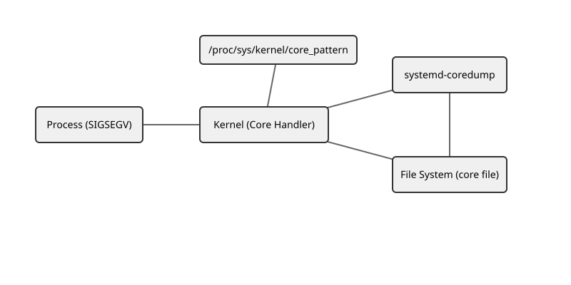
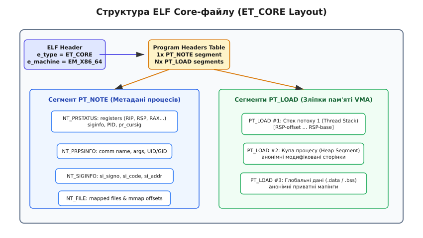

# Аварійний дамп: як налаштувати й що з нього видно

<preknowlist>
- [Модель процесів Unix](book:unix-linux/process-model) — віртуальний простір адрес, потоки, сигнали та завершення процесів.
- [Архітектура procfs та структура /proc/[pid]](book:unix-linux/procfs-architecture-and-proc-pid) — віртуальні файлові системи для керування параметрами ядра.
- [ptrace: повний контроль над чужим процесом](book:unix-linux/ptrace-and-debugging) — перехоплення стану та аналіз процесів під час виконання.
</preknowlist>

Серверний процес на C++ працює в терміналі чи під управлінням daemon-менеджера, обробляє тисячі запитів за секунду і раптово припиняє виконання з системним повідомленням `Segmentation fault (core dumped)`. У системному логу відсутні додаткові пояснення: процес просто зник із таблиці активних задач, залишивши клієнтів із розірваними TCP-з'єднаннями. У реальному середовищі неможливо зупинити продакшн-сервер під інтерактивним зневаджувачем GDB і чекати кілька днів на повторення плаваючої помилки пам'яті. Єдиним джерелом точних фактів про причину аварії стає аварійний дамп (core dump) — посмертний зліпок віртуального адресного простору та стану регістрів процесора на момент виникнення фатальної помилки.

## Анатомія краху: як і коли ядро створює аварійний дамп

Виникнення аварійного дампа є результатом взаємодії між апаратними механізмами захисту пам'яті процесора, підсистемою обробки сигналів ядра Linux та конфігурацією ресурсних обмежень процесу. 

Коли програма виконує некоректну операцію — наприклад, намагається записати дані за адресою `0x0`, прочитати пам'ять з чужого адресного простору або виконати зарезервовану інструкцію, яку не підтримує поточний процесор, — центральний процесор генерує апаратне переривання (hardware trap / fault). Обробник переривання в ядрі Linux трансформує це переривання у відповідний POSIX-сигнал і надсилає його потоку, який зробив некоректну операцію.

В операційній системі Linux кожному сигналу відповідає стандартна дія за замовчуванням (default signal action). Сигнали поділяються на такі, що просто завершують процес (`Term`), та такі, що викликають завершення з генерацією аварійного дампа (`Core`).

До основних сигналів категорії `Core` належать:
- `SIGSEGV` (сигнал 11, Segmentation Violation) — виникає при порушенні прав доступу до сторінки пам'яті (наприклад, спроба запису у сторінку, позначену лише для читання) або при доступі до невідображеної (unmapped) адреси.
- `SIGABRT` (сигнал 6, Process Abort) — надсилається самою програмою через системний виклик `abort()`. Зазвичай це відбувається при спрацюванні перевірок `assert()`, критичних помилках у пам'яті аллокатора (`double free or corruption`) або при неперехоплених винятках C++ (`std::terminate`).
- `SIGFPE` (сигнал 8, Floating-Point Exception) — виникає при некоректних арифметичних операціях, зокрема при діленні на нуль для цілих чисел чи переповненні чисел із рухомою комою.
- `SIGILL` (сигнал 4, Illegal Instruction) — виникає, коли процесор декодує неіснуючий або заповнений сміттям опкод інструкції.
- `SIGBUS` (сигнал 7, Bus Error) — виникає при спробі доступу до пам'яті з порушенням фізичного вирівнювання (misaligned access) або при намаганні зчитати сторінку з відображеного через `mmap()` файлу, розмір якого був зменшений іншим процесом.
- `SIGQUIT` (сигнал 3, Keyboard Quit) — генерується інтерактивним терміналом при натисканні комбінації клавіш `Ctrl+\`.
- `SIGSYS` (сигнал 31, Bad System Call) — генерується підсистемою фільтрації Seccomp, коли процес намагається виконати заборонений системний виклик.

Послідовність дій ядра при настанні аварійної ситуації зображено на схематичному графіку нижче:


*Схема проходження аварійного дампа: від системного сигналу ядра до збереження стисненого файлу у systemd-coredump та аналізу в GDB.*

Коли потік отримує сигнал із дефолтною дією `Core`, ядро передає керування функції `do_coredump()`, розташованій у системному модулі ядра `fs/coredump.c`. Процес генерації дампа складається з п'яти послідовних етапів:

1. **Призупинення групи потоків (`zap_threads`)**: Ядро надсилає внутрішній сигнал зупинки всім іншим потокам процесу (thread group). Це гарантує, що стан віртуальної пам'яті та регістрів процесора буде заморожено в єдиний момент часу, запобігаючи виникненню "змазаних" знімків (race conditions під час запису).
2. **Перевірка ресурсних обмежень (`RLIMIT_CORE`)**: Ядро перевіряє значення поточного м'якого ліміту `RLIMIT_CORE`. Якщо ліміт дорівнює `0`, генерація дампа негайно переривається, і процес просто знищується.
3. **Перевірка прав доступу та сумісності (`suid_dumpable`)**: Якщо процес виконувався з підвищеними привілеями (SUID/SGID) або змінював свої UID/GID у процесі роботи, ядро перевіряє системний параметр `/proc/sys/fs/suid_dumpable`. Це запобігає витоку приватної інформації привілейованих процесів у звичайні файли.
4. **Визначення адресата запису (`core_pattern`)**: Ядро зчитує параметр `/proc/sys/kernel/core_pattern`. Якщо параметр починається з символу `|`, дамп передається через конвеєр (pipe) у простір користувача фоновому сервісу. Якщо ні — ядро створює файл на диску.
5. **Серіалізація пам'яті та регістрів**: Ядро ітерує по таблиці віртуальних областей пам'яті (VMA) процесу та формує структурований ELF-файл, який містить метадані потоків у сегменті `PT_NOTE` та вміст сторінок пам'яті у сегментах `PT_LOAD`.

📜 Історичний підтекст назви цього механізму та еволюцію від магнітних осердь 1950-х років детально описано у вставці [Історія аварійного дампа: від феритової пам'яті до systemd-coredump](book:unix-linux/core-dump/hist-magnetic-core.md).

## Анатомія ELF Core-файлу: що саме зберігається у дамп-зліпку

Згенерований аварійний дамп не є сирим бінарним дампами всієї фізичної оперативної пам'яті комп'ютера. Це строго структурований файл у стандартному форматі **ELF (Executable and Linkable Format)** із типом заголовка `ET_CORE`.

Завдяки уніфікованій структурі ELF, інструменти налагодження (такі як GDB, LLDB або `objdump`) сприймають файл `core` аналогічно до звичайного виконуваного бінарника чи динамічної бібліотеки.


*Анатомія файлу ET_CORE: поєднання заголовка ELF, таблиці програмних заголовків, сегмента метаданих PT_NOTE та сегментів даних PT_LOAD.*

Вміст ELF Core-файлу ділиться на три основні частини:

### 1. Заголовок ELF та таблиця Program Headers

Файл починається з класичного заголовка `Elf64_Ehdr`. В цьому заголовку поле `e_type` має значення `ET_CORE` (значення `4`), поле `e_machine` вказує архітектуру (наприклад `EM_X86_64` або `EM_AARCH64`), а поле `e_phoff` вказує на початок таблиці заголовків програм (`Program Headers Table`). 

На відміну від виконуваних файлів, файл `ET_CORE` не містить секцій (`Section Headers`, таких як `.text`, `.rodata` чи `.bss`). Замість секцій вся інформація описується виключно через програмні заголовки двох типів: `PT_NOTE` та `PT_LOAD`.

### 2. Сегмент метаданих `PT_NOTE`

Сегмент `PT_NOTE` містить набір спеціалізованих структур даних (ELF Notes), які описують процесорний та системний стан процесу на момент краху. 

Кожна нота у сегменті складається зі стандартизованого заголовка `Elf64_Nhdr`, який вказує довжину імені емітента, довжину даних та тип ноти, за яким слідує ім'я емітента (зазвичай рядок `"CORE"` або `"LINUX"`) та самі структури даних.

Основні записи всередині `PT_NOTE`:

- **`NT_PRSTATUS` (`struct elf_prstatus`)**: Найважливіша структура, яка створюється для кожного потоку процесу. Вона містить:
  - `pr_info`: розширена інформація про сигнал (`siginfo_t`).
  - `pr_cursig`: номер сигналу, що спричинив зупинку потоку.
  - `pr_pid`: ідентифікатор потоку (TID).
  - `pr_ppid`: ідентифікатор батьківського процесу.
  - `pr_reg`: масив збережених регістрів загального призначення процесора (`user_regs_struct`). На архітектурі x86_64 сюди входять значення регістрів `RIP` (Instruction Pointer, адреса інструкції, де сталася аварія), `RSP` (Stack Pointer), `RBP` (Base Pointer), `RAX`, `RBX`, `RCX`, `RDX`, `RDI`, `RSI`, `R8`–`R15` та `EFLAGS`.
- **`NT_PRFPREG`**: Містить стан регістрів плаваючої коми (FPU), а також розширених векторних регістрів SSE, AVX та AVX-512. На сучасних системах для збереження розширеного стану AVX-512 також використовується додаткова нота `NT_X86_XSTATE`.
- **`NT_PRPSINFO` (`struct elf_prpsinfo`)**: Загальні метадані процесу: стан (running, sleeping, zombie), ім'я виконуваного бінарника (`pr_fname`), повний командний рядок запуску (`pr_psargs`), а також UID та GID власника.
- **`NT_SIGINFO` (`siginfo_t`)**: Детальна інформація про сигнал. Для `SIGSEGV` сюди входить поле `si_addr` (конкретна віртуальна адреса пам'яті, спроба доступу до якої викликала крах) та причинний код `si_code` (наприклад, `SEGV_MAPERR` — адреса не відображена, або `SEGV_ACCERR` — порушення прав доступу).
- **`NT_FILE`**: Таблиця відображених у пам'яті файлів. Вона має чітку бінарну структуру: спочатку йде число вивантажених елементів `count` та розмір сторінки `page_size`, після чого розташовано масив трійок адрес `[start_addr, end_addr, file_offset]`, а в кінці записано нуль-терміновані файлові шляхи. Містить список усіх виконуваних модулів, спільних бібліотек (`.so`) та файлів `mmap()`, підключених у віртуальний простір процесу. Це дозволяє ядру не дублювати в файл `core` незмінений вміст коду бібліотек з диска, зберігаючи гігабайти дискового простору.
- **`NT_AUXV`**: Таблиця допоміжного вектора завантажувача (auxiliary vector). Передає налагоджувачу параметри, які ядро надало динамічному завантажувачу `ld-linux.so` при старті (розмір сторінки `AT_PAGESZ`, адресу заголовків `AT_PHDR`, адресу точки входу `AT_ENTRY`).

### 3. Сегменти сторінок пам'яті `PT_LOAD`

Кожен сегмент `PT_LOAD` описує суцільний блок віртуальних адрес процесу (Virtual Memory Area, VMA), вміст якого був фізично виділений в оперативній пам'яті на момент аварії. 

При формуванні сегментів `PT_LOAD` ядро сканує масив VMA через внутрішній ітератор `vma_iterator` і перевіряє прапорці доступу сторінок (`VM_READ`, `VM_WRITE`, `VM_EXEC`, `VM_SHARED`, `VM_DONTDUMP`). 

Сюди потрапляють:
- Стек кожного потоку процесу (від адреси верхівки стеку `RSP` до базової адреси стеку).
- Динамічна купа (heap), виділена через `brk()` або `malloc()`.
- Анонімні модифіковані сторінки пам'яті (`mmap(MAP_PRIVATE | MAP_ANONYMOUS)`).
- Глобальні змінні та модифіковані секції даних (`.data`, `.bss`).

Які саме сторінки вивантажуються у сегменти `PT_LOAD`, контролюється маскою `/proc/<pid>/coredump_filter`. За замовчуванням ядро виключає з дампа незмінені сторінки коду (`.text`), щоб зменшити підсумковий розмір файлу.

## Конфігурація та обмеження генерації (RLIMIT_CORE, core_pattern, suid_dumpable)

У більшості свіжих дистрибутивів Linux створення аварійних дампів для звичайних користувачів початково обмежено. Це зроблено для захисту дискового простору від раптового переповнення, оскільки один крах сервісу з 32 ГБ оперативної пам'яті може миттєво заповнити системний розділ.

Для точного керування дампуванням ядро Linux надає три незалежні рівні конфігурації.

### 1. Механізм ресурсних обмежень `RLIMIT_CORE`

На рівні кожного процесу розмір створюваного файлу дампа обмежується лімітом `RLIMIT_CORE`. Ліміт вимірюється у байтах і має дві межі: soft (м'яку) та hard (жорстку). М'яка межа визначає поточний дозволений розмір для процесу, а жорстка межа встановлює абсолютну стелю, змінити яку вгору може лише суперкористувач `root`.

Перевірити та змінити поточний ліміт у сесії командного рядка можна за допомогою команд оболонки `ulimit` (для `bash` / `zsh`):

```bash
# Перевірити поточний soft-ліміт (у блоках по 512 байт або 'unlimited')
$ ulimit -c
0

# Дозволити створення дампів необмеженого розміру для поточної сесії
$ ulimit -c unlimited
```

Якщо значення `RLIMIT_CORE` дорівнює `0`, ядро повністю пропускає етап створення дампа. Якщо значення встановлено у байтах (наприклад `104857600` — 100 МБ), ядро створить дамп, але обріже його до вказаного розміру, якщо він перевищує ліміт. 

⚠️ **Важливо**: Обрізаний (truncated) аварійний дамп часто стає непридатним для аналізу в GDB, оскільки ядро може не встигнути записати ключові сегменти стеку або таблицю `PT_NOTE`.

Для постійної конфігурації лімітів у системі редагують файл `/etc/security/limits.conf`:

```text
# /etc/security/limits.conf
# Дозволити створення core dumps будь-якого розміру для всіх користувачів
*               soft    core            unlimited
*               hard    core            unlimited
```

Для системних демонів під управлінням `systemd` ліміт встановлюється у юніт-файлі `.service`:

```ini
[Service]
# Зняти обмеження на розмір аварійного дампа для цього сервісу
LimitCORE=infinity
```

### 2. Шаблонізація та конвеєризація `/proc/sys/kernel/core_pattern`

Параметр ядра `/proc/sys/kernel/core_pattern` вказує ядру, куди саме записувати аварійний дамп.

Якщо параметр містить звичайний шлях, ядро створює файл на файловій системі, замінюючи спеціальні специфікатори (`%p` на PID, `%e` на ім'я програми, `%t` на timestamp):

```bash
# Встановити шаблон збереження у каталог /var/coredumps/
$ echo "/var/coredumps/core.%e.%p.%t" > /proc/sys/kernel/core_pattern
```

Якщо рядок починається з символу конвеєра `|`, ядро не створює файл безпосередньо. Воно запускає вказаний утилітарний процес у просторі користувача і передає йому байтовий потік дампа через `stdin`.

📋 Вичерпний перелік усіх 12 специфікаторів шаблону `%`, бітові прапорці `coredump_filter` та налаштування `suid_dumpable` зведено у довіднику [Специфікація core_pattern та параметрів ядра](book:unix-linux/core-dump/api-core-pattern.md).

## Сучасна інфраструктура: systemd-coredump та coredumpctl

У сучасних дистрибутивах Linux (Ubuntu, Debian, RHEL, Fedora, Arch) керування аварійними дампами повністю делеговано підсистемі **`systemd-coredump`**.

Конфігурація `/proc/sys/kernel/core_pattern` у таких системах має вигляд:
```text
|/usr/lib/systemd/systemd-coredump %P %u %g %s %t %c %h
```

Коли відбувається крах будь-якого процесу, ядро запускає `systemd-coredump` через pipe. Утиліта виконує такі операції:

1. **Стискання даних**: Дамп стискається на льоту за допомогою алгоритму `zstd` (або `lz4`), що зменшує розмір файлу на диску в 5–10 разів.
2. **Збереження в системний каталог**: Стиснений файл зберігається у каталозі `/var/lib/systemd/coredump/` з ім'ям виду `core.<executable>.<uid>.<boot_id>.<pid>.<timestamp>.zst`.
3. **Індексація у Journald**: Метадані про аварію (PID, UID, GID, сигнал, командний рядок, стан cgroups, а також короткий трасування стеку `backtrace`) записуються в журнал `systemd-journald`.
4. **Автоматична ротація**: Згідно з конфігураційним файлом `/etc/systemd/coredump.conf`, сервіс стежить за вільним місцем на диску (`KeepFree`) та максимальним обсягом сховища дампів (`MaxUse`), видаляючи застарілі файли.

Для роботи з накопиченими дампами використовується утиліта командного рядка **`coredumpctl`**:

```bash
# Переглянути список усіх аварій у системі
$ coredumpctl list

# Переглянути детальну інформацію про останній крах конкретного сервісу
$ coredumpctl info my_service

# Витягнути та розпакувати файл дампа для конкретного PID
$ coredumpctl dump 14230 -o /tmp/core.14230

# Автоматично розпакувати дамп і відкрити його в інтерактивній сесії GDB
$ coredumpctl debug my_service
```

Завдяки `coredumpctl debug` розробникові більше не потрібно вручну шукати відповідальний виконуваний бінарник та витягати стиснені `.zst` файли з системних каталогів.

## Практичний розбір аварійного дампа в GDB

Для того щоб аварійний дамп був корисним при зневадженні, виконуваний файл повинен містити відлагоджувальну інформацію (debug symbols, таблиці DWARF). У мовах C та C++ це досягається компіляцією з прапором `-g` (`g++ -g main.cpp`). Якщо символи було відокремлено від основного бінарника (strip), налагоджувачу необхідно вказати шлях до файлу символів `.debug` або налаштувати `debuginfod`.

Розглянемо практичний приклад коду, що падає через розіменування нульового вказівника:

:::tabs
== C++
```cpp
#include <iostream>

struct DatabaseConfig {
    std::string host;
    uint16_t port;
};

void connect_to_database(DatabaseConfig* config) {
    // Якщо config дорівнює nullptr, спроба прочитати config->host викликає SIGSEGV
    std::cout << "Connecting to host: " << config->host << std::endl;
}

int main() {
    DatabaseConfig* cfg = nullptr;
    connect_to_database(cfg);
    return 0;
}
```
== C
```c
#include <stdio.h>
#include <stdint.h>

typedef struct {
    char host[64];
    uint16_t port;
} database_config_t;

void connect_to_database(database_config_t* config) {
    // Якщо config дорівнює NULL, спроба прочитати config->host викликає SIGSEGV
    printf("Connecting to host: %s\n", config->host);
}

int main(void) {
    database_config_t* cfg = NULL;
    connect_to_database(cfg);
    return 0;
}
```
:::

Після компіляції (`g++ -g db_app.cpp -o db_app`) та запуску програма завершується з помилкою `Segmentation fault (core dumped)`.

Відкриваємо файл аварійного дампа у GDB:

```bash
$ gdb ./db_app /var/lib/systemd/coredump/core.db_app...
```

Після завантаження дампа виконуємо стандартну послідовність аналітичних команд у консолі GDB:

1. **`backtrace` (або `bt`)**: Виводить стек викликів функцій у момент краху.
2. **`bt full`**: Виводить стек викликів разом із значеннями всіх локальних змінних у кожному стековому фреймі.
3. **`frame N`**: Переключає контекст налагоджувача на стековий фрейм номер `N`.
4. **`print variable` (або `p variable`)**: Друкує значення змінної або вміст структури за вказівником.
5. **`info registers`**: Виводить поточний вміст усіх регістрів процесора.
6. **`thread apply all bt`**: Виводить зворотне простеження стеку для всіх активних потоків багатопотокового процесу.

```text
(gdb) bt
#0  0x00005555555551c9 in connect_to_database (config=0x0) at db_app.cpp:11
#1  0x00005555555551f3 in main () at db_app.cpp:16

(gdb) frame 0
#0  0x00005555555551c9 in connect_to_database (config=0x0) at db_app.cpp:11
11          std::cout << "Connecting to host: " << config->host << std::endl;

(gdb) print config
$1 = (DatabaseConfig *) 0x0
```

Команда `print config` чітко показує, що параметр `config` мав значення `0x0` (null pointer), що негайно пояснює причину виникнення `SIGSEGV` при розіменуванні поля `config->host`.

⚙️ Повний практичний кейс аналізу складного багатопотокового краху з розбором регістрів та залишків стеку винесено у проєктний матеріал [Аналіз пам'яті та залишків стеку в GDB](book:unix-linux/core-dump/proj-gdb-core-analysis.md).

## Наслідки, продуктивність та безпека

Застосування аварійних дампів у реальних виробничих середовищах вимагає врахування двох критичних факторів: продуктивності системи та безпеки даних.

### 1. Вплив на продуктивність та системне введення-виведення (I/O Stall)

Коли процес із великим обсягом оперативної пам'яті (наприклад, СУБД Redis, PostgreSQL або Java-додаток з печінкою у 64 ГБ RAM) зазнає краху, ядро призупиняє процес і починає вивантажувати гігабайти сторінок пам'яті на диск або через конвеєр.

Це спричиняє такі проблеми:
- **Spike системного I/O**: Запис гігабатного файлу створює високе навантаження на диск (I/O saturation), що підвищує затримки (latency) для всіх інших сервісів, які працюють на тому самому сервері.
- **Ризик OOM (Out Of Memory)**: Якщо обробник (наприклад `systemd-coredump`) буферизує дамп у пам'яті перед стисканням, це може викликати додаткову нестачу RAM і спровокувати OOM Killer.
- **Накопичення дампів**: Часті крахи сервісу у циклі перезапуску (`CrashLoopBackOff`) можуть за лічені хвилини повністю заповнити дисковий простір сервера.

Для мінімізації цих ризиків у виробничих системах обмежують `RLIMIT_CORE`, налаштовують ротацію у `systemd-coredump.conf` та виключають непотрібні типи пам'яті через `coredump_filter`.

### 2. Безпека даних та витік конфіденційної інформації

Аварійний дамп містить **точний знімок оперативної пам'яті процесу**. Це означає, що у файл `core` потрапляють:
- Паролі користувачів та хеші авторизації у відкритому вигляді.
- Приватні ключі SSL/TLS та SSH.
- Токени доступу (JWT, API keys), сесійні куки.
- Персональні дані користувачів (PII), які оброблялися у пам'яті в момент аварії.

Якщо файли `core` створюються у загальнодоступних каталогах (наприклад `/tmp`), будь-який локальний користувач або зловмисник із обмеженими правами може прочитати дамп і отримати доступ до секретів системи.

Для захисту конфіденційних даних застосовують такі заходи:
1. **Захист системних викликів**: Використання системного виклику `madvise()` з прапором `MADV_DONTDUMP` для сторінок пам'яті, де зберігаються приватні ключі або критичні секрети. Ядро автоматично пропускатиме такі сторінки при формуванні сегментів `PT_LOAD`:

:::tabs
== C++
```cpp
#include <sys/mman.h>
#include <iostream>
#include <vector>

void protect_sensitive_memory() {
    size_t size = 4096; // 1 сторінка пам'яті
    void* secret_buffer = mmap(nullptr, size, PROT_READ | PROT_WRITE, 
                               MAP_PRIVATE | MAP_ANONYMOUS, -1, 0);
    
    if (secret_buffer != MAP_FAILED) {
        // Вказуємо ядру НЕ включати цю область у core dump
        madvise(secret_buffer, size, MADV_DONTDUMP);
        
        // Записуємо чутливі дані (наприклад, приватний ключ)
        // ...
        
        munmap(secret_buffer, size);
    }
}
```
== C
```c
#include <sys/mman.h>
#include <stdio.h>

void protect_sensitive_memory(void) {
    size_t size = 4096; // 1 сторінка пам'яті
    void* secret_buffer = mmap(NULL, size, PROT_READ | PROT_WRITE, 
                               MAP_PRIVATE | MAP_ANONYMOUS, -1, 0);
    
    if (secret_buffer != MAP_FAILED) {
        // Вказуємо ядру НЕ включати цю область у core dump
        madvise(secret_buffer, size, MADV_DONTDUMP);
        
        // Записуємо чутливі дані (наприклад, приватний ключ)
        // ...
        
        munmap(secret_buffer, size);
    }
}
```
:::

2. **Обмеження прав доступу**: Встановлення суворих прав доступу (`0600`) на файли дампів та обмеження прав доступу до каталогу `/var/lib/systemd/coredump/` лише для групи `systemd-journal` та користувача `root`.
3. **Використання `suid_dumpable = 2`**: Гарантує, що дампи привілейованих процесів записуватимуться виключно у закриті системні каталоги.

### 3. Співвіднесення адрес у рандомізованому просторі (ASLR)

Сучасні операційні системи за замовчуванням використовують механізм **ASLR (Address Space Layout Randomization)**, який випадковим чином змінює базові адреси завантаження виконуваного бінарника та спільних бібліотек при кожному запуску програми.

При аналізі аварійного дампа GDB успішно відновлює початкові адреси завдяки заголовочним записам `NT_FILE` та `NT_AUXV` у сегменті `PT_NOTE`. Вони містять точні базові адреси зсуву для кожного виконуваного модуля на момент аварії. Це дозволяє налагоджувачу зіставити адреси інструкцій із зсувами у файлах символів на диску і показати точний рядок вихідного коду, де виникла фатальна помилка.
