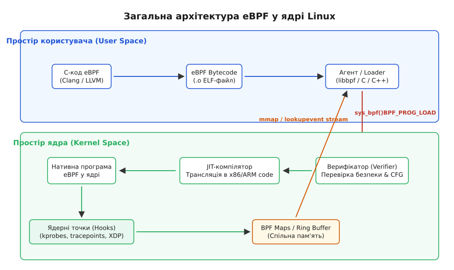
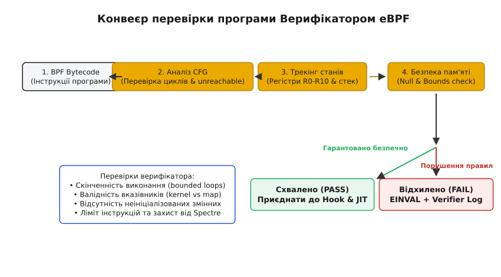
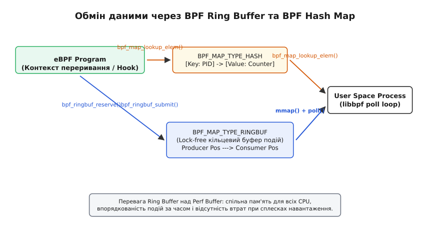

# eBPF (Extended Berkeley Packet Filter): власні програми всередині ядра

<preknowlist>
- [Концепції ядра Linux](topic:unix-linux/kernel-and-userspace) — базові поняття системних викликів, VFS та режимів привілеїв CPU.
- [Трасування системних викликів](topic:unix-linux/syscall-tracing) — перехоплення й аналіз системних викликів.
- [Динамічні зонди kprobes та uprobes](topic:unix-linux/uprobes-and-kprobes) — точки інструментування в інструкціях ядра та процесів.
- [Підсистема perf: лічильники й вибірковий профіль](topic:unix-linux/perf-events) — апаратні та програмні події ядра.
</preknowlist>

У сучасному системному програмуванні під Linux мало які технології здійснили такий самий революційний вплив, як eBPF (Extended Berkeley Packet Filter). Започаткована як вузькоспеціалізований механізм фільтрації мережевих пакетів у BSD, ця підсистема еволюціонувала у повноцінну, безпечну віртуальну машину всередині ядра Linux. eBPF дозволяє виконувати користувацький код у привілейованому режимі ядра (ring 0) з нативною швидкодією процесора, повністю виключаючи ризик спричинити крах системи (Kernel Panic) або пошкодити пам'ять ядра.

---

## 1. Архітектурна дилема: Гнучкість проти безпеки ядра

Ядро Linux є монолітним. Воно володіє монопольним контролем над фізичною оперативною пам'яттю, контролерами переривань та периферійними пристроями. Традиційно розробник, якому потрібно було розширити поведінку ядра — додати новий протокол маршрутизації, зібрати точну метрику затримки введення-виведення або перехоплювати відкриття файлів — мав лише два класичних шляхи.

### Перший шлях: Пряма модифікація вихідного коду ядра
Внесення змін до вихідного коду ядра Linux і перезбирання образу `vmlinux` дає абсолютну свободу дій. Проте цей шлях вимагає роками підтримувати власні локальні патчі. З кожним новим релізом ядра зміщення структур даних змінюються, а внутрішнє API ядра ламається. Процес потрапляння патчів у головний стовбур (upstream kernel) триває роками, що унеможливлює швидке розгортання нових інструментів у промислових виданні.

### Другий шлях: Завантажувані модулі ядра (LKM — Loadable Kernel Modules)
Завантаження модулів через `insmod` є стандартним способом розширення ядра під час виконання. Модуль компілюється під конкретну версію ядра і виконується з повними привілеями ring 0.

Однак використання LKM несе дві фатальні категорії недоліків:
1. **Ризик Kernel Panic та падіння всієї системи**: Помилка в коді модуля — розіменування нульового вказівника (`NULL pointer dereference`), помилка на одиницю при виході за межі масиву (off-by-one) або нескінченний цикл — негайно призводить до зупинки всієї операційної системи. Вся серверна стійка лягає через один хибний вказівник.
2. **Відсутність гарантій ABI**: Ядро Linux принципово не має стабільного внутрішнього двійкового інтерфейсу (In-kernel ABI). Якщо розробники ядра змінюють структуру `struct task_struct` або сигнатуру функції `do_sys_open()`, модуль, скомпільований для ядра 5.15, завалить ядро версії 6.1.

### Третій шлях: eBPF як безпечний шар програмованості
eBPF пропонує третій, фундаментально новий підхід. Розробник пише програму мовою C, компілює її за допомогою LLVM у спеціальний **BPF Bytecode** і завантажує в ядро за допомогою системного виклику.

Перш ніж дозволити байт-коду виконатися хоча б один раз, ядро пропускає його крізь **Верифікатор (Verifier)**. Верифікатор математично доводить, що програма гарантовано завершиться за скінченний час, не звернеться до неініціалізованої пам'яті, не прочитає заборонену адресу і не зіпсує структури ядра. Після схвалення вмикається JIT-компілятор, який перетворює байт-код на нативні інструкції CPU.


*Архітектурна схема завантаження байт-коду eBPF через системний виклик sys_bpf, його перевірки верифікатором та виконання у ядрі.*

Детальний огляд 30-річного шляху еволюції від простих мережевих фільтрів сокетів 1990-х років до сучасної віртуальної машини наведено у вставці [📜 Історія виникнення eBPF: від фільтра BSD до JIT у ядрі](topic:unix-linux/ebpf-extended-berkeley-packet-filter/hist-ebpf-origins.md).

---

## 2. Архітектура Віртуальної Машини eBPF

eBPF являє собою 64-бітну RISC-подібну віртуальну машину (VM), спроєктовану спеціально під архітектуру сучасних процесорів x86_64, ARM64 та RISC-V.

### 2.1. Регістри та їх відображення на фізичне апаратне забезпечення

Віртуальна машина eBPF має 11 64-бітних регістрів, позначених від `R0` до `R10`. Кількість і призначення цих регістрів обрані не випадково: вони точно відповідають конвенції викликів (Calling Convention) процесорів x86_64 та ARM64. Це дозволяє JIT-компілятору робити лінійне відображення 1-в-1 між регістрами eBPF та апаратними регістрами CPU без створення проміжних стекових кадрів.

| Регістр eBPF | Функціональне призначення у BPF ISA | Відображення x86_64 | Відображення ARM64 |
|---|---|---|---|
| `R0` | Значення, що повертається з функції або eBPF-програми | `rax` | `x0` |
| `R1` | 1-й аргумент функції / Контекст виконання (`ctx`) | `rdi` | `x0` |
| `R2` | 2-й аргумент функції | `rsi` | `x1` |
| `R3` | 3-й аргумент функції | `rdx` | `x2` |
| `R4` | 4-й аргумент функції | `rcx` | `x3` |
| `R5` | 5-й аргумент функції | `r8` | `x4` |
| `R6` | Забережений регістр (Callee saved) | `rbx` | `x19` |
| `R7` | Забережений регістр (Callee saved) | `r13` | `x20` |
| `R8` | Забережений регістр (Callee saved) | `r14` | `x21` |
| `R9` | Забережений регістр (Callee saved) | `r15` | `x22` |
| `R10` | Вказівник кадрів стеку (Frame Pointer, Лише для читання) | `rbp` | `x29` |

Коли eBPF-програма викликається у контексті ядра, аргумент `R1` автоматично приймає вказівник на **контекст події** (`ctx`). Для мережевого пакета це вказівник на `struct __sk_buff` або `struct xdp_buff`; для трасувальної точки `kprobe` — це вказівник на регістри процесора `struct pt_regs`.

### 2.2. Формат інструкцій BPF Bytecode та стек

Байт-код eBPF складається з інструкцій фіксованого розміру по 64 біти (8 байтів). Кожна інструкція має таку бітову структуру:

```text
 0                   1                   2                   3
 0 1 2 3 4 5 6 7 8 9 0 1 2 3 4 5 6 7 8 9 0 1 2 3 4 5 6 7 8 9 0 1
+-+-+-+-+-+-+-+-+-+-+-+-+-+-+-+-+-+-+-+-+-+-+-+-+-+-+-+-+-+-+-+-+
|    opcode     |   dst   |   src   |          offset           |
+-+-+-+-+-+-+-+-+-+-+-+-+-+-+-+-+-+-+-+-+-+-+-+-+-+-+-+-+-+-+-+-+
|                               imm                             |
+-+-+-+-+-+-+-+-+-+-+-+-+-+-+-+-+-+-+-+-+-+-+-+-+-+-+-+-+-+-+-+-+
```

- `opcode` (8 бітів): Код операції (клас інструкції, режим адресації, тип арифметики).
- `dst` (4 біти): Номер регістру призначення (`R0`–`R10`).
- `src` (4 біти): Номер регістру-джерела (`R0`–`R10`).
- `offset` (16 бітів): Знакове зміщення для адресації пам'яті відносно регістру.
- `imm` (32 біти): Безпосереднє цілочисельне значення (Immediate value).

Локальний стек eBPF-програми суворо обмежений розміром **512 байтів**. Це свідоме обмеження ядра: воно запобігає переповненню стеку ядра (Kernel Stack Overflow), розмір якого у Linux становить лише 8 або 16 КБ на весь потік. Великі масиви та стан між викликами eBPF-програма повинна зберігати не на стеку, а у спеціальних BPF-мапах.

---

## 3. Верифікатор ядра (In-Kernel Verifier): Гарантія стабільності

Верифікатор — це "серце" безпеки підсистеми eBPF. Завантаження коду в ядро здійснюється через системний виклик, проте ядро відхиляє байт-код при найменшій підозрі на некоректну поведінку.

Аналіз програми верифікатором відбувається у два фундаментальні проходи:

### Прохід 1: Граф потоку керування (Control Flow Graph, CFG)
Верифікатор будує орієнтований граф усіх можливих шляхів виконання програми:
1. Перевіряється відсутність недосяжних інструкцій (unreachable instructions).
2. Перевіряється, що будь-яка гілка розгалуження (`BPF_JEQ`, `BPF_JGT`) гарантовано завершується інструкцією `BPF_EXIT`.
3. **Аналіз циклів (Bounded Loops)**: Історично цикли у eBPF були повністю заборонені. Починаючи з ядра Linux 5.3, верифікатор підтримує обмежені цикли (bounded loops). Він повинен статично просимулювати цикл і довести, що кількість ітерацій має фіксовану верхню межу і програма не зависне у нескінченному циклі.

### Прохід 2: Сухий прогін та трекінг станів (State Tracking)
Верифікатор покроково моделює виконання кожної інструкції для всіх можливих гілок виконання, відстежуючи вміст усіх 11 регістрів та кожного байта на 512-байтовому стеку.

```
┌─────────────────────────────────────────────────────────────┐
│                      eBPF Bytecode                          │
└──────────────────────────────┬──────────────────────────────┘
                               │
                               ▼
┌─────────────────────────────────────────────────────────────┐
│ 1. Побудова CFG: відсутність dead code, перевірка циклів   │
└──────────────────────────────┬──────────────────────────────┘
                               │
                               ▼
┌─────────────────────────────────────────────────────────────┐
│ 2. Трекінг типів регістрів: PTR_TO_MAP, PTR_TO_STACK тощо   │
└──────────────────────────────┬──────────────────────────────┘
                               │
                               ▼
┌─────────────────────────────────────────────────────────────┐
│ 3. Симуляція безпеки пам'яті: Bounds Check & Null Check     │
└──────────────────────────────┬──────────────────────────────┘
                 ┌─────────────┴─────────────┐
                 │                           │
                 ▼                           ▼
       [Успіх: Схвалено]           [Помилка: EINVAL]
                 │                           │
                 ▼                           ▼
        JIT-компіляція в CPU         Запис причин у
         та приєднання                 Verifier Log
```


*Послідовні стадії статичного аналізу графа виконання програми верифікатором перед підключенням до JIT-компілятора.*

Кожен регістр у кожен момент часу має один із типів:
- `NOT_INIT`: Регістр не ініціалізовано. Спроба прочитати його викликає помилку.
- `SCALAR_VALUE`: Скалярне число (результат арифметичних операцій).
- `PTR_TO_STACK`: Вказівник на локальний стек програми.
- `PTR_TO_MAP_VALUE`: Вказівник на елемент у BPF-мапі.
- `PTR_TO_SOCKET` / `PTR_TO_BTF_ID`: Вказівник на структуру ядра.

Якщо регістр має тип `PTR_TO_MAP_VALUE_OR_NULL` (результат пошуку у мапі), верифікатор **примусово вимагає** перевірки на `NULL` у коді:

```c
struct my_value *val = bpf_map_lookup_elem(&my_map, &key);
if (!val) {
    return 0; // Без цієї перевірки верифікатор відхилить програму!
}
// Після перевірки тип регістра змінюється на PTR_TO_MAP_VALUE
```

### Захист від атак по сторонніх каналах (Spectre Mitigation)
Якщо у системі увімкнено захист від атак класу Spectre (уразливості спекулятивного виконання у CPU), верифікатор переписує потенційно небезпечні операції розгалуження, додаючи бар'єри інструкцій або маскуючи адреси масивів (Array Index Masking), щоб спекулятивна вибірка пам'яті не могла прочитати чужі дані ядра.

При відмові у завантаженні `bpf(2)` повертає `-1` (`EINVAL`), а в буфер `log_buf` записується детальний дамп верифікатора:

```text
0: (bf) r6 = r1
1: (85) call bpf_ktime_get_ns#5
2: (79) r1 = *(u64 *)(r6 +8)
invalid access to packet scan R6 offset=8 error: out of bounds
```

---

## 4. JIT-компіляція та точки прикріплення (Hooks)

Після того, як верифікатор ставить позначку "PASS", байт-код передається внутрішньому JIT-компілятору ядра.

### JIT (Just-In-Time) Компільований код
JIT-компілятор за один прохід перекладає 64-бітні інструкції eBPF на нативний машинний код поточного процесора (x86_64, ARM64, S390x). З цього моменту eBPF-програма більше не інтерпретується: вона стає звичайним функціональним блоком ядра, який виконується зі швидкістю C-коду ядра.

Статус JIT-компілятора у системі контролюється через sysctl:

```bash
# Перевірка та ввімкнення JIT-компілятора (1 = увімкнено, 2 = з відлагодженням)
cat /proc/sys/net/core/bpf_jit_enable
```

### Мережа точок прикріплення (Hooks)
eBPF-програма не виконується сама по собі. Вона "спить", поки у ядрі не станеться подія, до якої вона приєднана.

Основою гнучкості eBPF є широкий набір точок прикріплення:

1. **Static Tracepoints (`tracepoint/`)**: Статичні точки трасування, вбудовані у вихідний код ядра (наприклад, `sys_enter_openat`, `sched_switch`). Стійкі між версіями ядер.
2. **Dynamic Kprobes / Kretprobes (`kprobe/`, `kretprobe/`)**: Перехоплення входу та виходу з **будь-якої** не-inline функції ядра. Докладніше про перехоплення інструкцій дивись у [Динамічні зонди kprobes та uprobes](topic:unix-linux/uprobes-and-kprobes).
3. **Dynamic Uprobes / Uretprobes (`uprobe/`, `uretprobe/`)**: Перехоплення викликів у функціях користувацьких бібліотек простору користувача (наприклад, у `SSL_read` у `libssl.so`).
4. **XDP (eXpress Data Path, `xdp`)**: Мережевий хук найвищої швидкодії, розташований безпосередньо у драйвері мережевої карти до виділення об'єктів `sk_buff`. Дозволяє відкидати мільйони пакетів на секунду при DDoS-атаках.
5. **Traffic Control (`tc`)**: Обробка пакетів на рівні мережевого стеку Linux після формування `sk_buff`.
6. **LSM (Linux Security Modules, `lsm/`)**: Перехоплення операцій перевірки прав доступу в ядрі для систем безпеки.
7. **BPF Trampolines (`fentry/`, `fexit/`)**: Сучасна заміна `kprobes` з мінімальними накладними витратами. Деталі реалізації наведено у [Трампліни BPF та підсистема fprobe](topic:unix-linux/bpf-trampoline-and-fprobe).

---

## 5. BPF Maps: Сховища даних та зв'язок між ядром та користувачем

Програми eBPF ізольовані: вони не можуть виділяти пам'ять через `malloc()` або використовувати глобальні змінні без спеціальних секцій. Для обміну даними між ядром і користувацьким простором, а також між різними викликами eBPF-програм, використовуються **BPF Maps** — вбудовані в ядро структури даних.


*Модель обміну інформацією між eBPF-програмою у ядрі та процесом користувача через структури даних BPF Maps та BPF Ring Buffer.*

### 5.1. Ключові типи мап

1. **`BPF_MAP_TYPE_HASH`**: Класична хеш-таблиця з динамічним виділенням елементів. Дозволяє довільний розмір ключа та значення.
2. **`BPF_MAP_TYPE_ARRAY`**: Масив фіксованого розміру з цілочисельним індексом. Забезпечує найшвидший доступ без колізій.
3. **`BPF_MAP_TYPE_PERCPU_HASH` / `BPF_MAP_TYPE_PERCPU_ARRAY`**: Мапи, що мають окремий екземпляр даних для кожного ядра CPU. Запобігають міжядерним блокуванням (lock contention) та колізіям L1/L2 кешів під час високочастотних обчислень.
4. **`BPF_MAP_TYPE_RINGBUF`**: Сучасний lock-free кільцевий буфер подій. Замінив старий `BPF_MAP_TYPE_PERF_EVENT_ARRAY`. Дозволяє передавати потік подій з ядра у користувацький простір з мінімальними накладними витратами через `mmap()`. Порівняння архітектур буферів наведено у [Порівняння буферів BPF Ring Buffer та Perf Event Array](topic:unix-linux/bpf-ringbuf-vs-perfbuf).

Повний специфікат системного виклику `bpf(2)` та параметрів створення мап наведено у вставці [📋 Інтерфейс системного виклику bpf(2) та BPF-мапи](topic:unix-linux/ebpf-extended-berkeley-packet-filter/api-bpf-syscall-and-maps.md).

---

## 6. Механізм CO-RE (Compile Once – Run Everywhere) та BTF

Протягом багатьох років головною бідою eBPF була відсутність портуваності бінарного коду. Якщо eBPF-програма читала поле `pid` зі структури `task_struct`, то зміщення цього поля у пам'яті відносно початку структури могло бути `0x480` у ядрі Linux 5.4 і `0x490` у ядрі Linux 5.10.

Раніше фреймворки (наприклад, BCC) вирішували це болісно: вони тягнули на кожен продакшн-сервер важкі залежності — компілятор LLVM, Clang та заголовні файли ядра (kernel headers), після чого компілювали C-код eBPF прямо на цільовому сервері під час запуску.

Механізм **CO-RE** усунув цю проблему за допомогою трьох складових:

1. **BTF (BPF Type Format)**: Компактний бінарний формат метаданих, який описує всі типи даних, структури та зміщення полів поточного ядра. Починаючи з Linux 5.4, BTF вбудовується безпосередньо в образ ядра і доступний за адресою `/sys/kernel/btf/vmlinux`.
2. **LLVM Relocations**: Компілятор LLVM під час збірки eBPF-коду не замінює зміщення полів жорсткими числами. Замість цього він генерує абстрактні релокації: *"Прочитати поле `pid` зі структури `task_struct`"*.
3. **libbpf Loader**: Під час запуску бінарника у простір користувача бібліотека `libbpf` зчитує `/sys/kernel/btf/vmlinux` поточного ядра, знаходить реальне зміщення поля у даній версії ОС і коригує машинні інструкції eBPF безпосередньо перед передачею коду верифікатору.

Завдяки CO-RE розробник компілює бінарник eBPF один раз у себе на ПК, запаковує його у єдиний маленький файл і поширює на мільйони серверів із різними версіями ядер Linux.

---

## 7. Практичний інструментарій: BCC, bpftrace та libbpf

Розробка рішень на базі eBPF здійснюється на різних рівнях абстракції:

- **bpftrace**: Високорівнева мова трасування для швидкої діагностики у консолі. Ідеально підходить для розслідування аварій у реальному часі. Детальніше дивись у [Спеціалізована мова bpftrace](topic:unix-linux/systemtap-and-bpftrace).
- **BCC (BPF Compiler Collection)**: Історичний фреймворк на Python/C. Вимагає LLVM на цільовій машині, тому для нових проєктів є застарілим.
- **libbpf (C/C++)**: Сучасний промисловий стандарт. Забезпечує роботу CO-RE, малу витрату пам'яті та миттєвий запуск.

Приклад створення повноцінного агента спостережуваності на C та C++20 з використанням `libbpf` та CO-RE детально розібрано у вставці [⚙️ Практична реалізація: моніторинг execve через libbpf та CO-RE](topic:unix-linux/ebpf-extended-berkeley-packet-filter/proj-ebpf-execve-monitor.md).

---

## 8. Безпека та розмежування привілеїв

Оскільки eBPF дозволяє читати будь-яку пам'ять ядра та перехоплювати мережеві пакети, доступ до підсистеми є жорстко обмеженим.

- **Права POSIX Capabilities**: Для створення eBPF-програм у сучасних ядрах Linux (>= 5.8) замість монопольного `CAP_SYS_ADMIN` використовуються спеціалізовані права: `CAP_BPF` (завантаження та маніпуляція мапами), `CAP_PERFMON` (трасування та профілювання) та `CAP_NET_ADMIN` (мережеві хуки XDP/TC).
- **sysctl `kernel.unprivileged_bpf_disabled`**: Контролює доступ непривілейованих користувачів. За замовчуванням у більшості продакшн-дистрибутивів параметр встановлено у `1` або `2`, що повністю забороняє виклик `bpf(2)` звичайним користувачам без привілеїв Root або Capabilities.

---

## Висновок

eBPF кардинально змінив архітектуру системного програмування у Linux. Поєднавши безпеку статичної верифікації із швидкодією JIT-компіляції, ця технологія перетворила ядро з закритого моноліту на програмовану платформу. Сьогодні eBPF є фундаментом для рішень спостережуваності нового покоління, безпеки контейнерів (Falco, Tetragon) та високошвидкісних мереж у хмарних інфраструктурах (Cilium).
