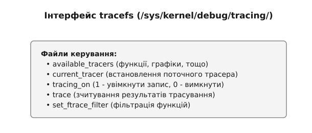

# Трасування ядра ftrace

<preknowlist>
- [Концепції ядра Linux](book:unix-linux/kernel-and-userspace) — базові поняття системних викликів та VFS.
- [Правка коду ядра на ходу](book:unix-linux/kernel-text-patching) — розуміння механізмів патчингу інструкцій під час виконання (Jump Labels).
</preknowlist>

Інструмент **ftrace** (Function Tracer) — це вбудований у ядро Linux інфраструктурний фреймворк для трасування. Спершу він був розроблений виключно для відстеження викликів функцій ядра, але з часом еволюціонував у багатоцільову платформу. Сьогодні ftrace підтримує трасувальні точки (tracepoints), kprobes, uprobes, а також спеціалізовані плагіни-трасери, такі як `hwlat` (затримки апаратного забезпечення), `mmiotrace` та граф викликів `function_graph`.

Розуміння того, як працює ftrace під капотом, і як взаємодіяти з ним через інтерфейс `tracefs` чи за допомогою високорівневих утиліт типу `trace-cmd`, є критично важливим для будь-якого системного інженера або розробника. У цій статті ми зануримося у внутрішню архітектуру ftrace, розглянемо механізми динамічного патчингу та вивчимо статичні трасувальні точки.

## 1. Архітектура Function Tracer

### 1.1 Підтримка на рівні компілятора
Основа Function Tracer закладається ще на етапі компіляції ядра. Традиційно, для того щоб ftrace міг перехоплювати виклики функцій, ядро Linux збирається з прапорцем компілятора `-pg`. Цей прапорець вказує компілятору (GCC або Clang) вставляти спеціальний виклик на початку кожної функції.

В архітектурі x86_64, старі версії компіляторів вставляли виклик функції `mcount` одразу після збереження регістрів у пролозі функції. Сучасніші компілятори використовують `-mfentry`, що змушує компілятор вставляти виклик `__fentry__` *перед* тим, як буде створено стековий кадр (stack frame). Це спрощує роботу ftrace, оскільки він може бачити аргументи функції в їхньому первісному вигляді до того, як пролог змінить стек.

Новітнім підходом у сучасних ядрах є використання прапорця `-fpatchable-function-entry=N,M`. Замість виклику фіксованої функції, цей прапорець просить компілятор зарезервувати місце, вставивши задану кількість інструкцій `NOP` (No Operation) на початку функції. Ядро може згодом перезаписати ці NOP-и інструкціями переходу (`jump` або `call`) до власного обробника трасування. Цей підхід є гнучкішим і не вимагає глобальної функції-заглушки.

### 1.2 Механізм Dynamic Ftrace
Якби кожна з десятків тисяч функцій в ядрі щоразу робила виклик `mcount` або `__fentry__`, це б призвело до падіння продуктивності системи на 10-20% — навіть якщо трасування вимкнено. Щоб вирішити цю проблему, було запроваджено механізм **Dynamic Ftrace**.

Ось як це працює:
1. **Збір адрес:** Під час компіляції ядра створюється спеціальний розділ, в якому зберігаються адреси всіх місць, де компілятор вставив виклик `__fentry__` (або `NOP`-и).
2. **Завантаження ядра:** Коли ядро завантажується, дуже рано в процесі ініціалізації, воно зчитує цю таблицю адрес. Ядро проходить по всіх цих адресах і **патчить** (перезаписує) машинний код, замінюючи інструкцію виклику на інструкцію `NOP` (на x86 це зазвичай п'ятибайтовий NOP).
3. **Нульовий оверхед (zero overhead):** Після завершення завантаження система працює з майже нульовими накладними витратами на ftrace, оскільки процесор просто ігнорує `NOP`-и.
4. **Увімкнення трасування:** Коли користувач вмикає трасер, ядро динамічно патчить інструкції `NOP` назад на виклик функції-обробника ftrace (наприклад, `ftrace_caller`). Це робиться з використанням механізмів зупинки машини (`stop_machine`) або обробки винятків (`int3`), щоб уникнути стану гонитви (race conditions) на багатоядерних системах.


### 1.3 Плагін `function_graph`
Тоді як стандартний плагін `function` перехоплює лише *вхід* у функцію, плагін **`function_graph`** йде далі: він перехоплює і вхід, і вихід з функції. Це дозволяє ядру побудувати повний граф викликів (call graph) та виміряти точний час виконання кожної функції.

Для перехоплення виходу `function_graph` динамічно підміняє адресу повернення функції на стеку на адресу власного обробника (наприклад, `return_to_handler`). Коли функція завершує роботу, вона повертається в обробник ftrace, який записує час завершення, відновлює справжню адресу повернення зі свого тіньового стеку (shadow stack) і повертає управління туди, куди очікувалося.

## 2. Трасувальні точки (Tracepoints)
Function Tracer працює на рівні викликів C-функцій, але має недолік: назви функцій і їхня семантика можуть змінюватися від версії до версії ядра. Скрипт, що спирається на внутрішню функцію ядра, зламається при оновленні системи.

Для стабільного API розробники використовують **Трасувальні точки (Tracepoints)**. Це спеціально розміщені розробниками статичні маркери у вихідному коді ядра, що гарантують зворотну сумісність. Навіть якщо внутрішня реалізація зміниться, tracepoint залишиться на місці і передаватиме ті ж параметри.

### 2.1 Макрос `TRACE_EVENT`
Розробник додає tracepoint за допомогою макросів, найпопулярнішим з яких є `TRACE_EVENT`. Цей макрос розгортається у багато різного коду, включаючи:
- Оголошення структури даних для запису події в кільцевий буфер ftrace.
- Функцію-обробник, яка виконується при досягненні точки.
- Функцію друку (`print fmt`), яка знає, як форматувати бінарні дані з буфера у зрозумілий людині текст.

У коді ядра виклик виглядає просто: `trace_sched_switch(preempt, prev, next);`. Під капотом це перетворюється на перевірку умови, що використовує механізм **Jump Labels** (Static Keys).

### 2.2 Jump Labels (Static Keys)
Подібно до динамічного патчингу у ftrace, tracepoints повинні мати мінімальні накладні витрати у вимкненому стані. Механізм **Jump Label** використовує патчинг коду для заміни перевірки `if (enabled)` на безумовний перехід (`jmp` на код обробки, коли увімкнено) або на `nop` (коли вимкнено). Таким чином, процесор навіть не виконує перевірку розгалуження.

Коли ви вмикаєте певний tracepoint, ядро реєструє функцію зворотного виклику, а потім патчить відповідний Jump Label, щоб направити потік виконання до коду трасування.

## 3. Інтерфейс `tracefs`
Основним способом взаємодії з ftrace є файлова система `tracefs`. Зазвичай вона монтується у директорії `/sys/kernel/tracing` (в нових системах) або `/sys/kernel/debug/tracing`.



Ця директорія містить велику кількість керуючих файлів:
- **`available_tracers`**: Перелічує всі зібрані плагіни (наприклад, `function`, `function_graph`, `hwlat`, `nop`). `nop` — трасер за замовчуванням (нічого не робить).
- **`current_tracer`**: Файл для активації трасера (наприклад, `echo function_graph > current_tracer`).
- **`tracing_on`**: Головний перемикач (`1` — запис увімкнено, `0` — зупинено).
- **`trace`**: Читання виводить вміст кільцевого буфера у текстовому форматі.
- **`trace_pipe`**: Подібний до `trace`, але блокується, очікуючи нових подій для живого моніторингу.
- **`set_ftrace_filter` та `set_ftrace_notrace`**: Дозволяють вказати, які саме функції слід трасувати, а які ігнорувати.
- **`events/`**: Директорія, що містить усі доступні tracepoints за підсистемами (`events/sched`, `events/net`). Для їх увімкнення записують `1` у відповідний файл `enable`.

## 4. Високорівневі інструменти: `trace-cmd`
Взаємодія вручну через `echo` та `cat` підходить для скриптів, але для профілювання використовують утиліту **`trace-cmd`**. Це офіційний фронтенд, який автоматизує маніпуляції з `tracefs`, збирає бінарні дані з буферів кожного CPU, і зберігає їх у файл `trace.dat`.

```bash
# Трасувати всі події планувальника під час виконання команди 'ls'
sudo trace-cmd record -e sched:* ls -l /
```

Ще одним потужним інструментом є **KernelShark** — графічний інтерфейс для `trace-cmd`, який візуалізує часові шкали подій для різних CPU та процесів, що спрощує аналіз гонитви (race conditions) або проблем з плануванням.

## 5. Підсумки
**ftrace** є фундаментальним інструментом у арсеналі Linux-інженера. Завдяки механізмам *Dynamic Ftrace* та *Jump Labels*, він дозволяє трасувати будь-яку функцію в ядрі або тисячі специфічних подій (tracepoints) з майже нульовими накладними витратами, коли трасування вимкнене. Інтерфейс `tracefs` надає прозорий механізм керування, а утиліти `trace-cmd` та `KernelShark` перетворюють необроблені дані трасування на корисну інформацію для налагодження та профілювання ядра.
