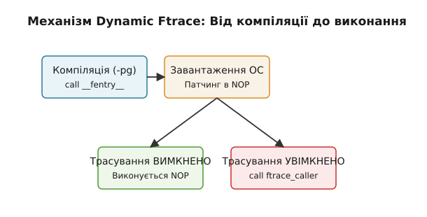
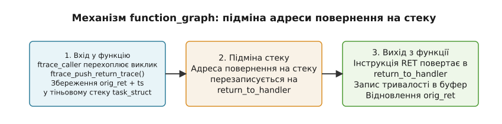

# Трасування ядра ftrace (/sys/kernel/tracing, function, tracepoints, trace-cmd)

<preknowlist>
- [Концепції ядра Linux](book:unix-linux/kernel-and-userspace) — базові поняття системних викликів, VFS та простору ядра.
- [Правка коду ядра на ходу](book:unix-linux/kernel-text-patching) — динамічна модифікація машинного коду під час виконання (Jump Labels та Static Keys).
</preknowlist>

Коли виробничий сервер під навантаженням періодично замирає на 50 мілісекунд, а традиційні відлагоджувальники юзерпростору на кшталт gdb безсилі через неможливість зупинити виконання всього ядра, єдиним джерелом правди стає підсистема трасування ядра Linux. Будь-яка спроба розставити друкуючі виклики `printk()` всередині ядра під навантаженням лише поглиблює затримки або призводить до переповнення системних логів, приховуючи справжню причину проблеми.

Інфраструктура **ftrace** (Function Tracer) — це офіційний, вбудований у ядро Linux фреймворк трасування, розроблений для аналізу поведінки операційної системи в реальному часі з мінімальними накладними витратами. Він дозволяє спостерігати за викликами десятків тисяч функцій ядра, фіксувати точні мікросекундні затримки переривань, аналізувати роботу планувальника задач і відстежувати статичні події (tracepoints) та динамічні точки трасування (kprobes/uprobes).

Історію виникнення ftrace, його роль у проєкті Linux реального часу PREEMPT_RT та еволюцію від раннього `latency_tracer` описано у вставці [📜 Історія створення ftrace та боротьби за низький оверхед](book:unix-linux/ftrace-kernel-tracing/hist-ftrace-origins.md).

## 1. Архітектура інструментування коду (Function Tracer)

Головне завдання ftrace — надати можливість перехопити вхід у *будь-яку* C-функцію ядра Linux без необхідності ручного додавання коду трасування у вихідні вихідні файли ядра. Цього досягають завдяки триетапному комбінованому підходу: інструментуванню на етапі компіляції, патчингу під час завантаження ядра та динамічній модіфікації машинного коду під час виконання.

### 1.1 Підтримка на рівні компілятора: `-pg`, `-mfentry` та `-fpatchable-function-entry`

Основа Function Tracer закладається компілятором (GCC або Clang) під час збірки ядра. Компілятору передають спеціальні прапорці інструментування:

1. **Традиційний прапорець `-pg` (mcount):** Компілятор вставляє виклик функції `call mcount` у пролог кожної C-функції одразу після створення стекового кадру. Недоліком `mcount` є те, що пролог функції вже встигає змінити стек і регістри (наприклад, зберегти `%rbp`), що ускладнює перехоплення оригінальних аргументів функції.
2. **Сучасний прапорець `-mfentry` (архітектура x86_64):** Компілятор вставляє виклик `call __fentry__` на самому початку функції — *до* створення стекового кадру (`push %rbp; mov %rsp, %rbp`). Це означає, що у момент входу в `__fentry__` аргументи функції все ще знаходяться у своїх первинних регістрах передачі параметрів (`%rdi`, `%rsi`, `%rdx`, `%rcx`, `%r8`, `%r9`), а на вершині стеку лежить чиста адреса повернення до викликаючої функції (caller).
3. **Новітній прапорець `-fpatchable-function-entry=N,M`:** Компілятор генерує `N` інструкцій `NOP` безпосередньо перед або після мітки початку функції. Для x86 зазвичай резервують 5 байтів (розмір довгого виклику `call`), що дозволяє уникнути виклику функції-заглушки і спрощує подальший динамічний патчинг.

Під час компіляції ядра з прапорцем `-pg` або `-mfentry` створюється спеціальний розділ ELF-файлу ядра під назвою `__mcount_loc`. У цьому розділі компілятор і лінкер зберігають таблицю адрес абсолютно всіх місць у пам'яті, куди було вставино інструкцію виклику `__fentry__`.

### 1.2 Механізм Dynamic Ftrace: Раннє завантаження та нульовий оверхед

Якби кожна з десятків тисяч функцій ядра при кожному виклику виконувала реальний transition у функцію `__fentry__`, це призвело б до падіння загальної продуктивності системи на 15–20% навіть за вимкненого трасування. Для вирішення цієї проблеми було реалізовано механізм **Dynamic Ftrace**.

Робота Dynamic Ftrace розгортається у чотири послідовні етапи:

1. **Збір адрес при компіляції:** Скрипт `recordmcount` (або вбудована підтримка компілятора) наповнює секцію `__mcount_loc` адресами всіх інструкцій `call __fentry__`.
2. **Раннє завантаження ядра (`ftrace_init`):** Під час завантаження системи, на найраннішому етапі ініціалізації (до запуску інших ядер CPU та юзерпростору), ядро Linux викликає функцію `ftrace_init()`. Вона зчитує таблицю `__mcount_loc`, проходить по кожній адресі й **перезаписує** 5-байтовий виклик `call __fentry__` на 5-байтову послідовну інструкцію `NOP` (на x86 це інструкція `0x0f 0x1f 0x44 0x00 0x00`).
3. **Нульові накладні витрати (Passive State):** Після завершення завантаження ядро працює з повною швидкістю. Процесор виконує інструкції `NOP` за частки наносекунди, не перемикаючи контекст і не вираховуючи умовні переходи.
4. **Динамічна активація (Active Tracing):** Коли користувач активує трасування функцій, ядро за допомогою механізму Dynamic Ftrace динамічно перезаписує `NOP`-и назад у виклик трасера `call ftrace_caller`.


*Етапи життя точки інструментування ftrace: від компіляції з -mfentry та підміни на NOP при завантаженні до атомарної заміни на CALL під час активації.*

### 1.3 Атомарний патчинг коду у багатоядерному середовищі: `text_poke_bp`

Патчинг машинного коду на багатоядерній системі (SMP), де інші ядра CPU можуть у цей самий момент виконувати кодову секцію, яку перезаписують, є однією з найнебезпечніших операцій в ядрі. Якщо одне ядро прочитає перші 2 байти нової інструкції, а друге ядро ще не дописало решту 3 байти, процесор виконає сміттєву інструкцію і згенерує помилку `Opcode Fault` (#UD) або `General Protection Fault` (#GP), що призведе до падіння ядра (Kernel Panic).

Для безпечної модифікації коду в ядрі Linux застосовують два підходи:

- **Застарілий підхід (`stop_machine`):** Ядро тимчасово призупиняє виконання всіх інших ядер CPU, переводячи їх у цикл очікування з вимкненими перериваннями, виконує перезапис інструкцій на одному ядрі, після чого відновлює роботу всієї системи. Цей метод гарантує безпеку, але викликає помітні посмикування (jitter) у системі.
- **Сучасний атомарний підхід (`text_poke_bp` / breakpoint technique):**
  1. Перший байт 5-байтової інструкції `NOP` перезаписують однобайтовою інструкцією переривання `INT3` (`0xCC`). Ця операція є атомарною на шині пам'яті.
  2. Ядро реєструє тимчасовий обробник переривання `INT3`. Якщо будь-яке інше ядро процесора потрапляє на цю точку під час патчингу, обробник `INT3` перехоплює виконання і симулює необхідну поведінку (перехід до трасера або виконання NOP).
  3. Ядро безпечно перезаписує решту 4 байти інструкції.
  4. Перший байт `INT3` перезаписують першим байтом нової інструкції (`0xE8` для `CALL`).
  5. Скидається кєш інструкцій процесора (`ICACHE`) та черга конвеєра через інструкцію `SERIALIZE` або `CPU execution barrier`.

Цей механізм дозволяє вмикати й вимикати трасування тисяч функцій ядра "на льоту" без зупинки роботи операційної системи.

## 2. Механізм перехоплення входу та виходу: плагін `function_graph`

Тоді як базовий трасер `function` записує лише момент *входу* у функцію ядра, плагін **`function_graph`** надає повну картину виконання: він вимірює exact duration (точну тривалість) роботи кожної функції та будує візуальне дерево вкладених викликів із відступами.

### 2.1 Підміна адреси повернення та тіньовий стек

Для того щоб дізнатися тривалість виконання функції, ftrace повинен перехопити не лише її початок, але й момент завершення (вихід з функції). Оскільки C-функції закінчуються інструкцією `RET`, яка просто зчитує адресу повернення зі стеку процесора, ftrace застосовує підміни адрес за допомогою **тіньового стеку (shadow stack)**.

Механізм `function_graph` працює за такою послідовністю:

1. **Перехоплення входу:** Під час входу у функцію викликається `ftrace_caller`, який передає управління обробнику `ftrace_graph_caller`.
2. **Збереження стану у тіньовому стеку:** Обробник витягує з реального стеку процесора справжню адресу повернення (адресу в коді, куди функція мала повернутися після `RET`). Цю адресу разом із поточним високоточним таймстампом (`trace_clock()`) записують у спеціальний масив `ret_stack`, прикріплений до структури потоку `struct task_struct` даної задачі.
3. **Підміна адреси повернення:** Справжню адресу повернення на стеку процесора **перезаписують** адресою спеціальної функції ядра — **`return_to_handler`**.
4. **Виконання функції:** Функція ядра виконує своє корисне навантаження.
5. **Перехоплення виходу:** Коли функція завершує роботу й виконує інструкцію `RET`, процесор не повертається до коду, який її викликав, а здійснює перехід у **`return_to_handler`**.
6. **Обчислення тривалості та відновлення:** Функція `return_to_handler` зчитує з тіньового стеку `ret_stack` початкову адресу повернення та час входу, вираховує різницю часу (тривалість виконання), формує запис події у кільцевий буфер ftrace і відновлює справжню адресу повернення у регістрі процесора, після чого здійснює остаточний перехід туди, куди очікував викликаючий код.


*Схема підміни адреси повернення у плагіні function_graph: збереження початкової адреси у тіньовому стеку task_struct та повернення через return_to_handler.*

Якщо усередині трасованої функції викликаються інші функції ядра, процедура повторюється рекурсивно. Завдяки цьому ftrace будує чітке графічне дерево:

```text
 3)               |  sys_openat2() {
 3)               |    do_sys_openat2() {
 3) 0.120 us      |      getname_flags();
 3)               |      alloc_fd() {
 3) 0.240 us      |        expand_files();
 3) 0.510 us      |      }
 3) 2.140 us      |      do_filp_open();
 3) 3.820 us      |    }
 3) 4.210 us      |  }
```

### 2.2 Крайові випадки: Глибокі стеки та винятки

Механізм тіньового стеку вимагає обережності у двох крайових випадках:

- **Переповнення тіньового стеку:** Масив `ret_stack` у `task_struct` має фіксовану глибину (за замовчуванням 50 вкладених викликів). Якщо глибина викликів ядра перевищує цей ліміт (наприклад, при глибокій рекурсії у файлових системах або стеках мережевих протоколів), ftrace припиняє підміняти адреси повернення для глибших рівнів і виводить попередження в лог, уникаючи пошкодження пам'яті.
- **Нестандартні переходи (longjmp / unwinding / panic):** Якщо функція ядра переривається винятком або відновленням контексту, виконується виклик `ftrace_graph_ret_addr()`, який коректує вказівник тіньового стеку, скидаючи незбалансовані кадри.

## 3. Статичні трасувальні точки (Tracepoints) та Static Keys

Трасування внутрішніх C-функцій ядра за допомогою `function` та `function_graph` є потужним інструментом, але воно має фундаментальну ваду: **приватні функції ядра змінюються між версіями**. Розробники ядра Linux регулярно перейменовують внутрішні функції, розділяють їх або змінюють порядок параметрів. Скрипт моніторингу, написаний для ядра Linux 5.15, з високою ймовірністю зламається на ядрі Linux 6.6.

Для створення стабільного, гарантованого API спостережуваності було запроваджено **Трасувальні точки (Tracepoints)**.

### 3.1 Макрос `TRACE_EVENT`

Tracepoint — це статичний маркер, вбудований розробниками ядра у ключових місцях системних підсистем (планувальник задач, мережевий стек, підсистема вводу/виводу, управління пам'яттю). Кожна трасувальна точка має фіксовану назву, стабільні аргументи та гарантований формат даних.

Для створення нової трасувальної точки розробники ядра використовують розширюваний макрос `TRACE_EVENT`. Розглянемо його структуру на прикладі події перемикання контексту процесів `sched_switch`:

```c
TRACE_EVENT(sched_switch,
    TP_PROTO(bool preempt, struct task_struct *prev, struct task_struct *next),
    TP_ARGS(preempt, prev, next),

    TP_STRUCT__entry(
        __array( char, prev_comm, TASK_COMM_LEN )
        __field( pid_t, prev_pid )
        __field( pid_t, next_pid )
    ),

    TP_fast_assign(
        memcpy(__entry->prev_comm, prev->comm, TASK_COMM_LEN);
        __entry->prev_pid = prev->pid;
        __entry->next_pid = next->pid;
    ),

    TP_printk("prev_comm=%s prev_pid=%d ==> next_pid=%d",
        __entry->prev_comm, __entry->prev_pid, __entry->next_pid)
);
```

Під час компіляції макрос `TRACE_EVENT` розгортається у серію кодових конструкцій:
- Оголошення виклику функції `trace_sched_switch(...)`.
- Опис бінарної структури для компактного збереження події у кільцевому буфері (`TP_STRUCT__entry`).
- Код швидкого копіювання даних із параметрів ядра у буфер (`TP_fast_assign`).
- Функцію текстового форматування (`TP_printk`), яка перетворює бінарні дані з буфера у зрозумілий рядок для юзерпростору.

### 3.2 Механізм Jump Labels (Static Keys)

У коді ядра виклик точки трасування виглядає як звичайна C-функція: `trace_sched_switch(preempt, prev, next);`. Оскільки подія `sched_switch` викликається сотні тисяч разів на секунду при кожному перемиканні задач на кожному ядрі CPU, перевірка умовного виразу `if (tracepoint_enabled)` створювала б помітні накладні витрати (необхідність зчитування прапорця з пам'яті та умовний перехід, який збиває конвеєр процесора).

Щоб усунути ці витрати, розробники використовують механізм **Jump Labels (Static Keys)**.

Коли tracepoint вимкнено (за замовчуванням), макрос генерації коду розгортається не в умовний оператор `if`, а у спеціальну ассемблерну вставку `asm goto`. У цій вставці за адресою перевірки компілятор розміщує 5-байтовий `NOP`. Процесор просто проходить повз точку трасування, не виконуючи жодної перевірки прапорців у пам'яті.

Коли користувач вмикає трасувальну точку (наприклад, через `echo 1 > /sys/kernel/tracing/events/sched/sched_switch/enable`), ядро виконує динамічний патчинг машинного коду:
1. Інструкцію `NOP` за допомогою атомарного патчингу (`text_poke_bp`) перезаписують інструкцією безумовного переходу `JMP` на код обробника трасування.
2. Обробник витягує аргументи, формує запис у кільцевому буфері й повертає управління у потік виконання.

Це забезпечує нульовий оверхед для вимкнених tracepoints і дозволяє випускати ядра диствибутивів із тисячами вбудованих точок трасування без шкоди для продуктивності.

## 4. Підсистема кільцевих буферів ftrace (Lockless Ring Buffer)

Усі трасери (Function Tracer, Tracepoints, Kprobes) записують згенеровані події у спеціально спроєктовану підсистему пам'яті — **ftrace lockless ring buffer**.

### 4.1 Безблокувальна структура per-CPU та NMI-безпека

У багатоядерній системі спроба використовувати один спільний буфер із м'ютексом або спін-локом для запису подій із усіх ядер призвела б до критичних заторів пам'яті (lock contention). Буфер ftrace розбитий на **окремі кільцеві буфери для кожного ядра CPU** (`per-CPU ring buffers`).

Кожен per-CPU буфер має такі властивості:

- **Lockless (без блокувань):** Запис подій здійснюється за допомогою атомарних інструкцій процесора (`CMPXCHG`). Ядро CPU може записувати події у свій буфер без захоплення спін-локів.
- **NMI-Safety (безпека для апаратних переривань):** Запис у буфер можна безпечно виконувати з будь-якого контексту ядра — включаючи обробники звичайних переривань (IRQ), м'які переривання (softirq), а також масковані апаратні переривання (NMI — Non-Maskable Interrupts). Якщо переривання NMI відбувається у момент, коли ядро вже писало іншу подію у буфер, алгоритм атомарно виділяє наступну ділянку в буфері без виникнення тупикових блокувань (deadlocks).

### 4.2 Сторінкова організація: Commit page, Tail page та Reader page

Кільцевий буфер кожного CPU складається з двозв'язного списку сторінок пам'яті розміром 4 Кілобайти:

- **Tail Page (Сторінка хвоста):** Вказує на поточну сторінку, куди ядра записують нові події.
- **Commit Page (Сторінка фіксації):** Зберігає останню подію, запис якої успішно завершено і підтверджено.
- **Reader Page (Сторінка зчитування):** Відокремлена сторінка, з якої процес юзерпростору зчитує дані.

Для оптимізації обсягу пам'яті часові мітки у кожному записі буфера зберігаються у вигляді відносного часового зсуву (time delta) відносно попередньої події. Якщо часовий інтервал між подіями занадто великий для пакування в короткий заголовок, ftrace вставляє спеціальний мета-запис `TIME_EXTEND`.

Коли процесу з юзерпростору потрібно прочитати дані з `trace_pipe`, ядро не копіює кожну подію поштучно. Замість цього воно атомарно підміняє вказівник `Reader Page` зі сторінкою із кільцевого буфера за принципом "Page Swap". Це робить читання надзвичайно швидким і мінімізує вплив на процес запису.

### 4.3 Режими переповнення: Overwrite vs Discard

Коли кільцевий буфер заповнюється до кінця, ftrace може працювати в одному з двох режимів:

1. **Режим перезапису (Overwrite Mode, за замовчуванням):** Найновіші події продовжують записуватися у буфер, витісняючи та перезаписуючи найстаріші події. Це ідеально для пошуку причин аварій: у буфері завжди зберігаються останні секунди перед падінням системи.
2. **Режим відкидання (Discard Mode):** Коли буфер повний, нові події відкидаються, а старі зберігаються недоторканими. Вмикається записом `0` у файл `options/overwrite`.

## 5. Плагіни, латентні трасери та динамічні точки

ftrace містить низку спеціалізованих плагінів, розроблених для вирішення конкретних діагностичних задач.

### 5.1 Трасери латентності (Latency Tracers)

Призначені для виявлення ділянок коду, які порушують детермінованість роботи системи:

- **`irqsoff`:** Відстежує ділянки коду ядра, на яких вимкнено апаратні переривання. Вимірює точну тривалість інтервалу від моменту виклику `local_irq_disable()` до `local_irq_enable()`. Якщо тривалість перевищує встановлений поріг, ftrace фіксує стек викликів.
- **`preemptoff`:** Вимірює тривалість заборони преемпції (виклики `preempt_disable()` ... `preempt_enable()`). Поки преемпція вимкнена, планувальник задач не може переключити CPU на високопріоритетну задачу реального часу.
- **`preemptirqsoff`:** Об'єднує вимірювання обох попередніх трасерів, виявляючи максимальний сумарний час, протягом якого система не могла відреагувати на зовнішню подію.
- **`wakeup` / `wakeup_rt`:** Вимірює час затримки розбудження задач (Wakeup Latency) — інтервал між моментом, коли задачу з високим пріоритетом було розбуджено (наприклад, приході мережевого пакета), і моментом, коли вона реально почала виконуватися на CPU.

### 5.2 Трасер апаратних затримок `hwlat` (Hardware Latency Tracer)

Існують затримки, які неможливо пояснити кодом ядра Linux. Наприклад, системна плата може періодично переводити CPU у режим **SMI (System Management Interrupt)** для перевірки температури або керування живленням BIOS/UEFI. Режим SMI виконується на рівні залізо-мікрокоду в обхід операційної системи: ядро Linux "замирає" і навіть не знає, що пройшов час.

Плагін `hwlat` виявляє такі апаратні паузи. Він вимикає всі переривання на ядрі CPU і виконує щільний цикл зчитування часових тактів (`RDTSC`). Якщо між двома сусідніми зчитуваннями часового лічильника виявляється аномальний стрибок (наприклад, 100 мікросекунд), `hwlat` фіксує факт апаратного втручання SMI.

### 5.3 Динамічні точки: Kprobes, Uprobes, Synthetic Events та Hist-тригери

- **`kprobe_events`:** Дозволяє встановити точку трасування на *довільну* C-функцію або ассемблерну інструкцію ядра без перезбирання коду.
- **`uprobe_events`:** Поширює можливості ftrace на юзерпростір. Дозволяє трасувати виклики функцій у виконуваних файлах (ELF) або спільних бібліотеках (`libc.so`), реєструючи точки трасування безпосередньо в коді призначених для користувача процесів.
- **Синтетичні події (`synthetic_events`):** Надають можливість об'єднувати дві різні трасувальні точки (наприклад, старт системного виклику та його завершення) для обчислення часової дельти безпосередньо в ядрі.
- **Тригери гістограм (`hist`):** Надають можливість агрегувати статистику подій (підраховувати кількість, будувати розподіли за розмірами чи часом) безпосередньо у пам'яті ядра. Це дозволяє аналізувати мільйони подій без вивантаження сирого логу в юзерпростір.

## 6. Практична взаємодія через `tracefs`

Основним низькорівневим інтерфейсом керування ftrace є віртуальна файлова система `tracefs`, яка монтується за шляхом `/sys/kernel/tracing` (або `/sys/kernel/debug/tracing`).


*Взаємодія інструментів юзерпростору з кільцевим буфером ядра через віртуальну файлову систему tracefs.*

Детальний систематичний довідник по всіх файлах керування `/sys/kernel/tracing`, синтаксису фільтрів, тригерів гістограм та створенню kprobes/uprobes наведено у вставці [📋 Довідник інтерфейсу tracefs та синтаксису фільтрів і тригерів](book:unix-linux/ftrace-kernel-tracing/api-tracefs.md).

Приклад швидкої діагностики функцій відкриття файлів через командний рядок:

```bash
# 1. Перейти у каталог tracefs
cd /sys/kernel/tracing

# 2. Вимкнути запис на час налаштування
echo 0 > tracing_on

# 3. Обрати трасер функцій
echo function > current_tracer

# 4. Встановити фільтр лише на функції відкриття файлів
echo "do_sys_open*" > set_ftrace_filter

# 5. Увімкнути запис
echo 1 > tracing_on

# 6. Переглянути результати трасування
cat trace_pipe
```

Для програмної взаємодії з ftrace з власних системних утиліт C та C++ використовують читання й запис файлів `tracefs`. Повний приклад продуктової утиліти мовами C та C++ з підтримкою RAII та обробки сигналів наведено у вставці [⚙️ Програма зчитування подій ftrace через tracefs](book:unix-linux/ftrace-kernel-tracing/proj-ftrace-user-reader.md).

## 7. Високорівневі інструменти: `trace-cmd` та `KernelShark`

Взаємодія з `tracefs` через `echo` та `cat` зручна для швидкої перевірки або простих скриптів, але для комплексного профілювання системи використовують консольну утиліту **`trace-cmd`**.

### 7.1 Команди утиліти `trace-cmd`

`trace-cmd` виступає офіційним фронтендом до ftrace. Вона автоматизує налаштування буферів, вмикання подій, ефективне зчитування бінарних даних із `per_cpu/cpu*/trace_pipe_raw` та збереження їх у компактний бінарний файл `trace.dat`.

Бінарний файл `trace.dat` має чітку структуру, яка включає заголовок із версією формату, заголовок опису полів подій (формати tracepoints), конфігурацію годинника ядра (`trace_clock`) та бінарні блоки подій для кожного CPU окремо.

Основні сценарії використання `trace-cmd`:

```bash
# 1. Запис подій перемикання контексту та блокового вводу-виводу під час виконання команди 'ls -la'
sudo trace-cmd record -e sched:sched_switch -e block:block_rq_issue ls -la /

# 2. Збір траси за допомогою function_graph для конкретного PID протягом 5 секунд
sudo trace-cmd record -p function_graph -g sys_openat2 -P 1234 sleep 5

# 3. Декодування та відображення збереженого файлу trace.dat
trace-cmd report

# 4. Моніторинг подій у реальному часі без збереження у файл (аналог trace_pipe)
sudo trace-cmd stream -e syscalls:sys_enter_read
```

### 7.2 Графічний аналіз у `KernelShark`

Для аналізу складних трас із мільйонами подій використовують GUI-інструмент **KernelShark**.

KernelShark зчитує бінарний файл `trace.dat` і будує часову шкалу (timeline), на якій по осі X відкладено час із наносекундною точністю, а по осі Y — ядра CPU та процеси юзерпростору.

Завдяки KernelShark інженер може візуально виявити:
- На якому саме ядрі CPU виконувався процес у момент виникнення затримки.
- Який саме процес витіснив поточну задачу (preemption).
- Тривалість перебування задачі в стані очікування I/O (Uninterruptible Sleep / state `D`).

> 🔧 **Навіщо це.**
> Уявіть ситуацію: високозавантажений веб-сервер на базі Nginx періодично демонструє стрибки латентності обробки запитів з 1 мс до 100 мс. Профілювальник юзерпростору показує, що час витрачається у системному виклику `epoll_wait()`. За допомогою ftrace інженер вмикає `function_graph` для виклику `epoll_wait()` з фільтром на PID процесу Nginx. На трасі чітко видно, що всередині `epoll_wait()` ядро викликає функцію `mutex_lock()`, яка затримується на 98 мс через конкуренцію за лок сокета з фоновим процесом резервного копіювання. ftrace дозволяє локалізувати проблему в ядрі за хвилини без зупинки продакшн-сервера.

## 8. Підсумки

**ftrace** є фундаментальним інструментом у арсеналі системного інженера Linux. Завдяки технологіям *Dynamic Ftrace*, *Jump Labels* та *Lockless Per-CPU Ring Buffers*, він забезпечує глибоку спостережуваність усього ядра Linux із нульовими накладними витратами в інактивованому стані. Інтерфейс `tracefs` надає прозорий механізм керування, а інструменти `trace-cmd` та `KernelShark` роблять аналіз складних системних затримок швидким і наочним.
