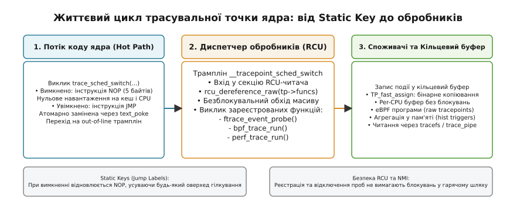
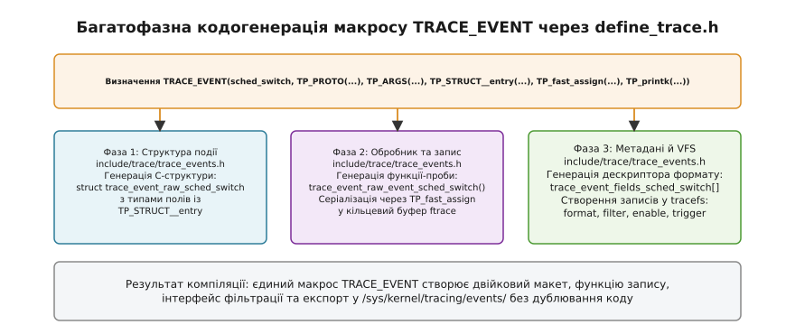
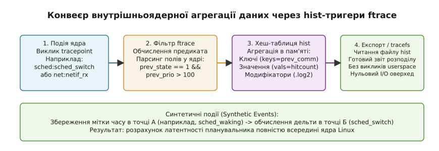

# ftrace і трасувальні точки ядра Linux (Linux Kernel Tracepoints)

<preknowlist>
- [Трасування ядра ftrace](book:unix-linux/ftrace-kernel-tracing) — архітектура кільцевого буфера, function tracer та інтерфейс tracefs.
- [Модифікація машинного коду ядра](book:unix-linux/kernel-text-patching) — техніка атомарної заміни інструкцій (text_poke, NOP/JMP) на рівні процесора.
- [Файлова система /proc](book:unix-linux/proc-filesystem) — віртуальні файлові вузли ядра та експорт внутрішніх структур.
- [eBPF у ядрі Linux](book:unix-linux/ebpf-extended-berkeley-packet-filter) — віртуальна машина в ядрі для програмованого аналізу подій.
</preknowlist>

Коли операційна система обслуговує сотні тисяч мережевих пакетів на секунду або здійснює мільйони перемикань контексту між потоками, спроба з'ясувати причину мікросекундних затримок стикається з фундаментальним фізичним обмеженням: сам процес вимірювання спотворює поведінку системи (ефект спостерігача). Якщо встановити динамічну пастку на машинну інструкцію ядра через механізм Kprobes, процесор на кожному спрацьовуванні виконує переривання налагодження (`int3`), зберігає регістри, перемикає контекст обробки винятків і виконує код проби в режимі обробки апаратних помилок. Затримка такого виклику становить від 1000 до 2500 тактів CPU на кожну подію, що робить динамічне трасування високочастотних внутрішніх шляхів ядра неприпустимим у високонавантаженому промисловому середовищі.

З іншого боку, звичайний умовний виклик функції трасування на зразок `if (tracing_enabled) trace_event(...)`, розміщений безпосередньо у вихідному коді ядра, також виявляється занадто дорогим. Навіть коли трасування вимкнено, процесор змушений завантажувати стан прапорця з оперативної пам'яті у кеш L1D, виконувати інструкції порівняння (`test`) та умовного переходу (`jne`), а також витрачати слоти таблиці передбачення переходів (Branch Target Buffer, BTB). Якщо таких точок у ядрі понад дві тисячі, постійний фоновий оверхед стає відчутним навіть за повної відсутності активних діагностичних сесій.

Вирішенням цієї проблеми в ядрі Linux стала архітектура статичних точок трасування (Tracepoints) та макросів `TRACE_EVENT`. Вона поєднує статичне розміщення точок збору даних у ключових функціях ядра з механізмом динамічного патчингу машинного коду (Static Keys / Jump Labels). У пасивному стані кожна точка трасування зводиться до єдиної багатобайтової інструкції `NOP` із нульовим навантаженням на передбачення переходів. Під час активації ядро атомарно підміняє `NOP` на інструкцію прямого переходу `JMP`, спрямовуючи потік виконання на оптимізовані трампліни збору даних із захистом RCU.

Детальний опис того, як співтовариство ядра пройшло шлях від ручних експериментальних маркерів до стандартизованої підсистеми спостережуваності, наведено в матеріалі [Історія еволюції статичних точок трасування](book:unix-linux/ftrace-tracepoints/hist-tracepoints-origins.md).

## 1. Модель накладних витрат: динамічні пастки, перевірка умов та Static Keys

Щоб зрозуміти причину створення статичних точок трасування, необхідно проаналізувати поведінку процесора на рівні конвеєра інструкцій та ієрархії кеш-пам'яті для трьох різних підходів до інструментування ядра.

### 1.1. Динамічні пастки (Kprobes)
Під час встановлення kprobe перший байт цільової машинної інструкції ядра замінюється опкодом `0xcc` (інструкція точки зупинки `int3` на x86-64). Коли процесор доходить до цієї інструкції, апаратна логіка виконує такі кроки:
1. Генерація апаратного переривання вектора 3 (Breakpoint Exception).
2. Збереження регістрів процесора (контексту виконання) у стек ядра.
3. Очищення конвеєра інструкцій процесора (pipeline flush).
4. Перехід до обробника винятку через таблицю дескрипторів переривань (IDT).
5. Виконання функції-проби.
6. Покрокове виконання (single-step) витісненої оригінальної інструкції або її виконання у виділеному слоті пам'яті.
7. Відновлення регістрів та повернення інструкцією `iretq`.

Сумарна ціна такого циклу становить приблизно 0.8–2.0 мікросекунди (від 1500 до 3500 тактів сучасного CPU). Якщо подія трапляється 1 000 000 разів на секунду (наприклад, обробка пакетів на інтерфейсі 40 GbE або виклики системного планувальника завдань), динамічна проба kprobe повністю паралізує роботу процесора.

### 1.2. Статичні умовні розгалуження (Static Conditional Branches)
Якщо замість апаратних пасток розмістити у коді ядра явну перевірку глобальної змінної прапорця:

```c
if (unlikely(sched_switch_trace_active)) {
    do_sched_switch_trace(prev, next);
}
```

Компілятор GCC згенерує таку асемблерну послідовність:

```text
movl    sched_switch_trace_active(%rip), %eax   # Читання прапорця з пам'яті (L1/L2 кеш)
testl   %eax, %eax                              # Перевірка на нуль
jnz     .L_execute_trace_probe                  # Умовний стрибок
```

Цей підхід значно швидший за `int3`, але створює приховані проблеми на мікроархітектурному рівні:
* **Залежність від кешу даних (D-Cache):** Змінна `sched_switch_trace_active` повинна знаходитися у кеші L1D. Якщо лінія кешу була витіснена іншими процесами або знедійснена на іншому ядрі CPU, процесор зупиняє виконання на час завантаження лінії з кешу L2/L3 чи оперативної пам'яті (від 15 до 200 тактів).
* **Засмічення буфера передбачення переходів (BTB):** Кожна інструкція `jnz` змушує процесор резервувати запис у таблиці передбачень переходів. Оскільки в робочому стані трасування зазвичай вимкнено, сотні таких перевірок витісняють корисні записи основного коду системи.
* **Навантаження на декодер інструкцій:** Три інструкції займають слоти в черзі декодування замість корисних обчислень.

### 1.3. Архітектура Static Keys (Jump Labels)
Механізм Static Keys кардинально змінює підхід: замість перевірки змінної компілятор за допомогою розширення `asm goto` генерує безпосередньо у критичному шляху єдину 5-байтову інструкцію `NOP` (на x86-64 це оптимізований багатобайтовий `nopl 0x0(%rax,%rax,1)`, опкод `0x0f 0x1f 0x44 0x00 0x00`):

```text
# Гарячий шлях (Hot Path) — Трасування ВИМКНЕНО
.L_kernel_function:
    # Корисні інструкції ядра...
    nopl    0x0(%rax,%rax,1)                    # Виконується за 0.5 наносекунди, не читає пам'ять
    # Наступні корисні інструкції ядра...

# Холодний шлях (Cold Path) — винесений у кінець функції
.L_trace_trampoline:
    call    __tracepoint_sched_switch_probe
    jmp     .L_kernel_function_resume
```

Ціна неактивної точки трасування зводиться до виконання єдиної інструкції `NOP`. Вона не звертається до пам'яті, не змінює регістри процесора і практично непомітна для конвеєра CPU.

Під час компіляції ядра адреса кожного такого `NOP` заноситься у спеціальну секцію ELF-файлу ядра під назвою `__jump_table`:

```c
struct jump_entry {
    s32 code;      /* Зміщення відносно таблиці до інструкції NOP/JMP */
    s32 target;    /* Зміщення до коду трампліна обробника */
    s32 key;       /* Зміщення до структури static_key */
};
```

Коли користувач активує точку трасування, функція ядра `static_key_enable()` знаходить відповідний запис у таблиці та викликає функцію атомарної модифікації коду `text_poke_bp()`. Вона замінює 5 байтів `NOP` на 5-байтову інструкцію безумовного переходу `JMP` (`0xe9 <offset32>`).


*Життєвий цикл трасувальної точки ядра: від неактивного стану з 5-байтовим NOP до RCU-захищеного виклику обробників*

Атомарна модифікація коду на багатоядерних системах виконується за безпечним протоколом:
1. Перший байт інструкції перезаписується опкодом `0xcc` (`int3`).
2. Генерується міжпроцесорне переривання IPI для виконання бар'єра серіалізації конвеєра на всіх активних ядрах (`sync_core()`).
3. Записуються 4 байти нового зміщення адреси переходу.
4. Перший байт замінюється опкодом `0xe9` (`JMP`).
5. Знову виконується бар'єр серіалізації `sync_core()`.

Якщо під час запису інше ядро CPU виконає цей код, воно натрапить на `int3`. Спеціальний обробник переривання точки зупинки ядра виявить, що адресний діапазон перебуває у стані модифікації, і прозоро емулює виконання інструкції, усуваючи будь-який ризик виникнення збою `General Protection Fault` (#GP).

## 2. Анатомія структури `struct tracepoint` та модель підписників

Кожна точка трасування в ядрі Linux представлена екземпляром структури `struct tracepoint`, визначеної в `include/linux/tracepoint.h`:

```c
struct tracepoint_func {
    void *func;    /* Покажчик на функцію зворотного виклику */
    void *data;    /* Довільний контекст підписника (ftrace, perf, bpf) */
    int prio;      /* Пріоритет виклику обробника */
};

struct tracepoint {
    const char *name;                      /* Ім'я точки трасування (наприклад, "sched_switch") */
    struct static_key_false key;           /* Керуючий Static Key */
    struct static_call_key *static_call_key;
    void *static_call_tramp;
    void *iterator;
    int (*regfunc)(void);                  /* Опціональний хук при першій реєстрації підписника */
    void (*unregfunc)(void);               /* Опціональний хук при видаленні останнього підписника */
    struct tracepoint_func __rcu *funcs;   /* Масив зареєстрованих обробників під захистом RCU */
};
```

До однієї точки трасування можуть одночасно підключатися незалежні споживачі: підсистема ftrace записує дані у власний кільцевий буфер, підсистема `perf` збирає лічильники, а програма `eBPF` фільтрує події у просторі ядра. Масив `funcs` містить список усіх активних підписників і завершується елементом із нульовим покажчиком `func == NULL`.

### Виконання точки: безблокувальний обхід RCU

Виклик точки трасування в коді ядра здійснюється макросом `trace_<name>(args...)`. Внутрішньо він розгортається у виклик диспетчера `__DO_TRACE`:

```c
#define __DO_TRACE(tp, proto, args, cond, rcuidle)                     \
    do {                                                               \
        struct tracepoint_func *it_func_ptr;                           \
        void *it_func;                                                 \
        void *__data;                                                  \
                                                                       \
        if (!(cond))                                                   \
            return;                                                    \
                                                                       \
        /* Вхід у критичну секцію RCU-читача */                        \
        rcu_read_lock_sched();                                         \
        it_func_ptr = rcu_dereference_raw((tp)->funcs);                \
                                                                       \
        if (it_func_ptr) {                                             \
            do {                                                       \
                it_func = (it_func_ptr)->func;                         \
                __data = (it_func_ptr)->data;                          \
                ((void(*)(proto))(it_func))(__data, args);             \
            } while ((++it_func_ptr)->func);                           \
        }                                                              \
        rcu_read_unlock_sched();                                       \
    } while (0)
```

Принципи безпеки виконання диспетчера:
* **Відсутність блокувань:** Обхід списку `funcs` не використовує жодних блокувань (ні м'ютексів, ні спінлоків). Це дозволяє викликати точки трасування в контексті обробників апаратних переривань (HardIRQ), планувальника та немаскованих переривань (NMI).
* **Синхронізація RCU:** Додавання нового обробника або його відключення (`tracepoint_probe_register()` та `tracepoint_probe_unregister()`) створює копію масиву `funcs`, модифікує її та атомарно підміняє покажчик за допомогою `rcu_assign_pointer()`. Старий масив звільняється лише після проходження RCU пільгового періоду (`tracepoint_synchronize_unregister()`), що гарантує відсутність використання звільненої пам'яті іншими ядрами.

## 3. Багатофазна кодогенерація макросу `TRACE_EVENT`

Створення кожної точки трасування вручну (оголошення структури бінарного запису, написання функції копіювання, реєстрація дескрипторів формату для userspace, підключення фільтрів) вимагало б сотень рядків коду для кожної з понад 2000 точок ядра.

Для вирішення цієї задачі Стівен Ростедт розробив макрос `TRACE_EVENT`. Розробник описує точку трасування один раз у заголовковому файлі підсистеми ядра:

```c
TRACE_EVENT(sched_switch,
    TP_PROTO(bool preempt, struct task_struct *prev, struct task_struct *next, unsigned int prev_state),
    TP_ARGS(preempt, prev, next, prev_state),
    TP_STRUCT__entry(
        __array(char, prev_comm, TASK_COMM_LEN)
        __field(pid_t, prev_pid)
        __field(int, prev_prio)
        __field(long, prev_state)
        __array(char, next_comm, TASK_COMM_LEN)
        __field(pid_t, next_pid)
        __field(int, next_prio)
    ),
    TP_fast_assign(
        memcpy(__entry->prev_comm, prev->comm, TASK_COMM_LEN);
        __entry->prev_pid = prev->pid;
        __entry->prev_prio = prev->prio;
        __entry->prev_state = prev_state;
        memcpy(__entry->next_comm, next->comm, TASK_COMM_LEN);
        __entry->next_pid = next->pid;
        __entry->next_prio = next->prio;
    ),
    TP_printk("prev_comm=%s prev_pid=%d prev_prio=%d prev_state=%s ==> next_comm=%s next_pid=%d next_prio=%d",
              __entry->prev_comm, __entry->prev_pid, __entry->prev_prio,
              __trace_sched_switch_state(__entry->prev_state),
              __entry->next_comm, __entry->next_pid, __entry->next_prio)
);
```

Магія реалізації полягає у техніці **багатофазного включення файлів** (Multi-Pass Header Inclusion). Файл `include/trace/define_trace.h` включає допоміжний файл `include/trace/trace_events.h` тричі, щоразу перевизначаючи внутрішні макроси з абсолютно різною метою.


*Три етапи розгортання єдиного макросу TRACE_EVENT: створення C-структури, коду функції зворотного виклику та метаданих формату tracefs*

### Фаза 1: Оголошення C-структури двійкового запису
На першому проході макрос `__field(type, item)` розгортається у звичайне поле структури: `type item;`. Компілятор формує бінарний макет запису, який розміщуватиметься у кільцевому буфері:

```c
struct trace_event_raw_sched_switch {
    struct trace_entry ent;        /* Загальний заголовок події ftrace (4 байти) */
    char prev_comm[16];
    pid_t prev_pid;
    int prev_prio;
    long prev_state;
    char next_comm[16];
    pid_t next_pid;
    int next_prio;
    char __data[];                 /* Область для динамічних рядків змінної довжини */
};
```

### Фаза 2: Генерація функції запису у кільцевий буфер
На другому проході генерується функція-обробник `trace_event_raw_event_sched_switch()`. Вона:
1. Отримує екземпляр per-CPU кільцевого буфера ftrace для поточного ядра процесора.
2. Викликає `trace_event_buffer_reserve()` для резервування пам'яті під структуру запису без динамічного виділення пам'яті (`kmalloc`).
3. Виконує блок присвоєнь `TP_fast_assign`, безпечно копіюючи дані з аргументів виклику у зарезервовану структуру `__entry`.
4. Фіксує запис у кільцевому буфері викликом `trace_event_buffer_commit()`.

### Фаза 3: Генерація метаданих формату та реєстрація у VFS
На третьому проході макроси розгортаються у масив дескрипторів полів `trace_event_fields_sched_switch[]`. Кожен дескриптор містить назву поля, його тип, зміщення в байтах від початку структури (`offsetof`) та розмір (`sizeof`). Ці метадані використовуються ядром для автоматичного формування віртуального файлу `/sys/kernel/tracing/events/sched/sched_switch/format`.

### Класи подій: `DECLARE_EVENT_CLASS` та `DEFINE_EVENT`

Для оптимізації розміру бінарного файлу ядра Linux реалізує розподіл на класи подій (`Event Classes`). Якщо кілька різних точок трасування використовують ідентичні набори параметрів і структур (наприклад, понад 300 системних викликів із точками `sys_enter_*` або десятки точок підсистеми віртуальної пам'яті `kmem_*`), оголошення окремого повного макросу `TRACE_EVENT` для кожної точки призвело б до створення 300 однакових функцій запису в пам'яті ядра.

Замість цього використовується розділення:
* `DECLARE_EVENT_CLASS(class_name, proto, args, struct, assign, print)`: оголошує єдину функцію-пробник, структуру запису та логіку серіалізації.
* `DEFINE_EVENT(class_name, event_name, proto, args)`: створює лише тонку точку входу (Static Key та ім'я у `tracefs`), яка перенаправляє виконання на спільну функцію-обробник класу.

Така оптимізація економить сотні кілобайтів пам'яті ядра (`.text` секції) та усуває дублювання коду.

Повний довідник полів файлу `format`, кодів прапорців та синтаксису макросів наведено у документі [Довідник інтерфейсів tracefs та синтаксису макросів](book:unix-linux/ftrace-tracepoints/api-tracefs-events.md).

## 4. Підсистема подій у `tracefs` та фільтрація в ядрі

Кожна зареєстрована точка трасування створює підкаталог у віртуальній файловій системі `tracefs`: `/sys/kernel/tracing/events/<підсистема>/<подія>/`.

Ключові керівні файли вузла події:
* `enable`: Запис `1` активує точку трасування (ініціює заміну NOP на JMP); запис `0` деактивує її.
* `filter`: Предикатний вираз фільтрації в просторі ядра.
* `format`: Машинно-читабельний опис бінарного формату полів.
* `id`: 32-бітний числовий ID події для системного виклику `perf_event_open()`.
* `trigger`: Реєстрація активних тригерів (знімки буфера, стекові сліди, hist-гістограми).
* `hist`: Перегляд поточної агрегованої таблиці гістограми.

### Двигун фільтрації подій у просторі ядра

Якщо точка трасування генерується 500 000 разів на секунду, а діагноста цікавлять лише події конкретного процесу (наприклад, `prev_comm == "mysqld"`), запис усіх подій у кільцевий буфер призведе до втрати даних через переповнення буфера (buffer drops).

Встановлення фільтра через запис у файл `filter`:

```bash
echo '(prev_state == 1 || prev_state == 2) && prev_prio < 120' > /sys/kernel/tracing/events/sched/sched_switch/filter
```

Ядро транслює текстовий вираз у бінарне дерево предикатів (`struct event_filter`):
* Листові вузли містять тип порівняння (`==`, `!=`, `<`, `>`, `~`, `&`), зміщення поля у структурі події, розмір поля та константу для порівняння.
* Внутрішні вузли реалізують логічні зв'язки `AND` (`&&`) та `OR` (`||`).

Під час генерації події функція ядра `filter_match_preds()` обчислює предикат безпосередньо над даними `__entry`. Якщо результат виразу дорівнює `false`, запис події відкидається негайно до виконання операції `commit` у кільцевий буфер.

## 5. Внутрішньоядерна агрегація: Hist-тригери та синтетичні події

Коли метою діагностики є отримання статистичного розподілу (наприклад, гістограми затримок виконання системних викликів або підрахунку кількості операцій за процесами), передача мільйонів окремих подій у простір користувача створює непотрібне навантаження на систему введення-виведення.

Механізм `hist` (Histogram Triggers) дозволяє ядру агрегувати дані у per-CPU хеш-таблицях пам'яті в режимі реального часу.


*Схема конвеєра: від виклику трасувальної точки через обчислення фільтрів до агрегації в хеш-таблиці та генерації синтетичних подій*

### Побудова гістограми подій

Наступна команда налаштовує агрегацію перемикань контексту за назвою процесу, який передає керування:

```bash
echo 'hist:keys=prev_comm:values=hitcount:sort=hitcount.descending' > /sys/kernel/tracing/events/sched/sched_switch/trigger
```

Перегляд накопиченої статистики виконується простим читанням файлу `hist`:

```text
# cat /sys/kernel/tracing/events/sched/sched_switch/hist
# event histogram
#
# trigger info: hist:keys=prev_comm:vals=hitcount:sort=hitcount.descending [active]
#

{ prev_comm: kworker/u16:1  } hitcount:      18420
{ prev_comm: mysqld         } hitcount:      12105
{ prev_comm: envoy          } hitcount:       8940
{ prev_comm: systemd-journal} hitcount:       1432

Totals:
    Hits: 40897
    Entries: 4
    Dropped: 0
```

### Синтетичні події (Synthetic Events)

Синтетичні події дозволяють об'єднувати дві різні трасувальні точки ядра для вимірювання часових інтервалів між ними без написання програм eBPF.

Класичний приклад: вимірювання затримки планувальника завдань (Scheduler Latency) — інтервалу часу між тим, як процес був розбуджений (`sched:sched_waking`), і моментом, коли він реально почав виконуватися на процесорі (`sched:sched_switch`).

1. **Оголошення схеми синтетичної події:**
```bash
echo 'wakeup_latency u64 lat; pid_t pid; char comm[16]' > /sys/kernel/tracing/synthetic_events
```

2. **Збереження часової мітки пробудження:**
```bash
echo 'hist:keys=pid:ts0=common_timestamp.usecs' > /sys/kernel/tracing/events/sched/sched_waking/trigger
```

3. **Розрахунок різниці часу та генерація синтетичної події:**
```bash
echo 'hist:keys=next_pid:lat=common_timestamp.usecs-$ts0,comm=next_comm:onmatch(sched.sched_waking).trace(wakeup_latency,$lat,next_pid,$comm)' > /sys/kernel/tracing/events/sched/sched_switch/trigger
```

4. **Побудова логарифмічної гістограми розподілу затримок:**
```bash
echo 'hist:keys=lat.log2:sort=lat.log2' > /sys/kernel/tracing/events/synthetic/wakeup_latency/trigger
```

Читання файлу `/sys/kernel/tracing/events/synthetic/wakeup_latency/hist` повертає готову таблицю розподілу затримок у мікросекундах із нульовим навантаженням на userspace під час збору даних.

## 6. Порівняння механізмів трасування ядра

Для вибору оптимального інструменту діагностики зіставимо характеристики ключових технологій трасування Linux:

| Характеристика | Статичні точки (Tracepoints) | Динамічні пастки (Kprobes) | Трасер функцій (Function Tracer) |
| :--- | :--- | :--- | :--- |
| **Точка інструментування** | Статично визначена в коді ядра | Довільна машинна інструкція ядра | Початок кожної функції ядра (`-fentry`) |
| **Оверхед у вимкненому стані** | ~0.5 нс (одна інструкція NOP) | 0 нс (оригінальний код без змін) | ~0.5–1.0 нс (NOP на вході у функцію) |
| **Оверхед в активному стані** | ~15–30 нс (прямий JMP та RCU-проба) | ~800–2500 нс (обробка винятку `int3`) | ~25–50 нс (ftrace-трамплін) |
| **Стабільність інтерфейсу (ABI)** | Висока (стабільний семантичний контракт) | Низька (залежить від версії та оптимізацій ядра) | Середня (залежить від наявності символів) |
| **Доступ до локальних змінних** | Лише поля, експортовані в `TRACE_EVENT` | Повний доступ до регістрів та стека | Тільки вхідні аргументи та значення повернення |
| **Безпека в NMI-контексті** | Повна (lock-free кільцевий буфер) | Обмежена (ризик рекурсивного виклику) | Повна |

## 7. Екосистема споживачів трасувальних точок

Точки `TRACE_EVENT` слугують універсальним постачальником подій для всіх сучасних інструментів аналізу продуктивності Linux:

```
                  +-----------------------------------+
                  |  Точка TRACE_EVENT (в коді ядра)  |
                  +-----------------+-----------------+
                                    |
            +-----------------------+-----------------------+
            |                       |                       |
            v                       v                       v
     +--------------+       +---------------+       +---------------+
     |    ftrace    |       |  perf_events  |       |     eBPF      |
     | (tracefs /   |       |  (PERF_TYPE_  |       | (SEC("tp/") / |
     | ring buffer) |       |  TRACEPOINT)  |       | SEC("raw_tp") |
     +--------------+       +---------------+       +---------------+
```

### 1. ftrace
Рідний споживач ядра. Записує бінарні структури у власні per-CPU кільцеві буфери ядра та надає текстовий інтерфейс через `trace` або потоковий дескриптор `trace_pipe`.

### 2. perf_events
Відкриває дескриптор події через системний виклик `perf_event_open()`. Прапорцю `attr.type` встановлюється значення `PERF_TYPE_TRACEPOINT`, а `attr.config` заповнюється числовим ID з файлу `id`. Події записуються у пам'ять, відображену в простір користувача через `mmap()`.

### 3. eBPF: Стандартні та Raw Tracepoints
В eBPF існують два типи програм для роботи зі статичними точками:
* `SEC("tracepoint/sched/sched_switch")` (або скорочено `SEC("tp/...")`): Програма приймає типізований покажчик на попередньо підготовлену структуру `struct trace_event_raw_sched_switch`. Дані копіюються через проміжний буфер ftrace.
* `SEC("raw_tracepoint/sched_switch")` (або `SEC("raw_tp/...")`): Програма підключається безпосередньо через BPF-трамплін (`bpf_trampoline`). Вона отримує прямий доступ до вихідних регістрів процесора та аргументів функції ядра (`struct bpf_raw_tracepoint_args`), оминаючи серіалізацію ftrace. Це забезпечує рекордну продуктивність: виконання програми eBPF займає всього 10–15 наносекунд.

Створення власного завантажуваного модуля ядра з точкою трасування та практична робота з нею детально описані в матеріалі [Практичний модуль ядра з власною точкою трасування](book:unix-linux/ftrace-tracepoints/proj-custom-tracepoint.md).

## 8. Програмне керування точками через інтерфейс tracefs

Нижче наведено приклад утиліти простору користувача, яка програмно налаштовує предикатний фільтр події, активує точку трасування системного виклику `sys_enter_openat` та здійснює потокове зчитування подій через дескриптор `/sys/kernel/tracing/trace_pipe`.

:::tabs
```c
#define _GNU_SOURCE
#include <stdio.h>
#include <stdlib.h>
#include <string.h>
#include <unistd.h>
#include <fcntl.h>
#include <signal.h>
#include <errno.h>

static volatile sig_atomic_t g_stop = 0;

static void sig_handler(int sig) {
    (void)sig;
    g_stop = 1;
}

static int write_file(const char *path, const char *val) {
    int fd = open(path, O_WRONLY);
    if (fd < 0) {
        fprintf(stderr, "Помилка відкриття %s: %s\n", path, strerror(errno));
        return -1;
    }
    ssize_t len = write(fd, val, strlen(val));
    close(fd);
    return (len == (ssize_t)strlen(val)) ? 0 : -1;
}

int main(void) {
    const char *enable_path = "/sys/kernel/tracing/events/syscalls/sys_enter_openat/enable";
    const char *filter_path = "/sys/kernel/tracing/events/syscalls/sys_enter_openat/filter";
    const char *pipe_path   = "/sys/kernel/tracing/trace_pipe";

    signal(SIGINT, sig_handler);
    signal(SIGTERM, sig_handler);

    printf("Ініціалізація трасування точки syscalls:sys_enter_openat...\n");

    /* 1. Фільтруємо системні виклики лише для сторонніх процесів */
    char filter_buf[128];
    snprintf(filter_buf, sizeof(filter_buf), "common_pid != %d", getpid());
    if (write_file(filter_path, filter_buf) != 0) {
        fprintf(stderr, "Перевірте права доступу (потрібен root) та наявність debugfs/tracefs\n");
        return 1;
    }

    /* 2. Активація точки трасування */
    if (write_file(enable_path, "1") != 0) {
        return 1;
    }

    /* 3. Відкриття потокового інтерфейсу */
    int pipe_fd = open(pipe_path, O_RDONLY);
    if (pipe_fd < 0) {
        perror("Помилка відкриття trace_pipe");
        write_file(enable_path, "0");
        return 1;
    }

    printf("Збір подій розпочато. Натисніть Ctrl+C для зупинки.\n");
    char line_buf[1024];

    while (!g_stop) {
        ssize_t bytes = read(pipe_fd, line_buf, sizeof(line_buf) - 1);
        if (bytes > 0) {
            line_buf[bytes] = '\0';
            printf("%s", line_buf);
        } else if (bytes < 0 && errno != EINTR) {
            perror("Помилка читання з trace_pipe");
            break;
        }
    }

    /* 4. Відновлення вихідного стану системи */
    printf("\nДеактивація трасування та очищення фільтрів...\n");
    close(pipe_fd);
    write_file(enable_path, "0");
    write_file(filter_path, "0");

    return 0;
}
```
```cpp
#include <iostream>
#include <fstream>
#include <string>
#include <string_view>
#include <filesystem>
#include <csignal>
#include <atomic>
#include <system_error>
#include <unistd.h>

namespace fs = std::filesystem;

class ScopedTracepoint {
public:
    ScopedTracepoint(std::string_view subsystem, std::string_view eventName)
        : basePath_("/sys/kernel/tracing/events/" + std::string(subsystem) + "/" + std::string(eventName)) {
        disable();
        clearFilter();
    }

    ~ScopedTracepoint() {
        try {
            disable();
            clearFilter();
        } catch (...) {
            // Запобігаємо виходу винятків з деструктора
        }
    }

    ScopedTracepoint(const ScopedTracepoint&) = delete;
    ScopedTracepoint& operator=(const ScopedTracepoint&) = delete;

    void setFilter(std::string_view filterExpr) const {
        writeControlFile(basePath_ / "filter", filterExpr);
    }

    void enable() const {
        writeControlFile(basePath_ / "enable", "1");
    }

    void disable() const noexcept {
        std::error_code ec;
        writeControlFileNoExcept(basePath_ / "enable", "0", ec);
    }

    void clearFilter() const noexcept {
        std::error_code ec;
        writeControlFileNoExcept(basePath_ / "filter", "0", ec);
    }

private:
    fs::path basePath_;

    static void writeControlFile(const fs::path& path, std::string_view content) {
        std::ofstream stream(path);
        if (!stream.is_open()) {
            throw std::runtime_error("Не вдалося відкрити для запису: " + path.string());
        }
        stream << content;
        if (!stream.good()) {
            throw std::runtime_error("Помилка запису у файл: " + path.string());
        }
    }

    static void writeControlFileNoExcept(const fs::path& path, std::string_view content, std::error_code& ec) noexcept {
        std::ofstream stream(path);
        if (stream.is_open()) {
            stream << content;
        }
    }
};

static std::atomic<bool> g_terminated{false};

void signalHandler(int) {
    g_terminated = true;
}

int main() {
    std::signal(SIGINT, signalHandler);
    std::signal(SIGTERM, signalHandler);

    try {
        std::cout << "Ініціалізація C++ RAII трасера точки syscalls:sys_enter_openat...\n";
        ScopedTracepoint tp("syscalls", "sys_enter_openat");

        std::string filter = "common_pid != " + std::to_string(getpid());
        tp.setFilter(filter);
        tp.enable();

        std::ifstream pipeStream("/sys/kernel/tracing/trace_pipe");
        if (!pipeStream.is_open()) {
            std::cerr << "Помилка відкриття /sys/kernel/tracing/trace_pipe (потрібен root).\n";
            return 1;
        }

        std::cout << "Слухання подій у реальному часі (Ctrl+C для виходу)...\n";
        std::string line;

        while (!g_terminated && std::getline(pipeStream, line)) {
            std::cout << line << '\n';
        }

        std::cout << "\nЗавершення роботи. Автоматичне скидання налаштувань tracefs...\n";
    } catch (const std::exception& ex) {
        std::cerr << "Виникла виняткова ситуація: " << ex.what() << '\n';
        return 1;
    }

    return 0;
}
```
:::

## 9. Безпека виконання, рекурсія та системні обмеження

Незважаючи на високу оптимізацію, використання трасувальних точок підпорядковується суворим обмеженням архітектури ядра:

1. **Захист від рекурсії (Trace Recursion Protection):** Якщо обробник точки трасування сам викликає функцію ядра, всередині якої встановлено іншу точку трасування, виникає ризик нескінченної рекурсії та переповнення стека ядра (`Kernel Stack Overflow`). Підсистема ftrace реалізує per-CPU бітову маску контекстів (`trace_recursion_buffer()`), яка відстежує глибину вкладеності викликів у чотирьох рівнях: звичайний процес, SoftIRQ, HardIRQ та NMI. При виявленні повторного входу на тому самому рівні контексту виклик вкладеної проби блокується.
2. **NMI-безпека:** Виклики точок трасування всередині немаскованих переривань (NMI) не можуть використовувати класичні механізми синхронізації або виділення пам'яті. Кільцеві буфери ftrace та perf реалізують повністю безблокувальні lock-free алгоритми на основі атомарних операцій `cmpxchg`, що гарантує цілісність даних навіть при виникненні NMI під час запису чергової події.
3. **Обмеження розміру стека ядра:** Стек ядра Linux на архітектурі x86-64 обмежений 16 КБ. Блоки копіювання `TP_fast_assign` не повинні виділяти локальні масиви чи структури на стеку — дані мають копіюватися безпосередньо у виділену комірку кільцевого буфера.
4. **Гарантія синхронізації при відключенні (Quiescence Guarantee):** При виклику `tracepoint_probe_unregister()` ядро гарантує, що після завершення виклику жодне ядро CPU більше не виконуватиме код відключеного обробника. Це досягається очікуванням закінчення RCU пільгового періоду (`tracepoint_synchronize_unregister()`), що повністю виключає спроби звернення до пам'яті вивантаженого з ядра модуля.
