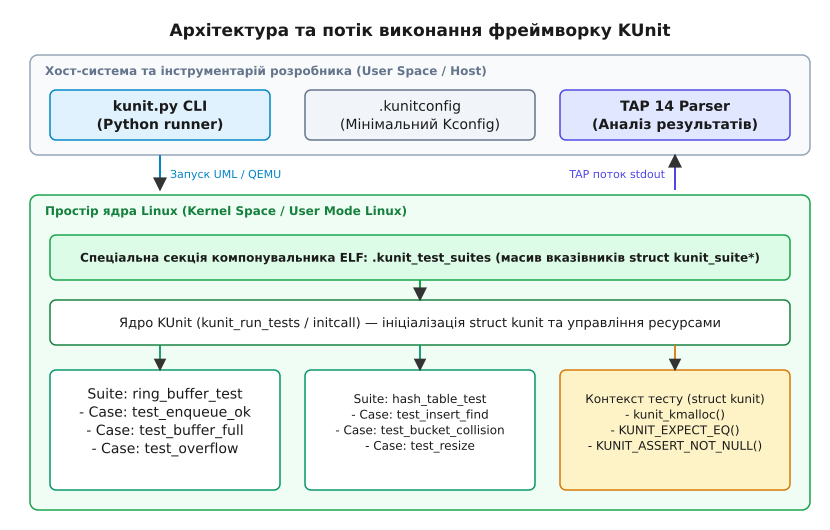
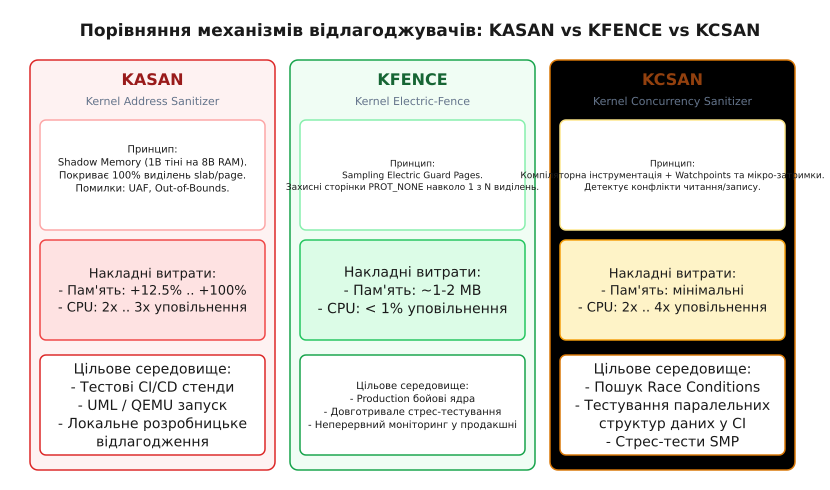
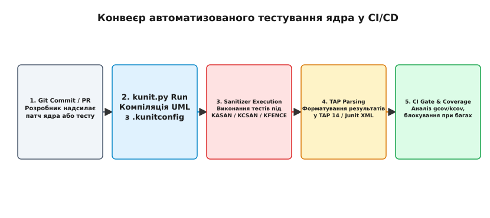

# Фреймворк тестування ядра KUnit та відлагоджувачі KASAN/KCSAN/KFENCE

<preknowlist>
- [Модулі ядра Linux та інтерфейси UAPI](book:unix-linux/kernel-modules) — базова структура C-коду в просторі ядра.
- [Kernel Address Sanitizer (KASAN)](book:unix-linux/kasan-kernel-address-sanitizer) — механізм виявлення помилок адресації через тіньову пам'ять.
- [Kernel Concurrency Sanitizer (KCSAN)](book:unix-linux/kcsan-concurrency-sanitizer) — моніторинг конфліктного паралельного доступу до пам'яті.
</preknowlist>

Розробка та підтримання коду в просторі ядра Linux супроводжується фундаментальною інженерною дилемою: як забезпечити абсолютну надійність низькорівневих алгоритмів у системі, де ціна однієї помилки означає аварійну зупинку всього обладнання. У звичайній програмі простору користувача (User Space) розіменування некоректної адреси пам'яті або вихід за межі масиву викликає негайну ізольовану зупинку поточної програми операційною системою — генерується сигнал `SIGSEGV`, процес завершується, а на диск записується аварійний дамп пам'яті (Core Dump). Решта системних процесів продовжують працювати без жодних перешкод.

У просторі ядра (Kernel Space) захисних бар'єрів операційної системи над кодом не існує. Ядро Linux виконується з найвищими привілеями процесора (Ring 0 на x86_64 або EL1 на ARM64) і має прямий необмежений доступ до фізичної пам'яті, кешів CPU, шин даних та контролерів вводу-виводу. Будь-яка помилка адресації — використання некоректного вказівника, розіменування `NULL`, вихід за межі виділеного блоку `kmalloc` або запис у звільнену пам'ять (Use-After-Free) — негайно руйнує критичні структури даних ядра, викликає спотворення адресних таблиць сторінок пам'яті або викликає фатальну помилку ядра (`kernel panic` або `kernel OOPS`). При цьому система втрачає працездатність, а поточний стан пам'яті руйнується, позбавляючи розробника можливості зручного відлагодження.

Традиційний підхід до верифікації коду ядра, що склався у 1990-х та 2000-х роках, базувався на візуальному аналізі виводу журналувань `printk()`, додаванні тимчасових діагностичних викликів у код, компіляції тестового модуля ядра, завантаженні його командою `insmod` та виконанні ручних або скриптових тестів із простору користувача. Такий цикл розробки «зміна — компіляція — завантаження — тест» (Edit-Compile-Test cycle) мав критичні недоліки:

1. **Величезні часові затримки**: Для перевірки найменшої зміни розробник мусив скомпілювати новий образ ядра, перезавантажити віртуальну машину QEMU або фізичний тестовий стенд, дочекатися завантаження ініціалізаційних скриптів `initramfs` та замонтувати файлові системи. Перевірка однієї зміни займала від кількох хвилин до півгодини.
2. **Неможливість ізоляції приватних функцій**: Ключова логіка ядра — алгоритми балансування черг планивальника завдань, розпис сторінок віртуальної пам'яті, формування мережевих сокетних буферів `sk_buff`, обробка метаданих файлових систем — реалізується у вигляді приватних статичних функцій (`static`). Вони свідомо не експортуються у таблицю символів ядра через `EXPORT_SYMBOL()`, щоб не засмічувати ядро і не створювати непідтримуваних залежностей. Перевірити таку функцію «ззовні» через системні виклики (syscalls) чи файли `/sys` і `/proc` неможливо без написання складного обхідного коду.
3. **Невизначеність стану та важкість відтворення**: Системні інтеграційні тести залежать від завантажених драйверів, стану апаратури, таймінгів таймерів та паралельних процесів. Баг, що виникав при інтеграційному тестуванні, часто не вдавалося стабільно відтворити.

Фреймворк KUnit (Kernel Unit Testing Framework) вирішує ці проблеми, запроваджуючи у ядро Linux повноцінну концепцію модульного юніт-тестування (Unit Testing). KUnit дозволяє виконувати тести безпосередньо всередині простору ядра, звертатися до приватних `static` функцій підсистем, отримувати деталізовані звіти про перевірки за мілісекунди та виконувати тести абсолютно герметично у середовищі User Mode Linux (UML) без ризику краху хост-системи. Детальний історичний опис еволюції методів тестування Linux наведено у [📜 Історія появи KUnit та еволюція тестування ядра Linux](book:unix-linux/kernel-kunit-test-framework/hist-kunit-origins.md).

---

## 1. Архітектура та макроструктури KUnit: як ядро організовує тести

KUnit побудований на концепції внутрішньоядерної герметичності: тестовий код компілюється разом із підсистемою ядра, яку він перевіряє, і має прямий доступ до її внутрішніх даних, приватних структур та статичних функцій.

Основними будівельними блоками KUnit є дві структури даних: `struct kunit_case` (окремий тестовий сценарій) та `struct kunit_suite` (набір пов'язаних тестів).

```c
#include <kunit/test.h>

/* Тіло окремого тесту */
static void test_example_addition(struct kunit *test)
{
	int sum = 2 + 2;
	KUNIT_EXPECT_EQ(test, sum, 4);
}

/* Опис списку тестів у сюїті */
static struct kunit_case example_test_cases[] = {
	KUNIT_CASE(test_example_addition),
	{} /* Фінальний порожній елемент-маркер */
};

/* Опис тестового сюїту */
static struct kunit_suite example_test_suite = {
	.name = "example_addition_suite",
	.test_cases = example_test_cases,
};

/* Реєстрація сюїту в системі */
kunit_test_suite(example_test_suite);
```

### Механізм зв'язування через секції ELF

Під час компіляції ядра або модуля макрос `kunit_test_suite()` виконує низькорівневу магію компонувальника (Linker). Він загортає вказівник на `struct kunit_suite` у спеціальну атрибутивну секцію ELF-файлу `.kunit_test_suites`:

```c
#define kunit_test_suite(suite) \
	static struct kunit_suite *kunit_suite_##suite \
	__attribute__((__section__(".kunit_test_suites"), used)) = &suite
```

Завдяки цьому компонувальник під час збірки об'єднує всі вказівники на тестові сюїти ядра у єдиний неперервний масив між символами `__kunit_suites_start` та `__kunit_suites_end`.

Коли ядро завантажується (або коли завантажується відповідний модуль ядра командою `modprobe`), підсистема ініціалізації KUnit проходить по цій секції як по суцільному масиву вказівників. Це дозволяє ядру динамічно виявляти усі наявні тестові сюїти без необхідності явного виклику центральної функції реєстрації або модифікації головного коду ініціалізації ядра (`init/main.c`).


*Архітектура та потік виконання KUnit під управлінням User Mode Linux (UML).*

### Життєвий цикл виконання тесту

Кожен тестовий сценарій виконується в окремому контексті, який описується структурою `struct kunit`. Послідовність виконання сюїту включає такі етапи:

1. **`suite_init`**: Якщо функція визначена розробником у `.suite_init`, вона викликається один раз перед запуском найпершого тесту в сюїті для налаштування глобального стану підсистеми.
2. **`init`**: Викликається безпосередньо перед запуском *кожного* окремого тесту (аналог `setUp()` у xUnit). Тут готуються локальні об'єкти, виділяється тестова пам'ять та ініціалізуються структури.
3. **`run_case`**: Виконання функції тесту. Контекст `struct kunit *test` передається як єдиний аргумент, через який здійснюється виклик тверджень та виділення ресурсів.
4. **`exit`**: Викликається після завершення тесту (аналог `tearDown()`) для вивільнення ресурсів, навіть якщо тест завершився помилкою.
5. **`suite_exit`**: Викликається після виконання останнього тесту в сюїті для деініціалізації глобальних об'єктів.

### Перевірки та твердження: EXPECT проти ASSERT

KUnit розділяє макроси перевірки на дві групи з різною семантикою поведінки при виявленні невідповідності:

- **`KUNIT_EXPECT_*` (Non-fatal)**: При невиконанні умови KUnit логує помилку (із зазначенням файла, рядка та очікуваного/фактичного значення) і позначає поточний тест як невдалий (`failed`). Проте виконання функції тесту **продовжується**. Це дозволяє перевірити кілька незалежних властивостей об'єкта за один запуск.
- **`KUNIT_ASSERT_*` (Fatal)**: При невиконанні умови KUnit фіксує помилку і **негайно перериває** виконання поточного тесту. Це необхідно, коли подальше виконання призведе до `kernel panic` або краху (наприклад, якщо перевірка `KUNIT_ASSERT_NOT_NULL(test, ptr)` виявила нульовий вказівник, подальше розіменування `ptr->field` розіб'є систему).

Внутрішньо `KUNIT_ASSERT_*` використовує механізм переривання потоку ядра (`kthread_exit` або повернення через обгортки `kunit_try_catch`), зупиняючи виконання поточної функції тесту і передаючи управління в етап `exit`.

### Управління ресурсами тесту (`kunit_kmalloc`)

Однією з головних пасток тестування в ядрі є витоки пам'яті: якщо тест виділяє пам'ять через `kmalloc()`, а потім завершується помилкою через `KUNIT_ASSERT_*`, стандартна функція `kfree()` у кінці функції не буде викликана. З часом це призводить до вичерпання пам'яті ядра.

Для вирішення цієї проблеми KUnit надає кероване API виділення ресурсів:

```c
void *kunit_kmalloc(struct kunit *test, size_t size, gfp_t gfp);
void *kunit_kzalloc(struct kunit *test, size_t size, gfp_t gfp);
```

Пам'ять, виділена через `kunit_kmalloc()`, прив'язується до списку ресурсів `test->resources`. Коли тест завершується (успішно або аварійно), KUnit автоматично обходить цей список у зворотному порядку (LIFO) і звільняє усе виділене виділення. Для довільних ресурсів ядра (наприклад, закриття м'ютексів, видалення таймерів чи звільнення пристроїв) використовується універсальна функція `kunit_alloc_resource()`.

### Динамічні заглушки (Static Stubbing)

Для ізоляції коду від реального апаратного забезпечення KUnit реалізує механізм Static Stubbing. За допомогою макросу `kunit_activate_static_stub(test, real_func, replacement_func)` можна під час виконання тесту перенаправити виклики функції `real_func` на тестову заглушку `replacement_func`. Це дозволяє імітувати збої апаратури або повернення специфічних кодів помилок без підключення реальних фізичних контролерів.

Перехоплення реалізується на рівні макросу `KUNIT_STATIC_STUB_REDIRECT(real_func, args...)`, який вбудовується у початок функції `real_func`. Якщо для цієї функції було активовано заглушку через `kunit_activate_static_stub()`, макрос перехоплює потік виконання, передає аргументи у `replacement_func` і здійснює негайне повернення з функції без виконання її основного тіла.

---

## 2. Виконання тестів через User Mode Linux (UML) та утиліту `kunit.py`

Повна збірка ядра Linux для x86_64 або ARM64 з подальшим запуском у QEMU займає значний час. Щоб забезпечити мілісекундний зворотний зв'язок, KUnit використовує архітектуру **User Mode Linux (UML)**.

UML — це порт ядра Linux, який компілюється як звичайний користувацький виконуваний файл для операційної системи POSIX. Під час запуску таке «ядро» виконується як окремий процес у просторі користувача хост-машини, перехоплюючи власні системні виклики та імітуючи роботу пам'яті та процесора за допомогою системних викликів `mmap` та `ptrace`.

### Скрипт-ранер `kunit.py`

Для автоматизації збірки та запуску тестів використовується Python-скрипт `tools/testing/kunit/kunit.py`. Він автоматизує весь цикл тестування однією командою:

```bash
./tools/testing/kunit/kunit.py run
```

Під капотом `kunit.py` виконує такі кроки:

1. **Конфігурація (`.kunitconfig`)**: Скрипт створює мінімальний файл конфігурації ядра `.kunit/.config`, включаючи лише необхідні базові підсистеми ядра, опції `CONFIG_KUNIT=y` та конфігурації вказаних тестів. Це зменшує час компіляції з десятків хвилин до кількох секунд.
2. **Збірка UML**: Викликається команда `make ARCH=um olddefconfig` та `make ARCH=um -j$(nproc)`. В результаті створюється виконуваний файл `./vmlinux`.
3. **Запуск виконуваного файлу**: Запускається створене UML-ядро у фоновому режимі без графічного інтерфейсу та без ініціалізації драйверів пристроїв.
4. **Перехоплення виводу**: Ядро виконує тестові сюїти на етапі завантаження (`initcall`), виводить результати у стандартний потік `stdout` і негайно завершує свій процес.
5. **Парсинг TAP**: `kunit.py` читає текстовий потік у форматі TAP 14 (Test Anything Protocol), розфарбовує вивід у терміналі та формує підсумковий звіт.

### Запуск тестів на реальному обладнанні та QEMU

Хоча UML є основним середовищем для алгоритмічних тестів, деякі підсистеми ядра вимагають перевірки на специфічних процесорних архітектурах (наприклад, перевірка інструкцій ARM64 MTE або контролерів переривань APIC/GIC). У таких випадках `kunit.py` підтримує запуск тестів у середовищі QEMU за допомогою прапорців:

```bash
./tools/testing/kunit/kunit.py run --arch=arm64 --cross_compile=aarch64-linux-gnu-
```

У цьому режимі `kunit.py` збирає повноцінне ядро під цільову архітектуру, запускає його в емуляторі QEMU з емуляцією серійного порту `ttyAMA0`, зчитує потік TAP 14 з консолі QEMU та зупиняє емулятор після виконання останнього тесту.

### Протокол TAP 14 (Test Anything Protocol)

KUnit транслює результати у стандартизованому текстовому форматі TAP 14. Це дозволяє легко інтегрувати вивід KUnit із будь-якими CI/CD системами (Jenkins, GitHub Actions, GitLab CI).

Структура виводу включає версію протоколу, план тестів (`1..N`), назву сюїту та статуси кожного випадку:

```text
TAP version 14
1..1
    # Subtest: ext4_allocation_suite
    1..2
    ok 1 - test_free_blocks_count
    # test_inode_bitmap: EXPECTATION FAILED at fs/ext4/mballoc-test.c:120
    # Expected bitmap == 0, but is 1
    not ok 2 - test_inode_bitmap
# ext4_allocation_suite: pass:1 fail:1 skip:0 total:2
not ok 1 - ext4_allocation_suite
```

---

## 3. Відлагоджувачі пам'яті та гонитв як пасивний захисний шар: KASAN, KCSAN та KFENCE

Юніт-тест KUnit перевіряє лише ті твердження, які розробник явно записав у макроси `KUNIT_EXPECT_*`. Проте код ядра може містити приховані дефекти, які не призводят до негайного падіння тесту: вихід за межі масиву на 1 байт (Off-by-one), читання звільненої пам'яті (Use-After-Free) або несинхронізований паралельний доступ (Data Race).

Для виявлення таких прихованих багів KUnit запускається у зв'язці з трьома системними санітайзерами ядра: **KASAN**, **KCSAN** та **KFENCE**. Вони діють як пасивний захисний шар, який моніторить кожну операцію читання та запису під час виконання KUnit-тестів.


*Порівняння механізмів виявлення помилок пам'яті та гонитв у ядрі Linux.*

### 3.1. KASAN (Kernel Address Sanitizer)

KASAN — це інструмент динамічного аналізу пам'яті, призначений для виявлення помилок адресації: `out-of-bounds` (для slab, page та stack виділень) та `use-after-free`.

В основі KASAN лежить концепція **тіньової пам'яті (Shadow Memory)**. Вся адресатна простора ядра відображається у тіньову область у співвідношенні 8:1 (1 байт тіні описує доступність 8 байт реальної пам'яті).

- Значення `0x00` у тіньовому байті означає, що всі 8 байт адреси є легітимними для читання та запису.
- Значення від `1` до `7` вказують кількість перших доступних байт.
- Від'ємні значення (або спеціальні коди типу `0xFA`, `0xFB`) означають, що адреса є заотруєною («poisoned»): червона зона (Redzone), вивільнена пам'ять або захисна сторінка.

Під час компіляції компілятор (GCC або Clang) вставляє перевірку тіньової пам'яті перед кожною операцією читання або запису:

```text
// Автоматично згенерована перевірка KASAN:
shadow_addr = (mem_addr >> 3) + KASAN_SHADOW_OFFSET;
if (*shadow_addr != 0) {
    kasan_report(mem_addr, size, is_write);
}
```

Якщо KUnit-тест намагається зчитати байт із заотруєної зони KASAN, санітайзер ґенерує повідомлення про помилку у `dmesg`, яке KUnit перехоплює і позначає тест як невдалий.

Детальний аналіз внутрішньої структури тіньової пам'яті та типів заотруєння наведено у [Kernel Address Sanitizer (KASAN)](book:unix-linux/kasan-kernel-address-sanitizer).

### 3.2. KCSAN (Kernel Concurrency Sanitizer)

KCSAN — це динамічний детектор гонитв за даними (Data Races) у багатопотоковому коді ядра.

На відміну від логічних випробувань, стану гонитви проявляються несистемно і залежать від таймінгів виконання на конкретних процесорних ядрах (SMP). KCSAN використовує інструментацію компілятора (`__tsan_read` / `__tsan_write`) та механізм точок спостереження (Watchpoints).

Коли потік ядра виконує операцію запису в пам'ять:
1. KCSAN із певною ймовірністю встановлює точку спостереження (watchpoint) на цю адресу пам'яті у хеш-таблиці моніторингу.
2. Потік штучно призупиняється на мікроскопічну затримку (короткий цикл затримки на кілька мікросекунд).
3. Якщо протягом цього часового вікна інший процесорний потік намагається зчитати або записати дані за цією ж адресою без використання захисних примітивів синхронізації (spinlocks, mutexes, RCU), KCSAN реєструє факт конфліктного паралельного доступу.

Коли KUnit виконує багатопотокові стрес-тести під KCSAN, виявлені гонитви миттєво потрапляють у підсумковий звіт тесту. Повний опис налаштувань та аннотацій синхронізації KCSAN описано у [Kernel Concurrency Sanitizer (KCSAN)](book:unix-linux/kcsan-concurrency-sanitizer).

### 3.3. KFENCE (Kernel Electric-Fence)

Хоча KASAN дає 100% покриття помилок пам'яті, він має високі накладні витрати: споживання пам'яті зростає на 12.5%–100%, а швидкість виконання ядра знижується у 2–3 рази. Це робить KASAN непридатним для використання у бойових середовищах (Production) або на слабкому апаратному забезпеченні.

KFENCE (Kernel Electric-Fence) розроблений як низьковитратна альтернатива KASAN із накладними витратами менше 1% по CPU та пам'яті.

#### Механізм роботи KFENCE (Sampling Guard Pages)

KFENCE не використовує суцільну тіньову пам'ять. Замість цього він працює за принципом **імовірнісної вибірки (Sampling)**:

1. KFENCE виділяє невеликий пул захисних сторінок (Object Pool, за замовчуванням 255 об'єктів).
2. Кожна виділена сторінка з обох боків оточена захисними сторінками пам'яті з прапорцями доступу `PROT_NONE` (Guard Pages). У таблицях сторінок пам'яті (PTE) для цих сторінок скинуто прапорець `_PAGE_PRESENT`.
3. При виконанні системних виділень `kmalloc()` KFENCE перехоплює 1 з N виділень (за розкладом таймера, наприклад кожні 100 мілісекунд) і розміщує об'єкт у своєму пулі безпосередньо впритул до захисної сторінки `PROT_NONE`.
4. Якщо код ядра виходить за межі виділеного об'єкта хоча б на 1 байт, процесор намагається звернутися до сторінки `PROT_NONE`, що викликає апаратне переривання похибки сторінки (Page Fault).
5. Апаратне переривання негайно перехоплюється обробником `do_page_fault()` у KFENCE, який розпізнає адресну зону пулу і формує точний звіт із дампом стеку викликів.

Завдяки мізерним витратам KFENCE дозволяє запускати KUnit-тести безпосередньо у продакшн-ядрах або під час довготривалого навантажувального тестування без ризику сповільнення системи.

---

## 4. Автоматизований конвеєр CI/CD та шаблони розробки

Повний потенціал KUnit та санітайзерів розкривається при їх інтеграції в автоматизовані конвеєри безперервної інтеграції (CI/CD).

Скрипт `kunit.py` підтримує генерацію конфігураційних файлів та виконання тестів із підключенням аналізу покриття коду (`gcov` / `kcov`). Прапор `--gcov` автоматично підключає опції компілятора для розрахунку покриття рядків коду вихідного файлу модулів.


*Конвеєр автоматизованого тестування ядра Linux у середовищі безперервної інтеграції (CI/CD).*

Повний опис параметрів завантаження ядра, керування інтерфейсами `sysfs`/`debugfs` та специфікацію API KUnit зведено у довіднику [📋 Інтерфейс API KUnit та налаштування санітайзерів](book:unix-linux/kernel-kunit-test-framework/api-kunit-and-sanitizers.md).

Практичний приклад написання реального тестового сюїту KUnit для кільцевого буфера ядра із розбором типових пасток пам'яті наведено у [⚙️ Практична реалізація тестового сюїту KUnit з підвохами санітайзерів](book:unix-linux/kernel-kunit-test-framework/proj-kunit-test-suite.md).

---

## 5. Порівняльний аналіз та критерії вибору інструментів

Для вибору оптимальної стратегії тестування коду ядра необхідно враховувати відмінності між KUnit, `kselftest` та різними санітайзерами.

### Таблиця 1. Порівняльний аналіз KUnit та kselftest

| Критерій | KUnit | kselftest |
| :--- | :--- | :--- |
| **Рівень тестування** | Модульне (Unit Testing). | Інтеграційне / Системне. |
| **Середовище виконання** | Всередині ядра (UML або Bare-Metal initcall). | Простір користувача (User Space binaries). |
| **Доступ до `static` функцій** | Прямий (компілюється разом із модулем). | Відсутній (лише UAPI, syscalls, sysfs). |
| **Швидкість запуску** | Мілісекунди (< 1-2 сек на весь сюїт). | Десятки секунд чи хвилини (потрібен boot). |
| **Залежність від апаратури** | Ні (за замовчуванням виконується в UML). | Так (вимагає реальних драйверів/підсистем). |
| **Формат виводу** | TAP 14. | Custom / TAP. |

### Таблиця 2. Порівняльна матриця санітайзерів KASAN, KFENCE та KCSAN

| Характеристика | KASAN | KFENCE | KCSAN |
| :--- | :--- | :--- | :--- |
| **Основна мета** | Помилки пам'яті (OOB, UAF). | Помилки пам'яті у продакшні. | Гонитви за даними (Data Races). |
| **Механізм** | Тіньова пам'ять (Shadow Memory). | Захисні сторінки (Guard Pages sampling). | Компіляторна інструментація + Watchpoints. |
| **Покриття виділень** | 100% виділень slab/page. | 1 з N виділень (Sampling). | Моніторинг усіх неатомарних доступів. |
| **Витрати пам'яті** | Високі (+12.5% .. +100%). | Низькі (~1-2 МБ на пул). | Мінімальні. |
| **Уповільнення CPU** | 2x .. 3x. | < 1%. | 2x .. 4x. |
| **Придатність для Prod** | Ні (лише CI/Staging). | Так (розроблено для Prod). | Ні (лише CI/Staging). |

---

## 6. Новий синтез

Сучасна інженерія якості ядра Linux спирається на комбінацію активного зсуву тестування ліворуч (Shift-Left Testing) за допомогою KUnit та пасивного моніторингу безпеки за допомогою санітайзерів пам'яті. KUnit уможливлює герметичну перевірку складних внутрішньоядерних алгоритмів за мілісекунди у середовищі User Mode Linux без залучення важкого апаратного забезпечення. У свою чергу, спільний запуск KUnit із KASAN, KCSAN та KFENCE гарантує виявлення як логічних невідповідностей у коді, так і прихованих руйнувань адресного простору та конфліктних багатопотокових доступів на найраніших етапах розробки.
