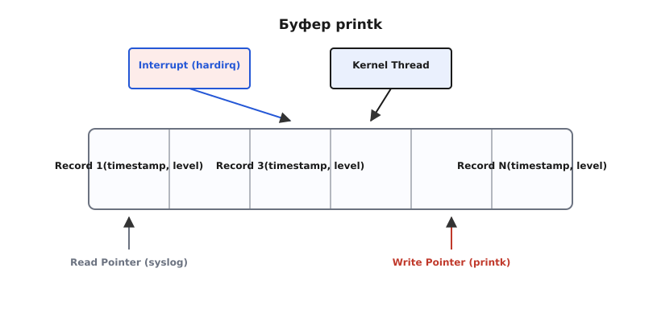

# Журнал ядра: printk, рівні важливості й dmesg

<details>
<summary>💡 Що варто знати наперед</summary>
<preknowlist>
- **Ядро й простір користувача:** код ядра працює ізольовано, не маючи доступу до бібліотек на кшталт `libc` (див. 🔗 Ядро й простір користувача).
- **Переривання:** ядро часто працює в контексті переривань, де не можна блокуватися чи чекати.
</preknowlist>
</details>

Коли програмі у просторі користувача треба вивести повідомлення, вона кличе `printf()` із бібліотеки `libc`, і та через системний виклик `write()` відправляє байти у стандартний вивід. Але коли повідомлення хоче вивести **саме ядро**, цього механізму не існує. У ядра немає стандартного виводу, немає файлових дескрипторів, прив'язаних до термінала (вони належать процесам), і немає `libc`. Більш того, ядро часто виконує код у контексті переривань, де не можна чекати на завершення повільного виводу на екран.

Тому ядро Linux має власну, автономну систему логування, серцем якої є функція `printk()`. Вона розв'язує задачу: як гарантовано записати повідомлення про стан ядра, навіть якщо система падає (kernel panic), і як передати ці повідомлення адміністратору чи демонам системного журналу, не блокуючи роботу процесора.

Ця стаття розбирає анатомію журналу ядра: як влаштований `printk`, де фізично лежать повідомлення (кільцевий буфер), як працюють рівні важливості та як простір користувача читає цей журнал через `dmesg` та `/dev/kmsg`.

## 1. Чому ядру потрібен свій printf

Уявімо драйвер мережевої карти, який щойно отримав переривання від обладнання, бо кабель від'єднано. Драйвер працює в жорсткому контексті переривання (hardirq). Він мусить залишити повідомлення «Link down».

Якби ядро намагалося одразу вивести цей текст на екран чи записати на диск, виникло б кілька нездоланних проблем:
1. **Блокування:** запис на диск вимагає роботи планувальника, файлової системи й драйвера диска, що означає засинання (сплячку). У контексті переривання спати заборонено — це миттєво призведе до паніки ядра.
2. **Бракування замків:** якщо вивід іде на послідовний порт (serial console), а замок порту зараз тримає інший процес (який якраз і перервали), спроба взяти замок призведе до мертвого блокування (deadlock).
3. **Паніка:** якщо система вже в стані критичного збою (наприклад, пошкоджено пам'ять), більшість підсистем уже мертві. Вивід мусить працювати навіть тоді, коли нічого іншого не працює.

Тому `printk()` розроблено за принципом **відкладеного виводу (deferred output)**. Коли код ядра кличе `printk("Link down\n")`, функція робить мінімум роботи: вона бере рядок, додає до нього мітку часу й рівень важливості, і складає в масив у пам'яті — **кільцевий буфер (ring buffer)**. Після цього `printk` повертає керування, витративши мікросекунди.

А вже згодом, коли з'явиться безпечний час, інша частина ядра (консольні драйвери) забере цей текст із буфера й повільно видрукує його на екран або в серійний порт. 

## 2. Кільцевий буфер: __log_buf

Усі повідомлення ядра зберігаються в єдиній глобальній структурі — кільцевому буфері. У старих ядрах це був просто масив символів `__log_buf`, а починаючи з Linux 3.5 — це масив записів (records) змінної довжини, а з Linux 5.10 — ще складніший lockless ring buffer. Але концептуально суть незмінна: це шматок пам'яті фіксованого розміру, виділений під час завантаження ядра.

Розмір буфера визначається параметром конфігурації `CONFIG_LOG_BUF_SHIFT`. Наприклад, значення `18` означає $2^{18}$ байтів, тобто 256 кілобайтів. Якщо буфер переповнюється, нові повідомлення починають затирати найстаріші. Це типова поведінка кільцевого буфера: ядро гарантує, що найновіші події завжди збережені, пожертвувавши історією.

Кожен запис у буфері — це не просто текст. Він містить метадані (структура `printk_info` або подібна):
- **timestamp:** мітка часу (монотонний час ядра з моменту завантаження, у наносекундах).
- **facility:** джерело повідомлення (зазвичай `0` для ядра).
- **level:** рівень важливості (від 0 до 7).
- **caller:** ідентифікатор потоку/ядра процесора, який створив запис (додано для відлагодження).

Саме тому, коли ви дивитесь вивід `dmesg`, ви бачите час перед кожним рядком: `[  123.456789] eth0: link down`. Цей час не вписує драйвер, його автоматично підставляє `printk`, коли кладе повідомлення в буфер.


*Рис. 1. printk кладе запис у кільцевий буфер, після чого консольний потік виводить його на наявні консолі (екран, ttyS0).*

## 3. Рівні важливості (Loglevels)

Кожне повідомлення має рівень важливості (severity). Ядро використовує його, щоб вирішити, чи варто негайно виводити це повідомлення на консоль, чи просто мовчки покласти в буфер, щоб адміністратор міг прочитати його пізніше.

Рівні визначені як макроси від `KERN_EMERG` (0) до `KERN_DEBUG` (7):

- `KERN_EMERG` (`"0"`): **Аварія (Emergency)** — система не може функціонувати. Зазвичай передує паніці.
- `KERN_ALERT` (`"1"`): **Тривога (Alert)** — потрібне негайне втручання (наприклад, пошкодження бази даних ядра).
- `KERN_CRIT` (`"2"`): **Критично (Critical)** — апаратна або програмна критична помилка.
- `KERN_ERR` (`"3"`): **Помилка (Error)** — помилка пристрою, яку не вдалося виправити.
- `KERN_WARNING` (`"4"`): **Попередження (Warning)** — проблема, яка не є фатальною, але потребує уваги.
- `KERN_NOTICE` (`"5"`): **Примітка (Notice)** — нормальна, але значуща подія.
- `KERN_INFO` (`"6"`): **Інформація (Info)** — інформаційне повідомлення (наприклад, підключено новий USB-пристрій).
- `KERN_DEBUG` (`"7"`): **Відлагодження (Debug)** — повідомлення для розробників.

У коді це виглядає так:
```c
printk(KERN_ERR "nvme: controller is dead\n");
```
Зверніть увагу: між `KERN_ERR` і рядком немає коми. `KERN_ERR` у мові C визначений як рядковий літерал `"\0013"`, і компілятор склеює його з вашим повідомленням. Тобто ядро насправді бачить рядок `"\0013nvme: controller is dead\n"`, де спеціальний префікс каже парсеру ядра, що рівень дорівнює 3.

У сучасних ядрах є зручніші макроси-обгортки: `pr_err("...")`, `pr_info("...")`, `pr_debug("...")`. Вони роблять те саме, але код стає чистішим.

## 4. Як повідомлення потрапляє на екран: Консолі та sysctl

Покласти рядок у пам'ять — це лише половина справи. Друга половина — показати його. 

У ядрі є поняття **консолі (console)**. Це не обов'язково монітор. Консоллю може бути відеокарта (VGA/Framebuffer), послідовний порт (serial port, `ttyS0`), або навіть мережевий інтерфейс (netconsole). 

Коли повідомлення потрапляє в `__log_buf`, підсистема `printk` порівнює його рівень важливості з **поточним рівнем консолі (console loglevel)**. Якщо повідомлення **важливіше** (тобто його число *менше* за console loglevel), воно негайно передається драйверам консолі для виводу. Якщо ні — воно просто лежить у буфері.

Цей фільтр керується через sysctl `kernel.printk` (або файл `/proc/sys/kernel/printk`). Якщо вивести його вміст, ви побачите 4 числа:
```bash
$ cat /proc/sys/kernel/printk
4 4 1 7
```
Ці числа (зліва направо) означають:
1. **console_loglevel:** поточний рівень для виводу на консоль. Значення 4 означає, що виводитимуться повідомлення рівнів 0, 1, 2 і 3 (`EMERG`, `ALERT`, `CRIT`, `ERR`). Попередження (4) та інфо (6) на екран не потраплять.
2. **default_message_loglevel:** рівень за замовчуванням, якщо `printk` викликали без префікса (зазвичай 4).
3. **minimum_console_loglevel:** мінімально можливий рівень, до якого можна опустити `console_loglevel` (зазвичай 1).
4. **default_console_loglevel:** рівень при завантаженні (зазвичай 7, щоб бачити багато інформації під час boot).

Коли на сервері без графічної оболонки раптом на весь екран поверх вашої роботи в терміналі вискакує повідомлення `eth0: link down` — це означає, що подія мала рівень, достатній для подолання `console_loglevel`, і ядро видрукувало її прямо у фреймбуфер.

## 5. dmesg, /dev/kmsg та демони журналу

Хоча фільтр консолі відсікає неважливі повідомлення від екрана, **у кільцевому буфері зберігаються всі повідомлення** (поки їх не витіснять нові). Простір користувача мусить якось їх читати.

Для цього ядро надає два основні інтерфейси:
1. **`/dev/kmsg`**: сучасний і зручний пристрій. Якщо його відкрити й читати, ви будете отримувати повідомлення ядра як потоки даних, причому з підтримкою блокування (читання чекає, поки з'явиться нове). Ба більше, у `/dev/kmsg` можна *писати* — і це потрапить у журнал ядра (цим користується systemd-journald).
2. **`/proc/kmsg`** та системний виклик `syslog()`: старий інтерфейс. `/proc/kmsg` працює так, що прочитані дані **видаляються** з буфера (точніше, зсувається вказівник прочитаного для цього конкретного читача, але традиційно його тримав лише один демон `klogd`). 

Команда `dmesg` працює саме через ці інтерфейси (у сучасних системах — через `syslog(SYSLOG_ACTION_READ_ALL, ...)` або `/dev/kmsg`). Вона бере вміст кільцевого буфера, форматує час (переводить наносекунди ядра в реальний час, якщо попросити прапорцем `-T`) і виводить на екран.

Демони на кшталт `rsyslog` або `systemd-journald` постійно тримають відкритим `/dev/kmsg` або `syslog()` інтерфейс і перекладають усе, що народжує ядро, на диск — у файли `/var/log/kern.log` або у бінарний журнал journald. Саме завдяки їм ви можете побачити причину паніки ядра після перезавантаження, якщо ядро встигло скинути буфер на диск (хоча при справжній жорсткій паніці ядро встигає плюнути текст лише на послідовний порт, а на диск не пише, бо файлова система може бути пошкоджена).

## 6. Еволюція printk та боротьба з deadlocks

У старих ядрах `printk` був простою функцією: узяти спінлок, записати в буфер, і тут же, тримаючи спінлок, викликати драйвери консолі. Це працювало роками, але зі зростанням кількості ядер процесора стало проблемою.

Якщо багато процесорів одночасно кличуть `printk`, вони всі стають у чергу за замком. Але найгірше — це повільні консолі. Послідовний порт (`ttyS0`) працює на швидкості 115200 бод (бітів на секунду). Вивід довгого рядка може зайняти мілісекунди. Якщо один процесор взяв замок буфера і почав повільно виводити текст у порт, усі інші процесори, які в цей час захотіли зробити `printk` (навіть із контексту переривання), зависнуть в очікуванні (спінінгу). 

Це призводило до **printk deadlocks** і жорстких затримок (latency), які вбивали продуктивність систем реального часу.

Тому в останніх версіях Linux (особливо 5.10 і пізніше) `printk` кардинально переписали:
1. Кільцевий буфер став **lockless** (без замків). Процесори використовують атомарні операції, щоб виділити собі шматок буфера й записати туди дані, не блокуючи одне одного.
2. Вивід на консоль **відв'язано** від запису. Тепер є окремі потоки (kthreads) для консолей, які забирають готові записи з буфера й повільно виводять їх, поки інші процесори продовжують роботу. Залишився лише механізм екстреного синхронного виводу для стану паніки.

## Підсумок

`printk` — це автономна кровоносна система логування ядра. Її головна зброя — кільцевий буфер пам'яті, який дозволяє миттєво зберегти стан навіть із найглибшого переривання. Механізм рівнів важливості (`console_loglevel`) ізолює екран від спаму, а інтерфейс `/dev/kmsg` прокидає міст до простору користувача, де `dmesg` і `journald` перетворюють цей сирий потік на зручну історію життя системи.
