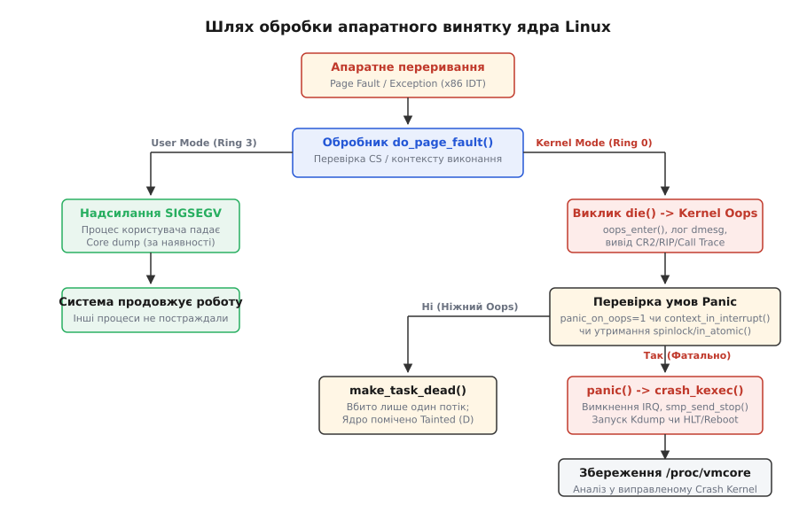
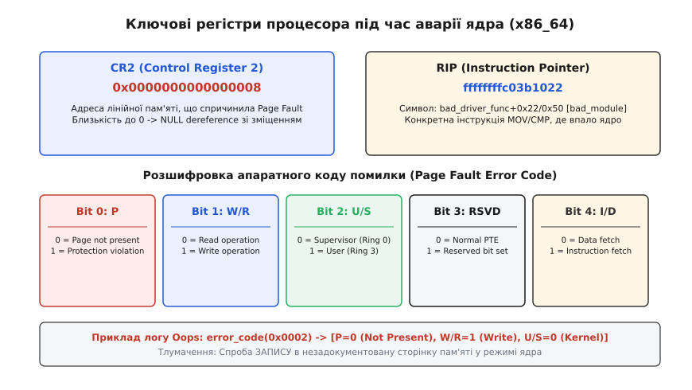
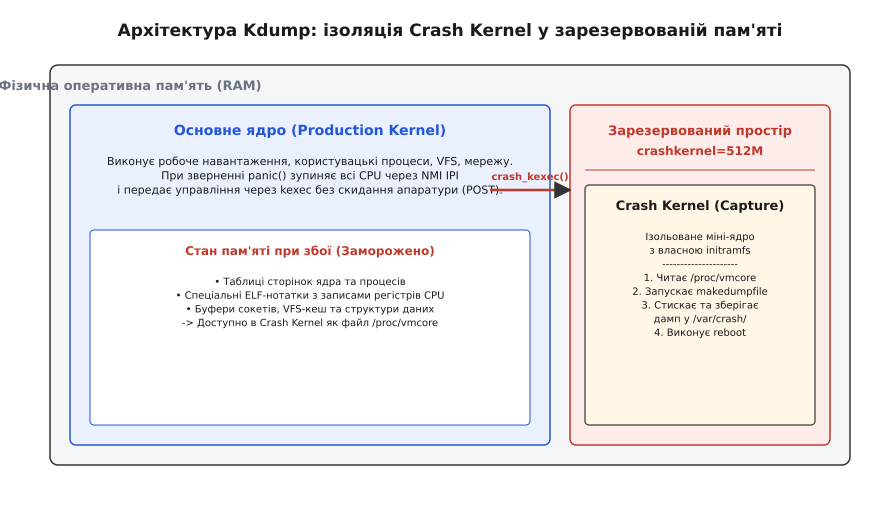

# Oops і паніка: що система робить, коли падає саме ядро

<preknowlist>
- [Ядро й простір користувача](book:unix-linux/kernel-and-userspace) — межа привілеїв між Ring 0 та Ring 3 і роль системних викликів.
- [Користувацькі дампи пам'яті](book:unix-linux/core-dump) — як система обробляє сигнальні аварійні завершення звичайних процесів.
- [Модулі ядра](book:unix-linux/kernel-modules) — динамічне завантаження коду в простір ядра та потенційні ризики пошкодження пам'яті.
</preknowlist>

Коли програма користувача (наприклад, веб-сервер або СУБД) намагається розіменувати нульовий вказівник або звернутися до чужого сегмента пам'яті, апаратне забезпечення процесора перехоплює це порушення і генерує виняток. Оскільки програма виконується в непривілейованому режимі Ring 3, ядро операційної системи ізолює збій: воно надсилає процесу сигнал `SIGSEGV`, зупиняє його виконання, за потреби зберігає файл дампа пам'яті (`core dump`) і негайно звільняє всі виділені йому ресурси. Решта процесів у системі продовжують працювати без найменшої затримки.

Проте коли аналогічна помилка стається всередині самого ядра Linux — у коді мережевого драйвера, підсистеми VFS або планивальника задач — захисного шару вище Ring 0 не існує. Ядро виконується в єдиному адресному просторі з абсолютними привілеями щодо апаратного забезпечення. Спроба коду ядра прочитати дані за адресою `0x0000000000000008` спричиняє той самий апаратний виняток процесора, але захищати ядро від самого себе нікому. У цій точці операційна система мусить визначити: чи можна локалізувати збій і вбити лише той потік, який спричинив помилку (стан **Kernel Oops**), чи пошкодження даних є надто глибоким і систему необхідно негайно і повністю зупинити (стан **Kernel Panic**).

---

## 1. Апаратні винятки й фундаментальна відмінність від збоїв користувацького простору

В архітектурі x86_64 та ARM64 процес виявлення помилок починається на рівні кремнію. Коли процесор виконує машинну інструкцію, яка намагається звернутися до віртуальної адреси, що не має відповідного мапування у таблиці сторінок (`Page Table`), блок управління пам'яттю (MMU) перериває поточний конвеєр інструкцій і генерує апаратний виняток Vector 14 — **Page Fault** (`#PF`).

Процесор зберігає поточний стан регістрів у внутрішньому стеку та передає управління за адресою з Таблиці векторів переривань (Interrupt Descriptor Table, IDT). У ядрі Linux цей вектор прив'язаний до високорівневого апаратного обробника `do_page_fault()`.


*Шлях обробки апаратного винятку ядра Linux: від IDT-переривання до розгалуження на вбивство процесу (Oops) або фатальну паніку й запуск Kdump.*

Першою дією обробника `do_page_fault()` є перевірка селектора сегмента коду (`CS` register) у момент виникнення винятку:

1. **Якщо `CS` вказує на Ring 3 (User Mode):** Обробник визначає, що виняток виник у коді користувача. Ядро аналізує адресу. Якщо це спроба динамічного розширення стека — ядро виділяє нову сторінку пам'яті та повертає управління програмі. Якщо ж адреса недійсна — ядро формує структуру `siginfo_t` і надсилає поточному процесу сигнал `SIGSEGV`. Потім планувальник переключає процесор на інші задачі.
2. **Якщо `CS` вказує на Ring 0 (Kernel Mode):** Помилка сталася під час виконання коду самого ядра. Тут ядро виконує процедуру перевірки абілітації через таблицю винятків (`fixup_exception`). Якщо адреса не є очікуваною (наприклад, помилка виникла не під час безпечного копіювання даних із простору користувача через `copy_from_user()`), ядро розуміє, що стабільність коду порушено, і передає управління підсистемі аварійної діагностики — функції `die()`.

---

## 2. Анатомія Kernel Oops: процедура `die()` та локалізація шкоди

Термін **Kernel Oops** позначає ситуацію, коли ядро виявило внутрішнє порушення (розіменування невалідного вказівника, некоректне вирівнювання пам'яті, порушення тверджень `BUG_ON`), але стан системи теоретично дозволяє завершити поточну задачу без негайної фатальної зупинки всієї системи.

Коли ядро фіксує таке порушення, викликається функція `die()` (розташована у файлі `arch/x86/kernel/dumpstack.c` або відповідному архітектурному каталозі). Процедура `die()` виконує суворо впорядковану послідовність дій:

```
do_page_fault()
  └── notify_die()
        └── die()
              ├── oops_enter()         <-- Блокування консолі та системного журналу
              ├── print_oops_end_desc() <-- Формування текстового шапки Oops
              ├── show_registers()     <-- Знімання зрізу CR2, RIP, RSP, EFLAGS
              ├── show_trace()         <-- Розкрутка стека (ORC Unwinder)
              ├── add_taint(TAINT_DIE)  <-- Встановлення прапорця 'D' у procfs
              ├── oops_exit()          <-- Звільнення блокувань логування
              └── make_task_dead()     <-- Завершення поточного task_struct
```

Детальний процес розгортання цієї процедури включає такі критичні кроки:

1. **Синхронізація консолі (`oops_enter()`):** Функція зупиняє паралельне логування інших процесорів і бере глобальний спінлок `die_lock`. Це запобігає перемішуванню текстових виводів, якщо кілька ядер CPU зіткнулися зі збоєм одночасно. Змінна `oops_in_progress` встановлюється в `1`, що змушує підсистему `printk` друкувати повідомлення негайно на фізичну консоль, обходячи внутрішні буфери.
2. **Логування шапки та стану:** Ядро виводить рядок вида `BUG: unable to handle page fault for address...` із зазначенням типу винятку та порядкового номера Oops (`Oops: 0002 [#1]`).
3. **Дамп регістрів процесора:** Функція `show_registers()` копіює вміст усіх основних регістрів загального призначення, керуючих регістрів `CR0-CR4` та вказівників стека.
4. **Розкрутка стека (Stack Trace):** Підсистема розкрутки простежує ланцюжок повернення з функцій від точки збою аж до первинного системного виклику або обробника переривання.
5. **Помічення ядра як Tainted:** Ядро додає бітовий прапорець `TAINT_DIE` (буква `D`) до лічильника `/proc/sys/kernel/tainted`. Це фіксує факт того, що цілісність оперативної пам'яті ядра відтепер під загрозою.
6. **Ізоляція та знищення процесу (`make_task_dead()`):** Замість виклику `do_exit()`, який виконує складні очистки та може застрягти на пошкоджених блокуваннях, ядро викликає низкорівневу функцію `make_task_dead()`. Поточний потік (`task_struct`) переводиться в стан `TASK_DEAD`, його пам'яті простору користувача відключається, а планувальник обирає наступну задачу для виконання.

> ⚠️ **Наслідки "м'якого" Oops:** Незважаючи на те, що після Oops сервер продовжує функціонувати, залишкова робота системи є вкрай ризикованою. Якщо пошкоджений потік утримував м'ютекс або `spinlock` у момент виклику `make_task_dead()`, цей ресурс залишиться заблокованим назавжди. Наступний потік, який спробує отримати цей замок, застрягне у стані `TASK_UNINTERRUPTIBLE` (D-state). Тому сервери після виникнення Oops підлягають плановому перезавантаженню у найближче технологічне вікно.

Історичний шлях розвитку цих механізмів детально розібрано у вставці [📜 Історія еволюції обробки ядерних збоїв](book:unix-linux/kernel-oops-panic/hist-kernel-faults-evolution.md).

---

## 3. Анатомія регістрів при збої: CR2, Faulting IP та Error Code

Під час розслідування аварій ядра перші два рядки логу Oops надають 90% діагностичної інформації. Вони містять фізичний стан регістрів процесора у точну мікросекунду збою.


*Вміст регістрів CR2 та RIP разом із бітовим розшифруванням апаратного коду помилки Page Fault.*

### Регістр CR2 (Control Register 2)
На архітектурах x86 та x86_64 процесор MMU автоматично записує у спеціальний керівний регістр **CR2** точну лінійну (віртуальну) адресу пам'яті, спроба доступу до якої спричинила Page Fault.

- Якщо значення `CR2` дорівнює `0x0000000000000000` — це пряме розіменування нульового вказівника (`NULL pointer dereference`).
- Якщо значення `CR2` становить невеличке число (наприклад, `0x0000000000000008` або `0x0000000000000028`) — код намагався прочитати або записати поле C-структури за вказівником, який дорівнював `NULL`. Зміщення (наприклад, `0x8`) відповідає байтовому зсуву цього поля від початку структури:

```c
struct net_device {
    int refcnt;        /* зміщення +0x0 */
    char *name;        /* зміщення +0x4 */
    struct ops *netdev_ops; /* зміщення +0x8 */
};

/* Якщо dev == NULL, виклик dev->netdev_ops згенерує Page Fault за адресою CR2 = 0x8 */
dev->netdev_ops->ndo_start_xmit(skb, dev);
```

### Порівняння регістрів між x86_64 та ARM64:
На відміну від x86_64, де адреса помилки записується у `CR2`, а адреса інструкції — у `RIP`, в архітектурі **ARM64** використовуються інші регістри:
- **FAR_EL1 (Fault Address Register):** Аналог `CR2` — містить віртуальну адресу, на якій стався збій доступу до пам'яті.
- **ELR_EL1 (Exception Link Register):** Аналог `RIP` — вказує на інструкцію, що згенерувала виняток.
- **ESR_EL1 (Exception Syndrome Register):** Містить розширений код синдрому винятку, включаючи тип інструкції та рівень привілеїв.

### Faulting IP (Instruction Pointer — RIP / PC)
Регістр **RIP** (на x86_64) або **PC** (на ARM64) вказує на точну адресу інструкції машинного коду, виконання якої призвело до аварії. Завдяки таблиці символів `kallsyms`, ядро автоматично форматує цю адресу у символьний вигляд:

```text
RIP: 0010:e1000_xmit_frame+0x35/0x180 [e1000e]
```

Тут:
- `0010` — селектор сегмента коду ядра.
- `e1000_xmit_frame` — ім'я C-функції, у якій впав процесор.
- `+0x35` — байтове зміщення збійної машинного інструкції від початку цієї функції.
- `/0x180` — загальний розмір цієї функції в байтах.
- `[e1000e]` — назва модуля ядра (`.ko`). Якщо модуль вбудовано в основне ядро (`vmlinux`), назва в дужках відсутня.

### Апаратний код помилки (Page Fault Error Code)
Разом із винятком `#PF` процесор проштовхує у стек бітову маску помилки (`error_code`):

```
 31                5   4   3   2   1   0
┌───────────────────┬───┬───┬───┬───┬───┐
│     Зарезервовано │I/D│RSV│U/S│W/R│ P │
└───────────────────┴───┴───┴───┴───┴───┘
```

- **Bit 0 (P — Present):** `0` означає, що сторінки немає в таблиці сторінок (невиділена пам'ять). `1` означає, що сторінка існує, але порушено права доступу (Protection Fault).
- **Bit 1 (W/R — Write/Read):** `0` — помилка виникла при читанні. `1` — при спробі запису.
- **Bit 2 (U/S — User/Supervisor):** `0` — виняток стався в режимі ядра (Ring 0). `1` — у режимі користувача (Ring 3).
- **Bit 3 (RSVD — Reserved):** `1` — у таблиці сторінок було встановлено зарезервовані процесором біти (пошкодження PTE).
- **Bit 4 (I/D — Instruction/Data):** `1` — виняток виник при спробі вибірки інструкції (спроба виконати невиконуваний код, NX bit violation).

Наприклад, код `error_code(0x0002)` розшифровується як `P=0, W/R=1, U/S=0`: спроба **запису** в незадокументовану сторінку пам'яті в режимі **ядра**.

---

## 4. Розкрутка стека (Stack Unwinding) та інтерпретація Call Trace

Блок **Call Trace** виводить послідовну вкладеність викликів функцій, які привели потік до аварійного стану. 

```text
Call Trace:
 <TASK>
 e1000_xmit_frame+0x35/0x180 [e1000e]
 dev_hard_start_xmit+0x8d/0x200
 __dev_queue_xmit+0x540/0x9b0
 ip_finish_output2+0x285/0x470
 ip_output+0x6f/0x110
 raw_sendmsg+0x92f/0xc40
 inet_sendmsg+0x42/0x70
 sock_sendmsg+0x5e/0x70
 __sys_sendto+0xee/0x140
 __x64_sys_sendto+0x20/0x30
 do_syscall_64+0x5b/0x80
 entry_SYSCALL_64_after_hwframe+0x63/0xcd
 </TASK>
```

Трасування читається **знизу вгору**:
1. Процес користувача виконав системний виклик `sendto()` (`entry_SYSCALL_64`).
2. Ядро передало керування обробнику мережевого сокета `inet_sendmsg()`.
3. Мережевий стек сформував IP-пакет (`ip_output()`) і передав його в чергу мережевого пристрою (`__dev_queue_xmit()`).
4. Драйвер мережевої карти `e1000e` спробував відправити фрейм у функції `e1000_xmit_frame()` і натрапив на збій.

### Чому в логах з'являється знак питання `?`
Іноді поруч із назвою функції у Call Trace стоїть знак питання:

```text
 [<ffffffff81123456>] ? unreliable_function+0x20/0x50
```

Це означає, що підсистема розкрутки стека знайшла вказівник на функцію у пам'яті стека, але не змогла математично довести за допомогою таблиць unwinder, що ця адреса дійсно є адресою повернення (`return address`), а не залишковими сміттєвими даними від попередніх викликів.

Сучасне ядро Linux за замовчуванням використовує unwinder **ORC** (`CONFIG_UNWINDER_ORC`). Він спирається на бінарний аналіз метаданих `objtool`, що гарантує точне відновлення стека без знаків `?` навіть при вимкненому вказівнику кадрів (`-fomit-frame-pointer`).

Для декодування скомпільованих адрес у точні рядки C-коду розробники використовують штатні інструменти ядра:

```bash
# Декодування стека з автоматичним підтягуванням рядків сирцевого коду
./scripts/decode_stacktrace.sh vmlinux /usr/src/linux/ < oops.log
```

---

## 5. Забруднення ядра (Kernel Taint) та перетворення Oops на Panic

Після виникнення Oops ядро продовжує виконувати інші задачі, але стає "забрудненим" (**Tainted**). Прапорці Taint призначені для того, щоб розробники ядра та системні адміністратори могли миттєво зрозуміти: чи працювала система у штатному режимі, чи її цілісність було порушено сторонніми чинниками.

Псевдофайл `/proc/sys/kernel/tainted` містить десяткове число, яке репрезентує бітову маску. Найважливішими прапорцями є:

- `D` (Bit 7, val 128) — у ядрі стався Oops або фатальний виняток `die()`.
- `W` (Bit 9, val 512) — було зафіксовано попередження `WARN_ON()`.
- `P` (Bit 0, val 1) — завантажено пропрієтарний модуль без GPL-ліцензії (наприклад, nVidia).
- `O` (Bit 12, val 4096) — завантажено модуль, зібраний поза офіційним деревом ядра (Out-of-tree).
- `E` (Bit 13, val 8192) — завантажено модуль без цифрового підпису.

Повний список усіх бітових прапорців та їх десяткових значень наведено у довіднику [📋 Довідник sysctl-параметрів, прапорців Taint та формату Oops](book:unix-linux/kernel-oops-panic/api-kernel-panic-sysctl-and-oops-format.md).

### Параметр `panic_on_oops`
На критичних корпоративних серверах (наприклад, вузлах СУБД PostgreSQL/Oracle чи сан-сховищах) робота системи у "забрудненому" стані після Oops є неприпустимою. Збійний драйвер може продовжити записувати сміття у кеш файлової системи, що призведе до невідворотного пошкодження баз даних на диску.

Для відвернення цього використовується параметр `kernel.panic_on_oops`:

```bash
# Динамічне перетворення всіх Oops на фатальну Паніку
sysctl -w kernel.panic_on_oops=1
```

Якщо `panic_on_oops=1`, то при виникненні найменшого Oops функція `die()` замість виклику `make_task_dead()` негайно передає управління центральній функції `panic()`.

---

## 6. Kernel Panic: механіка невідворотної зупинки системи

**Kernel Panic** — це остаточний і безповоротний стан ядра, при якому продовження обчислювального процесу є неможливим або загрожує знищенням цілісності всієї системи.

Коли ядро викликає функцію `panic()` (розташовану в `kernel/panic.c`), запускається аварійний протокол зупинки:

```c
void panic(const char *fmt, ...)
{
    /* 1. Вимкнення локальних переривань */
    local_irq_disable();
    
    /* 2. Блокування повторного входу в panic() */
    if (old_cpu != processing_cpu)
        smp_send_stop(); /* Зупинка всіх інших ядер CPU через NMI */
        
    /* 3. Логування текстової причини Паніки */
    pr_emerg("Kernel panic - not syncing: %s\n", buf);
    
    /* 4. Запуск Kdump, якщо налаштовано */
    crash_kexec(NULL);
    
    /* 5. Апаратне перезавантаження або вічний цикл зупинки */
    if (panic_timeout > 0)
        emergency_restart();
        
    while (1)
        mdelay(1);
}
```

### Чому лог пише "not syncing"?
Повідомлення `Kernel panic - not syncing: ...` часто викликає запитання. Фраза "not syncing" означає, що ядро **свідомо відмовляється** скидати буфери дискових кешів на носії (`sync()`). Оскільки структури даних у пам'яті можуть бути пошкоджені, спроба виконати `sync()` може записати це пошкодження на диск і повністю зруйнувати файлову систему.

### Взаємодія eBPF та Kprobes з аварійним обробником:
Варто зазначити, що сучасні підсистеми динамічного трасування (eBPF та Kprobes) задіяні для спостережуваності ядра. Оскільки eBPF-програми проходять сувору перевірку статичним верифікатором (`BPF verifier`), вони не можуть викликати розіменування невалідного вказівника чи Kernel Oops. Якщо eBPF-хелпер намагається прочитати невалідну адресу (наприклад, через `bpf_probe_read_kernel()`), ядро перехоплює помилку через таблицю винятків `fixup_exception` і повертає помилку `-EFAULT` у eBPF-програму без генерації Oops чи Паніки.

---

## 7. Аварійне збереження стану: механізми Kexec, Kdump та збереження vmcore

Для розробників ядра декількох рядків логу dmesg після паніки часто недостатньо для встановлення першопричини (Root Cause Analysis). Необхідно мати повний зріз оперативної пам'яті ядра на момент аварії.

Але як зберегти гігабайти пам'яті на диск, якщо поточне ядро перебуває в стані паніки, а його драйвери дисків є нестабільними? Для розв'язання цієї проблеми в Linux створено інфраструктуру **Kdump** на основі механізму **Kexec**.


*Архітектура Kdump: збереження стану пам'яті основного ядра за допомогою виконання Crash Kernel у зарезервованій зоні RAM.*

Принцип роботи Kdump складається з трьох фаз:

1. **Фаза резервування пам'яті (під час завантаження системи):**
   При завантаженні основного ядра (`Production Kernel`) йому передається параметр `crashkernel=512M`. Ядро резервує безперервний ділянку RAM розміром 512 МБ і **ніколи** не використовує його для своїх потреб. За допомогою утиліти `kexec` у цю зарезервовану область заздалегідь завантажується друге міні-ядро — **Crash Kernel** (Capture Kernel) разом із його мінімальним `initramfs`.
2. **Фаза переключення при аварії (`crash_kexec()`):**
   Коли в основному ядрі викликається `panic()`, функція `crash_kexec()` зупиняє інші CPU, фіксує їхні регістри у спеціальних ELF-нотатках пам'яті і виконує прямий стрибок (`kexec`) у зарезервоване Crash Kernel. Це відбувається **без проходження процедури ініціалізації BIOS/UEFI (POST)**, за частки мілісекунди.
3. **Фаза збереження дампа (`/proc/vmcore`):**
   Crash Kernel завантажується у власному ізольованому блоці пам'яті. Воно не використовує пошкоджені структури даних основного ядра. Все фізичне RAM основного ядра експортується для Crash Kernel у вигляді псевдофайла `/proc/vmcore` (у стандартному форматі ELF Core Dump).
   Утиліта користувача `makedumpfile` у середовищі Crash Kernel зчитує `/proc/vmcore`, стискає сторінки пам'яті, виключає з дампа неінформативні сторінки кешу (zero pages / free pages) та зберігає підсумковий файл `vmcore` на локальний диск або передає його по мережі (NFS/SSH). Після цього Crash Kernel виконує звичайне перезавантаження всієї машини.

Отриманий файл `vmcore` аналізується за допомогою спеціалізованого зневаджувача `crash` та образу ядра `vmlinux` із символами зневадження.

Детальний практичний сценарій збирання модуля ядра, тригерування збоїв та аналізу дампу в `crash` наведено у вставці [⚙️ Практикум: тригерування Oops/Panic та аналіз crash-дампів](book:unix-linux/kernel-oops-panic/proj-oops-trigger-module.md).

---

## 8. Зводна матриця та розмежування реакцій системи на аварії

Для остаточного закріплення логіки обробки збоїв в операційній системі Linux порівняємо чотири базові рівні аварійних ситуацій:

| Параметр / Характеристика | Збій процесу користувача (User SEGV) | Kernel Oops ("Ніжний" збій) | Kernel Panic (Фатальна зупинка) | Kdump Crash Recovery |
| :--- | :--- | :--- | :--- | :--- |
| **Режим виконання CPU** | Ring 3 (User Space) | Ring 0 (Kernel Space) | Ring 0 (Kernel Space) | Ring 0 (Спеціальне Crash Kernel) |
| **Апаратне переривання** | Page Fault / Invalid Opcode | Page Fault / Trap / `BUG()` | Виклик `panic()`, NMI, Lockup | Вхід через `crash_kexec()` |
| **Реакція системи** | Надсилання `SIGSEGV` поточному PID | Виклик `die()`, вбивство поточного `task_struct` | Негайна зупинка процесорів `smp_send_stop()` | Швидкий стрибок `kexec` у зарезервовану RAM |
| **Вплив на інші процеси** | Нульовий (процеси продовжують роботу) | Мінімальний (система живе, але Tainted) | Фатальний (усі процеси миттєво зупиняються) | Тимчасовий (автоматичний reboot після збереження дампа) |
| **Статус Taint у procfs** | Не змінюється (`0`) | Додається прапорці `D` (val 128) | Не застосовується (ядро вбито) | Очищається після ребуту |
| **Збережений артефакт** | Користувацький `/core` (Core Dump) | Текстовий запис у журналі `dmesg` | Текст на фізичному екрані / Serial console | Повний дамп пам'яті `/proc/vmcore` |
| **Головний інструмент аналізу** | `gdb /path/to/bin core` | `decode_stacktrace.sh` | Фізичне фото екрана / Netconsole | `crash vmlinux vmcore` |

Розуміння точної межі між Oops та Panic, а також грамотне налаштування підсистеми Kdump та параметрів `panic_on_oops` дозволяє побудувати надійну інфраструктуру, здатну автоматично захищати цілісність даних та надавати повний спектр діагностичної інформації для усунення найскладніших багів у ядрі Linux.
