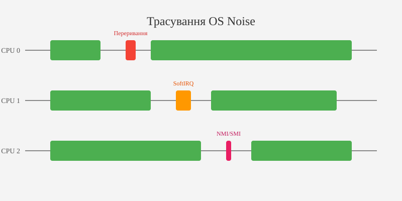
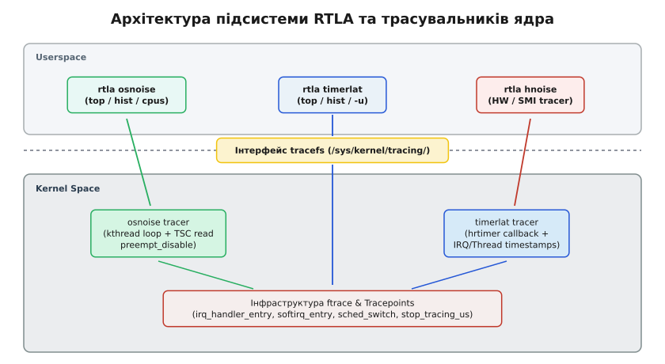

# Трасувальники затримок: osnoise, timerlat і rtla

<preknowlist>
- [Налагодові ВФС: debugfs та tracefs](book:unix-linux/debugfs-tracefs-kernel-debugging-interfaces) — модальності монтування tracefs та механізм буферів ftrace.
- [PM QoS: фреймворк управління затримками](book:unix-linux/power-management-qos-framework) — обмеження станів енергозбереження C-states для виключення апаратних затримок.
- [Файлова система sysfs](book:unix-linux/sysfs-kobject-sysfs-dirent) — інтерфейс взаємодії з параметрами ядра через kobject.
</preknowlist>

У системах керування робототехнікою, автономним транспортом та високочастотним трейдингом запізнення обробки події навіть на 50 мікросекунд призводить до провалу дедлайну (deadline miss), що у реальному світі еквівально зіткненню маніпулятора з перешкодою або фінансовим збиткам. У таких системах висока середня продуктивність (throughput) є марною, якщо вона супроводжується нестабільними спалахами максимальної затримки (worst-case latency spikes). Для локалізації джерел таких спалахів у ядрі Linux розроблено трасувальники `osnoise` та `timerlat`, а також консольний комплекс `rtla`.

## 1. Анатомія затримок у ядрі Linux: від детермінізму до перешкод

При вимірюванні продуктивності звичайних серверних додатків головною метрикою є середня пропускна здатність (кількість транзакцій за секунду або середній час обробки HTTP-запиту). У системах реального часу (Real-Time systems) оптимізують зовсім іншу метрику — **детермінізм часу відгуку**.

Затримка (latency) — це інтервал часу між появою фізичної або програмної події та моментом, коли відповідний потік реального часу починає фактичну обробку цієї події на процесорі.

Для класифікації затримок інженери використовують три фундаментальні поняття:

1. **Worst-Case Execution Time (WCET)**: Найгірший (максимально можливий) час виконання завдання при найнесприятливіших умовах у системі. Системи жорсткого реального часу (Hard Real-Time) вимагають суворого доведення того, що за будь-яких обставин затримка не перевищить задану верхню межу.
2. **Jitter (тремтіння затримки)**: Амплітуда коливань часу відгуку між послідовними ітераціями одного й того самого періодичного завдання. Високий jitter руйнує детермінізм алгоритмів цифрового керування та обробки сигналів.
3. **Deadline Miss (пропуск дедлайну)**: Ситуація, коли потік відновлює виконання пізніше критичного моменту часу, визначеного специфікацією системи.

### 1.1 Моделі витіснення у ядрі Linux

У ванільному ядрі Linux (без патчів реального часу) розкладник задач (Scheduler) розроблений для справедливого розподілу процесорного часу між процесами (за допомогою алгоритмів CFS або EEVDF). Однак справедливість (fairness) є прямим антиподом детермінізму (determinism): стандартне ядро може відкласти виконання потоку з високим пріоритетом на кілька мілісекунд ради вирівнювання віртуального часу `vruntime` інших процесів.

Вплив ядерного коду на затримки залежить від обраної моделі витіснення у конфігурації ядра:

- **`CONFIG_PREEMPT_NONE` (Server)**: Витіснення коду ядра вимкнено. Якщо потік виконує системний виклик, він не може бути витіснений іншим потоком доти, доки не повернеться у простір користувача або добровільно не викличе `schedule()`. Затримки можуть досягати десятків мілісекунд.
- **`CONFIG_PREEMPT_VOLUNTARY` (Desktop)**: Додає явні точки витіснення (`might_sleep()`) у тривалі функції ядра, знижуючи затримки для інтерактивних процесів.
- **`CONFIG_PREEMPT` (Low-Latency)**: Дозволяє витісняти більшу частину коду ядра, за винятком критичних секцій, захищених викликами `preempt_disable()`, спинблоками `spinlock_t` або вимкненими перериваннями `local_irq_disable()`.
- **`CONFIG_PREEMPT_RT` (Real-Time)**: Перетворює спинблоки `spinlock_t` на витіснятимі м'ютекси (`rt_mutex`), переводить обробники переривань у контекст потоків (`threaded IRQs`) та робить більшу частину коду ядра повністю витіснятимою.

Навіть при використанні `CONFIG_PREEMPT_RT` затримка реагування системи не стає нульовою, оскільки у ядрі залишаються короткі низькорівневі ділянки коду з вимкненими перериваннями (наприклад, обслуговування таблиць сторінок MMU чи робота з арбітражем шини PCI Express).

### 1.2 Класифікація джерел затримок: апаратні vs програмні

У ядрі Linux загальна затримка реагування поділяється на дві великі категорії: **апаратні перешкоди** та **програмний шум ядра**.

Апаратні перешкоди виникають на рівні мікроархітектури процесора, шини пам'яті та материнської плати:
- **System Management Interrupts (SMI)**: Переривання найвищого пріоритету, яке перехоплює контроль над CPU і переводить його у режим System Management Mode (SMM) для виконання мікропрограми BIOS/UEFI. Під час виконання SMI операційна система повністю залізобетонно зупиняється: операційне ядро Linux не отримує жодних сповіщень про SMI, а всі обробники переривань та потоки чекають від 10 до кількох сотень мікросекунд.
- **C-states / P-states (Енергозбереження)**: Перехід ядра процесора у стані сну C6/C7 або зміна частоти P-states супроводжується затримкою відновлення живлення від 50 до 200 мкс.
- **NUMA & Cache Misses**: Звернення до оперативної пам'яті сусіднього сокета NUMA або промах повз кеш L3 створює мікросекундні затримки арбітражу шини.

Програмний шум виникає внаслідок виконання внутрішніх завдань операційної системи:
- **Hardware IRQ**: Обробники апаратних переривань мережевих карт, дискових контролерів та системного таймера.
- **SoftIRQ**: Програмні переривання обробки мережевих пакетів (`NET_RX`/`NET_TX`), таймерів (`TIMER_SOFTIRQ`) та очищення RCU (`RCU_SOFTIRQ`).
- **Kernel Threads**: Фонові потоки ядра (`ksoftirqd`, `rcuog`, `kworker`, `migration`).

### 1.3 Вплив міжпроцесорних переривань (IPI) на детермінізм

На багатоядерних процесорних системах окремим джерелом затримок виступають міжпроцесорні переривання (Inter-Processor Interrupts, IPI). Вони надсилаються одним ядром процесора іншому ядру для примусової синхронізації стану.

Основні типи IPI у ядрі Linux:
- **TLB Shootdown (`flush_tlb_multi`)**: Коли один процес модифікує таблицю сторінок віртуальної пам'яті (наприклад, через `munmap`), він надсилає IPI всім іншим ядрам, які виконують потоки цього процесу, вимагаючи негайно інвалідувати кеш буфера трасляції адреси (TLB).
- **Generic Function Call (`smp_call_function_single`)**: Використовується ядром для примусового виконання функції на віддаленому CPU.
- **Rescheduling Interrupt (`smp_send_reschedule`)**: Надсилається ядром при появі більш пріоритетного завдання на іншому CPU.

Якщо ядро реального часу виконується на ізольованому CPU, випадкове IPI від сусіднього ядра призводить до входу в обробник апаратного переривання і перериває потік на 2–10 мікросекунд. Налаштування параметрів `isolcpus=nohz` та `nohz_full` змушує ядро уникати надсилання IPI на ізольовані ядра.

Для точного виявлення, вимірювання та класифікації цих чинників розробники ядра створили спеціалізовані трасувальники `osnoise` та `timerlat`.

## 2. Концепція та механіка OS Noise (шум операційної системи)

**OS Noise** (шум операційної системи) — це сукупний процесорний час, який операційна система викрадає у виділеного прикладного потоку реального часу.

Для вимірювання цього шуму трасувальник `osnoise` використовує концепцію некооперативного тестового потоку. Після активації трасувальника ядро створює по одному вимірювальному потоку (`osnoise/N`) на кожне виділене процесорне ядро.


*Рис. 1. Схема викрадення процесорного часу обробниками IRQ, SoftIRQ, SMI та потоками ядра.*

### 2.1 Внутрішній цикл вимірювання osnoise

Вимірювальний потік `osnoise` виконується у ядрі з наступними суворими інваріантами:

- Потоку призначається найвищий пріоритет реального часу `SCHED_FIFO` (або `SCHED_DEADLINE`).
- Потік вимикає витіснення на своєму ядрі (`preempt_disable()`).
- Потік входить у безперервний щільний цикл читання апаратного лічильника тактів процесора (Time Stamp Counter, TSC на x86 або `cntvct_el0` на ARM64) або монотонного годинника ядра `sched_clock()`.

Оскільки витіснення вимкнено, потік `osnoise` самостійно не віддає процесор і не входить у стан сну. Єдиний спосіб, у який його виконання може бути перерване — це втручання апаратних та системних механізмів вищого пріоритету:

1. Апаратні переривання Hardware IRQ (визначення наведено у розділі 1.2) — перехоплення процесора обробниками периферійних пристроїв.
2. Програмні переривання SoftIRQ (визначення наведено у розділі 1.2) — виконання відкладених обробників мережевого стеку, блокового введення-виведення та таймерів.
3. **NMI**: Немасковані переривання (наприклад, NMI watchdog або події профілювальника `perf`).
4. **SMI / HW Noise**: Перехоплення управління мікропрограмою BIOS/UEFI.

У кожній ітерації циклу потік обчислює різницю між поточним значенням часу та значенням попередньої ітерації:

`ΔT = T_current - T_previous`

За відсутності шуму величина `ΔT` є константною і дорівнює часу виконання кількох інструкцій процесора (кілька наносекунд). Якщо значення `ΔT` перевищує встановлений поріг розрізнення `threshold` (за замовчуванням 1 мікросекунда), `osnoise` реєструє це як епізод шуму.

### 2.2 Детальна класифікація джерел шуму у реальному часі

`osnoise` не просто вимірює тривалість затримки, а й автоматично класифікує її джерело. Під час обробки переривань у ядрі трасувальник перехоплює вхідні та вихідні точки трасування (tracepoints) підсистеми ftrace:

- `irq_handler_entry` та `irq_handler_exit`: дозволяють `osnoise` виміряти точну тривалість виконання кожного апаратного переривання та ідентифікувати назву обробника (наприклад, `eth0` чи `ahci`).
- `softirq_entry` та `softirq_exit`: фіксують тривалість виконання програмних переривань (`NET_RX`, `TIMER`, `RCU`).
- `sched_switch`: фіксує переключення на інші потоки ядра, якщо ізоляція ядра була неповною.

Якщо під час стрибка TSC значення `ΔT` виявилося великим (наприклад, 40 мкс), але підсистема ftrace не зафіксувала жодних подій входу в IRQ, SoftIRQ чи NMI, `osnoise` класифікує цю затримку як **Hardware Noise (HW/SMI)**. Це єдиний надійний спосіб автоматичного виявлення затримок SMM/SMI у Linux.

### 2.3 Аналіз фонових потоків ядра (Kernel Threads Interference)

Окремою категорією шуму є втручання фонових потоків ядра (`Kernel Threads`). Навіть якщо на ядрі не виконуються звичайні користувацькі процеси, ядро Linux створює службові потоки:

- `ksoftirqd/N`: Потік відкладеного виконання SoftIRQ, якщо обробка SoftIRQ в IRQ-контексті перевищила ліміт часу.
- `rcuog/N` та `rcuop/N`: Потоки обробки зворотних викликів Read-Copy Update (RCU callbacks).
- `kworker/N:M`: Потоки системних черг робіт (Workqueues).
- `migration/N`: Потік перенесення завдань між ядрами. Цей потік має пріоритет `SCHED_FIFO 99` і є єдиним потоком, який може витіснити навіть вимірювальний потік `osnoise`.

Якщо ядро не було завантажено з параметрами повної ізоляції (`isolcpus`, `nohz_full`, `rcu_nocbs`), ці потоки періодично прокидаються і викрадають процесорний час, створюючи затримки від 5 до 50 мікросекунд.

### 2.4 Розрахунок коефіцієнта корисної роботи (CPU Availability)

На основі зібраних даних `osnoise` обчислює коефіцієнт доступності CPU для прикладного коду. Якщо за вимірювальне вікно тривалістю 1 секунда (`period_us = 1000000`) сумарна тривалість усіх епізодів шуму склала 15 мікросекунд, доступність CPU становить:

`Availability = (1000000 - 15) / 1000000 = 99.9985%`

У системах жорсткого реального часу інженерів цікавить не середня доступність, а максимальний розмір одноразового непреривного вікна шуму (`max_single_noise`), оскільки саме він визначає ймовірність порушення дедлайну.

### 2.5 Простеження джерел шуму через sysfs та procfs

Для додаткового аналізу джерел шуму системний інженер може зіставити дані `osnoise` з інтерфейсами `/proc`:

- `/proc/interrupts`: містить лічильники апаратних переривань по кожному CPU та IRQ лінії.
- `/proc/softirqs`: показує статистику виконання програмних переривань (`HI`, `TIMER`, `NET_TX`, `NET_RX`, `BLOCK`, `IRQ_POLL`, `TASKLET`, `SCHED`, `HRTIMER`, `RCU`).
- `/sys/devices/system/cpu/cpu*/topology/`: дозволяє перевірити прив'язку ядер до кеш-пам'яті L3 та сокетів.

📜 Історію наукової формалізації та створення концепції OS Noise Деніелом Брістотом де Олівейра детально висвітлено у вставці [Еволюція вимірювання затримок у Linux: від cyclictest до osnoise, timerlat та rtla](book:unix-linux/latency-tracers/hist-rtla-evolution.md).

## 3. Трасувальник timerlat: вимірювання затримок періодичних завдань

Хоча `osnoise` є ідеальним інструментом для оцінки загального рівню шуму під час суцільного 100% завантаження CPU, він не дає відповіді на інше критичне запитання: "Яка затримка пробудження періодичного потоку реального часу від таймера?".

У реальних системах (наприклад, у цифрових контролерах моторів чи сервоприводів) потік не крутиться в безперервному циклі 100% часу. Завдання спить і прокидається строго за розкладом (наприклад, кожну 1 мілісекунду), виконує розрахунок за 50 мікросекунд і знову засинає.

Для вимірювання детермінізму таких завдань призначено трасувальник **`timerlat`**.

### 3.1 Принцип роботи та двокомпонентна модель timerlat

Трасувальник `timerlat` створює періодичний таймер високої роздільної здатності (hrtimer) з періодом `period_us` (за замовчуванням 1000 мкс) на кожному виділеному ядрі.


*Рис. 2. Двокомпонентний розклад затримки timerlat: IRQ Latency та Thread Latency.*

Загальна затримка пробудження періодичного завдання розкладається на дві послідовні складові:

`Total Latency = IRQ Latency + Thread Latency`

1. **IRQ Latency (Затримка переривання)**:
   Це час від запланованого моменту спрацювання таймера `T_target` до моменту, коли процесор фактично увійшов у першу інструкцію ядерного обробника переривання hrtimer `T_irq`.
   
   `IRQ Latency = T_irq - T_target`
   
   На цю затримку впливають виключно апаратні чинники та ділянки коду ядра з вимкненими перериваннями: тривалість `local_irq_disable()`, виконання NMI/SMI та стани сну процесора (C-states).

2. **Thread Latency (Затримка потоку)**:
   Це час від моменту, коли обробник переривання таймера розблокував вимірювальний потік у ядрі `T_irq`, до моменту, коли цей потік почав фізично виконувати першу інструкцію у контексті процесу `T_thread`.
   
   `Thread Latency = T_thread - T_irq`
   
   На цю затримку впливає робота планувальника задач Linux: тривалість заборони витіснення (`preempt_disable()`), пріоритет інших завдань у черзі реального часу та витрати на переключення контексту.

### 3.2 Режим вимірювання у просторі користувача (user-threads)

Трасувальник `timerlat` підтримує два режими вимірювання:

- **Ядерний режим (Kernel-space mode)**: Вимірювальний потік виконується всередині ядра як `kthread`. Цей режим вимірює чисту затримку ядра без урахування витрат на системні виклики та збереження регістрів користувача.
- **Користувацький режим (User-space mode, прапорець `-u` у `rtla`)**: Вимірювальний потік виконується у просторі користувача. Потік засинає через системний виклик `clock_nanosleep()` і вимірює затримку безпосередньо у юзерспейсі.

Вимірювання у просторі користувача дає найчеснішу оцінку реальної затримки, яку відчуває прикладне ПЗ, оскільки воно враховує проходження межі VFS/Syscall, відпрацювання механізму повернення із системних викликів (`sysret`/`iret`) та стан віртуальної пам'яті процесу.

### 3.3 Внутрішня структура підсистеми hrtimer у ядрі

Таймери високої роздільної здатності у ядрі Linux впорядковані у червоно-чорні дерева (`struct rb_node`), що зберігаються у структурі `struct hrtimer_clock_base` окремо для кожного CPU.

Коли настає час `T_target`, процесор генерує переривання Local APIC timer. Обробник `hrtimer_interrupt()` виконує такі кроки:
1. Зчитує поточний час годинника `CLOCK_MONOTONIC`.
2. Витягує таймер `timerlat` із верхівки червоно-чорного дерева.
3. Фіксує часову мітку `T_irq` та обчислює `IRQ Latency`.
4. Викликає `wake_up_process()` для переведення потоку `timerlat` у стан готовності `TASK_RUNNING`.
5. Потік `timerlat`, отримавши процесор, обчислює часову мітку `T_thread` та підсумкову `Thread Latency`.

### 3.4 Аналіз затримок у NUMA-архітектурах

У сучасних багатосокетних системах (Non-Uniform Memory Access, NUMA) затримки пробудження суттєво залежать від розміщення пам'яті та потоку. Якщо потік виконується на Сокеті 0, але його стек або структура `task_struct` розміщені у пам'яті Сокета 1, кожен доступ до пам'яті проходить через міжпроцесорну шину (Intel UPI / AMD Infinity Fabric), додаючи 50–150 наносекунд до кожної операції.

Для усунення NUMA-затримок при використанні `timerlat` необхідно гарантувати локальність пам'яті за допомогою утиліти `numactl` або системного виклику `set_mempolicy(MPOL_BIND, ...)`:

```bash
sudo numactl --cpunodebind=0 --membind=0 rtla timerlat hist -c 1-3 -u
```

### 3.5 Порівняльний розбір osnoise vs timerlat

Для чіткого вибору інструменту аналізу наведено порівняльну характеристику двох трасувальників:

| Критерій порівняння | osnoise | timerlat |
| :--- | :--- | :--- |
| **Головна мета** | Вимірювання викраденого часу CPU (OS Noise) | Вимірювання затримки пробудження таймера |
| **Режим роботи потоку** | Безперервний нескінченний цикл (100% CPU load) | Періодичний сон та пробудження за hrtimer |
| **Вимірювані параметри** | Сумарний шум, тривалість IRQ, SoftIRQ, SMI | IRQ Latency, Thread Latency, Total Latency |
| **Сфера застосування** | Пошук апаратного шуму BIOS, переривань периферії | Сертифікація періодичних завдань реального часу |
| **Вплив на систему** | Високе навантаження на виділене ядро | Мінімальне навантаження (періодичний потік) |

## 4. Внутрішня архітектура трасувальників у ядрі та ftrace

Трасувальники `osnoise` та `timerlat` реалізовані у вихідному коді ядра Linux у каталозі `kernel/trace/trace_osnoise.c`. Вони інтегровані у загальний фреймворк `ftrace` через реєстрацію структури `struct tracer`:

```text
static struct tracer osnoise_tracer __read_mostly = {
    .name           = "osnoise",
    .init           = osnoise_tracer_init,
    .reset          = osnoise_tracer_reset,
    .start          = osnoise_tracer_start,
    .stop           = osnoise_tracer_stop,
    .print_header   = print_osnoise_headers,
};
```

### 4.1 Механізм створення вимірювальних потоків

При записі `osnoise` або `timerlat` у файл `/sys/kernel/tracing/current_tracer` ядро викликає функцію ініціалізації `osnoise_tracer_init()`. Ця функція перевіряє маску процесорів у файлі `cpus` і для кожного вказаного ядра створює окремий потік ядра за допомогою функції `kthread_create_on_node()`.

Потокам призначаються імена `osnoise/CPU_ID` або `timerlat/CPU_ID`. Для забезпечення найвищого пріоритету викликом `sched_setscheduler_nocheck()` потокам встановлюється політика `SCHED_FIFO` із пріоритетом 99.

### 4.2 Організація кільцевого буфера ftrace (Ring Buffer)

Підсистема ftrace використовує високопродуктивний беззамковий кільцевий буфер (lockless ring buffer), розбитий на посторінкові блоки `struct buffer_page`.

Переваги беззамкового буфера:
- Запис подій з контексту переривань IRQ або NMI здійснюється за допомогою атомарних операцій `cmpxchg` без захоплення спинблоків.
- Мінімальні накладні витрати: один запис події у буфер займає всього 15–20 наносекунд.
- Якщо буфер переповнюється, старі події автоматично перезаписуються новими (режим overwrite).

### 4.3 Автоматичне заморожування буфера (stop_tracing_us)

Однією з найпотужніших можливостей `osnoise` та `timerlat` є механізм автоматичного заморожування трасування при спалаху затримки.

У класичному ftrace кільцевий буфер постійно перезаписується новими подіями за принципом FIFO. Якщо аномальна затримка у 100 мкс сталася 5 секунд тому, до моменту, коли людина чи скрипт помітить це і зупинить трасування, нові події вже повністю витиснуть аномальну трасу з буфера.

Трасувальники `osnoise` та `timerlat` розв'язують цю проблему через параметр `stop_tracing_us`. Як тільки зафіксований шум або затримка таймера перевищують вказаний поріг, ядерний трасувальник негайно викликає функцію ядра `tracing_off()`. Це миттєво блокує запис будь-яких нових подій у кільцевий буфер ftrace по всіх ядрах.

У результаті в буфері збережеться ідеальний "знімок часу": детальне трасування всіх викликів функцій ядра, переривань та переключень контексту безпосередньо у момент виникнення затримки, а також протягом кількох мілісекунд до неї.

📋 Детальний довідник усіх параметрів `tracefs`, форматів виводу `trace_pipe` та синтаксису команд наведено у вставці [Інтерфейси керування трасувальниками затримок: sysfs, ftrace та CLI-утиліта rtla](book:unix-linux/latency-tracers/api-rtla-interfaces.md).

## 5. Набір інструментів rtla (Real-Time Linux Analysis)

Для автоматизації конфігурування `tracefs` та аналізу трейсів у ядро Linux (починаючи з версії 5.17) було додано консольну утиліту **`rtla`** (Real-Time Linux Analysis), яка знаходиться у каталозі `tools/tracing/rtla`.

`rtla` написана мовою C і спирається на високопродуктивні бібліотеки `libtracefs` та `libtraceevent`. Вона надає зручний інтерфейс командного рядка для керування `osnoise` та `timerlat`.


*Рис. 3. Архітектура взаємодії утиліти rtla з tracefs, ftrace та ядерними трасувальниками.*

### 5.1 Режими роботи top та hist

Обидві команди (`rtla osnoise` та `rtla timerlat`) підтримують два основних режими відображення результатів:

1. **Режим `top` (Табличний моніторинг)**:
   Оновлює консольну таблицю у реальному часі (щосекунди), показуючи статистику затримок на кожному ядрі: поточну, середня та максимальну затримку, а також кількість зафіксованих подій IRQ, SoftIRQ, NMI та SMI.
   
   ```bash
   sudo rtla osnoise top -c 1-3 -d 10s
   ```

2. **Режим `hist` (Гістограма розподілу)**:
   Будує логарифмічну або лінійну гістограму розподілу затримок у мікросекундах для кожного ядра. Це дозволяє наочно оцінити "хвіст розподілу" (tail latency) та виявити поодинокі викиди.
   
   ```bash
   sudo rtla timerlat hist -c 1-3 -u -d 30s
   ```

### 5.2 Модуль Автоматичного Аналізу (Auto-Analysis / -AA)

Утиліта `rtla` містить вбудований модуль автоматичного діагностування причин затримок. При запуску з прапорцем `-AA` (Auto-Analysis) `rtla` не лише заморожує трасу при виявленні затримки, а й самостійно парсить кільцевий буфер ftrace і друкує текстовий аналітичний висновок:

```text
[rtla] Target latency exceeded: 28.45 us
[rtla] Auto-Analysis Summary:
[rtla]  - CPU 2 was interrupted by Hardware IRQ #48 (eth0) for 14.20 us
[rtla]  - SoftIRQ NET_RX executed for 8.10 us
[rtla]  - Thread latency contributed 6.15 us due to priority competition
```

Це кардинально скорочує час пошуку вузьких місць у конфігурації системи.

### 5.3 Використання rtla у промисловій сертифікації CI/CD

У сучасних автомобільних системах (Automotive Grade Linux, AUTOSAR) утиліта `rtla` інтегрується у CI/CD тестові конвеєри. Кожен збірочний реліз ядра проходить цілодобове стрес-тестування (soak testing) командою:

```bash
sudo rtla timerlat hist -c 1-7 -u -d 24h -S 20 -AA 20 --trace /tmp/latency_failure.txt
```

Якщо за 24 години на будь-якому ядрі виникає спалах затримки понад 20 мкс, CI-тест автоматично вважається проваленим, а збережений файл траси відправляється ядерним інженерам для регресійного аналізу.

## 6. Виявлення та придушення апаратного шуму (SMI та NMI)

System Management Interrupts (SMI) залишаються найнебезпечнішим ворогом детермінізму у Linux. Оскільки SMI обробляються на рівні мікропрограми материнської плати у режимі SMM, процесор призупиняє виконання операційної системи на апаратному рівні.

### 6.1 Стратегія непрямого виявлення SMI

Оскільки ядро Linux не бачить входу в SMI, `osnoise` виявляє їх через порівняння двох годинників:

1. **Апаратний TSC (Time Stamp Counter)**: Продовжує лічити такти процесора навіть під час виконання SMM-коду.
2. **Лічильники ядерних подій (IRQ/NMI/SoftIRQ count)**: Не збільшуються під час SMM.

Якщо `osnoise` бачить раптовий стрибок TSC на 50000 тактів (близько 25 мкс на частоті 2.0 ГГц), але жодна ядерна подія за цей час не відбулася, у звіті `rtla osnoise` цей шум позначається у колонці `HW`.

Додатково моніторинг SMI здійснюється через апаратні лічильники MSR (Model Specific Registers). На процесорах Intel значення лічильника невиконаних SMI можна зчитати з регістру `MSR_SMI_COUNT` (адреса `0x34`):

```bash
sudo rdmsr 0x34
```

Якщо значення цього лічильника зростає під час виконання тесту `rtla`, це є прямим доказом спрацьовування SMI.

### 6.2 Термальний тротлінг та замасковані затримки

Ще одним джерелом апаратного шуму є термальний тротлінг процесора (Thermal Throttling). При досягненні критичної температури кристал процесора генерує термальне переривання (Thermal Monitor Interrupt), яке примусово обмежує тактову частоту ядра або вставляє порожні цикли (clock gating).

Перевірка лічильників термального тротлінгу виконується через sysfs:

```bash
cat /sys/devices/system/cpu/cpu*/thermal_throttle/core_throttle_count
```

За наявності термального тротлінгу систему слід обладнати більш потужним охолодженням або обмежити максимальну TDP-потужність у BIOS.

### 6.3 Способи усунення апаратних затримок

Для очищення системи від апаратного шуму використовуються такі інженерні кроки:

1. **Вимкнення SMI у BIOS/UEFI**: У професійних материнських платах для серверів та вбудованих систем у налаштуваннях BIOS вимикають функції енергозбереження (C-States, SpeedStep/TurboBoost), опитування стану батерей, термальний тротлінг та автоматичне оновлення мікрокоду.
2. **Налаштування підсистеми PM QoS**: Використання викликів PM QoS для обмеження глибоких станів сну процесора (`/dev/cpu_dma_latency`).
3. **Вимкнення MCE та NMI watchdog**: Параметри завантаження ядра `mce=off` та `nmi_watchdog=0` усувають періодичні немасковані переривання перевірки пам'яті.

## 7. Практична методологія профілювання та оптимізації RT-систем

Для досягнення мікросекундного детермінізму у виробничому середовищі розробники дотримуються чіткої покрокової методології:

### Крок 1. Базове вимірювання (Baseline Measurement)

Запустіть `rtla osnoise top` та `rtla timerlat hist` на неналаштованій системі протягом 10 хвилин, щоб отримати початковий рівень затримок (за замовчуванням максимум складає від 50 до 500 мкс).

### Крок 2. Ізоляція ядер (CPU Isolation)

Додайте до командного рядка ядра параметри ізоляції:

```text
isolcpus=nohz,domain,1-7 nohz_full=1-7 rcu_nocbs=1-7
```

Перенаправте обробку апаратних переривань мережевих карт та дисків на ядро CPU 0 за допомогою налаштування `/proc/irq/N/smp_affinity`.

### Крок 3. Налаштування пріоритетів та прив'язка потоків

Переведіть прикладний потік у режим `SCHED_FIFO` із пріоритетом 95 і прив'яжіть його до ізольованого ядра (наприклад, CPU 2). Заблокуйте пам'ять за допомогою `mlockall`.

### Крок 4. Валідація за допомогою rtla та користувацького стенду

Повторно запустить `rtla timerlat hist -u -c 2 -d 1h -S 15 -AA 15` для фінальної сертифікації системи. При правильному виконанні усіх кроків максимальна затримка пробудження потоку у просторі користувача стане стабільною і не перевищуватиме 3–8 мікросекунд.

### 7.1 Автоматизація налаштування через tuna, cgroups та sysctl

Для автоматизації прив'язки потоків ядра та ізоляції IRQ у виробничих дистрибутивах (Red Hat Enterprise Linux MRG, SUSE Linux Enterprise Real Time) застосовують утиліту `tuna`:

```bash
sudo tuna --cpus=1-7 --isolate
sudo tuna --cpus=2 --priority=FIFO:95 --threads=my_rt_app
```

Альтернативно, утиліти `chrt` та `taskset` дозволяють швидко змінити пріоритет та прив'язку вже працюючого процесу без використання додаткових утиліт: `chrt -f -p 95 <PID>` та `taskset -cp 2 <PID>`.

У сучасних контейнеризованих середовищах під керуванням cgroups v2 ізоляція RT-процесів здійснюється через параметри контролера `cpuset`:

```bash
echo "2" > /sys/fs/cgroup/rt_tasks/cpuset.cpus
echo "0" > /sys/fs/cgroup/rt_tasks/cpuset.cpus.partition
```

Це гарантує, що жоден інший фоновий контейнер не зможе запланувати свої завдання на виділеному ядрі CPU 2, повністю захищаючи критичні процеси від міжконтейнерного витіснення. Налаштування sysctl додатково вимикають фонові скидання брудних сторінок пам'яті (dirty memory flush) на ізольованих ядрах через `vm.stat_interval = 120`.

⚙️ Практичну реалізацію користувацького стенду вимірювання затримок мовами C та C++ з прикладами використання `mlockall`, `SCHED_FIFO` та автоматичною зупинкою ftrace розібрано у вставці [Практичний стенд вимірювання затримок: інтеграція timerlat, SCHED_FIFO та sysfs](book:unix-linux/latency-tracers/proj-latency-harness.md).
