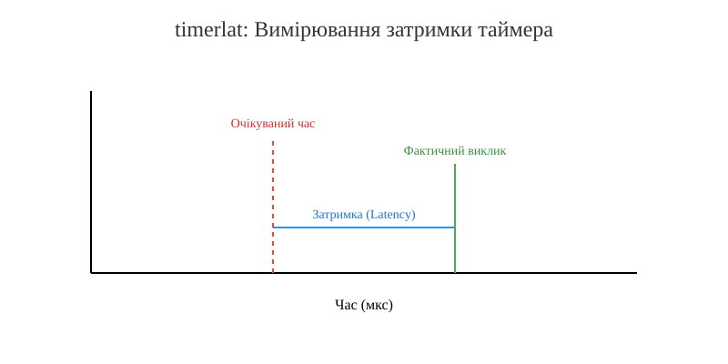

# Трасувальники затримок: osnoise, timerlat і rtla

<preknowlist>
- [Концепції ядра Linux](book:unix-linux/kernel-and-userspace) — базові поняття системних викликів та VFS.
</preknowlist>

У світі систем реального часу (Real-Time) і високопродуктивних обчислень (High-Performance Computing, HPC) ключовим показником якості є не лише пропускна здатність (throughput) або середній час виконання, а й максимальна затримка (latency). Затримка — це час між подією та реакцією на неї. У критичних застосунках, таких як біржова торгівля (high-frequency trading), телекомунікації, медичне обладнання чи управління промисловими роботами, затримка в мікросекунди або навіть наносекунди може мати вирішальне значення.

Для виявлення джерел затримок у ядрі Linux традиційно використовувалися різноманітні інструменти: ftrace, perf, BPF та інші. Однак аналіз затримок часто вимагав глибоких знань внутрішньої структури ядра. Щоб спростити це завдання, було створено спеціалізовані трасувальники та утиліти. У цій статті ми детально розглянемо трасувальники **osnoise** та **timerlat**, а також утиліту **rtla** (Real-Time Linux Analysis), які стали стандартом де-факто для аналізу затримок у сучасному ядрі Linux.

## Проблема OS Noise

**OS Noise** (шум операційної системи) — це перешкоди, які операційна система створює для виконання прикладного потоку. Уявіть, що ви виділили ядро процесора суворо для одного завдання. Ви очікуєте, що це завдання отримає 100% процесорного часу. Однак на практиці операційна система час від часу "викрадає" процесор (CPU cycles) для своїх потреб.

Основними джерелами OS Noise є:
1. **Апаратні переривання (IRQ)**: Обробники переривань від пристроїв (мережевих карт, дисків тощо) виконуються з високим пріоритетом і переривають будь-який потік.
2. **Програмні переривання (SoftIRQ)**: Відкладена обробка після апаратних переривань.
3. **Немасковані переривання (NMI)**: Спеціальні переривання, які неможливо заблокувати; часто використовуються для профілювання або виявлення апаратних помилок.
4. **System Management Interrupts (SMI)**: Найвищий рівень переривань, який обробляється безпосередньо мікропрограмою материнської плати (BIOS/UEFI), абсолютно прозоро для ОС.
5. **Потоки ядра (Kernel threads)**: Внутрішні фонові процеси ядра, такі як `ksoftirqd`, `rcu`, `migration` тощо.

Для завдання, яке вимагає детермінованого часу виконання, навіть кілька мікросекунд, витрачених на обробку NMI або SMI, можуть призвести до порушення дедлайну (deadline miss).


*Рис. 1. Ілюстрація впливу OS Noise на виконання потоку.*

## Трасувальник osnoise

Трасувальник **osnoise** був доданий у ядро Linux (починаючи з версії 5.14) спеціально для вимірювання та локалізації шуму операційної системи.

### Принцип роботи osnoise

Ідея `osnoise` проста, але ефективна. Трасувальник створює по одному потоку на кожне ядро процесора (або на вибрані ядра). Цей потік запускається з дуже високим пріоритетом, відключає витіснення (preemption) і входить у нескінченний цикл, читаючи значення лічильника тактів процесора (наприклад, TSC на архітектурі x86).

Оскільки потік не поступається процесором добровільно і витіснення відключено, єдиний спосіб, у який потік може бути перерваний — це апаратні механізми: IRQ, NMI, SMI або SoftIRQ (які виконуються у контексті переривань).

Потік постійно порівнює поточне значення часу з попереднім. Якщо різниця між двома послідовними читаннями перевищує певний поріг (за замовчуванням 1 мікросекунда), `osnoise` фіксує "шум" (noise). Він записує, скільки часу було втрачено, і, використовуючи механізми ftrace, визначає, що саме викликало цю затримку (який обробник IRQ, чи був це NMI тощо).

### Використання osnoise через tracefs

Трасувальник можна використовувати безпосередньо через файлову систему `tracefs` (зазвичай змонтовану в `/sys/kernel/tracing`).

```bash
# Увімкнення трасувальника osnoise
echo osnoise > /sys/kernel/tracing/current_tracer

# Перегляд результатів
cat /sys/kernel/tracing/trace_pipe
```

Вивід покаже кожен епізод шуму, його тривалість та ймовірну причину. `osnoise` вміє групувати події, тому якщо під час одного переривання відбулося кілька подій (наприклад, IRQ викликав SoftIRQ), вони будуть показані разом з їхнім сумарним впливом.

## Трасувальник timerlat

Хоча `osnoise` чудово виявляє шум під час безперервного виконання (100% CPU load), він не відповідає на інше важливе запитання: "Яка затримка пробудження потоку від таймера?". Це критично для періодичних завдань у системах реального часу.

Для цього у ядрі 5.14 було додано трасувальник **timerlat** (Timer Latency).

### Принцип роботи timerlat

`timerlat` працює за іншим принципом. Замість циклу, він створює періодичний таймер високої роздільної здатності (High-Resolution Timer, hrtimer). Потік засинає і налаштовує таймер на пробудження через певний інтервал (наприклад, 1 мілісекунду).

Коли таймер спрацьовує, викликається обробник таймера в контексті переривання (IRQ). Потім він будить потік `timerlat`.

Затримка таймера складається з двох основних частин:
1. **IRQ Latency**: Час між очікуваним (запланованим) часом спрацьовування таймера та фактичним часом виконання обробника таймера. На це можуть впливати заборони переривань у ядрі, SMI або NMI.
2. **Thread Latency**: Час між викликом обробника таймера і моментом, коли потік `timerlat` фактично почав виконуватися на процесорі. На це впливає розкладник завдань (scheduler), конкуренція за CPU та інші процеси.


*Рис. 2. Схема вимірювання затримки трасувальником timerlat.*

Трасувальник `timerlat` використовує події ftrace для запису цих значень, дозволяючи точно визначити, чи проблема виникла на рівні обробки переривань, чи на рівні планування потоків.

## Утиліта rtla (Real-Time Linux Analysis)

Використання `osnoise` та `timerlat` безпосередньо через `tracefs` може бути незручним. Читання сирих трейсів вимагає навичок парсингу та аналізу. Щоб розв'язати цю проблему, Деніел Брістот де Олівейра (Daniel Bristot de Oliveira), автор цих трасувальників, створив утиліту **rtla**.

`rtla` — це користувацька (userspace) програма, що входить до складу вихідного коду ядра Linux (у каталозі `tools/tracing/rtla`). Вона надає зручний інтерфейс командного рядка для керування трасувальниками `osnoise` і `timerlat`, а також аналізу їхніх результатів.

### rtla osnoise

Команда `rtla osnoise` використовується для вимірювання OS Noise. Вона має кілька режимів: `top` (показує статистику у вигляді таблиці) та `hist` (показує гістограму затримок).

```bash
# Запуск rtla osnoise в режимі top
rtla osnoise top -c 0-3 -d 10s
```

Ця команда запустить трасування на ядрах з 0 по 3 протягом 10 секунд. Після завершення вона виведе зведену інформацію про кількість і типи шумів (NMI, IRQ, SoftIRQ, потоки) на кожному ядрі, а також їхню сумарну та максимальну тривалість.

### rtla timerlat

Команда `rtla timerlat` працює з трасувальником затримок таймера. Вона також підтримує режими `top` та `hist`.

```bash
# Запуск rtla timerlat в режимі hist
rtla timerlat hist -c 1 -P f:95
```

Тут ми запускаємо вимірювання на ядрі 1 з пріоритетом планувальника FIFO (f) 95. Режим `hist` виведе детальну гістограму, що показує розподіл як IRQ Latency, так і Thread Latency. Гістограма є надзвичайно корисною для виявлення рідкісних, але великих викидів (outliers) затримки.

## Вимірювання SMI та NMI

System Management Interrupts (SMI) є однією з найбільших проблем для систем реального часу. Оскільки вони виконуються у System Management Mode (SMM), операційна система повністю зупиняється, і не має жодного уявлення про те, що сталося. `osnoise` є одним з небагатьох інструментів, здатних опосередковано виміряти SMI.

Оскільки `osnoise` безперервно читає TSC (Time Stamp Counter), раптовий стрибок TSC без відповідних подій у ядрі (немає трас IRQ або NMI) свідчить про те, що час був "вкрадений" чимось поза контролем ядра, найімовірніше — SMI. `osnoise` реєструє це як `HW` (апаратний) шум.

## Висновки

Трасувальники `osnoise` та `timerlat`, разом з інструментом `rtla`, здійснили революцію в налаштуванні та аналізі систем реального часу на базі Linux. Вони перетворили складний і кропіткий процес аналізу затримок за допомогою сирих даних ftrace на стандартизовану, зрозумілу і легко відтворювану процедуру. Завдяки цим інструментам розробники та системні адміністратори можуть швидко виявляти вузькі місця, налаштовувати ізоляцію ядер, оптимізувати обробку переривань і досягати мікросекундної детермінованості у своїх системах.
