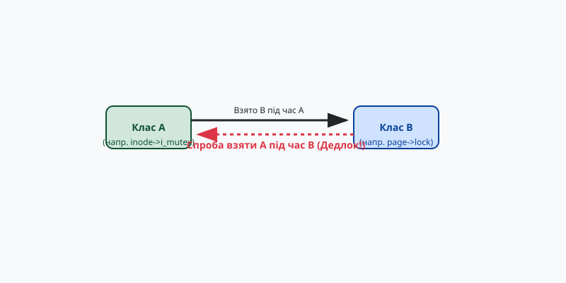

# Валідатор блокувань Lockdep

<preknowlist>
- **Примітиви синхронізації:** м'ютекси (mutex), спінлоки (spinlock), семафори. Розуміння того, як потік зупиняється або "крутиться", чекаючи на звільнення ресурсу.
- **Дедлоки (deadlocks):** ситуації взаємного блокування, особливо класична проблема ABBA, коли потік 1 бере лок A, потім лок B, а потік 2 бере лок B, потім лок A.
- **Контекст виконання в ядрі Linux:** різниця між звичайним контекстом процесу (process context) та контекстом переривання (hardware IRQ, software IRQ/softirq).
</preknowlist>

Коли операційна система стає багатопотоковою та багатоядерною, кількість блокувань у її ядрі зростає експоненційно. Ядро Linux містить десятки тисяч окремих м'ютексів та спінлоків, що захищають різноманітні структури даних — від дескрипторів файлів до сторінок пам'яті. З таким обсягом примітивів синхронізації неминуче виникає проблема взаємних блокувань (дедлоків), які повністю зупиняють роботу системи, змушуючи розробників витрачати дні на аналіз дампів пам'яті.

Щоб подолати цю проблему, у 2006 році Інго Молнар (Ingo Molnar) та Ар'ян ван де Вен (Arjan van de Ven) додали до ядра Linux підсистему **Lockdep** (Lock Dependency Validator). Її завдання — не просто знаходити дедлоки постфактум, а виявляти *потенційні* проблеми ще до того, як вони призведуть до реального зависання системи. 

Lockdep — це потужний статично-динамічний аналізатор, вбудований безпосередньо в ядро. Він перевіряє правила коректного використання блокувань під час виконання коду і попереджає розробника одразу, як тільки виявляє порушення логіки.

## Концепція класів блокувань (Lock Classes)

Головна інновація Lockdep полягає в тому, як він відстежує блокування. Якби Lockdep стежив за кожним окремим екземпляром м'ютекса (наприклад, м'ютексом кожного окремого відкритого файлу або кожного мережевого сокета), йому б знадобилися гігабайти пам'яті, а накладні витрати на обчислення зупинили б систему.

Замість цього Lockdep оперує поняттям **класу блокування (lock class)**. Клас об'єднує всі екземпляри блокувань, які мають однакову природу та семантику використання в коді. Зазвичай клас визначається місцем у вихідному коді, де блокування було ініціалізовано.

Якщо ви маєте структуру `struct inode` і в ній є `i_mutex`, то всі м'ютекси у всіх інодах належать до одного класу. Lockdep виходить із припущення, що логіка ядра однаково працює з будь-яким `i_mutex`, незалежно від того, якому конкретно файлу він належить. Якщо в одному місці коду ядро бере м'ютекс іноди A, а потім спінлок сторінки пам'яті B, Lockdep записує це як правило: "Клас блокування іноди може бути взятий *до* класу блокування сторінки".

Ця абстракція зменшує кількість об'єктів для стеження з мільйонів до кількох тисяч, що дозволяє виконувати складний аналіз графів у реальному часі.

## Побудова графа залежностей та виявлення ABBA

Під час роботи ядра, коли код бере одне блокування, маючи вже взяте інше, Lockdep фіксує **залежність**. Якщо процес уже тримає лок класу A, і намагається взяти лок класу B, Lockdep додає до свого внутрішнього графа спрямоване ребро: `A -> B`. Це означає, що порядок взяття `A` потім `B` є легальним і спостерігався в системі.

Кожного разу, коли додається нове ребро, Lockdep виконує обхід графа, щоб перевірити, чи не утворився цикл.

Уявіть класичний дедлок ABBA:
1. Потік 1 бере лок A, потім лок B. Lockdep фіксує ребро `A -> B`.
2. Потік 2 бере лок B. Поки що все добре.
3. Потік 2 намагається взяти лок A. 

Тут Lockdep помічає, що потік намагається утворити ребро `B -> A`. Він перевіряє граф і бачить, що шлях від `A` до `B` вже існує. Додавання `B -> A` створить цикл `A -> B -> A`. У цей момент Lockdep негайно зупиняє операцію (або генерує детальний звіт у системний журнал — `dmesg`), виводячи стек викликів потоку 1 (який встановив правило `A -> B`) та потоку 2 (який спробував його порушити).

*Рис. 1. Ілюстрація виявлення циклічної залежності в графі Lockdep.*

Сила Lockdep у тому, що йому не потрібно чекати реального зависання. Потік 1 і потік 2 могли виконатися з різницею в тиждень! Потік 1 встановив правило в понеділок, а потік 2 спробував узяти локи у зворотному порядку в п'ятницю. Навіть якщо потоки не перетнулися в часі і дедлок фізично не стався, Lockdep все одно закричить про помилку дизайну, адже потенціал для дедлока існує.

## Контекст переривань (in-IRQ vs non-IRQ)

Крім ABBA-дедлоків, Lockdep розв'язує ще одну вкрай складну проблему ядра: правильне використання блокувань відносно апаратних та програмних переривань.

У ядрі Linux потік, який тримає спінлок, може бути перерваний апаратним перериванням (IRQ). Якщо обробник цього переривання спробує взяти той самий спінлок, система зависне назавжди, бо потік, який має звільнити лок, ніколи не отримає процесорний час (його перервали). Щоб цього уникнути, перед взяттям спінлока, який може використовуватися в перериванні, розробник мусить вимкнути переривання на цьому ядрі (функції `spin_lock_irqsave()`).

Lockdep автоматично відстежує, в якому контексті використовується кожен клас блокування, і розділяє стани класів на кілька категорій:
- **non-IRQ:** лок ніколи не брався в обробнику переривання.
- **in-IRQ:** лок хоча б раз був узятий в обробнику переривання.

Кожного разу, коли ядро бере лок у контексті звичайного процесу, Lockdep перевіряє стан переривань. Якщо лок має статус `in-IRQ` (тобто може бути взятий перериванням), але потік бере його, **не вимкнувши** переривання (`spin_lock()` замість `spin_lock_irq()`), Lockdep негайно сигналізує про помилку. Він знає: якщо прямо зараз станеться переривання, буде дедлок. Знову ж таки, перериванню необов'язково ставатися в цей самий момент; достатньо факту незахищеного коду.

Це також стосується `softirq` (програмних переривань). Lockdep підтримує детальні стани для апаратних (`HARDIRQ`), програмних (`SOFTIRQ`) переривань та їх комбінацій для читання/запису (якщо це `rwlock`).

## Включення та продуктивність (CONFIG_PROVE_LOCKING)

Уся ця магія не дається безкоштовно. Відстеження кожного взяття та звільнення блокування, валідація станів переривань і, головне, обхід графа на льоту додають суттєвих накладних витрат (overhead). Ядро з увімкненим Lockdep може працювати на 20-50% повільніше.

Саме тому Lockdep вмикається опцією конфігурації ядра `CONFIG_PROVE_LOCKING` (яка, своєю чергою, залежить від `CONFIG_LOCKDEP`). Зазвичай ця опція увімкнена у збірках для розробників, у тестових середовищах та на етапі Continuous Integration (CI), але її вимикають у продуктивних (production) ядрах, що постачаються кінцевим користувачам.

Якщо Lockdep знаходить порушення, він виводить детальне повідомлення `BUG: MAX_LOCKDEP_ENTRIES too low!` або класичне `[ INFO: possible circular locking dependency detected ]`, після чого **вимикається** для поточної сесії, щоб не заспамити системний журнал і не сповільнювати систему, яка вже визнана "хворою".

## Винятки та анотації

Оскільки Lockdep об'єднує всі блокування одного місця ініціалізації в один клас, іноді він видає хибні спрацьовування (false positives). Наприклад, ядро цілком легально може брати м'ютекс батьківської директорії, а потім м'ютекс дочірньої директорії. Фізично це різні об'єкти, що ніколи не спричинять дедлок, якщо брати їх завжди зверху вниз по дереву. Але для Lockdep обидва м'ютекси належать до одного класу `i_mutex`, тому він бачить спробу взяти лок класу A, маючи лок класу A, що є рекурсією і потенційним дедлоком.

Для розв'язання таких ситуацій існують спеціальні анотації:
- Підкласи (`mutex_lock_nested()`): розробник явно вказує Lockdep, що цей лок береться на іншому, глибшому рівні вкладеності.
- Динамічне створення класів (`lockdep_set_class()`): можливість розділити один лексичний клас на кілька різних під час виконання.

Lockdep здійснив революцію в надійності ядра Linux, перетворивши пошук дедлоків із мистецтва читання дампів на рутинну роботу аналізатора, що працює в реальному часі. Багато інших операційних систем та великих проєктів запозичили цю концепцію для власних інструментів перевірки конкурентності.
