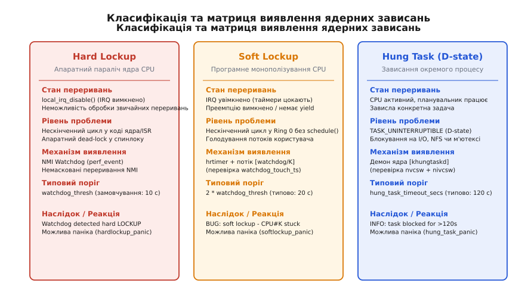
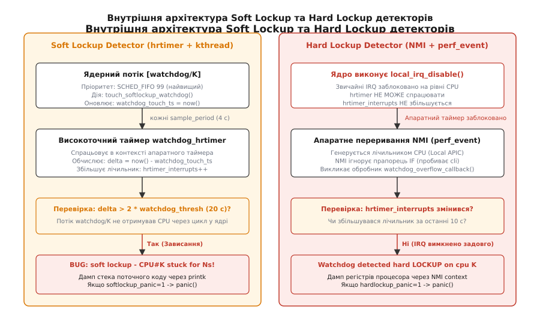
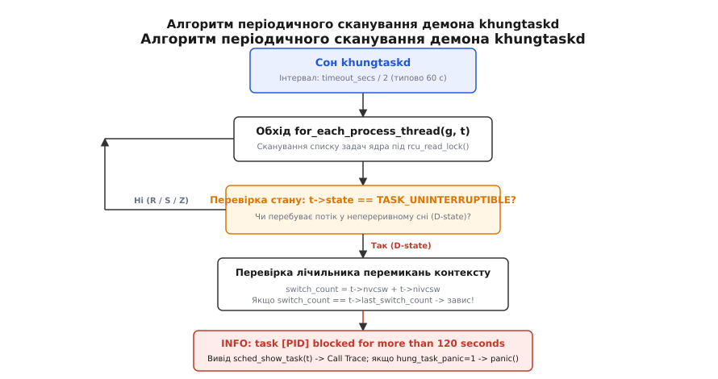
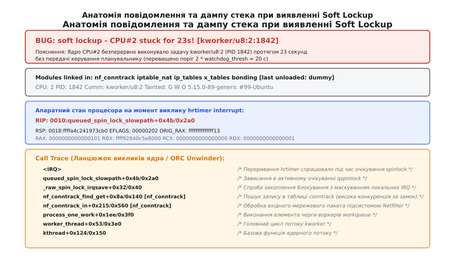

# Детектори зависань ядра: soft lockup, hard lockup і NMI-watchdog

<preknowlist>
- [Oops і паніка ядра](topic:unix-linux/kernel-oops-panic) — поведінка ядра при фатальних збоях, механізми die() і panic(), дампи vmcore.
- [Валідатор блокувань Lockdep](topic:unix-linux/lockdep-lock-validator) — перевірка коректності взяття замків та виявлення взаємних блокувань.
- [Підсистема лічильників perf_events](topic:unix-linux/perf-events) — апаратні лічильники продуктивності процесора та обробка переповнення.
- [Буферизація та журнал printk](topic:unix-linux/kernel-log-printk) — виведення діагностичних повідомлень у dmesg та аварійний друк на консоль.
</preknowlist>

Коли на 64-ядерному сервері бази даних один із потоків мережевого драйвера захоплює спинлок і входить у нескінченний цикл або застрягає в апаратному обробнику переривань, процесорне ядро випадає з нормального життєвого циклу операційної системи. Якщо цей код виконується в просторі користувача (Ring 3), планувальник ядра Linux витісняє його за квантом часу таймера або вбиває за перевищенням лімітів. Проте в режимі ядра (Ring 0) над операційною системою немає вищого програмного супервізора. Якщо ядро заблокувало витіснення або вимкнуло локальні переривання, воно втрачає контроль над власним процесором.

Без спеціалізованих апаратних і програмних наглядачів такий сервер тихо «замерзає»: мережеві запити накопичуються в чергах, черги вводу-виводу переповнюються, кластерні health-check моніторинги фіксують відмову вузла, проте системний журнал залишається абсолютно порожнім, оскільки паралізоване ядро не здатне навіть сформувати запис у буфер логів. Для запобігання безмовним катастрофам та автоматичного збору діагностичних даних ядро Linux містить трирівневу підсистему виявлення зависань: **Soft Lockup Detector**, **Hard Lockup Detector (NMI Watchdog)** та **Hung Task Detector**.

---

## 1. Проблема безмовного паралічу в просторі ядра

У багатозадачній операційній системі стабільність спирається на два непорушних фундаменти: **апаратні таймерні переривання** (які дозволяють планувальнику `scheduler` відбирати процесорний час у поточних задач) та **механізм витіснення (preemption)**. 

Коли процесор виконує код простору користувача, апаратний таймер (Local APIC Timer на x86 або Generic Timer на ARM) регулярно генерує переривання. Обробник переривання викликає планувальник, який перевіряє ліміти часу задачі й передає керування іншому процесу. Але всередині коду ядра існують критичні секції, де планування примусово зупиняється:

1. **Вимкнення витіснення (`preempt_disable()`):** Необхідне під час оновлення per-CPU структур даних, щоб задача не мігрувала на інше ядро процесора посеред операції.
2. **Захоплення спинлоків (`spin_lock()`):** Вимикає витіснення на поточному ядрі, оскільки очікування замка має тривати мікросекунди.
3. **Вимкнення локальних переривань (`local_irq_disable()` або `spin_lock_irqsave()`):** Повністю маскує звичайні апаратні переривання на рівні кремнію процесора (скиданням прапорця `IF` у регістрі `EFLAGS` на x86), щоб обробник переривання не намагався рекурсивно захопити той самий замок і не створив dead-lock на одному процесорі.

```
+-------------------------------------------------------------------------+
| Контекст виконання ядра: spin_lock_irqsave(&lock, flags)                |
|  ├── 1. local_irq_disable()  --> Прапорець EFLAGS.IF = 0 (IRQ вимкнено) |
|  ├── 2. preempt_disable()    --> Витіснення планувальником вимкнено    |
|  └── 3. Критична секція     --> Якщо тут нескінченний цикл: ПАРАЛІЧ!   |
+-------------------------------------------------------------------------+
```

Якщо всередині критичної секції з вимкненими перериваннями стається збій логіки — нескінченний цикл очікування біта готовності апаратного регістра, взаємне блокування спинлоків або пошкодження вказівників зв'язного списку, — процесор потрапляє в замкнене коло:
- Планувальник не може втрутитися, бо переривання таймера не надходять на це ядро.
- Інші задачі на цьому CPU назавжди позбавляються процесорного часу.
- Якщо заблокований замок є глобальним (наприклад, блокування списку відкритих файлів або таблиці маршрутизації), усі інші ядра SMP-сервера поступово стають у чергу за цим замком і також паралізуються один за одним.

Щоб розірвати це коло, наглядач мусить працювати на рівні, вищому за стандартне маскування переривань або черги планувальника.

---

## 2. Три рівні паралічу ядра: класифікація та матриця станів

Залежно від того, які саме системні механізми виявилися заблокованими, ядро Linux розрізняє три принципово різні стани зависання:


*Класифікація та матриця виявлення ядерних зависань: порівняння станів переривань, преемпції, детектуючих механізмів та поведінки ядра.*

1. **Hard Lockup (Апаратне зависання ядра):**
   - **Стан системи:** На конкретному ядрі CPU вимкнено апаратні переривання (`local_irq_disable()`), і процесор застряг у глухому циклі в режимі ядра.
   - **Симптом:** Ядро не реагує на звичайні переривання таймера, мережевої карти чи диска. Стандартні програмні таймери ядра (`hrtimer`) не виконуються.
   - **Хто виявляє:** **NMI Watchdog** (детектор на основі немаскованих переривань).
   - **Типовий поріг:** `watchdog_thresh` (за замовчуванням 10 секунд).

2. **Soft Lockup (Програмне монополізування ядра):**
   - **Стан системи:** Апаратні переривання працюють (таймери цокають, мережеві пакети приймаються), проте витіснення вимкнено (`preempt_disable()`), утримується спинлок або код ядра крутиться в обчислювальному циклі без передачі керування (`schedule()` або `cond_resched()`).
   - **Симптом:** Потоки простору користувача та ядерні нитки зі звичайним пріоритетом повністю голодують і не отримують процесорного часу.
   - **Хто виявляє:** **Soft Lockup Detector** (високоточний таймер `hrtimer` та ядерний потік реального часу `watchdog/K`).
   - **Типовий поріг:** `2 * watchdog_thresh` (за замовчуванням 20 секунд).

3. **Hung Task (Зависання окремого процесу в стані D):**
   - **Стан системи:** Процесор повністю функціонує, переривання активні, планувальник перемикає задачі, але конкретний процес або потік ядра заснув у непереривному стані `TASK_UNINTERRUPTIBLE` (D-state) і не прокидається.
   - **Симптом:** Процес не реагує навіть на сигнал `SIGKILL` (`kill -9`), блокуючи пов'язані з ним системні виклики (наприклад, зависання на дисковому I/O, мертвому NFS-змонтованому каталозі чи м'ютексі ядра).
   - **Хто виявляє:** **Hung Task Detector** (фоновий демон `khungtaskd`).
   - **Типовий поріг:** `sysctl_hung_task_timeout_secs` (за замовчуванням 120 секунд).

Історичний розвиток цих підходів та шлях від простих таймерів материнської плати до сучасної архітектури розглянуто у вставці [📜 Еволюція сторожових механізмів у ядрі Linux](topic:unix-linux/lockup-detectors/hist-watchdog-evolution.md).

---

## 3. Анатомія Soft Lockup Detector: взаємодія `hrtimer` та потоку `watchdog/K`

Soft Lockup виникає, коли переривання процесора не заблоковані, але планувальник не має змоги перемкнути задачу через активне відключення витіснення в коді Ring 0. Для виявлення цього стану ядро використовує елегантну двокомпонентну схему: **високоточний апаратний таймер (`hrtimer`)** виступає інспектором, а **високопріоритетний ядерний потік (`kthread`)** — об'єктом перевірки.

```
CPU#K Timeline:
----------------------------------------------------------------------------
[watchdog/K kthread] ---> touch_softlockup_watchdog()  watchdog_touch_ts = T0
                                                        ▲
[Rogue Kernel Code]  ---> preempt_disable(); while(1);  │ (Потік голодує)
                                                        │
[hrtimer interrupt]  ---> Перевірка: now() - T0 > 20s? ─┴─► BUG: soft lockup!
----------------------------------------------------------------------------
```

### Структура та життєвий цикл компонентів

На кожному логічному ядрі CPU під час ініціалізації ядра або гарячого підключення процесора (`CPU hotplug`) створюються дві сутності:

1. **Ядерний потік `[watchdog/K]`:**
   Створюється підсистемою `smpboot` (файли `kernel/watchdog.c` та `kernel/watchdog_hld.c`). Потік налаштовується на роботу з політикою планування реального часу **`SCHED_FIFO`** із максимально можливим пріоритетом `99` (найвищий пріоритет у системі).
   
   Його єдина функція — у нескінченному циклі викликати функцію `touch_softlockup_watchdog()`, яка оновлює per-CPU змінну `watchdog_touch_ts` поточним системним часом:
   
   ```c
   /* Спрощена логіка роботи ядерного потоку watchdog */
   static void watchdog_enable(unsigned int cpu)
   {
       struct hrtimer *hrtimer = &__raw_get_cpu_var(watchdog_hrtimer);
       
       /* Оновлюємо мітку часу поточним монотонним часом */
       __touch_watchdog();
       
       /* Запускаємо високоточний таймер */
       hrtimer_start(hrtimer, ns_to_ktime(sample_period),
                     HRTIMER_MODE_REL_PINNED_HARD);
   }
   ```

2. **Високоточний таймер `watchdog_hrtimer`:**
   Таймер прив'язується до конкретного CPU (`HRTIMER_MODE_PINNED`) і налаштовується на регулярне спрацьовування з періодом `sample_period`:
   
   ```text
   sample_period = (watchdog_thresh * 2) / 5
   ```
   При стандартному значенні `watchdog_thresh = 10` секунд таймер спрацьовує кожні **4 секунди**.

### Алгоритм перевірки та детектування

Оскільки таймер `watchdog_hrtimer` виконується в контексті апаратного переривання (де витіснення не має значення, оскільки IRQ мають абсолютний пріоритет над будь-яким кодом), він успішно викликається навіть тоді, коли ядро застрягло у спинлоку:

1. Під час кожного спрацьовування обробник таймера обчислює часову дельту:
   ```text
   duration = current_time - watchdog_touch_ts
   ```
2. Якщо `duration <= 2 * watchdog_thresh` (менше або дорівнює 20 секунд при порогові 10 с), стан вважається нормальним. Таймер перепрограмує себе на наступні 4 секунди й передає запит на пробудження потоку `watchdog/K`.
3. Якщо на процесорі все працює штатно, потік `watchdog/K` із пріоритетом `SCHED_FIFO 99` витісняє всі звичайні процеси та оновлює `watchdog_touch_ts`.
4. Якщо ж на процесорі виконується код ядра з `preempt_disable()` або завислий спинлок, планувальник **не може** перемкнути контекст на потік `watchdog/K`.
5. Через 5 послідовних спрацьовувань таймера (20 секунд) значення `watchdog_touch_ts` залишається застарілим. Таймер фіксує порушення інваріанту:
   ```text
   duration > 2 * watchdog_thresh  ==>  SOFT LOCKUP DETECTED!
   ```

### Ручне скидання мітки часу під час легітимних важких операцій

Існують ситуації, коли код ядра свідомо виконує тривалу операцію з вимкненим витісненням або перериваннями — наприклад, утилізація великих сторінок пам'яті (`memory compaction`), збереження дампа на повільну послідовну консоль або ініціалізація RAID-масиву. Щоб не викликати хибного спрацьовування детектора, розробники ядра явно вставляють у такі цикли виклики:

```c
/* Явне повідомлення детектору про те, що тривала операція є контрольованою */
touch_softlockup_watchdog();
touch_nmi_watchdog();
```

Ці виклики оновлюють `watchdog_touch_ts` і скидають лічильники NMI, даючи ядру новий 20-секундний кредит довіри.

### Реакція ядра на Soft Lockup

Коли таймер виявляє прострочення мітки часу, ядро виконує такі дії:
- Викликає `pr_emerg("BUG: soft lockup - CPU#%d stuck for %us! [%s:%d]\n", ...)` із виведенням імені та PID поточної активної задачі.
- Знімає стек викликів (Call Trace) активного коду через підсистему розкрутки стека (ORC або Frame Pointer Unwinder), вказуючи точну функцію, що монополізувала CPU.
- Додає бітовий прапорець `TAINT_WARN` (`W`) до бітової маски `/proc/sys/kernel/tainted`.
- Якщо увімкнено параметр `kernel.softlockup_panic = 1`, ядро негайно викликає `panic()`, ініціюючи аварійне збереження дампа `vmcore` через `kdump` та подальше перезавантаження вузла.

---

## 4. Анатомія Hard Lockup Detector та NMI Watchdog

Якщо під час Soft Lockup апаратні переривання ще працюють і таймер `hrtimer` може зафіксувати збій, то під час **Hard Lockup** ядро вимикає переривання взагалі (`local_irq_disable()`). У цьому стані `watchdog_hrtimer` паралізований разом із рештою операційної системи.

Єдиним способом перервати виконання процесора, коли прапорець `IF` скинуто в `0`, є **немасковане апаратне переривання (NMI — Non-Maskable Interrupt)**.


*Внутрішня архітектура Soft Lockup та Hard Lockup детекторів: паралельне функціонування kthread/hrtimer та апаратного лічильника NMI perf_event.*

### Принцип роботи NMI на рівні кремнію

В архітектурі x86/x86_64 вхідна лінія NMI процесора підключена до локального контролера переривань (Local APIC). Переривання NMI має найвищий пріоритет після системного скидання (RESET) і винятку машинного контролю (Machine Check Exception, `#MC`). Процесор обслуговує NMI за фіксованим вектором **Vector 2** таблиці IDT незалежно від стану інструкції `cli`.

Сучасне ядро Linux реалізує Hard Lockup Detector поверх підсистеми лічильників продуктивності процесора — **`perf_event`** (заголовок `kernel/watchdog_hld.c`).

### Механізм апаратного лічильника `perf_event`

1. **Програмування лічильника:**
   Для кожного ядра CPU ядро створює внутрішню системну подію `perf`:
   ```c
   struct perf_event_attr wd_attr = {
       .type           = PERF_TYPE_HARDWARE,
       .config         = PERF_COUNT_HW_CPU_CYCLES,
       .size           = sizeof(struct perf_event_attr),
       .sample_period  = hw_nmi_get_sample_period(watchdog_thresh),
       .pinned         = 1,
       .disabled       = 0,
   };
   ```
   Лічильник апаратних тактів процесора (PMU — Performance Monitoring Unit) налаштовується на генерацію переривання при переповненні через інтервал, що відповідає `watchdog_thresh` секунд (наприклад, 10 секунд процесорного часу).

2. **Зв'язок із `hrtimer_interrupts`:**
   Кожного разу, коли звичайний таймер `watchdog_hrtimer` (із секції Soft Lockup) успішно викликається на цьому ядрі, він інкрементує атомарний лічильник `hrtimer_interrupts`:
   ```c
   /* Викликається всередині watchdog_timer_fn() */
   __this_cpu_inc(hrtimer_interrupts);
   ```

3. **Перевірка всередині NMI-обробника:**
   Коли апаратний лічильник PMU переповнюється, процесор примусово викликає функцію `watchdog_overflow_callback()` у контексті NMI:
   ```c
   static void watchdog_overflow_callback(struct perf_event *event,
                                          struct perf_sample_data *data,
                                          struct pt_regs *regs)
   {
       /* Перевіряємо, чи змінився лічильник звичайних переривань таймера */
       if (__this_cpu_read(hrtimer_interrupts) == __this_cpu_read(hrtimer_interrupts_saved)) {
           if (__this_cpu_read(hard_watchdog_warn))
               return;

           pr_emerg("Watchdog detected hard LOCKUP on cpu %d\n", smp_processor_id());
           print_modules();
           print_ip_sym(regs->ip);
           show_regs(regs);
           
           if (sysctl_hardlockup_panic)
               panic("Hard LOCKUP");
           
           __this_cpu_write(hard_watchdog_warn, true);
           return;
       }
       
       /* Оновлюємо збережене значення лічильника для наступного циклу */
       __this_cpu_write(hrtimer_interrupts_saved, __this_cpu_read(hrtimer_interrupts));
       __this_cpu_write(hard_watchdog_warn, false);
   }
   ```

Якщо за час між двома NMI-перериваннями (10 секунд) значення `hrtimer_interrupts` не змінилося, це неспростовний доказ того, що звичайні масковані переривання на цьому CPU не викликалися протягом усього цього часу. Процесор застряг у стані **Hard Lockup**.

### Альтернативні реалізації: Buddy Watchdog та архітектури без PMU

На деяких архітектурах або у віртуалізованих середовищах, де апаратні лічильники PMU недоступні чи зарезервовані гіпервізором, ядро підтримує альтернативні механізми:
- **Hardlockup Buddy Watchdog (`CONFIG_HARDLOCKUP_DETECTOR_BUDDY`):** Процесорні ядра об'єднуються в пари (CPU N перевіряє CPU N+1). Перевірка здійснюється надсиланням міжпроцесорного переривання IPI (Inter-Processor Interrupt). Якщо сусіднє ядро не відповідає на IPI за відведений час, ядро-наглядач генерує паніку від імені сусіда.
- **Архітектурні NMI (HPET / Local APIC timer):** Пряме використання таймерів Local APIC без підсистеми `perf`.

---

## 5. Анатомія Hung Task Detector (`khungtaskd`)

На відміну від Soft та Hard Lockup, які сигналізують про застрягання процесора в безкінечних обчисленнях, стан **Hung Task** виникає тоді, коли процесор навпаки повністю вільний від обчислень, але конкретна задача користувача або потік ядра зависли в очікуванні події, яка ніколи не настане.

### Семантика стану `TASK_UNINTERRUPTIBLE` (D-state)

У ядрі Linux потік може засинати у двох основних режимах:
1. `TASK_INTERRUPTIBLE` (S-state): Потік очікує подію (наприклад, надходження даних із сокета), але негайно прокидається при надходженні будь-якого сигналу POSIX (`SIGINT`, `SIGTERM`, `SIGKILL`).
2. `TASK_UNINTERRUPTIBLE` (D-state): Потік засинає під час очікування критичних операцій ядра (завершення блокового вводу-виводу DMA, блокування на м'ютексі `struct mutex` або очікування синхронізації файлової системи). У цьому стані потік **ігнорує будь-які сигнали**, включно з `SIGKILL`.

Якщо пристрій зберігання даних (SAN, NVMe або мережевий диск NFS) перестає відповідати на запити або виникає помилка логіки ядра з невчасним викликом `wake_up()`, процес залишається в D-state назавжди.


*Алгоритм періодичного сканування демона khungtaskd: обхід дерева процесів та перевірка лічильників перемикання контексту задач у стані D.*

### Внутрішній цикл демона `khungtaskd`

Hung Task Detector реалізовано у файлі `kernel/hung_task.c` у вигляді окремого постійного ядерного потоку `[khungtaskd]`:

1. **Періодичний сон:**
   Демон засинає на інтервал часу, що розраховується як `hung_task_timeout_secs / 2` (при тайм-ауті 120 с інтервал сну становить 60 секунд).
2. **Ітерація по списку задач:**
   Після пробудження демон бере захист RCU (`rcu_read_lock()`) та ітерує по всіх дескрипторах задач у системі через макрос `for_each_process_thread(g, t)`.
3. **Критерії зависання:**
   Для кожної знайденої задачі `t` виконується послідовна перевірка трьох умов:
   - Чи перебуває потік у непереривному стані: `(t->state & TASK_UNINTERRUPTIBLE)`?
   - Чи не позначений потік спеціальним прапорцем ігнорування (наприклад, задачі глибокого сну ядра)?
   - **Перевірка лічильника перемикань контексту:**
     У дескрипторі `task_struct` зберігаються лічильники добровільних (`nvcsw` — voluntary context switches) та примусових (`nivcsw` — involuntary context switches) перемикань контексту. Демон обчислює їхню суму:
     ```c
     unsigned long switch_count = t->nvcsw + t->nivcsw;
     
     if (switch_count == t->last_switch_count) {
         /* Задача не зробила ЖОДНОГО перемикання контексту за інтервал спостереження */
         check_hung_task(t, timeout);
     } else {
         /* Задача прокидалася і виконувала роботу — оновлюємо мітку */
         t->last_switch_count = switch_count;
     }
     ```
4. Якщо сума перемикань `switch_count` залишається незмінною протягом повного інтервалу `sysctl_hung_task_timeout_secs` (120 секунд), потік вважається намертво завислим.

### Діагностичний вивід та реакція

Ядро друкує попередження:
```text
INFO: task mysqld:3481 blocked for more than 120 seconds.
      Tainted: G        W         5.15.0-89-generic #99-Ubuntu
"echo 0 > /proc/sys/kernel/hung_task_timeout_secs" disables this message.
```
Слідом за цим викликається `sched_show_task(t)`, що друкує повний стек викликів функцій, у яких потік увійшов у сон (наприклад, `io_schedule()`, `wait_for_completion()`, `__mutex_lock_slowpath()`), дозволяючи точно ідентифікувати ресурс або пристрій, очікування якого спричинило збій.

Якщо встановлено `kernel.hung_task_panic = 1`, ядро викликає `panic("hung_task: blocked tasks")`.

---

## 6. Конфігурація підсистеми: sysctl, procfs та аргументи завантаження

Поведінка детекторів зависань повністю керується у просторі користувача без потреби перекомпільовувати ядро. Усі параметри доступні у віртуальній файловій системі `/proc/sys/kernel/`.

Повний опис усіх структур, прапорців та параметрів представлено у довідковій вставці [📋 Інтерфейс конфігурації та моніторингу детекторів зависань](topic:unix-linux/lockup-detectors/api-watchdog-sysctl.md).

### Ключові співвідношення та правила налаштування:

- **Часовий поріг `kernel.watchdog_thresh`:**
  Задає базовий інтервал у секундах. Зміна цього значення автоматично перераховує тайм-аути для всіх детекторів:
  - Поріг Hard Lockup = `watchdog_thresh` (за замовчуванням 10 с).
  - Поріг Soft Lockup = `2 * watchdog_thresh` (за замовчуванням 20 с).
  - Період таймера `hrtimer` = `(watchdog_thresh * 2) / 5` (за замовчуванням 4 с).
- **Маска ядер `kernel.watchdog_cpumask`:**
  Дозволяє вибірково вимикати детектори на процесорних ядрах, виділених під ізольовані обчислення реального часу (`nohz_full`, isolcpus).
- **Політика паніки:**
  Параметри `kernel.softlockup_panic`, `kernel.hardlockup_panic` та `kernel.hung_task_panic` визначають, чи має система намагатися продовжувати роботу після фіксації попередження, чи негайно ініціювати `panic()` для збереження пам'яті через `kdump` та перезавантаження.

Практичний модуль ядра для симуляції всіх трьох видів зависань та користувацьку утиліту керування наведено у вставці [⚙️ Модуль ядра та утиліта відтворення й тестування lockup-станів](topic:unix-linux/lockup-detectors/proj-sim-lockups.md).

---

## 7. Анатомія стектрейсу та методологія post-mortem діагностики

Коли будь-який із детекторів фіксує зависання, системний журнал отримує деталізований блок діагностичної інформації. Правильне читання цього блоку дозволяє звузити пошук дефекту до конкретного рядка вихідного коду ядра чи драйвера.


*Анатомія повідомлення та дампу стека при виявленні Soft Lockup: розшифрування рядка стану, регістрів процесора та ланцюжка викликів Call Trace.*

### Порядковий розбір типового дампу Soft Lockup

Розглянемо реальний приклад аварійного повідомлення з журналу `dmesg`:

```text
[ 142.108421] watchdog: BUG: soft lockup - CPU#3 stuck for 22s! [kworker/u8:1:142]
[ 142.108428] Modules linked in: dummy_driver(O) bonding iptable_nat nf_conntrack
[ 142.108440] CPU: 3 PID: 142 Comm: kworker/u8:1 Tainted: G           O      5.15.0-89-generic #99
[ 142.108444] Hardware name: QEMU Standard PC (Q35 + ICH9, 2009), BIOS 1.15.0 04/01/2014
[ 142.108447] RIP: 0010:queued_spin_lock_slowpath+0x85/0x2a0
[ 142.108453] Code: f3 90 8b 07 85 c0 75 f8 8b 17 85 d2 75 f3 48 8b 03 ...
[ 142.108456] RSP: 0018:ffffa348404a3c70 EFLAGS: 00000202 ORIG_RAX: ffffffffffffff13
[ 142.108460] RAX: 0000000000000101 RBX: ffff8f1c045a8000 RCX: 0000000000000000
[ 142.108463] RDX: 0000000000000001 RSI: 0000000000000000 RDI: ffff8f1c045a8000
[ 142.108466] Call Trace:
[ 142.108468]  <IRQ>
[ 142.108470]  _raw_spin_lock_irqsave+0x34/0x50
[ 142.108475]  dummy_process_packet+0x4c/0x120 [dummy_driver]
[ 142.108480]  process_one_work+0x1e8/0x3c0
[ 142.108485]  worker_thread+0x50/0x3b0
[ 142.108489]  kthread+0x158/0x180
[ 142.108493]  ret_from_fork+0x1f/0x30
[ 142.108497]  </IRQ>
```

### Ключові елементи аналізу:

1. **Заголовок інциденту:**
   `BUG: soft lockup - CPU#3 stuck for 22s! [kworker/u8:1:142]`
   - Збій стався на третьому процесорному ядрі (`CPU#3`).
   - Потік `watchdog/3` не отримував керування протягом 22 секунд (перевищено поріг 20 с).
   - У момент перевірки процесор виконував задачу `kworker/u8:1` із PID `142`.

2. **Стан Tainted (Забруднення ядра):**
   `Tainted: G           O`
   - `G` (GPL): У ядрі немає закритих пропрієтарних модулів без вихідного коду.
   - `O` (Out-of-tree): У ядро завантажено сторонній модуль, зібраний поза офіційним деревом ядра (у нашому випадку `dummy_driver`). Це перший кандидат на джерело взаємного блокування.

3. **Вказівник інструкцій RIP (Instruction Pointer):**
   `RIP: 0010:queued_spin_lock_slowpath+0x85/0x2a0`
   - Процесор застряг на зміщенні `+0x85` у функції `queued_spin_lock_slowpath` (повільний шлях взяття чергового спинлока `qspinlock`).
   - Це свідчить про те, що дане ядро очікує звільнення замка, який захопило **інше** процесорне ядро і не відпускає його.

4. **Розкрутка стека (Call Trace):**
   - Читання знизу вгору: потік `kworker` виконував функцію черги робіт `process_one_work()`, яка викликала функцію стороннього модуля `dummy_process_packet()`.
   - Модуль викликав `_raw_spin_lock_irqsave()`, де й виникло нескінченне очікування.

5. **Виявлення кореня проблеми через Lockdep та Backtrace:**
   Якщо одне ядро застрягло у `queued_spin_lock_slowpath`, винуватцем є не воно, а те ядро, яке **утримує** замок. Для локалізації справжнього винуватця використовують параметр `kernel.softlockup_all_cpu_backtrace = 1`. Ядро надсилає міжпроцесорне переривання NMI IPI на всі ядра SMP-системи, виводячи стеки всіх процесорів одночасно: ядро, у стеку якого видна довга обробка даних без очікування спинлока, і є джерелом збою.
   
   За наявності валідатора блокувань Lockdep (`CONFIG_LOCKDEP=y`) ядро також роздруковує список блокувань, які утримувалися кожним процесором у момент аварії (`held locks`), що дозволяє миттєво локалізувати циклічну залежність замків (deadlock cycle).

### Взаємодія з Kdump та аварійне збереження дампа пам'яті

Якщо увімкнено параметр `kernel.softlockup_panic = 1` або `kernel.hardlockup_panic = 1`, ядро переходить до аварійної процедури:

```text
panic("Soft LOCKUP")
  └── crash_kexec(regs)
        ├── smp_send_stop() / NMI IPI   <-- Примусова зупинка решти ядер CPU
        ├── machine_crash_shutdown()    <-- Збереження регістрів у ELF Notes
        └── machine_kexec(image)        <-- Миттєвий стрибок у Crash Kernel
```

Вторинне аварійне ядро (Crash Kernel) монтує мінімальну файлову систему в RAM (initramfs) і зберігає повний образ фізичної оперативної пам'яті в файл `/proc/vmcore` на локальний або мережевий диск. Надалі цей файл відкривається утилітою `crash` разом із налагоджувальними символами `vmlinux`, що дає змогу дослідити всі структури даних ядра на момент точної мілісекунди виникнення зависання.

---

## 8. Специфіка хмарних середовищ, віртуалізації та крайові випадки

Застосування детекторів зависань у віртуалізованих середовищах (KVM, VMware ESXi, AWS EC2, GCP) пов'язане зі специфічними крайовими випадками, які за некоректної конфігурації призводять до фальшивих спрацьовувань та безпричинного падіння віртуальних машин.

### Проблема «Вкраденого часу» (vCPU Steal Time)

У хмарних гіпервізорах фізичні процесори спільно використовуються багатьма віртуальними машинами (overcommit). Якщо фізичний хост перевантажений, гіпервізор може тимчасово призупинити віртуальний процесор (vCPU) гостьової ОС на кілька секунд, щоб надати квант часу іншій віртуальній машині.

```
Часова шкала гіпервізора (Host Physical CPU):
----------------------------------------------------------------------------
[Guest VM1 vCPU0] === Працює 4 с ===> [ПАУЗА ГІПЕРВІЗОРА: 25 с] === Прокинувся!
                                                                        │
Гостьовий watchdog_hrtimer бачить: delta = 29 с > 20 с! ────────────────┴─► Фальшива ПАНІКА!
----------------------------------------------------------------------------
```

Коли гостьовий vCPU відновлює роботу, його монотонний апаратний таймер показує стрибок часу вперед на 25 секунд. Якщо гостьове ядро не знає про факт паузи гіпервізора, таймер `watchdog_hrtimer` вирішить, що потік `watchdog/K` голодував через зависання ядра, і викине фальшивий `BUG: soft lockup` або перезавантажить віртуальну машину.

### Механізми захисту від фальшивих спрацьовувань:

1. **Паравіртуальний годинник `pvclock`:**
   Гостьове ядро Linux підтримує протокол паравіртуального часу KVM (`kvmclock`). Гіпервізор передає гостю структуру `pvclock_vcpu_time_info`, яка містить лічильник вкраденого часу (`steal time`). Детектор Soft Lockup віднімає накопичений `steal time` від загальної часової дельти `duration`:
   ```text
   effective_delta = (now - watchdog_touch_ts) - vcpu_steal_time
   ```
2. **Очищення міток після паузи (`kvm_check_and_clear_guest_paused`):**
   Якщо гіпервізор ставив віртуальну машину на паузу (наприклад, під час живої міграції `live migration` або створення снепшота), ядро KVM скидає прапорець `PVCLOCK_GUEST_STOPPED`. При першому відновленні коду ядро Linux автоматично викликає `touch_softlockup_watchdog()` на всіх vCPU, запобігаючи хибній паніці.

### Ціна продуктивності та конфлікти апаратних ресурсів PMU

Використання детектора Hard Lockup на базі `perf_event` потребує виділення одного фізичного лічильника продуктивності PMU на кожному ядрі CPU.
- Процесори архітектури x86_64 зазвичай мають лише від 4 до 8 універсальних лічильників продуктивності на ядро.
- Коли системний інженер запускає низькорівневе профілювання складних застосунків через `perf record -e ...` або утиліти типу Intel VTune / AMD μProf, профайлер вимагає всі доступні лічильники.
- Якщо NMI Watchdog увімкнено, він постійно монополізує один лічильник та генерує періодичні переривання NMI. На критично чутливих до затримок серверах (High-Frequency Trading, телеком-системи обробки пакетів DPDK) це створює джиттер (latency spikes).
- У таких сценаріях NMI Watchdog вимикають через `sysctl -w kernel.nmi_watchdog=0`, передаючи контроль за станом вузла зовнішньому апаратному IPMI/BMC контролеру.

---

## 9. Прапорці компіляції Kconfig для сторожових таймерів

Під час збирання кастомного ядра або створення вбудованих дистрибутивів поведінка детекторів визначається низкою опцій Kconfig:

| Опція Kconfig | Призначення та вплив на бінарний розмір |
| :--- | :--- |
| `CONFIG_LOCKUP_DETECTOR` | Базовий каркас підсистеми сторожових таймерів (`kernel/watchdog.c`). Включає спільний інтерфейс sysctl. |
| `CONFIG_SOFTLOCKUP_DETECTOR` | Додає таймери `hrtimer` та ядерні потоки `watchdog/K`. Споживає невеликий обсяг пам'яті для per-CPU стеків. |
| `CONFIG_HARDLOCKUP_DETECTOR` | Вмикає апаратний Hard Lockup на базі `perf_event` (потребує `CONFIG_HAVE_HARDLOCKUP_DETECTOR_PERF`). |
| `CONFIG_HARDLOCKUP_DETECTOR_BUDDY` | Альтернативний детектор без PMU, де сусідні процесори надсилають IPI один одному. |
| `CONFIG_DETECT_HUNG_TASK` | Компілює демона `khungtaskd` для виявлення заблокованих задач у D-state. |
| `CONFIG_BOOTPARAM_SOFTLOCKUP_PANIC` | Автоматично встановлює `kernel.softlockup_panic = 1` за замовчуванням під час завантаження ядра. |
| `CONFIG_BOOTPARAM_HARDLOCKUP_PANIC` | Автоматично встановлює `kernel.hardlockup_panic = 1` за замовчуванням під час завантаження ядра. |
| `CONFIG_BOOTPARAM_HUNG_TASK_PANIC` | Автоматично встановлює `kernel.hung_task_panic = 1` за замовчуванням під час завантаження ядра. |

---

## 10. Підсумкова архітектурна схема нагляду

Підсистема виявлення зависань ядра Linux формує замкнену трирівневу піраміду спостережуваності:

1. **На рівні задач:** `khungtaskd` контролює процеси в стані `TASK_UNINTERRUPTIBLE`, запобігаючи нескінченному зависанню користувацьких сервісів на пошкодженому дисковому вводі-виводі.
2. **На рівні планувальника:** `hrtimer` разом із потоками `watchdog/K` гарантує, що жоден потік ядра не здатний нескінченно блокувати витіснення та монополізувати процесор.
3. **На рівні кремнію:** `NMI Watchdog` через апаратні лічильники `perf_event` забезпечує гарантований перехват керування навіть у ситуаціях повного апаратного блокування переривань інструкцією `cli`.

Завдяки цій інтегрованій архітектурі Linux перетворює фатальні та невиправні апаратні зависання на структуровані діагностичні дампи пам'яті, забезпечуючи інженерів повним набором даних для локалізації найскладніших дефектів ядра.
