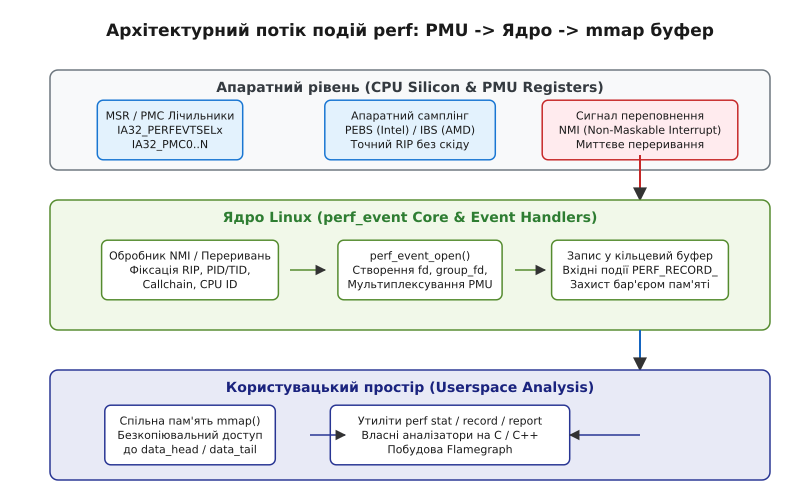
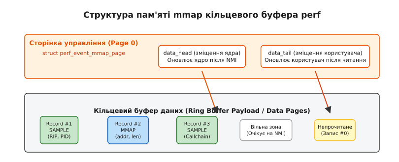
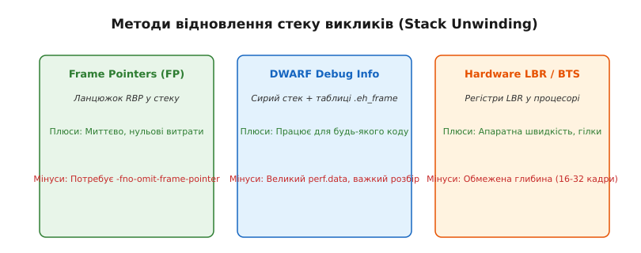

# Підсистема perf: лічильники й вибірковий профіль

<preknowlist>
- [Трасування системних викликів](book:unix-linux/syscall-tracing) — механізм перехоплення й реєстрації викликів ядра.
- [Динамічні зонди kprobes та uprobes](book:unix-linux/uprobes-and-kprobes) — точка впровадження інструментажу в інструкції ядра й процесів.
- [Віртуальна файлова система procfs](book:unix-linux/proc-filesystem) — ієрархія інформаційних файлів системного стану.
</preknowlist>

Спроба виміряти швидкість виконання програмного коду шляхом додавання програмних таймерів або системних викликів типу `gettimeofday()` на кожні 100 інструкцій створює фатальний спотворюючий ефект. Кожен такий виклик виконує контекстне перемикання у простір ядра (ring 0), вибиває з L1-кешу інструкцій гарячі лінії коду, руйнує передбачення умовних переходів у суперскалярному конвеєрі процесора та затримує потік виконання на сотні наносекунд. У результаті інструмент вимірювання починає вимірювати власні накладні витрати, повністю міняючи місцями реальні вузькі місця алгоритму.

Для отримання справжнього профілю продуктивності без спотворення роботи системи ядро Linux надає підсистему `perf` (також відому як `perf_events`). Вона поєднує апаратні лічильники продуктивності у кремнії процесора із внутрішніми механізмами ядра, забезпечуючи вибіркове та підрахункове профілювання із накладними витратами під 1-2% швидкодії.

---

## 1. Апаратний моніторинг: кремнієвий блок PMU та регістри MSR

Щоб аналізувати виконання коду без втручання в інструкції програми, вимірювання має відбуватися на фізичному рівні кремнієвого кристала. Сучасні центральні процесори (x86-64 Intel/AMD, ARM64, RISC-V) містять спеціалізований апаратний блок — Performance Monitoring Unit (PMU).

PMU являє собою набір автономних апаратних лічильників (Performance Monitoring Counters, PMC) та конфігураційних регістрів MSR (Model-Specific Registers). Вони інкрементуються схемотехнікою процесора безпосередньо у момент проходження електричних сигналів крізь виконавчі блоки конвеєра.

```
                  ┌──────────────────────────────────────────────────┐
                  │                 Центральний Процесор             │
                  │                                                  │
 ┌──────────────┐ │ ┌───────────────────┐    ┌─────────────────────┐ │
 │ Інструкції   ├─┼─► Exec Execution   │    │ PMU (Hardware Block)│ │
 │ (Code Stream)│ │ │ Units (ALU / FPU) │    │                     │ │
 └──────────────┘ │ └─────────┬─────────┘    │ ┌─────────────────┐ │ │
                  │           │              │ │ IA32_PERFEVTSEL0│ │ │
                  │           ▼              │ └────────┬────────┘ │ │
                  │ ┌───────────────────┐    │          ▼          │ │
                  │ │ L1 / L2 / LLC     ├────┼─────────►IA32_PMC0  │ │
                  │ │ Cache Controller  │    │   (64-bit Hardware  │ │
                  │ └───────────────────┘    │       Counter)      │ │
                  │                          └─────────────────────┘ │
                  └──────────────────────────────────────────────────┘
```

Процесор виконує звичайні машинні інструкції на повній частоті, а PMU паралельно фіксує внутрішні мікроархітектурні події:

- **Cycles (тактові імпульси)**: Кількість пульсів внутрішнього генератора частоти CPU, витрачених на виконання потоку.
- **Instructions Retired (завершені інструкції)**: Кількість інструкцій, які пройшли всі стадії конвеєра й успішно зафіксували свій результат (retired). Відрізняється від спекулятивно виконаних інструкцій, відкинутих при хибному передбаченні.
- **Cache Misses (промахи кешу)**: Кількість звернень, коли потрібний рядок пам'яті був відсутній у кешах L1/L2/LLC, що змусило процесор простоювати в очікуванні відповіді від системної шини DRAM.
- **Branch Mispredictions (хибні передбачення розгалужень)**: Ситуації, коли блок передбачення перехідних інструкцій (Branch Predictor) помилився з напрямком `jmp`/`je`, через що весь суперскалярний конвеєр довелося примусово очищати (pipeline flush).

### Архітектура лічильників: Фіксовані та програмовані PMC

На процесорах x86-64 апаратний PMU поділяється на дві категорії регістрів:

1. **Фіксовані лічильники (Fixed-Function Counters)**: Спеціалізовані 48-бітові або 64-бітові регістри, які апаратно прив'язані до конкретних метрик і не потребують вибору події. У процесорах Intel це регістри `IA32_FIXED_CTR0` (рахує `INST_RETIRED.ANY`), `IA32_FIXED_CTR1` (рахує `CPU_CLK_UNHALTED.THREAD`) та `IA32_FIXED_CTR2` (рахує `CPU_CLK_UNHALTED.REF_TSC`).
2. **Загальні програмовані лічильники (General-Purpose Counters)**: Універсальні регістри `IA32_PMC0..N` (зазвичай від 4 до 8 на кожне логічне ядро CPU). Перед початком вимірювання програмне забезпечення повинно записати відповідну маску події у відповідний конфігураційний регістр `IA32_PERFEVTSELx`.

Кожен регістр `IA32_PERFEVTSELx` приймає байти `Event Select` (номер базової події) та `Unit Mask` (umask, суб-подія), а також контрольні біти:
- `USR` (bit 16): Рахувати події лише у користувацькому просторі (ring 3).
- `OS` (bit 17): Рахувати події лише у режимі ядра (ring 0).
- `INT` (bit 20): Генерувати переривання APIC при переповненні лічильника.
- `EN` (bit 22): Увімкнути лічильник.

Для первинного аналізу продуктивності обчислюють співвідношення метрик, головною з яких є IPC (Instructions Per Cycle):

```
IPC = Instructions_Retired / CPU_Cycles
```

Значення IPC показує середню кількість інструкцій, яку процесор виконує за один такт. Для сучасних суперскалярних ядер здатність виконувати 4-6 інструкцій за такт є нормою. Якщо IPC падає нижче `1.0`, це свідчить про проблему: процесор більшість часу перебуває у стані простою (stall). 

Розрізняють два типи простою:
1. **Frontend Stalls**: Затримки при зчитуванні та декодуванні машинних інструкцій із кешу інструкцій (L1I) або через промахи буфера TLB (Translation Lookaside Buffer).
2. **Backend Stalls**: Простій обчислювальних блоків ALU/FPU через очікування даних з оперативної пам'яті (Memory Bound) або через тривалі арифметичні операції ділення та квадратного кореня (Compute Bound).

### Uncore PMU: Моніторинг шини пам'яті та системного агента

Окрім кожноядерних (Core PMU) лічильників, сучасні багатоядерні процесори містять **Uncore PMU** (або AMD Northbridge PMU). Ці лічильники розташовані поза обчислювальними ядрами — у контролерах оперативної пам'яті (IMC), між’ядерній шині UPI/QPI та системному L3-кеші.

Uncore PMU дозволяє вимірювати:
- Загальну смугу пропускання оперативної пам'яті DRAM (байти на секунду за сокетом).
- Кількість міжсокетних пересилань даних у NUMA-архітектурах (Non-Uniform Memory Access).
- Навантаження на PCIe-контролери та мережеві карти безпосередньо на системній шині.

### Проблема скіду (Skid) та апаратний саплінг PEBS/IBS

У класичному режимі саплінгу, коли лічильник PMU переповнюється, він надсилає переривання NMI (Non-Maskable Interrupt). Проте між моментом фізичного переповнення лічильника у конвеєрі та миттю, коли конвеєр зупиняється і регістр `RIP` (Instruction Pointer) фіксується обробником ядра, минає кілька десятків тактів. За цей час суперскалярний процесор встигає виконати ще кілька наступних інструкцій. Цей зсув адреси називається **скідом (skid)**.

Через скід утиліта профілювання може вказувати як на «найгарячішу» інструкцію не той рядок коду, який викликав промах кешу, а наступний за ним `nop` або `add`.

Для усунення цього спотворення сучасні процесори підтримують апаратний саплінг:
- **Intel PEBS (Processor Event-Based Sampling)**: При переповненні лічильника кремнієвий контролер сам заморожує точний стан регістрів `RIP`, `RFLAGS` та адрес пам'яті безпосередньо у внутрішній буфер `DS_AREA` (Debug Store Area) за адресою з MSR `IA32_DS_AREA` без виклику NMI на кожну вибірку.
- **AMD IBS (Instruction-Based Sampling)**: Вибірково супроводжує конкретну мікрооперацію (μop) від стадії зчитування до виходу з конвеєра, фіксуючи точний час затримки у тактах та фізичну адресу DRAM через регістри `MSR_IBS_FETCH_CTL` та `MSR_IBS_OP_CTL`.

Детальний огляд історичного розвитку апаратних PMU та боротьби за стабільність лічильників наведено у вставці [📜 Історія PMU та підсистеми perf](book:unix-linux/perf-events/hist-pmu-and-perf.md).

---

## 2. Універсальна модель ядра: системний виклик perf_event_open

У перших версіях Linux кожен інструмент моніторингу мав власний драйвер ядра та власну файлову систему. У Linux 2.6.31 розробник Інго Мольнар впровадив уніфікований підхід: єдиний системний виклик `perf_event_open()`, який перетворює будь-яке джерело подій у стандартний файловий дескриптор.

:::tabs
```c
#include <linux/perf_event.h>
#include <sys/syscall.h>
#include <unistd.h>

long perf_event_open(struct perf_event_attr *attr,
                     pid_t pid,
                     int cpu,
                     int group_fd,
                     unsigned long flags) {
    return syscall(__NR_perf_event_open, attr, pid, cpu, group_fd, flags);
}
```
```cpp
#include <linux/perf_event.h>
#include <sys/syscall.h>
#include <unistd.h>
#include <system_error>
#include <expected>

namespace sys {
    inline std::expected<int, std::error_code> open_perf_event(
        struct perf_event_attr* attr, pid_t pid, int cpu, int group_fd, unsigned long flags) {
        long res = ::syscall(__NR_perf_event_open, attr, pid, cpu, group_fd, flags);
        if (res == -1) {
            return std::unexpected(std::error_code(errno, std::generic_category()));
        }
        return static_cast<int>(res);
    }
}
```
:::

Підсистема `perf` усередині ядра абстрагує абсолютно різні за своєю природою джерела вимірювань під єдиний двійковий інтерфейс:

1. **Hardware Events (`PERF_TYPE_HARDWARE`)**: Лічильники PMU процесора (цикли, інструкції, промахи кешу).
2. **Software Events (`PERF_TYPE_SOFTWARE`)**: Лічильники програмних подій ядра (page-faults, context-switches, cpu-migrations, minor/major faults).
3. **Tracepoints (`PERF_TYPE_TRACEPOINT`)**: Статичні точки трасування, вбудовані у вихідний код ядра Linux (наприклад, `sys_enter_openat`, `sched_switch`, `block_rq_issue`).
4. **Dynamic Probes (`PERF_TYPE_KPROBE` / `PERF_TYPE_UPROBE`)**: Динамічні точки перехоплення у будь-якій інструкції ядра чи користувацьких ELF-бібліотек.
5. **Hardware Breakpoints (`PERF_TYPE_BREAKPOINT`)**: Точки зупинки за допомогою регістрів `DR0..DR7` на читання/запис/виконання конкретної адреси пам'яті.


*Архітектурна схема проходження подій від апаратних регістрів PMU через системний виклик perf_event_open та NMI-обробник у кільцевий буфер mmap користувацького простору.*

### Життєвий цикл подій та контекстне перемикання у ядрі

Коли процес створює лічильник через `perf_event_open()`, ядро виділяє внутрішній об'єкт `struct perf_event` та приєднує його до структури контексту:
- `struct perf_cpu_context`: Список подій, прив'язаних до конкретного процесорного ядра (при `cpu >= 0`).
- `struct perf_event_context`: Список подій, прив'язаних до конкретної теми/процесу `struct task_struct` (при `pid >= 0`).

Під час контекстного перемикання потоків у планивальнику ядра (`finish_task_switch()`) викликається внутрішня функція `perf_event_task_sched_out()`, яка:
1. Призупиняє апаратні PMC-лічильники поточного процесу.
2. Зчитує поточні накопичені значення MSR-регістрів і зберігає їх у структуру `perf_event`.
3. Викликає `perf_event_task_sched_in()`, яка завантажує значення MSR-регістрів нового потоку й активує PMU.

Це гарантує, що лічильники моніторять виключно процесорний час вашого процесу, ігноруючи роботу суміжних процесів в ОС.

### Мультиплексування лічильників (PMU Multiplexing)

Фізична кількість апаратних лічильників PMC у процесорі обмежена (зазвичай від 4 до 8 загальних лічильників на кожне ядро CPU). Якщо користувач запитує одночасне вимірювання 20 різних апаратних подій (промахи L1D, L1I, L2, LLC, branch misses, TLB misses тощо), фізичних регістрів не вистачає.

Ядро Linux вирішує цю проблему за допомогою **часового мультиплексування**:
1. Ядро ділить час моніторингу на кванти (наприклад, по 10 мілісекунд).
2. На кожному кванті ядро перепрограмовує MSR-регістри PMU, почергово вмикаючи різні групи з 4-8 подій.
3. Ядро веде два додаткових 64-бітних лічильники часу: `time_enabled` (загальний час, протягом якого подія була активна) та `time_running` (час, протягом якого подія реально вимірювалася на апаратному PMU).

Для отримання підсумкового точного значення застосовується масштабування:

```
Raw_Count_Scaled = Raw_Count · (time_enabled / time_running)
```

Якщо співвідношення `time_running / time_enabled` падає нижче `0.5`, це означає, що подія вимірювалася менше половини часу, і точність масштабування може мати статистичну похибку.

Повний специфікат структури `struct perf_event_attr` та описи прапорців `read_format` наведено у вставці [📋 Інтерфейс системного виклику perf_event_open](book:unix-linux/perf-events/api-perf-event-open.md).

---

## 3. Режим вибірки (Sampling), NMI та кільцевий буфер mmap

Системний виклик `perf_event_open()` підтримує два фундаментально різних режими роботи:

### 3.1. Режим підрахунку (Counting Mode)

У режимі підрахунку `perf` працює як секундомір. Ядро програмує PMU при перемиканні на ваш процес і зчитує значення при витісненні потоку. Для отримання результату програма виконує звичайний системний виклик `read(fd, &count, sizeof(count))`. Утиліта `perf stat` працює саме у цьому режимі, виводячи загальну статистику за час виконання програми.

### 3.2. Режим вибірки (Sampling Mode) та обробка NMI

Підрахунок відповідає на запитання *скільки* подій сталося, але не дає відповіді *де саме* у коді вони сталися. Щоб локалізувати гарячі лінії коду, застосовують режим вибірки (sampling).

У режимі саплінгу параметр `attr.sample_period` налаштовується на фіксоване значення (наприклад, 100 000 циклів). Ядро записує в регістр PMU від'ємне значення `-100000`. При кожному такті процесор інкрементує лічильник до нуля. Коли лічильник доходить до 0, фіксується переповнення, і PMU генерує немасковане переривання NMI.

Обробник NMI ядра виконує такі дії:
1. Заморожує поточний стан процесора.
2. Зчитує значення `RIP` (Instruction Pointer), `PID`, `TID`, ідентифікатор CPU та часовий штамп.
3. Формує структуру `PERF_RECORD_SAMPLE`.
4. Записує цю структуру у безкопіювальний кільцевий буфер.
5. Перезавантажує лічильник PMU від'ємним значенням `-sample_period` і повертає керування програмі.


*Розкладка сторінки управління struct perf_event_mmap_page та кільцевого буфера вибірок із курсорами data_head і data_tail.*

### Синхронізація data_head та data_tail без блокувань

Для передачі тисяч вибірок на секунду з ядра у user-space без виклику системних викликів використовується спільна пам'ять, що виділяється викликом `mmap()` на файловому дескрипторі `fd`.

Перша сторінка пам'яті містить структуру `struct perf_event_mmap_page`. Ключовими полями у ній є:
- `data_head`: Вказівник байтового зміщення, куди ядро запише наступну вибірку. Монотонно зростає. Оновлюється ядром.
- `data_tail`: Вказівник байтового зміщення, до якого користувацька програма вже прочитала й звільнила дані. Оновлюється user-space.

Оскільки ядро записує дані в контексті NMI-обробника (де заборонені будь-які м'ютекси чи spinlock-и), між ядром та користувацьким процесом застосовується lock-free кільцевий буфер із захистом бар'єрами пам'яті:

:::tabs
```c
// Схема зчитування вибірок у user-space (C):
uint64_t head = atomic_load_explicit((_Atomic uint64_t *)&hdr->data_head, memory_order_acquire);
uint64_t tail = hdr->data_tail;

while (tail < head) {
    uint64_t offset = tail % data_size;
    struct perf_event_header *phead = (void *)(data_boundary + offset);
    
    // Обробка запису phead...
    tail += phead->size;
}

atomic_store_explicit((_Atomic uint64_t *)&hdr->data_tail, tail, memory_order_release);
```
```cpp
// Схема зчитування вибірок у user-space (C++20):
std::uint64_t head = std::atomic_load_explicit(
    reinterpret_cast<const std::atomic<std::uint64_t>*>(&hdr->data_head),
    std::memory_order_acquire
);
std::uint64_t tail = hdr->data_tail;

while (tail < head) {
    std::uint64_t offset = tail % data_size;
    auto* phead = reinterpret_cast<const struct perf_event_header*>(data_boundary + offset);
    
    // Обробка запису phead...
    tail += phead->size;
}

std::atomic_store_explicit(
    reinterpret_cast<std::atomic<std::uint64_t>*>(&hdr->data_tail),
    tail, std::memory_order_release
);
```
:::

### Автоматичне регулювання частоти саплінгу (Throttle & Unthrottle)

Якщо користувач вказує занадто високу частоту вибірки (наприклад, `sample_freq = 1000000` Гц), процесор буде витрачати майже весь свій час на виконання NMI-обробників ядра, що призведе до замикання системи (livelock).

Ядро Linux містить захисний механізм обмеження частоти:
- Кожного разу при вході в NMI ядро вимірює час виконання обробника `perf_sample_event_took()`.
- Якщо середній час обробки вибірок перевищує ліміт у `sysctl_perf_event_max_sample_rate` (за замовчуванням 25% часу CPU), ядро автоматично зменшує частоту вибірки.
- Ядро записує у кільцевий буфер подію `PERF_RECORD_THROTTLE`, повідомляючи користувацький простір про зниження частоти. Коли навантаження нормалізується, надсилається звіт `PERF_RECORD_UNTHROTTLE`.

Приклад повноцінного C та C++ коду для роботи з кільцевим буфером `perf` наведено у вставці [⚙️ Зчитування кільцевого буфера perf_event_open](book:unix-linux/perf-events/proj-ring-buffer-reader.md).

---

## 4. Стекові кадри та методи відновлення стеку (Stack Unwinding)

Фіксація адреси однієї інструкції `RIP` дає локальну інформацію, але часто не пояснює причину навантаження. Наприклад, якщо 80% часу витрачається у системній функції `malloc()` або `memcpy()`, проблема полягає не у самій системній бібліотеці, а у вищому алгоритмі, який викликає її у безкінечному циклі.

Для знаходження першопричини під час кожної вибірки `perf` збирає повний ланцюжок викликів (Callchain / Call Stack).


*Порівняльний аналіз трьох основних механізмів відновлення стеку: Frame Pointers, DWARF та LBR.*

Існує чотири основні технічні методи відновлення стеку:

### 1. Frame Pointers (Вказівники кадрів)

Компілятор гарантує, що при вході у кожну функцію регістр `RBP` записується у стек, після чого `RBP` вказує на початок нового стекового кадру.

- **Принцип**: Ядро під час NMI просто проходить по однозв'язному списку адрес у стеку за пару десятків тактів.
- **Переваги**: Нульові накладні витрати обробки, висока швидкість виконання.
- **Мінуси**: Сучасні компілятори (GCC/Clang) за замовчуванням застосовують оптимізацію `-fomit-frame-pointer`, звільняючи регістр `RBP` під загальні обчислення. Це повністю ламає проходження ланцюжка.

### 2. DWARF Debug Information

Якщо бінарник скомпільовано без Frame Pointers, відновлення стеку можливе через аналіз таблицій секції `.eh_frame` або `.debug_frame` формату DWARF.

- **Принцип**: Ядро під час NMI копіює сирий шматок стеку користувача (наприклад, 8-64 КБ) у структуру `PERF_RECORD_SAMPLE`. Користувацька утиліта `perf report` пізніше у фоновому режимі аналізує DWARF-таблиці й відновлює кадри.
- **Переваги**: Працює для будь-яких скомпільованих бінарників без потреби перезбирання коду.
- **Мінуси**: Файли `perf.data` виростають до гігабайтних розмірів, високі накладні витрати на копіювання пам'яті у буфер, ризик втрати вибірок (buffer drops).

### 3. Last Branch Record (LBR)

Апаратна функція процесорів Intel та AMD, яка реалізує кільцевий буфер з 16-32 апаратних MSR-регістрів, що автоматично фіксують джерело й призначення останніх умовних і безумовних переходів.

- **Принцип**: Ядро зчитує регістри LBR безпосередньо з PMU без копіювання стеку й без Frame Pointers.
- **Переваги**: Апаратна швидкість, нульові накладні витрати, точний аналіз точок розгалуження.
- **Мінуси**: Обмежена глибина стеку (зазвичай не більше 32 останніх переходів).

### 4. ORC Unwinder (Oops Rewind Capability)

Внутрішній формат відновлення стеку ядра Linux, запроваджений у Linux 4.14 для заміни DWARF у просторі ядра (ring 0). ORC створює компактні таблиці переходів для кожної інструкції ядра, дозволяючи точний саплінг стеку ядра без використання регістрів кадру `RBP` та без важкого аналізу DWARF.

---

## 5. Консольні утиліти perf stat, perf record та Flamegraphs

На базі системного виклику `perf_event_open()` у структурі вихідного коду ядра Linux розробляється офіційний комплекс консольних утиліт `perf`.

### 5.1. Агрегована статистика: perf stat

Утиліта `perf stat` використовує режим підрахунку (counting mode) і використовується для швидкої оцінки мікроархітектурного стану процесу або всієї системи.

```bash
# Профілювання вказаного бінарника із підрахунком базових та розширених подій
perf stat -e cycles,instructions,cache-references,cache-misses,branches,branch-misses ./my_service
```

Типове виведення `perf stat`:

```text
 Performance counter stats for './my_service':

     3,412,901,842      cycles                    #    3.210 GHz
     5,801,230,119      instructions              #    1.70  insn per cycle
       142,301,920      cache-references          #  133.722 M/sec
        12,890,140      cache-misses              #    9.058 % of all L1-d cache hits
       890,123,450      branches                  #  836.450 M/sec
        18,201,340      branch-misses             #    2.04% of all branches

       1.063214589 seconds time elapsed
```

На основі виведенного показника `1.70 insn per cycle` розробник бачить, що конвеєр процесора завантажений добре. Якщо показник `cache-misses` піднімається вище 15-20%, це прямий сигнал до оптимізації локальності даних у структурі програмних масивів.

### 5.2. Вибіркове профілювання: perf record та perf report

Утиліта `perf record` запускає режим саплінгу, збирає події у двійковий файл `perf.data` і дозволяє проводити детальний аналіз функцій:

```bash
# Збір вибірок із частотою 99 Гц із фіксацією стеку викликів через Frame Pointers
perf record -F 99 -g --call-graph fp ./my_service

# Збір вибірок для вже працюючого процесу за PID у системному режимі
perf record -F 99 -p 4521 -g -- sleep 10
```

Для інтерактивного перегляду зібраного файлу `perf.data` слугує консольний інтерфейс `perf report`:

```bash
perf report --demangle-kernel --sort=comm,dso,symbol
```

Вінтерфейсі `perf report` розробник може розгорнути будь-яку функцію й побачити асемблерний дамп її інструкцій із відсотковим розкладом вибірок по конкретних машиних командах.

```
> 🔧 **Навіщо це.**
> У виробничих високонавантажених системах (C++/Rust сервери, СУБД PostgreSQL, торгові рушії) профілювання через `perf record -F 99` дає змогу виявити винуватців падіння throughput без зупинки сервісу й без зміни коду бінарника. Частоту `99 Hz` замість `100 Hz` обирають навмисно: це запобігає аліасингу (співпадання частоти саплінгу із системними таймерами ядра 100/1000 Гц).
```

### 5.3. Інші підкоманди: perf top, perf trace та cgroup моніторинг

Окрім базових stat та record, інструментарій `perf` надає додаткові підкоманди для спеціалізованих задач:

- `perf top`: Інтерактивний системний монітор реального часу (аналог `top` для функцій коду), який постійно показує гарячі функції у ядрі та користувацькому просторі.
- `perf trace`: Заміна класичного `strace` з майже нульовими накладними витратами. Замість зупинки процесу через `ptrace()` використовує статичні tracepoint ядра `raw_syscalls:sys_enter`.
- `perf stat -G my_container.slice`: Забезпечує ізольований моніторинг апаратних лічильників конкретної cgroup v2 контрольної групи.
- `perf kmem`: Профілювання виділення пам'яті у ядрі (виклики `kmalloc`/`kfree` та розміри слаб-кешів).
- `perf lock`: Аналіз затримок блокування системних спинлоків та м'ютексів у ядрі.

### 5.4. Візуалізація стеків: Flamegraphs (Полум'яні графи)

При глибоких стеках викликів текстовий вивід `perf report` стає важким для сприйняття. Інженер з продуктивності Брендан Грегг (Brendan Gregg) розробив концепцію Flamegraphs — графічну візуалізацію профілю вибірок.

Для генерації Flamegraph двійковий файл `perf.data` конвертується у текстові стеки за допомогою `perf script` та обробляється Perl-скриптами:

```bash
# Конвертація perf.data у згорнуті стеки та побудова SVG-діаграми
perf script | stackcollapse-perf.pl | flamegraph.pl > profile.svg
```

```text
 ┌───────────────────────────────────────────────────────────┐
 │                       free_pgd_range                      │  <- Верх стеків (Листя)
 ├───────────────────────────────────────────────────────────┤
 │                      memory_cleanup                       │
 ├───────────────────────────────────────────┬───────────────┤
 │                parse_json                 │  do_sys_open  │  <- Проміжні функції
 ├───────────────────────────────────────────┴───────────────┤
 │                            main                           │  <- Корінь Y-осі
 └───────────────────────────────────────────────────────────┘
 ◄────────────────────── Вісь X (100% часу) ─────────────────►
```

Принцип читання Flamegraph:
- **Вісь Y**: Показує глибину стеку викликів (від кореневих функцій внизу до найглибших викликів вгорі).
- **Вісь X**: Представляє загальний обсяг вибірок (популяційну частку часу). Вона впорядкована за алфавітом, а **не за часом**.
- **Ширина прямокутника**: Пропорційна кількості вибірок, де дана функція перебувала на стеку. Широкі "вершини" (плато) відповідають функціям, які витрачають найбільше ресурсів CPU.

---

## 6. Інтеграція з eBPF та BPF_MAP_TYPE_PERF_EVENT_ARRAY

Одним із найпотужніших сучасних напрямків розвитку `perf` є його тісна інтеграція з eBPF (Extended Berkeley Packet Filter).

Начинаючи з Linux 4.1, eBPF-програми, які виконуються всередині ядра при виклику kprobes, uprobes або tracepoints, можуть використовувати спеціальний тип карти — `BPF_MAP_TYPE_PERF_EVENT_ARRAY`.

```
  ┌────────────────────────┐
  │  eBPF Program (Kernel) │
  └───────────┬────────────┘
              │ bpf_perf_event_output()
              ▼
  ┌────────────────────────────────────────────────────────┐
  │ BPF_MAP_TYPE_PERF_EVENT_ARRAY                          │
  │ (Прив'язані perf_event_open mmap буфери для кожного CPU)│
  └───────────┬────────────────────────────────────────────┘
              │ Lock-free Ring Buffer
              ▼
  ┌────────────────────────┐
  │ Userspace Collector    │ (BCC, bpftrace, Parca)
  └────────────────────────┘
```

Механізм роботи інтеграції:
1. Користувацький процес викликає `perf_event_open()` для кожного CPU і створює кільцеві буфери `mmap()`.
2. Дескриптори записуються у карту eBPF `BPF_MAP_TYPE_PERF_EVENT_ARRAY`.
3. Коли eBPF-програма спрацьовує в ядрі, вона викликає хелпер `bpf_perf_event_output()`.
4. Дані безкопіювально й миттєво записуються у кільцевий буфер `perf`, звідки їх асинхронно зчитує користувацький аналізатор.

Це дозволяє будувати високопродуктивні моніторингові агенти (bpftrace, BCC, Parca, Pyroscope), які аналізують трафік, затримки диска та виклики ядерних функцій з мінімальними накладними витратами.

---

## 7. Безпека, розмежування прав та sysctl-параметри ядра

Оскільки апаратні лічильники PMU дають змогу бачити поведінку не лише власного процесу, але й суміжних процесів інших користувачів та самого ядра Linux, підсистема `perf` має жорсткі межі безпеки.

Головним механізмом керування доступом є параметр sysctl `/proc/sys/kernel/perf_event_paranoid`:

```bash
cat /proc/sys/kernel/perf_event_paranoid
```

### Значення параноїдального режиму `perf_event_paranoid`

| Рівень | Дозволені операції |
|---|---|
| `-1` | Повний доступ без обмежень (дозволено збір профілю ядра, raw PMU та tracepoints усім звичайним користувачам). |
| `0` | Дозволено доступ до сирих подій PMU та збір статистики tracepoint для всіх процесів користувача. |
| `1` | (За замовчуванням у багатьох дистрибутивах): Дозволено користувачеві профілювати лише власні процеси. Заборонено збір статистики ядра та raw PMU без `CAP_PERFMON`. |
| `2` | Дозволено лише вимірювання власного процесу у режимі підрахунку (counting). Заборонено режим вибірки (sampling) та доступ до tracepoint без `CAP_PERFMON`. |
| `3` | Повне блокування використання `perf_event_open()` для всіх непривілейованих користувачів. |

### Додаткові параметри захисту та обмеження ресурсів

1. `/proc/sys/kernel/kptr_restrict`: При значенні `1` або `2` приховує реальні віртуальні адреси функцій ядра у `/proc/kallsyms`, замінюючи їх на нулі для захисту від експлойтів ROP (Return-Oriented Programming).
2. `/proc/sys/kernel/perf_event_max_sample_rate`: Динамічний поріг максимальної частоти саплінгу (за замовчуванням близько 100 000 Гц). Якщо обробка NMI починає забирати понад 25% часу CPU, ядро автоматично зменшує частоту й генерує подібність `PERF_RECORD_THROTTLE`.
3. `CAP_PERFMON`: Окреме POSIX-право (capability), запроваджене у Linux 5.8, яке дозволяє безпечно надавати розробникам та системам моніторингу доступ до розширеного профілювання `perf` без надання повних root-прав `CAP_SYS_ADMIN`.

Утиліти `perf` та системний виклик `perf_event_open()` утворюють фундаментальну основу спостережуваності Linux, поєднуючи мікроархітектурну точність кремнію з високою продуктивністю ядра.
