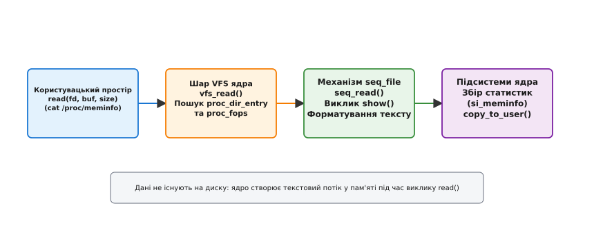

# /proc: процеси як файли

<preknowlist>
- [Моделювання відстеження ptrace](book:unix-linux/ptrace-model) — інспектування процесів, перехоплення системних викликів та права доступу.
- [Псевдофайлова система debugfs](book:unix-linux/debugfs) — середовище відлагодження ядра без гарантій стабільності ABI.
</preknowlist>

Уявіть критичну ситуацію на високонавантаженому продакшен-сервері: один із високопродуктивних службових процесів раптово починає споживати 100% ресурсів центрального процесора або швидко вичерпує фізичну оперативну пам'яті. Системному інженеру або розробнику необхідно терміново з'ясувати стан цього процесу: які саме аргументи командного рядка та змінні оточення йому було передано при запуску, які відкриті сокети чи файлові дескриптори утримують його ресурси, які конкретно регіони віртуальної пам'яті виділені у його купі та скільки часу процесор витратив на обробку системних викликів у режимі ядра.

Звернутися до фізичного дискового накопичувача у цій ситуації неможливо — даний процес існує виключно у динамічній пам'яті системи (RAM). Перезбирати виконуваний файл із прапорцями налагодження, зупиняти сервіс або підключати важкий інвазивний відлагоджувач (такий як GDB) у живій продакшен-системі неприпустимо, оскільки це спричинить зупинку обслуговування користувачів.

Фундаментальна філософія Unix **«усе є файлом»** (everything is a file) пропонує для цієї задачі витончене та універсальне рішення: представити запущені процеси, параметри апаратури та внутрішні структури ядра у вигляді звичайного дерева каталогів та текстових файлів. Псевдофайлова система `/proc` (procfs) виступає в ролі первинного вікна спостережуваності (observability) у Linux, перетворюючи складні внутрішні структури даних ядра на текстовий потік, доступний для стандартних системних утиліт `cat`, `grep`, `awk`, `lsof` та `top`.


*Ієрархія псевдофайлової системи /proc: віртуальні каталоги процесів, системних параметрів ядра та глобальної статистики.*

Детальний процес еволюції відлагодження процесів від ранніх версій Unix до сучасного ядра Linux розкрито у вставці [Історія виникнення procfs](book:unix-linux/proc-filesystem/hist-procfs.md).

---

## 1. Архітектура procfs у ядрі Linux

Псевдофайлова система `/proc` існує виключно в оперативній пам'яті системи (RAM) і не займає жодного байта на фізичних дискових носіях. Коли операційна система монтує `procfs` (зазвичай під час завантаження системи за допомогою команди `mount -t proc proc /proc`), ядро викликає функцію `proc_fill_super()`, яка реєструє нову віртуальну файлову систему у загальному шарі **VFS (Virtual File System)** та присвоює їй унікальний магічний ідентифікатор `PROC_SUPER_MAGIC` (`0x9fa0`).

### Внутрішні структури ядра: proc_dir_entry

Кожен файл, каталог або символічне посилання в межах `/proc` описується всередині ядра структурою `proc_dir_entry`. Ця структура містить метадані про права доступу, ідентифікатори власника (UID/GID), ім'я вузла, вказівники на батьківські та дочірні вузли у Червоно-Чорному дереві (`struct rb_root subdir`), а також вказівники на обробники операцій файлу та іноду.

```c
// Декларація структури з ядра Linux (fs/proc/internal.h)
struct proc_dir_entry {
    atomic_t in_use;
    refcount_t refcnt;
    struct list_head pde_openers;
    spinlock_t pde_unload_lock;
    struct completion *pde_unload_completion;
    const struct inode_operations *proc_iops;
    const struct file_operations *proc_fops;
    union {
        const struct seq_operations *seq_ops;
        int (*single_show)(struct seq_file *, void *);
    };
    void *data;
    unsigned int low_ino;
    nlink_t nlink;
    kuid_t uid;
    kgid_t gid;
    loff_t size;
    struct proc_dir_entry *parent;
    struct rb_root subdir;
    char name[];
};
```

Коли користувацький процес викликає системний виклик `open("/proc/meminfo", O_RDONLY)`, шар VFS перехоплює це звернення і здійснює пошук відповідного вузла у дереві `proc_dir_entry`. Для знайденого об'єкта ядро динамічно створює інстанс структури `inode` у RAM за допомогою функції `proc_get_inode()`, присвоює йому динамічний номер і пов'язує його з операціями файлу `proc_fops`.

### Генерація вмісту "на льоту" та VFS-потік

На відміну від фізичних файлових систем (таких як ext4 або XFS), де виклик `read()` виконує зчитування дискових блоків за адресами блочного пристрою, читання з файла в `/proc` активує відповідну функцію ядра Linux. Ця функція в режимі реального часу обходить внутрішні масиви, зв'язані списки чи таблиці ядра, збирає актуальний стан системних ресурсів і форматує його у текстовий потік.


*Послідовність виконання виклику read() на файлі procfs через підсистеми VFS та seq_file.*

Життєвий цикл об'єктів `inode` у procfs є повністю динамічним. Коли файл у `/proc` закривається користувацьким процесом, а пам'яті системи знаходиться під тиском (memory pressure), шар VFS вивільняє кешовані іноди procfs через механізм `shrink_dentry_list()`, гарантуючи, що моніторинг не спричинить витоків пам'яті ядра.

### Динамічний розрахунок інодів та мапування PID namespaces

Усі числа у назвах каталогів `/proc/[PID]/` генеруються ядром залежно від того, у якому саме просторі імен **PID namespace** виконується процес, що запитує дані. Коли процес виконує `readdir("/proc")`, ядро викликає функцію `proc_pid_make_inode()`.

Номер іноду для файлів у межах каталогу процесу обчислюється за алгоритмом:

```
inode_nr = (pid << 16) | low_ino
```

де `pid` — це ідентифікатор процесу у поточному PID namespace, а `low_ino` — тип конкретного файлу (наприклад, 1 для `stat`, 2 для `maps`, 3 для `cmdline`). Якщо процес виконується всередині ізольованого Docker-контейнера чи підсистеми systemd-nspawn, у своєму ізольованому `/proc` він бачить себе як `PID 1`, і ядро генерує іноди саме для цього локального PID, хоча на рівні хоста цей самий процес має, наприклад, `PID 84920`.

---

## 2. Механізм потокового виводу seq_file

У первісних версіях Linux генерація вмісту віртуальних файлів здійснювалася через прості обробники, які заповнювали один статичний буфер розміром в одну сторінку пам'яті (`PAGE_SIZE`, зазвичай 4096 байт). Якщо обсяг даних перевищував 4 КБ (наприклад, перелік усіх мапованих регіонів віртуальної пам'яті у `/proc/PID/maps` або довгі списки файлових дескрипторів), звичайний виклик `read()` стикався з фундаментальною проблемою.

Якщо користувацький процес зчитував дані невеликими порціями (наприклад, буфером розміром 1024 байти у циклі `while`), при кожному наступному системному виклику `read(fd, buf, 1024)` з новим зміщенням `off` ядро мусило або заново повністю регенерувати увесь текстовий дамп, або намагатися зберегти стан текстового покажчика. Це призводило до зсуву текстових рядків, подвійного виводу однакових записів чи втрати даних при послідовному читанні.

Для розв'язання цієї проблеми в ядрі Linux було розроблено підсистему **`seq_file`** (sequential file).

### Ітератор послідовного доступу

API `seq_file` перетворює генерацію віртуального файлу на ітератор над внутрішніми об'єктами ядра. Для створення нового файлу на базі `seq_file` розробник модуля або підсистеми ядра реалізує чотири обов'язкові функції у структурі `struct seq_operations`:

```c
// Операції ітератора seq_file у ядрі Linux (include/linux/seq_file.h)
struct seq_operations {
    void * (*start) (struct seq_file *m, loff_t *pos);
    void (*stop) (struct seq_file *m, void *v);
    void * (*next) (struct seq_file *m, void *v, loff_t *pos);
    int (*show) (struct seq_file *m, void *v);
};
```

1. **`start(m, pos)`**: Знаходить і повертає об'єкт ядра за логічним індексом `pos` (наприклад, елемент списку з номером `pos`), захоплюючи необхідні системні блокування (`mutex`, `spinlock` чи `rcu_read_lock`).
2. **`next(m, v, pos)`**: Переходить до наступного об'єкта у послідовності та інкрементує покажчик `pos`.
3. **`stop(m, v)`**: Завершує ітерацію та безпечно звільняє системні блокування та тимчасові ресурси, захоплені на етапі `start`.
4. **`show(m, v)`**: Форматує один конкретний об'єкт `v` у текстовий вигляд за допомогою спеціальних функцій ядра `seq_printf()`, `seq_puts()` або `seq_putc()`.

### Крок за кроком: виконання системного виклику `seq_read()`

Коли користувацький процес викликає `read(fd, buf, size)`, підсистема ядра виконує внутрішню функцію `seq_read()` за такою суворою послідовністю:

1. **Ініціалізація буфера**: Якщо буфер `m->buf` ще не виділено, ядро виділяє початкову сторінку пам'яті (4096 байт) за допомогою `kvmalloc()`.
2. **Запуск ітерації**: Викликається функція `op->start(m, &m->index)`, яка захоплює RCU-блокування або м'ютекс відповідної підсистеми.
3. **Заповнення буфера**: У циклі викликається `op->show(m, p)`. Якщо форматований рядок вміщається у буфер, викликається `op->next()`.
4. **Обробка переповнення буфера**: Якщо згенерований текст не вміщається у залишку буфера `m->buf`, функція `show()` повертає помилку `SEQ_SKIP` або від'ємний код. На цьому етапі `seq_read()` вивільняє поточний буфер, подвоює його розмір (4 КБ -> 8 КБ -> 16 КБ), виділяє новий блок пам'яті, викликає `op->stop()`, скидає стан ітератора та перезапускає виконання з позиції `start()`.
5. **Завершення та копіювання**: Після завершення збирання даних викликається `op->stop()`, а згенерований текстовий блок копіюється у користувацький буфер за допомогою системної функції `copy_to_user()`.

Це гарантує абсолютну цілісність даних при читанні файлів будь-якого розміру, повністю виключаючи обриви даних при послідовному читанні.

---

## 3. Анатомія каталогу процесу `/proc/[PID]/`

Первинним призначенням procfs є надання повної інформації про запущені процеси. Для кожного активного процесу в системі ядро підтримує каталог, ім'я якого відповідає його числовому ідентифікатору **PID** (Process ID).

Спеціальний каталог **`/proc/self/`** є динамічним символічним посиланням на каталог того процесу, який безпосередньо виконує системне звернення. Для аналізу потоків виконання всередині процесу ядро надає підкаталоги `/proc/[PID]/task/[TID]/`.

Повний технічний довідник полів та форматів даних наведено у вставці [Довідник полів та файлів /proc](book:unix-linux/proc-filesystem/api-proc-filesystem.md).

```text
/proc/1234/
├── cmdline       # Аргументи командного рядка (\0-separated)
├── environ       # Змінні оточення (\0-separated)
├── exe           # Symlink на виконуваний бінарний файл
├── cwd           # Symlink на поточну робочу директорію
├── root          # Symlink на кореневий каталог процесу (chroot)
├── mem           # Прямий доступ до віртуальної пам'яті
├── fd/           # Каталог відкритих файлових дескрипторів
├── fdinfo/       # Позиції та прапорці файлових дескрипторів
├── maps          # Карта віртуальної пам'яті (VMA)
├── smaps         # Детальна статистика пам'яті (PSS, RSS, Swap)
├── stat          # Однорядкова статистика для утиліт (ps, top)
├── statm         # Короткий обсяг пам'яті в сторінках
├── status        # Форматований текст зі станом та UID/GID
├── cgroup        # Контрольні групи ресурсів cgroups
├── task/         # Каталог потоків виконання (TID)
└── ns/           # Символічні посилання на простори імен
```

### 3.1. Командний рядок та оточення: cmdline і environ

Файли `/proc/[pid]/cmdline` та `/proc/[pid]/environ` описують контекст запуску процесу:

- **`cmdline`**: Повний масив аргументів `argv`, переданий процесу при виконанні системного виклику `execve()`. Аргументи розділені нуль-символом (`\0`). Якщо процес змінює свій буфер `argv` під час виконання (наприклад, Nginx чи PostgreSQL перезаписують `argv` для відображення свого стану у списку процесів), новий вміст негайно відображається у файлі `cmdline`.
- **`environ`**: Масив всіх змінних оточення процесу на момент запуску у форматі `KEY=VALUE\0`.

Оскільки аргументи та змінні оточення розділені нуль-символом `\0`, звичайний вивід `cat /proc/1234/cmdline` у консолі зливається в один рядок. Для правильного форматування використовують утиліту `tr`:

```bash
# Перетворення нуль-символів на пробіли для перегляду командного рядка
tr '\0' ' ' < /proc/1234/cmdline

# Перетворення нуль-символів на нові рядки для фільтрації змінних оточення
tr '\0' '\n' < /proc/1234/environ | grep -E "PATH|LD_LIBRARY_PATH"
```

### 3.2. Метрики стану та ресурсів: stat, status та statm

Для моніторингу стану процесу ядро формує три файли:

1. **`/proc/[pid]/stat`**: Однорядковий файл, який містить 52 числові та текстові поля, розділені пробілами (PID, назва програми `comm`, стан `state`, PPID, час роботи у режимі користувача `utime`, час у режимі ядра `stime`, обсяг віртуальної пам'яті `vsize`, фізичні сторінки `rss`). Файл оптимізовано для максимально швидкого зчитування утилітами `top`, `ps`, `htop`.
2. **`/proc/[pid]/status`**: Людиночитабельна версія статистик із `/proc/[pid]/stat`, розбита на текстові рядки у форматі `Ключ: Значення`. Містить детальні права доступу (Real, Effective, Saved, Filesystem UID/GID), маски заблокованих та очікуваних сигналів (`SigPnd`, `SigBlk`, `SigIgn`), ліміти системних викликів та маски дозволених ядер CPU (`Cpus_allowed_list`).
3. **`/proc/[pid]/statm`**: Стисла статистика використання пам'яті у сторінках (загальний розмір, RSS, спільна пам'ять, текст, дата).

### 3.3. Глибокий аналіз віртуальної пам'яті: maps та smaps

Файл `/proc/[pid]/maps` відображає карту віртуального адресного простору процесу. Кожен рядок описує одну структуру `vm_area_struct` (VMA) у Червоно-Чорному дереві `mm_struct->mm_mt` (Maple Tree у сучасних ядрах Linux) і містить діапазон віртуальних адрес, прапорці прав доступу (`r-xp`), зміщення у файлі, номери пристрою та `inode`, а також шлях до файлу або псевдонім (`[heap]`, `[stack]`, `[vdso]`, `[vvar]`).

Для детального аналізу витоків пам'яті ядро надає файл **`/proc/[pid]/smaps`**. При його зчитуванні підсистема ядра `walk_page_range()` обходить багаторівневу таблицю сторінок процесу (`PGD -> P4D -> PUD -> PMD -> PTE`) для кожного регіону VMA і розраховує:

- **`Rss` (Resident Set Size)**: Загальний обсяг фізичної пам'яті, виділений під цей регіон.
- **`Pss` (Proportional Set Size)**: Пропорційна частка фізичної пам'яті з урахуванням розділення між процесами. Якщо сторінка пам'яті розміром 4 КБ мапована `N` процесами (наприклад спільною бібліотекою `libc.so`), ядро зчитує лічильник `page_mapcount(page)` і додає `4 KB / N` до `Pss` кожного процесу. Сума `Pss` по всіх регіонах надає точне фізичне споживання RAM сервісом.
- **`Shared_Clean` / `Shared_Dirty`**: Пам'ять спільно використовуваних бібліотек (наприклад `libc.so`), яка не змінювалася або була модифікована.
- **`Private_Clean` / `Private_Dirty`**: Приватна пам'ять процесу (купа, динамічні об'єкти), яка належить лише цьому процесу.
- **`AnonHugePages`**: Обсяг пам'яті, виділений прозорими великими сторінками (Transparent Huge Pages — THP розміром 2 МБ).

### 3.4. Прямий доступ до пам'яті через `/proc/[pid]/mem`

Файл `/proc/[pid]/mem` надає унікальну можливість здійснювати пряме читання та запис у віртуальний адресний простір процесу через звичайні системні виклики `lseek()`, `read()` та `write()`.

Принцип роботи:
1. Процес-спостерігач відкриває файл `open("/proc/1234/mem", O_RDWR)`.
2. Виконує позиціонування покажчика `lseek(fd, 0x00400000, SEEK_SET)` на віртуальну адресу пам'яті цільового процесу.
3. Викликом `read(fd, buf, 1024)` зчитує сирі байти пам'яті безпосередньо з адресної карти процесу.

На відміну від системного виклику `ptrace(PTRACE_PEEKDATA)`, який вимагає перемикання контексту та обробки по одному слову (4 або 8 байт), читання через `/proc/[pid]/mem` використовує внутрішню функцію ядра `access_remote_vm()` / `process_vm_readv()`, яка зчитує сторінки пам'яті великими блоками зі швидкістю фізичної шини пам'яті.

### 3.5. Файлові дескриптори: fd та fdinfo

Каталог `/proc/[pid]/fd/` містить символічні посилання для кожного файлового дескриптора, відкритого процесом:

```bash
$ ls -l /proc/self/fd/
lr-x------ 1 user user 64 Aug 14 12:00 0 -> /dev/pts/1
lrwx------ 1 user user 64 Aug 14 12:00 1 -> /dev/pts/1
lrwx------ 1 user user 64 Aug 14 12:00 2 -> /dev/pts/1
lr-x------ 1 user user 64 Aug 14 12:00 3 -> /var/log/nginx/access.log
lrwx------ 1 user user 64 Aug 14 12:00 4 -> 'socket:[54321]'
```

Каталог **`/proc/[pid]/fdinfo/`** містить текстові файли з метаданими про стан кожного дескриптора: поточному зміщенню покажчика читання/запису у файлі (`pos`), прапорцям відкриття файлу (`flags` у вісімковому форматі), а також специфічним даним підсистем:
- **Для `epoll` дескрипторів**: Внутрішня функція `epoll_fdinfo()` описує всі моніторені файлові дескриптори, їхні маски подій `events` та додані дані `data`. Це дозволяє інспектувати заблоковані асинхронні петлі `epoll_wait()` без зупинки процесу.
- **Для `timerfd` та `inotify`**: Відображає інтервали спрацьовування таймерів та маски спостереження за каталогами.

Утиліти `lsof` та `fuser` будують свої звіти саме шляхом обходу каталогів `/proc/[PID]/fd/` усіх активних процесів.

### 3.6. Багатопотоковість, cgroups та простори імен: task, cgroup і ns

У ядрі Linux немає фундаментальної відмінності між процесом та потоком виконання — обидва описуються структурою `task_struct`. Потоки однієї групи процесів (POSIX threads) ділять між собою спільний адресний простір, файлові дескриптори та таблицю сигналів.

- **`/proc/[pid]/task/`**: Каталог, де для кожного потоку створюється підкаталог із його ідентифікатором **TID** (Thread ID). Усередині `/proc/[pid]/task/[tid]/` містяться такі самі файли статистик (`stat`, `status`, `comm`), що дозволяє аналізувати CPU-час та стан кожного окремого потоку.
- **`/proc/[pid]/cgroup`**: Показує шлях до контрольної групи ресурсів cgroups v1/v2, у якій перебуває процес.
- **`/proc/[pid]/ns/`**: Каталог із символічними посиланнями на простори імен (namespaces), у яких виконується процес (`pid`, `net`, `mnt`, `ipc`, `uts`, `user`, `cgroup`).

#### Проблема розходження метрик у контейнерах (lxcfs)

Оскільки файл `/proc/meminfo` відображає загальний обсяг фізичної пам'яті всієї хостової системи, утиліти моніторингу (або рантайми мов програмування, такі як Java JVM чи Go runtime), які виконуються всередині контейнера Docker / Kubernetes, зчитують `/proc/meminfo` і бачать 256 ГБ RAM хоста, хоча ліміт cgroup для контейнера встановлено у 4 ГБ. Це призводило до крахів JVM через помилки Out-Of-Memory.

Для розв'язання цієї проблеми в контейнерних середовищах застосовують сервіс **`lxcfs`**. Він перехоплює звернення до `/proc/meminfo` та `/proc/stat` всередині контейнера через шари FUSE і повертає динамічно згенерований текстовий потік, обрізаний під ліміти cgroup даного контейнера.

---

## 4. Конфігурування ядра через /proc/sys/ (sysctl)

Каталог `/proc/sys/` надає інтерфейс для перегляду та динамічної зміни параметрів працюючого ядра без необхідності його перезавантаження або повторної компіляції. Цей каталог розгортається у дерево на основі реєстрації системних таблиць `register_sysctl_table()`.

### Структура розділів /proc/sys/

- **`/proc/sys/kernel/`**: Глобальні параметри ядра:
  - `pid_max` — максимальний PID у системі (до 4194304);
  - `threads-max` — сукупний ліміт потоків;
  - `kptr_restrict` — режим приховування вказівників пам'яті ядра у `/proc/kallsyms` (0, 1, 2);
  - `yama/ptrace_scope` — рівень безпеки ptrace (0 — класичний, 1 — лише батьківські процеси, 2 — лише `CAP_SYS_PTRACE`, 3 — повна заборона).
- **`/proc/sys/vm/`**: Налаштування підсистеми управління віртуальною пам'яттю:
  - `swappiness` — агресивність використання файлу/розділу підкачки (значення від 0 до 200);
  - `drop_caches` — примусове звільнення сторінкового кешу та інодів (1 — pagecache, 2 — dentries/inodes, 3 — обидва);
  - `overcommit_memory` — політика виділення пам'яті (0 — евристична, 1 — дозволяти завжди, 2 — суворий ліміт);
  - `dirty_ratio` / `dirty_background_ratio` — пороги для скидання "брудних" сторінок на диск.
- **`/proc/sys/net/`**: Параметри мережевого стека (IPv4, IPv6, UNIX-сокети, IPsec):
  - `ipv4/ip_forward` — увімкнення маршрутизації пакетів (0 або 1);
  - `core/somaxconn` — максимальна довжина черги нерозглядних сокетів `listen()`;
  - `ipv4/tcp_wmem` / `tcp_rmem` — розміри буферів прийому та передачі TCP.

> 🔧 **Навіщо це.**
> Зміна значення у `/proc/sys/` відбувається шляхом звичайного запису тексту у файл. Наприклад, щоб скинути сторінковий кеш ядра для проведення точного бенчмарку дискових операцій, інженер виконує запис значення `3` у файл `/proc/sys/vm/drop_caches`. Ядро виконує валідацію введеного рядка за допомогою внутрішньої функції `proc_dointvec_minmax()`.

### Приклад взаємодії з /proc/sys/ у коді

Для читання та запису системних змінних можна використовувати як C, так і C++:

:::tabs
```c
#include <stdio.h>
#include <stdlib.h>
#include <stdbool.h>

bool set_ip_forwarding(bool enable) {
    FILE *fp = fopen("/proc/sys/net/ipv4/ip_forward", "w");
    if (!fp) {
        perror("Помилка відкриття sysctl ip_forward");
        return false;
    }
    fprintf(fp, "%d\n", enable ? 1 : 0);
    fclose(fp);
    return true;
}

int main(void) {
    if (set_ip_forwarding(true)) {
        printf("IP forwarding успішно увімкнено.\n");
    }
    return 0;
}
```
```cpp
#include <iostream>
#include <fstream>
#include <filesystem>
#include <system_error>

class SysctlManager {
public:
    static bool setIpForwarding(bool enable) {
        const std::filesystem::path path{"/proc/sys/net/ipv4/ip_forward"};
        std::ofstream file(path);
        if (!file.is_open()) {
            std::cerr << "Помилка доступу до " << path << "\n";
            return false;
        }
        file << (enable ? 1 : 0) << "\n";
        return file.good();
    }
};

int main() {
    if (SysctlManager::setIpForwarding(true)) {
        std::cout << "IP forwarding успішно увімкнено.\n";
    }
    return 0;
}
```
:::

---

## 5. Безпека, права доступу та крайові випадки

Оскільки `/proc` містить чутливу інформацію про всі процеси в системі (включно із паролями у змінних оточення чи аргументах командного рядка), ядро забезпечує суворий розмежувальний контроль доступу.

### 5.1. Параметри монтування hidepid

Типово в Linux будь-який звичайний користувач може переглядати перелік усіх PID у системі та читати їхні файли `/proc/[pid]/stat` чи `cmdline`. Для забезпечення ізоляції у багатокористувацьких або хмарних середовищах procfs підтримує прапорці монтування **`hidepid`**:

- **`hidepid=off` (або 0, за замовчуванням)**: Усі користувачі бачать каталоги всіх процесів.
- **`hidepid=about` (або 1)**: Користувач бачить каталоги лише власних процесів. Каталоги інших користувачів залишаються видимими у `/proc`, але доступ до файлів усередині них обмежено (повертається помилка `EACCES`).
- **`hidepid=invisible` (або 2)**: Каталоги процесів інших користувачів повністю приховуються з `/proc`. Користувач бачить лише власні процеси, а спроба звернутися до `/proc/[other_pid]` повертає помилку `ENOENT` (файл не існує), що унеможливлює сканування PID системи.
- **`gid=GROUP`**: Визначає групу користувачів (наприклад `monitoring`), яка обходить обмеження `hidepid` і бачить усі процеси.

```bash
# Ремонтування /proc із підвищеним рівнем ізоляції процесів
mount -o remount,hidepid=2,gid=monitoring /proc
```

### 5.2. Права доступу та перевірки ptrace

Доступ до чутливих файлів процесу — таких як `/proc/[pid]/mem` (прямий доступ до віртуальної пам'яті процесу) та `/proc/[pid]/environ` — регулюється внутрішньою функцією ядра `ptrace_may_access()`.

Для зчитування пам'яті чужого процесу через `/proc/[pid]/mem` процес-спостерігач повинен мати такі самі привілеї UID/GID, що й цільовий процес, або володіти CAPABILITY **`CAP_SYS_PTRACE`**. Крім того, на рівні ядра перевіряються прапорці модулів безпеки LSM (SELinux, AppArmor, Yama ptrace scope).

### 5.3. Крайові випадки парсингу /proc/[pid]/stat

Найвідомішим пастковим місцем при програмуванні обробки procfs є розбір файла `/proc/[pid]/stat`. Поле №2 `comm` містить назву виконуваного файлу в круглих дужках. Згідно зі специфікацією POSIX та Linux, процес може змінити свою назву на будь-який рядок, який містить пробіли або закриваючі дужки, наприклад `(sd-pam)` або `(my_app ) test)`.

Прибічне використання `sscanf(buf, "%d %s %c", &pid, comm, &state)` призводить до зсуву всіх 50 наступних числових полів. Правильний розбір вимагає знаходження першої відкриваючої дужки `(` та **найостаннішої** закриваючої дужки `)` у рядку.

Детальний приклад реалізації безпечного парсера з описом алгоритму наведено у вставці [Практична реалізація парсера /proc](book:unix-linux/proc-filesystem/proj-proc-parser.md).

### 5.4. Накладні витрати обходу /proc та eBPF-альтернативи

Коли системні утиліти (`ps aux`, `top`, `conky`) сканують стан усіх процесів, вони виконують виклики `readdir("/proc")`, а потім виклики `open()`, `read()`, `close()` для сотень каталогів `/proc/[PID]/`.

На високонавантажених Kubernetes-вузлах із тисячами контейнерів це створює помітні накладні витрати:
- Створення та знищення тисяч тимчасових `inode` у RAM.
- Виділення та звільнення пам'яті під буфери `seq_file`.
- Багаторазові переключення контексту між користувацьким простором та ядром (`user <-> kernel space context switches`).

У сучасних версіях ядра Linux (починаючи з 5.8) для задач високопродуктивного моніторингу замість масового обходу `/proc` використовують **eBPF iterators** (`bpf_iter_task`). Вони дозволяють виконати програму BPF безпосередньо всередині ядра у режимі RCU, агрегувати лічильники у кільцевому буфері `BPF_MAP_TYPE_RINGBUF` і передати у користувацький простір вже готову бінарну статистику за 1 системний виклик `read()`, оминаючи накладні витрати VFS та форматування тексту в procfs.

---

## 6. Порівняння псевдофайлових систем ядра

З розвитком Linux у ядрі з'явилося декілька віртуальних файлових систем. Кожна з них має чітко визначену зону відповідальності:

| Файлова система | Точка монтування | Головне призначення | Стабільність ABI |
| :--- | :--- | :--- | :--- |
| **`procfs`** | `/proc` | Інформація про запущені процеси (`/proc/[pid]`), системні метрики (`/proc/meminfo`) та конфігурації `sysctl`. | **Висока** (Суворий стандарт POSIX / Linux ABI). |
| **`sysfs`** | `/sys` | Ієрархічна модель пристроїв, шин, драйверів, cgroups та блочних накопичувачів. | **Висока** (Канонічне правило: "один файл — одне значення"). |
| **`debugfs`** | `/sys/kernel/debug` | Внутрішнє відлагодження ядра, дампи підсистем для розробників драйверів. | **Відсутня** (Інтерфейс змінюється між версіями ядра). |
| **`tracefs`** | `/sys/kernel/tracing` | Керування трасуванням ядра (`ftrace`, `kprobes`, `uprobes`, `tracepoints`). | **Середня** (Стабільні точки трасування). |
