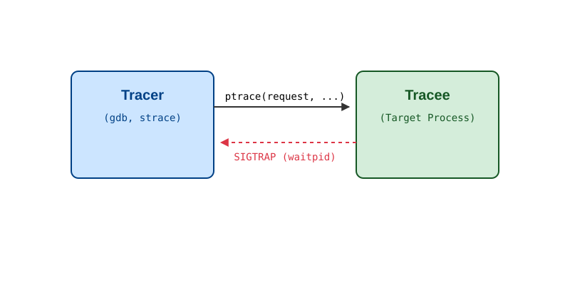
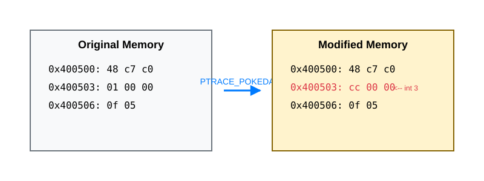

# ptrace: на чому тримається трасування й налагодження

<preknowlist>
- [Концепції ядра Linux](book:unix-linux/kernel-and-userspace) — базові поняття системних викликів та VFS.
</preknowlist>

Системний виклик `ptrace` (від "process trace") — це один із найстаріших, найскладніших і водночас найвпливовіших механізмів в операційних системах сімейства Unix. Він надає одному процесу (який називається **tracer** — трасувальник) можливість контролювати виконання іншого процесу (**tracee** — трасований), читати і змінювати його пам'ять, регістри процесора, а також перехоплювати сигнали та системні виклики.

У цьому розділі ми розберемо, як працює `ptrace`, які в нього є фундаментальні концепції (зупинки, сигнали, команди), і як саме на його базі побудовані такі інструменти, як `gdb` (налагоджувач) та `strace` (трасувальник системних викликів).

## 1. Архітектура ptrace: Tracer та Tracee

Модель `ptrace` завжди базується на відношенні двох процесів. Tracer — це процес-контролер, який викликає `ptrace()`. Tracee — це процес-ціль, який контролюється. Важливо розуміти, що це відношення є асиметричним і суворо прив'язаним до ієрархії потоків: зазвичай трасувальник є батьківським процесом для трасованого, або ж він повинен мати відповідні права (CAP_SYS_PTRACE) для приєднання до вже існуючого процесу.


*Рис. 1. Базова архітектура взаємодії Tracer та Tracee через ptrace.*

Єдиною точкою входу для всього цього функціоналу є системний виклик, прототип якого виглядає так:

```c
#include <sys/ptrace.h>

long ptrace(enum __ptrace_request request, pid_t pid, void *addr, void *data);
```

Аргументи цього виклику виконують такі ролі:
- `request`: Команда (що саме ми хочемо зробити: прочитати пам'ять, зупинити процес, продовжити виконання тощо).
- `pid`: Ідентифікатор процесу, над яким виконується операція.
- `addr` та `data`: Адреси пам'яті в адресному просторі трасувальника або трасованого, куди записуються дані, або звідки вони читаються (залежить від `request`).

## 2. Початок роботи: PTRACE_TRACEME та PTRACE_ATTACH

Щоб розпочати трасування, потрібно встановити зв'язок між процесами. Існує два основні сценарії:

### Сценарій 1: Запуск процесу під наглядом (PTRACE_TRACEME)

Цей метод зазвичай використовується, коли ви запускаєте програму в `gdb` (наприклад, `gdb ./my_program`). Трасувальник створює новий дочірній процес через `fork()`. У дочірньому процесі, перед тим як викликати `execve()` для запуску цільової програми, виконується `ptrace(PTRACE_TRACEME, 0, NULL, NULL)`. 

Ця команда каже ядру: "Я дозволяю своєму батьківському процесу трасувати мене. При наступному виклику `execve()`, зупини мене і надішли батькові сигнал". Після цього викликається `execve()`, і ядро зупиняє процес ще до виконання першої інструкції нової програми, генеруючи сигнал `SIGTRAP`. Батьківський процес чекає на цю подію за допомогою системного виклику `waitpid()`.

### Сценарій 2: Приєднання до існуючого процесу (PTRACE_ATTACH)

Якщо процес вже запущений і працює (наприклад, веб-сервер, що завис), ви можете використати `gdb -p <pid>` або `strace -p <pid>`. У цьому випадку інструмент виконує команду `PTRACE_ATTACH`.

Коли виконується `ptrace(PTRACE_ATTACH, pid, NULL, NULL)`, ядро негайно відправляє цільовому процесу сигнал `SIGSTOP`. Процес зупиняється. Трасувальник знову ж таки використовує `waitpid()` для очікування моменту, коли процес дійсно зупиниться, після чого може починати читати його пам'ять і регістри. Важливо відзначити, що з точки зору ядра, tracer стає тимчасовим батьком tracee на час трасування (це можна побачити в `ps` або `/proc/<pid>/stat`).

## 3. Модель подій: SIGTRAP та waitpid

Серцем механізму `ptrace` є цикл подій. Процес-tracee не виконується безперервно під час трасування. Ядро зупиняє його при виникненні певних подій. Усі ці зупинки комунікуються трасувальнику через механізм сигналів, переважно через `SIGTRAP`.

Життєвий цикл типового трасувальника (наприклад, `gdb`) виглядає як нескінченний цикл:

```c
while (1) {
    int status;
    waitpid(pid, &status, 0); // Очікування події від tracee
    
    if (WIFEXITED(status)) {
        // Tracee завершив роботу
        break;
    }
    
    if (WIFSTOPPED(status)) {
        int sig = WSTOPSIG(status);
        if (sig == SIGTRAP) {
            // Це подія ptrace (наприклад, hit breakpoint або syscall)
            handle_trap();
        } else {
            // Tracee отримав інший сигнал (наприклад, SIGSEGV)
            // Ми можемо проаналізувати його або передати процесу далі
        }
    }
    
    // Продовжити виконання tracee
    ptrace(PTRACE_CONT, pid, NULL, NULL);
}
```

Коли tracee зупинений, ядро гарантує, що його стан (пам'ять, регістри) є консистентним і безпечним для читання та модифікації.

## 4. Інспекція стану: PEEK, POKE та GETREGS

Після зупинки процесу ми маємо повний доступ до його нутрощів.

### Доступ до регістрів процесора
Трасувальник може отримати значення всіх регістрів процесора за допомогою `PTRACE_GETREGS`. Ця команда заповнює структуру `user_regs_struct` (специфічну для кожної архітектури, наприклад x86_64). Це дозволяє `gdb` показувати значення `%rax`, `%rip`, `%rsp` тощо. Зворотна команда — `PTRACE_SETREGS` — дозволяє змінити значення регістрів, що критично для впровадження коду або зміни напрямку виконання.

### Доступ до пам'яті
Читання та запис пам'яті здійснюється через `PTRACE_PEEKDATA` та `PTRACE_POKEDATA` (або `PEEKTEXT` / `POKETEXT`, які на сучасних системах еквівалентні). 
- `long val = ptrace(PTRACE_PEEKDATA, pid, addr, NULL);` — читає одне слово (зазвичай 8 байт на 64-бітних системах) за адресою `addr`.
- `ptrace(PTRACE_POKEDATA, pid, addr, new_val);` — записує слово.

Читання/запис по одному слову через системні виклики — це дуже повільно, тому для великих блоків пам'яті сучасні налагоджувачі часто використовують файл `/proc/<pid>/mem`, який дозволяє використовувати звичайні `pread`/`pwrite` для швидкого доступу до адресного простору зупиненого процесу.

## 5. Анатомія gdb: Як працюють точки зупину (Breakpoints)

Найвідоміша фіча `gdb` — встановлення точок зупину (breakpoints). Як це реалізовано під капотом? Відповідь полягає в архітектурно-залежній модифікації коду на льоту.

На архітектурі x86/x86_64 існує спеціальна однобайтова інструкція `int 3` (опкод `0xCC`), яка генерує програмне переривання "Breakpoint Trap". 

Коли ви в `gdb` кажете `break main`:
1. `gdb` за допомогою відлагоджувальних символів (DWARF) знаходить адресу в пам'яті, де починається функція `main` (нехай це `0x400503`).
2. `gdb` читає оригінальний байт за цією адресою через `PTRACE_PEEKDATA` і зберігає його у своїй внутрішній таблиці.
3. `gdb` записує байт `0xCC` (`int 3`) за цією адресою через `PTRACE_POKEDATA`.


*Рис. 2. Механізм встановлення програмного breakpoint'а шляхом заміни оригінальної інструкції на 0xCC.*

Коли tracee продовжує виконання і процесор доходить до адреси `0x400503`, він виконує інструкцію `0xCC`. Це змушує процесор згенерувати переривання. Ядро перехоплює його, розуміє, що процес трасується, перетворює переривання на сигнал `SIGTRAP` і зупиняє tracee. `gdb` прокидається з `waitpid()`.

Щоб продовжити виконання після точки зупину:
1. `gdb` повертає оригінальний байт на місце `0xCC`.
2. Відкручує лічильник команд (`%rip`) на один байт назад (`ptrace(PTRACE_SETREGS)`), бо після виконання `0xCC` вказівник зсунувся вперед.
3. Виконує ОДНУ інструкцію (оригінальну) за допомогою `ptrace(PTRACE_SINGLESTEP, ...);`.
4. Знову записує `0xCC` на те саме місце (щоб точка зупину спрацювала наступного разу).
5. Продовжує звичайне виконання (`PTRACE_CONT`).

## 6. Анатомія strace: Перехоплення системних викликів

На відміну від `gdb`, утиліта `strace` цікавиться не конкретними адресами в коді, а взаємодією процесу з ядром. Вона базується на команді `PTRACE_SYSCALL`.

Коли трасувальник виконує `ptrace(PTRACE_SYSCALL, pid, NULL, NULL)`, tracee продовжує виконання до того моменту, поки він не спробує виконати системний виклик (вхід у syscall), АБО доки не завершиться поточний системний виклик (вихід із syscall).

Цикл `strace` виглядає так:
1. Очікує зупинки (`waitpid`).
2. Якщо це зупинка на вході в системний виклик (`syscall-enter-stop`):
   - Читає регістри (`PTRACE_GETREGS`). На x86_64 `%rax` містить номер системного виклику (наприклад, 0 для `read`, 1 для `write`).
   - Регістри `%rdi`, `%rsi`, `%rdx` тощо містять аргументи.
   - `strace` виводить на екран: `read(3, ...`.
3. Викликає `PTRACE_SYSCALL` знову.
4. Процес прокидається, ядро виконує реальний системний виклик. На виході з нього процес знову зупиняється (`syscall-exit-stop`).
5. `strace` прокидається, знову читає регістри. Тепер `%rax` містить результат виконання (код повернення або помилку `-ERRNO`).
6. `strace` виводить результат: `...) = 10`.

Трасування кожного системного виклику через `ptrace` створює величезні накладні витрати (overhead), оскільки на один системний виклик tracee припадає чотири перемикання контексту (Tracee -> Kernel -> Tracer -> Kernel -> Tracee). Це робить класичний `strace` повільним для високо навантажених додатків.

## 7. Завершення роботи: PTRACE_DETACH

Коли трасування більше не потрібне, трасувальник викликає `ptrace(PTRACE_DETACH, pid, NULL, data)`. Ця команда скасовує режим трасування, відв'язує процеси і дозволяє tracee продовжити нормальне виконання, наче нічого й не було. Батьківство процесу відновлюється до оригінального стану (якщо використовувався `PTRACE_ATTACH`).

## 8. Проблеми та еволюція (Seccomp, eBPF)

Хоча `ptrace` є універсальним інструментом, він має два суттєві недоліки:
1. **Швидкодія**: Часте перемикання контексту між ядром та користувацьким простором робить постійне трасування на продакшні неможливим (додаток може сповільнитися в десятки разів).
2. **Безпека**: Можливість читати і писати пам'ять іншого процесу — це величезна діра, якою можуть скористатися зловмисники для впровадження шкідливого коду. Тому в сучасних системах Linux (через Yama LSM) часто діє політика `ptrace_scope`, яка забороняє процес відлагоджувати процеси, які він сам не породив, навіть від імені того ж користувача.

Сучасні альтернативи для observability вирішують проблему швидкодії. Наприклад, щоб фільтрувати системні виклики швидше, до `ptrace` додали інтеграцію з **seccomp-bpf**: ядро може саме за правилами BPF вирішувати, чи треба зупиняти процес і будити tracer для конкретного системного виклику, чи пропустити його.

А для глобального профілювання та трасування в ядрі зараз домінують технології **eBPF**, **kprobes/uprobes** та інструменти на кшталт `perf` і `bpftrace`, які дозволяють виконувати логіку збору метрик безпосередньо в просторі ядра, без дорогих перемикань контексту. Однак для покрокового налагодження коду та інтерактивної зміни пам'яті (завдання `gdb`) `ptrace` залишається безальтернативним стандартом де-факто.
