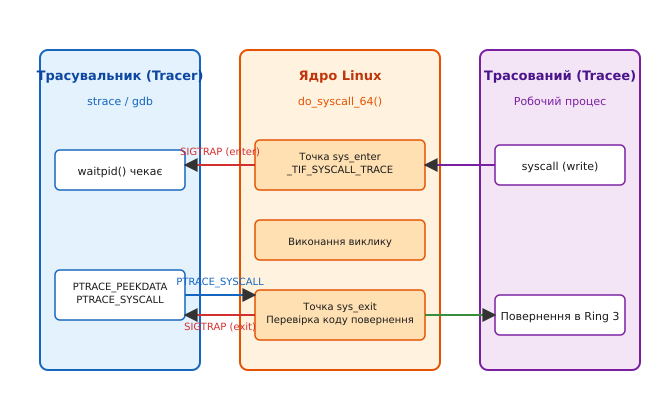
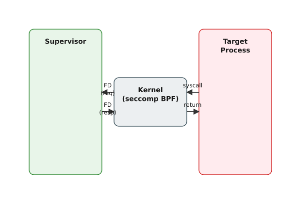
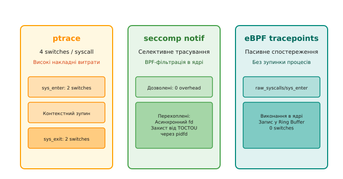

# Трасування системних викликів: ptrace, seccomp й перехоплення входів/виходів

<preknowlist>
- [Модель процесного трасування ptrace](topic:unix-linux/ptrace-model) — механіка сигналів SIGTRAP, відносини tracer та tracee.
- [Віртуальна файлова система /proc](topic:unix-linux/proc-filesystem) — структура псевдофайлової системи та інспектування пам'яті процесів.
- [Концепція eBPF у ядрі Linux](topic:unix-linux/ebpf-extended-berkeley-packet-filter) — виконання безпечного байт-коду в просторі ядра.
</preknowlist>

Операційні системи сімейства Unix та Linux будуються на фундаментальній межі ізоляції між привілейованим ядром (Kernel Space, Ring 0) та непривілейованими процесами користувача (User Space, Ring 3). Будь-яка взаємодія програми з зовнішнім світом — від запису кількох байт у файл до створення мережевого сокета чи виділення нової сторінки пам'яті — здійснюється виключно через системні виклики (system calls). Механізм трасування системних викликів дозволяє зовнішньому процесу або ядру спостерігати за цими межовими переходами, вимірювати їхню тривалість, перехоплювати аргументи й навіть змінювати поведінку програми під час виконання.

Практичний інструментарій налагоджувачів (`gdb`, `lldb`), діагностичних систем (`strace`), моніторів безпеки (Falco) та контейнерних пісочниць (gVisor, LXCFS) спирається на перехоплення точок `sys_enter` та `sys_exit`. На цьому рубежі ядро пропонує декілька архітектурних моделей з різним рівнем накладних витрат: синхронну зупинку процесу через `ptrace()`, асинхронну делегацію викликів через `seccomp user notification` (`SECCOMP_RET_USER_NOTIF`) або виконання байт-коду безпосередньо у контексті ядра за допомогою eBPF. Кожен підхід вимагає компромісу між контролем аргументів, швидкістю переключення контексту та безпекою проти атак типу Time-of-Check to Time-of-Use (TOCTOU).

## Першопричини ізоляції та анатомія системного виклику

Щоб зрозуміти, як відбувається перехоплення системного виклику, необхідно розглянути апаратні та програмні механізми, які виконуються при переході процесора з Ring 3 у Ring 0. 

Апаратне забезпечення сучасної архітектури (наприклад, x86_64) гарантує захист пам'яті за допомогою блоку управління пам'яттю (MMU) та каталогу сторінок. Процес у просторі користувача не має прямого доступу до структур ядра та адресного простору інших процесів. Для виконання системної операції процес виконує спеціальну процесорну інструкцію `syscall` (на архітектурах x86_64) або `sysenter` (на 32-бітних x86).

```
[Польоти в User Space (Ring 3)] 
        │
        ▼ (Інструкція SYSCALL / SYSENTER)
[Апаратний перехід процесора у Ring 0 (MSR_LSTAR / MSR_STAR)]
        │
        ▼
[Ассемблерний обробник entry_64.S -> entry_SYSCALL_64]
        │
        ▼
[Збереження регістрів користувача у struct pt_regs]
        │
        ▼
[Перевірка прапорців thread_info: _TIF_SYSCALL_TRACE / _TIF_SECCOMP]
        │
        ├─> (Якщо прапорці встановлено): Повільний шлях (Slow Path) -> sys_enter
        │
        ▼ (Таблиця системних викликів sys_call_table)
[Виконання функціоналу ядра (sys_read, sys_write, sys_openat...)]
        │
        ▼
[Запис коду повернення у pt_regs.rax]
        │
        ├─> (Якщо прапорці встановлено): Повільний шлях (Slow Path) -> sys_exit
        │
        ▼ (Інструкція SYSRET / SYSEXIT)
[Відновлення регістрів та повернення в User Space (Ring 3)]
```

Під час виконання інструкції `syscall` процесор автоматично виконує наступні апаратні дії:
1. Зберігає адресу наступної інструкції користувача (Return Instruction Pointer) у специфічний регістр `rcx`.
2. Зберігає поточний стан прапорців процесора `rflags` у регістр `r11`.
3. Завантажує нове значення `rip` із системного регістра MSR (Model-Specific Register) `IA32_LSTAR` (`0xC0000082`), де ядро Linux під час завантаження реєструє адресу функції `entry_SYSCALL_64`.
4. Застосовує маску прапорців із MSR `IA32_FMASK`, вимикаючи переривання для безпечного переходу.

У ядрі Linux 64-бітний обробник `entry_SYSCALL_64` виконує інструкцію `swapgs` для переключення первинного покажчика структури `per-cpu` даних, перемикає стек процесора з користувацького на стек ядра нитки (`task_struct.stack`) та виділяє на стеку структуру `struct pt_regs`, у яку послідовно зберігає всі фізичні регістри процесора.

Номер системного виклику передається через регістр `rax`, а шість його чисельних аргументів розташовуються у регістрах `rdi`, `rsi`, `rdx`, `r10`, `r8`, `r9`.

Для забезпечення трасування ядро Linux підтримує механізм так званого **повільного шляху** (slow path) виконання системних викликів. Перед викликом реального обробника із таблиці `sys_call_table` ядро перевіряє спеціальний набір прапорців у структурі нитки виконання (`struct thread_info.flags`):

1. **`_TIF_SYSCALL_TRACE`**: Встановлюється, коли процес знаходиться під трасуванням `ptrace`.
2. **`_TIF_SYSCALL_AUDIT`**: Встановлюється підсистемою аудиту ядра (`auditd`).
3. **`_TIF_SECCOMP`**: Встановлюється, якщо для процесу активовано фільтри Seccomp.
4. **`_TIF_SYSCALL_TRACEPOINT`**: Встановлюється при активації системних підсистем Ftrace або eBPF tracepoints.

Якщо хоча б один із цих прапорців активний, ядро відхиляється від швидкого прямого виклику функції й активує точки перехоплення `sys_enter` та `sys_exit`.

## Класичний механізм ptrace

Найдавнішим та найвідомішим інструментом керування процесами у Unix є системний виклик `ptrace()` (детальний опис розвитку цієї технології наведено у вставці [Від ptrace до seccomp: еволюція перехоплення системних викликів](topic:unix-linux/syscall-tracing/hist-ptrace-to-seccomp.md)).

Механіка `ptrace` будується на відносинах між двома процесами: **трасувальником** (tracer) та **трасованим** (tracee).

### Послідовність перехоплення входів та виходів

Щоб трасувальник міг отримувати сповіщення про кожен системний виклик трасованого процесу, він використовує команду `PTRACE_SYSCALL`. При цьому ядро розбиває виконання одного системного виклику на дві чіткі точки зупинки:


*Схема взаємодії трасувальника, ядра Linux та трасованого процесу при використанні PTRACE_SYSCALL.*

1. **Точка `sys_enter` (Вхід)**:
   - Процес-ціль виконує інструкцію `syscall`.
   - Ядро бачить прапорець `_TIF_SYSCALL_TRACE` у `thread_info`.
   - Ядро переводить трасований процес у стан `TASK_TRACED`, зберігає значення регістрів процесора на стек ядра та надсилає сигнал `SIGTRAP` (або `SIGTRAP | 0x80`, якщо встановлено опцію `PTRACE_O_TRACESYSGOOD`) батьківському процесу.
   - Трасувальник розблоковується з виклику `waitpid()`, читає номери викликів та аргументи за допомогою `PTRACE_GETREGS` або `PTRACE_GET_SYSCALL_INFO` і приймає рішення щодо продовження.

2. **Виконання у ядрі**:
   - Трасувальник викликає `ptrace(PTRACE_SYSCALL, pid, 0, 0)`.
   - Ядро відновлює виконання трасованого процесу і викликає справжню функцію з таблиці `sys_call_table`.

3. **Точка `sys_exit` (Вихід)**:
   - Функція ядра завершує роботу та записує код повернення у регістр `rax` (або `-errno` у разі помилки).
   - Ядро знову бачить прапорець `_TIF_SYSCALL_TRACE`, зупиняє процес-ціль у стані `TASK_TRACED` та генерує другий сигнал `SIGTRAP`.
   - Трасувальник повторно отримує керування через `waitpid()`, перевіряє підсумковий код повернення, за потреби модифікує його і викликає `PTRACE_SYSCALL` для відновлення роботи до наступного виклику.

### Зчитання аргументів та модифікація викликів

Оскільки регістри процесора змінюються залежно від того, чи процес знаходиться на вхідній (`sys_enter`) чи вихідній (`sys_exit`) точці, керування вимагає точного відстеження стану.

На архітектурі x86_64 під час входу в системний виклик:
- `orig_rax` містить початковий номер системного виклику.
- `rdi`, `rsi`, `rdx`, `r10`, `r8`, `r9` містять відповідно перший–шостий аргументи.
- `rax` спочатку містить той самий номер виклику, що й `orig_rax`.

Під час виходу із системного виклику:
- `orig_rax` зберігає початковий номер системного виклику.
- `rax` містить підсумковий код повернення ядра.

#### Модифікація та скасування системних викликів

Трасувальник може не лише інспектувати, а й повністю підміняти аргументи або скасовувати виконання виклику. Для скасування виклику трасувальник на точці `sys_enter` зчитує регістри, змінює значення `orig_rax` (або `rax`) на неіснуючий номер системного виклику (наприклад, `-1`, що відповідає `sys_ni_syscall` у ядрі), а на точці `sys_exit` примусово записує бажане значення (наприклад, `-EPERM` або `0`) у регістр `rax`.

Детальний перелік команд, прапорців та структур даних для `ptrace` наведено у довідникові [Інтерфейси ptrace та Seccomp User Notification](topic:unix-linux/syscall-tracing/api-ptrace-and-seccomp.md).

:::tabs
```c
/* Приклад модифікації аргументу системного виклику на точці sys_enter (C) */
#include <sys/ptrace.h>
#include <sys/user.h>
#include <sys/types.h>
#include <sys/wait.h>
#include <unistd.h>
#include <stdio.h>

void modify_syscall_arg(pid_t tracee_pid) {
    struct user_regs_struct regs;
    if (ptrace(PTRACE_GETREGS, tracee_pid, NULL, &regs) == 0) {
        /* Якщо виконується системний виклик write (NR 1 на x86_64) */
        if (regs.orig_rax == 1) {
            /* Змінюємо довжину буфера (третій аргумент rdx) на 0 */
            regs.rdx = 0;
            ptrace(PTRACE_SETREGS, tracee_pid, NULL, &regs);
        }
    }
}
```
```cpp
// Ідіоматичний C++ еквівалент модифікації регістрів
#include <sys/ptrace.h>
#include <sys/user.h>
#include <sys/types.h>
#include <sys/wait.h>
#include <unistd.h>
#include <system_error>
#include <cerrno>

void modifySyscallArg(pid_t traceePid) {
    user_regs_struct regs{};
    if (ptrace(PTRACE_GETREGS, traceePid, nullptr, &regs) < 0) {
        throw std::system_error(errno, std::generic_category(), "PTRACE_GETREGS failed");
    }

    // Якщо це системний виклик write (SYS_write == 1 на x86_64)
    if (regs.orig_rax == 1) {
        regs.rdx = 0; // Зменшуємо розмір запису до 0
        if (ptrace(PTRACE_SETREGS, traceePid, nullptr, &regs) < 0) {
            throw std::system_error(errno, std::generic_category(), "PTRACE_SETREGS failed");
        }
    }
}
```
:::

> 🔧 **Навіщо це.**
> Зміна аргументів та номерів викликів через `ptrace` активна у інструментах фаззингу (fuzzing), таких як AFL++ чи Syzkaller, де трасувальник навмисно вносить ін'єкції помилок (fault injection), повертаючи `-EIO` або `-ENOMEM` для перевірки стійкості програм до збоїв I/O.

## Ціна продуктивності ptrace та загроза TOCTOU

Незважаючи на гнучкість, механізм `ptrace` має фундаментальні обмеження, які роблять його непридатним для використання у високонавантажених виробничих (production) середовищах.

### Обчислення накладних витрат

При використанні `ptrace` кожен системний виклик генерує рівно **чотири перемикання контексту** (context switches) між простором користувача та ядром:

1. **`sys_enter` 1**: Трасований процес переходить у ядро та зупиняється (`Tracee -> Kernel`).
2. **`sys_enter` 2**: Ядро розблоковує трасувальник (`Kernel -> Tracer`).
3. **Обробка вхідних даних**: Трасувальник зчитує регістри, виконує обчислення та подає `PTRACE_SYSCALL` (`Tracer -> Kernel`).
4. **Реальне виконання**: Ядро відновлює трасований процес для виконання функції ядра (`Kernel -> Tracee`).
5. **`sys_exit` 1**: Процес завершує виклик у ядрі й знову зупиняється (`Tracee -> Kernel`).
6. **`sys_exit` 2**: Ядро передає керування трасувальнику (`Kernel -> Tracer`).
7. **Обробка результату**: Трасувальник аналізує код повернення й видає `PTRACE_SYSCALL` (`Tracer -> Kernel`).
8. **Повернення**: Ядро повертає трасований процес у режим користувача (`Kernel -> Tracee`).

Замість одного швидкого переходу у ядро й назад (який триває ~50–100 наносекунд), трасований системний виклик вимагає повноцінного залучення планувальника задач (`schedule()`), інвалідації кешу інструкцій L1/L2 та буферів TLB. У результаті затримка одного виклику зростає у 50–200 разів.

### Проблема TOCTOU (Time-of-Check to Time-of-Use)

Окрім продуктивності, `ptrace` має критичну ваду безпеки при перехопленні викликів, які приймають вказівники на пам'ять (наприклад, `open(const char *pathname, ...)`):

1. Трасований процес викликає `open("/etc/passwd", O_RDONLY)`.
2. Ядро зупиняє процес на точці `sys_enter` і повідомляє трасувальника.
3. Трасувальник через `PTRACE_PEEKDATA` зчитує рядок із пам'яті трасованого процесу за вказаною адресою і перевіряє: `"/etc/passwd"` — доступ заборонено!
4. **Проте**, якщо трасований процес є багатонитковим, паралельна нитка в цей же самий мікросекундний інтервал може перезаписати пам'ять за цією адресою на `"/tmp/allowed"`.
5. Трасувальник вирішує, що шлях безпечний, дозволяє виклик, і ядро читає вже змінений рядок із пам'яті.

Ця класична атака стану гонитви (race condition) унеможливлює побудову надійних систем безпеки (Security Controls) виключно на базі `ptrace`.

## Seccomp User Notification: Сучасний асинхронний супервізор

Для вирішення проблем продуктивності та безпеки у ядрі Linux 5.0 з'явився механізм **Seccomp User Notification** (`SECCOMP_RET_USER_NOTIF`). 

Він поєднує швидкість внутрішньоядерної BPF-фільтрації з можливістю делегувати обробку складних системних викликів зовнішньому процесу-супервізору.

### Архітектура та принцип дії

На відміну від `ptrace`, який зупиняє процес на кожному системному виклику, Seccomp дозволяє налаштувати чіткий cBPF-фільтр. Якщо системний виклик безпечний (наприклад, `getpid()` або `clock_gettime()`), ядро виконує його миттєво з нульовими накладними витратами. Якщо виклик потребує віртуалізації або перевірки, фільтр повертає код `SECCOMP_RET_USER_NOTIF`.


*Архітектура перехоплення та супервізії системних викликів через Seccomp User Notification.*

Схема роботи підсистеми:
1. Цільовий процес завантажує фільтр Seccomp з прапорцем `SECCOMP_FILTER_FLAG_NEW_LISTENER`. Ядро створює унікальний файловий дескриптор сповіщення (`listener_fd`).
2. Цільовий процес передає `listener_fd` супервізору (наприклад, через UNIX-сокет та `SCM_RIGHTS`).
3. Супервізор виконує системний виклик `ioctl(listener_fd, SECCOMP_IOCTL_NOTIF_RECV, &req)`. Якщо черга сповіщень порожня, супервізор занурюється у сон або чекає через `epoll()`.
4. При виконанні заблокованого виклику ядро формує структуру `struct seccomp_notif` з унікальним 64-бітним ідентифікатором `req.id`, PID цільового процесу та 6 чисельними аргументами виклику.
5. Супервізор обробляє запит і надсилає відповідь через `ioctl(listener_fd, SECCOMP_IOCTL_NOTIF_SEND, &resp)`, вказуючи значення `val` (результат) та `error` (код помилки).
6. Ядро розблоковує цільовий процес, повертаючи йому значення зі структури `resp`, ніби виклик був виконаний ядром.

### Захист від TOCTOU за допомогою PIDFD та ID_VALID

Для усунення атак TOCTOU у Seccomp User Notification реалізовано двоступеневий захист:

1. **`SECCOMP_IOCTL_NOTIF_ID_VALID`**: Перед читанням пам'яті цільового процесу супервізор перевіряє, чи ідентифікатор `req.id` досі є дійсним у ядрі. Якщо цільовий процес був перерваний сигналом (наприклад, `SIGKILL`), ядро анулює `req.id`, і `ioctl` повертає помилку `-ENOENT`.
2. **Безпечне читання пам'яті через `/proc/$PID/mem` або `pidfd_open`**: Супервізор не зчитує пам'ять наосліп. Він відкриває дескриптор процесу через `pidfd_open()` (або зчитує `/proc/$PID/mem`) та використовує виклик `process_vm_readv()`. Оскільки цільова нитка повністю заблокована ядром в очікуванні Seccomp-відповіді, її пам'ять не може бути змінена іншими нитками цього ж процесу.

### Прапорець SECCOMP_USER_NOTIF_FLAG_CONTINUE

Починаючи з ядра Linux 5.5, супервізор може прийняти рішення не емулювати виклик самостійно, а дозволити ядру виконати його справжню реалізацію. Для цього супервізор у відповіді `struct seccomp_notif_resp` встановлює прапорець `SECCOMP_USER_NOTIF_FLAG_CONTINUE`. 

Це дозволяє будувати схеми інспекції та аудиту: супервізор перевіряє аргументи, записує лог і каже ядру: «виконуй виклик далі у звичайному режимі».

Приклад повного коду створення супервізора та BPF-фільтра наведено у практичній вставці [Реалізація трасувальника та перехоплювача системних викликів](topic:unix-linux/syscall-tracing/proj-syscall-interceptor.md).

## Спостереження без перехоплення: eBPF та Tracepoints

Якщо завдання полягає виключно у **спостереженні** (observability) та телеметрії без модифікації аргументів чи віртуалізації результатів, використання `ptrace` або `seccomp` є недоцільним.

У сучасному ядрі Linux для телеметрії системних викликів використовується підсистема **eBPF tracepoints**.

```
[User Space Process] ──(syscall)──> [Kernel Entry: do_syscall_64]
                                            │
                                            ├─> Tracepoint: raw_syscalls/sys_enter
                                            │        │
                                            │        ▼ (eBPF Програма у ядрі)
                                            │   [Запис у BPF Ring Buffer]
                                            │        │
                                            │        ▼ (0 context switches!)
                                            │   [User Space Monitoring Daemon]
                                            │
                                            └─> [Виконання реального виклику]
```

### Tracepoints raw_syscalls/sys_enter та sys_exit

Ядро Linux надає два ядерних Tracepoint для відстеження системних викликів:
- **`raw_syscalls/sys_enter`**: Активується приході в системний виклик. Передає номер виклику (`id`) та вказувач на масив аргументів (`args`).
- **`raw_syscalls/sys_exit`**: Активується при виході. Передає номер виклику та код повернення (`ret`).

Програма eBPF завантажується в ядро адміністратором та приєднується до цих точок. При виконанні будь-якого системного виклику програма eBPF виконується прямо у контексті ядра, зчитує потрібні параметри і записує їх у високошвидкісний кільцевий буфер (BPF Ring Buffer).

**Переваги eBPF**:
- **Zero-copy та відсутність блокування**: Процеси у просторі користувача не зупиняються і не чекають на підтвердження.
- **Відсутність перемикань контексту**: Трасувальний демон у просторі користувача асинхронно зчитує події з Ring Buffer у власному темпі.
- **Безпека**: Програма eBPF проходить сувору перевірку верифікатором ядра (BPF Verifier) і не може викликати крах ядра.

Основним обмеженням eBPF є те, що класичні Tracepoints не дозволяють модифікувати аргументи або скасовувати виконання системного виклику з міркувань безпеки ядра.

## Архітектурний порівняльний аналіз

Для вибору оптимального інструменту трасування розглянемо порівняльну характеристику всіх розглянутих механізмів:


*Порівняльний аналіз механізмів трасування за кількістю перемикань контексту та продуктивністю.*

| Критерій порівняння | `ptrace` (PTRACE_SYSCALL) | `Seccomp User Notification` | `eBPF Tracepoints` | Audit Subsystem (`auditd`) |
| :--- | :--- | :--- | :--- | :--- |
| **Основне призначення** | Інтерактивне налагодження, `strace`, `gdb`. | Віртуалізація викликів, пісочниці, gVisor. | Високонавантажена телеметрія, моніторинг. | Системний аудит безпеки, відповідність регуляціям. |
| **Накладні витрати** | Надзвичайно високі (4 context switches / syscall). | Нульові для дозволених; низькі для перехоплених. | Мінімальні (~10-20 нс на виклик). | Середні (запис у системний лог). |
| **Можливість модифікації аргументів** | Так (повний доступ через `PTRACE_SETREGS`). | Ні (аргументи перевіряються, але не перезаписуються в ядрі). | Ні (Tracepoints працюють лише на читання). | Ні. |
| **Скасування / Емуляція викликів** | Так (підміна `orig_rax` на `-1`). | Так (супервізор повертає код через `SECCOMP_IOCTL_NOTIF_SEND`). | Ні. | Ні. |
| **Необхідні привілеї** | `CAP_SYS_PTRACE` або дозвіл Yama. | Без привілеїв (вимагає лише `PR_SET_NO_NEW_PRIVS`). | `CAP_BPF` / `CAP_SYS_ADMIN`. | `CAP_AUDIT_CONTROL`. |
| **Захист від TOCTOU** | Відсутній (вразливий до гониги ниток). | Повний (завдяки блокуванню нитки та `pidfd`). | Не застосовується. | Не застосовується. |

## Практичне застосування у сучасних системах

Механізми трасування системних викликів є фундаментом для критичних компонентів сучасної Linux-інфраструктури:

1. **Контейнерна віртуалізація у просторі користувача (gVisor)**:
   Проект gVisor від Google створює пісочницю для контейнерів, перехоплюючи абсолютно всі системні виклики додатка через `seccomp user notification` або `ptrace` (KVM платформи) та обробляючи їх у власному ізольованому ядрі Sentry, написаному на Go. Це унеможливлює атаки типу Container Escape через вразливості в ядрі Linux.

2. **Непривілейоване монтування та LXCFS**:
   Утиліта LXCFS використовує `seccomp user notification` для перехоплення звернень контейнерів до файлів `/proc/cpuinfo`, `/proc/meminfo` та `/sys/fs/cgroup`. Супервізор динамічно підставляє значення, відповідні лімітам конкретного контейнера, не даючи йому бачити реальну кількість ресурсів фізичного сервера.

3. **Системи виявлення аномалій (Falco та Sysdig)**:
   Інструменти безпеки Kubernetes використовують eBPF tracepoints `raw_syscalls/sys_enter` для аналізу підозрілих викликів (наприклад, виконання `execve` усередині контейнера бази даних або відкриття файлів у `/etc/shadow`) без зниження продуктивності продуктивних вузлів.

4. **Обмеження служб у systemd**:
   Служби systemd застосовують директиву `SystemCallFilter=` для завантаження Seccomp cBPF фільтрів під час старту юніта. Наприклад, `SystemCallFilter=~@clock @cpu-emulation` блокує спроби зміни системного часу та емуляції застарілих архітектур, захищаючи хостову систему від комплікованих атак.

## Висновок

Еволюція трасування системних викликів пройшла шлях від універсального, але повільного інструменту налагодження `ptrace` до вузькоспеціалізованих високоефективних підсистем. Сучасна архітектура Linux чітко розділяє завдання спостереження та перехоплення:

- Для **інтерактивного налагодження та розробки** основним інструментом залишається `ptrace`.
- Для **віртуалізації, пісочниць та непривілейованих контейнерів** стандартним вибором є `seccomp user notification`.
- Для **високонавантаженого моніторингу та безпеки у реальному часі** застосовуються `eBPF tracepoints`.

Розуміння точок перехоплення `sys_enter` та `sys_exit`, внутрішньої роботи диспетчера викликів та ціни перемикання контексту дозволяє проектувати надійні, безпечні та високопродуктивні системні рішення.
