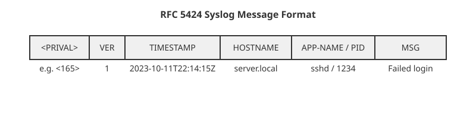

# Syslog: пріоритет, засоби (facility) і формат повідомлення

<preknowlist>
- Що таке системні журнали (логи) і навіщо вони потрібні.
- Базове розуміння процесів та демонів у Unix/Linux.
- Розуміння того, що таке мережевий протокол (на базовому рівні клієнт-сервер).
</preknowlist>

Syslog — це не просто ще один спосіб записати повідомлення у файл. Це стандарт де-факто для логування в Unix та Linux системах, який пережив кілька десятиліть еволюції. Його головна ідея: відокремити того, хто створює повідомлення, від того, хто вирішує, що з ним робити далі. Програма лише каже: «Ось сталася така подія, її створив такий-то компонент, і вона настільки-то важлива». А вже центральний демон логування (наприклад, `rsyslogd` чи `journald`) дивиться на власні правила і вирішує: записати це у файл `/var/log/messages`, відправити адміністратору на пошту, чи переслати по мережі на центральний сервер збору логів.

## Архітектура: як працює Syslog

В основі архітектури syslog лежить проста модель.
1. **Генератори повідомлень (Clients):** Це будь-яка програма, скрипт або ядро операційної системи. Коли стається якась подія (хтось зайшов по SSH, відмовив диск, програма впала з помилкою), генератор створює текстове повідомлення і відправляє його. У Linux це зазвичай робиться через спеціальний сокет, часто `/dev/log`.
2. **Маршрутизатор/колектор (Syslog Daemon):** Демон, який слухає сокет (або мережевий порт 514 UDP/TCP). Отримавши повідомлення, він аналізує його метадані (засіб і серйозність) і діє згідно з налаштуваннями конфігурації. Класичний демон — `syslogd`, сучасніші — `rsyslogd`, `syslog-ng`, або системний комбайн `systemd-journald`.
3. **Одержувачі (Destinations):** Кінцеві точки, куди демон направляє логи. Це можуть бути локальні файли (напр., `/var/log/auth.log`), консоль користувача, віддалений сервер або база даних.

Такий підхід дозволяє адміністраторам налаштовувати централізоване логування. Десятки серверів можуть відправляти свої логи на один виділений лог-сервер, що спрощує моніторинг, аудит безпеки та збереження історії навіть у разі падіння конкретного сервера.

## Анатомія повідомлення: Facility та Severity

Найважливіша частина syslog-повідомлення — це не сам текст, а його метадані. Кожне повідомлення супроводжується двома числами: **Facility** (засіб/джерело) та **Severity** (серйозність/важливість).

### Засіб (Facility)

Facility вказує на те, яка частина системи згенерувала повідомлення. Історично було виділено 24 категорії (коди від 0 до 23). Вони закладалися в епоху раннього Unix, тому деякі назви здаються сьогодні специфічними.

Основні Facility:
- `kern` (0): Повідомлення від ядра ОС. Програми рівня користувача не повинні використовувати цей засіб.
- `user` (1): Звичайні користувацькі програми (дефолтний засіб).
- `mail` (2): Поштові системи (sendmail, postfix).
- `daemon` (3): Системні демони без власних виділених категорій.
- `auth` (4) / `authpriv` (10): Повідомлення про авторизацію та безпеку (login, sshd, su). Окремі файли для них дозволяють обмежити доступ до чутливої інформації.
- `syslog` (5): Повідомлення від самого демона syslog.
- `lpr` (6): Підсистема друку.
- `cron` (9): Планувальник завдань.
- `local0` – `local7` (16–23): Зарезервовані для локального використання. Адміністратори часто призначають їх для власних застосунків чи мережевого обладнання (наприклад, комутаторів Cisco), щоб їхні логи можна було легко відфільтрувати в окремі файли.

### Серйозність (Severity)

Severity показує наскільки критичною є подія. Тут 8 рівнів, де 0 — найгірше, а 7 — найменш важливе:
- `emerg` (0): Система не працює (Panic). Повідомлення розсилається всім користувачам.
- `alert` (1): Потрібне негайне втручання (наприклад, пошкодження бази даних).
- `crit` (2): Критичні помилки (наприклад, відмова жорсткого диска).
- `err` (3): Звичайні помилки роботи програм.
- `warning` (4): Попередження. Щось пішло не так, але програма може продовжити роботу.
- `notice` (5): Нормальна, але важлива подія.
- `info` (6): Інформаційні повідомлення (статистика, успішні операції).
- `debug` (7): Повідомлення для налагодження, зазвичай містять багато деталей і генерують багато шуму. За замовчуванням часто відключені.

### Пріоритет (Priority)

Щоб передати Facility та Severity одним числом (наприклад, по мережі чи у файлі формату RFC 3164), їх комбінують у значення **Priority (PRIVAL)**. Формула проста:
`Priority = Facility * 8 + Severity`

Наприклад, повідомлення від `cron` (facility 9) з рівнем `info` (severity 6) матиме Priority:
`9 * 8 + 6 = 72 + 6 = 78`.

У сирому мережевому пакеті це число записується у кутових дужках на самому початку: `<78>`. Отримувач парсить це число: ділить на 8, щоб отримати Facility, і бере остачу від ділення на 8, щоб отримати Severity.

## Стандарти: RFC 3164 проти RFC 5424

Історично syslog розвивався без формального стандарту. Лише у 2001 році з'явився **RFC 3164** («The BSD syslog Protocol»). Він скоріше задокументував те, як воно працювало на практиці, аніж задав строгий стандарт. 

Формат RFC 3164:
`<PRIVAL>TIMESTAMP HOSTNAME TAG: MESSAGE`
- `PRIVAL`: Припустимо `<34>`.
- `TIMESTAMP`: Наприклад, `Oct 11 22:14:15` (без вказівки року та часового поясу, що викликало жахливі проблеми при аналізі старих логів!).
- `HOSTNAME`: Ім'я хоста.
- `TAG`: Зазвичай ім'я програми та іноді PID, напр. `sshd[12345]`.

Через слабку типізацію та проблеми з часом, у 2009 році прийняли новий стандарт — **RFC 5424**.
Він набагато строгіший, підтримує мілісекунди, часові пояси і структуровані дані.

Формат RFC 5424:
`<PRIVAL>VERSION TIMESTAMP HOSTNAME APP-NAME PROCID MSGID STRUCTURED-DATA MSG`
- `VERSION`: Зазвичай `1`.
- `TIMESTAMP`: ISO 8601 (напр. `2023-10-11T22:14:15.003Z`). Це вирішило всі проблеми з датами.
- `STRUCTURED-DATA`: Дозволяє передавати пари ключ-значення (наприклад, `[user@123 id="42" ip="10.0.0.1"]`), що дуже допомагає при автоматичному парсингу.

## Сучасність: /dev/log, rsyslogd та journald

У Linux класичним шляхом доставки повідомлення від програми до демона є Unix Domain Socket `/dev/log`. Програми пишуть у нього, а `rsyslogd` чи `syslogd` з нього читають.

З приходом `systemd`, управління логами взяв на себе `journald`. 
`journald` перехоплює `/dev/log`, збирає метадані з самої системи (хто запустив процес, які його cgroups, повний шлях) і зберігає це у власний бінарний формат. Однак, щоб не ламати сумісність із тими, хто звик до текстових файлів у `/var/log`, `journald` може працювати в парі з `rsyslogd`: він збирає логи і форвардить їх у класичний syslog-демон, який вже розкидає їх по текстових файлах згідно зі старими добрими правилами фільтрації (наприклад, у `/etc/rsyslog.conf`).

 Syslog залишається фундаментом спостережуваності (observability). Знання його категорій, пріоритетів та форматів необхідне будь-якому адміністратору чи інженеру, що працює з Unix-подібними системами.
