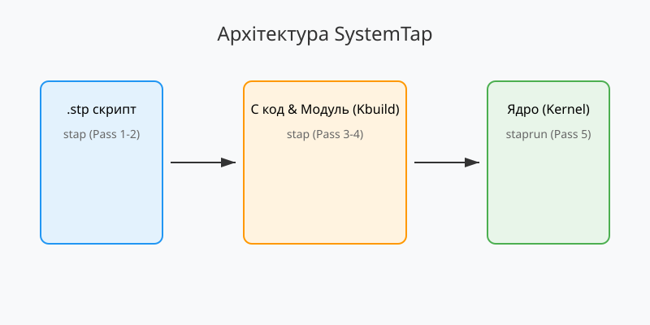

# Інструментарій SystemTap

<preknowlist>
- [Концепції ядра Linux](book:unix-linux/kernel-and-userspace) — базові поняття системних викликів та VFS.
</preknowlist>

SystemTap (або просто stap) — це потужний інструментарій для динамічного спостереження та трасування операційної системи Linux. Він дозволяє адміністраторам та розробникам глибоко аналізувати продуктивність системи, поведінку ядра та користувацьких програм без необхідності перекомпіляції або зміни їхнього вихідного коду.

## Архітектура та етапи роботи SystemTap

Робота SystemTap базується на трансляції високорівневих скриптів (зазвичай з розширенням `.stp`) у код мовою C, який потім компілюється як модуль ядра (kernel module). Після цього модуль завантажується в ядро, де він збирає інформацію через різні механізми (такі як Kprobes, Uprobes або Tracepoints) і передає її в простір користувача.

Цей процес складається з п'яти основних етапів (Pass 1 - Pass 5):

1. **Pass 1: Синтаксичний та семантичний аналіз**. SystemTap читає `.stp` скрипт і перевіряє його на наявність синтаксичних та семантичних помилок. На цьому етапі розгортаються всі "tapsets" — стандартні бібліотеки скриптів SystemTap, які розширюють базовий синтаксис.
2. **Pass 2: Аналіз типів та проб**. Транслятор перевіряє типи змінних та ідентифікує всі точки спостереження (probes), які вказані у скрипті. Якщо проба вказує на конкретну функцію ядра (наприклад, `kernel.function`), SystemTap використовує DWARF (зневаджувальну інформацію ядра) для визначення її точної адреси в пам'яті.
3. **Pass 3: Трансляція в C**. Скрипт транслюється в еквівалентний C-код, оптимізований для безпечного виконання в контексті ядра Linux.
4. **Pass 4: Компіляція модуля ядра**. Згенерований C-код компілюється в завантажувальний модуль ядра (файли з розширенням `.ko`) за допомогою стандартних інструментів збирання ядра (kbuild).
5. **Pass 5: Виконання**. Модуль завантажується в ядро утилітою `staprun`. Відбувається збір даних, і результати виводяться в термінал користувача. Після завершення роботи модуль безпечно вивантажується.



## Написання скриптів SystemTap

Синтаксис SystemTap нагадує мову C та AWK. Скрипт складається з подій (probes) та обробників (handlers). Обробники містять блок коду, який виконується під час спрацьовування певної події.

### Типи проб (Probes)

SystemTap пропонує багатий набір подій для спостереження, які можна поділити на кілька категорій:

- **Синхронні події ядра**: Спрацьовують при виклику певних функцій ядра або системних викликів.
  - `kernel.function("назва")`: Спрацьовує на початку вказаної функції ядра.
  - `kernel.function("назва").return`: Спрацьовує при поверненні з функції.
  - `syscall.open`: Спрацьовує при системному виклику `open`.
- **Асинхронні події (Таймери)**:
  - `timer.ms(100)`: Спрацьовує кожні 100 мілісекунд.
  - `timer.s(5)`: Спрацьовує кожні 5 секунд.
  - `timer.hz(100)`: Спрацьовує з частотою 100 Гц.
- **Спеціальні події**:
  - `begin`: Спрацьовує на початку виконання скрипта (після завантаження модуля).
  - `end`: Спрацьовує при завершенні скрипта.
  - `error`: Спрацьовує у разі виникнення помилки під час виконання.

### Приклад: Відстеження системного виклику

```systemtap
probe begin {
    printf("Початок відстеження syscall.open... Натисніть Ctrl-C для зупинки.\n")
}

probe syscall.open {
    printf("Процес %s (%d) відкрив файл %s\n", execname(), pid(), filename)
}

probe end {
    printf("\nВідстеження завершено.\n")
}
```

У цьому прикладі, проба `syscall.open` містить обробник, який використовує функції-утиліти SystemTap (tapsets):
- `execname()` — повертає назву поточного процесу.
- `pid()` — ідентифікатор поточного процесу.
- `filename` — аргумент системного виклику `open` (назва файлу).

## Безпека та Групи Користувачів

Оскільки скрипти SystemTap транслюються в модулі ядра та виконуються на найвищому рівні привілеїв (Ring 0), питання безпеки є критичним. Помилка в скрипті потенційно могла б призвести до падіння всієї системи (kernel panic). Для запобігання цьому SystemTap має суворі механізми захисту.

### Захист під час виконання
Обробники SystemTap не можуть використовувати безкінечні цикли. SystemTap автоматично обмежує кількість ітерацій циклів та час виконання обробника, щоб гарантувати, що він не заблокує ядро. Також заборонено виділення пам'яті всередині обробника та інші потенційно небезпечні операції.

### Групи `stapdev` та `stapusr`
Доступ до виконання SystemTap контролюється через групи користувачів:
- **`stapdev`**: Члени цієї групи мають повний доступ до використання інструменту `stap`. Вони можуть компілювати нові скрипти та завантажувати їх в ядро. Це еквівалентно правам адміністратора.
- **`stapusr`**: Члени цієї групи можуть лише виконувати (за допомогою `staprun`) попередньо скомпільовані модулі, які були підготовлені та підписані адміністраторами, або модулі, розміщені в спеціальній захищеній директорії (наприклад, `/lib/modules/.../systemtap`).

### Guru Mode
Якщо ви дійсно розумієте, що робите, і вам потрібно змінити дані ядра (а не просто читати їх), ви можете використати "Guru Mode" (прапорець `-g`). У цьому режимі вимикаються багато перевірок безпеки SystemTap, що дозволяє виконувати небезпечний C-код.

## Висновок

SystemTap — це незамінний інструмент для глибокого моніторингу та налагодження систем на базі Linux. Завдяки трансляції високорівневих скриптів у безпечні модулі ядра, адміністратори можуть отримувати детальну інформацію про роботу системи з мінімальним ризиком впливу на її стабільність. Використання груп `stapdev` і `stapusr` дозволяє гнучко керувати правами доступу, забезпечуючи безпечне середовище для розробки та розгортання скриптів моніторингу.
