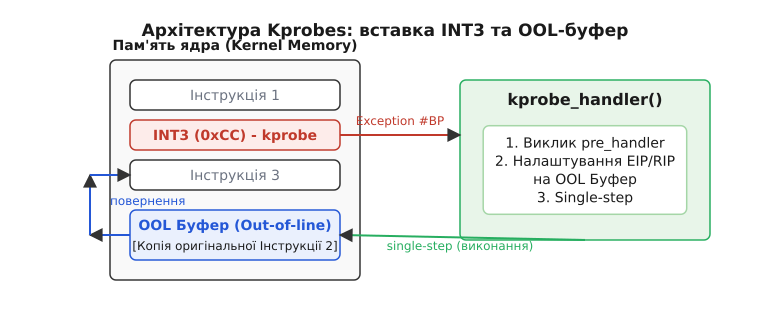
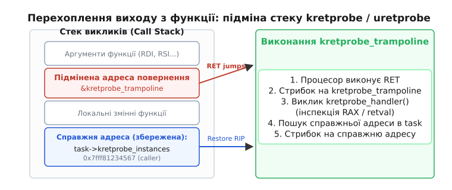
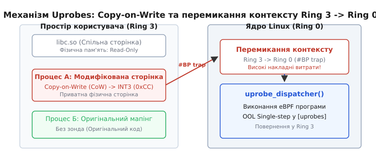

# Динамічне трасування: kprobes та uprobes

<preknowlist>
- [Концепції ядра Linux](topic:unix-linux/kernel-and-userspace) — поділ на ядро та простір користувача, системні виклики та режими виконання.
- [Пам'ять процесу](topic:unix-linux/virtual-address-space) — віртуальний адресний простір, мапінг ELF-файлів, спільні бібліотеки та сторінкова адресація.
</preknowlist>

На сервері під навантаженням 40 000 запитів на секунду база даних PostgreSQL раптово починає приховано затримувати транзакції на 200 мілісекунд раз на 5 хвилин. Спроба підключити gdb призупиняє всі робочі потоки і обвалює веб-сервіси, а перекомпіляція коду з додатковими викликами `fprintf` руйнує точний часовий розподіл подій і приховує проблему. Статичні точки трасування (tracepoints) у цьому місці відсутні, оскільки розробники ядра чи бази даних не передбачили потреби вимірювати саме цей внутрішній виклик. У таких умовах єдиним способом з'ясувати причину затримки без перезапуску та зупинки процесу є динамічна інструментація пам'яті — можливість у режимі реального часу модифікувати машинний код у пам'яті ядра чи процесу користувача.

У системі Linux основою цього підходу є два взаємодоповнюючі механізми: **kprobes** (Kernel Probes) для зондування коду ядра та **uprobes** (User Probes) для інструментації програм у просторі користувача. Вони дозволяють зчитувати стан регістрів процесора, вимірювати тривалість виконання та відстежувати аргументи будь-якої інструкції без зміни бінарних файлів на диску.

---

## 1. Апаратний фундамент: інструкція INT3 та виключення `#BP`

Секрет здатності зонда перехоплювати виконання коду в будь-якому довільному місці полягає у використанні низькорівневих можливостей процесора. Для архітектури x86_64 головним інструментом є однобайтова інструкція програмного переривання `INT3` (машинний код `0xCC`).

Проблема вставки зонда в працюючий машинний код полягає у структурі машинного коду архітектур зі змінною довжиною інструкцій (CISC). На архітектурі x86_64 інструкції можуть мати довжину від 1 до 15 байтів. Інструкція може складатися з необов'язкових префіксів розширення регістра (`REX` префікс `0x48`), префіксів зміни розміру операнда (`0x66`), префіксів векторних розширень (`VEX`/`EVEX`), основного опкоду, байта адресації `ModR/M`, байта масштабування `SIB` та декількох байтів безпосередніх операндів або зміщення адреси. Якщо ви намагаєтеся замінити інструкцію довжиною 5 байтів (наприклад, виклик функції `callq`) на інший багатобайтовий виклик, запис у пам'ять не буде атомарним із точки зору інших ядер процесора. Шина пам'яті записує дані блоками або словами, і якщо сусіднє ядро процесора виконує той самий код саме в момент запису, воно може зчитати перші два байти нового коду і останні три байти старого коду. Процесор спробує виконати цей гібридний «сміттєвий» машинний код, що негайно призведе до незворотного падіння процесу або всієї системи (kernel panic).

Однобайтова інструкція `0xCC` розв'язує цю фундаментальну проблему. Оскільки її розмір становить рівно один байт, запис `0xCC` у пам'ять виконується атомарно на будь-якому сучасному процесорі. Жодне ядро в багатопроцесорній (SMP) системі не може побачити «наполовину записаний» байт `0xCC`: інструкція або ще залишається оригінальною, або вже повністю замінена на `0xCC`.


*Архітектура Kprobes: виконання через інструкцію INT3, перехоплення обробником ядра та single-stepping з OOL-буфера.*

Перед модифікацією пам'яті ядро Linux запускає спеціалізований внутрішній декодер інструкцій (`kernel instruction decoder`). Цей декодер аналізує машинний код за вказаною адресою, щоб визначити точні межі першої інструкції та її тип. Перевірка необхідна для того, щоб переконатися, що зонд встановлюється саме на початок інструкції, а не на її другий чи третій байт. Якщо встановити зонд у середину багатобайтової інструкції, процесор під час нормального виконання натрапить на `0xCC` як на випадковий операнд іншої інструкції, що спричинить фатальне пошкодження коду.

Для атомарного безпечного запису в захищені від запису сторінки пам'яті ядра використовується алгоритм `text_poke_bp()`. Цей алгоритм модифікує код у три етапи:
1. Запис інструкції `0xCC` на початок модифікованої ділянки коду.
2. Синхронізація виконання між усіма ядрами процесора за допомогою апаратних міжпроцесорних переривань (IPI) та скидання конвеєра інструкцій (`text_poke_sync()`).
3. Перезапис решти байтів інструкції та підсумкове усунення `0xCC` на користь оптимізованого виклику.

Коли операційна система встановила зонд на обрану віртуальну адресу, відбувається послідовний ланцюг подій:

1. **Ідентифікація та копіювання:** Ядро декодує довжину оригінальної інструкції за вказаною адресою і копіює її байти у спеціально виділений безпечний буфер (Out-Of-Line buffer, OOL).
2. **Атомарне заміщення:** Ядро замінює перший байт оригінальної інструкції в робочому коді на байт `0xCC`.
3. **Генерація виключення `#BP`:** Коли потік виконання процесора доходить до цієї адреси, процесор декодує `0xCC` і безумовно генерує апаратне виключення Breakpoint Exception (`#BP`, вектор переривання 3 у таблиці IDT).
4. **Збереження контексту:** Процесор призупиняє нормальний потік інструкцій, перемикає стек і зберігає повний стан усіх регістрів (`RIP`, `RSP`, `RDI`, `RSI`, `RAX`, `RBP`, `R8`–`R15`) у структурі `struct pt_regs`.
5. **Виклик обробника:** Керування передається в обробник ядра `do_int3()`. Ядро за адресою `RIP - 1` знаходить відповідну структуру зонду у своїй хеш-таблиці та викликає функцію-обробник (pre-handler).

Обробник отримує повну структуру `pt_regs`. Оскільки на x86_64 перші шість аргументів функції за стандартом System V AMD64 ABI передаються через регістри `RDI`, `RSI`, `RDX`, `RCX`, `R8`, `R9`, зонд отримує можливість зчитати точні значення вхідних параметрів. Наприклад, якщо зонд встановлено на вхід у функцію відкриття файлів `do_sys_openat2`, регістр `RSI` міститиме вказівник на рядок імені файла у віртуальній пам'яті. Обробник зонда може безпечно прочитати цей рядок і зафіксувати його у журналі спостереження.

---

## 2. Проблема продовження виконання: In-Line vs Out-Of-Line Single-Stepping

Після того, як обробник зонда прочитав потрібні регістри та виміряв необхідні параметри, програма повинна продовжити свою роботу так, ніби нічого не сталося. Однак виникає складне питання: як виконати саму оригінальну інструкцію, чий перший байт ми щойно затерли байтом `0xCC`?

Історично в перших версіях kprobes застосовувався підхід **In-Line single-stepping**:

1. Ядро тимчасово видаляло байт `0xCC` і відновлювало оригінальний машинний байт у пам'яті коду.
2. У регістрі прапорців процесора `EFLAGS` встановлювався апаратний прапорець Trap Flag (`TF = 1`).
3. Ядро повертало керування процесору. Прапорець `TF` змушував процесор виконати рівно одну інструкцію і негайно згенерувати інше апаратне виключення — Debug Exception (`#DB`).
4. Перехопивши виключення `#DB`, ядро знову записувало `0xCC` на оригінальне місце і скидало прапорець `TF`.

У багатопотокових середовищах на багатоядерних серверах цей підхід мав катастрофічну ваду. У те коротке вікно часу, коли байт `0xCC` було тимчасово вилучено з пам'яті для виконання інструкції першим потоком, інший потік виконання на сусідньому ядрі міг проскочити це місце в коді і взагалі не викликати зонд. Щоб запобігти такій гонці даних (data race), ядру доводилося тимчасово призупиняти виконання всіх інших ядер процесора (викликом спеціального механізму `stop_machine`). Це створювало величезні затримки і робило інструментацію небезпечною для серверів під високим навантаженням.

Сучасні версії kprobes та uprobes використовують безпечний та швидкий підхід **Out-Of-Line (OOL) single-stepping**:

1. При встановленні зонда оригінальна інструкція копіюється в окремий спеціальний буфер OOL (у пам'яті ядра для kprobes або на прихованій сторінці віртуальної пам'яті процесу для uprobes). Для керування цими буферами ядро виділяє сторінки з правами виконання (`PAGE_KERNEL_EXEC`).
2. Особливу складність становлять інструкції, які використовують відносну адресацію щодо поточного значення лічильника інструкцій (наприклад, `mov 0x20(%rip), %rax` або відносний умовний стрибок `je offset`). Оскільки така інструкція виконуватиметься з OOL-буфера, розташованого за іншою віртуальною адресою, пряме виконання призведе до звернення за неправильною адресою. Тому під час формування OOL-буфера ядро проводить релокацію операндів: воно перераховує відносне зміщення у машинному коді так, щоб операнд вказував на той самий об'єкт у пам'яті, що й оригінальна інструкція. Після оригінальної інструкції в буфер додається інструкція безумовного стрибка `JMP` назад у робочий код.
3. Коли спрацьовує переривання `INT3` і обробник завершує свою роботу, ядро модифікує значення лічильника інструкцій `RIP` у збереженій структурі `pt_regs`. Замість оригінальної адреси ядро вказує `RIP` на OOL-буфер.
4. Процесор відновлює стан з `pt_regs` і виконує оригінальну інструкцію безпосередньо з OOL-буфера.
5. Після виконання інструкції з буфера процесор виконує стрибок `JMP` і повертається в основний код на інструкцію, що йде одразу після зонда (`RIP_original + len`).

Оскільки байт `0xCC` ніколи не видаляється з оригінальної адреси в пам'яті, зонд залишається постійно активним для всіх ядер процесора без використання важких блокувань `stop_machine`.

Деталі еволюції цих механізмів від DTrace до сучасних систем висвітлює [історичний нарис динамічного трасування](topic:unix-linux/uprobes-and-kprobes/hist-dynamic-tracing.md).

---

## 3. Анатомія Kprobes: зондування підсисистем ядра

Механізм **kprobes** діє у привілейованому просторі ядра (Ring 0) і дозволяє встановлювати зонди практично на будь-яку інструкцію ядра Linux або завантаженого модуля.

Для розробника доступні два основні типи зондів ядра:

1. **Kprobe (entry probe):** Зонд, що встановлюється на довільну адресу або на початок функції ядра. Зазвичай використовується для перехоплення аргументів системних викликів або внутрішніх функцій (наприклад, `do_sys_openat2`).
2. **Kretprobe (return probe):** Зонд, що спрацьовує в момент *повернення* з функції ядра. Використовується для аналізу кодів помилок, результатів виконання або для обчислення тривалості роботи функції.

### Чорний список зондування (Blacklisting та NOKPROBE_SYMBOL)

Попри високу гнучкість, ядро Linux забороняє встановлювати kprobes на певні фундаментальні підсистеми. Якщо встановити зонд на код самого обробника переривань `do_int3()`, обробника сторінкових збоїв `do_page_fault()` або критичного коду перемикання контексту процесів `schedule()`, виникне нескінченна рекурсія. Виконання зонду спричинить нове переривання `INT3`, яке знову викличе зонд, що моментально призведе до переповнення стека ядра і падіння системи.

Щоб запобігти цьому, ядро підтримує суворий чорний список функцій. У сирцевому коді ядра критичні функції позначаються макросом `NOKPROBE_SYMBOL(function_name)`. Під час спроби зареєструвати зонд функція `register_kprobe()` перевіряє адресу за цільовим списком та списком `/sys/kernel/debug/kprobes/blacklist`. Якщо адреса належить до забороненої зони, реєстрація відхиляється з кодом помилки `-EILSEQ`.

### Інтеграція з підсистемою Ftrace (Kprobes-on-Ftrace)

Для функцій ядра, які компілюються з підтримкою трасування (з макросом `-mfentry`), ядро пропонує високооптимізований варіант зондування — **kprobes-on-ftrace**. 

Замість вставки байта `0xCC` ядро використовує вже вбудований у початок функції 5-байтовий NOP (або виклик `call __fentry__`). При реєстрації зонда `ftrace` замінює NOP на прямий виклик обробника `kprobe_ftrace_handler()`. Це дозволяє уникнути генерації важких апаратних виключень `#BP`, зберігаючи швидкість виконання майже на рівні статичних tracepoints.

### Механіка Kretprobe: динамічна підміна стека

Перехопити вихід з функції складніше, ніж вхід. Функція ядра може мати десятки інструкцій `RET` у різних відгалуженнях коду або завершуватися оптимізованим хвостовим викликом (tail call). Встановлення окремих kprobes на кожну інструкцію `RET` є неефективним та крихким підходом, адже компілятор під час оптимізації коду може переставляти інструкції повернення або об'єднувати їх.

Kretprobe вирішує цю проблему шляхом динамічного перехоплення адреси повернення на стеку викликів:


*Механізм kretprobe та uretprobe: динамічна підміна адреси повернення на стеку викликів адресою функцій-трампліна.*

1. При реєстрації kretprobe ядро насправді ставить звичайний kprobe на вхідну інструкцію цільової функції.
2. Коли викликається цільова функція, спрацьовує вхідний зонд. Внутрішній обробник kretprobe зчитує з вершини стека **справжню адресу повернення** (return address), куди має повернутися процесор після виконання інструкції `RET`.
3. Справжня адреса повернення зберігається у внутрішній структурі пам'яті поточного завдання (`current->kretprobe_instances`). Якщо функція викликається рекурсивно або з кількох паралельних потоків, ядро підтримує стек таких примірників для кожного потоку окремо.
4. На самому стеку адреса повернення **переписується адресою ядра `kretprobe_trampoline`**.
5. Коли функція завершує роботу і виконує інструкцію `RET`, процесор витягує зі стека підмінену адресу і стрибає на `kretprobe_trampoline`.
6. Трамплін запускає користувацький обробник виходу (exit handler), який зчитує результат з регістра `RAX`, після чого знаходить у списку завдання справжню адресу повернення і відновлює керування.

Повний перелік структур даних ядра `struct kprobe` та `struct kretprobe` деталізовано у [довіднику інтерфейсів kprobes та uprobes](topic:unix-linux/uprobes-and-kprobes/api-kprobes-uprobes.md).

---

## 4. Uprobes: інструментація простору користувача (Ring 3)

Механізм **uprobes** поширює принцип динамічної інструментації на програми простору користувача. Він дозволяє зондувати функції в об'єктних ELF-файлах, виконуваних бінарниках (`/bin/bash`, `/usr/sbin/mysqld`) та спільних бібліотеках (`libc.so.6`, `libcrypto.so`).

### Специфіка віртуальної пам'яті та Copy-on-Write

На відміну від ядра, де адреси є глобальними для всієї системи, процеси користувача ізольовані у власних віртуальних адресних просторах. Крім того, спільні бібліотеки мапляться в пам'ять багатьох процесів у режимі Read-Only.

Встановлення uprobe виконується за такими етапами:


*Механізм Uprobes: створення приватної сторінки пам'яті через Copy-on-Write та апаратне перемикання контексту з Ring 3 у Ring 0.*

1. Розробник вказує шлях до файла на диску (наприклад, `/lib/x86_64-linux-gnu/libc.so.6`) та байтове зміщення (offset) інструкції від початку файла.
2. Ядро знаходить фізичну сторінку пам'яті, що відповідає цьому зміщенню у файловому кеші (page cache).
3. Оскільки сторінки коду спільних бібліотек захищені від запису і використовуються багатьма процесами одночасно, ядро ініціює механізм **Copy-on-Write (CoW)** — створюється дублікат сторінки пам'яті.
4. У скопійовану приватну сторінку ядро записує інструкцію `INT3` (`0xCC`).
5. Таблиці сторінок (page tables) для цільових процесів оновлюються так, щоб вони вказували на нову приватну сторінку з `0xCC`.

### Перемикання контексту Ring 3 -> Ring 0

Коли програма користувача виконує байт `0xCC`, процесор генерує виключення `#BP`. Оскільки обробники переривань живуть у ядрі, відбувається обов'язкове **апаратне перемикання контексту (context switch)** з режиму користувача (Ring 3) у режим ядра (Ring 0).

Апаратне перемикання контексту вимагає збереження користувацького стану регістрів у структурі `pt_regs`, перемикання стека на стек ядра поточного процесу, інвалідації буферів інструкцій та виконання процедури зчитування події. Після виконання eBPF-програми або обробника ядро проводить OOL single-stepping у спеціальній віртуальній сторінці `[uprobes]`, виділеній в адресному просторі процесу, і виконує зворотний перехід Ring 0 -> Ring 3 за допомогою інструкції `IRETQ` або `SYSRET`.

Обробка сигналів простору користувача (наприклад, `SIGINT` або `SIGSEGV`) під час перебування потоку всередині OOL-буфера uprobe вимагає від ядра додаткових запобіжних заходів. Якщо під час single-stepping надходить сигнал, ядро скасовує покрокове виконання, відновлює значення `RIP` на початок зонда і передає обробку сигналу, після чого зонд спрацьовує повторно.

Через таке подвійне перемикання режимів виконання один виклик uprobe коштує від 1500 до 3000 тактів процесора (приблизно 0.5–1.5 мікросекунди). Для порівняння, звичайний виклик порожньої функції в C займе лише 1–2 такти (менше 1 наносекунди). Це робить uprobes у сотні разів дорожчими за статичні виклики функцій і вимагає виваженого вибору точок інструментації.

---

## 5. Накладні витрати та оптимізації: Optprobes, fprobe та Branch Predictor

Масове застосування зондів на гарячих шляхах виконання (hot paths) вимагає розуміння накладних витрат системи.

### Оптимізація Optprobes (JMP замість INT3)

Щоб позбутися повільного переривання `#BP`, у ядрі було створено механізм **Optprobes**.

Замість вставки однобайтового `0xCC` Optprobe намагається замінити перші 5 байтів оригінального коду на інструкцію відносного безумовного переходу `JMP` (relative jump 32-bit).

Процес оптимізації виконується фоновим потоком ядра `kprobe-optimizer`:

1. Ядро аналізує машинний код навколо адреси зонду за допомогою дисасемблера ядра.
2. Перевіряється, чи не розрізає 5-байтовий `JMP` сусідні інструкції, і чи немає інших інструкцій `JMP`/`CALL`, які передають керування всередину цього 5-байтового блоку.
3. Якщо перевірка успішна, ядро замінює інструкції на `JMP`, що вказує на спеціальний буфер обходу (detour buffer).

Оптимізований зонд Optprobe виконується без генерації виключень `#BP`, що зменшує накладні витрати з 300 тактів до 30–50 тактів процесора (у 5–10 разів швидше за класичний зонд).

### Руйнування передбачувача розгалужень (Branch Misprediction у Uretprobes)

Застосування `uretprobes` несе в собі прихований апаратний штраф. Усі сучасні процесори x86 мають апаратний буфер передбачення повернень — **Return Stack Buffer (RSB)**. RSB відстежує виклики `CALL` і передбачає адреси повернення для спекулятивного виконання інструкцій після `RET`.

Коли `uretprobe` підмінює адресу повернення на стеку адресою трампліна, обіцянка, дана RSB, порушується. При виконанні `RET` процесор отримує 100% **branch misprediction**. Весь конвеєр спекулятивного виконання (pipeline) скидається, що додає від 40 до 100 тактів штрафу на кожен вихід з функції.

Такий апаратний штраф означає, що встановлення `uretprobe` на дрібну функцію, яка викликається мільйони разів на секунду у циклі (наприклад, функція порівняння рядків чи виділення пам'яті `malloc`), може сповільнити виконання цільової програми у кілька разів. Інженери спостережуваності повинні ураховувати це і надавати перевагу статичним точкам трасування або вибірковому інструментуванню конкретних процесів за їхнім PID.

---

## 6. Синергія з eBPF: безпечне виконання у ядрі

Використання kprobes та uprobes у сучасному Linux нерозривно пов'язане з віртуальною машиною **eBPF (Extended Berkeley Packet Filter)**.

Самі по собі зонди лише сповіщають про факт досягнення інструкції. Раніше для обробки цих подій потрібно було писати власні модулі ядра, що створювало ризик Kernel Panic при будь-якій помилці у вказівниках. Крім того, якщо передавати кожну подію спрацьовування зонду з ядра у простір користувача через кільцевий буфер для аналізу, система моментально захлинеться у потоці перемикань контексту.

eBPF розв'язує обидві ці проблеми завдяки безпеці та локальності виконання:

1. **Безпека:** Верифікатор ядра (eBPF verifier) до завантаження перевіряє байткод на відсутність нескінченних циклів, виходів за межі масивів та некоректних дереференсів. Якщо програма містить потенційно небезпечну операцію з пам'яттю, ядро відхиляє її завантаження.
2. **Агрегація на місці:** eBPF-програма виконується у контексті ядра при спрацюванні зонду. Вона не передає сирі дані у простір користувача, а накопичує статистику у BPF-картах (BPF maps, ring buffer). Наприклад, eBPF-програма може вирахувати різницю часу між входом і виходом з функції та оновити логарифмічну гістограму прямо в пам'яті ядра. Програма простору користувача зчитуватиме вже готову сформовану гістограму раз на секунду, зменшуючи потік даних у тисячі разів.

Приклад використання інструментів `bpftrace` та `libbpf` на C і C++ для відстеження системних викликів та функцій користувача:

:::tabs
```bash
# bpftrace - Однорядковий скрипт динамічного трасування

# 1. Kprobe: перехоплення входу у функцію ядра do_sys_openat2
bpftrace -e 'kprobe:do_sys_openat2 { printf("PID %d (%s) відкриває: %s\n", pid, comm, str(arg1)); }'

# 2. Uprobe: перехоплення виклику readline у бінарнику /bin/bash
bpftrace -e 'uprobe:/bin/bash:readline { printf("Bash (PID %d) очікує ввід\n", pid); }'

# 3. Uretprobe: перехоплення результату повернення з readline (команда користувача)
bpftrace -e 'uretprobe:/bin/bash:readline { printf("Введено команду: %s\n", str(retval)); }'
```
```c
// bpf_tracer.c - Програма BPF на мові C (libbpf)
#include "vmlinux.h"
#include <bpf/bpf_helpers.h>
#include <bpf/bpf_tracing.h>

SEC("kprobe/do_sys_openat2")
int BPF_KPROBE(trace_openat2, int dfd, const char *filename) {
    char buf[256];
    bpf_probe_read_user_str(buf, sizeof(buf), filename);
    bpf_printk("Kprobe openat2: %s\n", buf);
    return 0;
}

SEC("uprobe/bash_readline")
int BPF_UPROBE(trace_readline) {
    bpf_printk("Uprobe readline entered\n");
    return 0;
}

SEC("uretprobe/bash_readline")
int BPF_URETPROBE(trace_readline_ret, const char *ret_str) {
    char buf[256];
    bpf_probe_read_user_str(buf, sizeof(buf), ret_str);
    bpf_printk("Uretprobe readline result: %s\n", buf);
    return 0;
}

char _license[] SEC("license") = "GPL";
```
```cpp
// user_loader.cpp - Завантажувач спостереження на C++ (libbpf)
#include <iostream>
#include <memory>
#include <string_view>
#include <bpf/libbpf.h>

// RAII обгортка для BPF об'єкта
struct BpfObjectDeleter {
    void operator()(bpf_object* obj) const {
        if (obj) bpf_object__close(obj);
    }
};
using UniqueBpfObject = std::unique_ptr<bpf_object, BpfObjectDeleter>;

int main() {
    std::cout << "Завантаження BPF програми трасування на C++...\n";
    // Відкриття та завантаження BPF-об'єкта
    UniqueBpfObject obj{bpf_object__open_file("bpf_tracer.bpf.o", nullptr)};
    if (!obj || bpf_object__load(obj.get())) {
        std::cerr << "Помилка завантаження BPF-об'єкта\n";
        return 1;
    }
    std::cout << "BPF-програму успішно завантажено та прикріплено до зондів kprobes/uprobes.\n";
    return 0;
}
```
:::

Практичну реалізацію утиліти вимірювання затримок коду розведено у [практичний проект відстеження затримки функцій](topic:unix-linux/uprobes-and-kprobes/proj-uprobe-latency-tracker.md).

---

## 7. Порівняння механізмів спостережуваності

| Механізм | Сфера застосування | Метод інструментації | Накладні витрати | Ризик стабільності |
| :--- | :--- | :--- | :--- | :--- |
| **Kprobe** | Код ядра Linux (Ring 0) | `INT3` або `JMP` (Optprobe) | Низькі (~100–300 тактів) | Нульовий із eBPF |
| **Kretprobe** | Вихід з функцій ядра | Підміна адреси на стеку | Середні (~300–600 тактів) | Нульовий із eBPF |
| **Uprobe** | Бінарники користувача (Ring 3) | CoW сторінки + `INT3` | Високі (~1500–3000 тактів) | Нульовий із eBPF |
| **Uretprobe** | Вихід з функцій Ring 3 | Підміна користувацького стека | Дуже високі (+RSB mispredict) | Обережність на гарячих шляхах |
| **Tracepoint** | Статичні точки в ядрі | Заранее вшитий NOP / `CALL` | Мінімальні (~20–50 тактів) | Абсолютно безпечний |
| **Fprobe** | Масові функції ядра | `-mfentry` nops у ftrace | Дуже низькі (~50–100 тактів) | Нульовий із eBPF |

Завдяки поєднанню низькорівневих kprobes та uprobes із високорівневою віртуальною машиною eBPF, операційна система Linux отримує повну прозорість виконання. Інженери мають змогу локалізувати найскладніші джерела затримок у реальному часі без перезапусків та модифікації двійкових файлів.
