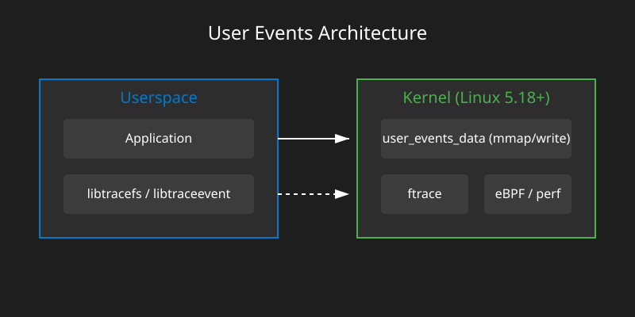

# Користувацькі події у ftrace: User Events підсистема

<preknowlist>
- [Концепції ядра Linux](book:unix-linux/kernel-and-userspace) — базові поняття системних викликів та VFS.
</preknowlist>

**Підсистема User Events**, що була інтегрована в ядро Linux починаючи з версії 5.18, є надзвичайно потужним механізмом для експорту користувацьких подій (userspace events) безпосередньо у внутрішні підсистеми трасування ядра, такі як ftrace, perf та eBPF. 

У цій статті ми детально розглянемо історію появи цього механізму, його архітектуру, принципи роботи, взаємодію на рівні ABI (через `/sys/kernel/tracing/user_events_data`), а також напишемо код на C для створення, керування та надсилання подій.

## 1. Історія та мотивація створення User Events

Історично склалося так, що ядро Linux має багатий набір інструментів для трасування власних внутрішніх подій. Завдяки ftrace, kprobes та tracepoints адміністратори та розробники можуть бачити кожен крок, що відбувається в ядрі. Проте, коли справа доходить до користувацького простору (userspace), ситуація ставала складнішою.

Раніше для трасування застосунків використовувалися кілька підходів:

1. **Uprobes та USDT (User Statically-Defined Tracing):** Це механізм, який дозволяє ставити точки зупинки (breakpoints, наприклад, інструкцію `int 3` на x86) безпосередньо в код користувацького процесу. Коли процес досягає цієї точки, виникає переривання, ядро перехоплює його, виконує обробник (наприклад, eBPF-програму) і повертає керування. 
   - *Проблема:* Високий overhead на перемикання контексту (context switch) між userspace та kernel space для кожного спрацьовування uprobe.
2. **LTTng (Linux Trace Toolkit Next Generation):** Потужний позаядерний трасувальник, який використовує власні кільцеві буфери (ring buffers) та механізми.
   - *Проблема:* Потребує встановлення сторонніх модулів ядра (out-of-tree) або даємонів у userspace, що не завжди прийнятно в production-середовищах з суворими політиками безпеки (наприклад, Android або Cloud Native платформи).
3. **Запис у `trace_marker`:** ftrace давно мав файл `/sys/kernel/tracing/trace_marker`, куди застосунок міг просто писати рядки тексту.
   - *Проблема:* Усі події надходили як неструктурований текст. Їх було важко фільтрувати, парсити, і вони мали високий overhead через форматування рядків (string formatting). Крім того, це був дуже повільний механізм.

### Мотивація від розробників (Microsoft, Google, та інші)

Розробники потребували механізму, який:
- Забезпечував би **нульовий overhead** (zero overhead), коли подія не трасується (disabled).
- Дозволяв би передавати **бінарні, структуровані дані** у ftrace/perf/eBPF.
- Не потребував би переривань (як uprobes).
- Дозволяв би фільтрувати події in-kernel за допомогою існуючих механізмів (наприклад, ftrace filters).

Так і народилася ідея підсистеми **User Events**.

## 2. Архітектура підсистеми User Events

Архітектурно User Events базується на взаємодії між користувацьким застосунком і ядром через віртуальну файлову систему tracefs, зазвичай змонтовану в `/sys/kernel/tracing/`.



### Головні компоненти

1. **Файл `user_events_data`**: Це основний інтерфейс ядра. Через нього застосунки реєструють свої події за допомогою ioctl, перевіряють статус подій (через mmap), та записують самі дані подій (через системний виклик `writev` або `write`).
2. **Файл `user_events_status`**: Використовується для legacy механізмів або додаткового моніторингу статусу, але основний швидкий шлях — це мапінг `user_events_data`.
3. **Tracefs директорія `events/user_events`**: Тут з'являються події після їх реєстрації. Вони виглядають і поводяться абсолютно так само, як звичайні tracepoints ядра. Їх можна вмикати (`enable`), вимикати, налаштовувати фільтри (`filter`), і підключати до них eBPF-програми.

### Ключові особливості

- **Нульовий Overhead через `mmap`**: Замість того, щоб щоразу робити системний виклик для перевірки, чи увімкнена подія (enabled/disabled), ядро дозволяє застосунку "спроектувати" (mmap) сторінку пам'яті, де зберігається статус події. Застосунок просто читає байт з пам'яті (однією процесорною інструкцією). Якщо подія вимкнена, код застосунку пропускає етап форматування даних і переходить до наступних інструкцій.
- **Підтримка Payload**: Застосунок може визначати структуру даних події (наприклад, "число u32, рядок, масив байтів"). Ядро використовує цю схему для того, щоб парсити сирі бінарні дані, надіслані застосунком.

## 3. ABI та Реєстрація Подій (Event Registration)

Щоб ядро знало про подію, застосунок має її спочатку зареєструвати.

Реєстрація відбувається через `ioctl` виклик `DIAG_IOCSREG` до відкритого файлового дескриптора `/sys/kernel/tracing/user_events_data`.

### Формат опису події

Подія описується рядком формату, дуже схожим на той, що використовується в ftrace.
Приклад рядка опису:

`"my_app_event u32 count; char message[64]"`

Цей рядок каже ядру створити подію з назвою `my_app_event`, яка приймає два поля: 32-бітне беззнакове ціле число `count` та рядок фіксованої довжини `message`.

Ядро також підтримує динамічні типи, такі як:
- `__data_loc char[] name`: рядок змінної довжини (динамічний рядок).
- `__data_loc u8[] data`: масив сирих байтів змінної довжини.

Додатково можна вказувати прапорці для події, хоча в перших версіях API вони зазвичай дорівнюють нулю.

### Структура `user_reg`

Для реєстрації використовується структура, визначена в `<linux/user_events.h>` (якщо ви маєте останні заголовки ядра):

```c
struct user_reg {
    /* Розмір структури (для версійності) */
    __u32 size;
    /* Увімкнений статус (out): ядро встановлює тут індекс байта у mmap */
    __u8 enable_bit;
    __u8 enable_size;
    __u16 flags;
    /* Рядок з описом події */
    __u64 name_args;
    /* Індекс (ID) зареєстрованої події, який ми маємо вказати при mmap */
    __u32 status_index;
    __u32 write_index;
};
```

Коли ви викликаєте `ioctl` із цією структурою, ядро повертає `status_index` та `write_index`. 
- `status_index` використовується для визначення байта у mmap-файлі, який показує, чи увімкнена подія.
- `write_index` має додаватися до початку буфера (або масиву iovec), коли ми відправляємо події в ядро через `writev`. Ядро потребує цього індексу, щоб зрозуміти, яка саме подія була надіслана.

## 4. Перевірка статусу з нульовим оверхедом (Zero-Overhead mmap)

Після успішної реєстрації ми отримуємо `status_index`. Щоб перевіряти статус події швидко (без системних викликів), ми робимо `mmap` файлу `user_events_data` (відкритого лише на читання).

Ядро повертає вказівник на сторінку пам'яті (або кілька сторінок). Кожен байт (або біт) у цій сторінці відповідає статусу однієї події. За допомогою `status_index` ми можемо обчислити точну адресу байта, що нас цікавить.

Коли хтось у ядрі (наприклад, адміністратор через команду `echo 1 > /sys/kernel/tracing/events/user_events/my_app_event/enable`) вмикає подію, ядро автоматично та миттєво змінює відповідний байт у цій спільній пам'яті. 

Наш користувацький код може виглядати так:

```c
if (*(mmap_ptr + status_index) != 0) {
    // Подію увімкнено! Формуємо дані і викликаємо writev.
}
```

Якщо подія вимкнена, ця перевірка займає лише 1-2 такти процесора (зчитування з кешу L1). Це і є обіцяний "Zero Overhead".

## 5. Запис подій у ядро (Event Generation)

Якщо подія увімкнена, ми маємо передати її дані в ядро.
Цей процес виконується системним викликом `writev` (рекомендовано) або `write` у файл `user_events_data`.

Формат даних, які ми надсилаємо:
1. Спочатку йде **4 байти** — це `write_index`, який ми отримали під час реєстрації. Ядро повинно знати ідентифікатор події, для якої прийшли дані.
2. Далі йде **бінарний payload**, що точно відповідає формату, який ми задали при реєстрації.

Використання `writev` зручніше, оскільки ми можемо надати один вектор для `write_index`, а інший — для самих даних, уникаючи додаткового копіювання пам'яті у userspace.

Наприклад, якщо наша подія `u32 count; char message[64]`:
```c
struct my_event_data {
    uint32_t count;
    char message[64];
};
```
Ми заповнюємо структуру, формуємо `iovec` і викликаємо `writev(fd, iov, 2)`.

Важливо: ядро не виконує глибоку перевірку безпеки даних (окрім стандартних перевірок пам'яті), оскільки це бінарний потік. Відповідальність за правильний формат лежить на застосунку. Проте, некоректні дані не зламають ядро; вони просто будуть неправильно відображатися у ftrace.

## 6. Повний практичний приклад (C)

Давайте зберемо всі ці концепції у функціональний C-код.

```c
#include <stdio.h>
#include <stdlib.h>
#include <string.h>
#include <fcntl.h>
#include <unistd.h>
#include <sys/ioctl.h>
#include <sys/mman.h>
#include <sys/uio.h>
#include <stdint.h>

/* Оголошення зі свіжих заголовків ядра */
#ifndef DIAG_IOCSREG
#define DIAG_IOC_MAGIC 0x82
#define DIAG_IOCSREG _IOWR(DIAG_IOC_MAGIC, 0, struct user_reg)
#endif

struct user_reg {
    uint32_t size;
    uint8_t enable_bit;
    uint8_t enable_size;
    uint16_t flags;
    uint64_t name_args;
    uint32_t status_index;
    uint32_t write_index;
};

int main() {
    int fd;
    struct user_reg reg = {0};
    char *event_desc = "my_app_event u32 count; char message[64]";
    char *status_page;

    /* 1. Відкриваємо файл */
    fd = open("/sys/kernel/tracing/user_events_data", O_RDWR);
    if (fd < 0) {
        perror("open user_events_data");
        return 1;
    }

    /* 2. Реєструємо подію */
    reg.size = sizeof(reg);
    reg.name_args = (uint64_t)event_desc;

    if (ioctl(fd, DIAG_IOCSREG, &reg) < 0) {
        perror("ioctl DIAG_IOCSREG");
        close(fd);
        return 1;
    }

    printf("Event registered! write_index=%u, status_index=%u\n", 
           reg.write_index, reg.status_index);

    /* 3. Mmap для перевірки статусу */
    int page_size = getpagesize();
    status_page = mmap(NULL, page_size, PROT_READ, MAP_SHARED, fd, 0);
    if (status_page == MAP_FAILED) {
        perror("mmap");
        close(fd);
        return 1;
    }

    /* Структура нашого payload'у */
    struct {
        uint32_t count;
        char message[64];
    } payload;

    uint32_t counter = 0;

    /* 4. Головний цикл генерації подій */
    while (1) {
        /* Перевірка статусу (Zero Overhead) */
        if (status_page[reg.status_index] != 0) {
            /* Подію увімкнено! */
            payload.count = counter++;
            strncpy(payload.message, "Hello from User Events", 64);

            struct iovec iov[2];
            /* Перший елемент - це write_index (4 байти) */
            iov[0].iov_base = &reg.write_index;
            iov[0].iov_len = sizeof(reg.write_index);
            
            /* Другий елемент - наш payload */
            iov[1].iov_base = &payload;
            iov[1].iov_len = sizeof(payload);

            /* Записуємо в ядро */
            if (writev(fd, iov, 2) < 0) {
                perror("writev");
            } else {
                printf("Event sent: count=%u\n", payload.count);
            }
        }
        
        sleep(1);
    }

    close(fd);
    return 0;
}
```

### Як тестувати цей код:

1. Скомпілюйте програму: `gcc user_event_test.c -o user_event_test`
2. Запустіть її з правами root (або налаштуйте права доступу на `tracefs`). Вона буде "мовчати", оскільки подія вимкнена за замовчуванням.
3. В іншому терміналі перевірте, що подія з'явилася в ядрі:
   `ls /sys/kernel/tracing/events/user_events/my_app_event`
4. Увімкніть подію:
   `echo 1 > /sys/kernel/tracing/events/user_events/my_app_event/enable`
5. У вікні вашої програми ви побачите `Event sent: count=...`.
6. Перевірте файл `/sys/kernel/tracing/trace` — ви побачите події вашого застосунку, які відформатовані ядром.

## 7. Взаємодія з eBPF та perf

Оскільки подія зареєстрована як стандартний tracepoint ядра, ми можемо підключати до неї будь-які інструменти екосистеми Linux, що підтримують tracepoints.

### eBPF (BCC / bpftrace)

Замість того, щоб просто писати в trace buffer, ми можемо причепити BPF-програму. Наприклад, за допомогою `bpftrace`:

```bash
sudo bpftrace -e 'tracepoint:user_events:my_app_event { printf("Count: %d, Message: %s\n", args->count, args->message); }'
```

BPF-програма буде виконуватися в контексті ядра щоразу, коли ваш застосунок викликає `writev`. Це ідеально для агрегації метрик, побудови гістограм часу відгуку або фільтрації подій.

### Perf

Ви можете використовувати інструмент `perf` для запису цих подій разом із апаратними лічильниками продуктивності, змінами контексту та іншими подіями:

```bash
sudo perf record -e user_events:my_app_event -a sleep 10
sudo perf script
```

## 8. Динамічні розміри та рядки

У нашому прикладі ми використовували рядок фіксованої довжини `char message[64]`. Це не завжди зручно.
User Events підтримують динамічні типи, аналогічно до того, як працюють внутрішні tracepoints ядра.

Для динамічного рядка опис події буде виглядати так:
`"my_app_event __data_loc char[] message"`

Коли ми надсилаємо динамічний рядок через `writev`, формат payload змінюється:
1. Замість самого рядка ми надсилаємо 32-бітне поле `loc`.
2. `loc` складається з двох 16-бітних значень: 
   - `offset`: зсув від кінця стабільних полів структури до початку даних.
   - `len`: довжина рядка.
3. Дані рядка додаються в кінець payload.

Макроси в C (схожі на `__get_dynamic_array` в ядрі) дозволяють легко форматувати такі структури, що робить передачу рядків дуже швидкою і пам'яте-ефективною (передається лише стільки байтів, скільки реально займає рядок).

## 9. Питання безпеки та ізоляції

Виникає логічне запитання: чи безпечно дозволяти користувацьким програмам (навіть не-root) створювати події в ядрі?

1. **Доступ до `user_events_data`:** За замовчуванням доступ до `tracefs` і `user_events_data` має лише `root`. Адміністратор може створити групу (наприклад, `tracing`), додати туди потрібних користувачів і змінити власника `/sys/kernel/tracing`.
2. **Ізоляція:** Події реєструються глобально в рамках поточного namespace. У майбутньому планується краща інтеграція з namespaces, щоб події контейнерів не конфліктували за назвами.
3. **Ліміти:** Ядро обмежує кількість зареєстрованих подій (наприклад, до 32000), розмір payload та інші параметри, щоб уникнути DoS-атак на підсистему пам'яті ядра.
4. **Імена подій:** Формат імен валідується (вони не можуть містити спеціальних символів або перекривати імена стандартних системних подій).

## 10. Висновки

Підсистема **User Events** у ftrace — це революційний крок для observability у Linux. Вона надає розробникам:
- **Швидкодію:** Нульовий overhead у вимкненому стані завдяки `mmap`.
- **Структурованість:** Типізовані поля, підтримка рядків та масивів.
- **Екосистему:** Нативна інтеграція з ftrace, perf, eBPF, LTTng-Tools без жодних додаткових зусиль.
- **Безпеку:** Не потребує виконання користувацького коду в контексті ядра (як uprobes).

Ця підсистема ідеально підходить для високонавантажених C/C++, Rust або Go серверів (на зразок Envoy, Nginx, баз даних), які потребують передавати детальну інформацію про транзакції та стани у загальносистемні інструменти трасування без ризику сповільнення роботи.

Вже сьогодні багато cloud-native проектів та мов програмування розглядають інтеграцію User Events як стандартний спосіб експорту телеметрії на рівні ОС Linux.
