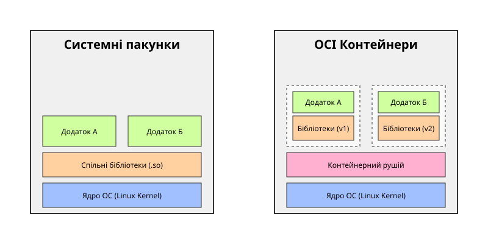

# Контейнер проти пакунка: Детальне порівняння архітектур розгортання

<preknowlist>
- [Концепції ядра Linux](book:unix-linux/kernel-and-userspace) — базові поняття системних викликів та VFS.
</preknowlist>

## Еволюція розгортання програмного забезпечення

Традиційний підхід до розгортання програмного забезпечення в екосистемі Unix та Linux історично базувався на використанні системних менеджерів пакунків, таких як APT, YUM, або Pacman. Ці інструменти були розроблені для ефективного управління спільними ресурсами операційної системи, зокрема розділюваними бібліотеками (shared libraries). Головна перевага цього підходу полягає в економії дискового простору та оперативної пам'яті, оскільки одна й та сама бібліотека, наприклад, glibc або OpenSSL, завантажується в пам'ять лише один раз і використовується багатьма процесами одночасно. Крім того, централізоване управління дозволяє адміністраторам швидко встановлювати критичні оновлення безпеки, автоматично усуваючи вразливості для всіх встановлених програм. Однак такий рівень взаємозалежності часто призводить до конфліктів версій, відомих як 'пекло залежностей' (dependency hell). Коли дві різні програми вимагають несумісних версій однієї бібліотеки, оновлення однієї програми може призвести до непрацездатності іншої, що створює значні труднощі при масштабуванні складних систем.

З іншого боку, контейнерні технології, стандартизовані через Open Container Initiative (OCI), пропонують принципово інший підхід. Контейнер пакує сам застосунок разом із його власним ізольованим середовищем виконання, включаючи всі необхідні залежності, конфігураційні файли та базову кореневу файлову систему (rootfs). Завдяки використанню технологій ядра Linux, таких як namespaces для ізоляції процесів, мережі та монтування, а також cgroups для управління ресурсами, контейнери забезпечують передбачуваність та консистентність незалежно від того, на якому хості вони запускаються. Це вирішує проблему 'працює на моїй машині', роблячи розгортання мікросервісних архітектур значно надійнішим. Проте, цей підхід не позбавлений недоліків. Включення всіх залежностей у кожен образ контейнера неминуче призводить до дублювання даних. Навіть при використанні шаруватих файлових систем (overlayfs), загальний обсяг споживаного дискового простору та оперативної пам'яті зростає. Крім того, відповідальність за оновлення базових бібліотек переноситься з системних адміністраторів на розробників образів, що ускладнює моніторинг та швидке усунення вразливостей в розподілених середовищах.

Традиційний підхід до розгортання програмного забезпечення в екосистемі Unix та Linux історично базувався на використанні системних менеджерів пакунків, таких як APT, YUM, або Pacman. Ці інструменти були розроблені для ефективного управління спільними ресурсами операційної системи, зокрема розділюваними бібліотеками (shared libraries). Головна перевага цього підходу полягає в економії дискового простору та оперативної пам'яті, оскільки одна й та сама бібліотека, наприклад, glibc або OpenSSL, завантажується в пам'ять лише один раз і використовується багатьма процесами одночасно. Крім того, централізоване управління дозволяє адміністраторам швидко встановлювати критичні оновлення безпеки, автоматично усуваючи вразливості для всіх встановлених програм. Однак такий рівень взаємозалежності часто призводить до конфліктів версій, відомих як 'пекло залежностей' (dependency hell). Коли дві різні програми вимагають несумісних версій однієї бібліотеки, оновлення однієї програми може призвести до непрацездатності іншої, що створює значні труднощі при масштабуванні складних систем.

З іншого боку, контейнерні технології, стандартизовані через Open Container Initiative (OCI), пропонують принципово інший підхід. Контейнер пакує сам застосунок разом із його власним ізольованим середовищем виконання, включаючи всі необхідні залежності, конфігураційні файли та базову кореневу файлову систему (rootfs). Завдяки використанню технологій ядра Linux, таких як namespaces для ізоляції процесів, мережі та монтування, а також cgroups для управління ресурсами, контейнери забезпечують передбачуваність та консистентність незалежно від того, на якому хості вони запускаються. Це вирішує проблему 'працює на моїй машині', роблячи розгортання мікросервісних архітектур значно надійнішим. Проте, цей підхід не позбавлений недоліків. Включення всіх залежностей у кожен образ контейнера неминуче призводить до дублювання даних. Навіть при використанні шаруватих файлових систем (overlayfs), загальний обсяг споживаного дискового простору та оперативної пам'яті зростає. Крім того, відповідальність за оновлення базових бібліотек переноситься з системних адміністраторів на розробників образів, що ускладнює моніторинг та швидке усунення вразливостей в розподілених середовищах.

## Традиційні системні пакунки: Архітектура та принципи роботи

Традиційний підхід до розгортання програмного забезпечення в екосистемі Unix та Linux історично базувався на використанні системних менеджерів пакунків, таких як APT, YUM, або Pacman. Ці інструменти були розроблені для ефективного управління спільними ресурсами операційної системи, зокрема розділюваними бібліотеками (shared libraries). Головна перевага цього підходу полягає в економії дискового простору та оперативної пам'яті, оскільки одна й та сама бібліотека, наприклад, glibc або OpenSSL, завантажується в пам'ять лише один раз і використовується багатьма процесами одночасно. Крім того, централізоване управління дозволяє адміністраторам швидко встановлювати критичні оновлення безпеки, автоматично усуваючи вразливості для всіх встановлених програм. Однак такий рівень взаємозалежності часто призводить до конфліктів версій, відомих як 'пекло залежностей' (dependency hell). Коли дві різні програми вимагають несумісних версій однієї бібліотеки, оновлення однієї програми може призвести до непрацездатності іншої, що створює значні труднощі при масштабуванні складних систем.

З іншого боку, контейнерні технології, стандартизовані через Open Container Initiative (OCI), пропонують принципово інший підхід. Контейнер пакує сам застосунок разом із його власним ізольованим середовищем виконання, включаючи всі необхідні залежності, конфігураційні файли та базову кореневу файлову систему (rootfs). Завдяки використанню технологій ядра Linux, таких як namespaces для ізоляції процесів, мережі та монтування, а також cgroups для управління ресурсами, контейнери забезпечують передбачуваність та консистентність незалежно від того, на якому хості вони запускаються. Це вирішує проблему 'працює на моїй машині', роблячи розгортання мікросервісних архітектур значно надійнішим. Проте, цей підхід не позбавлений недоліків. Включення всіх залежностей у кожен образ контейнера неминуче призводить до дублювання даних. Навіть при використанні шаруватих файлових систем (overlayfs), загальний обсяг споживаного дискового простору та оперативної пам'яті зростає. Крім того, відповідальність за оновлення базових бібліотек переноситься з системних адміністраторів на розробників образів, що ускладнює моніторинг та швидке усунення вразливостей в розподілених середовищах.

Традиційний підхід до розгортання програмного забезпечення в екосистемі Unix та Linux історично базувався на використанні системних менеджерів пакунків, таких як APT, YUM, або Pacman. Ці інструменти були розроблені для ефективного управління спільними ресурсами операційної системи, зокрема розділюваними бібліотеками (shared libraries). Головна перевага цього підходу полягає в економії дискового простору та оперативної пам'яті, оскільки одна й та сама бібліотека, наприклад, glibc або OpenSSL, завантажується в пам'ять лише один раз і використовується багатьма процесами одночасно. Крім того, централізоване управління дозволяє адміністраторам швидко встановлювати критичні оновлення безпеки, автоматично усуваючи вразливості для всіх встановлених програм. Однак такий рівень взаємозалежності часто призводить до конфліктів версій, відомих як 'пекло залежностей' (dependency hell). Коли дві різні програми вимагають несумісних версій однієї бібліотеки, оновлення однієї програми може призвести до непрацездатності іншої, що створює значні труднощі при масштабуванні складних систем.

З іншого боку, контейнерні технології, стандартизовані через Open Container Initiative (OCI), пропонують принципово інший підхід. Контейнер пакує сам застосунок разом із його власним ізольованим середовищем виконання, включаючи всі необхідні залежності, конфігураційні файли та базову кореневу файлову систему (rootfs). Завдяки використанню технологій ядра Linux, таких як namespaces для ізоляції процесів, мережі та монтування, а також cgroups для управління ресурсами, контейнери забезпечують передбачуваність та консистентність незалежно від того, на якому хості вони запускаються. Це вирішує проблему 'працює на моїй машині', роблячи розгортання мікросервісних архітектур значно надійнішим. Проте, цей підхід не позбавлений недоліків. Включення всіх залежностей у кожен образ контейнера неминуче призводить до дублювання даних. Навіть при використанні шаруватих файлових систем (overlayfs), загальний обсяг споживаного дискового простору та оперативної пам'яті зростає. Крім того, відповідальність за оновлення базових бібліотек переноситься з системних адміністраторів на розробників образів, що ускладнює моніторинг та швидке усунення вразливостей в розподілених середовищах.

## Анатомія залежностей: Динамічне зв'язування та 'Dependency Hell'

Традиційний підхід до розгортання програмного забезпечення в екосистемі Unix та Linux історично базувався на використанні системних менеджерів пакунків, таких як APT, YUM, або Pacman. Ці інструменти були розроблені для ефективного управління спільними ресурсами операційної системи, зокрема розділюваними бібліотеками (shared libraries). Головна перевага цього підходу полягає в економії дискового простору та оперативної пам'яті, оскільки одна й та сама бібліотека, наприклад, glibc або OpenSSL, завантажується в пам'ять лише один раз і використовується багатьма процесами одночасно. Крім того, централізоване управління дозволяє адміністраторам швидко встановлювати критичні оновлення безпеки, автоматично усуваючи вразливості для всіх встановлених програм. Однак такий рівень взаємозалежності часто призводить до конфліктів версій, відомих як 'пекло залежностей' (dependency hell). Коли дві різні програми вимагають несумісних версій однієї бібліотеки, оновлення однієї програми може призвести до непрацездатності іншої, що створює значні труднощі при масштабуванні складних систем.

З іншого боку, контейнерні технології, стандартизовані через Open Container Initiative (OCI), пропонують принципово інший підхід. Контейнер пакує сам застосунок разом із його власним ізольованим середовищем виконання, включаючи всі необхідні залежності, конфігураційні файли та базову кореневу файлову систему (rootfs). Завдяки використанню технологій ядра Linux, таких як namespaces для ізоляції процесів, мережі та монтування, а також cgroups для управління ресурсами, контейнери забезпечують передбачуваність та консистентність незалежно від того, на якому хості вони запускаються. Це вирішує проблему 'працює на моїй машині', роблячи розгортання мікросервісних архітектур значно надійнішим. Проте, цей підхід не позбавлений недоліків. Включення всіх залежностей у кожен образ контейнера неминуче призводить до дублювання даних. Навіть при використанні шаруватих файлових систем (overlayfs), загальний обсяг споживаного дискового простору та оперативної пам'яті зростає. Крім того, відповідальність за оновлення базових бібліотек переноситься з системних адміністраторів на розробників образів, що ускладнює моніторинг та швидке усунення вразливостей в розподілених середовищах.

Традиційний підхід до розгортання програмного забезпечення в екосистемі Unix та Linux історично базувався на використанні системних менеджерів пакунків, таких як APT, YUM, або Pacman. Ці інструменти були розроблені для ефективного управління спільними ресурсами операційної системи, зокрема розділюваними бібліотеками (shared libraries). Головна перевага цього підходу полягає в економії дискового простору та оперативної пам'яті, оскільки одна й та сама бібліотека, наприклад, glibc або OpenSSL, завантажується в пам'ять лише один раз і використовується багатьма процесами одночасно. Крім того, централізоване управління дозволяє адміністраторам швидко встановлювати критичні оновлення безпеки, автоматично усуваючи вразливості для всіх встановлених програм. Однак такий рівень взаємозалежності часто призводить до конфліктів версій, відомих як 'пекло залежностей' (dependency hell). Коли дві різні програми вимагають несумісних версій однієї бібліотеки, оновлення однієї програми може призвести до непрацездатності іншої, що створює значні труднощі при масштабуванні складних систем.

З іншого боку, контейнерні технології, стандартизовані через Open Container Initiative (OCI), пропонують принципово інший підхід. Контейнер пакує сам застосунок разом із його власним ізольованим середовищем виконання, включаючи всі необхідні залежності, конфігураційні файли та базову кореневу файлову систему (rootfs). Завдяки використанню технологій ядра Linux, таких як namespaces для ізоляції процесів, мережі та монтування, а також cgroups для управління ресурсами, контейнери забезпечують передбачуваність та консистентність незалежно від того, на якому хості вони запускаються. Це вирішує проблему 'працює на моїй машині', роблячи розгортання мікросервісних архітектур значно надійнішим. Проте, цей підхід не позбавлений недоліків. Включення всіх залежностей у кожен образ контейнера неминуче призводить до дублювання даних. Навіть при використанні шаруватих файлових систем (overlayfs), загальний обсяг споживаного дискового простору та оперативної пам'яті зростає. Крім того, відповідальність за оновлення базових бібліотек переноситься з системних адміністраторів на розробників образів, що ускладнює моніторинг та швидке усунення вразливостей в розподілених середовищах.

## OCI Контейнери: Нова парадигма ізоляції

Традиційний підхід до розгортання програмного забезпечення в екосистемі Unix та Linux історично базувався на використанні системних менеджерів пакунків, таких як APT, YUM, або Pacman. Ці інструменти були розроблені для ефективного управління спільними ресурсами операційної системи, зокрема розділюваними бібліотеками (shared libraries). Головна перевага цього підходу полягає в економії дискового простору та оперативної пам'яті, оскільки одна й та сама бібліотека, наприклад, glibc або OpenSSL, завантажується в пам'ять лише один раз і використовується багатьма процесами одночасно. Крім того, централізоване управління дозволяє адміністраторам швидко встановлювати критичні оновлення безпеки, автоматично усуваючи вразливості для всіх встановлених програм. Однак такий рівень взаємозалежності часто призводить до конфліктів версій, відомих як 'пекло залежностей' (dependency hell). Коли дві різні програми вимагають несумісних версій однієї бібліотеки, оновлення однієї програми може призвести до непрацездатності іншої, що створює значні труднощі при масштабуванні складних систем.

З іншого боку, контейнерні технології, стандартизовані через Open Container Initiative (OCI), пропонують принципово інший підхід. Контейнер пакує сам застосунок разом із його власним ізольованим середовищем виконання, включаючи всі необхідні залежності, конфігураційні файли та базову кореневу файлову систему (rootfs). Завдяки використанню технологій ядра Linux, таких як namespaces для ізоляції процесів, мережі та монтування, а також cgroups для управління ресурсами, контейнери забезпечують передбачуваність та консистентність незалежно від того, на якому хості вони запускаються. Це вирішує проблему 'працює на моїй машині', роблячи розгортання мікросервісних архітектур значно надійнішим. Проте, цей підхід не позбавлений недоліків. Включення всіх залежностей у кожен образ контейнера неминуче призводить до дублювання даних. Навіть при використанні шаруватих файлових систем (overlayfs), загальний обсяг споживаного дискового простору та оперативної пам'яті зростає. Крім того, відповідальність за оновлення базових бібліотек переноситься з системних адміністраторів на розробників образів, що ускладнює моніторинг та швидке усунення вразливостей в розподілених середовищах.

Традиційний підхід до розгортання програмного забезпечення в екосистемі Unix та Linux історично базувався на використанні системних менеджерів пакунків, таких як APT, YUM, або Pacman. Ці інструменти були розроблені для ефективного управління спільними ресурсами операційної системи, зокрема розділюваними бібліотеками (shared libraries). Головна перевага цього підходу полягає в економії дискового простору та оперативної пам'яті, оскільки одна й та сама бібліотека, наприклад, glibc або OpenSSL, завантажується в пам'ять лише один раз і використовується багатьма процесами одночасно. Крім того, централізоване управління дозволяє адміністраторам швидко встановлювати критичні оновлення безпеки, автоматично усуваючи вразливості для всіх встановлених програм. Однак такий рівень взаємозалежності часто призводить до конфліктів версій, відомих як 'пекло залежностей' (dependency hell). Коли дві різні програми вимагають несумісних версій однієї бібліотеки, оновлення однієї програми може призвести до непрацездатності іншої, що створює значні труднощі при масштабуванні складних систем.

З іншого боку, контейнерні технології, стандартизовані через Open Container Initiative (OCI), пропонують принципово інший підхід. Контейнер пакує сам застосунок разом із його власним ізольованим середовищем виконання, включаючи всі необхідні залежності, конфігураційні файли та базову кореневу файлову систему (rootfs). Завдяки використанню технологій ядра Linux, таких як namespaces для ізоляції процесів, мережі та монтування, а також cgroups для управління ресурсами, контейнери забезпечують передбачуваність та консистентність незалежно від того, на якому хості вони запускаються. Це вирішує проблему 'працює на моїй машині', роблячи розгортання мікросервісних архітектур значно надійнішим. Проте, цей підхід не позбавлений недоліків. Включення всіх залежностей у кожен образ контейнера неминуче призводить до дублювання даних. Навіть при використанні шаруватих файлових систем (overlayfs), загальний обсяг споживаного дискового простору та оперативної пам'яті зростає. Крім того, відповідальність за оновлення базових бібліотек переноситься з системних адміністраторів на розробників образів, що ускладнює моніторинг та швидке усунення вразливостей в розподілених середовищах.

## Внутрішня будова контейнера: rootfs, namespaces та cgroups

Традиційний підхід до розгортання програмного забезпечення в екосистемі Unix та Linux історично базувався на використанні системних менеджерів пакунків, таких як APT, YUM, або Pacman. Ці інструменти були розроблені для ефективного управління спільними ресурсами операційної системи, зокрема розділюваними бібліотеками (shared libraries). Головна перевага цього підходу полягає в економії дискового простору та оперативної пам'яті, оскільки одна й та сама бібліотека, наприклад, glibc або OpenSSL, завантажується в пам'ять лише один раз і використовується багатьма процесами одночасно. Крім того, централізоване управління дозволяє адміністраторам швидко встановлювати критичні оновлення безпеки, автоматично усуваючи вразливості для всіх встановлених програм. Однак такий рівень взаємозалежності часто призводить до конфліктів версій, відомих як 'пекло залежностей' (dependency hell). Коли дві різні програми вимагають несумісних версій однієї бібліотеки, оновлення однієї програми може призвести до непрацездатності іншої, що створює значні труднощі при масштабуванні складних систем.

З іншого боку, контейнерні технології, стандартизовані через Open Container Initiative (OCI), пропонують принципово інший підхід. Контейнер пакує сам застосунок разом із його власним ізольованим середовищем виконання, включаючи всі необхідні залежності, конфігураційні файли та базову кореневу файлову систему (rootfs). Завдяки використанню технологій ядра Linux, таких як namespaces для ізоляції процесів, мережі та монтування, а також cgroups для управління ресурсами, контейнери забезпечують передбачуваність та консистентність незалежно від того, на якому хості вони запускаються. Це вирішує проблему 'працює на моїй машині', роблячи розгортання мікросервісних архітектур значно надійнішим. Проте, цей підхід не позбавлений недоліків. Включення всіх залежностей у кожен образ контейнера неминуче призводить до дублювання даних. Навіть при використанні шаруватих файлових систем (overlayfs), загальний обсяг споживаного дискового простору та оперативної пам'яті зростає. Крім того, відповідальність за оновлення базових бібліотек переноситься з системних адміністраторів на розробників образів, що ускладнює моніторинг та швидке усунення вразливостей в розподілених середовищах.

Традиційний підхід до розгортання програмного забезпечення в екосистемі Unix та Linux історично базувався на використанні системних менеджерів пакунків, таких як APT, YUM, або Pacman. Ці інструменти були розроблені для ефективного управління спільними ресурсами операційної системи, зокрема розділюваними бібліотеками (shared libraries). Головна перевага цього підходу полягає в економії дискового простору та оперативної пам'яті, оскільки одна й та сама бібліотека, наприклад, glibc або OpenSSL, завантажується в пам'ять лише один раз і використовується багатьма процесами одночасно. Крім того, централізоване управління дозволяє адміністраторам швидко встановлювати критичні оновлення безпеки, автоматично усуваючи вразливості для всіх встановлених програм. Однак такий рівень взаємозалежності часто призводить до конфліктів версій, відомих як 'пекло залежностей' (dependency hell). Коли дві різні програми вимагають несумісних версій однієї бібліотеки, оновлення однієї програми може призвести до непрацездатності іншої, що створює значні труднощі при масштабуванні складних систем.

З іншого боку, контейнерні технології, стандартизовані через Open Container Initiative (OCI), пропонують принципово інший підхід. Контейнер пакує сам застосунок разом із його власним ізольованим середовищем виконання, включаючи всі необхідні залежності, конфігураційні файли та базову кореневу файлову систему (rootfs). Завдяки використанню технологій ядра Linux, таких як namespaces для ізоляції процесів, мережі та монтування, а також cgroups для управління ресурсами, контейнери забезпечують передбачуваність та консистентність незалежно від того, на якому хості вони запускаються. Це вирішує проблему 'працює на моїй машині', роблячи розгортання мікросервісних архітектур значно надійнішим. Проте, цей підхід не позбавлений недоліків. Включення всіх залежностей у кожен образ контейнера неминуче призводить до дублювання даних. Навіть при використанні шаруватих файлових систем (overlayfs), загальний обсяг споживаного дискового простору та оперативної пам'яті зростає. Крім того, відповідальність за оновлення базових бібліотек переноситься з системних адміністраторів на розробників образів, що ускладнює моніторинг та швидке усунення вразливостей в розподілених середовищах.

## Порівняння продуктивності та накладних витрат

Традиційний підхід до розгортання програмного забезпечення в екосистемі Unix та Linux історично базувався на використанні системних менеджерів пакунків, таких як APT, YUM, або Pacman. Ці інструменти були розроблені для ефективного управління спільними ресурсами операційної системи, зокрема розділюваними бібліотеками (shared libraries). Головна перевага цього підходу полягає в економії дискового простору та оперативної пам'яті, оскільки одна й та сама бібліотека, наприклад, glibc або OpenSSL, завантажується в пам'ять лише один раз і використовується багатьма процесами одночасно. Крім того, централізоване управління дозволяє адміністраторам швидко встановлювати критичні оновлення безпеки, автоматично усуваючи вразливості для всіх встановлених програм. Однак такий рівень взаємозалежності часто призводить до конфліктів версій, відомих як 'пекло залежностей' (dependency hell). Коли дві різні програми вимагають несумісних версій однієї бібліотеки, оновлення однієї програми може призвести до непрацездатності іншої, що створює значні труднощі при масштабуванні складних систем.

З іншого боку, контейнерні технології, стандартизовані через Open Container Initiative (OCI), пропонують принципово інший підхід. Контейнер пакує сам застосунок разом із його власним ізольованим середовищем виконання, включаючи всі необхідні залежності, конфігураційні файли та базову кореневу файлову систему (rootfs). Завдяки використанню технологій ядра Linux, таких як namespaces для ізоляції процесів, мережі та монтування, а також cgroups для управління ресурсами, контейнери забезпечують передбачуваність та консистентність незалежно від того, на якому хості вони запускаються. Це вирішує проблему 'працює на моїй машині', роблячи розгортання мікросервісних архітектур значно надійнішим. Проте, цей підхід не позбавлений недоліків. Включення всіх залежностей у кожен образ контейнера неминуче призводить до дублювання даних. Навіть при використанні шаруватих файлових систем (overlayfs), загальний обсяг споживаного дискового простору та оперативної пам'яті зростає. Крім того, відповідальність за оновлення базових бібліотек переноситься з системних адміністраторів на розробників образів, що ускладнює моніторинг та швидке усунення вразливостей в розподілених середовищах.

Традиційний підхід до розгортання програмного забезпечення в екосистемі Unix та Linux історично базувався на використанні системних менеджерів пакунків, таких як APT, YUM, або Pacman. Ці інструменти були розроблені для ефективного управління спільними ресурсами операційної системи, зокрема розділюваними бібліотеками (shared libraries). Головна перевага цього підходу полягає в економії дискового простору та оперативної пам'яті, оскільки одна й та сама бібліотека, наприклад, glibc або OpenSSL, завантажується в пам'ять лише один раз і використовується багатьма процесами одночасно. Крім того, централізоване управління дозволяє адміністраторам швидко встановлювати критичні оновлення безпеки, автоматично усуваючи вразливості для всіх встановлених програм. Однак такий рівень взаємозалежності часто призводить до конфліктів версій, відомих як 'пекло залежностей' (dependency hell). Коли дві різні програми вимагають несумісних версій однієї бібліотеки, оновлення однієї програми може призвести до непрацездатності іншої, що створює значні труднощі при масштабуванні складних систем.

З іншого боку, контейнерні технології, стандартизовані через Open Container Initiative (OCI), пропонують принципово інший підхід. Контейнер пакує сам застосунок разом із його власним ізольованим середовищем виконання, включаючи всі необхідні залежності, конфігураційні файли та базову кореневу файлову систему (rootfs). Завдяки використанню технологій ядра Linux, таких як namespaces для ізоляції процесів, мережі та монтування, а також cgroups для управління ресурсами, контейнери забезпечують передбачуваність та консистентність незалежно від того, на якому хості вони запускаються. Це вирішує проблему 'працює на моїй машині', роблячи розгортання мікросервісних архітектур значно надійнішим. Проте, цей підхід не позбавлений недоліків. Включення всіх залежностей у кожен образ контейнера неминуче призводить до дублювання даних. Навіть при використанні шаруватих файлових систем (overlayfs), загальний обсяг споживаного дискового простору та оперативної пам'яті зростає. Крім того, відповідальність за оновлення базових бібліотек переноситься з системних адміністраторів на розробників образів, що ускладнює моніторинг та швидке усунення вразливостей в розподілених середовищах.

## Безпека: Оновлення вразливостей в пакунках проти контейнерів

Традиційний підхід до розгортання програмного забезпечення в екосистемі Unix та Linux історично базувався на використанні системних менеджерів пакунків, таких як APT, YUM, або Pacman. Ці інструменти були розроблені для ефективного управління спільними ресурсами операційної системи, зокрема розділюваними бібліотеками (shared libraries). Головна перевага цього підходу полягає в економії дискового простору та оперативної пам'яті, оскільки одна й та сама бібліотека, наприклад, glibc або OpenSSL, завантажується в пам'ять лише один раз і використовується багатьма процесами одночасно. Крім того, централізоване управління дозволяє адміністраторам швидко встановлювати критичні оновлення безпеки, автоматично усуваючи вразливості для всіх встановлених програм. Однак такий рівень взаємозалежності часто призводить до конфліктів версій, відомих як 'пекло залежностей' (dependency hell). Коли дві різні програми вимагають несумісних версій однієї бібліотеки, оновлення однієї програми може призвести до непрацездатності іншої, що створює значні труднощі при масштабуванні складних систем.

З іншого боку, контейнерні технології, стандартизовані через Open Container Initiative (OCI), пропонують принципово інший підхід. Контейнер пакує сам застосунок разом із його власним ізольованим середовищем виконання, включаючи всі необхідні залежності, конфігураційні файли та базову кореневу файлову систему (rootfs). Завдяки використанню технологій ядра Linux, таких як namespaces для ізоляції процесів, мережі та монтування, а також cgroups для управління ресурсами, контейнери забезпечують передбачуваність та консистентність незалежно від того, на якому хості вони запускаються. Це вирішує проблему 'працює на моїй машині', роблячи розгортання мікросервісних архітектур значно надійнішим. Проте, цей підхід не позбавлений недоліків. Включення всіх залежностей у кожен образ контейнера неминуче призводить до дублювання даних. Навіть при використанні шаруватих файлових систем (overlayfs), загальний обсяг споживаного дискового простору та оперативної пам'яті зростає. Крім того, відповідальність за оновлення базових бібліотек переноситься з системних адміністраторів на розробників образів, що ускладнює моніторинг та швидке усунення вразливостей в розподілених середовищах.

Традиційний підхід до розгортання програмного забезпечення в екосистемі Unix та Linux історично базувався на використанні системних менеджерів пакунків, таких як APT, YUM, або Pacman. Ці інструменти були розроблені для ефективного управління спільними ресурсами операційної системи, зокрема розділюваними бібліотеками (shared libraries). Головна перевага цього підходу полягає в економії дискового простору та оперативної пам'яті, оскільки одна й та сама бібліотека, наприклад, glibc або OpenSSL, завантажується в пам'ять лише один раз і використовується багатьма процесами одночасно. Крім того, централізоване управління дозволяє адміністраторам швидко встановлювати критичні оновлення безпеки, автоматично усуваючи вразливості для всіх встановлених програм. Однак такий рівень взаємозалежності часто призводить до конфліктів версій, відомих як 'пекло залежностей' (dependency hell). Коли дві різні програми вимагають несумісних версій однієї бібліотеки, оновлення однієї програми може призвести до непрацездатності іншої, що створює значні труднощі при масштабуванні складних систем.

З іншого боку, контейнерні технології, стандартизовані через Open Container Initiative (OCI), пропонують принципово інший підхід. Контейнер пакує сам застосунок разом із його власним ізольованим середовищем виконання, включаючи всі необхідні залежності, конфігураційні файли та базову кореневу файлову систему (rootfs). Завдяки використанню технологій ядра Linux, таких як namespaces для ізоляції процесів, мережі та монтування, а також cgroups для управління ресурсами, контейнери забезпечують передбачуваність та консистентність незалежно від того, на якому хості вони запускаються. Це вирішує проблему 'працює на моїй машині', роблячи розгортання мікросервісних архітектур значно надійнішим. Проте, цей підхід не позбавлений недоліків. Включення всіх залежностей у кожен образ контейнера неминуче призводить до дублювання даних. Навіть при використанні шаруватих файлових систем (overlayfs), загальний обсяг споживаного дискового простору та оперативної пам'яті зростає. Крім того, відповідальність за оновлення базових бібліотек переноситься з системних адміністраторів на розробників образів, що ускладнює моніторинг та швидке усунення вразливостей в розподілених середовищах.

## Життєвий цикл розробки: Від локальної машини до продакшену

Традиційний підхід до розгортання програмного забезпечення в екосистемі Unix та Linux історично базувався на використанні системних менеджерів пакунків, таких як APT, YUM, або Pacman. Ці інструменти були розроблені для ефективного управління спільними ресурсами операційної системи, зокрема розділюваними бібліотеками (shared libraries). Головна перевага цього підходу полягає в економії дискового простору та оперативної пам'яті, оскільки одна й та сама бібліотека, наприклад, glibc або OpenSSL, завантажується в пам'ять лише один раз і використовується багатьма процесами одночасно. Крім того, централізоване управління дозволяє адміністраторам швидко встановлювати критичні оновлення безпеки, автоматично усуваючи вразливості для всіх встановлених програм. Однак такий рівень взаємозалежності часто призводить до конфліктів версій, відомих як 'пекло залежностей' (dependency hell). Коли дві різні програми вимагають несумісних версій однієї бібліотеки, оновлення однієї програми може призвести до непрацездатності іншої, що створює значні труднощі при масштабуванні складних систем.

З іншого боку, контейнерні технології, стандартизовані через Open Container Initiative (OCI), пропонують принципово інший підхід. Контейнер пакує сам застосунок разом із його власним ізольованим середовищем виконання, включаючи всі необхідні залежності, конфігураційні файли та базову кореневу файлову систему (rootfs). Завдяки використанню технологій ядра Linux, таких як namespaces для ізоляції процесів, мережі та монтування, а також cgroups для управління ресурсами, контейнери забезпечують передбачуваність та консистентність незалежно від того, на якому хості вони запускаються. Це вирішує проблему 'працює на моїй машині', роблячи розгортання мікросервісних архітектур значно надійнішим. Проте, цей підхід не позбавлений недоліків. Включення всіх залежностей у кожен образ контейнера неминуче призводить до дублювання даних. Навіть при використанні шаруватих файлових систем (overlayfs), загальний обсяг споживаного дискового простору та оперативної пам'яті зростає. Крім того, відповідальність за оновлення базових бібліотек переноситься з системних адміністраторів на розробників образів, що ускладнює моніторинг та швидке усунення вразливостей в розподілених середовищах.

Традиційний підхід до розгортання програмного забезпечення в екосистемі Unix та Linux історично базувався на використанні системних менеджерів пакунків, таких як APT, YUM, або Pacman. Ці інструменти були розроблені для ефективного управління спільними ресурсами операційної системи, зокрема розділюваними бібліотеками (shared libraries). Головна перевага цього підходу полягає в економії дискового простору та оперативної пам'яті, оскільки одна й та сама бібліотека, наприклад, glibc або OpenSSL, завантажується в пам'ять лише один раз і використовується багатьма процесами одночасно. Крім того, централізоване управління дозволяє адміністраторам швидко встановлювати критичні оновлення безпеки, автоматично усуваючи вразливості для всіх встановлених програм. Однак такий рівень взаємозалежності часто призводить до конфліктів версій, відомих як 'пекло залежностей' (dependency hell). Коли дві різні програми вимагають несумісних версій однієї бібліотеки, оновлення однієї програми може призвести до непрацездатності іншої, що створює значні труднощі при масштабуванні складних систем.

З іншого боку, контейнерні технології, стандартизовані через Open Container Initiative (OCI), пропонують принципово інший підхід. Контейнер пакує сам застосунок разом із його власним ізольованим середовищем виконання, включаючи всі необхідні залежності, конфігураційні файли та базову кореневу файлову систему (rootfs). Завдяки використанню технологій ядра Linux, таких як namespaces для ізоляції процесів, мережі та монтування, а також cgroups для управління ресурсами, контейнери забезпечують передбачуваність та консистентність незалежно від того, на якому хості вони запускаються. Це вирішує проблему 'працює на моїй машині', роблячи розгортання мікросервісних архітектур значно надійнішим. Проте, цей підхід не позбавлений недоліків. Включення всіх залежностей у кожен образ контейнера неминуче призводить до дублювання даних. Навіть при використанні шаруватих файлових систем (overlayfs), загальний обсяг споживаного дискового простору та оперативної пам'яті зростає. Крім того, відповідальність за оновлення базових бібліотек переноситься з системних адміністраторів на розробників образів, що ускладнює моніторинг та швидке усунення вразливостей в розподілених середовищах.

## Змішані підходи та майбутнє розгортання (Flatpak, Nix, Wasm)

Традиційний підхід до розгортання програмного забезпечення в екосистемі Unix та Linux історично базувався на використанні системних менеджерів пакунків, таких як APT, YUM, або Pacman. Ці інструменти були розроблені для ефективного управління спільними ресурсами операційної системи, зокрема розділюваними бібліотеками (shared libraries). Головна перевага цього підходу полягає в економії дискового простору та оперативної пам'яті, оскільки одна й та сама бібліотека, наприклад, glibc або OpenSSL, завантажується в пам'ять лише один раз і використовується багатьма процесами одночасно. Крім того, централізоване управління дозволяє адміністраторам швидко встановлювати критичні оновлення безпеки, автоматично усуваючи вразливості для всіх встановлених програм. Однак такий рівень взаємозалежності часто призводить до конфліктів версій, відомих як 'пекло залежностей' (dependency hell). Коли дві різні програми вимагають несумісних версій однієї бібліотеки, оновлення однієї програми може призвести до непрацездатності іншої, що створює значні труднощі при масштабуванні складних систем.

З іншого боку, контейнерні технології, стандартизовані через Open Container Initiative (OCI), пропонують принципово інший підхід. Контейнер пакує сам застосунок разом із його власним ізольованим середовищем виконання, включаючи всі необхідні залежності, конфігураційні файли та базову кореневу файлову систему (rootfs). Завдяки використанню технологій ядра Linux, таких як namespaces для ізоляції процесів, мережі та монтування, а також cgroups для управління ресурсами, контейнери забезпечують передбачуваність та консистентність незалежно від того, на якому хості вони запускаються. Це вирішує проблему 'працює на моїй машині', роблячи розгортання мікросервісних архітектур значно надійнішим. Проте, цей підхід не позбавлений недоліків. Включення всіх залежностей у кожен образ контейнера неминуче призводить до дублювання даних. Навіть при використанні шаруватих файлових систем (overlayfs), загальний обсяг споживаного дискового простору та оперативної пам'яті зростає. Крім того, відповідальність за оновлення базових бібліотек переноситься з системних адміністраторів на розробників образів, що ускладнює моніторинг та швидке усунення вразливостей в розподілених середовищах.

Традиційний підхід до розгортання програмного забезпечення в екосистемі Unix та Linux історично базувався на використанні системних менеджерів пакунків, таких як APT, YUM, або Pacman. Ці інструменти були розроблені для ефективного управління спільними ресурсами операційної системи, зокрема розділюваними бібліотеками (shared libraries). Головна перевага цього підходу полягає в економії дискового простору та оперативної пам'яті, оскільки одна й та сама бібліотека, наприклад, glibc або OpenSSL, завантажується в пам'ять лише один раз і використовується багатьма процесами одночасно. Крім того, централізоване управління дозволяє адміністраторам швидко встановлювати критичні оновлення безпеки, автоматично усуваючи вразливості для всіх встановлених програм. Однак такий рівень взаємозалежності часто призводить до конфліктів версій, відомих як 'пекло залежностей' (dependency hell). Коли дві різні програми вимагають несумісних версій однієї бібліотеки, оновлення однієї програми може призвести до непрацездатності іншої, що створює значні труднощі при масштабуванні складних систем.

З іншого боку, контейнерні технології, стандартизовані через Open Container Initiative (OCI), пропонують принципово інший підхід. Контейнер пакує сам застосунок разом із його власним ізольованим середовищем виконання, включаючи всі необхідні залежності, конфігураційні файли та базову кореневу файлову систему (rootfs). Завдяки використанню технологій ядра Linux, таких як namespaces для ізоляції процесів, мережі та монтування, а також cgroups для управління ресурсами, контейнери забезпечують передбачуваність та консистентність незалежно від того, на якому хості вони запускаються. Це вирішує проблему 'працює на моїй машині', роблячи розгортання мікросервісних архітектур значно надійнішим. Проте, цей підхід не позбавлений недоліків. Включення всіх залежностей у кожен образ контейнера неминуче призводить до дублювання даних. Навіть при використанні шаруватих файлових систем (overlayfs), загальний обсяг споживаного дискового простору та оперативної пам'яті зростає. Крім того, відповідальність за оновлення базових бібліотек переноситься з системних адміністраторів на розробників образів, що ускладнює моніторинг та швидке усунення вразливостей в розподілених середовищах.

## Висновки

Традиційний підхід до розгортання програмного забезпечення в екосистемі Unix та Linux історично базувався на використанні системних менеджерів пакунків, таких як APT, YUM, або Pacman. Ці інструменти були розроблені для ефективного управління спільними ресурсами операційної системи, зокрема розділюваними бібліотеками (shared libraries). Головна перевага цього підходу полягає в економії дискового простору та оперативної пам'яті, оскільки одна й та сама бібліотека, наприклад, glibc або OpenSSL, завантажується в пам'ять лише один раз і використовується багатьма процесами одночасно. Крім того, централізоване управління дозволяє адміністраторам швидко встановлювати критичні оновлення безпеки, автоматично усуваючи вразливості для всіх встановлених програм. Однак такий рівень взаємозалежності часто призводить до конфліктів версій, відомих як 'пекло залежностей' (dependency hell). Коли дві різні програми вимагають несумісних версій однієї бібліотеки, оновлення однієї програми може призвести до непрацездатності іншої, що створює значні труднощі при масштабуванні складних систем.

З іншого боку, контейнерні технології, стандартизовані через Open Container Initiative (OCI), пропонують принципово інший підхід. Контейнер пакує сам застосунок разом із його власним ізольованим середовищем виконання, включаючи всі необхідні залежності, конфігураційні файли та базову кореневу файлову систему (rootfs). Завдяки використанню технологій ядра Linux, таких як namespaces для ізоляції процесів, мережі та монтування, а також cgroups для управління ресурсами, контейнери забезпечують передбачуваність та консистентність незалежно від того, на якому хості вони запускаються. Це вирішує проблему 'працює на моїй машині', роблячи розгортання мікросервісних архітектур значно надійнішим. Проте, цей підхід не позбавлений недоліків. Включення всіх залежностей у кожен образ контейнера неминуче призводить до дублювання даних. Навіть при використанні шаруватих файлових систем (overlayfs), загальний обсяг споживаного дискового простору та оперативної пам'яті зростає. Крім того, відповідальність за оновлення базових бібліотек переноситься з системних адміністраторів на розробників образів, що ускладнює моніторинг та швидке усунення вразливостей в розподілених середовищах.

Традиційний підхід до розгортання програмного забезпечення в екосистемі Unix та Linux історично базувався на використанні системних менеджерів пакунків, таких як APT, YUM, або Pacman. Ці інструменти були розроблені для ефективного управління спільними ресурсами операційної системи, зокрема розділюваними бібліотеками (shared libraries). Головна перевага цього підходу полягає в економії дискового простору та оперативної пам'яті, оскільки одна й та сама бібліотека, наприклад, glibc або OpenSSL, завантажується в пам'ять лише один раз і використовується багатьма процесами одночасно. Крім того, централізоване управління дозволяє адміністраторам швидко встановлювати критичні оновлення безпеки, автоматично усуваючи вразливості для всіх встановлених програм. Однак такий рівень взаємозалежності часто призводить до конфліктів версій, відомих як 'пекло залежностей' (dependency hell). Коли дві різні програми вимагають несумісних версій однієї бібліотеки, оновлення однієї програми може призвести до непрацездатності іншої, що створює значні труднощі при масштабуванні складних систем.

З іншого боку, контейнерні технології, стандартизовані через Open Container Initiative (OCI), пропонують принципово інший підхід. Контейнер пакує сам застосунок разом із його власним ізольованим середовищем виконання, включаючи всі необхідні залежності, конфігураційні файли та базову кореневу файлову систему (rootfs). Завдяки використанню технологій ядра Linux, таких як namespaces для ізоляції процесів, мережі та монтування, а також cgroups для управління ресурсами, контейнери забезпечують передбачуваність та консистентність незалежно від того, на якому хості вони запускаються. Це вирішує проблему 'працює на моїй машині', роблячи розгортання мікросервісних архітектур значно надійнішим. Проте, цей підхід не позбавлений недоліків. Включення всіх залежностей у кожен образ контейнера неминуче призводить до дублювання даних. Навіть при використанні шаруватих файлових систем (overlayfs), загальний обсяг споживаного дискового простору та оперативної пам'яті зростає. Крім того, відповідальність за оновлення базових бібліотек переноситься з системних адміністраторів на розробників образів, що ускладнює моніторинг та швидке усунення вразливостей в розподілених середовищах.

