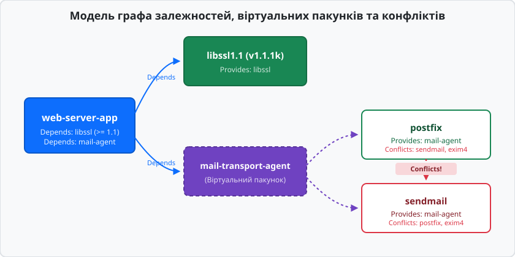
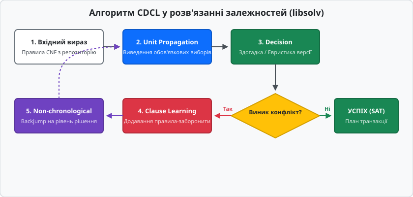
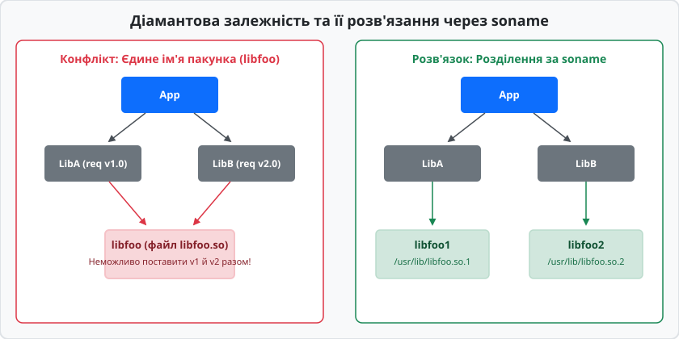

# Розв'язання залежностей і конфлікти версій

<preknowlist>
- [Модель пакункового менеджера](book:unix-linux/package-manager-model) — базові поняття пакунка, метаданих control/spec та локальної бази даних установлених компонентів.
- [Пакунки DEB та RPM](book:unix-linux/deb-and-rpm) — формат архівів .deb та .rpm, їхні внутрішні каталоги та структура файлів метаданих.
</preknowlist>

Коли команда розгортання оновлює системну бібліотеку `libssl.so` з версії 1.1 на 3.0 шляхом простого розпакування архіву у `/usr/lib64`, бінарний файл веб-сервера Nginx миттєво втрачає здатність запускатися. Причиною стане зміна бінарного інтерфейсу (ABI): видалення застарілих функцій шифрування та видозміна внутрішніх структур даних призводять до того, що динамічний лінкер `ld-linux.so` при старті процесу видає помилку `symbol lookup error: undefined symbol: SSLv23_method` і негайно завершує виконання. Лінійне копіювання файлів руйнує цілісність операційної системи, оскільки жоден компонент у такій спрощеній схемі не знає, які ще програми залежать від цієї ж самої бібліотеки та чи збережуть вони працездатність після її заміни.

Розв'язання залежностей (dependency resolution) виникло як фундаментальний механізм гарантування цілісності Unix-подібних систем. Його мета — перетворити набір ізольованих пакунків на зв'язаний, несуперечливий граф, у якому кожен компонент отримує сумісне оточення, а жоден установлений файл не порушує роботу сусідніх програм.

## 1. Від лінійного архіву до графа взаємозв'язків

У найпростішій навчальній моделі програма складається з одного автономного виконуваного файлу. Проте реальне системне забезпечення Unix спирається на принципи модульності та повторного використання коду. Мережевий демон використовує системну бібліотеку системних викликів `libc`, криптографічні алгоритми `libcrypto`, інструменти парсингу XML `libxml2` та службу відправки пошти.

Якщо кожен розробник додаватиме всі необхідні бібліотеки всередину свого власного архіву, розмір дистрибутиву зросте в сотні разів, а будь-яка вразливість у криптографічному коді вимагатиме перезбирання та перевидання тисяч окремих програм. Unix-архітектура вирішує цю проблему через спільні динамічні бібліотеки (shared libraries). За це виділення загального коду доводиться платити виникненням мережі залежностей.

Кожен пакунок у сучасних форматах DEB або RPM містить секцію метаданих. Ці метадані описують не лише власні характеристики (ім'я, версію, архітектуру), але й декларують правила співіснування з іншими пакунками. Менеджер пакунків при отриманні запиту на встановлення програми змушений обробляти не один архів, а будувати глобальний спрямований граф:
- Вузлами (nodes) графа є конкретні пакунки певних версій.
- Напрямленими ребрами (edges) є логічні зв'язки між ними (вимоги обов'язкової наявності, заборони або надання послуг).

Опис того, як пакункові менеджери історично пройшли шлях від локальних інспекторів архівів до глобальних аналізаторів графів, наведено у винесеній статті [📜 Еволюція менеджерів пакунків: від жадібного евристичного пошуку до SAT-солверів](book:unix-linux/dependency-resolution/hist-sat-in-package-managers.md).


*Граф зв'язків між цільовою програмою, її прямими залежностями, віртуальним пакунком mail-transport-agent та конфліктуючими поштовими серверами.*

## 2. Формалізація задачі: зведення залежностей до SAT

Спроба розв'язати граф залежностей за допомогою простих алгоритмів обходу в глибину (DFS) або в ширину (BFS) швидко зазнає краху при появі конфліктів та альтернатив. Якщо пакунок `A` залежить від `B` або `C`, а `B` конфліктує з вже встановленим `D`, жадібний обхід може ухвалити рішення видалити `D`, що своєю чергою зламає пакунок `E`.

З математичної точки зору задача розв'язання залежностей є **NP-повною** і еквівалентною **задачі здійснюваності булевих формул (Boolean Satisfiability Problem, SAT)**.

Нехай кожен пакунок у репозиторії представляє булеву змінну `x[i]`:
- `x[i] = 1` (True) означає, що пакунок `i` має бути встановлений у системі.
- `x[i] = 0` (False) означає, що пакунок `i` має бути відсутній або видалений.

Будь-яке правило з метаданих пакунка перекладається у булеву формулу в кон'юнктивній нормальній формі (CNF), де загальний стан системи є кон'юнкцією (логічним І `∧`) окремих диз'юнктів (логічних АБО `∨`).

### 2.1. Пряма залежність (Depends)
Якщо пакунок `A` вимагає наявності пакунка `B`, це записується як імпликація `A ⇒ B`. За законами булевої алгебри імпликація розгортається у диз'юнкт:

```
¬A ∨ B
```

Це означає: або пакунок `A` не встановлено (`¬A`), або пакунок `B` встановлено (`B`). Стан, де `A = 1`, а `B = 0`, робить цей диз'юнкт хибним (`0 ∨ 0 = 0`), що заборонено правилами системи.

### 2.2. Конфлікт (Conflicts)
Якщо пакунок `A` несумісний із пакунком `C`, вони не можуть бути встановлені одночасно: `¬(A ∧ C)`. За правилом Де Моргана це перетворюється у диз'юнкт:

```
¬A ∨ ¬C
```

### 2.3. Альтернативна залежність (Or-Depends)
Якщо програма `A` може працювати з будь-яким із двох поштових серверів `B` або `C`: `A ⇒ (B ∨ C)`, що дає диз'юнкт:

```
¬A ∨ B ∨ C
```

### 2.4. Запит користувача та формування системи
Якщо користувач виконує команду встановлення пакунка `A`, у систему додається одиничний диз'юнкт (unit clause):

```
A
```

Зведення всього репозиторію з 60 000 пакунків до єдиної булевої формули дає систему з сотень тисяч змінних і диз'юнктів:

```
F = (A) ∧ (¬A ∨ B) ∧ (¬A ∨ C ∨ D) ∧ (¬B ∨ ¬E) ∧ (¬C ∨ F) ...
```

Мета пакункового менеджера — знайти такий вектор значень змінних `(x[1], x[2], ..., x[N])`, за якого формула `F = 1`. Якщо такий вектор існує, система є здійсненною (Satisfiable), і вектор задає точний список пакунків для встановлення. Якщо `F = 0` при будь-яких комбінаціях, оновлення є математично неможливим, і солвер повинен вказати конфліктне ядро (Unsat Core).

## 3. Семантика метаданих у родинах Debian та Red Hat

Для побудови CNF-матриці менеджер пакунків зчитує поля з файлів `control` (у `.deb`) або `.spec` / `RPMTAG` (у `.rpm`). Різні типи зв'язків визначають суворість обмежень у булевій формулі.

### 3.1. Залежності виконання та розпакування

- **`Depends` (Debian) / `Requires` (RPM):** Жорстка вимоглива залежність. Без вказаного пакунка програма не працездатна. У формулу додається диз'юнкт `¬A ∨ B`.
- **`Pre-Depends` (Debian) / `Requires(pre)` (RPM):** Наджорстка часова залежність. Вимагає, щоб пакунок `B` був не просто розпакований, а повністю встановлений і зконфігурований у системі **до того**, як почнеться розпакування пакунка `A`. У булевій матриці це звичайний `Depends`, але у графі виконання транзакцій `Pre-Depends` створює бар'єр впорядкування (ordering barrier).

### 3.2. Конфлікти та заміщення

- **`Conflicts` (Debian/RPM):** Пряма заборона співіснування. Формула `¬A ∨ ¬B`. Використовується, коли два пакунки містять файли з однаковими абсолютними шляхами (наприклад, `/usr/bin/sql`).
- **`Breaks` (Debian):** М'який конфлікт версій. Вказує, що пакунок `A` ламає працездатність старої версії `B` (наприклад, `B (< 2.0)`). На відміну від `Conflicts`, `Breaks` дозволяє менеджеру пакунків автоматично оновити `B` до сумісної версії `2.0` в рамках тієї ж транзакції, замість відмови від встановлення `A`.
- **`Provides` (Debian/RPM):** Механізм віртуальних пакунків. Спеціальний пакунок (наприклад, `postfix`) декларує `Provides: mail-transport-agent`. Якщо програма `mutt` має `Depends: mail-transport-agent`, солвер автоматично розгортає це у диз'юнкт `¬mutt ∨ postfix ∨ sendmail ∨ exim4`.
- **`Replaces` (Debian):** Використовується разом із `Conflicts` або `Breaks`. Вказує, що пакунок `A` має право перезаписати файли, які раніше належали пакунку `B` (наприклад, при поділі одного великого пакунка на два дрібніших).

### 3.3. Рекомендації та слабозв'язані залежності

- **`Recommends` (Debian/RPM):** Залежності за замовчуванням. Вони не є критичними для запуску бінарного файлу, але додають важливий функціонал.
- **`Suggests` (Debian/RPM):** Додаткові пакунки, які розширюють можливості програми (наприклад, графічний плагін для консольного плеєра).

У SAT-солвері рекомендовані залежності обробляються через механізм м'яких обмежень (Soft Constraints) або псевдо-булеву оптимізацію: солвер намагається максимізувати кількість встановлених `Recommends`, якщо це не призводить до конфліктів із жорсткими диз'юнктами `Depends`.

## 4. Механіка CDCL у сучасних SAT-солверах (`libsolv`)

Ранні менеджери пакунків використовували алгоритм DPLL (Davis-Putnam-Logemann-Loveland), який виконував просте деревоподібне відшукання з відкатом (backtracking). У сучасній бібліотеці `libsolv` застосовується алгоритм **CDCL (Conflict-Driven Clause Learning)**, який вирішує проблеми великої розмірності за п'ять послідовних кроків.


*Послідовність кроків алгоритму CDCL: від Unit Propagation до аналізу конфліктів та навчання нових диз'юнктів-заборорон.*

### Крок 1: Unit Propagation (Поширення одиничних диз'юнктів)
Якщо у системі є диз'юнкт, у якому всі літерали, крім одного, вже оцінені як `False`, останній літерал **зобов'язаний** стати `True`. 

Наприклад, користувач вимагає встановити `App` (`App = 1`). У системі є правило `¬App ∨ LibA`. Оскільки `App = 1`, літерал `¬App = 0`. Щоб увесь диз'юнкт `(0 ∨ LibA)` став істинним, змінна `LibA` приймає вимушене значення `1`. Це викликає ланцюгову реакцію по всьому графу.

### Крок 2: Decision & Heuristics (Прийняття рішень)
Коли всі вимушені кроки вичерпано, але частина змінних лишилася неоціненою, солвер робить евристичну "здогадку" (Decision). Наприклад, при виборі між `postfix` та `sendmail` солвер вибирає кандидат з вищим пріоритетом або кандидат, що вже встановлений у системі, і присвоює йому значення `True` на новому рівні рішень (Decision Level).

### Крок 3: Conflict Analysis (Аналіз конфлікту)
Якщо після чергової здогадки `Unit Propagation` виявляє суперечність (наприклад, змінні `x` вимагається прийняти значення і `1`, і `0` одночасно), солвер зупиняється. Будується **граф імплікацій (Implication Graph)** — орієнтований граф, що показує, які саме попередні здогадки призвели до виникнення суперечності.

### Крок 4: Clause Learning (Навчання нових диз'юнктів)
З графа імплікацій солвер витягує **першу конфліктну причину (First Unique Implication Point, UIP)** і генерує новий диз'юнкт (Learned Clause). 

Наприклад, якщо суперечність виникла через одночасний вибір `App v2` та `LibB v1`, солвер створює нове правило:

```
¬App_v2 ∨ ¬LibB_v1
```

Цей новий диз'юнкт додається до бази знань пулу. Він гарантує, що алгоритм **ніколи більше не спробує** цю комбінацію у майбутніх гілках пошуку.

### Крок 5: Non-chronological Backjumping (Нехронологічний відкат)
Замість того, щоб скасовувати тільки останній крок (як у класичному backtracking), CDCL аналізує рівень рішення, на якому виникла першопричина конфлікту, і стрибає (backjumps) на кілька рівнів вгору по дереву рішень одразу.

Детальний приклад реалізації мінімального SAT-солвера з поширенням одиничних диз'юнктів мовами C та C++ наведено у практичній вставці [⚙️ Міні-солвер залежностей: алгоритм CDCL мовами C та C++](book:unix-linux/dependency-resolution/proj-sat-solver-engine.md). Специфікація системних структур даних та API бібліотеки `libsolv` описана у довіднику [📋 Інтерфейс та API бібліотеки libsolv](book:unix-linux/dependency-resolution/api-libsolv-surface.md).

## 5. Конфлікти версій та "Dependency Hell"

Незважаючи на наявність потужних SAT-солверів, структура залежностей у реальних операційних системах може потрапляти у тупикові ситуації. Ці ситуації узагальнено називають "пеклом залежностей" (Dependency Hell).

### 5.1. Діамантова залежність (Diamond Dependency Problem)

Найвідоміший архітектурний конфлікт виникає, коли програма залежить від двох системних бібліотек, які своєю чергою вимагають різних несумісних версій третьої базової бібліотеки.


*Неможливість співіснування версій при єдиному імені пакунка (ліворуч) та ізоляція через сонайм libfoo.so.1 i libfoo.so.2 (праворуч).*

Сценарій конфлікту:
1. Цільова програма `App` залежить від `LibA` та `LibB`.
2. `LibA` вимагає `libfoo` версії `1.0` (`Depends: libfoo (= 1.0)`).
3. `LibB` вимагає `libfoo` версії `2.0` (`Depends: libfoo (= 2.0)`).

Якщо у системі пакунок `libfoo` існує в єдиній екземплярній формі та встановлює файл `/usr/lib64/libfoo.so`, SAT-солвер будує диз'юнкти:

```
(¬App ∨ LibA) ∧ (¬App ∨ LibB) ∧ (¬LibA ∨ libfoo_v1) ∧ (¬LibB ∨ libfoo_v2) ∧ (¬libfoo_v1 ∨ ¬libfoo_v2)
```

При спробі встановити `App = 1` солвер виводить `libfoo_v1 = 1` та `libfoo_v2 = 1`, що миттєво порушує диз'юнкт конфлікту `(¬libfoo_v1 ∨ ¬libfoo_v2)`. Результат: оновлення блокується.

### 5.2. Циклічні залежності (Circular Dependencies)

Ситуація, у якій пакунок `A` залежить від `B`, а пакунок `B` залежить від `A` (`A ⇒ B` і `B ⇒ A`).

Якщо обидва зв'язки є звичайними `Depends`, менеджер пакунків здатен розв'язати цикл: він розпаковує файли обох пакунків на диск у довільному порядку, а потім послідовно виконує їхні налаштувальні скрипти (`postinst` / `%post`).

Проблема стає критичною, якщо один із зв'язків є `Pre-Depends`. Якщо `A` вимагає `Pre-Depends: B`, а `B` вимагає `Pre-Depends: A`, виникає цикловий мертвий замок (Deadlock): жоден з пакунків не може бути розпакований першим. Такий граф є невалідним, і пакунковий менеджер завершує роботу з помилкою.

## 6. Анатомія soname та ізоляція ABI

Щоб подолати проблему діамантової залежності, розробники Unix та мейнтейнери дистрибутивів використовують розділення бінарних інтерфейсів через ім'я динамічного об'єкта — `soname` (Shared Object Name).

Кожна динамічна бібліотека ELF містить у своєму заголовку тег `DT_SONAME`. Це ім'я відображає сумісність ABI:

- При мажорних змінах (зміна параметрів функцій, видалення структур) мажорний номер `soname` збільшується: `libfoo.so.1` перетворюється на `libfoo.so.2`.
- Динамічний лінкер `ld-linux.so` при запуску програми шукає файл за точним ім'ям `soname`, а не за абстрактним `libfoo.so`.

Мейнтейнери Linux-дистрибутивів відображають мажорний `soname` безпосередньо в іменах системних пакунків. Замість створення єдиного пакунка `libfoo`, у репозиторій додаються два окремі пакунки:
- Пакунок `libfoo1` (містить файл `/usr/lib64/libfoo.so.1`).
- Пакунок `libfoo2` (містить файл `/usr/lib64/libfoo.so.2`).

Оскільки файлові шляхи цих двох пакунків не перетинаються, вони позбавлені диз'юнкту конфлікту `Conflicts`. Вони співіснують у файловій системі паралельно (Co-installability). 

Завдяки цьому `LibA` зв'язується з `libfoo1`, `LibB` зв'язується з `libfoo2`, а програма `App` отримує можливість завантажувати обидві версії бібліотеки у свій адресний простір без виникнення помилок ABI.

## 7. Мультиархітектура та пріоритети репозиторіїв

Сучасні дистрибутиви вимагають обробки додаткових вимірів залежностей:

### 7.1. Двохархітектурні системи (Multi-Arch / Multilib)
У 64-бітних операційних системах Linux часто виникає потреба запускати 32-бітні бінарні файли (наприклад, старі ігри чи закриті корпоративні компоненти). Дистрибутиви Debian та Fedora підтримують механізм Multi-Arch:
- У Debian метадані дозволяють вказувати архітектурний суфікс `Depends: libssl1.1:i386`.
- У булевій матриці солвера додаються нові змінні для кожного архітектурного варіанта: `libssl1.1_x86_64` та `libssl1.1_i386`.
- Файлові системи розділяють бінарні бібліотеки за різними каталогами (`/usr/lib` для 32-bit та `/usr/lib64` або `/usr/lib/x86_64-linux-gnu` для 64-bit), уможливлюючи паралельне встановлення.

### 7.2. Пріоритети репозиторіїв та Pinning
При підключенні кількох репозиторіїв (наприклад, офіційного Fedora base та стороннього RPM Fusion або COPR) один і той самий пакунок може існувати у десятках версій.

Для керування вибором солвера застосовуються пріоритети (Pinning / Repo Priorities). У SAT-солвері це виражається через псевдо-булеву оптимізацію або додавання штрафних балів:
- Призначення високого пріоритету репозиторію додає м'яке обмеження, яке змушує солвер віддавати перевагу пакункам з цього джерела.
- За замовчуванням `libsolv` намагається мінімізувати кількість операцій видалення вже встановлених пакунків (забезпечує стабільність системи).

## 8. Зовнішній протокол розв'язання EDSP та утиліти адміністратора

При виникненні складних конфліктів у системного адміністратора є кілька інструментів діагностики та впливу на SAT-солвер.

### 8.1. Протокол EDSP в APT
Менеджер пакунків `APT` підтримує протокол EDSP (External Dependency Solver Protocol). При виклику команд оновлення APT може скидати поточний стан бази даних пакунків у текстовий потік та передавати його зовнішньому солверу:

```bash
apt-get dist-upgrade --solver apt-cudf
```

Зовнішній солвер `apt-cudf` застосовує оптимізаційні евристики (наприклад, мінімізація зміни кількості пакунків або максимізація нових версій) і повертає назад в APT підготовлений план транзакції.

### 8.2. Інтерактивний солвер Aptitude
Утиліта `aptitude` в Debian/Ubuntu містить власну систему оцінки конфліктів на основі пошуку шляхів з найменшою вартістю (Cost-based Search). Якщо стандартний `apt` відмовляється встановлювати програму через конфлікти, `aptitude` генерує серію покрокових пропозицій:
1. Пропозиція 1: Відмовитися від встановлення цільового пакунка.
2. Пропозиція 2: Понизити версію (Downgrade) залежної бібліотеки.
3. Пропозиція 3: Видалити конфліктуючий сторонній пакунок.

Адміністратор може інтерактивно приймати (`y`), відхиляти (`n`) або коригувати пропозиції, допомагаючи солверу вийти з тупикового стану.

### 8.3. Діагностика в DNF (`libsolv`)
У дистрибутивах Fedora / RHEL / openSUSE для керування поведінкою солвера DNF застосовуються прапорці:

- `--best`: Вимагає від `libsolv` підбирати тільки найновіші версії пакунків, навіть якщо це ускладнює граф.
- `--allowerasing`: Дозволяє `libsolv` приймати рішення про видалення встановлених пакунків ради задоволення нових залежностей.
- `dnf repoquery --requires --resolve <package>`: Дозволяє адміністратору роздрукувати точний ланцюг залежностей, побудований `libsolv` для вказаного пакунка.

> 🔧 **Навіщо це.**
> Розуміння математики розв'язання залежностей дає змогу системному адміністратору та DevOps-інженеру уникати системних блокувань під час оновлення серверів. Коли `apt` або `dnf` відмовляються виконувати транзакцію, причина полягає не в "зламаному менеджері", а в тому, що булева формула репозиторію стала нездійсненною (Unsat). Замість використання небезпечних прапорців силового встановлення (`dpkg --force-depends` або `rpm --nodeps`), які руйнують цілісність бази даних, інженер повинен знайти конфліктний диз'юнкт (наприклад, несумісні версії стороннього репозиторію PPA/COPR) та усунути його шляхом видалення або оновлення конкретного блокуючого пакунка.
