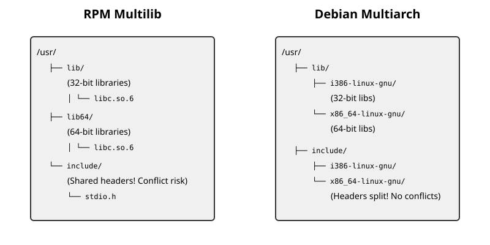

# Multilib і multiarch: два комплекти бібліотек в одній ієрархії

<preknowlist>
- [Концепції ядра Linux](book:unix-linux/kernel-and-userspace) — базові поняття системних викликів та VFS.
</preknowlist>

Під час еволюції комп'ютерних систем часто виникають ситуації, коли нова апаратна архітектура повинна підтримувати виконання програм, скомпільованих для попередньої. Найвідомішим прикладом такого переходу є міграція з 32-бітної архітектури x86 на 64-бітну архітектуру x86_64 (відому також як AMD64). Ця міграція вимагала від операційних систем Unix та Linux здатності паралельно виконувати як 64-бітні, так і 32-бітні програми на одному ядрі.

Однак, щоб запустити 32-бітний виконуваний файл, системі недостатньо лише підтримки з боку ядра (наприклад, сумісності на рівні системних викликів, відомої як `ia32_emulation` у Linux). Програмі потрібні 32-бітні версії всіх динамічних бібліотек, від яких вона залежить, починаючи з базової `libc` і закінчуючи високорівневими бібліотеками графічних інтерфейсів на кшталт GTK чи Qt. 

У цій статті ми детально розглянемо два концептуально різні підходи до розв'язання проблеми співіснування різних архітектур бібліотек в одній системі: **Multilib** (використовується переважно в RPM-базованих дистрибутивах) та **Multiarch** (стандарт, розроблений спільнотою Debian).


*Рис. 1. Порівняння розташування файлів у Multilib та Multiarch.*

## 1. Історичний контекст та суть проблеми

Історично склалося так, що в Unix-подібних операційних системах динамічні бібліотеки розташовуються у фіксованих директоріях, таких як `/lib` та `/usr/lib`. Відповідно до стандарту Filesystem Hierarchy Standard (FHS), ці директорії є основним місцем для встановлення shared objects (`.so` файлів). 

Коли 64-бітні системи почали ставати стандартом, перед розробниками дистрибутивів постала серйозна архітектурна проблема: 
- 64-бітним програмам потрібні 64-бітні бібліотеки.
- 32-бітним програмам потрібні 32-бітні бібліотеки.
- 64-бітна і 32-бітна бібліотека часто мають однакову назву файлу, наприклад `libc.so.6`.

Очевидно, що ми не можемо помістити два файли з однаковим ім'ям у директорію `/usr/lib`. Більш того, пакети програмного забезпечення містять не лише бібліотеки. Вони включають конфігураційні файли, документацію, виконувані утиліти, а також заголовні файли (`.h` файли у директорії `/usr/include`), які необхідні для компіляції інших програм, що залежать від цих бібліотек.

Співіснування пакетів двох різних архітектур викликає такі виклики:
1. **Конфлікти шляхів бібліотек:** Як розділити `.so` файли?
2. **Конфлікти заголовних файлів:** 32-бітна і 64-бітна версії заголовних файлів можуть відрізнятися (наприклад, визначення розмірів типів `size_t` або вказівників). Як дозволити розробнику компілювати код під обидві архітектури, маючи лише один каталог `/usr/include`?
3. **Конфлікти конфігурацій та виконуваних файлів:** Деякі бібліотеки встановлюють утиліти на кшталт `*-config` (наприклад, `libpng-config`), які видають прапорці компілятора. 32-бітна версія скрипта видаватиме одні шляхи, 64-бітна - інші.
4. **Управління пакунками (Package Management):** Як пакетний менеджер повинен розуміти, що користувач хоче встановити 32-бітну бібліотеку в 64-бітній системі, і як коректно розв'язати залежності?

## 2. Підхід Multilib: Традиція RPM-дистрибутивів

Підхід **Multilib** був розроблений першим, оскільки потреба у зворотній сумісності виникла негайно під час релізу перших 64-бітних процесорів (таких як AMD Opteron та Athlon 64, а також Intel Itanium). Цей підхід був швидко прийнятий у дистрибутивах на базі RPM (Red Hat Enterprise Linux, Fedora, SUSE, CentOS тощо).

### Принцип поділу директорій

Ідея Multilib полягає у фізичному розділенні шляхів на базі "розрядності" (бітності) системи. 
- Директорії `/lib` та `/usr/lib` резервуються для **32-бітних** бібліотек.
- Створюються нові директорії `/lib64` та `/usr/lib64`, які використовуються виключно для **64-бітних** бібліотек.

Таким чином, якщо ви встановлюєте пакет `glibc`, система встановлює 64-бітну версію `libc.so.6` у `/lib64/libc.so.6`. Якщо після цього ви встановлюєте 32-бітну версію `glibc`, її файл потрапляє у `/lib/libc.so.6`.

### Управління пакунками у Multilib

У пакетних менеджерах на зразок `yum` або `dnf`, архітектура пакунка зазвичай додається як суфікс до імені. Наприклад:
```bash
dnf install zlib.x86_64
dnf install zlib.i686
```
Тут `x86_64` означає 64-бітну архітектуру, а `i686` — 32-бітну. 

Пакетний менеджер відстежує ці пакети як дві паралельні сутності. Коли встановлюється 32-бітний пакет на 64-бітну систему, `dnf` автоматично завантажує всі 32-бітні залежності.

### Проблема спільних файлів (Shared Files)

Найбільшим недоліком Multilib є обробка файлів, які не є бібліотеками, тобто тих, що розміщуються у `/usr/bin`, `/usr/share`, `/etc` та `/usr/include`.

Оскільки ці директорії не розділені на `bin64` чи `include64`, пакетний менеджер RPM стикається з конфліктом: два пакунки (наприклад, `zlib.x86_64` і `zlib.i686`) намагаються встановити файли з однаковими іменами та шляхами.

В RPM це вирішується на рівні правил збирання пакунків (packaging guidelines):
1. **Точний збіг:** Якщо файл у 32-бітному і 64-бітному пакунку **абсолютно ідентичний** (наприклад, файл ліцензії в `/usr/share/doc`, або man-сторінка), RPM дозволяє обом пакункам "володіти" цим файлом. Файл записується на диск лише один раз, і система не видає помилку конфлікту.
2. **Розбіжності у виконуваних файлах:** Якщо утиліта компілюється для різних архітектур (наприклад, бінарний файл у `/usr/bin`), дистрибутиви зазвичай збирають пакети так, щоб 32-бітні утиліти взагалі не встановлювалися з пакета `i686`, залишаючи лише 64-бітну версію. Якщо 32-бітна версія утиліти критично важлива, їй дають інше ім'я (наприклад, `wine` та `wine64`).
3. **Обгортки (Wrappers) для заголовних файлів:** Це найболючіше місце Multilib. Якщо заголовний файл відрізняється для 32 і 64 біт, сумісний пакет не може просто перезаписати його. Натомість мейнтейнери пакунків створюють хитрий трюк — файл-обгортку. 

Наприклад, оригінальний `/usr/include/asm/types.h` перейменовується. 32-бітна версія стає `/usr/include/asm/types-i386.h`, а 64-бітна — `/usr/include/asm/types-x86_64.h`. Після цього створюється новий `/usr/include/asm/types.h`, який виглядає приблизно так:

```c
#include <bits/wordsize.h>

#if __WORDSIZE == 32
# include <asm/types-i386.h>
#elif __WORDSIZE == 64
# include <asm/types-x86_64.h>
#else
# error "Unknown word size"
#endif
```

Цей підхід працює, але він **надзвичайно трудомісткий** для мейнтейнерів дистрибутиву. Кожен такий конфлікт доводиться вирішувати вручну.

## 3. Підхід Multiarch: Радикальне рішення Debian

Спільнота Debian завжди стикалася з більшим розмаїттям архітектур, ніж корпоративні дистрибутиви. Debian підтримує не лише x86 та x86_64, але й ARM, PowerPC, MIPS, SPARC та багато інших. Потреба у крос-компіляції (компіляції програм для ARM на потужному x86_64 сервері) була дуже високою.

Підхід Multilib з його `/lib64` та `/lib32` швидко виявився непрактичним. Що робити, якщо ви хочете встановити бібліотеки для `armhf` (32-бітний ARM), `aarch64` (64-бітний ARM), `mips` та `powerpc` одночасно? Створювати `/lib-armhf`, `/lib-aarch64`? Це призвело б до хаосу в стандарті FHS.

Тому розробники Debian запропонували ініціативу **Multiarch**. Її суть полягає у тому, щоб повністю позбутися архітектурно-залежних директорій верхнього рівня (`/lib64`), і натомість групувати бібліотеки за спеціальними ідентифікаторами архітектур — **триплетами**.

### Архітектурні триплети (Architecture Triplets)

Триплет GNU (GNU triplet) — це рядок, який описує цільову платформу компілятора, зазвичай у форматі `<cpu>-<vendor>-<os>` або `<cpu>-<vendor>-<kernel>-<os>`. Наприклад:
- `x86_64-linux-gnu` (64-бітний Intel/AMD з ядром Linux та бібліотекою GNU libc)
- `i386-linux-gnu` (32-бітний Intel/AMD)
- `arm-linux-gnueabihf` (32-бітний ARM з апаратним обчисленням з плаваючою комою)
- `aarch64-linux-gnu` (64-бітний ARM)

У парадигмі Multiarch, усі динамічні бібліотеки переміщуються з `/usr/lib` у спеціалізовані підкаталоги, названі за цими триплетами.
- `/usr/lib/x86_64-linux-gnu/libc.so.6`
- `/usr/lib/i386-linux-gnu/libc.so.6`

Директорія `/usr/lib` залишається лише для скриптів, незалежних від архітектури плагінів та внутрішніх даних програм. Аналогічна трансформація відбувається і з `/lib`, і, що найважливіше, з `/usr/include`!

Заголовні файли, які залежать від архітектури, встановлюються в:
- `/usr/include/x86_64-linux-gnu/`
- `/usr/include/i386-linux-gnu/`

### Як це працює на практиці

Щоб Multiarch працював, потрібна була масштабна модифікація базового інструментарію:
1. **Динамічний лінкер (ld.so):** Повинен знати, що йому треба шукати бібліотеки у `/lib/<triplet>` та `/usr/lib/<triplet>`.
2. **Компілятор (GCC / Clang):** Повинен за замовчуванням включати `/usr/include/<triplet>` у шляхи пошуку заголовних файлів (`include paths`) і шукати бібліотеки в `/usr/lib/<triplet>`.
3. **Пакетний менеджер (dpkg/APT):** Повинен навчитися керувати паралельно встановленими пакетами з однаковими іменами, але різними архітектурами.

В Ubuntu та Debian це робиться надзвичайно елегантно. Спочатку ви додаєте нову архітектуру до бази даних `dpkg`:
```bash
dpkg --add-architecture i386
apt-get update
```

Після цього ви можете встановити пакет для конкретної архітектури, додавши `:i386` до його назви:
```bash
apt-get install libz1:i386
```

APT побачить, що `libz1:amd64` вже встановлено, але оскільки це бібліотека, і файли будуть розкладені по різних триплетних директоріях (одна піде в `x86_64-linux-gnu`, інша в `i386-linux-gnu`), вони не конфліктують. Файли документації будуть ідентичними, і `dpkg` розуміє, що їх можна просто розділити (shared).

### Вирішення проблеми конфліктів у Multiarch

На відміну від Multilib, де мейнтейнери мусять створювати C-препроцесорні обгортки (`#if __WORDSIZE == 32`), Multiarch робить це автоматично на рівні файлової системи. 
Якщо програмісту потрібен заголовний файл `foo.h`, який відрізняється на 32 і 64 бітах, пакет встановлює їх відповідно до триплетів. 

Коли ви викликаєте `gcc -m32 program.c`, компілятор GCC автоматично додає `/usr/include/i386-linux-gnu` до списку пошуку, і знаходить 32-бітну версію `foo.h`. Коли ви викликаєте просто `gcc program.c` (64-бітний режим), він шукає в `/usr/include/x86_64-linux-gnu`. Немає жодної потреби модифікувати самі заголовні файли! Це значно спрощує життя розробникам і мейнтейнерам.

## 4. Крос-компіляція: тріумф Multiarch

Однією з найважливіших переваг Multiarch є безшовна крос-компіляція (cross-compilation). Уявімо, що ви розробляєте програму для Raspberry Pi (ARM) на своєму потужному робочому комп'ютері (x86_64). 

Традиційний шлях вимагав би завантаження спеціального "крос-тулчейна" (cross-toolchain) та величезного середовища `sysroot` — повної копії файлової системи ARM, яка містила б усі необхідні ARM-бібліотеки та заголовні файли. Налаштування шляхів до цього `sysroot` завжди було справжнім головним болем.

З Multiarch ви можете просто встановити бібліотеки ARM прямо у вашу основну файлову систему:
```bash
dpkg --add-architecture armhf
apt-get update
apt-get install libgtk-3-dev:armhf
```

Всі файли розмістяться у `/usr/lib/arm-linux-gnueabihf/` та `/usr/include/arm-linux-gnueabihf/`. Вони ніяк не завадять вашим рідним `x86_64` бібліотекам. Після цього ви встановлюєте крос-компілятор:
```bash
apt-get install gcc-arm-linux-gnueabihf
```

І можете компілювати вашу програму! Крос-компілятор за замовчуванням налаштований на пошук бібліотек і заголовних файлів у відповідних триплет-директоріях.

## 5. Практичні аспекти використання: Wine, Steam та Legacy ПЗ

Найчастіше пересічний користувач стикається з концепціями Multilib або Multiarch тоді, коли йому потрібно запустити специфічне 32-бітне програмне забезпечення.

### Wine (Wine Is Not an Emulator)
Wine дозволяє запускати Windows-програми на Linux. Оскільки більшість старих ігор та корпоративного ПЗ під Windows є 32-бітними, Wine має надати їм 32-бітне середовище Windows (WoW64 або чистий 32-бітний префікс). Для цього сам Wine має бути скомпільований як 32-бітна програма, і йому потрібні 32-бітні Linux-бібліотеки (X11, OpenGL, ALSA/PulseAudio). Саме тому встановлення Wine майже завжди тягне за собою завантаження сотень пакетів `i686` (в RPM) або `:i386` (в Debian/Ubuntu).

### Steam
Компанія Valve випустила клієнт Steam для Linux у 2012 році, і довгий час сам клієнт був виключно 32-бітною програмою. Крім того, величезна бібліотека старих ігор у Steam (як нативних, так і через Proton/Wine) потребує 32-бітних бібліотек. В Ubuntu це вимагає ввімкнення `i386` архітектури. 

У 2019 році компанія Canonical (розробник Ubuntu) викликала справжній резонанс у спільноті, оголосивши про плани заморозити підтримку 32-бітних пакунків (припинити їх оновлення та збирання для нових випусків). Valve відреагувала різко, заявивши, що припинить офіційну підтримку Ubuntu. Під тиском спільноти геймерів та розробників Wine, Canonical відступила і погодилася підтримувати "ретельно відібраний набір" найважливіших 32-бітних бібліотек, необхідних для ігор.

Цей інцидент чудово ілюструє, наскільки глибоко 32-бітне ПЗ вкорінене в екосистему, навіть коли 64-бітне обладнання домінує понад 15 років.

## 6. Майбутнє та альтернативні рішення (Контейнеризація)

Підтримка паралельних архітектур на рівні базової системи (системного пакетного менеджера) є складною. Вона збільшує розмір репозиторіїв дистрибутиву вдвічі, ускладнює роботу мейнтейнерів, збільшує ймовірність конфліктів залежностей (так званий "dependency hell", коли версія 32-бітної бібліотеки відстає від 64-бітної).

Сьогодні індустрія рухається у бік ізоляції додатків. Замість того, щоб встановлювати 32-бітні бібліотеки глобально в `/usr/lib/i386-linux-gnu`, розробники використовують платформи на зразок **Flatpak**, **Snap** або **AppImage**.

У Flatpak, наприклад, додаток працює у своєрідному контейнері і використовує так званий `runtime` (середовище виконання). Steam встановлюється як Flatpak-пакет і тягне за собою власний 32-бітний `runtime` з усіма необхідними бібліотеками (наприклад, `org.freedesktop.Platform.Compat.i386`). Цей runtime міститься у власному ізольованому каталозі і ніяк не взаємодіє з системним менеджером пакунків (APT або DNF). Основна операційна система залишається "чистою" 64-бітною, без єдиної `i686` бібліотеки у глобальних шляхах.

Аналогічно, використання **Docker** або **Podman** дозволяє запускати старий 32-бітний бекенд в ізольованому контейнері з 32-бітним базовим образом (наприклад, Debian i386), який запускається на 64-бітному ядрі хост-машини.

## Висновки

**Multilib** (з `/lib` та `/lib64`) був прагматичним та швидким рішенням, яке дозволило індустрії відносно безболісно пережити перехід від 32 до 64 біт. Він досі чудово працює в дистрибутивах Fedora та RHEL, де кількість підтримуваних архітектур обмежена. Однак він вимагає ручного втручання та хаків для вирішення конфліктів розробницьких файлів.

**Multiarch** (з триплетами `/usr/lib/x86_64-linux-gnu`) — це академічно чисте, елегантне і потужне рішення, яке зробило крос-компіляцію та підтримку довільної кількості архітектур на одній системі стандартною функцією Debian та Ubuntu. Воно вимагало титанічних зусиль для модифікації GCC, dpkg та базових утиліт, але результат став золотим стандартом гнучкості.

З розвитком технологій контейнеризації та Flatpak потреба у глобально встановлених 32-бітних бібліотеках поступово зникає. У майбутньому базові операційні системи стануть повністю одноархітектурними (pure 64-bit), а всі застарілі 32-бітні програми будуть виконуватися у своїх локальних, ізольованих середовищах, завершивши таким чином епоху системного співіснування архітектур.
