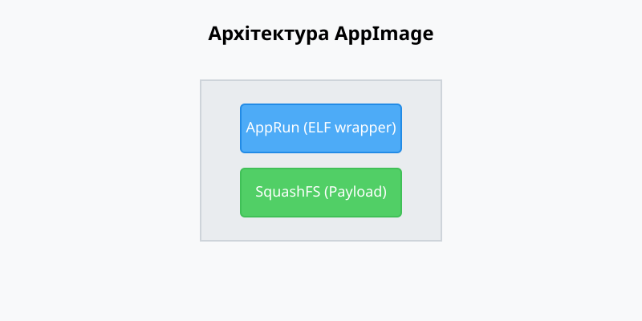
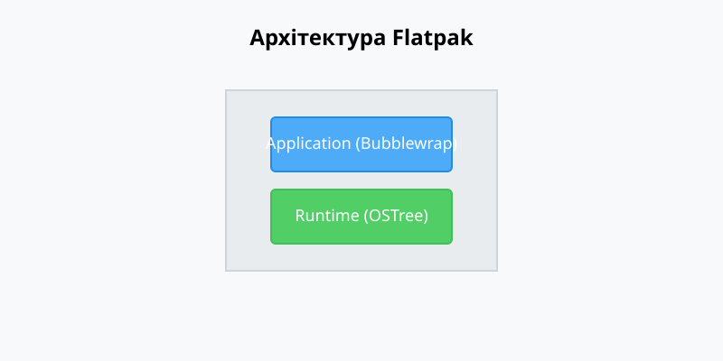
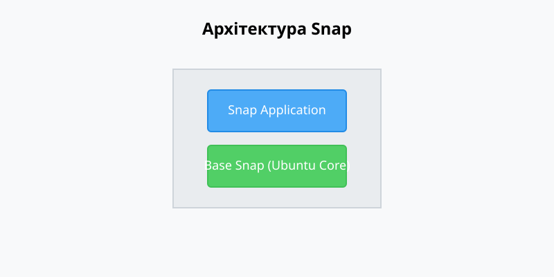

# Самодостатні пакунки: AppImage, Flatpak, Snap

<preknowlist>
- [Концепції ядра Linux](book:unix-linux/kernel-and-userspace) — базові поняття системних викликів та VFS.
</preknowlist>

## 1. Вступ. Еволюція розповсюдження ПЗ в Linux

Історично розповсюдження програмного забезпечення в операційних системах на базі ядра Linux спиралося на централізовані системи керування пакунками (пакетні менеджери), такі як APT (Debian, Ubuntu), DNF/YUM (Red Hat, Fedora), Pacman (Arch Linux) тощо. 

Такий підхід передбачає, що програма розповсюджується у вигляді архіву з метаданими та скомпільованими бінарними файлами (або скриптами), які динамічно лінкуються зі спільними бібліотеками (shared libraries), що вже присутні в операційній системі. 

### 1.1 Переваги та недоліки традиційного підходу

**Переваги:**
* **Економія дискового простору та оперативної пам'яті:** спільні бібліотеки завантажуються в пам'ять лише один раз і використовуються багатьма програмами одночасно.
* **Централізовані оновлення безпеки:** якщо виявляється вразливість у системній бібліотеці (наприклад, glibc або OpenSSL), достатньо оновити її один раз через пакетний менеджер, і всі програми, які від неї залежать, автоматично отримають виправлення.
* **Інтеграція з системою:** програми встановлюються за стандартними шляхами (наприклад, `/usr/bin`, `/usr/lib`), що забезпечує їх природну інтеграцію з середовищем.

**Недоліки (Проблема "Dependency Hell"):**
* **Фрагментація дистрибутивів:** розробникам потрібно створювати та тестувати пакунки для кожного дистрибутива окремо, оскільки версії системних бібліотек різняться.
* **Конфлікти версій:** одна програма може вимагати бібліотеку версії A, тоді як інша – версію B. Встановити обидві програми в одній системі без порушення залежностей може бути складно або неможливо.
* **Складність розгортання:** встановлення пропрієтарного або стороннього ПЗ, якого немає в офіційних репозиторіях, часто перетворюється на виклик для звичайного користувача.

### 1.2 Відповідь на виклики: Самодостатні пакунки

Для подолання цих проблем виникла концепція **самодостатніх пакунків (self-contained bundles)**. Ідея полягає в тому, щоб включити всі необхідні для роботи програми залежності (бібліотеки, ресурси, конфігурації) безпосередньо в сам пакунок, ізолювавши його від базової операційної системи.

Сучасні лідери цього напрямку:
1. **AppImage** (найпростіший підхід, один файл = одна програма).
2. **Flatpak** (орієнтований на десктопні застосунки, використовує пісочницю та розподілені рантайми).
3. **Snap** (розробка Canonical, підтримує як десктопне, так і серверне ПЗ, використовує жорстку ізоляцію).

---

## 2. Принципи роботи самодостатніх пакунків

Незважаючи на різні підходи, AppImage, Flatpak та Snap використовують схожі технології на рівні ядра Linux для забезпечення ізоляції та портативності:

* **Монтажування (Mount namespaces):** пакунки зазвичай розповсюджуються як стиснуті образи файлових систем (часто SquashFS). Замість того, щоб розпаковувати їх на диск, система монтує ці образи (через loop-пристрої або FUSE) у специфічні директорії під час запуску програми.
* **Пісочниця (Sandboxing):** за допомогою механізмів ядра, таких як `cgroups` (control groups), `namespaces` (простори імен для PID, IPC, Network, Mount) та `seccomp` (обмеження системних викликів), програми обмежуються в доступі до ресурсів хост-системи.
* **Портали (Portals):** оскільки програма ізольована, їй потрібен безпечний спосіб взаємодії з системою (наприклад, відкриття файлу, захоплення екрана, доступ до камери). Для цього використовуються D-Bus інтерфейси, які делегують ці операції системним компонентам.
* **Рантайми (Runtimes):** щоб не дублювати базові бібліотеки (наприклад, glibc, базовий графічний стек) у кожному пакунку, Flatpak та Snap використовують концепцію спільних базових середовищ, які монтуються разом з програмою.

---

## 3. AppImage

**AppImage** — це формат розповсюдження портативних застосунків для Linux. Його девіз: "Один застосунок — один файл".

### 3.1 Архітектура AppImage



Файл з розширенням `.appimage` — це насправді самомонтувальний образ файлової системи.

**Компоненти AppImage:**
1. **AppRun (ELF wrapper):** невелика програма-обгортка, яка прикріплена до початку файлу. При запуску файлу ядро Linux виконує цей ELF-файл.
2. **SquashFS:** після ELF-заголовка йде стиснутий образ файлової системи SquashFS, який містить власне програму, її залежності та ресурси.

**Процес запуску:**
1. Користувач завантажує файл і робить його виконуваним (`chmod +x app.AppImage`).
2. При запуску виконується `AppRun`.
3. `AppRun` використовує FUSE (Filesystem in Userspace) або `squashfuse`, щоб змонтувати SquashFS-частину файлу в тимчасову директорію (наприклад, `/tmp/.mount_appxyz`).
4. Потім `AppRun` встановлює необхідні змінні середовища (наприклад, `LD_LIBRARY_PATH`, щоб вказати на бібліотеки всередині змонтованого образу) і запускає основний бінарний файл програми з цієї тимчасової директорії.
5. Після завершення роботи програми образ демонтується, а тимчасова директорія видаляється.

### 3.2 Переваги AppImage

* **Справжня портативність:** програма працює без встановлення. Її можна запускати з USB-накопичувача, завантажити і одразу використовувати.
* **Відсутність вимог до root-прав:** для запуску AppImage не потрібні привілеї адміністратора, оскільки використовується FUSE.
* **Простота управління:** щоб видалити програму, достатньо просто видалити файл `.appimage`.
* **Децентралізація:** розробники можуть розповсюджувати AppImage безпосередньо зі своїх сайтів або GitHub Releases без необхідності реєстрації в центральних репозиторіях.

### 3.3 Недоліки AppImage

* **Відсутність пісочниці за замовчуванням:** програма має повний доступ до файлової системи та мережі від імені користувача, який її запустив (хоча можна використовувати сторонні утиліти на кшталт Firejail для створення пісочниці).
* **Проблеми з інтеграцією:** AppImage не створює автоматично ярлики в меню програм. Потрібні додаткові демони (наприклад, `appimaged` або `AppImageLauncher`), щоб інтегрувати їх у Desktop Environment.
* **Оновлення:** формат має вбудовану систему дельта-оновлень (через `appimageupdate`), але її імплементація залежить від розробника. Часто користувачам доводиться завантажувати новий файл цілком.
* **Розмір файлу:** оскільки кожен файл повинен містити більшість залежностей, загальний обсяг дискового простору збільшується, якщо у вас багато AppImage програм.

---

## 4. Flatpak

**Flatpak** (раніше відомий як xdg-app) — це фреймворк для розповсюдження десктопних застосунків в Linux, який акцентує увагу на безпеці (через пісочниці) та усуненні дублювання залежностей.

### 4.1 Архітектура Flatpak



Технологічний стек Flatpak складніший, ніж у AppImage, і базується на кількох ключових технологіях:

1. **OSTree:** система керування версіями для бінарних файлів, подібна до Git. OSTree дозволяє ефективно завантажувати лише змінені файли під час оновлення і зберігати різні версії рантаймів і програм з дедуплікацією даних на диску.
2. **Bubblewrap (bwrap):** утиліта командного рядка для створення пісочниць. Вона використовує простори імен (namespaces) ядра Linux для створення ізольованого середовища. 
3. **Рантайми (Runtimes) та SDK:** щоб не пакувати базові системні бібліотеки (наприклад, GNOME, KDE, Freedesktop) з кожною програмою, Flatpak використовує рантайми. Застосунок залежить від певного рантайму. Якщо кілька застосунків використовують один рантайм, він завантажується лише один раз.
4. **XDG Desktop Portals:** механізм для безпечної взаємодії ізольованої програми з хост-системою через D-Bus.

**Процес запуску:**
1. При запуску програми через Flatpak (наприклад, `flatpak run org.gimp.GIMP`), створюється пісочниця за допомогою Bubblewrap.
2. У цю пісочницю монтується коренева файлова система, яка складається з відповідного Runtime (доступного лише для читання).
3. Поверх неї монтується файлова система самого застосунку (App).
4. Програма має доступ лише до своєї ізольованої директорії конфігурації (в `~/.var/app/`) і не бачить інших файлів хост-системи, якщо це явно не дозволено.

### 4.2 Переваги Flatpak

* **Безпека:** сувора ізоляція обмежує шкоду від вразливостей. Користувач може гранулярно налаштовувати дозволи (доступ до камери, мікрофона, конкретних тек) за допомогою утиліт типу Flatseal.
* **Економія місця:** завдяки використанню спільних рантаймів та OSTree-дедуплікації, кілька програм можуть спільно використовувати гігабайти базових бібліотек.
* **Централізований репозиторій:** Flathub став де-факто стандартом для пошуку та встановлення Flatpak застосунків. Це забезпечує зручність, подібну до магазинів додатків (App Store).
* **Ідеальна інтеграція:** Flatpak автоматично створює ярлики (`.desktop` файли), іконки, експортує D-Bus сервіси, тому застосунки виглядають і працюють як нативні.
* **Фокус на десктоп:** технологія оптимізована саме для графічних застосунків і чудово працює з Wayland та PipeWire.

### 4.3 Недоліки Flatpak

* **Складність для серверного ПЗ:** Flatpak не призначений для фонових системних служб, демонів чи консольних утиліт.
* **Великі початкові завантаження:** при встановленні першої програми може знадобитися завантажити масивний Runtime (наприклад, GNOME Platform на кілька гігабайт).
* **Складність пакування:** створення Flatpak-маніфесту вимагає розуміння залежностей і налаштування дозволів, що складніше, ніж створення простого архіву.
* **Продуктивність графіки:** інтеграція графічних драйверів (особливо NVIDIA) вимагає спеціальних розширень рантайму, що іноді призводить до багів після оновлення ядра хост-системи.

---

## 5. Snap

**Snap** (або Snappy) — це система розгортання та керування пакунками, розроблена компанією Canonical (розробником Ubuntu). На відміну від Flatpak, Snap позиціонується як універсальне рішення для десктопів, серверів, хмарних систем та IoT-пристроїв.

### 5.1 Архітектура Snap



Пакунок Snap (`.snap` файл) є образом файлової системи SquashFS, який ніколи не розпаковується.

1. **Snapd:** фоновий демон (systemd сервіс), який керує встановленням, оновленням, монтуванням та виконанням snap-пакунків.
2. **SquashFS та Loop Mounts:** кожен встановлений snap монтується snapd як loop-пристрій у режимі "тільки для читання" в директорію `/snap/`.
3. **AppArmor та Seccomp:** для забезпечення ізоляції snapd динамічно генерує профілі AppArmor і seccomp-фільтри для кожного застосунку.
4. **Base Snaps:** подібно до рантаймів Flatpak, Snap використовує базові образи (наприклад, `core20`, `core22`), які містять мінімальне середовище Ubuntu відповідної версії.

**Процес запуску:**
1. При інсталяції `snapd` перевіряє криптографічні підписи та завантажує `.snap` файл.
2. Файл монтується через `/dev/loop` у `/snap/<назва_програми>/<версія>/`.
3. Створюються необхідні `bind mounts` (для домашньої директорії, специфічних ресурсів) відповідно до системи "інтерфейсів" (plugs & slots) Snap.
4. При запуску програма обмежується згенерованим профілем AppArmor. 

**Рівні ізоляції (Confinements):**
* **Strict:** програма повністю ізольована. Вона не має доступу до системи або інших програм без явного підключення відповідних інтерфейсів.
* **Classic:** програма має майже повний доступ до хост-системи (подібно до звичайного `.deb` або `.rpm` пакунка). Цей режим часто використовується для IDE, компіляторів та системних інструментів, яким потрібно бачити файлову систему цілком.
* **Devmode:** використовується розробниками для тестування (ізоляція відключена).

### 5.2 Переваги Snap

* **Універсальність:** підтримує будь-яке програмне забезпечення — від графічних застосунків (Spotify, Slack) до баз даних, хмарних CLI (AWS CLI) та системних демонів (Nextcloud, LXD).
* **Автоматичні фонові оновлення:** snapd автоматично перевіряє і встановлює оновлення у фоновому режимі (цю функцію можна налаштувати, але її важко повністю вимкнути, що є предметом дискусій).
* **Можливість відкату (Rollback):** система зберігає попередню версію пакунка, що дозволяє швидко відкотитися у разі проблем після оновлення (`snap revert`).
* **Classic confinement:** дозволяє пакувати програми, які технічно неможливо ізолювати (наприклад, VS Code або Docker).

### 5.3 Недоліки Snap

* **Швидкість запуску (Cold boot time):** через особливості розпакування стиснутих файлів SquashFS і налаштування AppArmor, перший запуск (cold start) важких застосунків (наприклад, Firefox) може бути помітно повільнішим.
* **Залежність від Canonical:** серверна частина (Snap Store) є пропрієтарною і належить Canonical. Створити власний повноцінний репозиторій складно.
* **Засмічення системи:** використання безлічі loop-пристроїв призводить до того, що вивід команди `lsblk` або `df -h` стає перевантаженим.
* **Фокус на Ubuntu:** хоча snap працює на інших дистрибутивах (Arch, Fedora), найкраще він оптимізований під Ubuntu з її специфічною імплементацією AppArmor.

---

## 6. Порівняння: AppImage vs Flatpak vs Snap

| Характеристика | AppImage | Flatpak | Snap |
| :--- | :--- | :--- | :--- |
| **Цільова аудиторія** | Десктоп, портативність | Десктопні програми | Десктоп, Сервери, IoT, CLI |
| **Формат розповсюдження** | 1 файл (завантаж і запусти) | Репозиторії (OSTree) | Репозиторії (Snap Store) |
| **Ізоляція (Пісочниця)** | Ні (за замовчуванням) | Так (Bubblewrap, жорстка) | Так (AppArmor, є Classic режим) |
| **Рантайми / Дедуплікація** | Ні (все у файлі) | Так (Shared Runtimes) | Так (Base Snaps) |
| **Root-права для роботи** | Ні | Ні (можна ставити `--user`) | Потрібні для демона snapd |
| **Інтеграція з Desktop** | Ручна або через сторонні тулзи | Відмінна (Portals, Icons) | Добра |
| **Централізований Store** | Немає (децентралізовано) | Flathub (відкритий стандарт) | Snap Store (пропрієтарний) |

---

## 7. Практичні приклади та розробка

### 7.1 Створення AppImage (appimagetool)

Для створення AppImage розробник зазвичай готує директорію (`AppDir`), яка містить структуру файлової системи програми:
```bash
# Структура AppDir
MyApp.AppDir/
├── AppRun
├── myapp.desktop
├── myapp.png
└── usr
    ├── bin
    │   └── myapp
    └── lib
        └── libdependent.so
```
Далі використовується утиліта `appimagetool` для генерації кінцевого файлу:
```bash
appimagetool MyApp.AppDir/ MyApp-x86_64.AppImage
```

### 7.2 Створення Flatpak (flatpak-builder)

Пакування у Flatpak відбувається декларативно за допомогою маніфестів (JSON або YAML).
Приклад `org.example.MyApp.json`:
```json
{
    "app-id": "org.example.MyApp",
    "runtime": "org.gnome.Platform",
    "runtime-version": "43",
    "sdk": "org.gnome.Sdk",
    "command": "myapp",
    "modules": [
        {
            "name": "myapp",
            "buildsystem": "meson",
            "sources": [
                {
                    "type": "git",
                    "url": "https://github.com/example/myapp.git"
                }
            ]
        }
    ]
}
```
Збирання та встановлення:
```bash
flatpak-builder build-dir org.example.MyApp.json --force-clean
flatpak-builder --user --install build-dir org.example.MyApp.json
```

### 7.3 Створення Snap (snapcraft)

Snap використовує файл `snapcraft.yaml`. Він розбиває програму на "parts" (частини).
Приклад:
```yaml
name: myapp
version: '1.0'
summary: My awesome application
description: |
  Longer description of the application.
base: core22
confinement: strict

apps:
  myapp:
    command: bin/myapp

parts:
  myapp:
    plugin: dump
    source: .
```
Збирання відбувається командою:
```bash
snapcraft
```

---

## 8. Висновок

Еволюція від традиційних RPM/DEB пакунків до AppImage, Flatpak та Snap вирішила багато проблем дистрибуції ПЗ в екосистемі Linux. Розробникам більше не потрібно витрачати ресурси на підтримку десятків дистрибутивів.

* Якщо ви хочете надати користувачам **максимально простий спосіб** запустити програму без встановлення (portable) — вибирайте **AppImage**.
* Якщо ваша ціль — сучасний **десктопний застосунок** із суворою безпекою, інтеграцією в GNOME/KDE та доступом через централізований Flathub — найкращим вибором є **Flatpak**.
* Якщо ви розробляєте **серверне ПЗ, CLI-утиліти**, або специфічне програмне забезпечення, що потребує глибокого доступу до системи (IDE), і хочете забезпечити автоматичні оновлення — використовуйте **Snap**.

Ці формати не замінюють традиційні системні пакети, які залишаються ідеальними для базових компонентів ОС (ядро, драйвери, системні демони), але вони стали стандартом де-факто для розповсюдження користувацьких програм.
