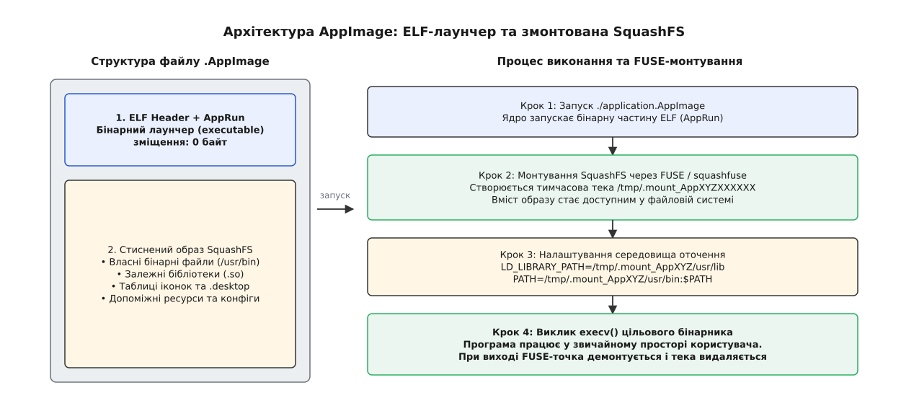
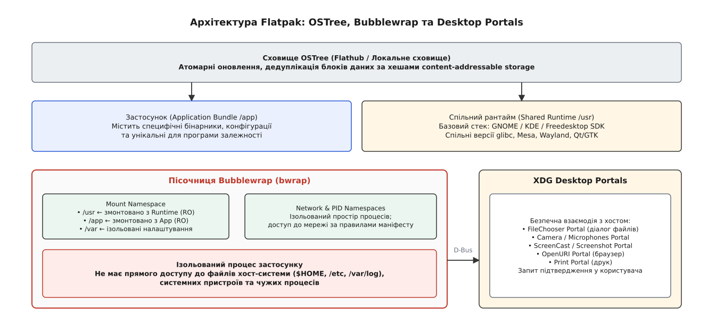
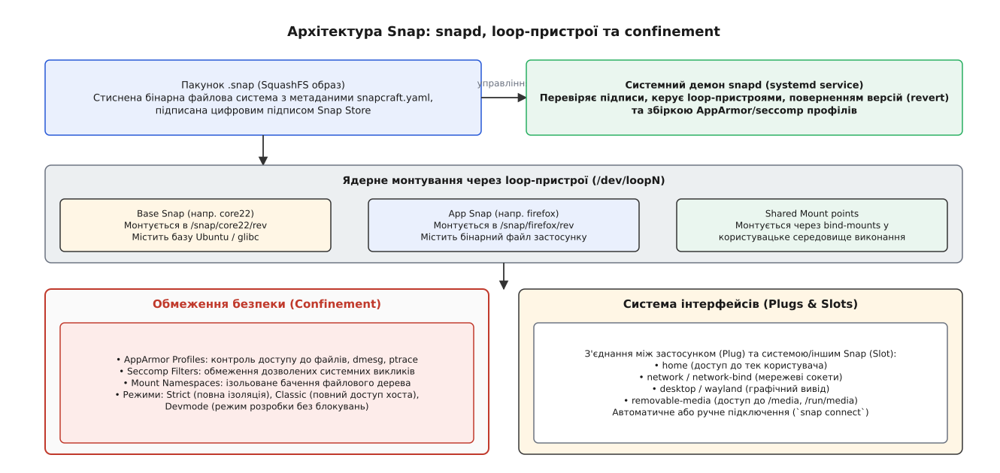

# Самодостатні пакунки: AppImage, Flatpak, Snap

<preknowlist>
- [Модель пакетних менеджерів](topic:unix-linux/package-manager-model) — принципи збирання, управління залежностями та розміщення файлів у FHS.
- [Простори імен](topic:unix-linux/namespaces) — механізми ядра Linux для ізоляції процесів, файлових систем та ресурсів.
</preknowlist>

Спроба запустити у середовищі Ubuntu 20.04 сучасно зкомпільований графічний редактор, що вимагає версію `glibc 2.35`, завершується фатальною помилкою динамічного завантажувача: `libc.so.6: version 'GLIBC_2.35' not found`. Оновлення базової системної бібліотеки `glibc` вручну або з чужих репозиторіїв з високою ймовірністю виведе з ладу саму операційну систему, оскільки сотні системних бінарників зв'язані з поточним ABI ядра та системної C-бібліотеки.

Класична файлова ієрархія Linux (Filesystem Hierarchy Standard, FHS) передбачає, що всі програми ділять між собою єдиний набір системних бібліотек у теках `/lib` та `/usr/lib`. Така архітектура забезпечує мінімальне споживання оперативної пам'яті та дискового простору, проте перетворює розгортання стороннього або нового ПЗ на ризикований процес, відомий як «пекло залежностей» (Dependency Hell). Відповіддю на цей архітектурний виклик стала концепція **самодостатніх пакунків (self-contained bundles)**: пакування застосунку разом з усіма його залежностями в ізольований контейнер чи автономний файл.

## Від динамічних бібліотек до самодостатніх бандлів: чому FHS дав збій

У традиційних системних пакувальниках (`.deb`, `.rpm`, `.pkg.tar.zst`) розповсюдження ПЗ базується на припущенні, що дистрибутив гарантує наявність сумісних версій усіх бінарних бібліотек у загальнодоступних каталогах операційної системи.

Коли програма розповсюджується через системні репозиторії дистрибутива, сумісність підтримується командою мейнтейнерів. Проте коли розробник намагається надати бінарну версію застосунку безпосередньо користувачам без залучення репозиторіїв, виникають три фундаментальні проблеми:
1. **Фрагментація дистрибутивів:** Випуски Ubuntu, Debian, Fedora, Arch Linux та openSUSE містять різні версії системних бібліотек (`libssl`, `libpng`, `libxml2`, `glibc`).
2. **Каскадна деструкція залежностей:** Спроба встановити нову версію системної бібліотеки для одного застосунку може вимагати видалення старішої версії, від якої залежать десятки інших системних утиліт.
3. **Відсутність прав root у звичайного користувача:** Встановлення пакунків у каталоги `/usr/bin` та `/usr/lib` вимагає прав адміністратора, що робить неможливим запуск ПЗ у корпоративних чи навчальних середовищах із обмеженим доступом.

Детальніше про двадцятирічну історію розвитку альтернативних підходів розгортання ПЗ у Linux та перші спроби подолання FHS можна прочитати у вставці [Історія виникнення концепції самодостатніх пакунків](topic:unix-linux/self-contained-bundles/hist-bundle-formats.md).

## Механіка динамічного лінкування та проблема сумісності glibc

Щоб зрозуміти, чому звичайний бінарний файл не запускається на іншому дистрибутиві, розглянемо роботу системного завантажувача dynamic linker (`ld-linux.so`). При старті ELF-виконуваного файлу ядро зчитує заголовок `.interp` і передає керування завантажувачу.

Завантажувач аналізує заголовки ELF і шукає динамічні бібліотеки у такому суворому порядку:
1. Каталоги, вказані у секції `DT_RPATH` бінарного файлу (якщо відсутній `DT_RUNPATH`).
2. Каталоги із системної змінної середовища `LD_LIBRARY_PATH`.
3. Каталоги, вказані у секції `DT_RUNPATH`.
4. Системний кеш бібліотек `/etc/ld.so.cache`.
5. Стандартні системні каталоги `/lib64` та `/usr/lib64`.

Головним бар'єром сумісності є C-бібліотека `glibc`. Вона використовує суворе версіонування символів (symbol versioning). Якщо бінарний файл зкомпільовано на новішій системі, він міститиме виклики символів вида `memcpy@@GLIBC_2.14` або `pow@@GLIBC_2.29`. При спробі запуску на старішій системі завантажувач відмовиться зв'язувати програму, навіть якщо сама функція існує під іншою імплементацією.

Крім того, розробники часто зіштовхуються із проблемою розбіжностей ABI C++ Standard Library (`libstdc++.so.6`), де використання нових фреймворків чи стандарту C++20 вимагає специфічних версій символів `GLIBCXX_3.4.29`. Спроба підкинути системну `libstdc++.so` з нового дистрибутива у старий може зламати виклики через системні бібліотеки хоста, які розраховують на стару версію.

Макрозмінна `$ORIGIN` у ELF-секціях `DT_RUNPATH` дозволяє вказати динамічному завантажувачу відносний шлях до бібліотек відносно розташування виконуваного файлу:
```
DT_RUNPATH = $ORIGIN/../lib
```

Завдяки цьому механізму самодостатні пакунки вирішують проблему сумісності інверсією контролю: вони пакують власні версії `.so`-бібліотек і налаштовують змінні `LD_LIBRARY_PATH` або `DT_RUNPATH` з використанням змінної `$ORIGIN`, яка вказує завантажувачу шукати бібліотеки у теці самого пакунка.

## Ядерні механізми забезпечення автономності та пісочниці

Сучасні самодостатні пакунки спираються на фундаментальні можливості ядра Linux для монтування файлових систем та обмеження прав процесів. Без цих ядерних механізмів ізольований запуск бандлів був би неможливим.

### 1. Простори імен (Mount Namespaces) та pivot_root

Системний виклик `unshare(CLONE_NEWNS)` дозволяє процесу створити власну приватну таблицю монтажу файлової системи. Будь-які мотування образотворчих точок усередині цього простору не бачні іншим процесам хост-системи.

За допомогою системного виклику `pivot_root()` або комбінації bind-mounts лаунчер переставляє корінь файлової системи так, що ізольована програма бачить власне дерево каталогу, де `/usr/lib` вказує на бібліотеки бандла, а не на бібліотеки хост-ОС. На відміну від застарілого `chroot()`, `pivot_root()` повністю змінює корінь мотування в Mount Namespace, унеможливлюючи втечу з пісочниці через відкриті файлові дескриптори.

Для забезпечення безпеки без прав root лаунчери (наприклад, `bubblewrap`) комбінують Mount Namespace із User Namespaces (`CLONE_NEWUSER`), що дозволяє звичайному користувачеві виконувати операції `mount(MS_BIND)` у приватному просторі імен.

### 2. Стиснені файлові системи SquashFS

Пакунки AppImage та Snap розповсюджуються у вигляді стиснених образів файлової системи SquashFS. SquashFS забезпечує високий коефіцієнт стиснення (використовуючи алгоритми `xz`, `gzip` або `zstd`) і є доступною лише для читання (read-only). Це гарантує цілісність бандла: програма не може випадково або навмисно модифікувати власні бінарники чи бібліотеки.

При каскадному читанні сторінок пам'яті з SquashFS ядро Linux завантажує стиснені блоки розміром від 4 КБ до 1 МБ у сторінковий кеш (Page Cache). Завдяки цьому повторний запуск програм з SquashFS відбувається практично миттєво, оскільки розпаковані сторінки залишаються в оперативній пам'яті хоста.

### 3. FUSE та loop-пристрої

Для доступу до вмісту SquashFS-образу використовуються два підходи:
* **FUSE (Filesystem in Userspace):** Дозволяє монтувати файлові системи без прав адміністратора (root). Використовується в AppImage через утиліту `squashfuse`. Утиліта FUSE перехоплює системні виклики `read()` та `readdir()` через пристрій `/dev/fuse` і передає їх у користувацький процес лаунчера.
* **Loop-пристрої (`/dev/loopN`):** Ядерний механізм монтування файлу як блочного пристрою. Використовується демоном `snapd` і вимагає прав root під час монтування. Операції зчитування обробляються безпосередньо ядерними підсистемами VFS та блочного I/O, що забезпечує високу швидкість обробки файлових операцій.

### 4. Обмеження системних викликів (seccomp) та AppArmor

Для унеможливлення компрометації хост-системи через вразливість у бандлі, виконання програми обмежується за допомогою `seccomp` (Secure Computing Mode). `seccomp` за допомогою фільтрів BPF (Berkeley Packet Filter) перехоплює системні виклики процесу і блокує небезпечні операції (наприклад, `ptrace`, `kexec_load`, прямий доступ до системних пристроїв). 

У Snap для цього додатково застосовуються динамічно згенеровані профілі AppArmor. Під час запуску ізольованого snap-пакунка `snapd` формує профіль AppArmor у каталозі `/var/lib/snapd/apparmor/profiles/snap.name.app`, який явно описує маску дозволених шляхів читання та запису. Крім того, лаунчери застосовують виклик `prctl(PR_SET_NO_NEW_PRIVS, 1, 0, 0, 0)`, що гарантує неможливість підвищення привілеїв процесу через бінарники із встановленим прапором SUID.

### 5. D-Bus та XDG Desktop Portals

Оскільки ізольована програма не бачить домашньої теки користувача або пристроїв хоста, вона не може відкрити діалог вибору файлу чи отримати доступ до веб-камери. Для вирішення цього конфлікту створено **XDG Desktop Portals** — системний сервіс, що надає D-Bus інтерфейси (`org.freedesktop.portal.*`). 

Коли програма всередині пісочниці хоче відкрити файл, вона надсилає D-Bus запит порталу `org.freedesktop.portal.FileChooser`. Системний портал хоста показує нативний діалог вибору файлу користувачеві, і після підтвердження передає відкритий файловий дескриптор (File Descriptor Passing) через UNIX-сокет назад у пісочницю. Програма отримує доступ лише до обраного файлу, не бачачи решти файлової системи хоста.

## AppImage: один бінарний файл, FUSE та ELF-лаунчер

Формат **AppImage** реалізує найпростішу та найбільш автономну концепцію: «Один застосунок = один файл». Завантажений `.appimage` файл не вимагає встановлення, інсталяторів чи системних демонів.


*Будова самомонтувального бінарного бандла AppImage: ELF-заголовок з AppRun та зсунутий SquashFS-образ, що монтується через FUSE.*

### Архітектура та процес виконання AppImage

Файл з розширенням `.appimage` (формат Type 2) є гібридним бінарним файлом:
1. **ELF-заголовок та AppRun (зсув 0):** Перші кілька десятків кілобайт файлу є стандартним виконуваним ELF-бінарником. Цей бінарник є лаунчером `AppRun`, складеним із використанням статичної бібліотеки `libfuse` чи `squashfuse`.
2. **SquashFS Payload:** Одразу за бінарним кодом `AppRun` у файлі розташовано стиснутий образ SquashFS, що містить структуру `AppDir` (бінарники програми, її `.so`-бібліотеки, іконки, ресурси та `.desktop`-файл).

Послідовність виконання AppImage при запуску:
```
[Запуск ./app.AppImage]
       │
       ▼
[Ядро виконує ELF-заголовок AppRun]
       │
       ▼
[AppRun визначає власний абсолютний шлях та зсув SquashFS]
       │
       ▼
[AppRun викликає FUSE / squashfuse] ──► Створює /tmp/.mount_AppXYZ
       │
       ▼
[Встановлення змінних середовища оточення]
 ├── LD_LIBRARY_PATH=/tmp/.mount_AppXYZ/usr/lib:$LD_LIBRARY_PATH
 ├── PATH=/tmp/.mount_AppXYZ/usr/bin:$PATH
 └── XDG_DATA_DIRS=/tmp/.mount_AppXYZ/usr/share:$XDG_DATA_DIRS
       │
       ▼
[Виклик execv() цільової програми всередині змонтованої точки]
       │
       ▼
[При виході з програми: FUSE демонтує точку та видаляє /tmp/.mount_AppXYZ]
```

### Переваги та обмеження AppImage

Головна перевага AppImage — абсолютна портативність. Файл можна зберігати на USB-накопичувачі та запускати на будь-якому дистрибутиві Linux, де є підтримка FUSE.

Проте AppImage має вагомі архітектурні обмеження:
* **Відсутність пісочниці за замовчуванням:** Програма запускається з повними правами користувача і має доступ до всього вмісту `$HOME`.
* **Дублювання залежностей:** Якщо п'ять програм використовують бібліотеку Qt 6, кожен AppImage нестиме власну копію Qt 6 усередині SquashFS, марнуючи дисковий простір.
* **Відсутність автоматичної інтеграції:** AppImage не додає ярлики в меню програм без сторонніх демонів (таких як `AppImageLauncher`).

## Flatpak: середовище десктопних застосунків, OSTree та Bubblewrap

**Flatpak** розроблявся як відкритий стандарт для безпечної дистрибуції графічних десктопних застосунків у Linux, орієнтований на глибоку інтеграцію з середовищами GNOME та KDE.


*Архітектура Flatpak: атомарний розподіл через OSTree, ізольоване виконання через Bubblewrap та доступ до системних ресурсів через XDG Desktop Portals.*

### Ключові технологічні блоки Flatpak

1. **OSTree (Git для бінарних файлів):** Flatpak використовує сховище OSTree для збереження рантаймів та пакунків. OSTree оперує адресацією вмісту за хешами (content-addressable storage), що забезпечує автоматичну дедуплікацію однакових файлів на диску між різними програмами та дозволяє завантажувати лише дельта-зміни під час оновлення.
2. **Спільні рантайми (Runtimes):** На відміну від AppImage, Flatpak виносить великі спільні графічні та системні стеки у спільні рантайми (наприклад, `org.gnome.Platform`, `org.kde.Platform`, `org.freedesktop.Platform`). Застосунок декларує залежність від конкретної версії рантайму, і рантайт завантажується лише один раз для десятків програм.
3. **Bubblewrap (`bwrap`):** Компактна непривілейована утиліта створення пісочниць. `bwrap` створює простори імен (Mount, PID, Network, IPC), монтує рантайм під виглядом `/usr` (у режимі read-only), а пакунок програми під виглядом `/app`.

Під час запуску Flatpak команда `bwrap` викликається з такими параметрами:
```bash
bwrap --ro-bind /var/lib/flatpak/runtime/org.gnome.Platform/x86_64/45/active/files /usr \
      --ro-bind /var/lib/flatpak/app/org.gimp.GIMP/x86_64/stable/active/files /app \
      --proc /proc \
      --dev /dev \
      --unshare-pid \
      --unshare-net \
      --dir /tmp \
      -- /app/bin/gimp
```

### Механізм ізоляції Flatpak

За замовчуванням програма у Flatpak ізольована: вона бачить лише свою порожню або специфічну теку конфігурації у `~/.var/app/<app-id>/`. Доступ до графічного сервера (Wayland/X11), мережі або системних тек регулюється декларативними прапорами маніфесту (наприклад, `--socket=wayland`, `--share=network`). Користувач може гранулярно переглядати та змінювати ці дозволи за допомогою утиліти `Flatseal`.

Низькорівневу реалізацію створення подібного ізольованого середовища та налаштування простору імен монтування показано у практичній вставці [Мінімальний лаунчер змонтованого пакунка мовами C та C++](topic:unix-linux/self-contained-bundles/proj-minimal-bundle-launcher.md).

## Snap: системний демон, loop-пристрої, Base Snaps та AppArmor

Проект **Snap** розроблено компанією Canonical. На відміну від Flatpak, Snap розроблявся як універсальна система пакування для будь-яких типів ПЗ: десктопних графічних програм, серверних демонів, CLI-утиліт та системних прошивок для IoT-пристроїв.


*Стек Snap: демон snapd, монтування SquashFS через loop-пристрої, захист AppArmor/seccomp та система зв'язків Plugs і Slots.*

### Архітектурні особливості Snap

1. **Системний демон `snapd`:** Усіма операціями встановлення, оновлення, перевірки цифрових підписів та монтування керує фонова системна служба `snapd`, яка запускається з привілеями `root`. Демон взаємодіє з командним рядком через REST API сокет `/run/snapd.socket`.
2. **Монтування через `/dev/loopN`:** Кожен пакунок `.snap` являє собою образ SquashFS. Під час встановлення `snapd` монтує цей файл як системний loop-пристрій у каталог `/snap/<name>/<revision>/`. Усі встановлені snap-пакунки постійно присутні в таблиці точок монтажу системи.
3. **Base Snaps:** Подібно до рантаймів Flatpak, Snap використовує базові Snap-образи (наприклад, `core20`, `core22`, `core24`), які містять мінімальну файлову систему операційної системи Ubuntu відповідної версії (зокрема `glibc`, `systemd` бібліотеки та базовий C-стек).
4. **Система зв'язків (Plugs & Slots):** Замість прапорів маніфесту Snap використовує модель слотів і штекерів. Застосунок декларує потреби (Plugs), наприклад `plug: network`, а система надає відповідні системні ресурси (Slots). Підключення може відбуватися автоматично або вручну командою `snap connect`.

### Режими обмеження безпеки (Confinement Levels)

Snap підтримує три режими контролю доступу:
* `strict`: Повна ізоляція за допомогою AppArmor та seccomp. Програма не має доступу до хост-системи поза підключеними Plugs.
* `classic`: Повний доступ до файлової системи хоста без AppArmor-ізоляції. Застосовується для складної розробницької інструментарії (VS Code, Docker CLI, компілятори).
* `devmode`: Режим розробки: спроби порушення ізоляції фіксуються в логах, але не блокуються.

Детальний порівняльний аналіз ключів маніфестів, полів `snapcraft.yaml` та параметрів Flatpak наведено у довідникові [Специфікація маніфестів AppImage, Flatpak та Snap](topic:unix-linux/self-contained-bundles/api-bundle-manifests.md).

## Порівняльний аналіз моделей ізоляції, оновлень та продуктивності

Для свідомого вибору між AppImage, Flatpak та Snap необхідно порівняти їхні технічні характеристики за ключовими критеріями.

### Зведена таблиця порівняння форматів

| Критерій | AppImage | Flatpak | Snap |
| :--- | :--- | :--- | :--- |
| **Цільове призначення** | Портативне десктопне ПЗ | Графічні десктопні програми | Десктоп, сервери, CLI, IoT |
| **Формат пакунка** | 1 автономний ELF+SquashFS файл | Сховище об'єктів OSTree | Стиснений образ SquashFS |
| **Необхідність root-прав** | Ні (запуск через FUSE) | Ні (можна зварювати `--user`) | Так (демон `snapd` керує loop) |
| **Механізм ізоляції** | Відсутній (за замовчуванням) | Bubblewrap (Mount/PID/Net) | AppArmor + seccomp filters |
| **Спільні рантайми** | Ні (дублювання в кожному бандлі) | Так (Shared Runtimes) | Так (Base Snaps: `core22`) |
| **Взаємодія з хостом** | Пряма (як у звичайного процесу) | XDG Desktop Portals (D-Bus) | Plugs & Slots / Portals |
| **Екосистема та Store** | Децентралізована (GitHub/Сайт) | Flathub (відкритий стандарт) | Snap Store (пропрієтарний сервер) |
| **Автоматичні оновлення** | Ручні (або `appimageupdate`) | Через GNOME Software / CLI | Фонові автоматичні через `snapd` |

### Вплив на продуктивність та ресурси

1. **Час первинного запуску (Cold Start Delay):**
   * **AppImage:** Мінімальна затримка. Виконується швидке створення тимчасової теки FUSE та виклик `execv()`.
   * **Flatpak:** Дуже швидкий запуск після створення просторів імен через `bwrap`.
   * **Snap:** Відчутна затримка при першому запуску після завантаження системи. Причина полягає в необхідності ініціалізації loop-пристрою, розпакуванні блоків SquashFS та накладанні складних профілів AppArmor.
2. **Накладні витрати пам'яті (Disk & RAM Footprint):**
   * **AppImage** вимагає найбільше дискового простору при збереженні десятків програм через повне дублювання бібліотек.
   * **Flatpak** та **Snap** суттєво економлять дисковий простір завдяки дедуплікації базових рантаймів. До того ж ядро Linux підтримує спільне використання сторінок оперативної пам'яті (Shared Read-Only Memory Pages) між різними процесами, які використовують один і той самий змонтований рантайм.

### Швидкість реагування на вразливості безпеки (CVE Mitigation)

Важливим критерієм порівняння є швидкість виправлення вразливостей (CVE) у залежних бібліотеках:
* У **AppImage** якщо виявлено вразливість у `libssl` чи `libpng`, кожен розробник повинен перекомплювати свій файл `.appimage` та випустити новий реліз.
* У **Flatpak** та **Snap** достатньо оновити центральний Runtime (наприклад, `GNOME Platform`) або Base Snap (`core22`). Усі програми, що залежать від цього рантайму, миттєво отримують виправлену бібліотеку без перекомпіляції самого застосунку.

## Практичні сценарії пакування та діагностика викликів

Під час розробки та експлуатації самодостатніх пакунків інженери зіштовхуються зі специфічними багами, пов'язаними з ізоляцією файлових систем та сумісністю графічних драйверів.

### 1. Проблема графічних драйверів (NVIDIA / OpenGL / Vulkan)

Ізольована програма всередині Flatpak або Snap не може використовувати системні бібліотеки OpenGL (`libGL.so`) хоста, якщо їх версія різниться з версією драйвера ядра Linux.
* **Рішення у Flatpak:** Flatpak автоматично завантажує та монтує динамічне розширення рантайму, що відповідає точній версії драйвера NVIDIA, встановленого на хост-машині (наприклад, `org.freedesktop.Platform.GL.nvidia-535-113-01`).
* **Рішення у Snap:** `snapd` використовує механізм `libgl` bind-mounts, монтуючи драйвери хоста безпосередньо з `/usr/lib/x86_64-linux-gnu/dri` у простір імен snap-пакунка.

### 2. Команди діагностики та налагодження

Коли програма всередині ізольованого бандла падає з помилкою доступу або не бачить файлів, використовують спеціальні режими інспекції:

Для Flatpak — запуск інтерактивної сесії `bash` всередині пісочниці програми:
```bash
flatpak run --command=bash org.gimp.GIMP
```

Для Snap — запуск командного інтерпретатора в оточенні конкретного snap-пакунка:
```bash
snap run --shell firefox
```

Для AppImage — розпакування вмісту SquashFS образу у звичайний каталог для інспекції бінарників та `.so` бібліотек:
```bash
./application.AppImage --appimage-extract
cd squashfs-root/
ldd usr/bin/myapp
```

Перевірка секції `DT_RUNPATH` та відкритих динамічних залежностей бінарного файла здійснюється інструментами `readelf` та `patchelf`:
```bash
readelf -d usr/bin/myapp | grep RUNPATH
patchelf --set-rpath '$ORIGIN/../lib' usr/bin/myapp
```

> 🔧 **Навіщо це в реальній розробці.**
> Розуміння внутрішніх механізмів AppImage, Flatpak та Snap дозволяє розробникам обирати оптимальний формат дистрибуції ПЗ. Якщо ви створюєте автономну інженерну утиліту чи портативний інструмент усунення несправностей — орієнтуйтеся на AppImage. Якщо ви розробляєте сучасний десктопний застосунок для кінцевих користувачів із публікацією у магазинах ПЗ — обирайте Flatpak. Якщо ваша мета — розгортання фонових системних служб, хмарних CLI-інструментів або універсальних серверних комплектів для Ubuntu-інфраструктури — найкращим вибором є Snap.
