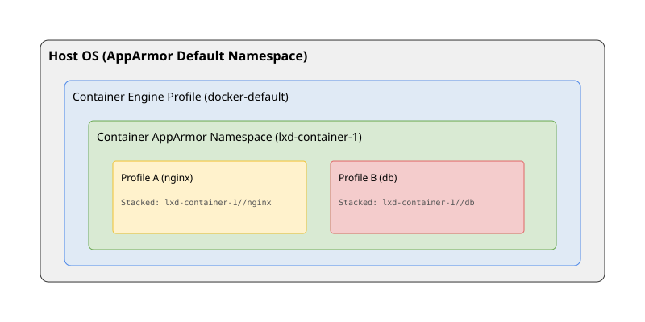

# Стек профілів AppArmor та інстанціація політик

<preknowlist>
- [Концепції ядра Linux](book:unix-linux/kernel-and-userspace) — базові поняття системних викликів та VFS.
</preknowlist>

Система мандатного контролю доступу (MAC) AppArmor значно еволюціонувала з часів своєї появи. Від простих, плоских профілів, що ізолювали окремі сервіси на хості, вона перейшла до підтримки складних архітектур, що включають простори імен (namespaces), стекування (stacking) та динамічну інстанціацію профілів. Ця еволюція була багато в чому зумовлена розвитком технологій контейнеризації, таких як LXC, LXD та Docker. Контейнери вимагають ізоляції не лише від основної операційної системи, а й забезпечення внутрішньої безпеки для процесів, що працюють усередині них.

У цій статті ми детально розглянемо механізми AppArmor stacking, концепцію просторів імен AppArmor, використання утиліти `aa-exec`, API `change_profile` та їх інтеграцію в сучасні контейнерні середовища.

## 1. Еволюція AppArmor: від плоских політик до просторів імен

Традиційна модель AppArmor передбачала, що система має єдиний глобальний простір профілів. Якщо процес був обмежений профілем (наприклад, `usr.sbin.nginx`), він не міг перейти до іншого профілю, який мав би ті самі привілеї або конфліктував із налаштуваннями глобального простору. У світі, де на одній машині працюють десятки контейнерів, такий підхід став нежиттєздатним.

### 1.1 Що таке простори імен AppArmor?

Простори імен AppArmor (AppArmor namespaces) були введені для забезпечення ізоляції політик. Подібно до того, як PID namespaces ізолюють ідентифікатори процесів, простори імен AppArmor дозволяють створювати незалежні набори профілів.

Простір імен в AppArmor — це логічний контейнер, який містить власні профілі та правила. Процес, що працює в певному просторі імен, може бачити і використовувати лише ті профілі, які завантажені в цей простір.

Фізично простори імен відображаються у віртуальній файловій системі AppArmor (securityfs), яка зазвичай монтується в `/sys/kernel/security/apparmor/policy/namespaces/`.

Кожен простір імен може мати власні вкладені простори, створюючи ієрархію. Це ідеально підходить для контейнерів: хостова система має свій глобальний простір імен (`default`), а кожен контейнер може отримати власний простір (наприклад, `lxd-container-1`), всередині якого працюватимуть процеси з власними профілями.

### 1.2 Структура `/sys/kernel/security/apparmor/`

Якщо ви зазирнете у каталог `/sys/kernel/security/apparmor/policy/namespaces/`, ви побачите структуру, що відображає активні простори імен. У системі без контейнерів цей каталог може бути порожнім (що означає використання лише `default` простору). Якщо ж запущено контейнер LXD, ви побачите підкаталоги з іменами контейнерів.

```bash
$ ls -l /sys/kernel/security/apparmor/policy/namespaces/
drwxr-xr-x 4 root root 0 Oct 25 10:00 lxd-web-server
drwxr-xr-x 4 root root 0 Oct 25 10:15 lxd-db-server
```

Усередині кожного з цих каталогів знаходяться власні профілі. Це дозволяє адміністратору контейнера завантажувати власні політики безпеки, не впливаючи на хост або інші контейнери.

## 2. Стек профілів (AppArmor Stacking)

### 2.1 Проблема одинарного профілю

До появи стекування процес міг бути обмежений лише одним профілем AppArmor у будь-який момент часу. Уявіть ситуацію: ви запускаєте контейнер Docker. Демон Docker застосовує до контейнера профіль `docker-default`, щоб захистити хост від шкідливих дій всередині контейнера.

Але що, якщо всередині контейнера ви хочете запустити веб-сервер Nginx і застосувати до нього додатковий профіль AppArmor (наприклад, `nginx-profile`), щоб захистити сам контейнер у разі компрометації Nginx?

У старій моделі це було неможливо: застосування `nginx-profile` означало б зміну профілю, і процес міг би "втекти" від обмежень `docker-default`, що ставило б під загрозу всю хостову систему.

### 2.2 Рішення: Stacking (Стекування)

Стекування дозволяє застосовувати до одного процесу *кілька профілів одночасно*. Коли профілі знаходяться в стеку, права доступу процесу визначаються як **перетин (intersection)** прав, наданих усіма профілями в стеку. Тобто дія дозволяється лише в тому випадку, якщо *кожен* профіль у стеку дозволяє її.

У наведеному вище прикладі, коли Nginx запускається всередині контейнера Docker, його стек профілів виглядатиме приблизно так:
`docker-default//&nginx-profile` (символ `//&` часто використовується для позначення стекування, хоча синтаксис може змінюватися в залежності від інструментів відображення).

Це означає, що Nginx не зможе зробити нічого, що заборонено `docker-default` (захист хоста), і водночас не зможе зробити нічого, що заборонено `nginx-profile` (внутрішній захист контейнера).

### 2.3 Використання просторів імен разом зі стекуванням

Справжня міць AppArmor розкривається при комбінуванні просторів імен та стекування. LXD і Docker (з підтримкою просторів імен User) активно використовують цей механізм.

Процес ініціалізації:
1. Контейнерний менеджер (наприклад, LXD) на хості запускається і створює новий простір імен AppArmor для контейнера (наприклад, `lxc-test`).
2. Менеджер застосовує до процесу `init` контейнера базовий профіль хоста (наприклад, `lxc-container-default`).
3. Коли процес всередині контейнера (наприклад, `apache2`) запускається і намагається завантажити свій профіль, він завантажується в локальний простір імен `lxc-test`.
4. Ядро автоматично створює стек: базовий профіль від хоста *плюс* локальний профіль з простору імен контейнера.
`lxc-container-default (host namespace) //& apache2 (lxc-test namespace)`.

Ця багатошарова безпека (defense in depth) є ключовою для безпечного виконання невідомого або потенційно вразливого коду.


*Рис. 1. Ілюстрація стекування профілів та просторів імен в AppArmor. Процеси в контейнері обмежені як профілем контейнерного рушія на хості, так і власними профілями у вкладеному просторі імен.*

## 3. Інструменти та API: `aa-exec` та `change_profile`

Щоб керувати профілями на рівні окремих процесів та скриптів, AppArmor надає набір утиліт та системних викликів.

### 3.1 Утиліта `aa-exec`

`aa-exec` — це зручна утиліта командного рядка, яка дозволяє запустити програму під певним профілем AppArmor, навіть якщо для цієї програми немає профілю за замовчуванням або ви хочете перевизначити його.

Синтаксис:
```bash
aa-exec -p <profile_name> [--] <command>
```

Наприклад, якщо ви маєте суворий профіль `sandbox-profile` і хочете запустити під ним ненадійний скрипт `untrusted.sh`:

```bash
aa-exec -p sandbox-profile /bin/bash untrusted.sh
```

**Особливості `aa-exec` у контексті стекування:**
Починаючи з новіших версій AppArmor, `aa-exec` підтримує стекування. Ви можете запустити програму під кількома профілями:

```bash
aa-exec -p "profile_A//&profile_B" /bin/my_app
```

Вимоги до використання `aa-exec`:
- Профіль, під яким ви хочете запустити програму, має бути попередньо завантажений у ядро.
- Процес, що викликає `aa-exec`, повинен мати достатні привілеї (зазвичай root) або його поточний профіль повинен дозволяти зміну профілю (`change_profile`) на цільовий.

### 3.2 API `change_profile` та `change_onexec`

На рівні програмного коду перехід між профілями здійснюється за допомогою AppArmor API, реалізованого через бібліотеку `libapparmor`.

Ключові функції:
- `aa_change_profile(const char *profile)`: негайно змінює профіль поточного процесу.
- `aa_change_onexec(const char *profile)`: планує зміну профілю під час наступного виклику `execve()`. Це набагато безпечніший підхід, оскільки він дозволяє уникнути стану "гонки" та ситуацій, коли процес виконується з новими привілеями, але зі старим станом пам'яті.

**Приклад використання `change_onexec` на C:**

```c
#include <stdio.h>
#include <unistd.h>
#include <sys/apparmor.h>

int main() {
    printf("Starting application...\n");

    // Плануємо перехід у профіль 'restricted_worker' під час exec
    if (aa_change_onexec("restricted_worker") == -1) {
        perror("Failed to set change_onexec");
        return 1;
    }

    printf("Profile transition scheduled. Executing worker logic...\n");

    // Виклик execve (через execl) запустить worker під новим профілем
    execl("/usr/bin/my_worker", "my_worker", NULL);

    perror("execl failed");
    return 1;
}
```

У правилах AppArmor для основного процесу має бути дозволено цей перехід:
```apparmor
profile main_app {
  ...
  change_profile -> restricted_worker,
  /usr/bin/my_worker px,
}
```

Для створення стеку через API можна передати спеціально відформатований рядок у ці функції, вказуючи об'єднання профілів:
`aa_change_onexec("profile_A//&profile_B")`.

## 4. Динамічна інстанціація політик

Контейнерні системи (такі як LXD та Kubernetes/CRI-O) створюють контейнери динамічно. Написання статичного профілю для кожного можливого контейнера вручну неможливе. Тому системи вдаються до **інстанціації політик**.

### 4.1 Як працює інстанціація

Інстанціація — це процес генерування конкретного профілю AppArmor на основі шаблону під час виконання.

1. **Шаблон**: Система має базовий шаблон профілю (наприклад, у LXD є шаблони для різних типів контейнерів). Цей шаблон містить змінні або макроси (наприклад, `<CONTAINER_NAME>`, `<STORAGE_PATH>`).
2. **Генерація**: Коли створюється новий контейнер `my-web-db`, система (демон LXD) бере шаблон, замінює змінні на конкретні значення (шляхи до rootfs контейнера, його ідентифікатори).
3. **Завантаження**: Згенерований профіль компілюється (`apparmor_parser`) і завантажується в ядро.
4. **Застосування**: Контейнерний рушій використовує механізми (такі як `change_onexec`), щоб запустити процес `init` контейнера під цим новим, інстанційованим профілем.

### 4.2 Профілі та змінні в AppArmor 3.x+

Починаючи з AppArmor 3 (який підтримується в нових ядрах Linux), можливості інстанціації стали багатшими завдяки підтримці змінних, що можуть визначатися в просторах імен, та ширшим можливостям включення файлів (includes).

Замість жорсткого генерування всього профілю, система може згенерувати лише файл зі змінними (наприклад, `@{CONTAINER_ROOT} = /var/lib/lxd/containers/my-web-db/rootfs/`), а базовий профіль просто включатиме (include) цей файл і використовуватиме змінну.

Це значно зменшує обсяг згенерованого коду та полегшує аудит.

## 5. Інтеграція з контейнерами (Docker та LXC)

### 5.1 Docker

Docker традиційно використовує єдиний, статичний профіль AppArmor за замовчуванням — `docker-default`. Цей профіль завантажується в ядро під час старту демона Docker.

Коли ви запускаєте контейнер (`docker run ...`), демон Docker налаштовує процес так, щоб він запустився під профілем `docker-default` (через `change_onexec`).

Профіль `docker-default` є досить широким — він дозволяє багато дій, але блокує найнебезпечніші речі, такі як:
- Монтування файлових систем (`mount`, `umount`).
- Доступ до `/proc` та `/sys` у режимі запису.
- Використання певних системних викликів (через взаємодію з seccomp, але AppArmor також блокує деякі мережеві та файлові операції).

Ви можете вказати власний профіль для контейнера Docker за допомогою прапорця:
```bash
docker run --security-opt apparmor=my-custom-profile my-image
```

Docker не створює простори імен AppArmor для кожного контейнера. Він працює в глобальному просторі (або в тому просторі, де запущений сам демон), що обмежує можливості ізоляції профілів всередині контейнера порівняно з LXD.

### 5.2 LXC / LXD

LXD (і базовий LXC) має значно тіснішу інтеграцію з розширеними функціями AppArmor, оскільки він орієнтований на системні контейнери (System Containers), які поводяться як повноцінні віртуальні машини.

1. **Автоматична інстанціація**: LXD генерує унікальний профіль для кожного контейнера (наприклад, `lxd-my-container_</var/lib/lxd>`). Це дозволяє чітко розмежувати доступ контейнерів до ресурсів хоста.
2. **Простори імен (Namespaces)**: LXD активно створює простори імен AppArmor. Процеси всередині контейнера LXD працюють у власному просторі імен.
3. **Підтримка внутрішніх профілів**: Оскільки контейнер має свій простір імен, ви можете встановити всередині контейнера пакунки (наприклад, `nginx` або `mysql`), які мають власні профілі AppArmor. При запуску цих сервісів їхні профілі будуть завантажені у простір імен контейнера, і ядро застосує **стекування**: профіль LXD для контейнера *плюс* внутрішній профіль сервісу.

Ця архітектура LXD є взірцем того, як AppArmor stacking та namespaces забезпечують високий рівень безпеки багатокористувацьких систем.

## 6. Діагностика та Troubleshooting

Під час роботи зі стеками та просторами імен налагодження (debugging) може стати складнішим. Дії, заблоковані AppArmor, реєструються в `dmesg` або `/var/log/syslog` (чи `audit.log`).

Типове повідомлення про блокування міститиме інформацію про профіль. У разі стекування ви можете побачити комбіноване ім'я профілю або ім'я простору імен:

```text
[ 1234.567890] audit: type=1400 audit(1698240000.123:45): apparmor="DENIED" operation="open" profile="lxd-container-1//&:lxd-container-1://nginx" name="/etc/shadow" pid=4321 comm="nginx" requested_mask="r" denied_mask="r" fsuid=0 ouid=0
```

У цьому прикладі:
- `profile="lxd-container-1//&:lxd-container-1://nginx"` показує, що процес обмежений стеком.
- Перша частина — профіль контейнера на хості.
- Друга частина (`:lxd-container-1://nginx`) — це профіль `nginx`, що знаходиться в просторі імен `:lxd-container-1:`.

### Корисні команди:

- `aa-status` або `apparmor_status`: показує список завантажених профілів. На хості вона покаже глобальні профілі.
- `cat /sys/kernel/security/apparmor/policy/namespaces/.../profiles/`: для безпосереднього перегляду завантажених профілів у певному просторі імен.

## Висновок

Стекування профілів (stacking) та простори імен (namespaces) в AppArmor вирішують складну проблему застосування багаторівневих політик безпеки в сучасних системах. Вони дозволяють хосту захистити себе від контейнерів, водночас дозволяючи контейнерам захищати свої внутрішні сервіси. Використання утиліт на зразок `aa-exec` та API `change_profile` надає розробникам і системним адміністраторам потужні інструменти для тонкого налаштування безпеки процесів, забезпечуючи принцип мінімальних привілеїв на всіх рівнях архітектури.
