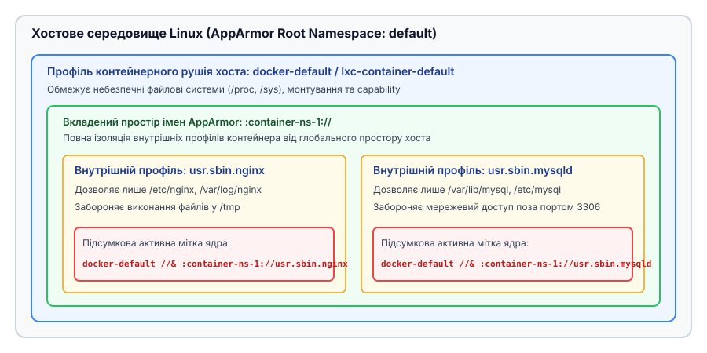
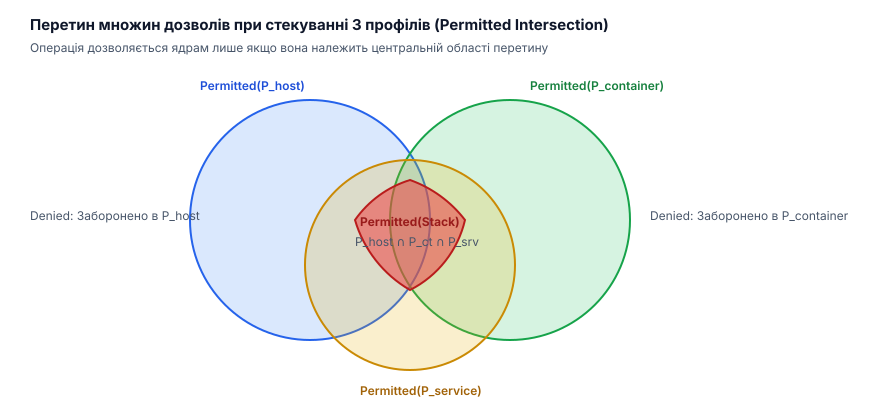

# Стек профілів AppArmor та інстанціація політик

<preknowlist>
- [Фреймворк Linux Security Modules (LSM)](book:unix-linux/lsm-framework) — порядок перехоплення системних викликів, обробка `cred->security` та збереження безпекового контексту.
- [Профілі AppArmor на основі шляхів](book:unix-linux/apparmor-path-rules) — механізм зіставляння VFS-шляхів, автоматичні переходи `px/cx` та базові правила.
- [Мапінг UID/GID у просторах імен користувачів](book:unix-linux/user-namespaces-uid-mapping) — ізоляція привілеїв та розмежування ідентифікаторів у контейнерах.
</preknowlist>

Запуск вебсервера Nginx у середовищі контейнеризації на кшталт Docker чи LXD демонструє фундаментальний архітектурний конфлікт традиційного мандатного контролю доступу (MAC). Демон контейнерного рушія накладає на ізольований процес базовий захисний профіль (наприклад, `docker-default`), який блокує монтування файлових систем, доступ до чутливих системних об'єктів `/proc/kcore` чи `/sys/firmware` та використання небезпечних capability. Якщо адміністратор або внутрішній інсталятор контейнера намагається застосувати до Nginx власний профіль (наприклад, `usr.sbin.nginx`), класична модель AppArmor вимагала б повної заміни одного профілю іншим. При такій заміні процес або втрачає обмеження `docker-default`, що дозволяє йому здійснювати атаки на хост при компрометації, або взагалі позбавляється можливості накладати внутрішній профіль, залишаючи службовий процес без специфічного захисту.

Для подолання цього обмеження ядро Linux пропонує механізми стекування профілів (profile stacking) та ієрархічних просторів імен AppArmor (AppArmor Namespaces).

## 1. Внутрішня архітектура ядра: `aa_label`, `aa_profile` та `aa_ns`

Традиційна реалізація AppArmor пов'язувала зі структурою привілеїв процесу (`struct cred -> security`) безпосередній вказівник на одиночну структуру профілю `aa_profile`. Сучасний підхід розриває цю жорстку прив'язку, вводячи додатковий рівень індирекції — політичну мітку `aa_label`.

Структура `aa_label` виступає універсальним контейнером для множини активних профілів. Коли процес працює під обмеженням лише одного профілю, його мітка містить єдиний елемент (`singular label`). Під час стекування декількох профілів мітка об'єднує декілька вказівників на профілі `struct aa_profile`, створюючи комбінований політичний контекст.

Ядро організовує збереження даних у пам'яті через наступне зв'язування структур:

```
struct cred
  └── security (void*)
        └── struct aa_label
              ├── node (вузол дерева міток простору імен)
              ├── flags
              ├── vec[0] ──> struct aa_profile (P[host])
              ├── vec[1] ──> struct aa_profile (P[container])
              └── vec[2] ──> struct aa_profile (P[service])
```

Щоб однакові комбінації профілів не дублювалися, кожен простір імен тримає власний набір інтернованих міток (`struct aa_labelset` — червоно-чорне дерево, впорядковане за вектором профілів). Якщо декілька незалежних процесів переходять у той самий стек профілів `docker-default//&usr.sbin.nginx`, ядро не виділяє нову пам'ять, а знаходить у цьому дереві наявну структуру `aa_label` і збільшує її лічильник посилань (`struct kref count`); звільняється мітка відкладено, через RCU (Read-Copy Update), тож читачі в LSM-хуках обходяться без блокувань.

Кожен профіль `struct aa_profile` належить до певного простору імен `struct aa_ns`. Простори імен AppArmor утворюють деревоподібну ієрархію з кореневим простором `default`:

```text
root namespace (default)
├── namespace: container-alpha
│   ├── profile: usr.sbin.nginx
│   └── profile: usr.sbin.mysqld
└── namespace: container-beta
    └── namespace: nested-sandbox
        └── profile: untrusted_script
```

Під час виконання будь-якої авторизаційної перевірки в LSM-хуках (наприклад, `apparmor_file_open`, `apparmor_socket_create`, `apparmor_cap_capable` чи `apparmor_task_kill`) ядро Linux не обмежується аналізом першого профілю у векторі. Обробник хука послідовно ітерує по всіх профілях, що входять до складу `cred->security->label`.

Операція вважається дозволеною лише у тому випадку, якщо кожен профіль зі складу мітки явно дає згоду на її виконання. Якщо хоча б один профіль у стеку повертає відмову (`DENIED`), підсумковий вердикт LSM-хука стає негативним, і системний виклик переривається з кодом помилки `-EACCES` або `-EPERM`.

Математичне обґрунтування алгебри перетинів дозволів та формальну модель декартового об'єднання автоматів DFA у стекованих мітках [висвітлено у математичній вставці](book:unix-linux/apparmor-stacking-and-profiles/math-stacking-intersection.md).

## 2. Стекування профілів та простори імен у середовищі контейнерів

Комбінація стекування та просторів імен забезпечує багатошаровий захист (Defense in Depth). Хостова система завантажує свій профіль у кореневий простір імен `default`. При запуску нового контейнера створюється новий підпорядкований простір імен AppArmor, у якому процеси контейнера можуть вільно завантажувати, оновлювати та видаляти власні локальні профілі, не маючи жодного доступу до політик хоста.


*Ілюстрація ієрархії просторів імен AppArmor та формування стекованих міток для контейнерних процесів.*

Простір імен AppArmor створює чітку межу видимості:
1. **Процеси на хості** (у просторі `default`) бачать усі завантажені профілі у всіх вкладених просторах імен. У консольних утилітах `aa-status` або списку procfs мітка відображається у повній формі: `docker-default//&:container-ns-1://usr.sbin.nginx`.
2. **Процеси всередині контейнера** (у просторі `container-ns-1`) бачать лише ті профілі, які завантажені безпосередньо у їхній локальний простір імен. Батьківський профіль `docker-default` є для них повністю невидимим, хоча ядро продовжує прозоро застосовувати його обмеження при кожному системному виклику.

Синтаксис відображення стекованих міток у системі використовує роздільник `//&`. Наприклад, мітка `docker-default//&:container-ns-1://usr.sbin.nginx` вказує на те, що процес одночасно знаходиться під дією профілю `docker-default` хостового простору та профілю `usr.sbin.nginx`, завантаженого у простір імен `:container-ns-1:`.

Історію переходу від плаского простору профілів SubDomain до повноцінного фреймворку стекування LSM та дебати в LKML [детально викладено в історичній вставці](book:unix-linux/apparmor-stacking-and-profiles/hist-apparmor-stacking-evolution.md).

З точки зору теорії множин, множина дозволених дій процесу під стекованою міткою є точним перетином множин дозволів усіх складових політик.


*Геометричне представлення перетину дозволів трьох стекованих профілів: дозволено лише те, що належить усім трьом множинам.*

## 3. Системний виклик `execve` та механіка переходів: `change_profile` і `change_onexec`

Зміна політичного контексту процесу виконується через спеціалізований API AppArmor, реалізований бібліотекою `libapparmor`, або через безпосередній запис у pseudo-файли файлової системи procfs (`/proc/self/attr/current` та `/proc/self/attr/exec`).

Для безпечного переходу між профілями використовуються дві основні операції:
1. `aa_change_profile(const char *profile)` — негайно змінює активну мітку поточного процесу.
2. `aa_change_onexec(const char *profile)` — встановлює заплановану мітку, яку ядро застосує в момент виконання системного виклику `execve()`.

Операція `change_onexec` є значно безпечнішою за миттєвий перехід, оскільки вона гарантує, що новий профіль почне діяти лише після того, як адресний простір процесу буде повністю очищено й замінено новим виконуваним образом. Це запобігає атакам, при яких процес намагається виконати небезпечний код, сформований у пам'яті до моменту переходу.

Нижче наведено приклад виконання переходів із підтримкою стекування:

:::tabs
```c
/* c */
#define _GNU_SOURCE
#include <stdio.h>
#include <stdlib.h>
#include <unistd.h>
#include <sys/apparmor.h>

int main(void) {
    printf("[Process %d] Current security context setup...\n", getpid());

    /* Запланувати стекування профілю 'restricted_sandbox' з існуючим профілем */
    const char *target_stack = "docker-default//&restricted_sandbox";

    if (aa_change_onexec(target_stack) < 0) {
        perror("aa_change_onexec failed");
        return EXIT_FAILURE;
    }

    printf("[Process %d] Transition scheduled. Executing worker binary...\n", getpid());

    char *args[] = { "/usr/bin/worker_bin", NULL };
    execvp(args[0], args);

    perror("execvp failed");
    return EXIT_FAILURE;
}
```
```cpp
// cpp
#include <iostream>
#include <string_view>
#include <vector>
#include <format>
#include <expected>
#include <cstring>
#include <cerrno>
#include <cstdlib>
#include <unistd.h>
#include <sys/apparmor.h>

class AppArmorStackManager {
public:
    static std::expected<void, std::string> schedule_stack(
        std::string_view base_profile, 
        std::string_view stacked_profile
    ) {
        std::string full_spec = std::format("{}//&{}", base_profile, stacked_profile);
        if (::aa_change_onexec(full_spec.c_str()) < 0) {
            return std::unexpected(std::format("Failed aa_change_onexec for target '{}': {}", full_spec, ::strerror(errno)));
        }
        return {};
    }
};

int main() {
    std::cout << std::format("[Process {}] Setting up AppArmor stacked transition...\n", ::getpid());

    auto result = AppArmorStackManager::schedule_stack("docker-default", "restricted_sandbox");
    if (!result) {
        std::cerr << std::format("Error: {}\n", result.error());
        return EXIT_FAILURE;
    }

    std::cout << "Transition scheduled. Invoking execvp...\n";
    std::vector<const char*> args = { "/usr/bin/worker_bin", nullptr };
    ::execvp(args[0], const_cast<char* const*>(args.data()));

    std::perror("execvp failed");
    return EXIT_FAILURE;
}
```
:::

У правилах основного профілю процесу AppArmor перехід має бути явно санкціонований відповідним правилом `change_profile`:

```apparmor
profile main_app {
  # Дозволити перехід у профіль restricted_sandbox або його стекування
  change_profile -> restricted_sandbox,
  change_profile -> docker-default//&restricted_sandbox,
  
  /usr/bin/worker_bin px,
}
```

Коли процес викликає `aa_change_onexec("docker-default//&restricted_sandbox")`, ядро перевіряє право `change_profile` у поточному профілі. Якщо перевірка успішна, ядро зберігає заплановану мітку у структурі `cred->security->onexec`. Під час подальшого системного виклику `execve()` хук AppArmor `apparmor_bprm_creds_for_exec` замінює активну мітку `cred->security->label` на нову стековану мітку.

Повний довідник системних прапорців, низькорівневих інтерфейсів procfs/securityfs та контрактів `libapparmor` [описано в спеціальній API-вставці](book:unix-linux/apparmor-stacking-and-profiles/api-apparmor-stacking-interface.md).

## 4. Динамічна інстанціація політик під час виконання

У сучасних контейнерних платформах на кшталт LXD, Kubernetes (CRI-O, containerd) або системи виконання Serverless-функцій (FaaS) створення статичних профілів AppArmor на етапі збірки системи неможливе. Контейнери створюються динамічно, отримують унікальні ідентифікатори, динамічні шляхи до маунт-поінтів кореневих файлових систем (`rootfs`) та специфічні обмеження ресурсів.

Для вирішення цієї задачі застосовується **динамічна інстанціація політик** (policy instantiation).

Процес інстанціації складається з чотирьох послідовних кроків:

1. **Шаблонізація**: Створюється базовий файл політики з макросами та змінними розширення:
   ```apparmor
   profile lxd-@{CONTAINER_ID} flags=(attach_disconnected) {
     file,
     @{ROOTFS_PATH}/ r,
     @{ROOTFS_PATH}/** rw,
     deny /proc/sys/kernel/sysrq rw,
   }
   ```
2. **Генерація**: Під час створення контейнера демон замінює змінні `@{CONTAINER_ID}` та `@{ROOTFS_PATH}` на реальні значення, згенеровані під час виконання.
3. **Компіляція та завантаження**: Текст профілю компілює `apparmor_parser` — у `/sys/kernel/security/apparmor/.load` (або `/sys/kernel/security/apparmor/policy/namespaces/<ns_name>/.load`) ядро приймає лише готовий бінарний образ політики, а не її вихідний текст.
4. **Стекований запуск**: Демон викликає `aa_change_onexec()` або `aa_stack_onexec()` для запуску процесу `init` контейнера під інстанційованим профілем.

Практична реалізація демона динамічної інстанціації політик та завантаження профілів мовами C та C++ [подана у практичній вставці](book:unix-linux/apparmor-stacking-and-profiles/proj-apparmor-policy-instantiation.md).

> 🔧 **Навіщо це.**
> Динамічна інстанціація в поєднанні зі стекуванням дозволяє будувати системи ізоляції "on-the-fly" без перезавантаження демонів безпеки чи модифікації дискового образу. Наприклад, системний сервіс обробки відео може динамічно згенерувати профіль AppArmor для конкретного тимчасового каталогу `/tmp/job-8912/`, завантажити його в ядро за лічені мілісекунди, відпрацювати завдання у стеку і миттєво вивантажити профіль через `/sys/kernel/security/apparmor/.remove`.

## 5. Інтеграція з контейнерними екосистемами: Docker, LXD та Kubernetes

Різні контейнерні рушії по-різному використовують можливості стекування та просторів імен AppArmor:

### 5.1 Docker та containerd

Стандартна конфігурація Docker використовує єдиний статичний профіль `docker-default`, який завантажується в ядро під час старту демона `dockerd`. Профіль `docker-default` забезпечує захист хостової системи від контейнера. Якщо користувач передає прапорець `--security-opt apparmor=my-profile`, Docker замінює `docker-default` на вказаний профіль.

Однак Docker традиційно не створює окремих просторів імен AppArmor для кожного контейнера. Це означає, що внутрішні процеси контейнера Docker працюють у тому ж просторі імен AppArmor, що й сам хост, що обмежує можливості стекування внутрішньо-контейнерних політик без використання додаткових операторів безпеки (наприклад, Security Profiles Operator у Kubernetes).

### 5.2 LXC / LXD

LXD підтримує глибоку інтеграцію з розширеними функціями AppArmor. Для кожного системного контейнера LXD автоматично виконує наступні дії:
1. Створює унікальний підпорядкований простір імен AppArmor (наприклад, `:lxd-my-container:`).
2. Генерує та завантажує інстанційований профіль хоста (наприклад, `lxc-container-default-with-nesting`).
3. Дозволяє процесам усередині контейнера завантажувати власні профілі в локальний простір імен `:lxd-my-container:`.

Завдяки цьому всередині контейнера LXD можна запустити повноцінний дистрибутив Ubuntu, де сервіси Nginx, MySQL чи PostgreSQL будуть автоматично обмежені власними профілями AppArmor через стекування: `lxc-container-default //&:lxd-my-container://usr.sbin.nginx`.

### 5.3 Kubernetes та Security Profiles Operator (SPO)

У кластерах Kubernetes управління профілями AppArmor тривалий час виконувалося через анотації подів `container.apparmor.security.beta.kubernetes.io/<container-name>: localhost/<profile-name>`. Починаючи з Kubernetes 1.30, AppArmor підтримується як першокласне поле специфікації `securityContext.appArmorProfile`.

Для автоматизації динамічної інстанціації політик у розподілених вузлах кластера використовується Kubernetes Security Profiles Operator (SPO). Демон SPO DaemonSet відстежує створення нових Custom Resource Definitions (CRD) типу `SeccompProfile` та `AppArmorProfile`, автоматично інстанціює їх під конкретні ноди, викликає `apparmor_parser` і завантажує політики у відповідні простори імен AppArmor на кожному робочому вузлі.

## 6. Аудит, діагностика та крайні випадки (Edge Cases)

Аналіз журналів подій безпеки при використанні стекування має свої особливості. Повідомлення про відмову у виклику `dmesg` або `/var/log/audit/audit.log` відображають повну мітку профілю:

```text
type=1400 audit(1700000000.456:123): apparmor="DENIED" operation="file_mmap" 
  profile="docker-default//&:container-ns-1://usr.bin.ffmpeg" 
  name="/tmp/exploit.so" pid=8912 comm="ffmpeg" requested_mask="w" denied_mask="w"
```

Для визначення того, який саме профіль у стеку спричинив відмову, адміністратору слід звернути увагу на наступні крайні випадки:

1. **Незворотність вилучення зі стеку**: Якщо профіль `P[host]` додано у стек, жоден подальший виклик `aa_change_profile` зсередини процесу не може видалити `P[host]` зі структури `aa_label`. Спроба скинути батьківський профіль ігнорується ядром або завершується помилкою `-EPERM`.
2. **Взаємодія з `chroot` та `pivot_root`**: При зміні кореня файлової системи шляхи у профілях AppArmor продовжують розраховуватися відносно маунт-простору. Якщо профіль завантажено з прапорцем `attach_disconnected`, шляхи поза реконструйованим коренем прив'язуються до віртуального кореня `/`, запобігаючи хибним відмовам.
3. **Глибина стекування**: Фіксованої межі на кількість профілів в одній мітці `aa_label` AppArmor не декларує — вектор мітки росте, доки вистачає пам'яті ядра. Межа тут не числова, а вартісна: кожен доданий профіль додає ще один прохід DFA до КОЖНОЇ перевірки доступу, тож реальні конфігурації рідко виходять за кілька профілів у стеку.
4. **Міжпросторові сигнали (IPC / Ptrace)**: Якщо процес у стеку намагається надіслати сигнал через `kill()` або підключитися через `ptrace()` до іншого процесу, AppArmor перевіряє право `signal` та `ptrace` між обома мітками. Сигнал дозволяється лише якщо кожен профіль у мітці джерела дозволяє взаємодію з кожним профілем у мітці цілі.

Стекування профілів та простори імен AppArmor перетворили систему мандатного контролю доступу Linux з інструменту локальної ізоляції окремих демонів у потужний фреймворк для побудови багаторівневих безпекових контейнерних середовищ.
