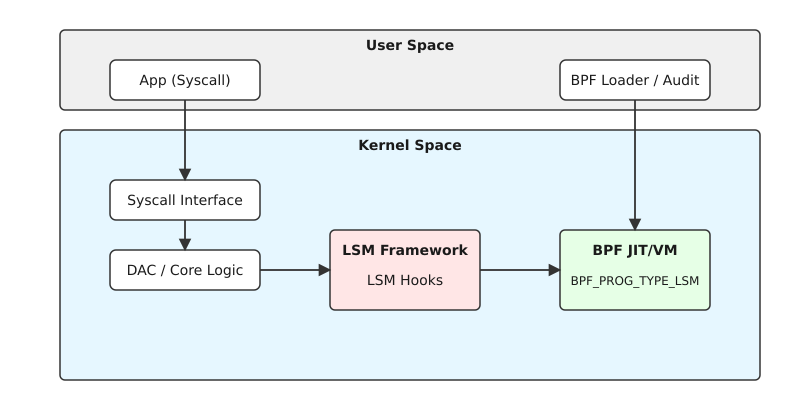

<details>
<summary><b>preknowlist</b></summary>
<ul>
<li>BPF (Berkeley Packet Filter), eBPF: загальні концепції та архітектура в ядрі Linux.</li>
<li>LSM (Linux Security Modules): фреймворк безпеки ядра (SELinux, AppArmor, Smack).</li>
<li>bpf_lsm: спеціальний тип програм eBPF для інтеграції з LSM.</li>
<li>Системні виклики та хуки ядра (kernel hooks).</li>
</ul>
</details>

# Модифікація поведінки Security Modules через bpf_lsm (bpf_override_return)

<preknowlist>
- [Концепції ядра Linux](book:unix-linux/kernel-and-userspace) — системні виклики та базові структури VFS/ядра.
</preknowlist>


## Вступ до BPF LSM та динамічного контролю доступу

Linux Security Modules (LSM) традиційно використовувалися для реалізації політик MAC (Mandatory Access Control) за допомогою таких систем, як SELinux або AppArmor. Вони надають статичні правила, що визначають, чи дозволено процесу виконати певну дію. Однак зі зростанням складності сучасних систем, особливо у контейнеризованих середовищах та мікросервісних архітектурах, виникла потреба в динамічному, програмованому контролі доступу.

Саме тут на допомогу приходить eBPF (Extended Berkeley Packet Filter) з типом програми `BPF_PROG_TYPE_LSM`. BPF LSM дозволяє розробникам писати безпечні програми, які завантажуються в ядро та підключаються до хуків LSM (LSM hooks), забезпечуючи динамічний аудит та можливість відхиляти або дозволяти дії на основі складного контексту, не змінюючи вихідний код ядра або статичні профілі безпеки.

## Архітектура BPF LSM



Коли процес робить системний виклик, ядро спочатку виконує базові перевірки прав доступу (DAC — Discretionary Access Control). Якщо вони проходять успішно, ядро викликає хуки LSM. У системі з увімкненим BPF LSM, програми BPF можуть бути приєднані до цих хуків.

Кожна BPF LSM програма отримує контекст хука, який зазвичай включає вказівники на структури даних ядра, такі як `task_struct` (поточний процес), `inode` (файл), `cred` (облікові дані) тощо. Програма може аналізувати ці дані і приймати рішення.

### Підключення до хуків (bpf_lsm_hooks)

Ядро експортує сотні хуків LSM. BPF програми використовують макроси та інструментарій, такий як `SEC("lsm/...")` у libbpf, для підключення до конкретного хука. Наприклад:

```c
SEC("lsm/file_open")
int BPF_PROG(restrict_file_open, struct file *file, int ret)
{
    // ... логіка ...
}
```

Тут `restrict_file_open` підключається до хука `security_file_open`. Параметр `ret` містить значення, повернуте попередніми модулями LSM.

## Динамічне блокування: bpf_override_return()

Однією з найпотужніших можливостей BPF, хоча і пов'язаною з певними обмеженнями (часто вимагає Kprobes, а в контексті LSM використовується повернення кодів помилок з самого хука), є здатність змінювати хід виконання ядра.

У BPF LSM програми повертають ціле число:
- `0` означає дозвіл (або делегування рішення наступним модулям).
- Негативне значення (наприклад, `-EACCES`, `-EPERM`) означає негайне відхилення доступу, перевизначаючи поведінку без звернення до традиційних модулів, якщо BPF програма розміщена відповідним чином, або ж просто додаючи ще один рівень заборони.

Хоча функція-хелпер `bpf_override_return()` історично використовувалася з Kprobes (kprobe-override), у контексті `BPF_PROG_TYPE_LSM` перевизначення (override) відбувається природно через значення, що повертається з самої BPF програми, яке передається назад у фреймворк LSM і далі в підсистему ядра як код помилки системного виклику.

### Механізм відмови

Якщо BPF програма повертає `-EPERM`, системний виклик (наприклад, `open()`) негайно повертає помилку `EPERM` у простір користувача, навіть якщо DAC та SELinux дозволили б доступ. Це дозволяє створювати динамічні "чорні списки" або блокування на основі тимчасових умов.

## Зберігання стану: security_blob_sizes та локальні сховища

Для прийняття складних рішень BPF програмам часто потрібно зберігати стан, пов'язаний з певними об'єктами ядра (процесами, файлами). BPF надає локальні сховища (local storage): `task_local_storage`, `inode_local_storage`, `sk_local_storage`.

У контексті LSM ці сховища спираються на механізм `security_blob` ядра. Структура `security_blob_sizes` в ядрі визначає обсяг пам'яті, що виділяється разом з об'єктами ядра для потреб модулів безпеки. BPF local storage абстрагує це, дозволяючи програмам зберігати дані, пов'язані з inode або task, не турбуючись про ручне управління пам'яттю, але під капотом це тісно інтегровано з інфраструктурою LSM blobs.

## Аудит без модифікації профілів

Традиційний аудит AppArmor чи SELinux вимагає редагування файлів конфігурації. BPF LSM дозволяє "тихо" спостерігати за системними викликами і генерувати події аудиту (наприклад, через BPF ring buffer або perf buffer), повертаючи `0` (дозвіл), але відправляючи детальний контекст у простір користувача для аналізу.

### Переваги такого підходу:
1. **Продуктивність**: BPF виконується в ядрі, збираючи лише необхідні дані.
2. **Деталізація**: Можна зібрати дані, які стандартний Auditd може не бачити (наприклад, аргументи структур).
3. **Гнучкість**: Правила аудиту можна змінювати "на льоту", завантажуючи та розвантажуючи BPF програми без перезавантаження демонів чи зміни файлів.

## Практичний приклад використання

Уявіть ситуацію, коли вам потрібно тимчасово заблокувати доступ до певного каталогу (наприклад, `/etc/secret_keys`) для всіх процесів, крім одного конкретного демона (з певним PID), через підозрілу активність у системі. 

Використовуючи BPF LSM:
1. Ви пишете BPF програму, що підключається до `lsm/file_open`.
2. Програма перевіряє ім'я файлу (через `d_path` або локальне сховище inode) та PID процесу.
3. Якщо умова збігається, повертає `-EACCES`.
4. В іншому випадку повертає `0`.

Ця програма завантажується за мілісекунди і починає діяти миттєво, обходячи необхідність правити політики SELinux, що могло б вимагати перекомпіляції політик і ризикувало б зламати інші сервіси.

## Висновки

`BPF_PROG_TYPE_LSM` відкриває нову еру в безпеці Linux. Можливість підключатися до хуків LSM і повертати коди помилок дозволяє створювати потужні інструменти для динамічного блокування та аудиту (фактично, override поведінки ядра), не покладаючись на статичні профілі або перекомпіляцію ядра. Завдяки тісній інтеграції з локальними сховищами BPF та механізмами LSM blobs, розробники отримують безпрецедентний контроль над безпекою на рівні ядра з високою продуктивністю та безпекою самого виконання коду.
