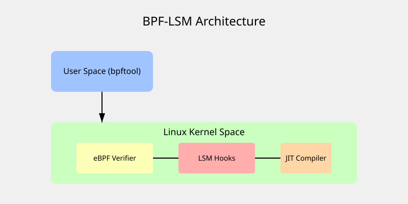

# Програмовані політики безпеки BPF-LSM

<preknowlist>
- [Концепції ядра Linux](book:unix-linux/kernel-and-userspace) — базові поняття системних викликів та VFS.
</preknowlist>

## 1. Вступ до еволюції безпеки ядра Linux

Безпека операційних систем — це постійна гонитва озброєнь між зловмисниками та розробниками систем захисту. У середовищі Linux тривалий час домінували класичні системи контролю доступу. Традиційний механізм DAC (Discretionary Access Control), заснований на правах доступу до файлів (read, write, execute для власника, групи та інших), виявився недостатнім для забезпечення надійного захисту в складних сучасних інфраструктурах. Якщо процес отримував права суперкористувача (root), він міг робити з системою будь-що.

Для вирішення цієї проблеми було запроваджено MAC (Mandatory Access Control) — мандатний контроль доступу. Реалізації MAC в Linux покладалися на фреймворк LSM (Linux Security Modules). Однак, традиційні модулі LSM, такі як SELinux та AppArmor, мають високий поріг входження, складний синтаксис політик та вимагають глибокого розуміння архітектури системи.

Поява eBPF (Extended Berkeley Packet Filter) змінила правила гри у багатьох підсистемах ядра Linux, від мережевої фільтрації до трасування та профілювання продуктивності. З релізом ядра Linux версії 5.7, eBPF дістався і до підсистеми безпеки, породивши **BPF-LSM** (BPF Linux Security Module). Ця технологія дозволяє системним адміністраторам та інженерам з безпеки писати власні, повністю програмовані політики безпеки на мові C (або Rust), компілювати їх та динамічно завантажувати в ядро без необхідності перезавантаження системи чи перекомпіляції ядра.

У цій статті ми детально розглянемо архітектуру BPF-LSM, механізми перехоплення системних викликів на льоту, використання технології CO-RE (Compile Once – Run Everywhere), а також створимо кілька власних кастомних політик безпеки.

## 2. Що таке Linux Security Modules (LSM)

Linux Security Modules (LSM) — це фреймворк, вбудований у ядро Linux, який дозволяє різним моделям безпеки реалізовувати мандатний контроль доступу (MAC). LSM не є окремим модулем безпеки, це скоріше набір "гачків" (hooks) — спеціальних точок перехоплення, розкиданих по всьому коду ядра.

Коли користувацький процес намагається виконати певну дію (наприклад, відкрити файл, створити сокет, змінити права доступу), ядро спочатку перевіряє класичні права DAC. Якщо DAC дозволяє дію, ядро звертається до фреймворку LSM через відповідний хук. Якщо будь-який із завантажених модулів LSM повертає помилку (забороняє дію), ядро блокує операцію і повертає процесу помилку `EACCES` (Permission denied).

Історично в ядрі Linux існує кілька "мажорних" модулів LSM:
*   **SELinux (Security-Enhanced Linux):** Найбільш відомий і потужний модуль, розроблений АНБ США. Використовує складну систему контекстів безпеки.
*   **AppArmor:** Сконцентрований на застосунках (профілі прив'язуються до шляхів файлів). Часто використовується в Ubuntu.
*   **Smack (Simplified Mandatory Access Control Kernel):** Спрощена альтернатива SELinux.
*   **TOMOYO:** Ще одна система MAC на основі шляхів.

## 3. Обмеження класичних модулів LSM

Незважаючи на їхню міць, класичні модулі LSM мають кілька суттєвих недоліків, які роблять їх використання в сучасних динамічних середовищах (наприклад, Kubernetes, мікросервіси, cloud-native інфраструктури) складним:

1.  **Статичність та монолітність політик:** Зміна політик у SELinux або AppArmor часто вимагає перекомпіляції бази політик та її перезавантаження. Хоча це можна зробити без перезавантаження ОС, сам процес складний і повільний.
2.  **Складність мови політик:** Синтаксис SELinux (m4 макроси, policy core language) надзвичайно складний для розуміння середньостатистичного розробника. Багато адміністраторів просто відключають SELinux (`setenforce 0`), зіткнувшись із першими ж проблемами.
3.  **Брак гнучкості та контексту:** Традиційні LSM оперують мітками (labels) або шляхами. Вони не можуть легко приймати рішення на основі складного контексту (наприклад, "дозволити відкриття файлу, тільки якщо процес був породжений певним контейнером, поточний час з 9 до 18, і швидкість мережевого трафіку не перевищує ліміт").
4.  **Неможливість написання довільної логіки:** Адміністратор обмежений лише тими правилами, які дозволяє виразити мова політик конкретного LSM.

Саме тут на сцену виходить BPF-LSM, пропонуючи парадигму *програмованих* політик безпеки.

## 4. Від eBPF до BPF-LSM: Революція в безпеці

eBPF (розширена версія класичного Berkeley Packet Filter) — це технологія, що дозволяє безпечно виконувати байткод всередині простору ядра Linux, не змінюючи вихідний код ядра і не завантажуючи модулі ядра (Kernel Modules). 

eBPF програми проходять сувору перевірку спеціальним компонентом — **BPF Verifier**, який гарантує, що програма:
*   Не увійде в нескінченний цикл (зависання ядра).
*   Не звернеться до недійсної пам'яті (kernel panic).
*   Має обмежений розмір і складність.

Після верифікації байткод eBPF компілюється "на льоту" (JIT - Just-In-Time compilation) у нативний машинний код процесора, забезпечуючи продуктивність, близьку до нативного коду ядра.

**BPF-LSM** (представлений у Linux 5.7) — це новий модуль у фреймворку LSM, який дозволяє підключати програми eBPF безпосередньо до хуків LSM. Це означає, що ви можете написати програму на мові C, яка містить *довільну логіку*, скомпілювати її в eBPF, і прив'язати до будь-якого хука безпеки (наприклад, `security_inode_create`, `security_file_open`, `security_task_alloc`).

### BPF_PROG_TYPE_LSM

У світі eBPF існує багато типів програм (наприклад, `BPF_PROG_TYPE_XDP` для мережі, `BPF_PROG_TYPE_KPROBE` для трасування). Для безпеки було створено новий тип: `BPF_PROG_TYPE_LSM`.

Програми цього типу мають доступ до тих самих аргументів, які ядро передає стандартним модулям LSM. Наприклад, якщо ядро викликає хук `file_open`, програма `BPF_PROG_TYPE_LSM` отримає вказівник на структуру `struct file`. Програма може проаналізувати цю структуру, прочитати шлях до файлу, перевірити ідентифікатор користувача (UID) і повернути `0` (дозволити дію) або `-EPERM` (відмовити).

## 5. CO-RE (Compile Once – Run Everywhere) та vmlinux.h

Однією з найбільших проблем розробки під ядро є його нестабільний ABI (Application Binary Interface). Структури даних ядра (наприклад, `task_struct`, `inode`) змінюються від версії до версії. Раніше, щоб програма eBPF працювала, її потрібно було компілювати безпосередньо на тій машині, де вона буде виконуватися, використовуючи встановлені заголовки ядра (kernel headers). Цей підхід використовується у BCC (BPF Compiler Collection).

Однак тягнути за собою весь стек компілятора (Clang/LLVM) на кожен production-сервер — це жахливо з точки зору безпеки та споживання ресурсів.

Для вирішення цієї проблеми було розроблено технологію **CO-RE (Compile Once – Run Everywhere)**.
CO-RE дозволяє скомпілювати BPF-програму один раз на машині розробника і запускати цей самий бінарний об'єкт на будь-якому ядрі Linux, навіть якщо розташування полів у структурах даних змінилося.

Це досягається за допомогою:
1.  **BTF (BPF Type Format):** Формат метаданих, який зберігає інформацію про типи та структури даних у самому ядрі. Ядра, починаючи з версії 5.2, можуть експортувати свій BTF у файл `/sys/kernel/btf/vmlinux`.
2.  **vmlinux.h:** Інструмент `bpftool` може згенерувати єдиний масивний заголовковий файл C (`vmlinux.h`), який містить визначення *усіх* структур, перерахувань та функцій конкретного ядра, витягнутих з BTF. Ви підключаєте `vmlinux.h` у свою BPF-програму, і вам більше не потрібні заголовки ядра!
3.  **libbpf та Clang:** Компілятор Clang зберігає в BPF-об'єкті спеціальні релокації (BTF relocations). Під час завантаження програми в ядро, бібліотека `libbpf` порівнює BTF компіляції з BTF поточного ядра і "на льоту" виправляє зсуви (offsets) полів у структурах.

## 6. Архітектура BPF-LSM

Давайте поглянемо на візуальне представлення того, як компоненти BPF-LSM взаємодіють між собою.



1.  **User Space:** Тут працює ваша програма-завантажувач (написана з використанням `libbpf` або `bpftool`), яка бере скомпілюваний `.o` файл (BPF об'єкт) і відправляє його в ядро через системний виклик `bpf()`.
2.  **eBPF Verifier:** Ядро приймає байткод і проганяє його через верифікатор. Якщо код небезпечний (наприклад, читає довільну пам'ять без перевірок), верифікатор відхиляє його.
3.  **JIT Compiler:** Схвалений байткод компілюється в машинний код.
4.  **LSM Hooks:** Програма "прикріплюється" (attach) до конкретного LSM хука. Коли системний виклик (наприклад, `open()`, `execve()`) доходить до цього хука, управління передається вашій JIT-скомпілюваній BPF-програмі.

## 7. Перехоплення на льоту: Динамічні LSM Hooks

Основна сила BPF-LSM полягає в **динамічності**. На відміну від статичних правил SELinux, ви можете "ввімкнути" або "вимкнути" перехоплення хука в будь-який момент часу. Вам не потрібно перезавантажувати політику для всієї системи. Програма прив'язується до хука за допомогою BPF Link, і щойно Link руйнується (наприклад, коли програма користувацького простору завершується, або адміністратор явно видаляє лінк), політика миттєво перестає діяти.

В ядрі Linux існує понад 200 LSM хуків. Ось деякі з найцікавіших для написання кастомних політик:
*   `bprm_check_security`: Викликається під час спроби виконати нову програму (системний виклик `execve`). Ідеальне місце для блокування запуску неавторизованих бінарників.
*   `file_open`: Викликається під час відкриття файлу. Дозволяє блокувати доступ до конфіденційних файлів.
*   `inode_create`, `inode_mkdir`: Контроль за створенням файлів і тек.
*   `task_alloc`: Викликається при створенні нового процесу (`fork`, `clone`). Дозволяє контролювати породження процесів (захист від fork-бомб).
*   `socket_connect`, `socket_bind`: Перехоплення спроб встановлення мережевих з'єднань або прив'язки до портів.
*   `capable`: Перевірка наявності capabilities (наприклад, `CAP_SYS_ADMIN`). Можна вибірково відбирати привілеї навіть у root-процесів!

## 8. Налаштування середовища та ядра

Щоб використовувати BPF-LSM, ваше ядро повинно підтримувати цю функцію та мати її увімкненою.

1. Перевірте версію ядра (потрібна >= 5.7, але для повноцінної роботи CO-RE рекомендується >= 5.8):
```bash
uname -r
```

2. Перевірте конфігурацію ядра на наявність `CONFIG_BPF_LSM=y`:
```bash
cat /boot/config-$(uname -r) | grep BPF_LSM
# Має вивести: CONFIG_BPF_LSM=y
```

3. Переконайтеся, що BPF включено в список активних LSM. Подивіться поточні LSM:
```bash
cat /sys/kernel/security/lsm
# Результат може бути: lockdown,capability,landlock,yama,apparmor,bpf
```
Якщо `bpf` немає в списку, вам потрібно змінити параметри завантаження ядра (через GRUB). Відкрийте `/etc/default/grub` і додайте або змініть параметр `lsm=`:
```text
GRUB_CMDLINE_LINUX_DEFAULT="... lsm=lockdown,capability,yama,apparmor,bpf"
```
Оновіть GRUB (`sudo update-grub`) і перезавантажте систему.

4. Встановіть необхідні інструменти розробки:
```bash
sudo apt update
sudo apt install -y clang llvm libelf-dev libbpf-dev bpftool linux-headers-$(uname -r)
```

## 9. Практика: Заборона виконання певних бінарників

Давайте напишемо нашу першу програму BPF-LSM. Мета політики: **заборонити виконання утиліти `chmod` всім користувачам, окрім root (UID 0).**

Цей приклад демонструє, як легко можна обмежити використання потенційно небезпечних утиліт для звичайних користувачів, не вносячи змін у файлову систему (оскільки зміна прав на сам бінарник `chmod` може зламати системні оновлення або пакети).

### Крок 1: Генерація vmlinux.h
Спершу згенеруємо заголовочний файл ядра за допомогою `bpftool`:
```bash
bpftool btf dump file /sys/kernel/btf/vmlinux format c > vmlinux.h
```

### Крок 2: Написання коду політики (BPF-LSM Kernel Space)
Створіть файл `block_chmod.bpf.c`:

```c
#include "vmlinux.h"
#include <bpf/bpf_helpers.h>
#include <bpf/bpf_tracing.h>
#include <bpf/bpf_core_read.h>

char LICENSE[] SEC("license") = "GPL";

// BPF_PROG макрос створює сигнатуру функції для LSM хука.
// Ми підключаємося до хука 'bprm_check_security'.
SEC("lsm/bprm_check_security")
int BPF_PROG(restrict_chmod, struct linux_binprm *bprm)
{
    // Отримуємо UID поточного процесу (користувача, що викликає execve)
    u32 uid = bpf_get_current_uid_gid() & 0xFFFFFFFF;
    
    // Якщо UID = 0 (root), дозволяємо виконання (повертаємо 0)
    if (uid == 0) {
        return 0;
    }

    // Зчитуємо ім'я файлу, який намагаються запустити
    // bprm->filename містить шлях. Використовуємо BPF_CORE_READ для безпечного читання
    const char *filename = BPF_CORE_READ(bprm, filename);
    
    // Оскільки ми не можемо використовувати стандартний strcmp у BPF (цикли обмежені),
    // ми прочитаємо останні символи шляху. Спрощений підхід для прикладу.
    // На практиці для складного парсингу рядків використовують спеціальні BPF-хелпери.
    char comm[16];
    bpf_get_current_comm(&comm, sizeof(comm));
    
    // bpf_printk виводить повідомлення в trace_pipe (/sys/kernel/debug/tracing/trace_pipe)
    // bpf_printk("BPF-LSM: exec attempt. Comm: %s, UID: %d\n", comm, uid);

    // Довжина "chmod" = 5. Перевіримо, чи ім'я команди закінчується на chmod.
    // У linux_binprm ім'я файлу може бути повним шляхом (наприклад, /usr/bin/chmod).
    // Ми порівняємо з іменем процесу, що запускається.
    
    // Спрощена перевірка імені команди (в comm часто лежить базове ім'я)
    // comm - це масив, ми перевіряємо байти.
    if (comm[0] == 'c' && comm[1] == 'h' && comm[2] == 'm' && 
        comm[3] == 'o' && comm[4] == 'd' && comm[5] == '\0') {
        
        bpf_printk("BPF-LSM: BLOCKING chmod for UID %d\n", uid);
        
        // Повертаємо код помилки EPERM (Operation not permitted)
        return -1; // -EPERM
    }

    // Для всіх інших програм повертаємо 0 (дозволити)
    return 0;
}
```

### Крок 3: Компіляція політики
Для компіляції використовуємо `clang` з вказанням цільової архітектури `bpf`:

```bash
clang -g -O2 -target bpf -D__TARGET_ARCH_x86 -I/usr/include/x86_64-linux-gnu \
      -c block_chmod.bpf.c -o block_chmod.bpf.o
```
Параметр `-g` важливий, оскільки він генерує інформацію BTF, необхідну для технології CO-RE.

### Крок 4: Написання User-space завантажувача (C + libbpf)
Згенерований `.o` файл не завантажиться сам по собі. Нам потрібна невелика програма, яка прочитає об'єкт, завантажить його через `libbpf` і прикріпить до системи. Завдяки утиліті `bpftool gen skeleton` ми можемо автоматично згенерувати C-код (скелет) для роботи з нашим об'єктом.

```bash
bpftool gen skeleton block_chmod.bpf.o > block_chmod.skel.h
```

Тепер створимо файл `loader.c`:
```c
#include <stdio.h>
#include <unistd.h>
#include <stdlib.h>
#include <bpf/libbpf.h>
#include "block_chmod.skel.h" // Згенерований скелет

int main(int argc, char **argv)
{
    struct block_chmod_bpf *skel;
    int err;

    // 1. Відкриваємо BPF застосунок
    skel = block_chmod_bpf__open();
    if (!skel) {
        fprintf(stderr, "Failed to open BPF skeleton\n");
        return 1;
    }

    // 2. Завантажуємо BPF програми в ядро
    err = block_chmod_bpf__load(skel);
    if (err) {
        fprintf(stderr, "Failed to load and verify BPF skeleton\n");
        goto cleanup;
    }

    // 3. Прикріплюємо програму до LSM хука
    err = block_chmod_bpf__attach(skel);
    if (err) {
        fprintf(stderr, "Failed to attach BPF skeleton\n");
        goto cleanup;
    }

    printf("BPF-LSM policy loaded successfully!\n");
    printf("Try running 'chmod' as a non-root user in another terminal.\n");
    printf("Press Ctrl+C to exit and unload the policy.\n");

    // Тримаємо програму запущеною. Щойно вона завершиться, 
    // лінк знищиться і політика буде вивантажена автоматично.
    while (1) {
        sleep(1);
    }

cleanup:
    block_chmod_bpf__destroy(skel);
    return -err;
}
```

Компілюємо завантажувач:
```bash
gcc -g -Wall loader.c -o loader -lbpf -lelf -lz
```

### Крок 5: Тестування кастомної політики

Запускаємо наш завантажувач з правами root:
```bash
sudo ./loader
```
Вивід:
```
BPF-LSM policy loaded successfully!
Try running 'chmod' as a non-root user in another terminal.
Press Ctrl+C to exit and unload the policy.
```

Тепер відкрийте другий термінал під звичайним користувачем (не root) і спробуйте виконати `chmod`:
```bash
$ touch test_file.txt
$ chmod 777 test_file.txt
bash: /usr/bin/chmod: Operation not permitted
```
Політика працює! eBPF програма перехопила виклик `execve` для `chmod`, перевірила UID і заблокувала операцію, повернувши `Operation not permitted`. Якщо ви спробуєте виконати ту саму команду як `root` (через `sudo`), вона виконається успішно.

Щоб побачити дебаг-повідомлення від `bpf_printk`, прочитайте trace pipe:
```bash
sudo cat /sys/kernel/debug/tracing/trace_pipe
```
Там ви побачите:
```
           chmod-12345   [001] d... 12345.678901: bpf_trace_printk: BPF-LSM: BLOCKING chmod for UID 1000
```

Коли ви натиснете `Ctrl+C` у вікні з `./loader`, програма завершиться, BPF-LSM політика миттєво від'єднається, і звичайні користувачі знову зможуть використовувати `chmod`. Це ілюструє фантастичну гнучкість динамічних політик BPF.

## 10. Моніторинг, Аудит та BPF Ring Buffer

Хоча `bpf_printk` зручний для швидкого дебагінгу, він не підходить для продакшену (занадто повільний, спільний для всієї системи, обрізає довгі повідомлення). Для створення повноцінних систем аудиту та моніторингу в eBPF використовується **Ring Buffer** (кільцевий буфер).

BPF-програма може зібрати детальну інформацію про подію (наприклад, повний шлях до файлу, аргументи командного рядка, ідентифікатор простору імен контейнера) у спеціальну C-структуру, запакувати її та миттєво відправити через Ring Buffer до User-space програми (нашого `loader`). User-space програма може асинхронно читати цей буфер і, наприклад, записувати події в JSON-файл для SIEM-системи, або відправляти алерти в Slack/Telegram.

Саме так працюють сучасні системи хмарної безпеки та захисту контейнерів, такі як Tetragon від Cilium або Falco. Вони інтенсивно використовують BPF-LSM та eBPF трасування для збору телеметрії та enforcement-у політик.

## 11. Порівняння: BPF-LSM vs SELinux

Чому б не продовжувати використовувати SELinux? SELinux — це потужний інструмент, але він має свої межі:

| Характеристика | SELinux / AppArmor | BPF-LSM |
| :--- | :--- | :--- |
| **Парадигма** | Статичні конфігураційні правила, мітки (labels). | Повністю програмована логіка (Тьюрінг-повна мова C). |
| **Контекст** | Обмежений тим, що знає сам модуль безпеки. | Повний доступ до будь-яких структур даних ядра (через BPF_CORE_READ). Можливість читати namespace контейнера, мережеві сокети, cgroups. |
| **Динамічність** | Застосування політик може вимагати релоаду демона, перемаркування ФС. | Миттєве завантаження/від'єднання за мілісекунди без впливу на систему. |
| **Вплив на продуктивність** | Може бути значним при великій кількості правил. | Надзвичайно низький overhead завдяки BPF JIT та відсутності context-switching. |
| **Крива навчання** | Висока (складна мова m4, складності з контекстами файлів). | Вимагає знань C та базового розуміння ядра Linux (libbpf, bpftool). |

**BPF-LSM не покликаний повністю замінити SELinux.** Насправді, в Linux ви можете використовувати обидва модулі одночасно (стекінг LSM). SELinux може забезпечувати базовий захист системи на основі контекстів, а BPF-LSM може використовуватися для:
1. Захисту специфічних мікросервісів або контейнерів.
2. Швидкого закриття (mitigation) 0-day вразливостей в ядрі без встановлення патчів.
3. Збору високоточної телеметрії.

## 12. Безпека самих BPF програм

Виникає логічне запитання: якщо ми дозволяємо завантажувати довільний C-код у ядро, чи не є це гігантською діркою в безпеці?

По-перше, для завантаження BPF-LSM програми процес повинен мати capability `CAP_BPF` та `CAP_MAC_ADMIN` (тобто, звичайний користувач не може завантажити політику).
По-друге, найважливішим етапом є **BPF Verifier**. Верифікатор ядра жорстко перевіряє скомпільований байткод перед його виконанням. Якщо ваша програма спробує звернутися до неініціалізованої пам'яті, виконати розіменування нульового вказівника (null pointer dereference) або звернутися за межі масиву — верифікатор відхилить програму на етапі завантаження, і вона ніколи не запуститься. Це унеможливлює "паніку ядра" (Kernel Panic) через помилку в коді BPF політики. Крім того, верифікатор обмежує складність програми та кількість ітерацій у циклах, що запобігає DoS-атакам на ядро (наприклад, програма не може виконуватися нескінченно).

## 13. Висновки

BPF-LSM — це квантовий стрибок у підході до безпеки операційних систем. Знімаючи обмеження статичних мов політик, він надає інженерам з безпеки всю міць мови C та доступ до будь-якої інформації всередині ядра Linux. Разом з технологіями CO-RE та `libbpf`, розробка, розгортання та оновлення політик безпеки стали такими ж зручними, як розгортання звичайних мікросервісів. 

У найближчі роки ми побачимо все більше засобів захисту кінцевих точок (EDR), антивірусів та рішень для захисту хмарних середовищ (CNAPP), які повністю перейдуть на архітектуру eBPF та BPF-LSM, відмовляючись від нестабільних та небезпечних кастомних модулів ядра. Опанування написання BPF-LSM політик сьогодні — це інвестиція у розуміння технологій кібербезпеки майбутнього.

---
*Документацію підготував Antigravity Agent, 2026*
