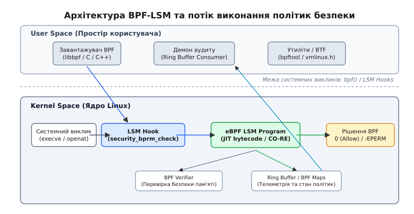

# Програмовані політики безпеки BPF-LSM

<preknowlist>
- [Модель розмежування доступу LSM](topic:unix-linux/lsm-framework) — точки перехоплення (hooks) та мандатний контроль доступу (MAC).
- [Привілеї та можливості процесів](topic:unix-linux/capabilities) — розділення повноважень `root` через привілеї `CAP_BPF` та `CAP_MAC_ADMIN`.
- [Шар віртуальної файлової системи VFS](topic:unix-linux/vfs-layer) — структури `inode`, `dentry` та `file` під час перевірки системних викликів.
</preknowlist>

У сучасних багатокористувацьких інфраструктурах та контейнеризованих середовищах традиційний вибірковий контроль доступу (DAC — Discretionary Access Control) виявляється безсилим проти цілеспрямованих атак та скомпрометованих сервісів. Якщо зловмисник отримує привілеї суперкористувача `root` (числовий UID 0) або знаходить вразливість у бінарному файлі із встановленим бітом `setuid`, класичні дев'ять бітів прав `rwxrwxrwx` більше не заважають йому виконувати в системі будь-що.

Класичні системи мандатного контролю доступу (MAC — Mandatory Access Control), такі як SELinux або AppArmor, вирішують цю проблему, ізолюючи процеси за допомогою суворих доменів та правил. Однак їхні політики є статичними, вимагають компіляції складних текстових конфігурацій та оперують виключно тими контекстами, які були передбачені авторами модуля безпеки багато років тому.

Поява підсистеми **BPF-LSM** (BPF Linux Security Module) у версії ядра Linux 5.7 кардинально змінила підхід до забезпечення безпеки операційної системи. BPF-LSM інтегрує віртуальну машину eBPF безпосередньо у фреймворк LSM, дозволяючи системним інженерам та фахівцям із кібербезпеки писати власні, повністю програмовані політики безпеки мовою C або Rust. Ці політики динамічно завантажуються в ядро Linux без перезавантаження системи, виконуються зі швидкістю нативної машинної інструкції та мають доступ до внутрішніх структур даних ядра в межах, дозволених верифікатором.

---

## 1. Механізм перехоплення: як працює Linux Security Modules (LSM)

Під час виконання будь-якої потенційно небезпечної операції у системі (наприклад, відкриття файла через `openat`, запуску нового бінарного файлу через `execve` чи прив'язки до мережевого порту через `bind`), управління передається від користувацького процесу в ядро Linux. Ядро спочатку перевіряє базові права вибіркового контролю доступу (DAC — перевірка власника, групи та бітів `rwxrwxrwx`). Якщо ці перевірки пройдено успішно, виконання потрапляє в спеціальні точки перехоплення — так звані **LSM hooks**, де переданий контекст операції аналізується завантаженими модулями безпеки перед виконанням дії.

```text
[Системний виклик (openat / execve)]
               │
               ▼
   [Перевірка DAC (UID, GID, rwx)]
               │ (дозволено)
               ▼
     [Фреймворк LSM (Hooks)]
               │
   ┌───────────┼───────────┐
   ▼           ▼           ▼
[SELinux]  [AppArmor]  [BPF-LSM]
   │           │           │ (усі повернули 0)
   └───────────┼───────────┘
               ▼
     [Виконання операції в ядрі]
```

Саме цей підхід із розставленими в ключових точках ядра хуками реалізує фреймворк **LSM (Linux Security Modules)** — внутрішній шар ядра Linux, створений у 2001 році для підтримки різних моделей мандатного контролю доступу. LSM не виконує власних перевірок самостійно, а надає уніфікований інтерфейс для підключення конкретних модулів безпеки.

Якщо хоча б один із завантажених модулів LSM повертає від'ємний код помилки (наприклад, `-EPERM` або `-EACCES`), ядро негайно перериває виконання системного виклику і повертає помилку у користувацький простір.

Детальний опис еволюційного шляху від скасованого стандарту POSIX.1e до створення фреймворку LSM розкрито в [історії еволюції мандатного контролю доступу](topic:unix-linux/ebpf-lsm-custom-policies/hist-bpf-lsm-evolution.md).

---

## 2. Послідовність викликів ядра під час запуску процесу

Щоб детальніше зрозуміти, у який саме момент спрацьовує перехоплення BPF-LSM, розглянемо внутрішній шлях ядра під час обробки системного виклику `execve("/usr/bin/chmod", argv, envp)`:

1. **Вхід у системний виклик:** Користувацький процес викликає `execve()`. Перехід у режим ядра відбувається через системне переривання або інструкцію `syscall`.
2. **Розв'язання VFS-шляху (`do_open_execat`):** Ядро перевіряє наявність файлу за шляхом, резолвить символьні посилання та зчитує заголовок файлу (ELF header).
3. **Підготовка `struct linux_binprm`:** Створюється тимчасова структура `linux_binprm`, куди копіюються аргументи командного рядка `argv`, змінні оточення `envp` та готується нова структура привілеїв `cred`.
4. **Виклик LSM-хука `security_bprm_check`:** На цьому етапі ядро почергово викликає усі завантажені BPF-LSM програми. Програма аналізує UID процесу, ім'я файлу та аргументи.
5. **Рішення політики:** Якщо BPF-LSM повертає `-EPERM`, ядро відразу звільняє пам'ять `linux_binprm` та повертає помилку `Operation not permitted`. Якщо повернуто `0`, ядро замінює образ пам'яті процесу новим ELF-бінарником і передає управління на точку входу цього образу (для динамічно злінкованих програм — спершу на інтерпретатор `ld.so`).

---

## 3. Обмеження класичних модулів та переваги програмованого підходу

Традиційні реалізації LSM (SELinux, AppArmor, Smack) спираються на декларативні мови політик. При усій своїй потужності вони мають чотири фундаментальні обмеження, які роблять їх використання складним у сучасній cloud-native інфраструктурі:

1. **Статичність та монолітність:** Зміна правил у SELinux вимагає перекомпіляції бази політик (`.pp` файлів) або оновлення профілів AppArmor. Сам процес розгортання є повільним і важко піддається автоматизації у CI/CD пайплайнах.
2. **Складність моделювання логіки:** Мови політик не є Тьюрінг-повними. Ви не можете легко сформулювати динамічне правило на кшталт: *"дозволити процесу запуск бінарного файлу лише тоді, коли його батьківським процесом є веб-сервер, поточний час перебуває в межах робочої зміни, а кількість відкритих сокетів не перевищує 50"*.
3. **Обмеженість контексту:** Статичні модулі безпеки оперують лише зумовленими мітками (labels) або шляхами файлової системи. Вони не можуть на льоту досліджувати нові структури даних ядра або аналізувати метадані контейнерів Kubernetes у реальному часі.
4. **Високий поріг входження:** Складний синтаксис політик призводить до того, що системні адміністратори часто вимикають SELinux (`setenforce 0`), залишаючи сервери без мандатного захисту.

BPF-LSM усуває ці обмеження, перетворюючи політики безпеки на звичайний C-код, який компілюється в байткод eBPF та прив'язується до хуків LSM на льоту.

---

## 4. Архітектура BPF-LSM: eBPF, Verifier та JIT

На відміну від звичайних модулів ядра (LKM — Loadable Kernel Modules), eBPF-програми виконуються всередині безпечної ізольованої віртуальної машини ядром Linux. Повний шлях створення та виконання політики BPF-LSM показано на схемі:


*Архітектура BPF-LSM: взаємодія користувацького простору, верифікатора ядра, LSM-хуків та систем кільцевого буфера.*

Потік виконання складається з п'яти послідовних етапів:

1. **User Space Loader:** Користувацький завантажувач (написаний на C/C++ із використанням `libbpf`) зчитує скомпільований об'єктний файл `.o` і викликає системний виклик `bpf(BPF_PROG_LOAD, ...)` для передачі байткоду в ядро.
2. **BPF Verifier:** Статичний аналізатор ядра суворо перевіряє байткод перед його допуском до виконання. Верифікатор гарантує, що програма не містить нескінченних циклів, не виконує розіменування недійсних вказівників (NULL pointer dereference), читає лише дозволені області пам'яті та має обмежений розмір.
3. **JIT Compiler:** Схвалений байткод компілюється транслятором Just-In-Time у нативні машинні інструкції процесора (x86_64, arm64) — далі політика виконується як звичайний код ядра, без інтерпретації.
4. **BPF Link Attachment:** Бібліотека `libbpf` створює об'єкт `bpf_link`, який прив'язує JIT-скомпільовану програму типу `BPF_PROG_TYPE_LSM` до конкретного LSM-хука в ядрі.
5. **Execution & Telemetry:** При виклику системного виклику ядро передає управління BPF-програмі. Вона аналізує контекст, приймає рішення (0 чи -EPERM) та за потреби передає розширену подію аудиту у простір користувача через BPF Ring Buffer.

---

## 5. Портабельність CO-RE (Compile Once – Run Everywhere) та vmlinux.h

Історично розробка програм eBPF для ядра була ускладнена відсутністю стабільного ABI (Application Binary Interface). Вказівники та зміщення (offsets) полів у внутрішніх структурах ядра (таких як `struct task_struct` чи `struct file`) змінюються від версії до версії ядра і навіть залежно від конфігурації компіляції (`CONFIG_*`).

Технологія **CO-RE (Compile Once – Run Everywhere)** усунула необхідність встановлювати повний заголовочний стек ядра та інструменти компіляції (Clang/LLVM) на кожен продакшен-сервер. CO-RE базується на трьох компонентах:

* **BTF (BPF Type Format):** Компактний формат метаданих, який описує всі типи даних та структури конкретного зібраного ядра. Ядро, зібране з опцією `CONFIG_DEBUG_INFO_BTF=y`, викладає ці метадані через системну файлову систему за шляхом `/sys/kernel/btf/vmlinux`; дистрибутивні ядра доби BPF-LSM цей файл уже мають.
* **vmlinux.h:** Утиліта `bpftool` дає змогу дампнути всі типізовані структури ядра в один автономний C-заголовочний файл:
  ```bash
  bpftool btf dump file /sys/kernel/btf/vmlinux format c > vmlinux.h
  ```
  Підключення `vmlinux.h` у BPF-програму повністю замінює необхідність підключати класичні заголовочні файли ядра (`<linux/sched.h>`, `<linux/fs.h>`).
* **BPF_CORE_READ:** Спеціальні макроси, що спираються на релокації Clang та бібліотеку `libbpf`. Під час завантаження BPF-об'єкта бібліотека `libbpf` порівнює метадані BTF машини розробника з BTF поточного ядра і "на льоту" коригує зсуви полів у структурах.

Наприклад, прочитати ім'я файлу зі структури `linux_binprm` через макрос CO-RE безпечно реалізується так:
```c
const char *filename = BPF_CORE_READ(bprm, filename);
```
Якщо в новому ядрі поле `filename` перемістилося на 8 байтів далі через додавання нового поля у структуру, `libbpf` автоматично відкоригує байткод BPF-програми в момент завантаження.

---

## 6. Анатомія LSM-хуків у BPF: сигнатури та повернення

У ядрі Linux існує понад 200 LSM-хуків. Програми BPF-LSM оголошуються за допомогою макросів `SEC("lsm/<hook_name>")` та `BPF_PROG`.

Розглянемо найважливіші точки перехоплення для побудови політик безпеки:

### 1. `bprm_check_security` — Контроль запуску процесів
Викликається під час виконання системних викликів `execve()` / `execveat()`. Програма отримує вказівник на структуру `struct linux_binprm *bprm`, яка містить шлях до бінарника, аргументи та привілеї нового процесу.

### 2. `file_open` — Контроль доступу до файлів
Викликається під час відкриття файлів через `open()` / `openat()`. Отримує структуру `struct file *file`, з якої можна прочитати прапорці відкриття (`O_RDONLY`, `O_WRONLY`, `O_CREAT`), права запитувача (`f_cred`) та VFS-шлях через `file->f_path`.

### 3. `socket_connect` та `socket_bind` — Мережева фільтрація процесів
Викликаються під час спроби процесів ініціювати вихідне з'єднання (`connect()`) або прив'язатися до порту (`bind()`). Дозволяють реалізувати fine-grained мережеву мікросегментацію безпосередньо для процесів або контейнерів.

Повний перелік параметрів та сигнатур можна переглянути у [каталозі LSM-хуків для BPF-LSM](topic:unix-linux/ebpf-lsm-custom-policies/api-bpf-lsm-hooks.md).

---

## 7. Динамічне управління політиками через BPF Maps

Якщо правила політики безпеки — такі як списки заблокованих UID, заборонені шляхи файлів чи дозволені мережеві порти — жорстко зашити безпосередньо у C-коді BPF-програми, будь-яка зміна конфігурації вимагатиме повної перекомпіляції BPF-об'єкта та повторного завантаження модуля в ядро. Це створює суттєві затримки у продакшені та ускладнює динамічне реагування на інциденти безпеки.

Для вирішення цієї проблеми підсистема eBPF надає **BPF Maps** — спеціальні структури даних ядра, що є спільними для BPF-програми та користувацького завантажувача. Вони дозволяють відокремити логіку перевірки від даних конфігурації.

Замість хардкоду ідентифікаторів у C-коді розробник створює динамічну хеш-таблицю `BPF_MAP_TYPE_HASH` або масив `BPF_MAP_TYPE_ARRAY`:

```c
// Оголошення хеш-карти для збереження списку заблокованих UID
struct {
    __uint(type, BPF_MAP_TYPE_HASH);
    __uint(max_entries, 1024);
    __type(key, u32);   // UID
    __type(value, u8);  // Block flag (1 = blocked)
} blocked_uids SEC(".maps");
```

Усередині BPF-програми виконується швидкий пошук за ключем у хеш-карті:
```c
u8 *blocked = bpf_map_lookup_elem(&blocked_uids, &uid);
if (blocked && *blocked == 1) {
    return -EPERM; // Заборонено
}
```

Утиліта користувацького простору або адміністратор через `bpftool map update` може додавати, вилучати чи модифікувати заблоковані UID та конфігураційні правила у реальному часі без від'єднання політики та без перезавантаження BPF-модуля.

---

## 8. Практична реалізація: розробка BPF-політики та завантажувача

Побудуємо кастомну політику BPF-LSM, яка вирішує реальне завдання: **забороняє запуск небезпечних системних утиліт (наприклад, `chmod`) для всіх звичайних користувачів (UID != 0), зберігаючи можливість їх використання для root.**

### Крок 1: Код політики ядра (`block_chmod.bpf.c`)

Алгоритм ядерної BPF-LSM програми — це послідовна перевірка атрибутів у хуку `bprm_check_security`:
1. Спочатку за допомогою хелпера `bpf_get_current_uid_gid()` отримується UID користувача, що ініціював системний виклик `execve`.
2. Якщо виклик здійснюється від суперкористувача (`root`, UID 0), перевірка негайно завершується з кодом `0` (дозвіл).
3. Для не-root користувачів через CO-RE зчитується поле `bprm->filename` — шлях до бінарника, який ядро щойно розібрало й збирається запустити.
4. Шлях порівнюється з `/usr/bin/chmod`. У разі збігу програма фіксує спробу в логу ядра `bpf_printk` та повертає `-1` (`-EPERM`), що змушує ядро перервати виклик.
5. Якщо запуск не заблоковано, повертається `0` (дозвіл виконання).

Хелпер `bpf_get_current_comm()` для такого рішення не годиться: у момент виклику хука `comm` ще містить назву процесу, який викликав `execve` (для команди з оболонки — `bash`), а на назву нового бінарника ядро змінює її пізніше, вже після того, як хук дозволив запуск. Порівняння з фіксованим рядком теж навмисно спрощене: запуск через відносний шлях чи символьне посилання його обійде, тож бойова політика канонізує шлях хелпером `bpf_d_path()` (див. каталог хуків).

```c
#include "vmlinux.h"
#include <bpf/bpf_helpers.h>
#include <bpf/bpf_tracing.h>
#include <bpf/bpf_core_read.h>

char LICENSE[] SEC("license") = "GPL";

SEC("lsm/bprm_check_security")
int BPF_PROG(restrict_chmod_exec, struct linux_binprm *bprm)
{
    // 1. Отримуємо UID користувача, що викликає execve
    u64 uid_gid = bpf_get_current_uid_gid();
    u32 uid = (u32)uid_gid;

    // Якщо це root (UID 0), пропускаємо без перевірок
    if (uid == 0) {
        return 0;
    }

    // 2. Читаємо шлях бінарника, який ядро збирається запустити.
    //    comm тут ще зберігає назву процесу, що викликав execve (bash),
    //    тому рішення спирається саме на bprm->filename
    const char *fname = BPF_CORE_READ(bprm, filename);
    char path[32] = {};
    if (bpf_probe_read_kernel_str(path, sizeof(path), fname) < 0) {
        return 0;
    }

    // 3. Порівнюємо шлях із цільовим разом із завершальним нулем:
    //    цикл зі сталою межею верифікатор розгортає й пропускає
    const char target[] = "/usr/bin/chmod";
    bool match = true;
    for (unsigned i = 0; i < sizeof(target); i++) {
        if (path[i] != target[i]) {
            match = false;
        }
    }

    if (match) {

        bpf_printk("BPF-LSM: BLOCKED execution of chmod by UID %d\n", uid);
        
        // Повертаємо -EPERM (Operation not permitted) для блокування
        return -1;
    }

    return 0;
}
```

### Крок 2: Написання користувацького завантажувача (C та C++)

Завантажувач підключає BPF-об'єкт до ядра та утримує `bpf_link` активним. Нижче наведено ідіоматичні реалізації завантажувача мовами C та C++ у форматі вкладки `:::tabs`.

:::tabs
```c
/* loader.c — C імплементація з використанням libbpf */
#include <stdio.h>
#include <stdlib.h>
#include <unistd.h>
#include <bpf/libbpf.h>
#include "block_chmod.skel.h"

int main(int argc, char **argv)
{
    struct block_chmod_bpf *skel;
    int err;

    // 1. Відкриваємо BPF-скелет
    skel = block_chmod_bpf__open();
    if (!skel) {
        fprintf(stderr, "Failed to open BPF skeleton\n");
        return 1;
    }

    // 2. Завантажуємо та верифікуємо BPF-програму в ядрі
    err = block_chmod_bpf__load(skel);
    if (err) {
        fprintf(stderr, "Failed to load BPF program: %d\n", err);
        goto cleanup;
    }

    // 3. Прикріплюємо програму до LSM-хука
    err = block_chmod_bpf__attach(skel);
    if (err) {
        fprintf(stderr, "Failed to attach BPF LSM program: %d\n", err);
        goto cleanup;
    }

    printf("BPF-LSM Policy active! Non-root users cannot run 'chmod'.\n");
    printf("Press Ctrl+C to unload policy and exit.\n");

    while (1) {
        sleep(1);
    }

cleanup:
    block_chmod_bpf__destroy(skel);
    return -err;
}
```
```cpp
// loader.cpp — C++20 RAII імплементація завантажувача
#include <iostream>
#include <memory>
#include <stdexcept>
#include <thread>
#include <chrono>
#include <csignal>
#include <atomic>
#include <bpf/libbpf.h>
#include "block_chmod.skel.h"

namespace {
    std::atomic<bool> g_running{true};

    void sig_handler(int) {
        g_running.store(false);
    }
}

class BpfLsmGuard {
public:
    BpfLsmGuard() {
        skel_ = block_chmod_bpf__open_and_load();
        if (!skel_) {
            throw std::runtime_error("Failed to open and load eBPF skeleton");
        }

        int err = block_chmod_bpf__attach(skel_);
        if (err) {
            block_chmod_bpf__destroy(skel_);
            throw std::runtime_error("Failed to attach BPF-LSM hooks");
        }
    }

    ~BpfLsmGuard() {
        if (skel_) {
            block_chmod_bpf__destroy(skel_);
            std::cout << "[RAII] BPF-LSM Policy safely detached from kernel." << std::endl;
        }
    }

    BpfLsmGuard(const BpfLsmGuard&) = delete;
    BpfLsmGuard& operator=(const BpfLsmGuard&) = delete;

private:
    struct block_chmod_bpf *skel_{nullptr};
};

int main() {
    std::signal(SIGINT, sig_handler);
    std::signal(SIGTERM, sig_handler);

    try {
        BpfLsmGuard guard;
        std::cout << "BPF-LSM Protection Daemon running. Ctrl+C to terminate." << std::endl;

        while (g_running.load()) {
            std::this_thread::sleep_for(std::chrono::milliseconds(200));
        }
    } catch (const std::exception &e) {
        std::cerr << "Error: " << e.what() << std::endl;
        return 1;
    }

    return 0;
}
```
:::

Повний приклад побудови виробничого демона аудиту з використанням кільцевого буфера (`BPF_MAP_TYPE_RINGBUF`) дивіться у відповідному [проєкті реалізації політики з буфером подій](topic:unix-linux/ebpf-lsm-custom-policies/proj-bpf-lsm-loader.md).

---

## 9. Моніторинг, інспекція sysfs та BPF Maps

Перевірити статус завантаження BPF-LSM політик у живій системі можна через системну файлову систему `/sys/kernel/security/lsm` та інструмент `bpftool`.

### Інспекція списку LSM у ядрі

Спеціальний файл віртуальної файлової системи securityfs `/sys/kernel/security/lsm` містить впорядкований список усіх активних модулів безпеки LSM, ініціалізованих під час завантаження ядра:

```bash
cat /sys/kernel/security/lsm
# Результат: lockdown,capability,landlock,yama,apparmor,bpf
```

Якщо `bpf` відсутній у цьому списку, BPF-LSM не активований на рівні параметрів завантаження ядра GRUB (`lsm=lockdown,capability,bpf`).

### Перегляд завантажених BPF-LSM програм
```bash
sudo bpftool prog show type lsm
```
Утиліта виведе ідентифікатори BPF-програм, їхні імена, час завантаження, UID власника та розміри байткоду й JIT-коду.

---

## 10. Порівняльний аналіз: BPF-LSM проти SELinux та AppArmor

Вибір інструменту мандатного захисту залежить від завдань інфраструктури. Зведемо характеристики технологій у порівняльну таблицю:

| Параметр | SELinux / AppArmor | Landlock | BPF-LSM |
| :--- | :--- | :--- | :--- |
| **Парадигма** | Декларативні конфігураційні правила, мітки та шляхи. | Непривілейоване пісочничне ізолювання процесів (Unprivileged Sandboxing). | Повністю програмована логіка (Тьюрінг-повна мова C у BPF). |
| **Контекст рішення** | Обмежений мітками файлів та типів процесів. | Файлові шляхи самого процесу, а з ядра 6.7 — і TCP-порти. | Метадані ядра, сокети, cgroups, namespaces — усе, що дозволяє верифікатор. |
| **Динамічність** | Вимагає перезавантаження текстових профілів чи ремаркування ФС. | Застосовується процесом до самого себе під час виконання і назад уже не знімається. | Миттєве завантаження/від'єднання за мілісекунди без рестарту демонів. |
| **Необхідні привілеї** | `root` / `CAP_MAC_ADMIN` | Працює без привілеїв суперкористувача (unprivileged). | Вимагає привілеїв `CAP_BPF` + `CAP_MAC_ADMIN`. |
| **Швидкодія** | Може мати значний overhead при тисячах правил. | Дуже низький overhead. | Мінімальний overhead завдяки JIT-компіляції у машинний код. |

> 🔧 **Навіщо це.** BPF-LSM не вимагає відмови від SELinux або AppArmor. Завдяки механізму стекування LSM (LSM stacking), в ядрі Linux можуть одночасно працювати кілька модулів. Ви можете залишити SELinux для забезпечення базового захисту всієї ОС, а BPF-LSM використовувати для оперативного блокування zero-day вразливостей або ізоляції мікросервісів у Kubernetes.

---

## 11. Оцінка продуктивності та накладних витрат (Overhead)

Виконання політик безпеки безпосередньо у просторі ядра Linux дає величезну перевагу у швидкодії порівняно зі звичайними інструментами аналізу простору користувача (наприклад, утилітами на основі `ptrace` чи перехоплення через `LD_PRELOAD`).

Завдяки JIT-компіляції байткоду eBPF у машинний код CPU, один виклик LSM-хука BPF-LSM коштує **десятки наносекунд** — кілька десятків машинних інструкцій на просту перевірку. Для порівняння, перехоплення виклику через `ptrace` вимагає двох повних перемикань контексту між ядром та процесом-трасувальником — це вже одиниці мікросекунд, на два-три порядки дорожче.

---

## 12. Безпека виконання BPF-політик у ядрі

Дозволити завантаження C-коду в простір ядра виглядає як потенційна загроза для стабільності системи. Проте ядро Linux реалізує багатощільний захист:

1. **Контроль доступу (Capabilities):** Завантажувати програми типу `BPF_PROG_TYPE_LSM` можуть лише процеси, що володіють комбінацією привілеїв `CAP_BPF` (або `CAP_SYS_ADMIN`) та `CAP_MAC_ADMIN`.
2. **Гарантії BPF Verifier:** Верифікатор гарантує відсутність паніки ядра (Kernel Panic). Якщо BPF-програма містить спробу розіменування некоректного вказівника чи вихід за межі масиву, верифікатор відхилить її під час завантаження з детальною помилкою.
3. **Обмеження ресурсів:** Верифікатор обмежує і розмір програми, і обсяг власного аналізу (близько мільйона опрацьованих інструкцій) та перевіряє, щоб усі цикли були скінченними, що унеможливлює зависання ядра чи DoS-атаки на CPU.

Завдяки цим гарантіям BPF-LSM став стандартом де-факто для побудови сучасних систем інспекції та захисту кінцевих точок (EDR/XDR) та контейнеризованих середовищ.
