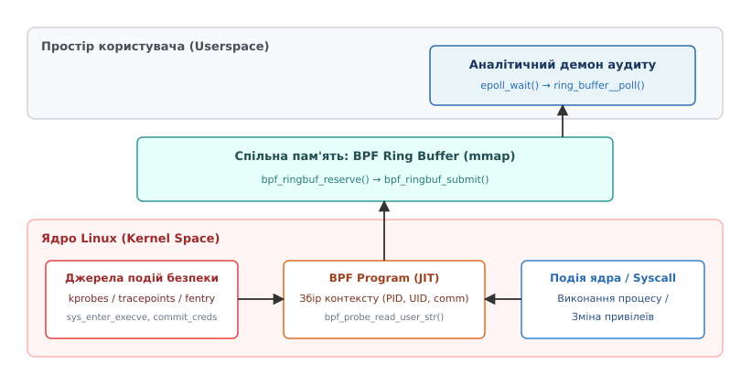
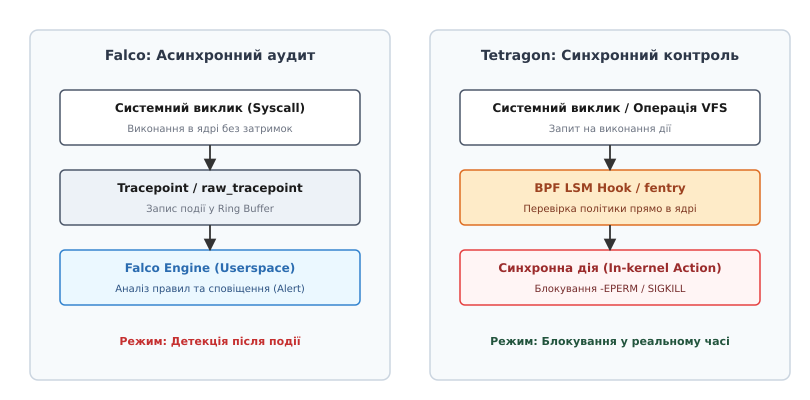

# Аудит та моніторинг безпеки за допомогою eBPF

<preknowlist>
- [Що таке eBPF (Extended Berkeley Packet Filter)](topic:unix-linux/ebpf-extended-berkeley-packet-filter) — віртуальна машина BPF у ядрі, верифікатор інструкцій, мапи та системний виклик `bpf()`.
- [LSM (Linux Security Modules) фреймворк](topic:unix-linux/lsm-framework) — точки перехоплення (hooks) в ядрі Linux для реалізації моделей розмежування доступу.
- [Процеси, credentials, UIDs](topic:unix-linux/process-credentials-uids-gids) — структура `struct cred`, зміна ідентифікаторів користувача та привілеїв процесів.
- [Системні виклики та VFS](topic:unix-linux/vfs-layer) — механізм обробки syscalls, структура `struct path` та ієрархія файлової системи.
</preknowlist>

У традиційних операційних системах Linux спостереження за безпекою та аудит подій роками спиралися на статичні точки перехоплення системних викликів. Захисні демони на кшталт `auditd` отримували повідомлення через сокети netlink кожного разу, коли процес виконував виклик `execve` або `openat`. З появою хмарних середовищ, контейнеризації та мікросервісної архітектури ця схема зіткнулася з критичним бар'єром: коли на одному вузлі виконуються тисячі короткоживучих контейнерів, а кількість системних викликів сягає мільйонів на секунду, накладні витрати на серіалізацію логів та контекстне перемикання між ядром і простором користувача споживають до третини обчислювальної потужності процесора.

Технологія **eBPF (Extended Berkeley Packet Filter)** кардинально змінює цей підхід. Вона перетворює ядро Linux на програмоване середовище, дозволяючи виконувати безпечний, скомпільований JIT-компілятором код безпосередньо всередині ядра при виникненні подій. Замість копіювання сирих даних системних викликів у простір користувача для подальшої фільтрації, eBPF-програми здійснюють аналіз, агрегацію та фільтрацію подій безпеки безпосередньо в точці їх виникнення, надсилаючи аналітичним демонам лише сформовані структури аномалій.

[Історія еволюції аудиту Linux: від auditd та Netlink до програмованого eBPF](topic:unix-linux/ebpf-security-tracing/hist-auditd-to-ebpf.md) деталізує пройдений шлях від статичного KAUDIT до гнучкого BPF-трасування.

---

## 1. Архітектура eBPF-трасування: точки перехоплення в ядрі

Щоб відстежувати поведінку системи, eBPF-програма повинна прив'язатися до конкретного моменту виконання коду в ядрі. Ядро Linux надає чотири основні механізми зондування, кожен із яких має власний баланс між гнучкістю, продуктивністю та стійкістю ABI (Application Binary Interface).

### Dynamic Probes: Kprobes та Kretprobes

При підключенні трасувальника до довільної функції ядра Linux без її перекомпіляції підсистема трасування копіює першу інструкцію цільової функції у спеціальний буфер і замінює її у пам'яті на програмну точку зупинки — інструкцію переривання `int3` (0xCC) на архітектурі x86_64.

```
[Виклик функції ядра]
         ↓
 [Інструкція int3] → [Обробник винятку Breakpoint]
                                 ↓
                     [Збереження регістрів CPU в pt_regs]
                                 ↓
                     [Виконання eBPF-програми]
                                 ↓
                     [Відновлення інструкції та повернення]
```

При попаданні процесора на інструкцію `int3` генерується виняток, ядро перехоплює керування, зберігає стан усіх регістрів процесора у структуру `struct pt_regs` і передає її як аргумент у BPF-програму. Після завершення BPF-програми ядро виконує збережену оригінальну інструкцію з буфера і повертає процесор до виконання цільової функції.

Описана технологія динамічного перехоплення виконання внутрішніх функцій ядра називається **Kprobes (Kernel Probes)** — вона дозволяє підключатися практично до будь-якої точки коду ядра без модифікації його вихідних файлів. Точка зупинки — базовий і найповільніший шлях: на x86_64 ядро за можливості *оптимізує* зонд, замінюючи `int3` прямим переходом на трамплін, а зонд на самому початку функції взагалі обслуговує через `ftrace`-латку.

**Kretprobes** працюють аналогічно, але перехоплюють момент *повернення* з функції, підміняючи адресу повернення на стеку на спеціальний трамплін. Це дозволяє аналізувати код повернення функції (наприклад, результат перевірки прав доступу).

*Перевага:* Можливість підключитися до будь-якого місця у ядрі.  
*Недолік:* Високі накладні витрати на обробку винятку переривання (близько 150–250 наносекунд на виклик) та залежність від внутрішніх імен функцій ядра, які можуть змінюватися від версії до версії.

### Static Probes: Tracepoints та Raw Tracepoints

У вихідний код ядра Linux розробники вшивають статичні виклики за допомогою макросів `TRACE_EVENT`. Коли таке спостереження неактивне, точка являє собою звичайну NOP (No Operation) інструкцію у машинному коді й має нульові накладні витрати. При активації eBPF-програми інструкція NOP замінюється на безумовний перехід `jmp` на трамплін BPF.

Така архітектура статичних точок спостереження називається **Tracepoints** — це точки перехоплення, явним чином вбудовані в код ядра (наприклад, `sys_enter_execve`, `sched_process_exec`, `net_dev_xmit`). Вони гарантують стабільність списку аргументів та назв незалежно від оновлень та внутрішніх змін ядра.

**Raw Tracepoints** надають доступ до сирих вказівників структур ядра без попереднього формування аргументів підсистемою трасування, що усуває витрати CPU на додаткове копіювання та серіалізацію даних у форматі трасувальника.

### BPF Trampoline: Fentry та Fexit

Починаючи з ядра Linux 5.5, з'явився механізм **BPF Trampoline**, який реалізує типи програм `fentry` (Function Entry) та `fexit` (Function Exit). Це сучасна високопродуктивна альтернатива `kprobes`.

Зібране з прапором `-mfentry` ядро має на початку кожної функції 5-байтний виклик `__fentry__`; під час завантаження ядро заміняє ці виклики на 5-байтні NOP, тож у неактивному стані вони не коштують нічого. При активації `fentry` ядро підміняє NOP на прямий `call` JIT-скомпільованого трампліна BPF. Це усуває і виняток `int3`, і обробку програмного переривання, зменшуючи накладні витрати приблизно на порядок — до одиниць-десятків наносекунд.

Понад те, `fentry`/`fexit` дозволяють BPF-програмі читати аргументи функцій ядра безпосередньо через типи C (як звичайні параметри функції), без використання `bpf_probe_read()` або розпакування `struct pt_regs`.

### BPF LSM Hooks

Механізм **BPF LSM** (Linux Security Module), інтегрований у ядро 5.7, підключає eBPF-програми безпосередньо до точок перевірки розмежування доступу LSM (наприклад, `file_open`, `bprm_check_security`, `task_fix_setuid`). 

У списку обробників `security_hook_heads` BPF LSM виконується нарівні з SELinux або AppArmor. Це єдиний тип трасування, який штатно не лише спостерігає події, а й блокує їх у реальному часі: повернений від'ємний код (`-EPERM`) стає кодом помилки самої операції. Kprobe теж уміє обірвати виклик через `bpf_override_return()`, але лише для функцій, явно позначених у ядрі макросом `ALLOW_ERROR_INJECTION()`; `fentry`/`fexit` на результат функції не впливають узагалі.

---

## 2. Сумісність та безпека виконання: BTF, CO-RE та верифікатор

Трасування внутрішніх структур ядра вимагає зчитування полів з `struct task_struct`, `struct cred` або `struct file`. Проте у різних дистрибутивах Linux (Ubuntu, RHEL, Debian) зміщення (offsets) полів усередині цих структур відрізняються через різні прапори конфігурації ядра при збірці.

### BTF (BPF Type Format) та CO-RE

Раніше для вирішення цієї проблеми доводилося компілювати BPF-код безпосередньо на цільовому сервері під час запуску демона аудиту, що вимагало встановлення важких пакетів `kernel-headers` та компілятора Clang на продакшн-вузли.

Концепція **CO-RE (Compile Once – Run Everywhere)** усунула цю потребу завдяки двом компонентам:

1. **Метадані BTF:** Ядро експортує бінарний опис усіх своїх типів та структур C у файлі `/sys/kernel/btf/vmlinux`.
2. **Clang-релокації:** Компілятор генерує BPF-байткод із використанням спеціальних макросів (`BPF_CORE_READ`), замінюючи фіксовані зміщення полів на метадані релокації. При завантаженні програми бібліотека `libbpf` зіставляє BTF BPF-програми з BTF поточного ядра і на льоту коригує зміщення інструкцій.

```
[BPF C-код з BPF_CORE_READ] 
         ↓ (Clang)
[BPF байткод + BTF релокації] 
         ↓ (libbpf завантаження)
[Зіставлення з /sys/kernel/btf/vmlinux] → [Скориговані зміщення]
                                                     ↓
                                        [JIT-компіляція в ядрі]
```

Завдяки цьому BPF-програма, скомпільована на розробницькій машині з Ubuntu, працює без перекомпіляції на ядрі Red Hat Enterprise Linux.

### Гарантії верифікатора BPF

Перед JIT-компіляцією та виконанням у ядрі верифікатор BPF проводить статичний аналіз байткоду. У контексті моніторингу безпеки верифікатор надає суворі математичні гарантії:

- **Захист від зациклення та фатального зависання:** Усі цикли повинні мати статично доведені межі виконання (unrolled loops або bounded loops з лімітом інструкцій).
- **Безпеку пам'яті:** Розіменовувати довільні вказівники ядра напряму заборонено. Будь-яке читання з пам'яті користувача або ядра або проходить через `bpf_probe_read_*()`, або спирається на вказівник, який верифікатор розпізнав як типізований `PTR_TO_BTF_ID`.
- **Обмеження стеку:** Обсяг локального стеку BPF-програми суворо обмежений 512 байтами. Спроба виділити більший масив на стеку призводить до відмови завантаження програми верифікатором.
- **Обмеження складності:** Верифікатор обходить усі можливі гілки виконання, відсікаючи вже перевірені однакові стани (state pruning). Якщо навіть після цього кількість проаналізованих інструкцій перевищує ліміт (мільйон), програма відхиляється.

---

## 3. Високопродуктивна передача подій: BPF Ring Buffer

При трасуванні безпеки високої частоти головним вузьким місцем стає передача сформованих подій з ядра у простір користувача.

Застарілий механізм **Perf Ring Buffer** виділяв окремий кільцевий буфер для кожного процесорного ядра (per-CPU buffers). Це призводило до двох проблем: неефективного використання пам'яті (коли буфер одного ядра переповнений і події відкидаються, буфери інших стоять напівпорожні) та порушення хронологічного порядку подій під час їх збирання у просторі користувача.

З ядра Linux 5.8 стандартом де-факто став **BPF Ring Buffer** (`BPF_MAP_TYPE_RINGBUF`). Це єдина ділянка пам'яті, що розділяється між усіма ядрами CPU та відображається у простір користувача через системний виклик `mmap()`.


*Архітектура передачі подій аудиту безпеки через BPF Ring Buffer від точок перехоплення ядра до аналітичного демона в просторі користувача.*

Передача події відбувається за три кроки:
1. `bpf_ringbuf_reserve()`: BPF-програма атомарно резервує неперервний блок пам'яті потрібного розміру безпосередньо у спільному кільцевому буфері. Якщо буфер переповнений, функція повертає `NULL`.
2. **Заповнення даних:** Програма записує PID, UID, назву команди та інші метадані безпосередньо у зарезервовану ділянку пам'яті, уникаючи тимчасових буферів на стеку.
3. `bpf_ringbuf_submit()`: Подія позначається як готова для читання. Демон у просторі користувача розбуджується через системний виклик `epoll_wait()` і зчитує події у порядку їх фактичного виникнення.

Докладний опис системних функцій та BPF helpers наведено у довіднику [Інтерфейси та допоміжні функції BPF для моніторингу безпеки](topic:unix-linux/ebpf-security-tracing/api-bpf-helpers-tracing.md).

---

## 4. Практичний моніторинг векторів атак у Linux

Моніторинг безпеки на базі eBPF охоплює три основні вектори спостереження: виконання процесів, зміну привілеїв та мережеві з'єднання.

### Відстеження виконання процесів (Process Execution Tracing)

Створення нового процесу є першим кроком більшості атак. eBPF перехоплює точки `sys_enter_execve` та `sys_enter_execveat`.

Під час обробки події BPF-програма витягує:
- Ідентифікатори процесу: PID, PPID (PID батьківського процесу через `task->real_parent->tgid`).
- Суб'єкт виконання: UID, GID, EUID, EGID.
- Шлях та аргументи: витягуються з пам'яті користувача через `bpf_probe_read_user_str()`.
- Контекст ізоляції: cgroup ID v2 через `bpf_get_current_cgroup_id()`.

Це дозволяє виявляти аномалії середовища: наприклад, коли у контейнері вебсервера Nginx запускається командний інтерпретатор `/bin/sh` або утиліта `curl`.

### Моніторинг підвищення привілеїв (Privilege Escalation)

Атаки з локального підвищення привілеїв (Privilege Escalation) намагаються модифікувати структуру `struct cred` поточного процесу, встановлюючи `uid = 0`.

eBPF-програма прив'язується до функції ядра `commit_creds()`, яка приймає вказівник на нову структуру `struct cred`.

```c
SEC("kprobe/commit_creds")
int BPF_KPROBE(trace_commit_creds, struct cred *new_cred)
{
    u32 old_uid = (u32)bpf_get_current_uid_gid();
    u32 new_uid = BPF_CORE_READ(new_cred, uid.val);

    // Виявлення переходу з непривілейованого користувача у root
    if (old_uid != 0 && new_uid == 0) {
        // Формування тривожної події безпеки
    }
    return 0;
}
```

Якщо BPF-програма виявляє зміну UID без попереднього виклику санкціонованих бінарних файлів із прапором setuid (наприклад, `sudo`), це вагома підозра на експлуатацію вразливості ядра (Kernel Exploit). За допомогою `bpf_send_signal(SIGKILL)` BPF-програма може негайно вбити шкідливий процес прямо під час виконання `commit_creds`.

### Спостереження за файловою системою та VFS-трасування

eBPF дозволяє контролювати доступ до критичних файлів системи (`/etc/shadow`, `/etc/pam.d/`, TLS-ключі), прив'язуючись до LSM-хуків `security_file_open` або VFS-функцій `vfs_open`.

Для повного відновлення шляху до файла у VFS BPF-програма обходить ієрархію об'єктів `struct dentry` та `struct vfsmount`:

```c
// Вилучення назви елемента dentry через CO-RE
struct qstr d_name = BPF_CORE_READ(dentry, d_name);
bpf_probe_read_kernel_str(&buf, sizeof(buf), d_name.name);
```

Це дає змогу виявляти спроби вирватися з `chroot` або маніпуляції з точками монтування у mount namespace.

Окрім цього, трасування викликів `mmap` із прапорами `PROT_WRITE | PROT_EXEC` та викликів `ptrace` (запит `PTRACE_ATTACH`) дозволяє виявляти ін'єкції шкідливого коду в пам'яті легітимних процесів та атаки типу Process Hollowing.

### Мережева телеметрія безпеки

Поєднуючи трасування сокетів із контекстом процесів, eBPF складає повну картину мережевих з'єднань. BPF-програми типів `BPF_PROG_TYPE_CGROUP_SOCK_ADDR` перехоплюють виклики `connect()` та `accept()`. 

Це дозволяє миттєво прив'язати кожне мережеве з'єднання (IP-адресу та порт) до ідентифікатора PID процесу, його UID та контейнера в Kubernetes, виявляючи спроби виходу шкідливого коду на сторонні Command & Control (C2) сервери.

---

## 5. Промислові інструменти безпеки: Falco та Tetragon

На базі eBPF побудовано сучасний стек Cloud-Native Security. Два провідних інструменти екосистеми ілюструють фундаментальну різницю між асинхронним аудитом та синхронним захистом.


*Порівняння архітектури моніторингу та перехоплення загрози інструментів Falco (асинхронні tracepoints) та Tetragon (синхронні fentry/BPF LSM).*

### Falco: Асинхронний двигун виявлення загроз

**Falco** (проєкт CNCF) аналізує потік системних викликів. За допомогою eBPF tracepoints Falco збирає події системних викликів, надсилає їх у простір користувача через кільцевий буфер та проганяє через двигун правил (Rules Engine).

*Приклад правила Falco:*
```yaml
- rule: Shell у контейнері
  desc: Виявлено запуск інтерактивної оболонки всередині контейнера
  condition: container.id != host and proc.name in (bash, sh, zsh)
  output: Shell spawned in container (user=%user.name container_id=%container.id comm=%proc.name)
  priority: WARNING
```

Falco працює асинхронно: він сповіщає про події безпеки з затримкою в кілька мілісекунд, але не блокує виконання самих системних викликів.

### Tetragon: Синхронне блокування атак у ядрі

**Tetragon** (розроблений Isovalent / Cilium) інтегрується глибше у ядро через `fentry` та BPF LSM hooks. На відміну від Falco, Tetragon виконує перевірку правил безпосередньо у BPF-програмі всередині ядра.

Якщо дія порушує політику безпеки (наприклад, спроба запису у захищену директорію або запуск непідписаного бінарника), Tetragon зупиняє операцію просто з контексту виклику: відмовляє в LSM-хуку чи підміняє код повернення на `-EPERM` через `bpf_override_return`, або надсилає процесу `SIGKILL` через `bpf_send_signal`.

---

## 6. Практична реалізація монітора безпеки

Розробка власного інструменту аудиту на базі eBPF складається з двох частин: BPF-коду ядра, що перехоплює події, та програми простору користувача на C або C++, яка обробляє потік подій з Ring Buffer.

> 🔧 **Навіщо це.** Створення власних eBPF-моніторів дозволяє реалізовувати вузькоспеціалізовану телеметрію безпеки (наприклад, моніторинг специфічних для додатка файлових операцій чи міжпроцесної взаємодії) із накладними витратами, близькими до нуля, не залежачи від сторонніх важких агентів аудиту.

Повну працюючу реалізацію BPF-коду та завантажувачів на мовах C і C++ із використанням бібліотеки `libbpf` наведено у проєкті [Створення монітора безпеки процесів на eBPF та libbpf](topic:unix-linux/ebpf-security-tracing/proj-ebpf-exec-monitor.md).

---

## 7. Продуктивність, вектори атак та крайові випадки

Застосування eBPF для моніторингу безпеки вимагає врахування накладних витрат, специфічних безпекових ризиків самої віртуальної машини BPF та методів обходу аудиту зі сторони зловмисника.

### Накладні витрати (Overhead Matrix)

Залежно від обраної точки прив'язки накладні витрати процесора суттєво варіюються:

| Механізм | Метод перехоплення | Накладні витрати на 1 виклик | Прапор безпеки |
| :--- | :--- | :--- | :--- |
| **Kprobe** | Переривання `int3` / breakpoint | ~150–250 нс | Може змінитися назва функції |
| **Tracepoint** | NOP / JMP трамплін | ~20–40 нс | Стабільне ABI ядра |
| **fentry / fexit** | Direct Call через `ftrace` NOP | одиниці–десятки нс | Вимагає ядро ≥ 5.5 |
| **BPF LSM** | LSM Hook Pointer | як у fentry — той самий трамплін | Вимагає ядро ≥ 5.7, єдиний зі штатним блокуванням |

### Вектори безпеки підсистеми eBPF

Оскільки eBPF виконує код у ядрі, сама віртуальна машина BPF є привабливою ціллю для атак:

1. **Привілеї доступу:** Завантаження BPF-програм вимагає системного привілею `CAP_BPF` (або `CAP_SYS_ADMIN`). Для підвищення безпеки системні адміністратори вимикають завантаження BPF непривілейованими користувачами:
   ```bash
   sysctl -w kernel.unprivileged_bpf_disabled=1
   ```
2. **Атаки по побічних каналах (Spectre):** Завантажений байткод дозволяв будувати спекулятивні гаджети й вичитувати пам'ять ядра через кеш. Основний захист дає сам верифікатор: він аналізує спекулятивні шляхи виконання й вставляє бар'єри там, де межу масиву перевірено лише в архітектурному потоці. Окремо від цього BPF JIT Hardening (sysctl `net.core.bpf_jit_harden = 2`) зашумлює константи у згенерованому коді й закриває JIT-спреїнг.

### Атаки TOCTOU (Time-of-Check to Time-of-Use) та їх нейтралізація

Якщо eBPF-монітор перехоплює системний виклик `openat` на вході `sys_enter` і зчитує шлях до файла з пам'яті користувача через `bpf_probe_read_user_str()`, зловмисний паралельний потік (thread) у просторі користувача може змінити вміст буфера рядка шляху в пам'яті безпосередньо між моментом, коли eBPF-програма зчитала шлях для перевірки, і моментом, коли ядро Linux фактично відкрило файл.

Явище, коли стан ресурсу перевіряється в один момент часу, а використовується в інший, дозволяючи паралельному процесу підмінити дані у проміжку між перевіркою та вжитком, називається атакою **TOCTOU (Time-of-Check to Time-of-Use)** — це категорія атак, базована на стані гонки (race condition).

```
[Потік A: openat(path_ptr)] ───> [eBPF reads path_ptr: "/tmp/safe"] ───> [Kernel opens path_ptr: "/etc/shadow"]
                                               ↑
[Потік B: race condition] ──────── [Overwrites path_ptr to "/etc/shadow"]
```

**Спосіб нейтралізації:** Не використовувати перехоплення системних викликів на вході (`sys_enter`) для прийняття рішень щодо безпеки. Замість цього моніторинг слід реалізовувати на базі **BPF LSM hooks** або **kprobes над VFS-структурами** (наприклад, `vfs_open`), де eBPF-програма читає вже узгоджену структуру `struct path` чи `struct dentry` з пам'яті ядра після того, як ядро завершило резолюцію шляху.
