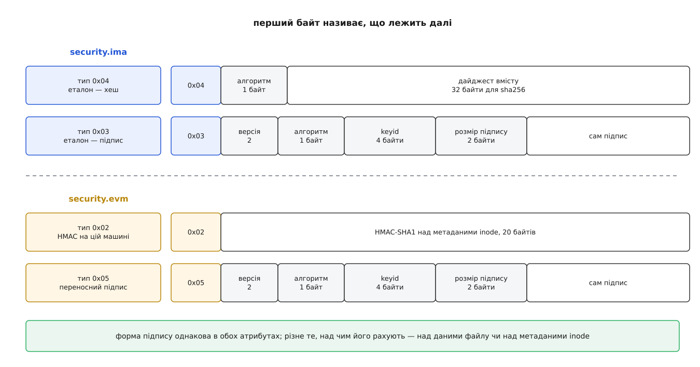

# 📋 Поверхня керування IMA та EVM: правила, шаблони, атрибути, утиліти

Керують IMA й EVM ззовні чотирма речами: рядком політики, кількома файлами у `securityfs`, двома розширеними атрибутами й параметрами командного рядка ядра. Тут зібрано їхній контракт — граматика правила з повним переліком гачків і умов, формат журналу й шаблонів, розкладка байтів у `security.ima` та `security.evm` і команди `evmctl`, за якими інакше доводиться ходити по джерелах ядра.

## Куди писати й що читати

Файли лежать у [псевдофайловій системі](topic:unix-linux/pseudo-filesystems) `securityfs`, зазвичай примонтованій у `/sys/kernel/security`. Справжня тека — `integrity/ima`, а `ima` поруч із нею — символьне посилання, лишене задля сумісності зі старими скриптами.

| Шлях під `/sys/kernel/security` | Що це |
|---|---|
| `ima/policy` | приймає правила; відкривати можна **лише на запис** і лише з `CAP_SYS_ADMIN` |
| `ima/ascii_runtime_measurements` | журнал вимірювань у текстовому вигляді |
| `ima/binary_runtime_measurements` | той самий журнал двійково — саме його бере перевіряч |
| `ima/runtime_measurements_count` | скільки в журналі записів |
| `ima/violations` | скільки з них порушень (`ToMToU`, `open_writers`) |
| `evm` | маска ввімкнення EVM: читається як стан, записується як додавання бітів |

Коли TPM веде кілька банків хешів, поруч з'являються файли з суфіксом алгоритму — `ascii_runtime_measurements_sha256` і подібні; у них те саме, але хеш запису порахований відповідним алгоритмом.

Політику подають правило за правилом, а до діла воно береться **на закритті файлу** — цілим набором, не по одному:

```sh
printf '%s\n' 'measure func=BPRM_CHECK' > /sys/kernel/security/ima/policy

# інший спосіб: замість тексту — шлях; тоді файл читає саме ядро
# і може оцінити його підпис за правилом func=POLICY_CHECK
echo /etc/ima/ima-policy > /sys/kernel/security/ima/policy
```

Своя політика **заміняє** вбудовану цілком, а не додається до неї. Без `CONFIG_IMA_WRITE_POLICY` заміна дозволена рівно одна за завантаження, і після неї файл `policy` просто зникає з `securityfs` — переписувати нема чого. Прочитати чинну політику назад можна тільки з `CONFIG_IMA_READ_POLICY`.

Ввімкнення EVM — окреме, через свою маску; біти складаються, і найстарший замикає подальші зміни:

| Біт | Значення | Що вмикає |
|---|---|---|
| 0 | `0x00000001` | перевірку й створення HMAC |
| 1 | `0x00000002` | перевірку цифрового підпису |
| 2 | `0x00000004` | дозвіл правити захищені метадані на ходу (застаріле) |
| 3 | `0x00000008` | вимогу, щоб асиметричні підписи були версії 3 |
| 31 | `0x80000000` | заборону змінювати цю маску далі |

## Граматика правила

Рядок має вигляд `дія [умова …] [опція …]`. Дій вісім, і кожна має заперечення:

| Дія | Що робить |
|---|---|
| `measure` / `dont_measure` | дописує запис у журнал і розширює PCR |
| `appraise` / `dont_appraise` | порівнює з еталоном і при розбіжності відмовляє |
| `audit` / `dont_audit` | кладе хеш файлу в [журнал аудиту](topic:unix-linux/audit-framework), нічого не забороняючи |
| `hash` / `dont_hash` | рахує хеш і зберігає його в `security.ima`, не оцінюючи |

Гачок `func=` називає мить, коли правило приміряють. Це, по суті, повний перелік місць, де байти в системі стають чимось довіреним:

| `func=` | Мить спрацювання |
|---|---|
| `BPRM_CHECK` | запуск програми; права беруться від процесу, що запускає |
| `CREDS_CHECK` | той самий запуск, але з правами майбутнього процесу |
| `MMAP_CHECK` | відображення файлу з правом виконання (бібліотека теж код) |
| `MMAP_CHECK_REQPROT` | те саме за **запитаним**, а не за підсумковим захистом сторінок |
| `FILE_CHECK` | звичайне відкриття файлу |
| `MODULE_CHECK` | завантаження модуля ядра |
| `FIRMWARE_CHECK` | прошивка, що їде в пристрій |
| `KEXEC_KERNEL_CHECK` | образ наступного ядра для `kexec` |
| `KEXEC_INITRAMFS_CHECK` | його initramfs |
| `KEXEC_CMDLINE` | командний рядок, з яким стартує наступне ядро |
| `POLICY_CHECK` | сама політика IMA |
| `KEY_CHECK` | ключ, що лягає в [кільце ядра](topic:unix-linux/kernel-keyrings) |
| `CRITICAL_DATA` | шматок пам'яті, який підсистема ядра сама оголосила критичним |
| `SETXATTR_CHECK` | спроба записати `security.ima` |

Умови звужують добір файлів:

| Умова | Значення |
|---|---|
| `mask=` | `MAY_READ`, `MAY_WRITE`, `MAY_EXEC`, `MAY_APPEND`; префікс `^` перед назвою означає «серед інших», а не «рівно це» |
| `fsmagic=` | тип файлової системи числом з `include/uapi/linux/magic.h` |
| `fsname=` | той самий тип назвою: `rootfs`, `tmpfs`, `fuse`, `xfs` |
| `fs_subtype=` | підтип для FUSE |
| `fsuuid=` | UUID конкретного розділу |
| `uid=` `euid=` `gid=` `egid=` | хто відкриває; приймають `=`, `<` і `>` |
| `fowner=` `fgroup=` | чий файл; ті самі оператори |
| `obj_user=` `obj_role=` `obj_type=` | мітка [SELinux](topic:unix-linux/mac-selinux-apparmor) на файлі (треба `CONFIG_IMA_LSM_RULES`) |
| `subj_user=` `subj_role=` `subj_type=` | мітка на тому, хто відкриває |
| `keyrings=` | лише з `func=KEY_CHECK`: назви кілець через `\|` |
| `label=` | лише з `func=CRITICAL_DATA`: ім'я, під яким підсистема подала дані |
| `permit_directio` | дозволяє правилу спрацьовувати й на файлах, відкритих із `O_DIRECT` |

Найуживаніші числа для `fsmagic=` — ті, якими виключають псевдофайлові системи: `0x9fa0` (proc), `0x62656572` (sysfs), `0x01021994` (tmpfs), `0x64626720` (debugfs), `0x73636673` (securityfs), `0xf97cff8c` (selinuxfs), `0x1cd1` (devpts).

Опції керують тим, **як** саме діяти:

| Опція | Значення |
|---|---|
| `appraise_type=imasig` | приймати лише підпис у `security.ima`, голого хеша замало |
| `appraise_type=imasig\|modsig` | або підпис в атрибуті, або дописаний у кінець файлу (так підписують модулі ядра) |
| `appraise_type=sigv3` | підпис третьої версії — над коренем fs-verity, а не над хешем вмісту |
| `appraise_flag=check_blacklist` | звірятися з кільцем `.ima_blacklist` (застаріле: тепер робиться завжди) |
| `appraise_algos=` | лише з `func=SETXATTR_CHECK`: перелік алгоритмів, які взагалі дозволено записати |
| `digest_type=verity` | еталоном вважати корінь [fs-verity](topic:unix-linux/fs-verity), а не хеш усього файлу |
| `template=` | інший шаблон запису для цього правила (тільки для `measure`) |
| `pcr=` | інший регістр TPM замість типового десятого |

Порядок рядків важить: для кожного виду дії ядро зупиняється на **першому** правилі, що збіглося. Тому заперечення пишуть вище за дозволи:

```
dont_measure fsmagic=0x9fa0
dont_measure fsmagic=0x01021994
measure func=BPRM_CHECK
measure func=MMAP_CHECK mask=MAY_EXEC
measure func=FILE_CHECK mask=MAY_READ uid=0
appraise func=BPRM_CHECK appraise_type=imasig
appraise func=POLICY_CHECK appraise_type=imasig
measure func=KEY_CHECK keyrings=.ima|.evm
measure func=CRITICAL_DATA label=device-mapper template=ima-buf
```

## Готові набори з командного рядка ядра

Вбудовані політики вмикають [параметром завантаження](topic:unix-linux/bootloader-and-cmdline) — тоді вони діють із першої секунди, ще до того, як хоч що-небудь із простору користувача встигне виконатися. Кілька імен складають через `|`, наприклад `ima_policy="tcb|appraise_tcb"`.

| Параметр | Значення й наслідок |
|---|---|
| `ima_policy=tcb` | вимірювати запуск, відображення коду, модулі, прошивки й файли, що їх читає root; псевдофайлові системи виключено |
| `ima_policy=appraise_tcb` | оцінювати все, чим володіє root |
| `ima_policy=secure_boot` | оцінювати за підписом модулі, прошивки, образи `kexec` і саму політику |
| `ima_policy=critical_data` | вимірювати те, що ядро подає через `CRITICAL_DATA` |
| `ima_policy=fail_securely` | на ненадійних ФС (FUSE) оцінка завжди провалюється |
| `ima_appraise=off\|log\|fix\|enforce` | вимкнено · лише запис у журнал · разова розмітка · відмова |
| `ima_hash=` | `sha1`, `sha256`, `sha512`, `sm3`, `streebog256` та інші з crypto API |
| `ima_template=` | `ima`, `ima-ng`, `ima-ngv2`, `ima-sig`, `ima-sigv2`, `ima-buf`, `ima-modsig`, `evm-sig` |
| `ima_template_fmt=` | власний шаблон із полів через `\|`, наприклад `d-ng\|n-ng\|sig` |
| `ima_canonical_fmt` | писати двійковий журнал від молодшого байта незалежно від процесора |
| `evm=fix` | разова розмітка `security.evm`; працює тільки разом з `ima_appraise=fix` |

Режим `fix` — саме той, яким систему розмічають один раз цілком. На машині з увімкненим secure boot архітектурна політика може примусово тримати оцінку в `enforce`, і тоді `ima_appraise=fix` ядро просто не послухає. Старі `ima_tcb` і `ima_appraise_tcb` — попередники `ima_policy=` і давно застарілі.

## Рядок журналу і шаблони

Текстовий рядок складається з номера регістра, хеша **запису** (у типовому файлі — SHA-1), імені шаблону й далі — полів самого шаблону:

```
10 a3f2…0c ima-ng  sha256:9b3c…d0 /usr/bin/bash
10 5c81…7b ima-sig sha256:71ad…e4 /usr/sbin/sshd 0302…
10 7e0a…41 ima-buf sha256:2f4c…19 device-mapper 6e616d65…
```

У двійковому файлі те саме лежить сталою розкладкою: 4 байти номера PCR, хеш запису, 4 байти довжини імені шаблону, саме ім'я без нуля в кінці, 4 байти довжини даних, дані. Багатобайтові числа — у порядку байтів тієї машини, що вела журнал, якщо не задано `ima_canonical_fmt`.

| Шаблон | Поля | Для чого |
|---|---|---|
| `ima` | `d\|n` | найдавніший: SHA-1 і 255 байтів імені |
| `ima-ng` | `d-ng\|n-ng` | типовий: хеш будь-яким алгоритмом, ім'я без обмеження |
| `ima-ngv2` | `d-ngv2\|n-ng` | те саме, але в хеші названо ще й **вид** дайджеста |
| `ima-sig` | `d-ng\|n-ng\|sig` | додає підпис із `security.ima`, якщо він є |
| `ima-sigv2` | `d-ngv2\|n-ng\|sig` | те саме поверх `d-ngv2` |
| `ima-buf` | `d-ng\|n-ng\|buf` | для буферів: у журнал іде й сам вміст |
| `ima-modsig` | `d-ng\|n-ng\|sig\|d-modsig\|modsig` | для дописаних у кінець файлу підписів |
| `evm-sig` | `d-ng\|n-ng\|evmsig\|xattrnames\|xattrlengths\|xattrvalues\|iuid\|igid\|imode` | несе назовні ще й метадані inode з атрибутами |

Поля `iuid`, `igid`, `imode` — власник, група й режим inode; `xattrnames`/`xattrlengths`/`xattrvalues` — три паралельні списки атрибутів `security.*`; `evmsig` — переносний підпис EVM.

## Розкладка атрибутів

Перший байт обох атрибутів каже, що лежить далі. Значення взято з `enum evm_ima_xattr_type` у `security/integrity/integrity.h`.



*Форма підпису однакова в обох атрибутах — різниться лише те, над чим його рахують.*

| Байт | Назва | Де стоїть | Що далі |
|---|---|---|---|
| `0x01` | `IMA_XATTR_DIGEST` | `security.ima` | 20 байтів SHA-1, без поля алгоритму |
| `0x02` | `EVM_XATTR_HMAC` | `security.evm` | 20 байтів HMAC-SHA1 |
| `0x03` | `EVM_IMA_XATTR_DIGSIG` | `security.ima` | підпис версії 2 над хешем вмісту |
| `0x04` | `IMA_XATTR_DIGEST_NG` | `security.ima` | байт алгоритму, далі дайджест |
| `0x05` | `EVM_XATTR_PORTABLE_DIGSIG` | `security.evm` | переносний підпис версії 2 |
| `0x06` | `IMA_VERITY_DIGSIG` | `security.ima` | підпис версії 3 над коренем fs-verity |

Заголовок підпису — та сама структура для всіх трьох підписних типів:

```c
struct signature_v2_hdr {
    uint8_t type;        /* 0x03, 0x05 або 0x06 — той самий перший байт */
    uint8_t version;     /* 2, а для IMA_VERITY_DIGSIG — 3 */
    uint8_t hash_algo;   /* номер алгоритму з enum hash_algo */
    __be32  keyid;       /* хвіст ідентифікатора ключа — за ним шукають у кільці */
    __be16  sig_size;    /* довжина підпису в байтах */
    uint8_t sig[];
} __packed;
```

Різниця між HMAC і переносним підписом EVM не лише в криптографії. HMAC рахують над метаданими [inode](topic:unix-linux/inode-model) **разом з номером inode, його поколінням і UUID файлової системи** — така мітка чинна рівно на цьому томі. Переносний підпис ці три поля навмисно пропускає, тому переживає копіювання образу на іншу машину: за це його й названо переносним.

## Кільце `.ima`

Підписи перевіряє ядро ключами з кільця `.ima`, і потрапити туди можна двома шляхами. Перший — `CONFIG_IMA_LOAD_X509`: ядро саме читає сертифікат зі шляху `CONFIG_IMA_X509_PATH` (типово `/etc/keys/x509_ima.der`) і кладе на кільце під час завантаження. Другий — покласти з простору користувача вже на живій системі; але з `CONFIG_INTEGRITY_TRUSTED_KEYRING` ядро прийме лише сертифікат, підписаний ключем із `.builtin_trusted_keys`, `.secondary_trusted_keys` або `.machine`, тобто зрештою тим самим ключем, що стоїть за підписом ядра. Поруч живе `.ima_blacklist` — відкликані ключі й хеші; його дивляться раніше за все інше, і збіг там означає відмову без подальших питань. EVM має власне кільце `.evm` з тими самими правилами.

## evmctl із ima-evm-utils

| Команда | Що робить |
|---|---|
| `evmctl ima_sign -a sha256 -k КЛЮЧ ФАЙЛ` | пише `security.ima` типу `0x03` |
| `evmctl ima_hash ФАЙЛ` | пише `security.ima` типу `0x04` — голий хеш |
| `evmctl ima_sign --veritysig …` | підпис над коренем fs-verity, тип `0x06` |
| `evmctl sign -o -k КЛЮЧ ФАЙЛ` | пише `security.evm`; `-o` дає переносний підпис |
| `evmctl hmac ФАЙЛ` | HMAC-варіант `security.evm` |
| `evmctl ima_verify ФАЙЛ` · `evmctl verify ФАЙЛ` | перевірити підпис локально, не питаючи ядро |
| `evmctl ima_fix -r ШЛЯХ` | обійти дерево, щоб ядро в режимі `fix` проставило атрибути |
| `evmctl ima_clear -r ШЛЯХ` | зняти атрибути цілості |
| `evmctl import СЕРТИФІКАТ КІЛЬЦЕ` | покласти сертифікат у кільце ядра |
| `evmctl ima_measurement ЖУРНАЛ` | перерахувати журнал і звірити з регістром TPM |
| `evmctl ima_boot_aggregate` | порахувати перший запис журналу з регістрів прошивки |
| `evmctl sign_hash` | підписати готовий дайджест, не торкаючись файлу |

Найкоротший робочий шлях від ключа до вироку:

```sh
# 1. Ключ підписувача. Закритий лишається поза машиною, яку захищаємо.
openssl req -new -x509 -nodes -days 3650 -sha256 -batch \
        -keyout privkey_ima.pem -out x509_ima.pem
openssl x509 -in x509_ima.pem -outform DER -out x509_ima.der

# 2. Підписати виконуваний файл і глянути, що лягло в атрибут.
evmctl ima_sign -a sha256 -k privkey_ima.pem /usr/sbin/myservice
getfattr -m security.ima -e hex -d /usr/sbin/myservice

# 3. На цільовій машині — сертифікат у кільце .ima.
evmctl import x509_ima.der $(keyctl search @u keyring .ima)

# 4. Вимагати підпис на кожному запуску.
echo 'appraise func=BPRM_CHECK appraise_type=imasig' \
     > /sys/kernel/security/ima/policy
```

## Коли не виходить

| Що видно | Причина |
|---|---|
| `EACCES` при відкритті чи запуску | оцінка не пройшла: хеш розійшовся, підпису немає або в `.ima` немає потрібного ключа |
| `ENOKEY` | підпис є, а ключа з таким `keyid` на кільці немає |
| `EPERM` при відкритті `ima/policy` | немає `CAP_SYS_ADMIN` |
| `EACCES` при відкритті `ima/policy` | файл відкрито не на запис — читання дозволяє лише `CONFIG_IMA_READ_POLICY` |
| `EBUSY` там само | файл уже тримає відкритим інший |
| файлу `ima/policy` взагалі немає | політику вже замінено, а `CONFIG_IMA_WRITE_POLICY` вимкнено |
| `EINVAL` при записі правила | правило не розібралося; що саме — у `dmesg` рядком `ima: policy update failed` |
| `EOPNOTSUPP` від `evmctl` | файлова система не тримає розширених атрибутів |
| `violations` росте | вимір робився над файлом, який хтось тримав відкритим на запис — журнал уже отруєно, і жоден наступний правильний запис цього не виправить |
