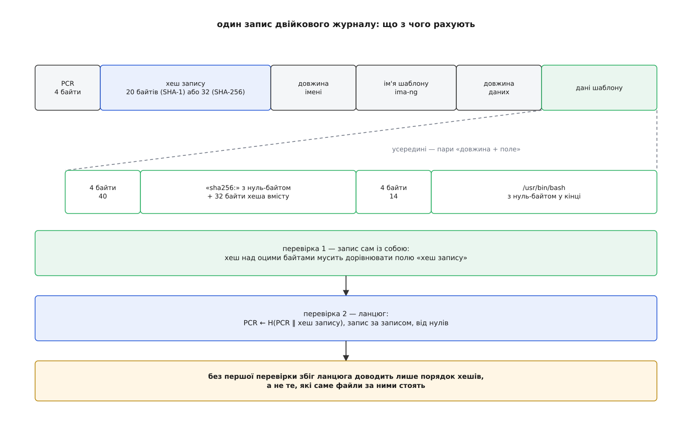
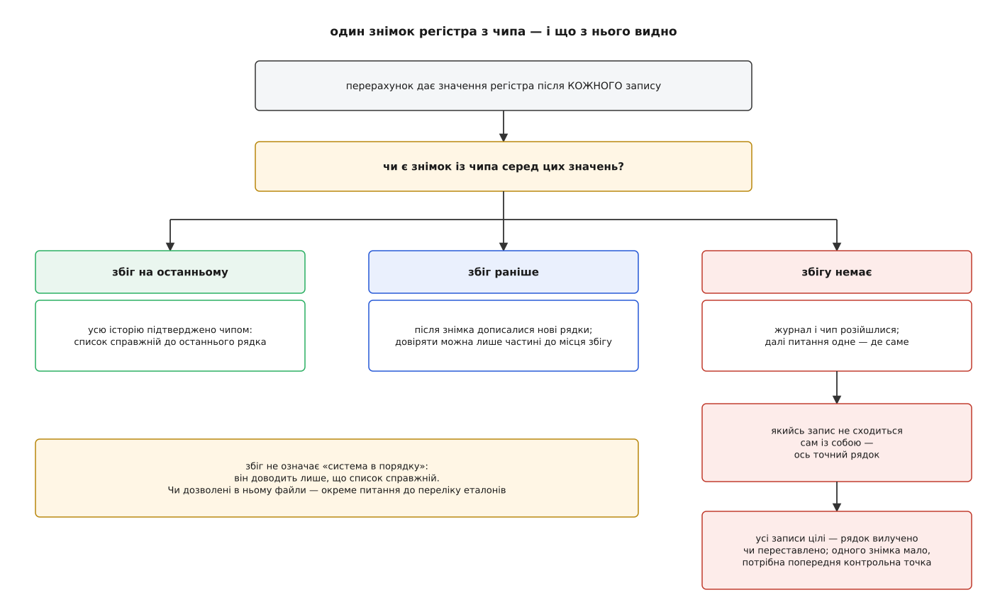

# ⚙️ Перерахувати список вимірювань і зловити розбіжність

Перевіряч отримує від чужої машини дві речі — копію двійкового журналу вимірювань і значення регістра PCR 10, підписане чипом, — і має сказати не «сходиться чи ні», а щось значно корисніше: чи можна взагалі читати цей журнал, а якщо не можна, то на якому саме записі історія розійшлася з чипом. Різниця практична. «Не сходиться» на парку з тисячі машин означає нічний обхід усього парку; «сходиться до запису 4187, далі йдуть рядки, дописані вже після знімка» означає, що все гаразд і треба просто взяти свіжіший знімок.

## Чому не текстовий переказ

Спокуса читати `ascii_runtime_measurements` велика: там усе видно очима. Але текстовий файл — це **зображення** журналу, а не він сам, і перевірити за ним нічого не можна з двох причин.

Перша: хеш запису рахують над двійковими байтами, у яких **довжини полів є частиною даних**, а в тексті довжин немає взагалі. Друга гостріша — ядро підміняє в іменах пробіли підкресленнями, бо в текстовому рядку пробіл править за роздільник. Файл `/tmp/my file` стане в переказі `/tmp/my_file`, і це вже не той рядок, який згорнувся в регістр.

Але головне не у форматі. Наївний перерахунок бере хеш запису **з самого журналу** — з другого поля рядка. Тоді збіг ланцюга доводить рівно одне: що саме ця послідовність коротких чисел справді пройшла крізь чип. Про те, які файли за цими числами стоять, він не доводить нічого. Досить підправити в записі шлях, лишивши поле хеша недоторканим, — і ланцюг зійдеться ідеально, а перевіряч прочитає чужу вигадку. Тому перевірок має бути дві, і перша важливіша за другу.



*Спершу кожен запис звіряють із самим собою, і лише потім складають із записів ланцюг.*

## Розібрати запис

Розкладка стала: чотири байти номера регістра, хеш запису, чотири байти довжини імені шаблону, саме ім'я без нуля в кінці, чотири байти довжини даних, дані. Усередині даних — пари «довжина поля, поле». Багатобайтові числа лежать у порядку байтів **тієї машини, що вела журнал**, якщо їй не задали `ima_canonical_fmt`; перевіряч зазвичай працює на іншій, тож порядок треба вгадати. Вгадується він з першого ж поля: номер регістра — маленьке число, і в чужому порядку воно стало б велетенським. Що таке порядок байтів і чому він досі різний на різних машинах — [біти й порядок байтів](book:programming/bits-bytes-endianness).

Один виняток псує картину: найдавніший шаблон на ім'я `ima`. У нього немає поля довжини даних узагалі, хеш файлу лежить голими двадцятьма байтами без довжини, а ім'я ядро хешує в буфері на 256 байтів, доповненому нулями. Це не примха, а слід епохи, коли шаблон був один-єдиний і поля не треба було розрізняти.

```py
import hashlib, struct, sys

class Cursor:
    def __init__(self, blob, order):
        self.b, self.o, self.order = blob, 0, order

    def u32(self):
        v = struct.unpack_from(self.order + "I", self.b, self.o)[0]
        self.o += 4
        return v

    def take(self, n):
        v = self.b[self.o:self.o + n]
        self.o += n
        return v

    def more(self):
        return self.o < len(self.b)


def entries(blob, dlen):
    if not blob:
        return
    # журнал написано в порядку байтів тієї машини; номер регістра малий,
    # тож чужий порядок видно вже з першого поля
    order = "<" if struct.unpack_from("<I", blob, 0)[0] < 256 else ">"
    c, n = Cursor(blob, order), 0
    while c.more():
        n += 1
        pcr = c.u32()
        digest = c.take(dlen)
        name = c.take(c.u32()).decode("ascii")
        if name == "ima":                              # найдавніший шаблон
            body = c.take(20) + c.take(c.u32()).ljust(256, b"\x00")
        else:
            body = c.take(c.u32())                     # пари «довжина + поле» підряд
        yield n, pcr, digest, name, body
```

`body` — це рівно ті байти, які хешувало ядро, тож звірка запису з самим собою коштує один виклик хеша.

## Скласти ланцюг

Тепер обидві перевірки в одному проході. Дві деталі тут не очевидні й обидві варті уваги.

Перша — порушення цілісності. Коли ядро бачить, що файл вимірювали під час запису в нього, воно кладе в журнал запис із **нульовим** хешем, а в чип відправляє **одиничні** байти. Перевіряч мусить цю отруту відтворити: інакше ланцюг у нього розійдеться з чипом і він звинуватить машину в брехні там, де вона чесно зізналася. Нульовий хеш і є міткою — саме за нею порушення впізнають, і саме тому такий запис не проганяють крізь першу перевірку.

Друга — проміжні значення. Знімок регістра беруть в одну мить, журнал росте в іншу, атомарно прочитати їх разом ніяк. Тому запам'ятовуємо стан регістра **після кожного запису**: тоді знімок шукається серед усіх станів одним пошуком у словнику, і відповідь виходить не «так чи ні», а «так, станом на запис такий-то».

```py
def replay(blob, algo):
    h = lambda b: hashlib.new(algo, b).digest()
    dlen = hashlib.new(algo).digest_size
    pcr, trace = b"\x00" * dlen, {}
    broken, violations = [], []
    for n, _idx, digest, name, body in entries(blob, dlen):
        if digest == b"\x00" * dlen:            # порушення: у список ідуть нулі,
            violations.append((n, name))        # а в чип — одиниці
            digest = b"\xff" * dlen
        elif digest != h(body):
            broken.append((n, name))            # запис не сходиться сам із собою
        pcr = h(pcr + digest)
        trace[pcr] = n
    return trace, broken, violations


def main(path, quoted_hex, algo="sha1"):
    trace, broken, violations = replay(open(path, "rb").read(), algo)
    total = max(trace.values(), default=0)

    for n, name in broken:
        print(f"запис {n} ({name}): хеш запису не відповідає власним даним")
    for n, name in violations:
        print(f"запис {n} ({name}): порушення — регістр отруєно навмисне")

    at = trace.get(bytes.fromhex(quoted_hex))
    if at is None:
        print("знімок із чипа не збігається з жодним станом ланцюга — журналу вірити не можна")
    elif at == total:
        print(f"збіг на останньому записі: чип підтверджує всі {total} рядків")
    else:
        print(f"збіг на записі {at}: рядки {at + 1}..{total} дописано вже після знімка")


if __name__ == "__main__":
    main(*sys.argv[1:])
```

Номер запису тут — не абстракція: він збігається з номером рядка в текстовому переказі, тож `sed -n '4187p'` одразу показує, про який файл ідеться. Скільки записів має бути, каже `runtime_measurements_count`: збігається з нашим лічильником — розбір не з'їхав.

## Що воно ловить

На зібраному з нуля журналі з п'ятьма записами (серед них одне порушення й один запис за найдавнішим шаблоном) три сценарії дають три різні відповіді:

```
$ python ima_replay.py log.bin 900c7f5d…252d          # свіжий знімок
запис 3 (ima-ng): порушення — регістр отруєно навмисне
збіг на останньому записі: чип підтверджує всі 5 рядків

$ python ima_replay.py log.bin 756819dd…c68           # знімок після третього запису
запис 3 (ima-ng): порушення — регістр отруєно навмисне
збіг на записі 3: рядки 4..5 дописано вже після знімка

$ python ima_replay.py log.tampered 900c7f5d…252d     # у записі 2 підмінено шлях
запис 2 (ima-ng): хеш запису не відповідає власним даним
збіг на останньому записі: чип підтверджує всі 5 рядків
```

Третій випадок — уся суть роботи. **Ланцюг зійшовся.** Чип підтвердив історію, наївний перерахунок сказав би «усе чудово» — і показав би шлях, якого ніхто ніколи не виконував. Спіймала підміну лише перевірка запису самого із собою.

А от коли зі списку **вилучають** рядок, кожен уцілілий запис лишається бездоганним, і збігу немає ніде. Тоді один знімок дає рівно один біт: журналові вірити не можна. Локалізувати нічим — попереднього стану регістра в нас немає, а вивести його з поточного не дає та сама незворотність, на якій усе тримається. Звідси й будова справжніх систем атестації: вони питають машину **регулярно** й тримають останнє підтверджене значення, тож перерахувати треба лише хвіст, а розбіжність одразу затиснута між двома опитуваннями. Ця схема ширша за IMA й описана окремо — [віддалена атестація](book:programming/remote-attestation) відповідає на питання, як одна сторона доводить іншій, у якому вона стані.

## Чого номер запису не означає

Рахуючи рядки, легко почати читати їх як хроніку запусків. Це помилка: ядро тримає хеш-таблицю вже доданих вимірювань і **другий раз той самий хеш у той самий регістр не кладе** — запис відкидається ще до розширення. Отже, список не каже, скільки разів виконувався `/usr/bin/bash`, він каже лише, які **різні** стани файлів взагалі бачила система від увімкнення. Порушення — виняток: їх це правило обходить, тому однакових отруйних записів може бути кілька поспіль.

Наслідок для перевіряча несподівано корисний. Якщо один і той самий шлях трапляється в журналі двічі, це не шум і не повтор — це означає, що між двома вимірюваннями **вміст файлу змінився**. Оновлення пакета виглядає так само, як підміна; розрізнити їх може вже тільки перелік еталонів.



*Один знімок дає повну відповідь лише тоді, коли він збігся; розбіжність без другої точки відліку не локалізується.*

## Ціна і пастки

Робота лінійна: два хешування на запис і один прохід. Журнал у сто тисяч рядків — це близько десятка мегабайтів і частка секунди, і навіть на такому розмірі вузьким місцем стає читання файлу, а не арифметика. Пам'ять — єдине, на що варто зважати: тягнути весь файл до себе не обов'язково, розбір чудово живе на потоці.

Що псує життя насправді:

- **Банк хешів.** `binary_runtime_measurements` — це символьне посилання на `..._sha1`; поруч лежать файли інших банків, і в них довжина хеша запису інша. Хеш перерахунку й довжина поля мусять збігатися з банком, з якого взято знімок регістра. Помилка тут не падає, а тихо з'їжджає: розбір читає довжину не з того місця й далі меле сміття. Ловиться це двома дешевими умовами — номер регістра має бути меншим за 24, а ім'я шаблону складатися з друкованих символів; щойно щось із цього порушено, розбір розсинхронізувався, і винен майже завжди банк.
- **Старі ядра.** До появи підтримки кількох банків ядро розширювало банк SHA-256 тим самим двадцятибайтовим хешем, доповненим нулями. Перевіряч, який чесно рахує SHA-256, на такій машині не зійдеться ніколи — і не тому, що вона бреше.
- **Перший запис.** `boot_aggregate` не виводиться зі списку взагалі: це згортка регістрів, які заповнила прошивка (0–7, а в новіших ядрах для банків, відмінних від SHA-1, ще 8 і 9). Його звіряють із журналом подій прошивки — окремим списком з окремими правилами.
- **Свіжість знімка.** Підпис під значенням регістра має накривати надіслане перевірячем випадкове число, інакше машина покаже торішній підпис, зроблений тоді, коли вона ще була чистою. Сама перевірка підпису — робота ключа з чипа, а не цього коду: [TPM і TrustZone: апаратний корінь довіри](root:embedded/tpm-trustzone).
- **Збіг — не вирок про здоров'я.** Він доводить, що список справжній, і рівно на цьому зупиняється. Чи дозволено виконувати те, що в списку, вирішує зіставлення з переліком еталонів — інша задача, інші дані. Формати шаблонів і полів, за якими з `body` дістають шлях і хеш файлу, зібрано в [поверхні керування IMA](book:unix-linux/ima-appraisal/api-ima-policy.md).
