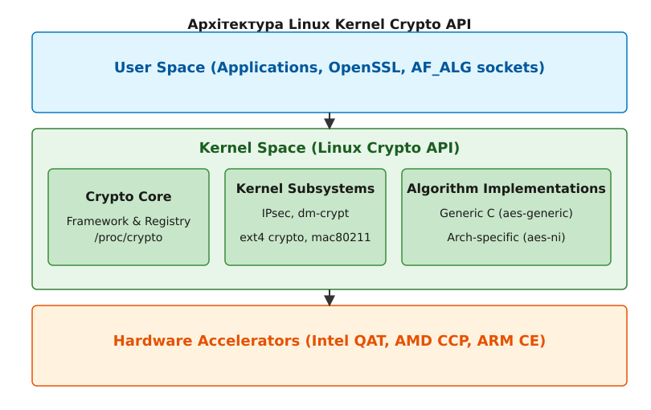

# Криптографічний API ядра (Kernel Crypto API)

<preknowlist>
- [Концепції ядра Linux](book:unix-linux/kernel-and-userspace) — базові поняття системних викликів та VFS.
</preknowlist>

Криптографічний API ядра Linux (Kernel Crypto API) — це потужний та гнучкий фреймворк, який забезпечує єдиний інтерфейс для виконання криптографічних операцій як всередині самого ядра, так і для користувацького простору (через спеціалізовані сокети). Спочатку розроблений для потреб IPsec у серії ядер 2.5, він з часом розрісся до масштабної підсистеми, яка зараз обслуговує шифрування дисків (dm-crypt), мережеві протоколи (mac80211, Bluetooth), файлові системи (ext4, f2fs, ubifs), а також надає апаратне прискорення через спеціалізовані процесорні інструкції (AES-NI, ARM CE) та зовнішні прискорювачі (Intel QAT, AMD CCP).

Мета цього розділу — детально розібрати архітектуру Kernel Crypto API, його базові абстракції (алгоритми та трансформації), відмінності між синхронними та асинхронними запитами, механізми доступу з користувацького простору через `AF_ALG`, а також процеси апаратного прискорення та діагностики за допомогою `/proc/crypto`.

---

## 1. Архітектура та роль у системі

Linux Kernel Crypto API побудований за принципом абстрагування реалізацій від їхніх споживачів. Будь-який модуль ядра, якому потрібна криптографія (наприклад, `dm-crypt`), не викликає конкретну функцію шифрування безпосередньо. Замість цього він звертається до ядра з проханням надати екземпляр алгоритму (наприклад, `"xts(aes)"`). Ядро, використовуючи механізм пріоритетів, автоматично підбирає найкращу доступну реалізацію для поточної апаратної платформи.


*Рис. 1. Загальна архітектура Crypto API та її взаємодія з підсистемами*

Фреймворк складається з кількох основних шарів:
1. **Frontend (Клієнтський інтерфейс):** Набір макросів та функцій, які використовують інші підсистеми ядра для виконання шифрування, хешування або стиснення.
2. **Core (Ядро фреймворку):** Відповідає за реєстрацію алгоритмів, їх маршрутизацію, управління життєвим циклом (instantiation) та диспетчеризацію запитів.
3. **Backend (Реалізації алгоритмів):** Модулі, які безпосередньо виконують математичні операції. Вони можуть бути суто програмними (C-код), оптимізованими під певну архітектуру (наприклад, асемблерні вставки) або апаратними (взаємодія з криптопроцесором).

---

## 2. Базові абстракції: Алгоритми та Трансформації

У Crypto API фундаментально розрізняються два поняття: **алгоритм** (`struct crypto_alg`) та **трансформація** (Transformation object, TFM).

### 2.1. Алгоритми (`struct crypto_alg`)
Алгоритм — це шаблон або рецепт. Він описує, як саме працює певний криптографічний метод (наприклад, AES, SHA-256, RSA), який розмір блоку він використовує, які його вимоги до вирівнювання пам'яті (alignment) та які функції слід викликати для його ініціалізації чи виконання.

Кожен алгоритм в ядрі представлений структурою `struct crypto_alg`. У ядрі можуть співіснувати декілька реалізацій одного й того ж алгоритму. Наприклад, для AES може бути зареєстрована:
- Універсальна C-реалізація (`aes-generic`).
- Оптимізована x86-реалізація.
- Реалізація, що використовує інструкції AES-NI (`aes-ni`).
- Реалізація на базі зовнішнього прискорювача Intel QAT.

Щоб розрізняти їх, Crypto API використовує текстові імена: `cra_name` (наприклад, `"aes"`) та `cra_driver_name` (наприклад, `"aes-ni"`). Коли клієнт запитує `"aes"`, ядро обирає реалізацію з найвищим показником пріоритету (`cra_priority`). Якщо ж клієнту потрібна конкретна реалізація, він може запросити її за `cra_driver_name`.

### 2.2. Трансформації (TFM)
Якщо алгоритм — це клас у об'єктно-орієнтованому програмуванні, то TFM (Transform) — це об'єкт (екземпляр) цього класу. 
Коли споживачу потрібно виконати шифрування, він виділяє TFM об'єкт за допомогою функцій на кшталт `crypto_alloc_skcipher()`, `crypto_alloc_ahash()`, тощо. 

TFM зберігає стан конкретної сесії (або контексту):
- Ключі шифрування.
- Внутрішні буфери та вектори ініціалізації (IV).
- Вказівники на функції бекенду (що дозволяє викликати їх швидко, без постійного пошуку в реєстрах).

Об'єкти TFM є thread-safe для одночасного використання, якщо вони не містять спільного мутабельного стану (хоча ключі зазвичай встановлюються один раз). Проте для багатопотокових або асинхронних операцій кожен запит (Request) інкапсулює свій власний локальний стан (наприклад, поточний хеш або IV).

---

## 3. Синхронний та Асинхронний інтерфейси

Сучасне ядро Linux має справу з гігабітними потоками даних та мікросекундними затримками. Відповідно, криптографічні операції можуть виконуватися як синхронно (блокуючи поточний потік до завершення), так і асинхронно.

### 3.1. Синхронний API (Block Ciphers, Shashes)
Синхронний API використовується, коли операція гарантовано виконується процесором миттєво, без очікування DMA, переривань чи зовнішніх пристроїв. Це типово для програмних реалізацій та простих асемблерних оптимізацій. 
Наприклад, підсистема `shash` (Synchronous Hash) вимагає, щоб усі функції (`init`, `update`, `final`) відпрацьовували у контексті виклику та не повертали управління до повного завершення.

### 3.2. Асинхронний API (Ahash, Skcipher, AEAD)
Асинхронний API є більш універсальним і розрахований на використання апаратних прискорювачів. Операції шифрування дисків (`dm-crypt`) або IPsec переважно працюють через асинхронні інтерфейси.

У цьому випадку, споживач формує запит (`struct skcipher_request` або `struct ahash_request`), який містить:
1. Вказівник на TFM.
2. Вхідні та вихідні дані у вигляді **Scatterlist** (структура, що дозволяє передавати несуміжні блоки фізичної пам'яті).
3. Функцію зворотного виклику (callback) та контекст даних.

Коли клієнт викликає, наприклад, `crypto_skcipher_encrypt(req)`, функція може повернути:
- `0` — якщо операція виконалася одразу (навіть асинхронні драйвери можуть виконувати малі запити синхронно для економії накладних витрат).
- `-EINPROGRESS` — запит прийнято до черги прискорювача. Управління повертається, а коли апаратура завершить роботу, вона згенерує переривання, і ядро викличе вказаний callback.
- `-EBUSY` — черга переповнена (залежно від прапорців, це може вимагати від клієнта повторити спробу пізніше).

Використання Scatterlists (SG-lists) є критично важливим, оскільки це дозволяє DMA-контролерам криптографічних прискорювачів (таких як Intel QAT) безпосередньо читати з та писати у фізичну пам'ять (Direct Memory Access) без додаткового копіювання буферів, що суттєво підвищує продуктивність на великих об'ємах даних.

---

## 4. Взаємодія з користувацьким простором: AF_ALG

Тривалий час користувацькі програми (userspace) не мали доступу до Kernel Crypto API і змушені були використовувати власні бібліотеки (OpenSSL, GnuTLS, libgcrypt). Це призводило до дублювання коду, а головне — користувацькі програми часто не могли ефективно утилізувати апаратні прискорювачі, драйвери яких існували лише в ядрі.

Починаючи з ядра 2.6.38, було впроваджено інтерфейс **AF_ALG** (Address Family: Algorithm). Це механізм на базі мережевих сокетів, який дозволяє userspace-програмам використовувати ядерну криптографію через стандартні системні виклики `socket()`, `bind()`, `send()`, `recv()`.

### Як працює AF_ALG:
1. **Створення сокета:** Програма створює сокет з доменом `AF_ALG`, типом `SOCK_SEQPACKET`.
2. **Конфігурація (bind):** Через `bind()` програма передає структуру `sockaddr_alg`, де вказує тип алгоритму (наприклад, `"hash"`, `"skcipher"`, `"aead"`) та його ім'я (наприклад, `"sha256"` або `"cbc(aes)"`).
3. **Налаштування ключів (setsockopt):** Використовуючи `setsockopt()`, встановлюються ключі шифрування (опція `ALG_SET_KEY`).
4. **Створення операційного дескриптора (accept):** Виклик `accept()` на цьому сокеті не приймає мережевих з'єднань, а повертає новий файловий дескриптор, який прив'язаний до поточного криптографічного контексту (TFM).
5. **Обробка даних:** Програма відправляє дані для шифрування/хешування через `sendmsg()` (передаючи додаткові контрольні повідомлення, такі як IV або прапорці шифрування/розшифрування) і читає результат через `recvmsg()`.

Ще ефективніше використання досягається за допомогою `sendfile()` або `splice()`, коли дані перекидаються з файлу безпосередньо у криптографічний сокет (Zero-Copy), що дозволяє, наприклад, розрахувати хеш великого файлу взагалі без копіювання його вмісту в користувацьку пам'ять.

---

## 5. Апаратне прискорення та діагностика

Сучасні процесори мають вбудовані інструкції для криптографії (Intel/AMD AES-NI, ARM Cryptography Extensions). Ядро Linux автоматично розпізнає наявність цих інструкцій під час завантаження (через CPUID) та завантажує відповідні модулі (наприклад, `aesni_intel`). 

Для важких навантажень (VPN-шлюзи, хмарні сервери) застосовуються зовнішні SoC-прискорювачі або PCIe-карти, такі як **Intel QuickAssist Technology (QAT)**. Драйвер QAT реєструє свої алгоритми у Crypto API з надзвичайно високим пріоритетом. Коли користувач створює TFM для AES-GCM, ядро обирає QAT, і всі запити автоматично маршрутизуються до PCIe-пристрою через кільцеві буфери DMA.

### Діагностика через `/proc/crypto`
Найпростіший спосіб дізнатися, які алгоритми підтримує ваше ядро та які саме драйвери обробляють ваші запити — прочитати віртуальний файл `/proc/crypto`.

Типовий вивід виглядає так:

```text
name         : aes
driver       : aes-ni
module       : aesni_intel
priority     : 300
refcnt       : 1
selftest     : passed
internal     : no
type         : cipher
blocksize    : 16
min keysize  : 16
max keysize  : 32
```

Ключові поля:
- `name`: Загальна назва алгоритму.
- `driver`: Специфічне ім'я реалізації. Якщо ви бачите `aes-generic`, це означає програмну обробку (без апаратного прискорення).
- `priority`: Числове значення (наприклад, 300, 400). При запиті алгоритму "aes", ядро завжди обирає драйвер з найвищим пріоритетом.
- `selftest`: `passed` вказує на те, що драйвер успішно пройшов автоматичні тести на відомих векторах при реєстрації.
- `type`: Тип алгоритму (`cipher`, `shash`, `skcipher`, `aead` тощо).

Аналізуючи `/proc/crypto`, адміністратори можуть швидко з'ясувати, чи працює апаратне прискорення належним чином. Наприклад, якщо IPsec тунель навантажує CPU до 100%, перевірка `/proc/crypto` може виявити, що модуль `aesni_intel` не завантажений, і ядро падає до повільного `aes-generic`.

---

## 6. Реєстрація власного криптографічного модуля

Для розробників модулів ядра написання власного криптографічного провайдера вимагає імплементації інтерфейсів реєстрації. Нижче наведено схематичний приклад того, як драйвер реєструє новий алгоритм хешування.

```c
#include <linux/module.h>
#include <linux/crypto.h>
#include <crypto/internal/hash.h>

/* Внутрішній контекст алгоритму */
struct my_hash_ctx {
    u32 state[8];
    u64 count;
};

/* Функція ініціалізації */
static int my_hash_init(struct shash_desc *desc)
{
    struct my_hash_ctx *ctx = shash_desc_ctx(desc);
    /* Ініціалізація стану... */
    return 0;
}

/* Функція оновлення даних */
static int my_hash_update(struct shash_desc *desc, const u8 *data, unsigned int len)
{
    struct my_hash_ctx *ctx = shash_desc_ctx(desc);
    /* Обробка вхідних даних data довжиною len... */
    return 0;
}

/* Функція завершення */
static int my_hash_final(struct shash_desc *desc, u8 *out)
{
    struct my_hash_ctx *ctx = shash_desc_ctx(desc);
    /* Запис результату в out... */
    return 0;
}

/* Опис алгоритму */
static struct shash_alg my_alg = {
    .init       = my_hash_init,
    .update     = my_hash_update,
    .final      = my_hash_final,
    .descsize   = sizeof(struct my_hash_ctx),
    .digestsize = 32, /* 256 біт */
    .base       = {
        .cra_name       = "myhash256",
        .cra_driver_name= "myhash256-generic",
        .cra_priority   = 100,
        .cra_blocksize  = 64,
        .cra_module     = THIS_MODULE,
    }
};

static int __init my_crypto_init(void)
{
    return crypto_register_shash(&my_alg);
}

static void __exit my_crypto_exit(void)
{
    crypto_unregister_shash(&my_alg);
}

module_init(my_crypto_init);
module_exit(my_crypto_exit);

MODULE_LICENSE("GPL");
MODULE_DESCRIPTION("My Custom Hash Algorithm");
```

Коли цей модуль завантажується, він реєструє `myhash256` за допомогою `crypto_register_shash()`. Після цього будь-яка інша частина ядра (або userspace через AF_ALG) зможе виділити TFM для `"myhash256"` і почати хешування даних.

---

## Висновок

Linux Kernel Crypto API — це елегантне архітектурне рішення, яке розділяє логіку споживачів криптографії та реалізаторів математичних алгоритмів. Завдяки абстракціям TFM та алгоритмів, ядро досягає максимальної гнучкості: підсистеми на кшталт dm-crypt можуть прозоро перемикатися з повільного програмного шифрування на потужні апаратні прискорювачі без жодних змін у власному коді. Розуміння цієї архітектури є критично важливим для системних адміністраторів під час налаштування високопродуктивних мереж, а також для розробників, які проектують захищені та масштабовані системи на базі Linux.
