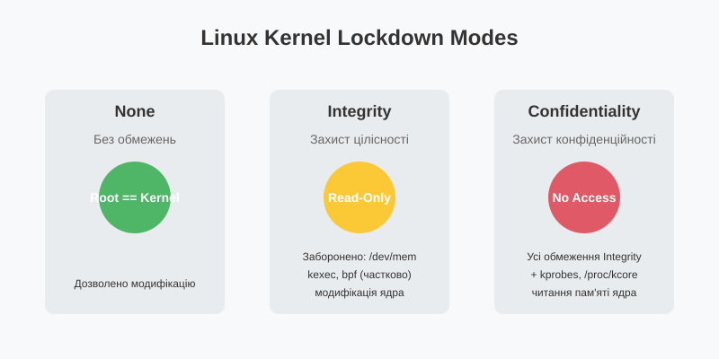

# Режим мажоритарного захисту ядра: Kernel Lockdown Mode

<preknowlist>
- [Концепції ядра Linux](book:unix-linux/kernel-and-userspace) — базові поняття системних викликів та VFS.
</preknowlist>

## 1. Вступ та проблематика

Історично в операційній системі Linux користувач `root` (UID 0) мав безмежну владу над системою. Ця парадигма означала, що будь-який процес, який виконується з правами суперкористувача, міг не лише керувати процесами простору користувача (user space), але й безпосередньо втручатися в роботу простору ядра (kernel space). Наприклад, суперкористувач міг завантажувати довільні модулі ядра, безпосередньо звертатися до фізичної пам'яті через `/dev/mem` або модифікувати структури даних ядра "на льоту".

Ця архітектурна особливість створювала фундаментальну проблему безпеки: якщо зловмисник отримував права `root` (наприклад, через вразливість у системному сервісі), він міг повністю скомпрометувати ядро. Встановлення руткіта на рівні ядра (kernel-mode rootkit) робило його практично невидимим для засобів захисту, що працюють у просторі користувача.

Крім того, з появою технології UEFI Secure Boot виникла ще одна суперечність. Secure Boot гарантує, що лише криптографічно підписаний та довірений код може бути завантажений як ядро операційної системи. Проте, якщо після завантаження довіреного ядра суперкористувач міг завантажити непідписаний модуль ядра або безпосередньо змінити пам'ять ядра, весь ланцюжок довіри (chain of trust) Secure Boot руйнувався.

Саме для вирішення цих проблем, а також для чіткого розмежування привілеїв між користувачем `root` та ядром, було впроваджено **Kernel Lockdown Mode** (Режим блокування ядра).

## 2. Що таке Kernel Lockdown Mode?

Kernel Lockdown Mode — це функція безпеки ядра Linux (представлена як Linux Security Module - LSM), яка обмежує доступ користувача `root` до простору ядра. Її основна мета — запобігти модифікації коду та даних ядра навіть процесами з найвищими привілеями у просторі користувача.

Коли режим Lockdown активовано, ядро переходить у стан, коли певні інтерфейси, які історично використовувалися для адміністрування та налагодження (але водночас дозволяли модифікацію ядра), блокуються або обмежуються.

За замовчуванням, у багатьох сучасних дистрибутивах Linux Lockdown автоматично активується, якщо система завантажується з увімкненим UEFI Secure Boot. Це забезпечує цілісність системи від моменту ввімкнення живлення до завершення роботи.

### 2.1. Режими роботи

Kernel Lockdown Mode підтримує два основні рівні захисту, які визначаються параметром ядра або налаштуваннями LSM: **Integrity** (Цілісність) та **Confidentiality** (Конфіденційність). Також існує стан **None** (Вимкнено), коли блокування не застосовується.



#### 2.1.1. Режим "None" (Вимкнено)
У цьому режимі ядро функціонує за класичною моделлю Linux. Користувач `root` має повний доступ до всіх ресурсів системи, включаючи можливість прямої модифікації ядра. Ніякі обмеження Lockdown не застосовуються.

#### 2.1.2. Режим "Integrity" (Цілісність)
Режим Integrity фокусується на запобіганні модифікації ядра простором користувача. Його головна мета — гарантувати, що код ядра не може бути змінений після завантаження. 

У цьому режимі блокуються інтерфейси, які дозволяють процесам простору користувача записувати дані в пам'ять ядра або змінювати поведінку ядра непередбаченим чином. Наприклад, забороняється прямий запис до `/dev/mem` та `/dev/kmem`, обмежується використання викликів `iopl()` та `ioperm()`, а також блокується завантаження непідписаних модулів ядра.

Цей режим забезпечує дотримання політики UEFI Secure Boot, оскільки унеможливлює обхід перевірки підписів шляхом модифікації ядра в пам'яті.

#### 2.1.3. Режим "Confidentiality" (Конфіденційність)
Режим Confidentiality є ще більш суворим. Він включає всі обмеження режиму Integrity, але додатково фокусується на захисті конфіденційної інформації (наприклад, криптографічних ключів, паролів або інших чутливих даних), яка може зберігатися в пам'яті ядра.

У цьому режимі блокуються інтерфейси, які дозволяють процесам простору користувача зчитувати пам'ять ядра. Це означає заборону читання з `/dev/mem`, `/dev/kmem`, `/proc/kcore`, а також блокування використання інструментів налагодження, таких як `kprobes` та BPF-програми, які можуть отримувати доступ до даних ядра.

Цей режим корисний у середовищах з підвищеними вимогами до безпеки, де навіть користувач `root` не повинен мати доступу до чутливих даних, які обробляються ядром (наприклад, у хмарних інфраструктурах для захисту даних орендарів).

## 3. Інтерфейс /sys/kernel/security/lockdown

Стан Kernel Lockdown Mode можна перевірити та, в деяких випадках, змінити через віртуальну файлову систему `sysfs`. Відповідний файл знаходиться за шляхом `/sys/kernel/security/lockdown`.

### 3.1. Перевірка поточного стану

Щоб перевірити, який режим Lockdown наразі активовано, можна прочитати вміст цього файлу:

```bash
$ cat /sys/kernel/security/lockdown
[none] integrity confidentiality
```

Вивід показує доступні режими, а поточний активований режим взято у квадратні дужки `[]`. У наведеному прикладі активним є режим `none`.

Якщо активний режим `integrity`:
```bash
$ cat /sys/kernel/security/lockdown
none [integrity] confidentiality
```

### 3.2. Зміна режиму

Можливість зміни режиму Lockdown "на льоту" (під час роботи системи) суворо обмежена з міркувань безпеки:

1. **Односторонній перехід:** Рівень блокування можна лише підвищувати. Ви можете перейти з `none` до `integrity`, або з `integrity` до `confidentiality`.
2. **Неможливість пониження:** Знизити рівень блокування (наприклад, перейти з `integrity` до `none`) неможливо без перезавантаження системи. Це зроблено для того, щоб зловмисник, отримавши права `root`, не міг просто вимкнути Lockdown і модифікувати ядро.

Щоб підвищити рівень блокування, можна записати відповідне значення у файл (якщо у вас є права `root`):

```bash
# Перехід до режиму integrity
echo integrity > /sys/kernel/security/lockdown

# Перехід до режиму confidentiality
echo confidentiality > /sys/kernel/security/lockdown
```

Зауважте, що часто режим встановлюється під час завантаження через параметри командного рядка ядра (наприклад, `lockdown=integrity`) або автоматично через UEFI Secure Boot, і змінити його в меншу сторону під час роботи системи неможливо.

## 4. Обмеження режиму Lockdown

Увімкнення Lockdown впливає на низку системних інтерфейсів та функцій. Нижче наведено детальний огляд основних обмежень, які застосовуються у режимах Integrity та Confidentiality.

### 4.1. Доступ до фізичної пам'яті (/dev/mem та /dev/kmem)

Файли пристроїв `/dev/mem` та `/dev/kmem` історично надавали прямий доступ до фізичної пам'яті системи та віртуального адресного простору ядра відповідно. Хоча вони були корисні для розробки та налагодження (наприклад, для інструменту X сервера або різних утиліт апаратного моніторингу), вони також дозволяли користувачеві `root` вільно читати та модифікувати будь-які дані в пам'яті.

*   **У режимі Integrity:** Блокується **запис** до `/dev/mem` та `/dev/kmem`. Це запобігає модифікації коду ядра, таблиць системних викликів або інших критичних структур даних.
*   **У режимі Confidentiality:** Додатково блокується **читання** з цих пристроїв, щоб запобігти витоку конфіденційної інформації (наприклад, ключів шифрування).

### 4.2. Прямий доступ до портів вводу/виводу (iopl та ioperm)

Системні виклики `iopl()` та `ioperm()` дозволяють процесам простору користувача отримувати прямий доступ до апаратних портів вводу/виводу. Цей механізм часто використовувався X сервером (в старих версіях) та різними драйверами простору користувача для взаємодії з обладнанням.

Однак, прямий доступ до портів I/O може бути використаний для обходу обмежень ядра або для ініціації апаратних атак (наприклад, DMA-атак), які можуть скомпрометувати ядро.

*   **У режимі Integrity (і Confidentiality):** Використання системних викликів `iopl()` та `ioperm()` суворо обмежується або повністю забороняється (залежно від конкретної архітектури та реалізації).

### 4.3. Динамічне налагодження (kprobes та BPF)

Інструменти динамічного налагодження та трасування, такі як `kprobes`, `ftrace` та eBPF (Extended Berkeley Packet Filter), є надзвичайно потужними для аналізу продуктивності та відлагодження ядра. Проте вони також дозволяють впроваджувати код або спостерігати за внутрішнім станом ядра.

*   **У режимі Integrity:**
    *   Обмежується використання eBPF для модифікації структур даних ядра.
    *   `kprobes` може бути дозволено, якщо він не дозволяє вносити зміни, але загальна тенденція йде до його обмеження.
*   **У режимі Confidentiality:**
    *   Використання `kprobes` та BPF для читання пам'яті ядра повністю блокується. Це гарантує, що інструменти трасування не можуть бути використані для вилучення криптографічних ключів або інших секретів з адресного простору ядра.

### 4.4. Модифікація таблиць ACPI

ACPI (Advanced Configuration and Power Interface) — це стандарт, який визначає інтерфейси для виявлення апаратного забезпечення, управління живленням та конфігурації. Таблиці ACPI зазвичай надаються прошивкою (BIOS/UEFI).

Linux дозволяє перевизначати (override) таблиці ACPI за допомогою файлу, наданого користувачем, під час завантаження системи або через initrd (initial ramdisk). Це часто використовується розробниками для виправлення помилок у прошивці або тестування нових конфігурацій.

Проте, модифіковані таблиці ACPI можуть містити шкідливий AML-код (ACPI Machine Language), який виконується ядром і може потенційно змінити його поведінку або обійти механізми безпеки.

*   **У режимі Integrity (і Confidentiality):** Перевизначення таблиць ACPI (ACPI tables override) блокується. Ядро довірятиме лише тим таблицям ACPI, які надані безпосередньо прошивкою, підписані (якщо це підтримується архітектурою) або завантажені у безпечний спосіб, який не порушує ланцюжок довіри.

### 4.5. Інші обмеження

Крім перелічених, Lockdown впливає на низку інших функцій:

*   **Модулі ядра (kexec):** Забороняється використання `kexec` (механізм, що дозволяє завантажувати нове ядро без апаратного перезавантаження) для завантаження непідписаних ядер або ядер, які не проходять перевірку Secure Boot.
*   **Хібернація:** Може бути обмежена або вимагати додаткової перевірки цілісності образу пам'яті (swap file) для запобігання підміні даних під час пробудження.
*   **PCMCIA CIS:** Обмеження доступу до структур даних Card Information Structure.
*   **MMIO (Memory-Mapped I/O):** Блокування прямого доступу до відображених у пам'ять регістрів пристроїв.

## 5. Взаємодія з UEFI Secure Boot

Однією з найважливіших причин існування Kernel Lockdown Mode є забезпечення виконання політик UEFI Secure Boot.

Secure Boot — це стандарт безпеки, розроблений індустрією ПК, щоб гарантувати, що пристрій завантажується лише з використанням програмного забезпечення, якому довіряє виробник оригінального обладнання (OEM). Коли комп'ютер вмикається, прошивка UEFI перевіряє криптографічний підпис кожного компонента завантаження, включаючи драйвери прошивки (Option ROMs), додатки EFI та операційну систему. Якщо підписи дійсні, ПК завантажується.

У середовищі Linux це означає, що завантажувач (наприклад, GRUB) і ядро Linux повинні бути підписані ключем, якому довіряє система. Це запобігає завантаженню шкідливого коду, такого як буткіти, на етапі запуску.

Однак, до впровадження Lockdown, існувала "лазівка". Навіть якщо ядро було завантажене безпечно і його цілісність була перевірена Secure Boot, після завантаження користувач `root` міг обійти цей захист. Наприклад, він міг використати `kexec` для завантаження іншого, непідписаного ядра, або завантажити непідписаний модуль ядра, або використати `/dev/mem` для модифікації коду працюючого ядра.

### 5.1. Lockdown як продовження Secure Boot

Kernel Lockdown Mode закриває цю лазівку. Він гарантує, що обіцянки безпеки, надані Secure Boot на етапі завантаження, підтримуються і під час роботи операційної системи (runtime).

Коли ядро Linux виявляє, що система завантажена у режимі UEFI Secure Boot, воно автоматично активує Kernel Lockdown Mode у режимі **Integrity** (або іноді Confidentiality, залежно від конфігурації дистрибутива).

Цей зв'язок є критичним:
1.  **Secure Boot** гарантує, що завантажується лише довірене (підписане) ядро.
2.  **Kernel Lockdown Mode** (у режимі Integrity) гарантує, що це ядро не може бути змінене з простору користувача після завантаження, навіть суперкористувачем.

Разом вони створюють безперервний ланцюжок довіри.

## 6. Висновок

Linux Kernel Lockdown Mode — це важливий крок у еволюції безпеки Linux. Він відходить від застарілої моделі "root може все" до більш сучасної архітектури, де навіть суперкористувач не може порушити цілісність ядра.

Впровадження Lockdown було неминучим для забезпечення ефективності таких технологій, як UEFI Secure Boot. Режими Integrity та Confidentiality дозволяють адміністраторам та розробникам обирати необхідний рівень захисту залежно від вимог середовища. Хоча Lockdown обмежує деякі розширені можливості налагодження та конфігурації, переваги в безпеці, які він надає, роблять його критично важливим компонентом сучасних систем Linux.
