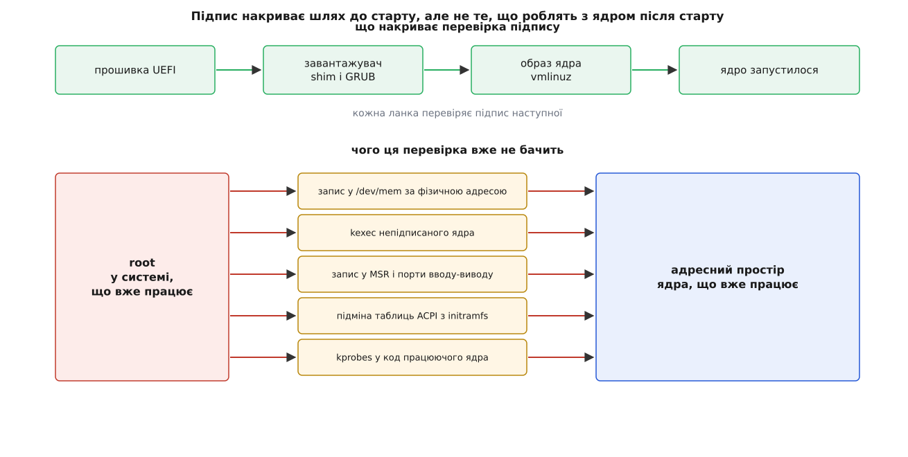
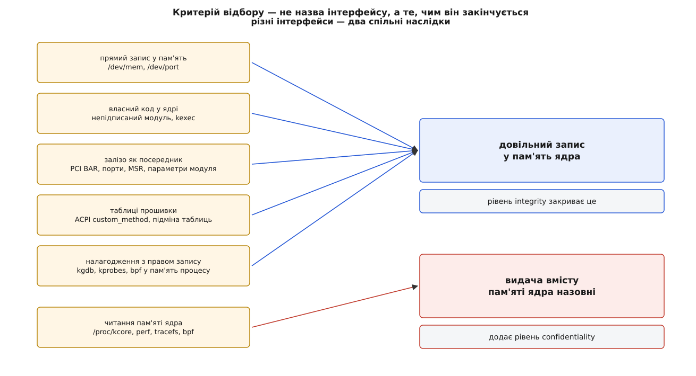
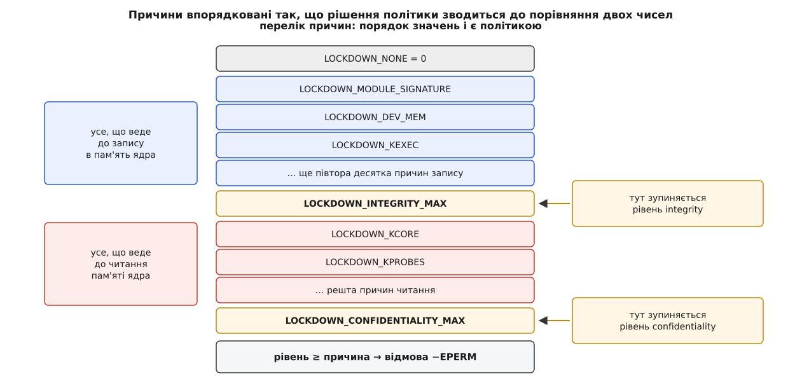

# Режим блокування ядра (lockdown): чого не можна навіть root

<preknowlist>
- [Ядро й простір користувача](topic:unix-linux/kernel-and-userspace) — код ядра виконується з повними правами машини, і межу між ним і програмами перетинають лише через ядро.
- [Монолітне ядро з модулями](topic:unix-linux/monolithic-with-modules) — увесь код ядра ділить один адресний простір, а модуль довантажують просто в нього.
- [Користувачі, групи й ідентичність процесу](topic:unix-linux/uid-gid-model) — UID 0 історично означає «перевірок не робимо».
- [Можливості (capabilities) замість всесильного root](topic:unix-linux/capabilities) — всевладдя root розібране на окремі мандати; доступ до сирого заліза дає `CAP_SYS_RAWIO`.
- [Secure Boot: перевірений ланцюг завантаження](topic:unix-linux/secure-boot) — прошивка перевіряє підпис завантажувача, той — підпис ядра.
- [Підпис модулів ядра](topic:unix-linux/module-signing) — ядро вміє відмовлятися вантажити код без відомого йому підпису.
- [kexec: завантаження нового ядра без прошивки](topic:unix-linux/kexec-and-kdump) — працююче ядро вміє передати керування іншому образу, минаючи прошивку й завантажувач.
- [LSM: каркас гачків безпеки в ядрі](topic:unix-linux/lsm-framework) — точки, у яких ядро питає сторонній код дозволу на операцію, яку збирається виконати.
- [DMA і буфери](topic:unix-linux/dma-and-buffers) — пристрій пише в оперативну пам'ять сам, без участі процесора.
</preknowlist>

Машина вмикається. Прошивка перевіряє підпис завантажувача, завантажувач — підпис образу ядра, ядро відмовляється вантажити модуль без відомого йому підпису. Ланцюг зійшовся: усе, що виконуватиметься з правами машини, хтось підписав своїм ключем.

За хвилину адміністратор заходить по мережі, стає root і виконує три рядки на Python: відкрити `/dev/mem`, перемотати на потрібне зміщення, записати вісім байтів. Тепер у пам'яті працюючого ядра лежить не той код, який підписали.

Підпис не збрехав. Він просто відповідав на інше питання. Підпис засвідчує, **який образ завантажили**, — і нічого не каже про те, **що з цим образом зробили після завантаження**. Між «ядро стартувало» і «ядро працює вже годину» стоїть ціла система з живим адміністратором, і жодна крипта цей проміжок не накриває.



*Підпис накриває шлях до старту, але не те, що роблять з ядром після старту.*

## Чому root узагалі має ці двері

Спокуса сказати «то заберіть у root доступ до `/dev/mem`» виникає одразу — і вона нічого не пояснює. Треба спершу зрозуміти, чому цей доступ там є.

Unix малювався як система, де машиною хтось володіє. UID 0 — це не «дуже привілейований користувач», це **представник власника машини всередині системи**. Ядро — частина машини, отже, ядро не боронилося від того, кому машина належить: боронити майно від власника було б дивно.

І двері всередину ядра з'явилися не як недогляд, а тому, що вони були потрібні. `/dev/mem` — щоб графічний сервер програмував відеокарту, поки в ядрі ще не було керування режимами. `ioperm()` — щоб та сама програма смикала порти VGA. Запис у машинні регістри процесора (MSR, англ. *model-specific register*) — щоб міряти й підкручувати частоти. Параметри модуля `io=` та `irq=` — щоб сказати драйверові стародавньої плати, за якою адресою її шукати. `kexec` — щоб перезавантажитися за секунду замість хвилини й щоб зняти дамп після падіння ядра.

Кожна така можливість — законна. Проблема не в жодній із них окремо, а в тому, до чого вони **разом** зводяться.

## Куди насправді ведуть ці двері

Розгляньмо їх не за назвами, а за наслідком.

**Прямий запис.** `/dev/mem` — це вся фізична пам'ять машини як один файл: зміщення у файлі є фізичною адресою. `/dev/kmem` — те саме у віртуальних адресах ядра (з ядра 5.13 його прибрали зовсім, хоч назва причини й досі згадує його), `/dev/port` — простір портів. Тут посередників немає: `write()` за правильним зміщенням змінює байти в коді ядра.

**Власний код.** Модуль ядра — це не окрема програма, а шматок коду, який кладуть у той самий адресний простір і викликають без жодного бар'єра. Непідписаний модуль — це просто «виконай, будь ласка, ось це з правами ядра». `kexec` іде з іншого боку: він не змінює поточне ядро, а завантажує **наступне**, минаючи прошивку й завантажувач — а отже, і всі підписи, які ті перевіряли.

**Залізо як посередник.** Найцікавіша група, бо тут запису в пам'ять ядра начебто немає. Через `sysfs` можна відобразити собі регістри пристрою на шині PCI (файли `resource*`), а через сусідній файл `config` — переписати його конфігураційний простір: самі адреси, за якими ці регістри живуть, і дозвіл пристрою бути ведучим на шині. А пристрій уміє писати в оперативну пам'ять сам, за допомогою DMA. Скажеш мережевій карті скласти прийнятий пакет за фізичною адресою, де лежить таблиця системних викликів, — карта слухняно складе. Процесор у цьому не бере участі, перевірка прав ніде не спрацьовує: із погляду ядра нічого й не відбувалося. Те саме дає запис у MSR через `/dev/cpu/*/msr` (частина з них керує адресами, куди процесор ходить по мікрокод і по обробники) — і показово, що закривають там саме запис, а читання того самого файла лишається дозволеним. Далі в тому ж ряду — доступ до портів вводу-виводу та «небезпечні» параметри модулів, які кажуть драйверові взяти під контроль довільну ділянку MMIO. Проміжна ланка — [IOMMU](topic:programming/iommu), блок трансляції адрес для пристроїв: якщо він увімкнений і налаштований, пристрій бачить лише виділені йому сторінки. Але IOMMU є не скрізь, вмикають його не завжди, і покладатися на нього як на межу привілеїв не можна.

**Таблиці прошивки.** Ядро не просто читає таблиці ACPI — воно **виконує** записаний у них байткод AML, і цей байткод має право читати й писати системну пам'ять: так задумано, бо саме так прошивка керує живленням. Інтерфейс `custom_method` дозволяв root підсунути в інтерпретатор власний AML. Підміна цілих таблиць через initramfs дає те саме трохи довшим шляхом — і саме тут корисно помітити діру, про яку рідко думають: сам `initrd` у типовому ланцюжку перевіреного завантаження підписом **не** перевіряють. Прошивка ручається за завантажувач, завантажувач — за образ ядра, а початковий образ файлової системи проходить без жодного підпису. На платформах із деревом пристроїв (device tree) роль підмінюваної таблиці грає воно.

**Налагодження.** `kgdb` дає повноцінний налагоджувач ядра з правом запису — найпряміший шлях у цій групі. BPF-програма через `bpf_probe_write_user()` пише в пам'ять процесу, за яким спостерігає: не в пам'ять ядра, але цього досить, щоб підсунути привілейованій програмі чужі дані. `kprobes` теж ставить точки зупину просто в коді працюючого ядра, тобто змінює його текст, — але саму цю причину ядро віднесло не сюди, а до другого рівня, бо небезпечне в ній передусім те, що вона показує.

П'ять різних підсистем, п'ять різних історій появи — і один спільний кінець: **довільний запис у пам'ять ядра**. Ось він, критерій. Не «цей інтерфейс небезпечний», а «цим інтерфейсом можна змінити працююче ядро». Список закриваних дверей не вигадують — його **виводять** із цієї умови.



*Критерій відбору — не назва інтерфейсу, а те, чим він закінчується.*

## Другий критерій: читання

Симетричне питання виникає само собою. Якщо небезпечно міняти пам'ять ядра, то чи безпечно її **читати**?

У пам'яті ядра лежать речі, яких root не має бачити навіть у системі, де він root: ключі шифрування дисків, розгорнуті в пам'яті на час роботи; закриті ключі підпису для IMA та EVM; секрети захищених мережевих з'єднань IPsec. Читання не дає керування, але дає те, заради чого керування й здобувають.

І двері для читання свої: `/proc/kcore` (уся пам'ять ядра як core-файл), `perf` з його доступом до адрес ядра, `kprobes` у режимі зчитування, BPF-читання пам'яті ядра, `tracefs` із трасами, у яких видно аргументи функцій. Через `perf` закривають і те, про що зазвичай не згадують, — апаратні буфери трасування (Intel PT, ARM CoreSight). Туди процесор складає покрокову історію виконаних інструкцій сам, без жодної участі програми, і в цій історії видно шлях коду ядра з такою докладністю, якої програмним трасуванням не дістати.

Чому це не звели в один список із записом? Бо ціна різна. Закрити запис — означає зламати сплячку й непідписані драйвери, і це переживається. Закрити читання — означає **знищити всю спостережуваність системи**: `perf`, `ftrace`, значну частину BPF, тобто інструменти, якими щодня діагностують продуктивність. Тому й рівнів два, і Matthew Garrett, один з авторів, окремо радить звичайним дистрибутивам обмежитися першим (це рекомендація автора, а не властивість механізму).

## Як рівень стає одним числом

Отже, є два набори причин відмови, і другий містить перший. Це відношення «вкладеності» реалізували напрочуд ощадно: причини склали в **упорядкований перелік**, де спершу йдуть усі причини запису, потім межа, потім усі причини читання.

```c
/* include/linux/security.h — порядок значень тут і є політикою */
enum lockdown_reason {
	LOCKDOWN_NONE,
	LOCKDOWN_MODULE_SIGNATURE,
	LOCKDOWN_DEV_MEM,
	LOCKDOWN_KEXEC,
	LOCKDOWN_HIBERNATION,
	/* … ще півтора десятка причин запису … */
	LOCKDOWN_INTEGRITY_MAX,
	LOCKDOWN_KCORE,
	LOCKDOWN_KPROBES,
	LOCKDOWN_PERF,
	LOCKDOWN_TRACEFS,
	/* … */
	LOCKDOWN_CONFIDENTIALITY_MAX,
};
```

Поточний рівень системи — це теж значення з цього переліку: `LOCKDOWN_NONE`, `LOCKDOWN_INTEGRITY_MAX` або `LOCKDOWN_CONFIDENTIALITY_MAX`. І все рішення політики вміщається в одне порівняння:

```c
/* security/lockdown/lockdown.c */
static int lockdown_is_locked_down(enum lockdown_reason what)
{
	if (kernel_locked_down >= what) {
		if (lockdown_reasons[what])
			pr_notice_ratelimited("Lockdown: %s: %s is restricted; see man kernel_lockdown.7\n",
				  current->comm, lockdown_reasons[what]);
		return -EPERM;
	}
	return 0;
}
```

**Приклад: система на рівні `integrity`, програма відкриває `/dev/mem`.**

```
kernel_locked_down = LOCKDOWN_INTEGRITY_MAX     (нехай це 21)
what               = LOCKDOWN_DEV_MEM           (2)
21 >= 2            → відмова, -EPERM

а для читання /proc/kcore:
what               = LOCKDOWN_KCORE             (22)
21 >= 22           → хибно, доступ дозволено
```

Той самий код, той самий рядок порівняння — і рівень `confidentiality` (значення `LOCKDOWN_CONFIDENTIALITY_MAX`, більше за все інше) закриває геть усе. Ніяких таблиць відповідності: **порядок оголошення причин і є політикою**. Ціна такої ощадності — жорсткість: додати причину «десь усередині» не можна безболісно, бо номери зсуваються, а нову причину читання завжди дописують після межі цілісності.



*Причини впорядковані так, що рішення політики зводиться до порівняння двох чисел.*

Питання ставлять у самих інтерфейсах, поруч зі звичайною перевіркою прав:

```c
/* drivers/char/mem.c — відкриття /dev/mem та /dev/port */
static int open_port(struct inode *inode, struct file *filp)
{
	int rc;

	if (!capable(CAP_SYS_RAWIO))
		return -EPERM;

	rc = security_locked_down(LOCKDOWN_DEV_MEM);
	if (rc)
		return rc;
	/* … */
}
```

Спершу класична перевірка мандата, потім — окреме питання «а чи взагалі можна таке в цій системі». Друге питання не про того, хто просить: `CAP_SYS_RAWIO` у процесу є, і це не рятує. Блокування судить **операцію**, а не прохача.

Найяскравіше ця байдужість до прохача видно на BPF. Мандати `CAP_BPF` і `CAP_PERFMON` завели рівно для того, щоб інструменти спостережуваності не доводилося запускати повним root: беріть вузьке право читати ядро, і по всьому. На рівні `confidentiality` обидва перестають діяти щодо читання пам'яті ядра — не тому, що комусь не довіряють, а тому, що сама операція в цій системі більше не дозволена нікому.

Реалізовано це як модуль безпеки LSM, тому з блокуванням мирно співіснують SELinux чи AppArmor: кожен зі своїх міркувань може сказати «ні», і достатньо одного «ні».

Варто помітити, що частина заборон сформульована не як «ніколи», а як «не без доказу походження». Модуль вантажиться, якщо його підписано ключем із [кільця довірених ключів ядра](topic:unix-linux/kernel-keyrings) — а туди потрапляє й ключ, який власник машини сам вніс через прошивку.

На kexec цю логіку видно найчистіше, бо два його системні виклики закінчують по-різному саме через неї. Старий `kexec_load()` бере від програми **вже готові сегменти пам'яті**: розібраний на шматки образ, у якому немає ані файлу, ані місця, де міг би лежати підпис. Звіряти нема з чим, тому виклик закривають цілком — не за небезпечність, а за неперевірність. Новий `kexec_file_load()` (його вживає `kexec --load -s`) бере дескриптор самого файлу й читає образ ядром: тепер є що звіряти, і завантаження проходить, якщо образ підписаний — або якщо за нього ручається [оцінка цілісності IMA](topic:unix-linux/ima-appraisal), тобто підпис лежить не всередині файлу, а в його розширеному атрибуті.

Логіка та сама скрізь: блокування не забороняє дію, воно вимагає, щоб код, який потрапляє в ядро, мав перевірне походження. Там, де такого способу довести походження немає — як зі сплячкою чи з довільним записом у `/dev/mem`, — двері зачиняють цілком, бо перевіряти нічого.

> 🔧 **Навіщо це.** Коли на системі з увімкненим блокуванням раптом перестає працювати служба, що читала MSR, чи інструмент, який відкривав `/dev/mem`, у журналі ядра лежить готова відповідь із рядком `Lockdown:` — з іменем програми та людською назвою забороненої дії. Це перше, куди варто дивитися, замість того щоб шукати помилку в правах доступу до файлів пристроїв: права там будуть у повному порядку.

## Як його вмикають і чому не вимикають

Механізм збирають опцією `CONFIG_SECURITY_LOCKDOWN_LSM`, а вмикають одним із трьох способів: жорстко при збиранні ядра, параметром командного рядка `lockdown=integrity` чи `lockdown=confidentiality`, або вже під час роботи — записом у файл у securityfs.

```
# cat /sys/kernel/security/lockdown
[none] integrity confidentiality

# echo integrity > /sys/kernel/security/lockdown
# cat /sys/kernel/security/lockdown
none [integrity] confidentiality

# echo none > /sys/kernel/security/lockdown
-bash: echo: write error: Operation not permitted
```

Останній рядок — суть усієї конструкції. Рівень можна **лише підняти**; понизити його не може ніхто, включно з тим, хто його підняв. Інакше механізм не мав би сенсу: перше, що зробив би зловмисник, який здобув root, — вимкнув би блокування одним рядком. Повернути систему до `none` можна тільки перезавантаженням — а перезавантаження знову проходить перевірений ланцюг, тобто повертає систему в стан, який хтось підписав.

Із цього виходить тонкість, на якій легко обпектися. Питання ставлять там, де ресурс **беруть**, а не на кожній операції з ним: `/dev/mem` перевіряють у `open_port()`, тобто на відкритті. Отже, дескриптор, відкритий до підняття рівня, лишається робочим і після нього — запис у нього більше ніхто не питає. Служба, що відкрила `/dev/mem` на ранньому старті й тримає дескриптор, продовжить писати в пам'ять ядра, хоч би скільки разів після цього підняли рівень.

BPF влаштований так само, лише «взяття ресурсу» там зветься інакше. Питання ставить перевіряч байткоду під час `BPF_PROG_LOAD` — тобто коли програму тільки заряджають у ядро: побачив виклик `bpf_probe_read_kernel()`, спитав блокування, дістав відмову — і відхилив **усю програму**, а не окреме читання. Наслідок той самий: програма, завантажена до підняття рівня, працює далі й читає пам'ять ядра, бо її вже ніхто не перепитує.

Тому підняття блокування записом у securityfs десь у середині завантаження — слабше за параметр командного рядка: параметр діє з першої секунди, коли ані відкривати, ані завантажувати ще нікому.

Повний перелік причин з їхніми людськими назвами, усі опції збирання та поведінку кожного перемикача зведено окремо — [довідка з керування блокуванням](topic:unix-linux/kernel-lockdown/api-lockdown-controls.md).

## Що при цьому ламається

Блокування не безкоштовне, і зустріч із ним звичайно виглядає як несподівана поломка.

**Сплячка на диск перестає працювати.** У режимі `integrity` заборонено `LOCKDOWN_HIBERNATION`, і причина тонша, ніж здається: під час сплячки образ пам'яті ядра лягає у розділ підкачки, а при пробудженні його **вантажать назад у пам'ять ядра**. Тобто розділ підкачки стає ще одним каналом, яким у працююче ядро потрапляє код, — і каналом без підпису. Ядро не вміє перевірити, що образ на диску не підмінили, тому шлях закривають цілком.

**Сторонні драйвери вимагають ключа.** Модулі, зібрані на місці (драйвер відеокарти, модулі віртуалізації), доводиться підписувати власним ключем і вносити цей ключ у список довірених прошивкою. На практиці це власна пара ключів, `scripts/sign-file` на кожен зібраний `.ko` і сертифікат, занесений у список власника машини утилітою `mokutil` із підтвердженням при наступному завантаженні — з окремою пасткою, через яку внесений ключ видно всюди, а перевірка модулів його однаково не питає; увесь цей шлях розібрано в [підписі модулів ядра](topic:unix-linux/module-signing). Це не примха блокування — це та сама вимога підпису, просто тепер її не можна обійти.

**Режим `confidentiality` вбиває діагностику.** Профілювання зникає разом з `perf`, трасування — разом із `tracefs`, `/proc/kcore` не відкривається. Ціна така, що питання перевертається: не «навіщо цей рівень вмикати», а «кому потрібно замкнути читання настільки, щоб віддати за це всю спостережуваність машини».

Відповіді дві, і обидві про машини, у пам'яті ядра яких лежать **чужі** секрети. Перша — хост у хмарі: на одному залізі працюють машини різних клієнтів, а ключі шифрування їхніх дисків розгорнуті в пам'яті ядра хоста. Службова програма хоста, яку зламали й довели до root, з рівнем `confidentiality` не вичитає їх ані через `/proc/kcore`, ані трасуванням.

Друга гостріша. У зашифрованій віртуальній машині (AMD SEV-SNP, Intel TDX, AWS Nitro Enclaves) пам'ять гостя шифрує сам процесор, і гіпервізор хоста її не бачить — але це робить залізо, а не блокування. Усередині ж такої машини далі працює звичайна Linux зі звичайним root, і якщо його здобудуть, він прочитає ті самі ключі зсередини — з того боку шифрування, де воно вже нічого не ховає. Апаратне шифрування закриває погляд ззовні, блокування — погляд ізсередини; захист тримається, лише коли є обидва. Тому в образах для конфіденційних обчислень `lockdown=confidentiality` ставлять як обов'язковий, а не як один із можливих.

Перевірити, що саме закрито на конкретній машині, найпростіше маленькою програмою, яка по черзі стукає в кожні двері й показує, котрі відчинені — [проба меж блокування](topic:unix-linux/kernel-lockdown/proj-probe-lockdown.md).

## Чого блокування не робить

Тут легко зробити хибний висновок, тому назвімо межі прямо.

Блокування **не захищає систему від root**. Root і далі володіє файловою системою: може підмінити будь-яку програму, переписати конфігурацію служб, прочитати сирий блоковий пристрій, поставити на наступне завантаження інше ядро — підписане, але, скажімо, старе й діряве (від цього боронять уже списки відкликання прошивки, а не блокування). Захищають тут рівно одне: **цілісність образу ядра, що зараз працює**.

Блокування **саме по собі не є захистом**. Воно має сенс лише як остання ланка перевіреного ланцюга. Якщо завантаження не перевіряється, root просто замінить файл ядра на диску й перезавантажиться — і всі заборони знімуться самі. Блокування без Secure Boot і підпису модулів — не безпека, а незручність.

І, звісно, будь-яка вразливість у драйвері, доступному root, що дає довільний запис у пам'ять ядра, — це обхід усього механізму. Список дверей закритий рівно настільки, наскільки повний.

## Хто вирішує, що машину замкнено

Лишається питання, на якому механізм застряг у ядрі на сім років: **хто дає команду**?

Напрошується відповідь «сама наявність Secure Boot»: якщо ланцюг перевіряють, то й замикати треба автоматично. Так роблять дистрибутиви — у ядрах Fedora, RHEL, Debian, Ubuntu і SUSE є свої латки, які на старті питають прошивку викликом `efi_enabled(EFI_SECURE_BOOT)` і, отримавши ствердну відповідь, самі піднімають систему на `integrity`.

В основне ядро таку прив'язку не пустили, і аргумент проти неї вартий того, щоб його зрозуміти. Secure Boot каже: «цей код підписаний ключем, який визнає прошивка». Він **не** каже: «власник цієї машини хоче, щоб root був обмежений». Це два різні твердження, і схиляти одне до одного — означає вирішити за власника машини. Людина, яка сама згенерувала ключі, сама підписала своє ядро й сама його завантажує, від увімкненого Secure Boot не стає для власної машини недовіреною. Тому в основному ядрі рішення лишили явним: рівень задають параметром завантаження або записом у securityfs, а не вгадують із обставин.

Як цей механізм визрівав від застарілого поняття рівнів безпеки в BSD до окремого модуля безпеки в Linux 5.4 і чому суперечка навколо Secure Boot тривала роками — [історія блокування ядра](topic:unix-linux/kernel-lockdown/hist-lockdown-birth.md).

Практичний наслідок з усього цього один, зате великий: у системі з увімкненим блокуванням твердження «root може все» перестає бути правдою. Межа, яка десятиліттями була лише домовленістю про те, що адміністратор і ядро — це одне ціле, стає справжньою межею — і код, який звик на цю домовленість покладатися, доводиться писати інакше.
