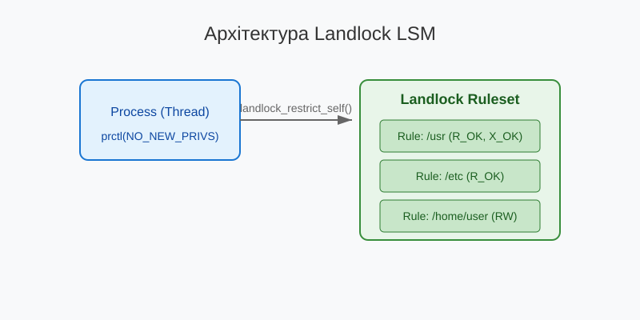

# Landlock LSM: безпривілейоване обмеження файлового доступу

<preknowlist>
- [Концепції ядра Linux](book:unix-linux/kernel-and-userspace) — базові поняття системних викликів та VFS.
</preknowlist>

У сучасних операційних системах сімейства Linux забезпечення безпеки та ізоляції процесів є одним із найважливіших завдань. Традиційні механізми контролю доступу (DAC — Discretionary Access Control), такі як права доступу до файлів (rwx) і списки контролю доступу (ACL), забезпечують базовий рівень захисту. Однак вони часто виявляються недостатніми для складних сценаріїв, де необхідно обмежити права програми, навіть якщо вона запущена від імені користувача з широкими повноваженнями. Для вирішення цих завдань були розроблені механізми Mandatory Access Control (MAC), реалізовані у вигляді модулів Linux Security Modules (LSM), таких як SELinux, AppArmor або Smack. Проте ці модулі традиційно вимагають прав суперкористувача (root) для налаштування та застосування правил, що унеможливлює створення "пісочниць" (sandboxes) звичайними користувачами.

З випуском ядра Linux 5.13 ситуація змінилася завдяки появі нового механізму — **Landlock**. Landlock — це Linux Security Module, який дозволяє будь-якому процесу (навіть без привілеїв root) безпечно обмежувати власні права доступу до файлової системи (а починаючи з новіших версій ядра — і до мережі). У цій статті ми детально розглянемо архітектуру Landlock, його API (функції `landlock_create_ruleset()`, `landlock_add_rule()`, `landlock_restrict_self()`), важливість прапорця `NO_NEW_PRIVS` та практичні аспекти використання цього механізму для створення безпривілейованих пісочниць.

## 1. Концепція та еволюція ізоляції в Linux

Перш ніж заглибитися в деталі Landlock, важливо зрозуміти еволюцію механізмів ізоляції в Linux та проблеми, які Landlock покликаний вирішити.

### 1.1. Проблема традиційних механізмів (DAC і MAC)

У моделі DAC права доступу визначаються власником об'єкта (файлу, каталогу). Якщо користувач "alice" запускає програму (наприклад, веб-браузер або редактор документів), цей процес успадковує всі права користувача "alice". Якщо програма виявляється скомпрометованою (наприклад, через вразливість переповнення буфера), зловмисник отримує доступ до всіх файлів користувача "alice": ssh-ключів, особистих документів, паролів тощо.

Механізми MAC (SELinux, AppArmor) дозволяють системному адміністратору визначити жорсткі політики для кожної програми, незалежно від того, який користувач її запускає. Однак:
1. **Складність:** Написання профілів SELinux або AppArmor є складним завданням.
2. **Привілеї:** Лише адміністратор (root) може завантажувати ці політики. Звичайна програма не може сказати системі: "Я збираюся обробляти недовірені дані, будь ласка, заборони мені доступ до будь-чого, крім цієї конкретної теки".

### 1.2. Seccomp-bpf: Фільтрація системних викликів

Технологія `seccomp-bpf` дозволяє процесу обмежувати системні виклики, які він може виконувати. Це потужний інструмент для зменшення поверхні атаки, і він широко використовується в контейнерах (Docker, Podman) та браузерах (Chrome, Firefox). Однак `seccomp` фільтрує лише самі системні виклики та їхні аргументи (числові значення або вказівники).

`seccomp` не може ефективно фільтрувати шляхи до файлів. Наприклад, виклик `openat(AT_FDCWD, "/etc/passwd", O_RDONLY)` передає вказівник на рядок `"/etc/passwd"`. BPF-програма в `seccomp` не може розіменувати цей вказівник і перевірити рядок, що робить фільтрацію доступу до файлової системи за допомогою `seccomp` вкрай складною та ненадійною (схильною до атак типу TOCTOU — Time-of-Check to Time-of-Use).

### 1.3. namespaces і chroot

`chroot` та `mount namespaces` дозволяють змінити корінь файлової системи для процесу. Це основа контейнеризації. Однак створення нового mount namespace зазвичай вимагає наявності привілеїв `CAP_SYS_ADMIN` (часто вирішується через user namespaces, але це також має свої складності та ризики для безпеки). Крім того, налаштування ізольованого середовища вимагає значних зусиль: монтування `/proc`, `/dev`, копіювання необхідних бібліотек тощо.

### 1.4. Рішення: Landlock

Landlock пропонує елегантне вирішення цих проблем. Він дозволяє будь-якому процесу визначити набір правил (ruleset), які описують, до яких частин файлової системи він може мати доступ і з якими правами, а потім застосувати цей набір правил до себе та всіх своїх майбутніх нащадків.

Основні переваги Landlock:
- **Безпривілейованість:** Не вимагає прав root або спеціальних capabilities.
- **Гнучкість:** Дозволяє вказувати точні права доступу для конкретних ієрархій файлів (каталогів) або окремих файлів.
- **Спадковість:** Обмеження автоматично успадковуються всіма дочірніми процесами (через `fork` або `clone`) і зберігаються навіть після виклику `execve`. Процес не може зняти обмеження Landlock після їх застосування.
- **Інтеграція з VFS:** Працює на рівні віртуальної файлової системи (VFS), що захищає від обходу через жорсткі посилання або перейменування.

## 2. Архітектура та принципи роботи Landlock

Робота з Landlock будується навколо концепції "набору правил" (ruleset). Процес створює набір правил, додає до нього правила (rules), а потім застосовує набір правил до себе.

### 2.1. Етапи налаштування Landlock

Процес створення пісочниці складається з наступних кроків:

1. **Створення набору правил (`landlock_create_ruleset`):** Процес запитує у ядра створення нового, порожнього набору правил і вказує, які дії він хоче контролювати (наприклад, читання файлів, запис, створення каталогів). Ядро повертає файловий дескриптор, що представляє цей набір правил.
2. **Додавання правил (`landlock_add_rule`):** Процес використовує отриманий файловий дескриптор для додавання конкретних правил до набору. Наприклад: "Дозволити лише читання в каталозі `/usr`", "Дозволити читання і запис у каталозі `/tmp/myapp`".
3. **Застосування NO_NEW_PRIVS:** Процес зобов'язаний встановити прапорець `PR_SET_NO_NEW_PRIVS` за допомогою системного виклику `prctl`. Це критична вимога безпеки.
4. **Застосування набору правил (`landlock_restrict_self`):** Процес просить ядро застосувати зібраний набір правил до себе. Після цього виклику обмеження набувають чинності безповоротно. Файловий дескриптор набору правил можна закрити.

### 2.2. Ієрархія правил

Landlock підтримує концепцію вкладеності. Процес може застосувати кілька наборів правил послідовно. Кожен новий набір правил накладається поверх попередніх, створюючи перетин (перетин) дозволів. Це означає, що наступний набір правил може лише *звужувати* права доступу, але ніколи не може їх *розширювати*.


*Рис. 1. Загальна архітектура застосування Landlock.*

## 3. API Landlock

Landlock вводить три нові системні виклики:

### 3.1. `landlock_create_ruleset()`

```c
int landlock_create_ruleset(const struct landlock_ruleset_attr *attr,
                            size_t size, uint32_t flags);
```

Цей системний виклик створює новий набір правил.

- `attr`: Вказівник на структуру `landlock_ruleset_attr`, яка визначає, які дії будуть оброблятися цим набором правил (handled accesses).
- `size`: Розмір структури `attr` (для зворотної сумісності в майбутньому).
- `flags`: Прапорці (наразі має бути 0).

Структура `landlock_ruleset_attr` виглядає так:

```c
struct landlock_ruleset_attr {
    __u64 handled_access_fs;
    __u64 handled_access_net; /* Додано у пізніших версіях */
};
```

Поле `handled_access_fs` є бітовою маскою, яка вказує, які дії з файловою системою підлягають обмеженню. Якщо дія вказана тут, вона заборонена за замовчуванням (deny-by-default), якщо тільки вона не дозволена явним правилом пізніше. Дії, які не вказані тут, Landlock не контролюватиме (дозволяючи їх з точки зору Landlock, хоча звичайні DAC/MAC все ще діють).

Доступні прапорці (із `<linux/landlock.h>`):
- `LANDLOCK_ACCESS_FS_EXECUTE`: Виконання файлу.
- `LANDLOCK_ACCESS_FS_WRITE_FILE`: Запис у файл.
- `LANDLOCK_ACCESS_FS_READ_FILE`: Читання з файлу.
- `LANDLOCK_ACCESS_FS_READ_DIR`: Читання вмісту каталогу.
- `LANDLOCK_ACCESS_FS_REMOVE_DIR`: Видалення каталогу.
- `LANDLOCK_ACCESS_FS_REMOVE_FILE`: Видалення файлу.
- `LANDLOCK_ACCESS_FS_MAKE_CHAR`: Створення символьного пристрою.
- `LANDLOCK_ACCESS_FS_MAKE_DIR`: Створення каталогу.
- `LANDLOCK_ACCESS_FS_MAKE_REG`: Створення звичайного файлу.
- `LANDLOCK_ACCESS_FS_MAKE_SOCK`: Створення UNIX-сокету.
- `LANDLOCK_ACCESS_FS_MAKE_FIFO`: Створення FIFO (іменованого каналу).
- `LANDLOCK_ACCESS_FS_MAKE_BLOCK`: Створення блокового пристрою.
- `LANDLOCK_ACCESS_FS_MAKE_SYM`: Створення символічного посилання.
- `LANDLOCK_ACCESS_FS_REFER`: (Починаючи з ABI v2) Переміщення файлів (rename, link) між каталогами.
- `LANDLOCK_ACCESS_FS_TRUNCATE`: (Починаючи з ABI v3) Зміна розміру файлу (truncate).

Виклик повертає файловий дескриптор, який використовується в наступних викликах.

### 3.2. `landlock_add_rule()`

```c
int landlock_add_rule(int ruleset_fd, enum landlock_rule_type rule_type,
                      const void *rule_attr, uint32_t flags);
```

Цей виклик додає нове правило до набору правил, ідентифікованого `ruleset_fd`.

- `ruleset_fd`: Файловий дескриптор, отриманий від `landlock_create_ruleset()`.
- `rule_type`: Тип правила. Для файлової системи використовується `LANDLOCK_RULE_PATH_BENEATH`.
- `rule_attr`: Вказівник на структуру, що описує правило. Для `LANDLOCK_RULE_PATH_BENEATH` це структура `landlock_path_beneath_attr`.
- `flags`: Прапорці (наразі має бути 0).

Структура `landlock_path_beneath_attr`:

```c
struct landlock_path_beneath_attr {
    __u64 allowed_access;
    __s32 parent_fd;
};
```

- `allowed_access`: Бітова маска дій (з тих, що були вказані в `handled_access_fs` при створенні набору), які дозволяються цим правилом.
- `parent_fd`: Файловий дескриптор відкритого каталогу або файлу (зазвичай відкривається з прапорцем `O_PATH` або `O_RDONLY`). Це корінь ієрархії, для якої застосовується дозвіл. Дозвіл застосовується до самого об'єкта та всіх його нащадків (рекурсивно).

### 3.3. Важливість `NO_NEW_PRIVS`

Перш ніж застосувати набір правил, процес зобов'язаний виконати:

```c
prctl(PR_SET_NO_NEW_PRIVS, 1, 0, 0, 0);
```

Цей крок є фундаментальним для безпеки. Прапорець `NO_NEW_PRIVS` гарантує, що процес (і всі його нащадки) більше ніколи не зможе отримати нові привілеї під час виклику `execve`. Це означає, що механізми set-user-ID (SUID), set-group-ID (SGID) та file capabilities на виконуваних файлах будуть ігноруватися ядром.

**Чому це необхідно для Landlock?**

Уявіть, що користувач "alice" створює пісочницю, в якій заборонено читати її домашній каталог `/home/alice`, але дозволено виконувати програми. Вона запускає в цій пісочниці підозрілий скрипт.
Якби `NO_NEW_PRIVS` не вимагався, цей скрипт міг би виконати програму, яка має SUID-біт root (наприклад, `/usr/bin/sudo` або `/usr/bin/passwd`). Оскільки `sudo` працює від імені root, вона могла б потенційно обійти обмеження (або виконати дії, які порушують ізоляцію).
Що ще гірше, уявімо, що є SUID-бінарник "alice", який завжди читає якийсь конфіг із фіксованого шляху. Пісочниця могла б дозволити запуск цього бінарника, але підмінити конфіг (через дозволені в пісочниці шляхи) або змусити SUID-програму працювати у ворожому середовищі, що може призвести до експлуатації SUID-програми та підняття привілеїв.

Вимагаючи `NO_NEW_PRIVS`, ядро гарантує, що безпривілейований користувач не зможе створити пісочницю, яка б маніпулювала привілейованими процесами. `NO_NEW_PRIVS` забезпечує, що привілеї процесу можуть лише монотонно зменшуватися.

### 3.4. `landlock_restrict_self()`

```c
int landlock_restrict_self(int ruleset_fd, uint32_t flags);
```

Цей виклик застосовує налаштований набір правил до поточного потоку виконання (і всіх його майбутніх нащадків).

- `ruleset_fd`: Файловий дескриптор набору правил.
- `flags`: Прапорці (наразі має бути 0).

Після успішного виконання цієї функції обмеження набувають чинності. Процес може закрити `ruleset_fd` (через `close()`), обмеження все одно залишаться активними.

## 4. Версіювання ABI Landlock

Ядро Linux постійно розвивається, і Landlock також отримує нові можливості. Для забезпечення зворотної сумісності Landlock використовує поняття версії ABI (Application Binary Interface).

Щоб дізнатися підтримувану версію ABI в ядрі, програма викликає `landlock_create_ruleset()` з `attr = NULL` та прапорцем `LANDLOCK_CREATE_RULESET_VERSION` (його значення `1U << 0`):

```c
int abi = landlock_create_ruleset(NULL, 0, LANDLOCK_CREATE_RULESET_VERSION);
if (abi < 0) {
    perror("Landlock не підтримується");
}
```

Поточні версії ABI та їхні можливості:
- **ABI 1 (Linux 5.13):** Базовий контроль доступу до файлової системи (читання, запис, виконання, створення файлів/каталогів).
- **ABI 2 (Linux 5.19):** Додано прапорець `LANDLOCK_ACCESS_FS_REFER`. Це дозволяє контролювати операції `rename` і `link`, які переміщують файли між різними каталогами.
- **ABI 3 (Linux 6.2):** Додано прапорець `LANDLOCK_ACCESS_FS_TRUNCATE`. Раніше зміна розміру відкритого файлу через `ftruncate()` або `truncate()` не контролювалася явно.
- **ABI 4 (Linux 6.7):** Початкова підтримка контролю мережі (TCP bind та connect).

Правильно написана програма повинна перевіряти версію ABI ядра і маскувати `handled_access_fs`, щоб використовувати лише ті прапорці, які ядро розуміє. Якщо передати прапорець (наприклад, `LANDLOCK_ACCESS_FS_TRUNCATE`) ядру з ABI 1, `landlock_create_ruleset()` поверне помилку `EINVAL`.

## 5. Практичний приклад: створення простої пісочниці

Розглянемо приклад на C, який реалізує програму-обгортку. Ця програма дозволяє виконання команди (переданої як аргументи), але обмежує її доступ до файлової системи лише читанням з `/usr`, `/etc` та `/bin`.

```c
#define _GNU_SOURCE
#include <stdio.h>
#include <stdlib.h>
#include <unistd.h>
#include <fcntl.h>
#include <errno.h>
#include <sys/prctl.h>
#include <sys/syscall.h>
#include <linux/landlock.h>

/* Обгортки для системних викликів, якщо libc ще не має заголовків для них */
#ifndef landlock_create_ruleset
static inline int landlock_create_ruleset(const struct landlock_ruleset_attr *attr,
                                          size_t size, uint32_t flags) {
    return syscall(SYS_landlock_create_ruleset, attr, size, flags);
}

static inline int landlock_add_rule(int ruleset_fd,
                                    enum landlock_rule_type rule_type,
                                    const void *rule_attr, uint32_t flags) {
    return syscall(SYS_landlock_add_rule, ruleset_fd, rule_type, rule_attr, flags);
}

static inline int landlock_restrict_self(int ruleset_fd, uint32_t flags) {
    return syscall(SYS_landlock_restrict_self, ruleset_fd, flags);
}
#endif

int main(int argc, char *argv[]) {
    if (argc < 2) {
        fprintf(stderr, "Usage: %s <cmd> [args...]\n", argv[0]);
        return 1;
    }

    // 1. Отримуємо версію ABI
    int abi = landlock_create_ruleset(NULL, 0, LANDLOCK_CREATE_RULESET_VERSION);
    if (abi < 0) {
        perror("Landlock is not supported by the kernel");
        return 1;
    }

    // Встановлюємо маску для дій, які ми хочемо контролювати
    // (ABI 1: базові операції з файлами та каталогами)
    __u64 handled_fs = LANDLOCK_ACCESS_FS_EXECUTE |
                       LANDLOCK_ACCESS_FS_WRITE_FILE |
                       LANDLOCK_ACCESS_FS_READ_FILE |
                       LANDLOCK_ACCESS_FS_READ_DIR |
                       LANDLOCK_ACCESS_FS_REMOVE_DIR |
                       LANDLOCK_ACCESS_FS_REMOVE_FILE |
                       LANDLOCK_ACCESS_FS_MAKE_CHAR |
                       LANDLOCK_ACCESS_FS_MAKE_DIR |
                       LANDLOCK_ACCESS_FS_MAKE_REG |
                       LANDLOCK_ACCESS_FS_MAKE_SOCK |
                       LANDLOCK_ACCESS_FS_MAKE_FIFO |
                       LANDLOCK_ACCESS_FS_MAKE_BLOCK |
                       LANDLOCK_ACCESS_FS_MAKE_SYM;

    struct landlock_ruleset_attr ruleset_attr = {
        .handled_access_fs = handled_fs,
    };

    // 2. Створюємо набір правил
    int ruleset_fd = landlock_create_ruleset(&ruleset_attr, sizeof(ruleset_attr), 0);
    if (ruleset_fd < 0) {
        perror("landlock_create_ruleset");
        return 1;
    }

    // 3. Додаємо правила
    // Дозволяємо читання та виконання в /usr
    int fd_usr = open("/usr", O_PATH | O_CLOEXEC);
    if (fd_usr >= 0) {
        struct landlock_path_beneath_attr path_attr = {
            .allowed_access = LANDLOCK_ACCESS_FS_READ_FILE | 
                              LANDLOCK_ACCESS_FS_READ_DIR | 
                              LANDLOCK_ACCESS_FS_EXECUTE,
            .parent_fd = fd_usr,
        };
        landlock_add_rule(ruleset_fd, LANDLOCK_RULE_PATH_BENEATH, &path_attr, 0);
        close(fd_usr);
    }

    // Дозволяємо читання та виконання в /bin
    int fd_bin = open("/bin", O_PATH | O_CLOEXEC);
    if (fd_bin >= 0) {
        struct landlock_path_beneath_attr path_attr = {
            .allowed_access = LANDLOCK_ACCESS_FS_READ_FILE | 
                              LANDLOCK_ACCESS_FS_READ_DIR | 
                              LANDLOCK_ACCESS_FS_EXECUTE,
            .parent_fd = fd_bin,
        };
        landlock_add_rule(ruleset_fd, LANDLOCK_RULE_PATH_BENEATH, &path_attr, 0);
        close(fd_bin);
    }

    // Дозволяємо читання в /etc (але не виконання)
    int fd_etc = open("/etc", O_PATH | O_CLOEXEC);
    if (fd_etc >= 0) {
        struct landlock_path_beneath_attr path_attr = {
            .allowed_access = LANDLOCK_ACCESS_FS_READ_FILE | 
                              LANDLOCK_ACCESS_FS_READ_DIR,
            .parent_fd = fd_etc,
        };
        landlock_add_rule(ruleset_fd, LANDLOCK_RULE_PATH_BENEATH, &path_attr, 0);
        close(fd_etc);
    }

    // Дозволяємо доступ до динамічного лінкера (зазвичай потрібно для виконання програм)
    int fd_lib = open("/lib", O_PATH | O_CLOEXEC);
    if (fd_lib >= 0) {
        struct landlock_path_beneath_attr path_attr = {
            .allowed_access = LANDLOCK_ACCESS_FS_READ_FILE | 
                              LANDLOCK_ACCESS_FS_READ_DIR |
                              LANDLOCK_ACCESS_FS_EXECUTE,
            .parent_fd = fd_lib,
        };
        landlock_add_rule(ruleset_fd, LANDLOCK_RULE_PATH_BENEATH, &path_attr, 0);
        close(fd_lib);
    }
    
    int fd_lib64 = open("/lib64", O_PATH | O_CLOEXEC);
    if (fd_lib64 >= 0) {
        struct landlock_path_beneath_attr path_attr = {
            .allowed_access = LANDLOCK_ACCESS_FS_READ_FILE | 
                              LANDLOCK_ACCESS_FS_READ_DIR |
                              LANDLOCK_ACCESS_FS_EXECUTE,
            .parent_fd = fd_lib64,
        };
        landlock_add_rule(ruleset_fd, LANDLOCK_RULE_PATH_BENEATH, &path_attr, 0);
        close(fd_lib64);
    }

    // 4. Встановлюємо NO_NEW_PRIVS (ОБОВ'ЯЗКОВО!)
    if (prctl(PR_SET_NO_NEW_PRIVS, 1, 0, 0, 0)) {
        perror("prctl(PR_SET_NO_NEW_PRIVS)");
        close(ruleset_fd);
        return 1;
    }

    // 5. Застосовуємо набір правил до себе
    if (landlock_restrict_self(ruleset_fd, 0)) {
        perror("landlock_restrict_self");
        close(ruleset_fd);
        return 1;
    }

    // Файловий дескриптор набору більше не потрібен
    close(ruleset_fd);

    // 6. Виконуємо вказану команду (вона успадкує обмеження Landlock)
    execvp(argv[1], &argv[1]);
    
    // Якщо execvp повернула керування, сталася помилка
    perror("execvp");
    return 1;
}
```

Якщо скомпілювати цей код (`gcc landlock_sandbox.c -o landlock_sandbox`) і запустити через нього командну оболонку:

```bash
$ ./landlock_sandbox /bin/bash
```

Тепер, перебуваючи всередині `bash` під контролем Landlock, ви побачите, що ваші права суттєво обмежені:

```bash
$ ls /usr
bin  games  include  lib  local  sbin  share  src
$ cat /etc/passwd
root:x:0:0:root:/root:/bin/bash
...
$ ls /home
ls: cannot open directory '/home': Permission denied
$ touch /tmp/testfile
touch: cannot touch '/tmp/testfile': Permission denied
```

Навіть якщо ви запустили цю пісочницю від свого власного імені, ви не можете читати власні файли в `/home`, оскільки ви не додали відповідне правило в Landlock, а базові операції (такі як читання, запис, створення) були включені до `handled_access_fs`, що зробило їх забороненими за замовчуванням.

## 6. Особливості та підводні камені

### 6.1. O_PATH та дескриптори каталогів

У функції `landlock_add_rule()` для вказівки об'єкта використовується файловий дескриптор (`parent_fd`), а не рядковий шлях. Це принципове рішення в дизайні Landlock. Використання файлових дескрипторів вирішує проблему станів гонитви (race conditions), таких як TOCTOU (Time-of-Check to Time-of-Use). 

Коли програма викликає `open("/usr", O_PATH)`, ядро знаходить відповідний inode в структурі віртуальної файлової системи і створює дескриптор. Коли цей дескриптор передається в `landlock_add_rule()`, правило прив'язується саме до цього inode. Якщо зловмисник (або інший процес) перейменує каталог `/usr` на `/usr_old` і створить новий `/usr`, правило Landlock все одно буде діяти для вмісту старого `/usr_old`, оскільки воно прив'язане до об'єкта, а не до рядка імені.

### 6.2. Вплив на вже відкриті файли

Важливий аспект Landlock: виклик `landlock_restrict_self()` впливає лише на **нові** спроби відкриття файлів або доступу до них після виклику.
Файлові дескриптори, які були відкриті **до** виклику `landlock_restrict_self()`, залишаються дійсними і зберігають свої права (читання/запис), навіть якщо нові правила Landlock заборонили б доступ до відповідних файлів.
Це дозволяє реалізувати патерн "відкрий і заблокуй": процес відкриває потрібні йому файли, а потім повністю закриває доступ до решти файлової системи за допомогою Landlock.

### 6.3. Монтування та межі файлових систем

Правило `LANDLOCK_RULE_PATH_BENEATH` діє на ієрархію каталогів *незалежно* від точок монтування. Якщо ви дозволили читання для `/mnt/data`, а згодом туди була змонтована нова файлова система, процес з Landlock матиме доступ до файлів у цій новій змонтованій системі, якщо шлях доступу починається з `/mnt/data`. Це робить Landlock передбачуваним з точки зору простору імен, який бачить процес.

## 7. Порівняння з іншими механізмами

| Характеристика | Landlock | Seccomp-bpf | AppArmor / SELinux | chroot / mount ns |
|---|---|---|---|---|
| **Мета** | Обмеження доступу до об'єктів (FS, Net) | Фільтрація системних викликів | Загальносистемна політика MAC | Ізоляція простору імен |
| **Рівень привілеїв** | Звичайний користувач (Unprivileged) | Звичайний користувач (Unprivileged) | Адміністратор (root) | Зазвичай вимагає `CAP_SYS_ADMIN` |
| **Гранулярність FS** | Шляхи (ієрархії каталогів) | Відсутня (лише номери FD) | Шляхи, контексти | Точки монтування, chroot-корінь |
| **Наслідування** | Нащадки не можуть зняти обмеження | Нащадки не можуть зняти обмеження | Глобальна або per-process | Наслідується |
| **Складність API** | Помірна | Висока (BPF-програми) | Написання політик у файлах | Висока (налаштування середовища) |

Часто найкращим підходом є використання кількох механізмів разом. Наприклад, контейнер може використовувати mount namespaces та AppArmor/SELinux для ізоляції на рівні системи, тоді як окрема прикладна програма всередині контейнера може додатково застосувати `seccomp` для блокування небезпечних сисколів та `Landlock` для жорсткого обмеження доступу до файлів (наприклад, дозволивши доступ лише до конкретної теки з даними, які обробляє цей конкретний робітничий потік).

## Висновок

Landlock LSM є потужним інструментом для розробників, які прагнуть застосувати принцип найменших привілеїв (Principle of Least Privilege) у своїх застосунках. Завдяки можливості безпривілейованого використання (разом з `NO_NEW_PRIVS`), він демократизує створення безпечних "пісочниць". Тепер будь-яка прикладна програма (браузер, програвач медіа, сервер баз даних, конвертер документів) може самостійно обмежити свої права, мінімізуючи шкоду у випадку виявлення вразливостей в її коді.

Постійний розвиток Landlock у нових версіях ядра (таких як додавання контролю мережі) робить його все більш універсальним механізмом для створення сучасних, безпечних додатків у середовищі Linux.
