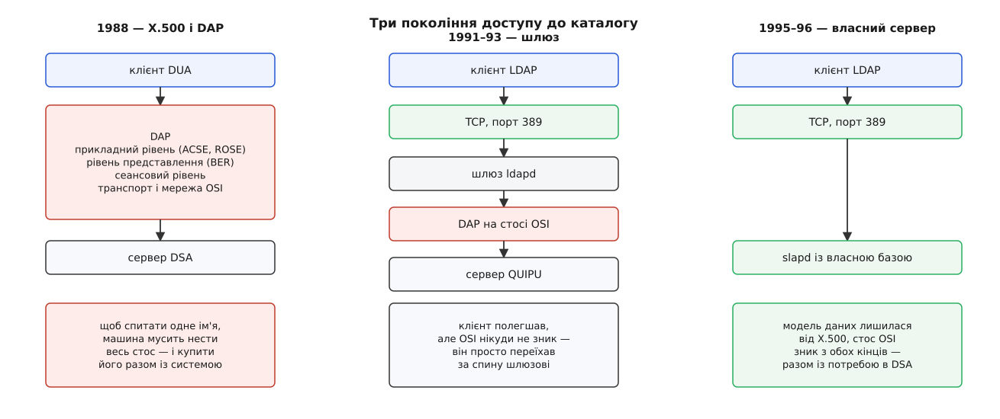

# 📜 Як важкий каталог народив легкий протокол

Літера «L» у назві LDAP — це не маркетинг, а слід від конкретної операції: у Мічиганському університеті з готового міжнародного стандарту вирізали протокол доступу й пришили натомість інший, бо оригінальний не влізав у кампусну мережу. Модель даних лишилася чужою і незміненою, протокол став своїм — і саме ця пара «стара модель, новий транспорт» дожила до сьогодні, тоді як стандарт-донор із побуту зник.

## Каталог, задуманий телефоністами

Серію X.500 узгодили в CCITT (франц. *Comité Consultatif International Téléphonique et Télégraphique* — Міжнародний консультативний комітет з телефонії та телеграфії, попередник ITU-T) і затвердили 1988 року; паралельно та сама робота вийшла в ISO як 9594. Задум був грандіозний: **один каталог на весь світ**, ієрархічний, розподілений між організаціями, з єдиним простором імен, у якому кожна людина й кожна машина мають своє DN. Звідси й уся знайома нам конструкція: записи з атрибутами, класи об'єктів, схема, дерево імен від кореня.

Технічно серія описувала дві різні речі. Модель — що таке запис, як його називати, як влаштована схема. І протоколи — DAP (англ. *Directory Access Protocol*) для звертання клієнта до сервера плюс кілька службових для спілкування серверів між собою. Розділення тут виявилося ключовим, хоч тоді ніхто на нього не зважав: модель була гарна, протокол — ні.

## Ціна повного стосу

DAP лежав на [повному стосі OSI](book:communications/osi-model): щоб надіслати один запит, клієнт мусив підняти сеансовий рівень, рівень представлення, ACSE для встановлення асоціації, ROSE для віддаленого виклику — і лише тоді дійти до самого запиту. Кожен рівень означав свою бібліотеку, свій обмін пакетами на встановленні зв'язку і свою пам'ять.

Порядок величин був такий, що заперечувати не було чого:

```
робоча станція кінця 1980-х: 4–8 МБ ОЗП
стос OSI із DAP:            ≈ 1 МБ коду й даних на кожен клієнт
корисне навантаження:       запит «дай атрибути uid=andrij» — сотні байтів
```

Це не «повільно» і не «незручно» — це неспіврозмірно. Установа, яка хотіла показати студентові телефонний довідник, мусила поставити на кожну машину мережевий стос, конкурентний до TCP/IP, і купити його разом із системою, бо в BSD-Unix його просто не було. У Мічиганському університеті, де довідник будували на весь кампус, стало ясно: клієнт X.500 у такому вигляді не приживеться ніде, крім кількох великих майданчиків.

Прикметно, що об'єктом невдоволення був **саме протокол**. Ніхто не пропонував переробити модель даних — вона задачу описувала добре.

## Дві спроби зрізати стос

Перший підхід зробив Маршалл Роуз (Marshall Rose) з Performance Systems International: RFC 1202 «Directory Assistance service» (DAS), лютий 1991. Ідея — розрізати клієнта навпіл. Важку половину, що вміє DAP і несе OSI, лишити на потужній машині, а тонкій половині на робочій станції дати простий текстовий протокол поверх TCP.

Через півроку в Мічигані з'явився DIXIE — Тім Гоувз (Tim Howes), Марк Сміт (Mark Smith) і Браян Бічер (Bryan Beecher), RFC 1249, серпень 1991 (сама розробка почалася 1990-го). Логіка та сама: клієнт по TCP чи UDP говорить із сервером DIXIE, а той уже несе DAP до справжнього каталогу.

Обидві спроби були **кустарні за задумом** — вони не претендували бути стандартом доступу до каталогу, лише милицею для бідних машин. І обидві показали одну річ: коли з протоколу зняти церемонію OSI, від нього лишається щось цілком просте — надіслати запит, отримати відповідь.

## Мічиган, 1993: лишити модель, переписати протокол

Наступний крок зробили втрьох: Венґ'їк Йонґ (Wengyik Yeong) з Performance Systems International, Тім Гоувз з Мічиганського університету і Стів Кілл (Steve Kille) з ISODE Consortium. Результат — RFC 1487 «X.500 Lightweight Directory Access Protocol», липень 1993.

Хід був консервативніший, ніж здається з назви. Модель даних X.500 не чіпали взагалі: ті самі записи, ті самі DN, та сама схема. Не чіпали й спосіб кодування — повідомлення лишилися структурами [ASN.1 у кодуванні BER](book:communications/asn1-per), тільки з обмеженого підмножини. Викинули те, що лежало нижче:

- замість стосу OSI — звичайне з'єднання TCP, порт **389**;
- замість ACSE/ROSE — власна нумерація повідомлень усередині з'єднання;
- замість структурованих імен на дроті — імена рядками, `uid=andrij,ou=people,dc=…`;
- замість зобов'язання сервера самому сходити до сусіда за відповіддю — відсилання клієнта до того сусіда (англ. *referral*), бо носити чужі запити важче, ніж сказати адресу.

Що тут ідея, а що специфікація, варто розрізняти чітко: ідею «легкого доступу до X.500» уже висловили DAS і DIXIE, а RFC 1487 — перша **специфікація**, яку сприйняли як протокол, а не як обхідний шлях. Реалізація ж на той момент лишалася шлюзом: мічиганський `ldapd` приймав LDAP по TCP і переказував запит по DAP серверові QUIPU з пакета ISODE. Стос OSI нікуди не подівся — він просто переїхав за спину шлюзові.



*Кожен крок прибирає один шар посередника, лишаючи модель даних недоторканою.*

## Коли зник і сервер X.500

Наступне усвідомлення було неминучим: якщо клієнти більше не говорять DAP, навіщо взагалі тримати позаду сервер X.500? Так з'явився `slapd` (англ. *standalone LDAP daemon* — самостійний демон LDAP) — сервер, що розуміє LDAP і тримає власну базу, без жодного DSA за спиною. Мічиганська команда — Тім Гоувз, Марк Сміт, Ґордон Ґуд (Gordon Good), Ленс Слоун (Lance Sloan) і Стів Ротвелл (Steve Rothwell) — довела цей код до випуску **3.3 (квітень 1996)**, і саме він став останньою університетською версією та довідковою реалізацією для всіх, хто робив своє.

Сам протокол за цей час устиг перевидатися: RFC 1777 (березень 1995) — та сама специфікація під новим номером, друга версія LDAP.

## Розхід: комерція й вільний код

1996 року Netscape Communications найняла Гоувза, Сміта й Ґуда, і мічиганський досвід перетік у **Netscape Directory Server** — комерційний продукт, від якого пізніше походять і Sun ONE Directory Server, і 389 Directory Server. Тоді ж з'явився попит на третю версію протоколу: RFC 2251 «Lightweight Directory Access Protocol (v3)» — Марк Валь (Mark Wahl), Тім Гоувз, Стів Кілл, грудень 1997. LDAPv3 додав те, чого бракувало установам: розширення й керувальні поля, `StartTLS`, автентифікацію через SASL, обов'язковий UTF-8 у назвах і значеннях, і — найважливіше — здатність клієнта спитати сам сервер про його схему.

Специфікацію v3 згодом переписали: у червні 2006 набір RFC 4510–4519 замінив RFC 2251 і супутні документи, розклавши протокол, модель, схему, автентифікацію й URL-форму по окремих текстах. Це редакційна, а не протокольна подія: те, що працювало за RFC 2251, лишилося чинним.

А мічиганський код 1998 року взяв Курт Зайленґа (Kurt Zeilenga), і з клону університетських джерел виріс **OpenLDAP** — незалежний проєкт із власним випуском 1.0 того ж року. Від тодішнього коду в сучасному OpenLDAP не лишилося майже нічого, але саме звідти тягнеться і назва `slapd`, і структура конфігурації, і вся звичка Unix-світу вважати LDAP чимось своїм.

## Що сталося з X.500

Донор не помер, але й не переміг. Всесвітнього єдиного каталогу з нього не вийшло: ідея єдиного простору імен, узгодженого між державами й корпораціями, розбилася об те, що ніхто не хотів віддавати корінь дерева комусь іншому. DAP на стосі OSI лишився у вузьких нішах — там, де OSI взагалі вижив: аеронавігаційний обмін повідомленнями та деякі оборонні системи (тут стан справ підтвердити важче, бо такі мережі публічно майже не описані).

Натомість дві частини X.500 пережили решту. Перша — модель даних, і живе вона в кожному LDAP-сервері світу. Друга — X.509, розділ серії про автентифікацію, що описував формат сертифіката для доступу до каталогу. Каталог ним так і не почали захищати масово, а формат вийшов за межі серії й став основою для [сертифікатів із відкритим ключем](book:communications/public-key-crypto) — того самого HTTPS, яким користуються всі.

Тобто найдовше прожили саме ті шматки X.500, які **описували дані, а не спосіб їх передавати**. Специфікація протоколу застаріває разом із мережею, під яку її написали; опис того, що таке запис і як його назвати, не застаріває взагалі.
