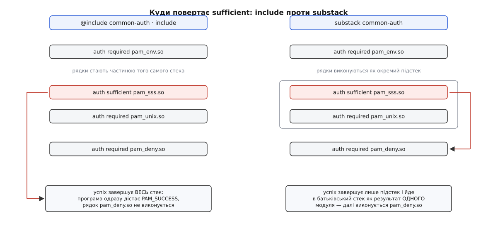

# 📋 Формат налаштувань PAM: рядок, керування, коди, включення

Це довідка з того, як читається й пишеться файл у `/etc/pam.d`: де саме бібліотека шукає налаштування, з чого складається рядок, у що точно розгортаються чотири звичні керівні слова, який повний набір кодів повернення й дій вони вживають, чим `include` відрізняється від `substack` і які файли не можна правити руками, бо їх генерують.

## Де лежать файли

| шлях | що це |
|---|---|
| `/etc/pam.d/<служба>` | основне місце. Ім'я файлу — це й є ім'я служби, яке програма назвала при старті розмови; лише малими літерами |
| `/etc/pam.conf` | старий єдиний файл, у якому кожен рядок починається з додаткового поля служби. Читається, **тільки якщо каталогу `/etc/pam.d` немає взагалі**: наявність каталогу вимикає цей файл цілком |
| `/usr/lib/pam.d/<служба>` | файли від постачальника пакета (там, де Linux-PAM зібрано з підтримкою такого каталогу). Однойменний файл у `/etc/pam.d` має перевагу — саме так локальна правка переживає оновлення |
| `/etc/pam.d/other` | стек для служби, яка не має власного файлу; `other` тут — звичайне ім'я служби, підставлене бібліотекою |
| `/etc/security/*.conf` | налаштування **окремих модулів**: `limits.conf`, `access.conf`, `faillock.conf`, `pwquality.conf`, `pam_env.conf`. До синтаксису стека стосунку не мають, формат у кожного свій |

## Рядок

```
[-]тип   керування   модуль[.so]   [аргумент …]
```

У старому `/etc/pam.conf` попереду стоїть ще одне поле — ім'я служби:

```
login   auth   required   pam_unix.so   nullok
```

Дрібні домовленості розбору:

- `#` починає коментар до кінця рядка; зворотна скісна риска в кінці рядка приєднує наступний.
- Аргументи розділені пробілами. Аргумент, усередині якого потрібен пробіл, беруть у квадратні дужки; літеральну закриваючу дужку всередині пишуть як `\]`.
- Ім'я модуля, що **не** починається з `/`, дописують до вбудованого при збірці каталогу модулів. Абсолютний шлях бібліотека бере як є й віддає [динамічному завантажувачеві](book:unix-linux/dynamic-loader) — тобто модуль — це звичайний спільний об'єкт, який підвантажують у процес уже під час роботи. Послідовність `$ISA` у шляху розкривається в суфікс для розрядності системи — спадок сумісності з Solaris, на Linux зазвичай порожній.

| дистрибутив | типовий каталог модулів |
|---|---|
| Debian, Ubuntu | `/usr/lib/<архітектура>-linux-gnu/security/` (наприклад `x86_64-linux-gnu`) |
| Fedora, RHEL і похідні | `/usr/lib64/security/` |
| Arch | `/usr/lib/security/` |
| Alpine | `/lib/security/` |

Каталог — константа збірки конкретного пакета, а не щось налаштовуване, тож переносити файли між дистрибутивами дослівно не варто.

**Дефіс перед типом** (`-session optional pam_systemd.so`) стоїть саме перед **типом**, а не перед модулем, і робить рівно одне: прибирає з системного журналу скарги на те, що модуля немає в системі. Сам рядок не зникає — відсутній модуль однаково повертає `PAM_MODULE_UNKNOWN`, а що з цим кодом станеться, вирішує керівне слово. Під `required` це провал стека. Тому дефіс має сенс лише в парі з `optional` або з явним `module_unknown=ignore`.

**Зіпсований рядок не пропускають.** Невідомий тип, відсутнє керівне слово, модуль, який не вдалося завантажити, — усе це не «рядок, якого наче й немає», а рядок, встановлений як обробник, що при виконанні завжди повертає `PAM_PERM_DENIED`. Якщо ж модуль завантажився, але не має точки входу потрібного типу, рядок дає `PAM_MODULE_UNKNOWN`. PAM падає в бік відмови, а не в бік мовчазного пропуску.

## Чотири типи стеків

| тип | які виклики програми його виконують | точки входу модуля |
|---|---|---|
| `auth` | `pam_authenticate()`, `pam_setcred()` | `pam_sm_authenticate`, `pam_sm_setcred` |
| `account` | `pam_acct_mgmt()` | `pam_sm_acct_mgmt` |
| `password` | `pam_chauthtok()` | `pam_sm_chauthtok` |
| `session` | `pam_open_session()`, `pam_close_session()` | `pam_sm_open_session`, `pam_sm_close_session` |

Один рядок типу `auth` реєструє **обидві** пов'язані точки входу, і `pam_setcred()` пройде тим самим списком у тому самому порядку. Те саме з `session`: закриття йде за списком відкриття.

## Керівне слово

Чотири звичні слова — скорочення до загальної форми `[значення=дія …]`. Точні розгортки:

```
required    →  [success=ok   new_authtok_reqd=ok   ignore=ignore  default=bad]
requisite   →  [success=ok   new_authtok_reqd=ok   ignore=ignore  default=die]
sufficient  →  [success=done new_authtok_reqd=done                default=ignore]
optional    →  [success=ok   new_authtok_reqd=ok                  default=ignore]
```

У `sufficient` і `optional` окремого запису для `ignore` немає, бо його однаково покриває `default=ignore` — тож усі чотири слова код `PAM_IGNORE` не враховують. Значення, не назване в дужках і не покрите `default`, вважається провалом (тобто діє як `bad`), тому `default=` пишуть майже завжди.

Ще два значення поля керування — не дії над кодом, а вказівки взяти рядки з іншого файлу: `include` і `substack` (нижче).

## Коди повернення модуля

Ліворуч — токен, яким код називають у квадратних дужках; праворуч — константа, яку модуль повертає в коді.

| токен | константа | коли з'являється |
|---|---|---|
| `success` | `PAM_SUCCESS` | усе гаразд |
| `ignore` | `PAM_IGNORE` | «мене це не стосується» — не враховувати |
| `auth_err` | `PAM_AUTH_ERR` | доказ не збігся: хибний пароль, хибний код |
| `user_unknown` | `PAM_USER_UNKNOWN` | цей модуль такого запису не знає |
| `authinfo_unavail` | `PAM_AUTHINFO_UNAVAIL` | джерело даних недосяжне — сервер мовчить |
| `cred_insufficient` | `PAM_CRED_INSUFFICIENT` | прав самого процесу забракло, щоб дістати дані |
| `maxtries` | `PAM_MAXTRIES` | лічильник спроб вичерпано, питати ще не можна |
| `new_authtok_reqd` | `PAM_NEW_AUTHTOK_REQD` | впустити можна, але спершу треба змінити секрет |
| `acct_expired` | `PAM_ACCT_EXPIRED` | обліковий запис прострочений |
| `authtok_expired` | `PAM_AUTHTOK_EXPIRED` | сам секрет прострочений |
| `perm_denied` | `PAM_PERM_DENIED` | відмова за політикою |
| `cred_unavail` | `PAM_CRED_UNAVAIL` | облікових даних не дістати |
| `cred_expired` | `PAM_CRED_EXPIRED` | облікові дані протерміновані |
| `cred_err` | `PAM_CRED_ERR` | не вдалося видати облікові дані |
| `authtok_err` | `PAM_AUTHTOK_ERR` | збій під час роботи з секретом |
| `authtok_recover_err` | `PAM_AUTHTOK_RECOVERY_ERR` | старий секрет відновити не вдалося |
| `authtok_lock_busy` | `PAM_AUTHTOK_LOCK_BUSY` | база секретів зайнята іншим |
| `authtok_disable_aging` | `PAM_AUTHTOK_DISABLE_AGING` | старіння секретів для цього запису вимкнено |
| `session_err` | `PAM_SESSION_ERR` | не вдалося завести чи прибрати сеанс |
| `conv_err` | `PAM_CONV_ERR` | розмовник програми повернув помилку |
| `conv_again` | `PAM_CONV_AGAIN` | розмовник подієвий, відповіді ще нема |
| `incomplete` | `PAM_INCOMPLETE` | стек треба продовжити наступним викликом програми |
| `try_again` | `PAM_TRY_AGAIN` | попередня перевірка не пройшла, спробувати ще |
| `abort` | `PAM_ABORT` | критична помилка, продовжувати сенсу немає |
| `no_module_data` | `PAM_NO_MODULE_DATA` | модуль не знайшов своїх даних у цій розмові |
| `bad_item` | `PAM_BAD_ITEM` | запит елемента, якого не буває |
| `buf_err` | `PAM_BUF_ERR` | брак пам'яті |
| `system_err` | `PAM_SYSTEM_ERR` | системна помилка |
| `service_err` | `PAM_SERVICE_ERR` | помилка всередині модуля |
| `open_err` | `PAM_OPEN_ERR` | модуль не завантажився |
| `symbol_err` | `PAM_SYMBOL_ERR` | у модулі немає потрібного символу |
| `module_unknown` | `PAM_MODULE_UNKNOWN` | модуля немає або немає точки входу цього типу |
| `default` | — | усі коди, не названі явно |

## Дії

| дія | що робить |
|---|---|
| `ok` | зарахувати цей код у результат стека, якщо там ще не було невдачі |
| `bad` | вважати провалом; перший такий код і стане результатом стека |
| `die` | те саме, що `bad`, і негайно повернути керування програмі |
| `done` | те саме, що `ok`, і негайно повернути керування програмі |
| `ignore` | не враховувати цей код у результаті стека |
| `reset` | забути все, що стек набрав досі, і рахувати наново з наступного рядка |
| `N` | перескочити `N` наступних рядків; `N` дорівнює нулю заборонено — вийшло б `ignore` |

Окремо варто знати підлогу: якщо **всі** модулі стека повернули `PAM_IGNORE` — або стек порожній, — програма отримує `PAM_PERM_DENIED`. Стек, який нічого не вирішив, відмовляє.

## Включення чужих файлів

| форма | що вкладається | звідки повертає `done` і `die` | як рахуються стрибки |
|---|---|---|---|
| `@include <файл>` | **весь** файл, усі чотири типи | з усього стека — до програми | вкладені рядки рахуються поодинці |
| `<тип> include <файл>` | лише рядки названого типу | з усього стека — до програми | вкладені рядки рахуються поодинці |
| `<тип> substack <файл>` | лише рядки названого типу | з підстека — у місце включення | зсередини стрибок не виходить за межі підстека, а ззовні весь підстек рахується за **один** модуль |

`@include` — це окремий рядок-директива, а не значення поля керування; саме її вживають фрагменти Debian. Глибина вкладення включень обмежена шістнадцятьма рівнями.



*Той самий файл, підключений двома способами, дає протилежні результати: ліворуч `pam_deny.so` ніколи не виконається, праворуч виконається завжди.*

## Часті аргументи модулів

| аргумент | значення |
|---|---|
| `nullok` | дозволити вхід із порожнім паролем у базі (без нього такий запис не впускають) |
| `try_first_pass` | спершу спробувати секрет, який уже отримав попередній модуль; не підійшов — спитати самому |
| `use_first_pass` | вживати **лише** вже отриманий секрет і не питати нічого; немає або не підійшов — відмова |
| `use_authtok` | у стеку `password`: взяти новий секрет від попереднього модуля, а не питати свій |
| `debug` | докладний запис у системний журнал (у розмову з користувачем нічого не додає) |

Перші три спираються на спільний для всієї розмови елемент `PAM_AUTHTOK` — місце, куди перший модуль кладе введений секрет для наступних. Невідомий модулю аргумент модуль зазвичай пише в журнал і пропускає, тож помилка в написанні тихо знімає обмеження, яке ви думали, що ввімкнули.

## Згенеровані фрагменти

Спільні шматки стека складають програмою, а не редактором.

| дистрибутив | інструмент | джерело | що переписується |
|---|---|---|---|
| Debian, Ubuntu | `pam-auth-update` | профілі пакетів у `/usr/share/pam-configs/` | `/etc/pam.d/common-auth`, `common-account`, `common-password`, `common-session`, `common-session-noninteractive` |
| Fedora, RHEL і похідні | `authselect` | профілі в `/usr/share/authselect/`, власні — у `/etc/authselect/custom/<ім'я>` | `/etc/pam.d/system-auth`, `password-auth`, `smartcard-auth`, `fingerprint-auth`, `postlogin`, а також `/etc/nsswitch.conf` |

У Debian керована ділянка обмежена коментарями-мітками: від `# here are the per-package modules (the "Primary" block)` до `# end of pam-auth-update config`. Рядки **поза** цими мітками зберігаються, тож локальний модуль дописують до або після блоку. Правки всередині блоку інструмент намагається зберегти, а коли не може — кладе старий файл поруч із суфіксом `.pam-old`.

У Red Hat згенеровані файли підписані заголовком «створено authselect, руками не правити», і вони прямо зіставлені з обраним профілем. Порядок роботи інший: не правити файл, а зробити власний профіль (`authselect create-profile <ім'я> -b sssd`), обрати його (`authselect select custom/<ім'я>`) і застосувати (`authselect apply-changes`); `authselect current` показує, що зараз обрано, `authselect check` — чи не розійшлися файли з профілем.

## Найменша перевірка

Щоб побачити поведінку стека, не ризикуючи власним входом, заводять окрему службу з власним файлом:

```
# /etc/pam.d/probe
auth     required  pam_unix.so
account  required  pam_unix.so
```

```
pamtester probe "$USER" authenticate acct_mgmt
```

`pamtester` виконує рівно ті самі виклики, що й справжня служба, і друкує код, який отримала б програма. Рядок `debug` у кінці підозрілого модуля разом із записами системного журналу показує, який саме модуль повернув який код — а далі таблиці вище кажуть, що з цим кодом зробить керівне слово.
