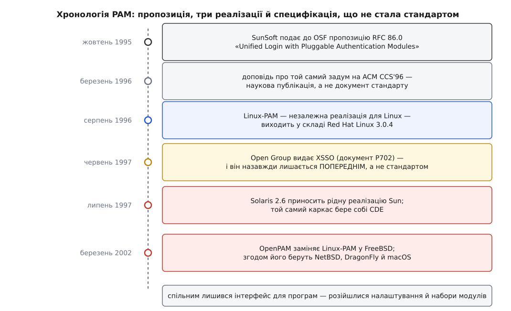

# 📜 Народження PAM: одна пропозиція, три реалізації й стандарт, якого не було

Задум змінних модулів автентифікації записали один раз і дуже виразно — восени 1995 року в SunSoft. За наступні сім років його втілили тричі, незалежно одне від одного, а спроба звести три втілення в один стандарт зупинилася на слові «попередня» й далі не пішла. Саме через це сьогодні той самий за задумом механізм має різний синтаксис налаштувань у Linux і в BSD, хоча програми звертаються до нього майже однаково.

## Що змусило Sun це записати

У Sun початку 1990-х був не абстрактний, а дуже конкретний клопіт. Компанія продавала машини в установи, де вже стояли Kerberos, DCE й апаратні картки RSA, і кожна така технологія вимагала свого способу довести, що людина — це вона. А в системі стояв десяток програм входу: `login`, `su`, `passwd`, `telnetd`, `ftpd`, `rlogind`, графічний `dtlogin`. Підключити нову технологію означало виправити, зібрати й розіслати їх усі. Наступна технологія — знову всі.

Гірше було з поєднанням. Замовник хотів не «або Kerberos, або пароль», а «квиток Kerberos, а якщо його нема — пароль, а для адміністраторів ще й картку». Це вже не вибір однієї гілки в коді, це список перевірок, який складає адміністратор, а не програміст. Коду програми входу такий список знати нізвідки.

Розділ подяк самого RFC 86.0 показує, що робота тяглася кілька випусків Solaris: перший задум і перше втілення — Shau-Ping Lo, Chuck Hickey й Alex Choy; над архітектурою радилися Bill Shannon і Don Stephenson; складання кількох модулів у стек уперше зробив прототипом Rocky Wu. Це не легенда, а текст первинного документа — хоча сторінка з ним на сайті Open Group нині недоступна.

## RFC 86.0 — пропозиція, а не стандарт

У жовтні 1995 року SunSoft подала до Open Software Foundation документ **«Unified Login with Pluggable Authentication Modules (PAM)»**, зареєстрований як **OSF-RFC 86.0**. Авторами в реєстрі стоять **Vipin Samar** і **Roland J. Schemers III** із SunSoft; у подяках названо **Paul Fronberg**, **Charlie Lai** та **Roland Schemers** як тих, хто суттєво доробив самі інтерфейси й швидко довів роботу до кінця. Дату й авторський рядок підтверджують і реєстр OSF, і посилання на цей документ у пізнішій специфікації Open Group — це надійно. А от поширене в довідниках формулювання «PAM створили Vipin Samar і Charlie Lai» точним не є: Lai в авторському рядку RFC не стоїть, він у подяках.

Абревіатура OSF-RFC збиває з пантелику й вартує окремого слова. Це **не** RFC інтернету: серія OSF була внутрішнім каналом пропозицій до консорціуму, і номер у ній не давав документові жодної нормативної сили. RFC 86.0 — це запрошення до розмови, оформлене як специфікація.

Окремо стоїть **стаття на ACM CCS'96** — «Unified login with pluggable authentication modules (PAM)», доповідь Vipin Samar на третій конференції ACM з компʼютерної та комунікаційної безпеки навесні 1996 року. Її часто плутають із RFC і називають «першоджерелом PAM». Це той самий задум, викладений для наукової аудиторії, і за часом вона **пізніша** за RFC 86.0. Пряме джерело реалізацій — саме RFC.

*Одна пропозиція, три реалізації, жодного ратифікованого стандарту.*

## Дві реалізації за один рік — і жодного зговору

Далі сталося те, що робить усю історію повчальною: документ прочитали двічі й написали за ним два різні шматки коду.

Sun зробив своє. PAM став каркасом входу в **Solaris 2.6** (1997 рік) і, що важливіше для решти світу, його взяв собі **Common Desktop Environment** — спільне графічне середовище, яке OSF просувала на всі комерційні Unix. Через CDE задум розійшовся далі за Sun.

Незалежно від цього в Linux-спільноті **Ted Ts'o** поставив у розсилці `linux-security` питання, чи не думав хтось реалізувати PAM. **Marc Ewing** із Red Hat Software написав каркас більшої частини бібліотеки в січні 1996 року, а супроводжувати проєкт узявся **Andrew G. Morgan** — і робить це відтоді. Готовий **Linux-PAM** уперше поїхав до користувачів у складі **Red Hat Linux 3.0.4** у серпні 1996-го. Ці подробиці — зі статті самого Morgan у *Linux Journal*, тобто зі свідчення учасника; дати збігаються з датами випусків Red Hat.

Зверніть увагу на розрив: між появою пропозиції й появою чужої реалізації — десять місяців. Спільного коду між Sun і Linux-PAM не було жодного рядка. Спільним був текст.

## XSSO: специфікація, що назавжди лишилася попередньою

У червні 1997 року Open Group видала документ **P702, «X/Open Single Sign-On Service (XSSO) — Pluggable Authentication Modules»** зі статусом **Preliminary Specification**. Він брав інтерфейс PAM з RFC 86.0 (і прямо на нього посилався) та додавав розширення для єдиного входу в мережу.

І на цьому все спинилося. Статус «попередня» так і не змінився на «стандарт»: документація FreeBSD ще через багато років констатувала, що специфікацію досі не прийнято. Причину точно назвати важко — це вже здогад, а не факт; але єдиний вхід у мережу на той час активно перетягували на себе Kerberos і власні схеми виробників, і охочих узяти на себе зобовʼязання дотримуватися чужого API виявилося замало.

Важить наслідок. XSSO описував **інтерфейс для програм і для модулів**: `pam_start()`, `pam_authenticate()`, `pam_sm_authenticate()`, набір елементів на кшталт `PAM_USER` і `PAM_AUTHTOK`, коди повернення. Він **не** описував ані формату файлів налаштувань, ані імен модулів, ані того, як розкладати їх по каталогах. Тобто нормативним хотіли зробити рівно той шов, який бачить програміст, — а шов, який бачить адміністратор, лишили кожному на розсуд. Та й нормативним він зрештою не став.

## Третя реалізація — і остаточний розкол

На початку 2002 року **Dag-Erling Smørgrav** (норвежець, тодішній працівник ThinkSec) отримав завдання доглядати порт Linux-PAM у FreeBSD. Замість цього він написав власну реалізацію — **OpenPAM**. Робота йшла коштом Network Associates Laboratories за контрактом DARPA/SPAWAR N66001-01-C-8035 у межах програми DARPA CHATS. У **березні 2002-го** OpenPAM замінив Linux-PAM у дереві FreeBSD, а першим офіційним випуском із ним став FreeBSD 5.1 у червні 2003 року. Пізніше OpenPAM узяли NetBSD, DragonFly BSD і — з macOS Snow Leopard — Apple. Це все зафіксовано у власній історії проєкту.

Формальний привід був ліцензійний: Linux-PAM тягнув за собою умови, незручні для системи під ліцензією BSD. Але важливо інше: третя реалізація писалася **не з коду попередників, а знову з опису** — а описом на той момент був нератифікований XSSO плюс шестирічна практика двох чужих реалізацій.

## Що саме розійшлося

Тепер видно, чому «майже те саме» — і водночас несумісне.

**Спільним лишився бік програм і модулів.** Виклики `pam_start()`, `pam_authenticate()`, `pam_acct_mgmt()`, `pam_open_session()` і зворотні `pam_sm_*` у модулях збіглися всюди, бо їх зафіксували ще в RFC 86.0. Тому вихідний код модуля часто переноситься між Linux і FreeBSD правкою збірки, а не логіки.

**Розійшлося все, чого стандарт не торкнувся:**

- **Синтаксис керування.** Linux-PAM додав власне розширення — квадратні дужки з парами «значення=дія», `[success=1 default=ignore]`, яких у RFC не було. OpenPAM їх не розбирає й розуміє лише прості слова, зате знає `binding` — прапорець, який Sun завів у Solaris 9. Той самий рядок налаштування читається в двох системах по-різному або не читається взагалі.
- **Розкладка файлів.** Solaris довго тримав один `/etc/pam.conf`, де перший стовпчик — імʼя служби; Linux і BSD пішли в каталог `/etc/pam.d/` з файлом на службу.
- **Набори модулів.** `pam_limits`, `pam_systemd`, `pam_securetty` — світ Linux; `pam_login_access`, `pam_ssh`, `pam_opie` — світ BSD. Однакового каталогу модулів ніхто не описував, тож кожна реалізація нарощувала свій.
- **Навіть у спільному API є пастка.** Linux-PAM і OpenPAM тлумачать аргумент `msg` функції-розмови як масив **вказівників** на `struct pam_message`, а реалізація Sun — як вказівник на масив самих структур. Доки повідомлення одне, обидва тлумачення дають ту саму адресу й розбіжність не видно; на другому повідомленні код ламається. Класична вада специфікації, яку ніхто не мусив вичитувати до кінця.

Отже, теза, заради якої варто памʼятати цю історію: **розкол стався не там, де сперечалися, а там, куди стандарт не дотягнувся.** Інтерфейс для програм записали в 1995 році — і він живий та майже спільний донині. Мову, якою адміністратор пише правила, не записав ніхто — і кожна з трьох реалізацій вигадала її сама. Тому знання про API PAM переноситься між системами, а знання про `pam.conf` — ні.

Схожа доля спіткала й ширшу мету, з якої все починалося: єдиний вхід у мережу зрештою здобули не через XSSO, а через [Kerberos](book:communications/kerberos-authentication) та його спадкоємців — а PAM лишився тим, чим виявився корисним насправді: шаром підключення чужих способів перевірки до місцевих програм входу.
