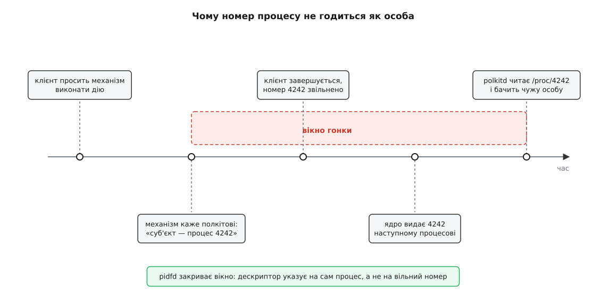
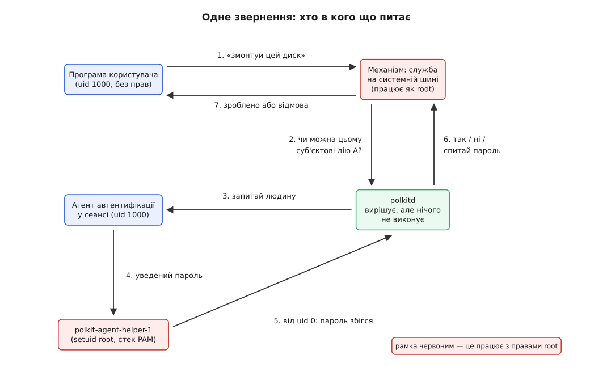
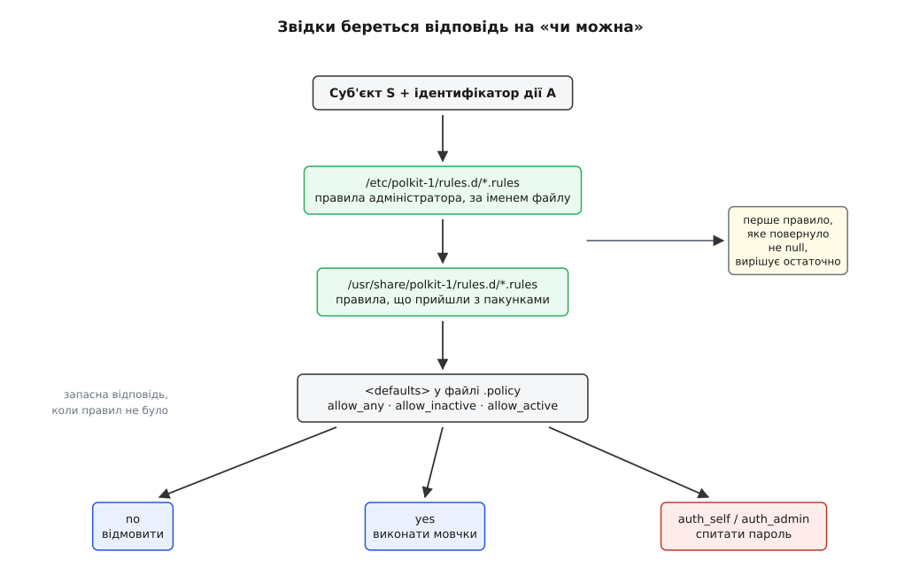

# polkit: хто дозволяє непривілейованому процесу привілейовану дію

<preknowlist>
- [Користувачі, групи й ідентичність процесу](book:unix-linux/uid-gid-model) — процес несе числа uid і gid, і саме на них дивиться ядро, вирішуючи, що йому можна.
- [setuid, setgid і підвищення прав](book:unix-linux/setuid-and-privilege) — класичний спосіб узяти чужі права: біт на файлі, який спрацьовує в мить exec.
- [Біти прав і як їх перевіряють](book:unix-linux/permission-bits) — дев'ять бітів у inode й драбина «власник → група → решта».
- [D-Bus: шина повідомлень простору користувача](book:unix-linux/dbus) — брокер, через який служби виставляють іменовані методи, і засвідчений ядром uid того, хто під'єднався.
- [PAM: стек модулів автентифікації](book:unix-linux/pam-stack) — налаштовний ланцюг перевірок «чи це справді той, за кого себе видають».
</preknowlist>

Ви вставили флешку. У файловому менеджері з'явився значок, ви клацнули — диск змонтувався мовчки. Ви клацнули «перевести годинник» — вискочило віконце з проханням увести пароль. Ви зайшли на ту саму машину по ssh, спробували те саме — дістали суху відмову, і ніхто нічого не питав.

Три різні відповіді на три однакові за формою прохання. Жодна з них не випливає з бітів прав: змонтувати файлову систему й перевести системний годинник — це системні виклики, до яких дев'ять бітів на файлі стосунку не мають. Жодна не випливає з uid: користувач у всіх трьох випадках був один і той самий. І принаймні одна з них узагалі не схожа на перевірку — вона схожа на **розмову**: система не мала готової відповіді й пішла питати людину.

Отже, десь у системі є ще одна інстанція, яка ухвалює такі рішення. Питання, з якого росте тема: **чому вона мусила з'явитися** — і як вона влаштована, щоб додаткова інстанція не стала додатковою дірою.

## Чому старих відповідей не вистачило

Спробуймо розв'язати задачу «файловий менеджер монтує флешку» тим, що вже є в Unix.

**Дати всій програмі права.** Поставити на файловий менеджер біт [setuid](book:unix-linux/setuid-and-privilege) — і він зможе кликати `mount` сам. Ціна: мільйони рядків коду разом із бібліотеками розбору зображень, темами оформлення й розширеннями сторонніх авторів починають виконуватися з правами root. Довіряти доводиться всьому, а не тим двадцяти рядкам, які справді монтують.

**Дати права користувачеві наперед.** Записати його в [групу](book:unix-linux/device-access-groups) на кшталт `plugdev`. Рішення тепер статичне: воно ухвалене раз і назавжди, однакове о третій ночі по мережі й опівдні за клавіатурою, однакове для всіх програм цього користувача. Групу не можна ні звузити до однієї дії, ні поставити під запитання «а зараз ти справді за цим комп'ютером?».

**Спитати [`sudo`](book:unix-linux/sudo).** Одиниця рішення в `sudo` — командний рядок: кому дозволено запустити яку програму з якими аргументами. У графічній програмі командного рядка немає. Що важливіше, `sudo` працює лише спереду: він запускає нову програму з новими правами. А тут ситуація зворотна — уже наявна служба вже дістала прохання від уже наявного клієнта й хоче спитати про **нього**.

Складімо те, чого бракує всім трьом. Рішення має бути про **зміст дії**, а не про шлях до двійкового файлу. Воно має враховувати **обставини**: людина сидить за цією машиною чи прийшла по мережі, її сеанс зараз на екрані чи перемкнутий на іншого користувача. І воно має вміти те, чого класичні права не вміють у принципі, — **перепитати людину** й дозволити разово.

## Розділити «зробити» і «вирішити»

Перший крок очевидний і робиться без жодного полкіта: винести привілейовану роботу з великої програми в маленьку окрему службу. Вона працює з правами root, уміє рівно одну вузьку річ — скажімо, монтувати змінні носії, — і виставляє її назовні як метод на [системній шині повідомлень](book:unix-linux/dbus). Таку службу називають **механізмом** (англ. *mechanism* — виконавчий механізм), а того, хто до неї звертається, — клієнтом. Це [розділення привілеїв](book:unix-linux/privilege-separation) у чистому вигляді: довіреного коду лишається кілька сотень рядків замість мільйонів.

Але привілейованого коду поменшало, а рішення нікуди не поділося. Тепер його ухвалює механізм: прохання прийшло, і треба сказати «так» або «ні». І тут виявляється, що кожен такий механізм — служба монтування, служба живлення, служба мережі, служба оновлень — змушений самотужки завести собі файл конфігурації, придумати його синтаксис, навчитися розрізняти локальний сеанс і віддалений, а найгірше — самотужки намалювати вікно з проханням пароля на правильному екрані правильного користувача й самотужки перевірити той пароль.

Жодна з цих задач не залежить від того, що саме робить конкретний механізм. А спільне, яке кожен робить по-своєму, — це гарантований набір різних дірок. Отже, спільне треба винести один раз.

Винесене й називається **polkit** (скорочення від *PolicyKit* — «набір для політик»). Механізм більше не вирішує сам: він переадресовує питання окремій службі-арбітру `polkitd` і отримує від неї готову відповідь. Питання складається з трьох речей: **суб'єкт** — хто просить, **дія** — що саме просять, **подробиці** — уточнення, які має сенс показати людині.

> 🔧 **Навіщо це.** Коли ви пишете власного демона, який робить щось привілейоване на прохання ззовні, у вас є вибір: вигадати власний файл прав або викликати `polkit_authority_check_authorization()` з `libpolkit-gobject`. Другий шлях задарма дає адміністраторові вашої програми звичний спосіб налаштування, а вам — готове вікно пароля й готове поняття «активний локальний сеанс», які самотужки правильно не пишуться.

Як виглядає такий механізм у коді — від оголошення дії до виклику перевірки й до типових пасток на цьому шляху — розібрано окремо: [маленький демон на системній шині з перевіркою полкіта](book:unix-linux/polkit/proj-polkit-mechanism.md).

## Дія має ім'я

Найважливіше рішення в усій конструкції — те, **про що** взагалі ставлять питання. Не про шлях до програми, не про системний виклик, а про іменовану дію: `org.freedesktop.udisks2.filesystem-mount`. Ім'я в перевернутій доменній формі — щоб два незалежні розробники не побилися за один рядок.

Ім'я оголошує сама служба, у XML-файлі в `/usr/share/polkit-1/actions/`. Крім ідентифікатора, там лежить людський опис («Змонтувати файлову систему») — саме він потрапить у вікно з паролем, тож людина бачить не назву методу, а те, на що погоджується. І там же — типові відповіді, які автор служби вважає розумними:

```xml
<action id="org.freedesktop.udisks2.filesystem-mount">
  <description>Змонтувати файлову систему</description>
  <defaults>
    <allow_any>auth_admin</allow_any>
    <allow_inactive>auth_admin</allow_inactive>
    <allow_active>yes</allow_active>
  </defaults>
</action>
```

Три рядки в `<defaults>` — це і є та сама відсутня в бітах прав вимірність обставин. `allow_active` — той, хто зараз реально за клавіатурою: його сеанс прив'язаний до фізичного місця й зараз на екрані. `allow_inactive` — той, хто увійшов локально, але його сеанс перемкнули на іншого користувача. `allow_any` — усі решта, зокрема ті, хто прийшов по мережі. Хто в якому кошику, полкіт не вигадує: він питає [службу обліку сеансів і місць](book:unix-linux/logind-sessions-seats).

Значень усього шість: `no` — відмовити, `yes` — дозволити мовчки, `auth_self` — спитати пароль **самого прохача**, `auth_admin` — спитати пароль **адміністратора**, і два варіанти з суфіксом `_keep`, які до того ж запам'ятовують відповідь на кілька хвилин, щоб не питати п'ять разів поспіль.

Різниця між `auth_self` і `auth_admin` тонша, ніж здається. `auth_self` не перевіряє прав — він перевіряє **присутність**: пароль тут доводить, що за клавіатурою досі та сама людина, а не хтось, хто підійшов до незамкненого екрана. `auth_admin` — це вже питання про повноваження, і хто саме вважається адміністратором, вирішує окреме правило (типово — члени групи `wheel` або `sudo`).

## Хто саме питає — і чому це найважче місце

Механізм має передати полкітові суб'єкта. Ось де ховається найглибша пастка теми, бо суб'єкта не можна взяти зі слів клієнта: клієнт скаже що завгодно.

Чесна відповідь бере особу не в клієнта, а в ядра. Коли процес під'єднується до системної шини через [сокет домену Unix](book:unix-linux/unix-domain-sockets), ядро само записує на з'єднанні uid і pid того, хто на тому кінці, — підробити це неможливо. Тому найнадійніша форма суб'єкта — **ім'я з'єднання на шині** (`system-bus-name`): полкіт бере рядок на кшталт `:1.42`, питає в брокера шини, хто його власник, і дістає засвідчену ядром особу. Клієнт у цьому ланцюгу не бере участі взагалі.

Друга форма — номер процесу — виглядає природніше й саме тому небезпечніша. Номер процесу не є особою: це вільна комірка, яку ядро видає й забирає. Між миттю, коли механізм записав номер, і миттю, коли полкіт пішов дивитися в `/proc/<номер>`, минає час — а за цей час процес може завершитися, номер звільнитися й дістатися комусь іншому.



*Класична гонка між перевіркою й використанням: перевіряють одну сутність, а рішення застосовують до іншої, яка встигла зайняти той самий номер.*

Це та сама [гонка між перевіркою й використанням](book:programming/toctou-race), що й у файлових шляхах, лише замість імені файлу тут номер процесу. Латка «номер плюс час старту процесу» звужувала вікно, але не закривала його: точність часу старту в ядрі скінченна, а старт можна навмисне пригальмувати. Остаточно проблему знімає [pidfd](book:unix-linux/pidfd) — дескриптор, який указує на сам процес, а не на його номер, і не переїжджає на іншого. Полкіт використовує його з випуску 124 (2024), а форму суб'єкта «unix-process» відтоді наповнюють саме ним: старий варіант із номером процесу й часом старту лишили тільки заради сумісності.

Другий бік того самого питання — що робити, коли особу з'ясувати **не вдалося**. У червні 2021 року Кевін Бекгаус із GitHub Security Lab показав (CVE-2021-3560), що полкіт цього не робив як слід: якщо клієнт обривав з'єднання рівно посеред запиту, функція з'ясування uid поверталася з помилкою, а той, хто її викликав, перевіряв лише результат, не перевіряючи помилки, — і трактував порожнечу як uid 0. Помилка потрапила у випуски починаючи з 0.113, а в коді жила ще довше — близько семи років. Урок тут не про конкретний рядок: у системі авторизації **невдала спроба з'ясувати особу мусить означати відмову**, і це має бути видно з форми коду, а не триматися на уважності.

## Три частини, і жодна з них не всесильна

Тепер стає видно, чому полкіт — не одна програма. Розкладімо, кому що потрібно вміти.

Той, хто **вирішує**, має читати політики й правила. Йому не потрібні права root: рішення — це чистий обчислювальний висновок. Тому `polkitd` працює від окремого системного користувача, а не від root. Захопивши його, зловмисник дістає можливість збрехати механізмам — але не можливість самому щось зробити.

Той, хто **малює вікно**, має бути в сеансі користувача: він знає, який зараз екран, яка мова, яка тема оформлення. Це **агент автентифікації** — звичайна непривілейована програма робочого середовища. Довіри до неї теж нуль: вона працює з правами того самого користувача, у якого питає пароль.

Отже, лишається третє: хтось мусить **перевірити пароль**. Для цього треба прогнати [стек PAM](book:unix-linux/pam-stack) і дістатися хешів у `/etc/shadow` — а це можливо лише з правами root. Тому в полкіті є маленький setuid-помічник `polkit-agent-helper-1`: агент запускає його й передає йому введене. Помічник потрібен рівно з двох причин, і обидві важливі. Тільки він може прогнати PAM, бо лише з правами root видно хеші в `/etc/shadow`; і тільки йому полкіт повірить, бо повідомлення «цей пароль збігся» приходить від процесу з uid 0. Пароль передають йому потоком stdin, а не аргументом командного рядка (аргументи видно в `/proc` усій системі), і оточення він собі чистить сам.



*Права root мають лише два учасники петлі — сам механізм і крихітний помічник перевірки пароля; той, хто ухвалює рішення, і той, хто спілкується з людиною, привілеїв не мають.*

## Де записане саме рішення

`<defaults>` у файлі дії — це думка автора програми. Останнє слово має належати адміністраторові машини, і воно записується окремо.



*Правила не змінюють типову відповідь, а перехоплюють питання раніше за неї: перше правило, що повернуло не-null, вирішує остаточно.*

Правила — це файли `.rules` у `/etc/polkit-1/rules.d/` і `/usr/share/polkit-1/rules.d/`, і написані вони **на JavaScript**:

```js
polkit.addRule(function (action, subject) {
    if (action.id == "org.freedesktop.udisks2.filesystem-mount" &&
        subject.isInGroup("storage") && subject.local && subject.active) {
        return polkit.Result.YES;
    }
});
```

Мова програмування у файлі прав виглядає надміром, доки не спробуєш обійтися таблицею. Реальні рішення звучать так: «усім із групи `storage` — але тільки локально й тільки в активному сеансі», «усій родині дій із префіксом `org.freedesktop.NetworkManager.settings.` — питати пароль адміністратора», «цій службі — так, але лише якщо її юніт запущено з `NoNewPrivileges`». Це предикати над кількома атрибутами суб'єкта одразу, і статичний формат довелося б розширювати доти, доки він не стане поганою мовою програмування.

Ціна теж реальна, і платить її саме той процес, який ухвалює рішення. Усередині `polkitd` живе інтерпретатор JavaScript, і чуже правило виконується в ньому; від зациклення рятує лише таймер: скрипт, що не завершився за п'ятнадцять секунд, обривають (mozjs робив це винятком, duktape просто знімає скрипт). Розмір цієї залежності свого часу й вирішив долю рушія: полкіт довго підтримував обидва, а у випуску 126 (січень 2025) mozjs викинули остаточно, лишивши маленький duktape. Крім того, політику більше не можна прочитати очима: щоб дізнатися, чи має Іван право монтувати, треба виконати всі правила по черзі — тому в комплекті є `pkcheck`, який ставить питання так само, як його ставив би механізм.

Повний перелік — які елементи бувають у файлі `.policy`, які поля має об'єкт `subject`, що повертають правила й що вміють `pkaction`, `pkcheck` та `pkexec` — зібрано окремо: [формати й інтерфейси полкіта](book:unix-linux/polkit/api-polkit-files.md).

Те, що правила спершу були не мовою, а простим форматом ключ-значення (`.pkla`), і що перехід на JavaScript у випуску 0.106 розколов адміністраторів, — частина довшої історії: [як народився PolicyKit і чому двічі змінював обличчя](book:unix-linux/polkit/hist-policykit-birth.md).

## pkexec і ціна вхідних дверей

Окремо в комплекті йде `pkexec` — відповідь полкіта на `sudo`: він запускає задану програму від імені іншого користувача, а дозвіл питає в полкіта. Щоб уміти віддати чужі права, він мусить бути setuid root — а це знову вхідні двері, до яких може підійти будь-хто.

Чим це коштує, показала помилка PwnKit (CVE-2021-4034), яку команда Qualys оприлюднила 25 січня 2022 року. `pkexec` мовчки припускав, що аргументів принаймні один, — але `execve` дозволяє передати порожній вектор аргументів. Тоді читання «першого аргументу» потрапляло в масив змінних оточення, а запис туди ж повертав у вже очищене оточення змінну `GCONV_PATH`; далі glibc завантажувала вказану зловмисником бібліотеку — уже з правами root. Хиба жила в коді від першого ж коміту `pkexec` у травні 2009 року, тобто майже тринадцять років, і стосувалася практично всіх дистрибутивів; полагодили її у випуску 121.

Це не докір полкітові: та сама пастка тут рівно тому, що `pkexec` — [класична setuid-програма](book:unix-linux/setuid-and-privilege), і всі відомі болячки цього класу дістає в спадок. Механізм на шині від такої категорії помилок захищений структурно: у нього немає вектора аргументів і немає успадкованого оточення від прохача, бо прохач не запускає його, а лише надсилає повідомлення.

## Чого polkit не робить

Останнє й найважливіше для правильної картини: **ядро не знає про полкіт нічого**. У ньому немає ні гачка, ні перевірки, ні згадки. Полкіт — це домовленість між кооперативними службами простору користувача: механізм питає, бо його автор так написав. Якщо служба забуде спитати, її ніхто не спинить, і зміни в правилах для неї теж нічого не значитимуть.

Справжнє примусове обмеження живе рівнем нижче й іншими засобами: [можливості процесу](book:unix-linux/capabilities) звужують те, що механізм узагалі здатен зробити, [SELinux або AppArmor](book:unix-linux/mac-selinux-apparmor) обмежують його ззовні незалежно від його доброї волі. Полкіт із ними не конкурує й не заміняє їх — він відповідає на інше питання, якого ті рівні не ставлять: не «чи здатен цей процес», а «чи погоджується система, щоб саме цей прохач саме зараз дістав саме це».

Тому найцінніше, що дає полкіт, — навіть не вікно з паролем. Це те, що привілейовані дії в системі перестали бути безіменними. Доки дозвіл виражався бітом на файлі чи членством у групі, про нього не було чого сказати; коли він став іменованою дією з людським описом, з'явилося те, про що взагалі можливо ухвалити політику — і однаково зрозумілу авторові програми, адміністраторові й людині перед екраном.
