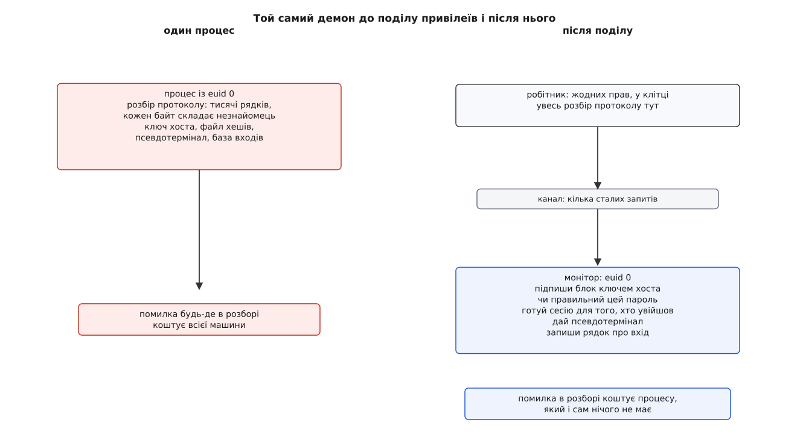
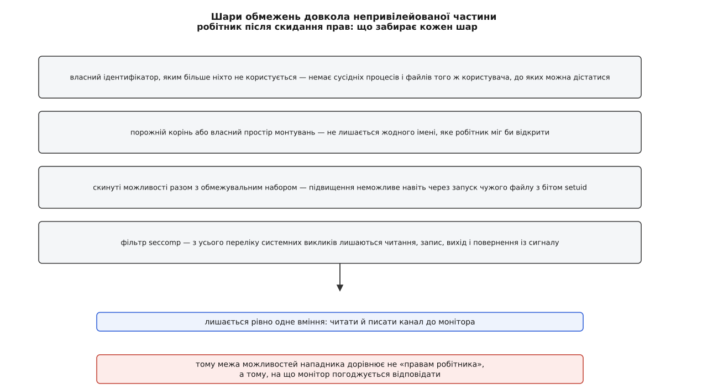

# Розділення привілеїв: маленький довірений процес і решта

<preknowlist>
- [Користувачі, групи й ідентичність процесу](topic:unix-linux/uid-gid-model) — процес несе числа ruid, euid і suid, і саме на них ядро дивиться, вирішуючи, що дозволено.
- [setuid, setgid і підвищення прав](topic:unix-linux/setuid-and-privilege) — єдина мить, коли процес може дістати більше прав, ніж мав: запуск файлу з відповідним бітом.
- [fork: розмноження процесу](topic:unix-linux/fork-semantics) — дитина дістає копію пам'яті батька й ті самі відкриті дескриптори.
- [Файловий дескриптор](topic:unix-linux/file-descriptor) — маленьке число в процесі, що вказує на вже відкритий об'єкт, а не на його ім'я.
- [Сокети домену Unix і передача дескрипторів](topic:unix-linux/unix-domain-sockets) — двонапрямний канал між процесами на одній машині, яким можна пересилати не лише байти.
</preknowlist>

На порт 22 приходить незнайомець. Він ще нічого про себе не довів — ні пароля, ні ключа, — а сервер уже мусить із ним розмовляти: прочитати перший рядок, домовитися про алгоритми, порахувати спільний секрет, розібрати десятки типів пакетів зі змінними полями й довжинами. Це тисячі рядків коду розбору, і кожен байт, який вони розбирають, склав той самий незнайомець.

Тепер друга половина картини. Щоб перевірити пароль, сервер має прочитати файл із хешами, доступний тільки суперкористувачеві. Щоб підписати рукостискання — приватний ключ хоста, теж закритий. Щоб потім відкрити псевдотермінал і записати рядок у базу входів — знову потрібні повноваження, яких звичайний користувач не має.

Обидві половини сидять в одному процесі, а права в цього процесу одні на всіх. Отже, увесь розбір ворожих даних відбувається з правами root. Одна помилка в довжині поля десь у розборі пакета — і нападник дістає не чужу сесію, а машину.

Прикро тут не те, що помилка можлива. Прикро співвідношення: коду, якому привілей справді потрібен, — кілька сотень рядків, а коду, який під тим привілеєм крутиться, — тисячі.

## Право належить процесові, а не рядкові коду

Перше, що спадає на думку: опустити права, поки вони не потрібні, і підняти назад, коли знадобляться. Механізм для цього є — збережений ідентифікатор (suid) саме для того й існує.

Порахуймо, що це дає. Розбір пакетів іде з опущеним діючим ідентифікатором, а перед читанням файлу з хешами програма підіймається назад. Виглядає розумно рівно доти, доки не згадати, **чий код виконується** в разі помилки. Нападник, що переповнив буфер у розборі, отримує керування всередині того самого процесу — процесу, у якого suid і досі дорівнює нулю:

```c
/* програма «тимчасово опустилася» */
seteuid(pw->pw_uid);   /* euid = 1000, а suid так і лишився 0 */
...
/* сюди потрапив чужий код у тому ж адресному просторі: */
seteuid(0);            /* euid знову 0 — ядро дозволяє, бо suid == 0 */
```

Опускання, з якого можна повернутися, не захищає ні від чого: воно рятує від власної неуважності, а не від чужого наміру. Опускання, з якого повернутися не можна (`setresuid` усіма трьома числами відразу), захищає — але тоді програма більше ніколи не прочитає ні хешів, ні ключа хоста, а вони потрібні саме після розбору, а не до нього.

Обидві спроби розбиваються об одне й те саме. **Ядро приписує права процесові цілком, а не окремій ділянці його коду.** У процесі немає «привілейованої функції»: є адресний простір, у якому весь код рівний, бо весь може викликати будь-який системний виклик від імені цього процесу. Тому речення «нехай ці двісті рядків мають більше прав, ніж решта» всередині одного процесу не має жодного втілення.

Але воно має втілення, щойно ми погодимося, що частин буде дві. Різні права — різні процеси; це не обхідний шлях, а єдиний доступний. Ті двісті рядків виносимо в окремий процес, лишаємо йому повні повноваження, а решту програми запускаємо процесом без жодних. Такий поділ програми називають **розділенням привілеїв** (англ. *privilege separation*).

Вимога, щоб кожна частина мала рівно ті повноваження, без яких не зробить своєї роботи, і жодного понад те, відома як [принцип найменших привілеїв](topic:programming/least-privilege) — його формулюють для будь-якої системи, не лише для Unix. Розділення привілеїв — це те, у що він тут перетворюється на практиці, і перетворюється однозначно: коли одиниця, якій приписують права, — процес, «менше прав для цього шматка» можна виразити тільки новим процесом.

## Де проходить розріз

Різати можна по-різному, і від вибору лінії залежить, чи буде з поділу користь. Спокуса — різати по звичних межах модулів: мережа окремо, автентифікація окремо, сесія окремо. Це дає акуратну схему й нульовий захист, бо в кожній частині лишається трохи привілею й трохи ворожих даних.

Правильна лінія одна, і вона формулюється як заборона: **привілейована частина не розбирає жодного байта, що прийшов від того, кого ще не перевірено.** Усе, що торкається дроту, — по інший бік. Це не побажання, а критерій: якщо в довіреному процесі є хоч один цикл розбору вхідного повідомлення змінної довжини, поділ уже нічого не гарантує.

З цієї заборони випливає форма обох частин, і форма несподівана. Привілейована частина перестає бути «початком програми», який кличе решту. Логіка протоколу цілком лишається в непривілейованій частині — і саме вона керує ходом розмови. А довірений процес стає **сервером для власної недовіреної частини**: сидить у циклі й відповідає на короткий перелік запитів.

У випадку sshd він зводиться до кількох дій: підпиши ось цей блок ключем хоста; ось ім'я й пароль — чи правильні; автентифікацію завершено, готуй сесію; дай псевдотермінал; запиши рядок про вхід. (У справжньому `monitor.h` запитів кількадесят — але це ті самі кілька дій, помножені на способи автентифікації.) П'ять відповідей замість тисяч рядків.



*Поділ не зменшує кількості коду й не виправляє в ньому жодної помилки. Він переносить межу: ліворуч помилка в розборі коштує машини, праворуч — коштує процесу, який і так нічого не має.*

Довірену частину прийнято називати **монітором** (лат. *monitor* — «наглядач»), недовірену — робітником або дитиною; далі тримаємося цих двох слів.

## Як пара з'являється на світ

Двох процесів із двома різними наборами прав не запускають окремо: тоді довелося б якось зводити їх разом і доводити, що зійшлися саме ті двоє. Замість цього монітор створює канал (пару зв'язаних сокетів), робить `fork`, і дитина застає той канал уже відкритим і вже під'єднаним рівно до свого монітора. Одразу після цього дитина скидає з себе права й зачиняється в клітці, а батько лишається привілейованим.

Тут ховається помилка, через яку акуратно розділена програма перестає бути розділеною, а на вигляд усе гаразд. `fork` копіює адресний простір. Якщо монітор устиг прочитати приватний ключ хоста **до** розгалуження, копія цього ключа опиниться в пам'яті робітника — і нападник дістане його, не поставивши моніторові жодного запиту. Звідси залізний порядок: спершу розгалуження й клітка, і лише потім будь-який дотик до таємниць. Те саме стосується відкритих дескрипторів: успадковане відкрите не питає дозволу в монітора, тому все зайве або закривають перед `fork`, або позначають закриттям при `exec`.

Зв'язок пари тримається на самому каналі, і це зручно. Робітник помер — монітор бачить кінець файлу на своєму кінці й згортає сесію; монітор помер — робітник дістає розрив на найближчому записі. Ніякого окремого нагляду за життям сусіда писати не треба.

## Канал між частинами — і є та конструкція, яку тепер треба зробити правильно

Канал — це [межа довіри](topic:programming/trust-boundaries): місце, де закінчується код, за поведінку якого ми ручаємося, і починається код, за який не ручаємося зовсім. Робітник недовірений не «майже», а повністю: проєктувати треба так, ніби він уже в руках нападника з першої секунди. Усе, що монітор від нього чує, — ворожий вхід, з тими самими наслідками, що й пакет із мережі. Звідси три вимоги, і кожна зрізає цілий клас поділів, що виглядають зробленими, а не є.

**Запит — не наказ.** Якщо монітор уміє відповідати на «відкрий мені файл із таким іменем», ми не поділили нічого: робітник просто просить `/etc/shadow` і має все, що мав раніше, ще й зручніше. Монітор мусить ухвалювати рішення сам, а запит — лише називати одну з наперед відомих дій:

```c
/* забагато: монітор виконує те, що йому сказали */
struct req { int op; char path[PATH_MAX]; int flags; };   /* op = OPEN */

/* рівно стільки, скільки треба: монітор вирішує сам */
struct req { int op; };                                   /* op = OPEN_HOSTKEY */
```

Різниця не в кількості полів, а в тому, хто обирає об'єкт. У першому варіанті об'єкт обирає нападник, у другому — код монітора, і вибір той самий за будь-якого запиту.

**Порядок запитів — теж частина перевірки.** Робітник не має жодної причини кликати дії в задуманій послідовності. Якщо «дай псевдотермінал» спрацює до того, як повернулася успішна відповідь на «перевір пароль», поділ порожній: нападник просто пропускає крок автентифікації. Тому монітор веде власний маленький автомат станів і в кожному стані приймає лише дозволені в ньому запити, а виконавши незворотний перехід — назад не пускає.

**Відповідь має бути мінімальною.** На «чи правильний пароль» повертається «так» або «ні», а не хеш із файлу: хеш дозволив би підбирати офлайн, без жодного мережевого шуму. Кожне зайве слово у відповіді — це шматочок привілею, повернутий назад через канал.

І ще одне, що випливає просто з попереднього речення про межу довіри. Формат запитів роблять якнайтупішим: сталий розмір, жодного виділення пам'яті за довжиною, узятою з повідомлення, жодного розбору вкладених структур. Інакше розбір ворожих даних, від якого ми втекли, пролізе в монітор задніми дверима — і поділ обернеться на нуль.

> 🔧 **Навіщо це.** Поділ вимагає роботи саме тут, а не в місці розрізу. Написати `fork()` і `setresuid()` — п'ять рядків; спроєктувати п'ять запитів так, щоб їх довільна послідовність із довільними полями не давала нічого понад задумане, — це і є вся задача. Готовий кістяк такого монітора з протоколом і передачею дескрипторів розібрано у вставці [маленький монітор і робітник](topic:unix-linux/privilege-separation/proj-privsep-helper.md): там і цикл монітора, і автомат станів, і місця, де такий код найчастіше ламається.

## Як віддати саме право, а не дозвіл на майбутнє

Робітникові мало відповідей «так/ні» — йому треба справді працювати: писати в псевдотермінал, читати домашній каталог після входу. Відкрити це він не може й не повинен могти.

Виручає властивість дескриптора, заради якої його тут і згадують. Дескриптор указує на **вже відкритий об'єкт**, а не на ім'я, за яким той об'єкт колись знайдуть. Монітор відкриває сам, зі своїми правами й своєю перевіркою, а потім пересилає число каналом — сокет домену Unix уміє переносити не лише байти, а й дескриптори, і на тому боці з'являється власне право доступу.

Це не просто зручність. Це закриває цілий клас помилок, від яких страждає підхід «перевір ім'я, потім відкрий»: між перевіркою й відкриттям ім'я може почати вказувати на інший об'єкт, і привілейована програма чесно відкриє те, що їй підсунули. Коли ж перевірка й відкриття — це одна дія в моніторі, а назовні йде результат, підсовувати нічого й нікуди.

Зворотний бік того самого: дескриптор — справжнє повноваження, і роздавати їх треба так само скупо, як і відповіді. Один переданий дескриптор кореневого каталогу повертає робітникові доступ до всієї файлової системи — не гірше за root, лише тихіше.

## Скільки ще можна забрати в робітника

«Не root» — це початок, а не результат. Процес без привілею все ще бачить чужі файли, доступні для читання всім; він усе ще може приєднатися до іншого процесу свого ж користувача; йому все ще відкриті сотні системних викликів, у кожному з яких колись знайдуть помилку. Тому робітника не просто позбавляють привілею, а замикають — шар за шаром, і кожен шар відповідає на конкретне «а що він іще може».

Власний ідентифікатор, яким більше не користується ніхто, знімає можливість дістатися сусідніх процесів і файлів. Порожній каталог як новий корінь ([`chroot`](topic:unix-linux/chroot) або, надійніше, окремий [простір імен монтувань](topic:unix-linux/namespaces)) знімає шляхи взагалі: у робітника не лишається жодного імені, яке він міг би відкрити. Скинуті [можливості](topic:unix-linux/capabilities) разом з обмежувальним набором і прапорцем «жодних нових привілеїв» (`no_new_privs`) роблять підвищення неможливим навіть через запуск чужого файлу з бітом setuid. Нарешті, [фільтр seccomp](topic:unix-linux/seccomp-filtering) лишає з усього переліку системних викликів кілька — читання, запис, вихід, повернення із сигналу — і тим самим зрізає більшу частину поверхні самого ядра.



*Після всіх шарів повністю захоплений робітник володіє одним умінням — читати й писати в канал до монітора. Тому реальна межа можливостей нападника дорівнює не «правам робітника», а тому, що монітор погоджується відповідати.*

Той самий фільтр, до речі, пояснює, чому клітку будують саме довкола цієї частини: непривілейований робітник виконує рівно один вид роботи — розбирає протокол, — і перелік потрібних йому викликів короткий і сталий. Для монітора такий фільтр не склали б: він відкриває файли, породжує процеси, лізе в базу входів.

## Що робити після успішної автентифікації

Автентифікація завершилася вдало — і тепер сесія має виконуватися від імені того, хто увійшов. Найпростіше на вигляд рішення: хай робітник, який щойно провів розмову, перетвориться на користувача.

Робити цього не можна, і причина пряма. Розмова з нападником уже відбулася в цьому процесі; якщо в розборі була помилка, процес до цієї миті вже чужий. Дати йому ідентичність користувача означало б видати повний доступ до чужих файлів тому, хто нічого не доводив: адже команду «стань користувачем alice» шле саме він.

Тому робітника після автентифікації не підвищують, а викидають. Монітор — той, хто єдиний знає, чи справді пароль зійшовся, — породжує **свіжий** процес із чистим станом і сам виставляє йому облікові дані користувача, беручи ім'я зі своєї власної пам'яті, а не з повідомлення. Скомпрометований процес разом із усім, що нападник у ньому нагромадив, закінчується тут.

Монітор при цьому лишається привілейованим до кінця сесії, і не з ліні: після завершення треба прибрати псевдотермінал і закрити запис у базі входів, а на це знову потрібні права, яких у сесії користувача немає.

## Чого поділ не робить

Розділення привілеїв не виправляє жодної помилки — воно призначає ціну кожній. Це варто проговорити точно, бо тут же лежить і межа методу.

Помилка в моніторі — так само root, як і в нерозділеній програмі; поділ не робить довірений код правильним, він лише робить його маленьким, щоб правильність була досяжною. Помилка в протоколі між частинами страшніша за відсутність поділу, бо конструкція виглядає безпечною й перевіряти її перестають.

Наскільки ця відмінність реальна, показали два CVE в sshd 2024 року — фактично природний експеримент, бо помилка була однієї природи, а лежала по різні боки межі. **CVE-2024-6387** («regreSSHion»): обробник сигналу за таймером входу викликав функції, [небезпечні в асинхронному контексті](topic:unix-linux/async-signal-safety), і на цьому будувалося віддалене виконання коду — але спрацьовувало воно в привілейованому процесі, тож наслідком був root без автентифікації. **CVE-2024-6409**, знайдена невдовзі: та сама сімʼя обробників, той самий клас гонки, — проте досяжна вона була в непривілейованій дитині, і наслідки виявилися незрівнянно меншими. Один і той самий недогляд коштував машини по один бік розрізу й майже нічого по інший.

Урок із цієї пари не в тому, який код писати обережніше. Він у тому, що питання проєктування звучить не «які права потрібні цій програмі», а «що має лишитися правдою, якщо програма цілком у чужих руках». Відповідь на друге питання висловлюється процесами — бо процес і є найдрібніше, чому Unix узагалі згоден приписати права.

Шлях, яким до цієї відповіді дійшли — від пошти, розрізаної на маленькі програми з окремими обліковими записами, до sshd, розрізаного вже після того, як він був написаний, — розібрано у вставці [як прийшли до поділу](topic:unix-linux/privilege-separation/hist-privsep-origins.md); там же видно, чому різати готову програму значно важче, ніж проєктувати розділеною.
