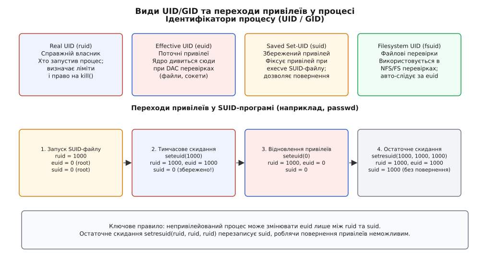
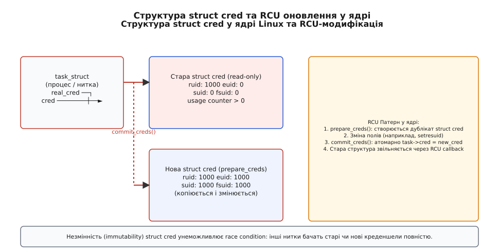

<preknowlist>
- [Модель UID/GID](topic:unix-linux/uid-gid-model) — ідентифікатори користувачів і груп у системі Unix.
- [Біти прав доступу](topic:unix-linux/permission-bits) — традиційні rwx-права файлової системи та біти SUID/SGID.
- [Права SUID та привілеї](topic:unix-linux/setuid-and-privilege) — механізм зміни ефективного UID під час виконання бінарника.
</preknowlist>

Веб-сервер під час запуску виконує дві привілейовані дії: зв'язується з мережевим портом 443 та зчитує секретний приватний ключ TLS із файлу `/etc/ssl/private/server.key`, доступного виключно суперкористувачу. Для виконання цих дій процес мусить працювати з найвищими системними правами `root` (UID 0). Проте, якщо цей самий веб-сервер залишається працювати від імені `root` під час обробки мільйонів мережевих запитів із зовнішнього інтернету, будь-яка уразливість переповнення буфера або довільного виконання коду віддає зловмиснику повний контроль над усім сервером.

Операційна система розв'язує цю суперечність за допомогою механізму **креденшелів процесів** (process credentials). Замість єдиної мітки прав ядро Linux призначає кожному процесу набір ідентифікаторів користувача (UID) та груп (GID). Цей набір розділяє інформацію про те, хто запустив процес, які права він має в поточний момент, якими привілеями він володів раніше і чи має він право відновити їх після тимчасового скидання.

---

## Види ідентифікаторів процесу: RUID, EUID, SUID, FSUID

Кожен процес у Linux та POSIX-сумісних системах має чотири ідентифікатори користувача та чотири відповідні ідентифікатори груп, а також список додаткових груп.


*Види ідентифікаторів користувача у процесі та переходи між ними під час виконання SUID-програми та викликів скидання привілеїв.*

### Real UID та Real GID (ruid, rgid)

Коли користувач відкриває сеанс у командній оболонці (shell), процес оболонки має його UID. Усі процеси-нащадки, створені через системні виклики `fork()` та `execve()`, успадковують цей ідентифікатор від батьківського процесу. З цього механізму успадкування ідентифікатора авторизованого користувача формується поняття **Real UID (Дійсний UID)** та **Real GID (Дійсний GID)** — вони вказують на реального власника процесу, який ініціював його запуск.

Real UID використовується ядром для трьох ключових задач:
1. **Облік системних ресурсів**: обмеження на кількість процесів (`RLIMIT_NPROC`), обсяг споживаної пам'яті та дискові квоти розраховуються саме за `ruid`.
2. **Право надсилати сигнали**: непривілейований процес може надіслати сигнал системним викликом `kill()` лише тому процесу, чий `ruid` або `suid` збігається з `ruid` або `euid` відправника.
3. **Аудит і криміналістика**: поле `ruid` фіксує первинне джерело виконання, навіть якщо процес пізніше змінив свої привілеї.

### Effective UID та Effective GID (euid, egid)

Під час звернення процесу до файлової системи, створення сокетів, монтування дисків або виконання привілейованих системних викликів ядро операційної системи перевіряє суб'єктні права доступу VFS безпосередньо в момент виконання дії. Для звичайних програм перевірка виконується за ідентифікатором запускника, але під час виконання бінарника із встановленим прапорцем SUID (Set-User-ID) ядро під час `execve()` тимчасово підміняє активні права доступу на права власника цього файлу.

З цього пояснення перевірок VFS та механізму SUID виводиться поняття **Effective UID (Ефективний UID)** та **Effective GID (Ефективний GID)** — це активні суб'єктні ідентифікатори, які ядро використовує для всіх перевірок доступу у системі. Для звичайних програм `euid` завжди дорівнює `ruid`, і вони розходяться лише тоді, коли ядро надало процесу інший `euid`: під час `execve()` файлу з прапорцем SUID або внаслідок явної зміни привілеїв процесом, що має `CAP_SETUID`.

Класичним прикладом є системна утиліта `passwd`. Заміна пароля вимагає модифікації файлу `/etc/shadow`, запис у який дозволено лише користувачу `root` (UID 0). Виконуваний файл `/usr/bin/passwd` належить `root` і має увімкнений біт SUID. Коли звичайний користувач із `ruid = 1000` запускає `passwd`:
- `ruid` залишається дорівнювати 1000 (фіксує, хто виконав виклик);
- `euid` змінюється на 0 (`root`), оскільки файл має прапорець SUID.

Під час перевірки права на запис у `/etc/shadow` ядро бачить `euid = 0` і дозволяє операцію.

### Saved Set-User-ID та Saved Set-Group-ID (suid, sgid)

**Saved Set-User-ID (Збережений UID)** слугує зафіксованою резервною копією привілейованого ідентифікатора.

До появи цього поля у системі з двома ідентифікаторами програма з SUID мала вибір: або залишатися від імені `root` увесь час, або назавжди відмовитися від привілеїв, перезаписавши `euid`. Повернути привілеї назад було неможливо.

Коли ядро виконує `execve()` для SUID-програми, воно копіює новий привілейований `euid` у поле `suid`. Це створює безпечний механізм двофазного управління:
- Програма запускається з `euid = 0` та `suid = 0`.
- Зчитавши привілейовані конфігурації, процес виконує виклик `seteuid(ruid)`. Його `euid` стає 1000, але `suid` залишається 0.
- Програма виконує небезпечну обробку даних від непривілейованого користувача з `euid = 1000`.
- Коли знову потрібен привілей, процес викликає `seteuid(suid)`, повертаючи `euid = 0`.

Детальний аналіз того, як відсутність цього поля змушувала розробників ранніх Unix-систем іти на небезпечні компроміси, розкрито у вставці [історія креденшелів Unix](topic:unix-linux/process-credentials-uids-gids/hist-posix-credentials.md).

### Filesystem UID та Filesystem GID (fsuid, fsgid)

Сервер мережевих файлових систем (NFS) у просторі користувача працює від імені `root` (`euid = 0`), але під час виконання файлових операцій за запитом віддаленого клієнта зобов'язаний проходити перевірки VFS від імені цього клієнта (наприклад, UID 1005). Якби демон NFS змінював свій `euid` на 1005, він тимчасово ставав би звичайним користувачем — і будь-який локальний процес того самого користувача діставав би право слати йому сигнали й чіплятися до нього `ptrace`, тобто керувати привілейованою службою ззовні.

Щоб розв'язати цю проблему NFS-демона в юзерспейсі не роблячи сам демон уразливим, у ядрі Linux 1.2 (1995) з'явилися специфічні ідентифікатори — **Filesystem UID (fsuid)** та **Filesystem GID (fsgid)**, призначені виключно для перевірок прав доступу до файлової системи (VFS). Впровадження `fsuid` дозволило змінити файловий ідентифікатор викликом `setfsuid(1005)`, залишивши `euid = 0` для системного управління.

У сучасному Linux значення `fsuid` автоматично синхронізується з `euid`. Якщо програма змінює `euid`, ядро самостійно оновлює `fsuid`, тому розробникам рідко потрібно викликати `setfsuid` напряму.

### Додаткові групи (Supplementary GIDs)

Крім основного GID (`rgid`, `egid`), кожен процес володіє масивом додаткових груп (Supplementary Groups). Це дозволяє користувачу належати до багатьох системних категорій одночасно (наприклад, `wheel`, `sudo`, `docker`, `audio`, `vboxusers`).

Під час перевірки прав доступу до файлу ядро Linux порівнює GID файла послідовно:
1. З `egid` процесу.
2. З усіма елементами масиву додаткових груп процесу.

Кількість додаткових груп обмежена системною константою `NGROUPS_MAX` (у сучасній системі Linux це 65536). Для швидкої перевірки прав ядро зберігає масив груп у відсортованому вигляді та виконує бінарний пошук `O(log N)` при кожному зверненні до файлу.

---

## Алгоритм перевірки прав доступу VFS у ядрі

Коли процес здійснює системний виклик для роботи з файлом (наприклад, `open()`, `stat()`, `execve()`), ядро виконує перевірку доступу через віртуальну файлову систему (VFS).

Алгоритм перевірки підсистеми VFS порівнює креденшели процесу з атрибутами дискового об'єкта (структурою `struct inode`, де записані власник `i_uid`, група `i_gid` та режим доступу `i_mode`):

```
                        Спроба доступу до файлу
                                  │
                                  ▼
                     Чи euid/fsuid == i_uid файлу?
                     ┌────────────┴────────────┐
                     │ ТАК                     │ НІ
                     ▼                         ▼
          Перевіряються три біти       Чи egid/fsgid == i_gid
             власника (rwx)            чи в supplementary groups?
                     │                 ┌───────┴───────┐
                     │                 │ ТАК           │ НІ
                     ▼                 ▼               ▼
                  РЕЗУЛЬТАТ    Перевіряються біти  Перевіряються біти
                 (Дозвіл/EACCES)  групи (rwx)      інших/other (rwx)
```

1. **Перевірка власника**: Якщо `fsuid` (або `euid`) процесу дорівнює UID власника файлу (`i_uid`), ядро перевіряє **виключно** першу трійку бітів прав (Owner bits: `rwx`). Інші біти взагалі не розглядаються.
2. **Перевірка групи**: Якщо процес не є власником, але `fsgid` (або `egid`) процесу збігається з GID файлу (`i_gid`), або цей GID присутній у списку додаткових груп (`group_info`), ядро перевіряє середню трійку бітів (Group bits: `rwx`).
3. **Перевірка інших**: Якщо процес не є ані власником, ані членом групи файлу, ядро перевіряє останню трійку бітів (Other bits: `rwx`).

**Важлива особливість ексклюзивності перевірки**: перевірка зупиняється на першому збігу. Якщо користувач є власником файлу, але біти власника встановлені в `---`, ядро миттєво відхиляє доступ із помилкою `EACCES` — навіть якщо решта режиму має вигляд `---rw-rw-` і група чи «інші» доступ дозволяють.

---

## Анатомія ядра Linux: `struct cred` та RCU-патерн

Всередині ядра Linux (починаючи з версії 2.6.29) усі ідентифікатори інкапсульовані в окрему структуру `struct cred`.

Кожна задача у ядрі (структура `task_struct`, яка представляє процес або потік) містить два основні вказівники на креденшели:

```c
struct task_struct {
    // ...
    /* Об'єктивні креденшели: хто дивиться на цей процес ззовні */
    const struct cred __rcu *real_cred;

    /* Суб'єктивні креденшели: з якими правами цей процес діє сам */
    const struct cred __rcu *cred;
    // ...
};
```

Розділення на `real_cred` та `cred` потрібне для того, щоб запобігти атакам типу «trojaned process»: `real_cred` відповідає за те, хто запустив процес і від кого він сприймає сигнали `kill` або виклики `ptrace`, тоді як `cred` задає поточні права для виконання системних викликів.


*Взаємозв'язок task_struct і struct cred у ядрі Linux та атомарне оновлення креденшелів через RCU-патерн.*

### Чому `struct cred` є незмінною (immutable)

У багатониточних програмах зміна UID або GID прямо всередині існуючої структури створила б критичний стан змагання (race condition). Якщо одна нитка ядра виконує запис у поля `uid` або `gid`, а інша нитка паралельно перевіряє права доступу VFS, вона може зчитати неконсистентний стан — наприклад, новий привілейований UID у поєднанні зі старим GID.

Щоб гарантувати абсолютну атомарність, ядро Linux робить `struct cred` **незмінною (immutable)** після її публікації. Будь-яка зміна ідентифікаторів виконується за схемою **RCU (Read-Copy-Update)**:

```
+------------------+       1. prepare_creds()       +------------------+
| Стара struct cred |  -------------------------->  | Нова struct cred  |
| (read-only)      |  створюється повна копія       | (внесення змін)  |
+------------------+                                +------------------+
        ^                                                    |
        |                                                    | 2. commit_creds()
        +------------------ task->cred ----------------------+
                            атомарна заміна вказівника
```

1. **`prepare_creds()`**: Ядро виділяє нову структуру `struct cred` у пам'яті та копіює туди всі поточні значення.
2. **Модифікація**: Системний виклик (наприклад, `setresuid`) записує нові UID/GID у цю нову копію.
3. **`commit_creds()`**: Ядро атомарно змінює вказівник `task->cred` на нову структуру.
4. **Очищення**: Стара структура `struct cred` залишається в пам'яті доти, доки всі нитки ядра, які читали її через RCU, не завершать свої критичні секції, після чого вона звільняється.

Завдяки цьому інші нитки операційної системи завжди бачать або повністю старий набір креденшелів, або повністю новий, без жодних проміжних станів.

---

## Системні виклики керування привілеями

Зміна ідентифікаторів суворо регулюється ядром. Правила залежать від того, чи має процес привілей `CAP_SETUID` (або `euid == 0`).

```
                              Непривілейований процес
                     ┌──────────────────────────────────────┐
                     │                                      │
                     ▼                                      │
              ┌──────────────┐                       ┌──────────────┐
              │   Real UID   │                       │  Saved UID   │
              └──────────────┘                       └──────────────┘
                     ▲                                      │
                     │                                      │
                     └──────────────────────────────────────┘
                                      │
                                      ▼
                               ┌──────────────┐
                               │Effective UID │
                               └──────────────┘
```

Для непривілейованого процесу рух дозволено **виключно** між його поточними значеннями `ruid`, `euid` та `suid`. Жодне довільне значення UID встановити неможливо.

### Порівняльний аналіз системних викликів

Під час виконання системних викликів зміни привілеїв ядро не модифікує наявну структуру `struct cred` «на місці», оскільки вона є незмінною для захисту від станів змагання. Замість цього виклик ініціює функцію `prepare_creds()`, яка створює повну копію `struct cred` у пам'яті. У цій копії ядро модифікує відповідні поля ідентифікаторів (`uid`, `euid`, `suid`, `fsuid` та аналоги для GID) згідно з правилами перевірки привілеїв (наявність `CAP_SETUID` або порівняння з початковими значеннями). Після модифікації виклик `commit_creds()` атомарно замінює вказівник `task->cred` через механізм RCU.

Конкретний набір полів у `struct cred`, які підлягають зміні, залежить від обраного системного виклику. Детальні сигнатури та коди помилок наведено у вставці [системні виклики та API управління креденшелями](topic:unix-linux/process-credentials-uids-gids/api-cred-syscalls.md).

1. **`setuid(uid)`**:
   - Якщо викликається привілейованим процесом (`CAP_SETUID`), він необоротно змінює **усі три** ідентифікатори (`ruid`, `euid`, `suid`) та `fsuid` на нове значення `uid`.
   - Якщо викликається непривілейованим процесом, він змінює **лише** `euid`, і лише за умови, що `uid` дорівнює поточному `ruid` або `suid`.
2. **`seteuid(euid)`**:
   - Змінює **виключно** Effective UID. Привілейований процес може задати будь-яке значення; непривілейований — лише таке, що дорівнює `ruid`, `euid` або `suid`.
3. **`setreuid(ruid, euid)`**:
   - Дозволяє одночасно задати Real та Effective UID. Якщо аргумент дорівнює `-1`, відповідне поле не змінюється.
4. **`setresuid(ruid, euid, suid)`**:
   - Найбільш чіткий та атомарний виклик (специфічний для Linux та BSD). Він дозволяє явно встановити кожен із трьох ідентифікаторів без прихованих побічних ефектів на Saved UID.

---

## Креденшели у багатониточних програмах (NPTL / POSIX Threads)

На рівні ядра Linux кожна нитка виконання (thread) має власний об'єкт `task_struct` із власним вказівником `cred`. Це означає, що ядро технічно дозволяє ниткам одного процесу мати різні UID та GID.

Проте стандарт POSIX (IEEE Std 1003.1) суворо вимагає, щоб усі нитки одного процесу розділяли єдині креденшели.

Щоб забезпечити відповідність POSIX, системна бібліотека C (glibc) реалізує в рамках NPTL (Native POSIX Thread Library) спеціальний механізм синхронізації `SIGSETXID`:

```
 [Нитка 1]                                 [Нитка 2]
    │                                          │
    │  викликає setuid(1000)                   │
    ├─────────────────────────────────────────►│  SIGSETXID
    │  надсилає внутрішній сигнал              │  (системний сигнал NPTL)
    │                                          │
    │  sys_setresuid(1000, 1000, 1000)         │  sys_setresuid(1000, 1000, 1000)
    ▼                                          ▼
 [Оновлено cred]                            [Оновлено cred]
```

Коли одна з ниток програми C/C++ викликає `setuid()` або `setresuid()`:
1. glibc надсилає прихований сигнал `SIGSETXID` усім іншим ниткам тієї самої групи ниток (`thread group`).
2. Обробник сигналу в кожній сусідній нитці виконує той самий системний виклик `sys_setresuid` на рівні ядра.
3. Нитка, що зробила виклик, чекає доти, доки всі інші нитки не підтвердять успішне оновлення своїх `struct cred`.

Це гарантує цілісність прав доступу процесу, але може створювати сплески затримок у високонавантажених серверах із сотнями ниток.

---

## Контроль відлагодження ptrace та ізоляція у User Namespaces

Креденшели процесів відіграють вирішальну роль у механізмах міжпроцесної ізоляції та інспекції.

### Захист ptrace та перевірка `ptrace_may_access()`

Системний виклик `ptrace()`, що використовується відлагоджувачами (`gdb`) та інструментами аналізу (`strace`), дозволяє читати й змінювати пам'ять та регістри іншого процесу. Щоб запобігти зчитуванню секретів непривілейованими користувачами, ядро виконує перевірку `ptrace_may_access()`:

- Відлагоджувач може приєднатися до цільового процесу лише тоді, коли `ruid`, `euid` та `suid` цільового процесу всі три дорівнюють `euid` відлагоджувача (те саме правило перевіряється й для груп); інакше потрібен `CAP_SYS_PTRACE`.
- Якщо цільовий процес є SUID-бінарником або виконував скидання привілеїв, ядро автоматично скидає прапорець `dumpable` (`PR_SET_DUMPABLE = 0`), роблячи процес неприкріплюваним навіть для процесів із тим самим UID.

### Трансляція ідентифікаторів у User Namespaces

У сучасних контейнерних середовищах (Docker, LXC, Podman) структура `struct cred` містить вказівник на `struct user_namespace`.

```
[ Хост-система (Initial User NS) ]          [ Контейнер (User NS) ]
Root UID: 0                                 Virtual Root UID: 0
Host User UID: 100000 ────────────────────► Mapped UID: 0
Host User UID: 100001 ────────────────────► Mapped UID: 1
```

Ядро зберігає всі UID у внутрішньому форматі `kuid_t` (Kernel User ID). Коли процес усередині User Namespace запитує свій UID через `getuid()`, ядро транслює `kuid_t` у віртуальний ідентифікатор цього простору користувача. Завдяки цьому процес може мати `euid = 0` всередині контейнера, залишаючись безпечним непривілейованим UID `100000` для хост-системи.

---

## Простеження та аудит креденшелів у Linux

Стан ідентифікаторів процесу можна легко перевірити через файлову систему `/proc`.

### Інспекція через `/proc/[pid]/status`

Файл `/proc/[pid]/status` містить текстові рядочки `Uid:` та `Gid:`, які показують усі чотири значення за порядком:

```bash
$ cat /proc/self/status | grep -E 'Uid|Gid'
Uid:	1000	1000	1000	1000
Gid:	1000	1000	1000	1000
```

Порядок чисел у рядку: `Real`, `Effective`, `Saved`, `FileSystem`.

Якщо програма виконує тимчасове скидання привілеїв, значення будуть відрізнятися:
```
Uid:	1000	1000	0	1000
```
У цьому прикладі `euid` скинуто до 1000, але `suid = 0` свідчить про те, що процес зберігає можливість повернути права `root`.

### Аудит системних викликів через `strace`

За допомогою `strace` можна простежити точний момент зміни креденшелів у бінарнику. SUID-бінарник трасують лише з-під `root`: коли до процесу приєднаний відлагоджувач, ядро ігнорує біт SUID, і `euid` лишається користувацьким — наведеного нижче переходу просто не буде.

```bash
# strace -e trace=setresuid,setresgid,setgroups -f passwd
setgroups(0, NULL)                      = 0
setresgid(1000, 1000, 1000)             = 0
setresuid(1000, 1000, 1000)             = 0
```

---

## Практика: Безпечне скидання привілеїв у C та C++

Повний алгоритм остаточного скидання привілеїв та захисту від витоку даних описано у вставці [двофазне скидання привілеїв у демонах](topic:unix-linux/process-credentials-uids-gids/proj-privilege-drop.md). Нижче наведено базовий приклад взаємодії з UID/GID у коді.

:::tabs
```c
#define _GNU_SOURCE
#include <stdio.h>
#include <stdlib.h>
#include <unistd.h>
#include <sys/types.h>
#include <errno.h>

int main(void) {
    uid_t ruid, euid, suid;

    // Отримання всіх трьох UID
    if (getresuid(&ruid, &euid, &suid) != 0) {
        perror("Помилка getresuid");
        return EXIT_FAILURE;
    }
    printf("Початковий стан: RUID=%d, EUID=%d, SUID=%d\n", ruid, euid, suid);

    // Тимчасове скидання привілеїв (якщо euid == 0)
    if (euid == 0) {
        if (seteuid(ruid) != 0) {
            perror("Помилка тимчасового скидання seteuid");
            return EXIT_FAILURE;
        }
        getresuid(&ruid, &euid, &suid);
        printf("Після тимчасового скидання: RUID=%d, EUID=%d, SUID=%d\n", ruid, euid, suid);

        // Відновлення привілеїв зі збереженого SUID
        if (seteuid(suid) != 0) {
            perror("Помилка відновлення привілеїв");
            return EXIT_FAILURE;
        }
        printf("Привілеї успішно відновлено.\n");
    }

    return EXIT_SUCCESS;
}
```
```cpp
#include <iostream>
#include <system_error>
#include <expected>
#include <unistd.h>
#include <sys/types.h>

struct ProcessUIDs {
    uid_t ruid;
    uid_t euid;
    uid_t suid;
};

// Отримання поточних UID через std::expected
[[nodiscard]] std::expected<ProcessUIDs, std::error_code> get_uids() noexcept {
    ProcessUIDs uids{};
    if (::getresuid(&uids.ruid, &uids.euid, &uids.suid) != 0) {
        return std::unexpected(std::make_error_code(static_cast<std::errc>(errno)));
    }
    return uids;
}

int main() {
    auto uids_res = get_uids();
    if (!uids_res) {
        std::cerr << "Помилка читання UID: " << uids_res.error().message() << '\n';
        return 1;
    }

    const auto& [ruid, euid, suid] = *uids_res;
    std::cout << "RUID: " << ruid << ", EUID: " << euid << ", SUID: " << suid << '\n';

    // Ідіоматична обробка привілеїв у C++
    if (euid == 0) {
        if (::seteuid(ruid) != 0) {
            std::cerr << "Скидання привілеїв не вдалося\n";
            return 1;
        }
        std::cout << "Привілеї тимчасово скинуто до RUID " << ruid << '\n';
    }

    return 0;
}
```
:::

---

## Типові помилки та безпекові пастки

Під час зміни ідентифікаторів у ядрі Linux перехід від UID 0 (`root`) до звичайного користувача супроводжується автоматичним скиданням системних можливостей (capabilities). Зокрема, як тільки ядро змінює `euid` або `uid` на ненульове значення, процес втрачає привілей `CAP_SETGID`. Якщо після цього процес спробує здійснити виклик `setgid()` або `setgroups()`, ядро відхилить операцію з помилкою `EPERM`.

З цього механізму втрати `CAP_SETGID` після зміни UID у ядрі формується типова пастка порядку викликів — а поряд з нею ще три класичні помилки:

1. **Помилковий порядок викликів (`setuid` перед `setgid`)**:
   Якщо програма спочатку викликає `setuid(1000)`, вона миттєво стає непривілейованою та втрачає можливість змінити групу. Наступний виклик `setgid(1000)` поверне помилку `EPERM`, і процес продовжить роботу з привілейованою групою `root` (GID 0).

2. **Залишення додаткових груп (Supplementary Groups)**:
   Виклики `setuid()` та `setgid()` змінюють лише основні ідентифікатори, але залишають недоторканим масив додаткових груп. Якщо демона було запущено від імені `root`, він може зберігати групи `shadow`, `disk` або `docker`. Процес зобов'язаний явно викликати `initgroups()` або `setgroups(0, NULL)` перед скиданням UID.

3. **Ігнорування повертаного значення**:
   Якщо системний виклик `setuid()` завершується помилкою (наприклад, через перевищення системного ліміту `RLIMIT_NPROC`), програма продовжує виконання. Якщо розробник не перевіряє код повернення, процес продовжує обробку запитів з повними привілеями `root`.

4. **Витік чутливої пам'яті через core dump**:
   Після скидання привілеїв непривілейований користувач може надіслати процесу сигнал `SIGSEGV` і спробувати зчитати файл дампу пам'яті (core dump), у якому залишилися TLS-ключі або паролі, зчитані на етапі запуску. Сама зміна креденшелів скидає прапорець `dumpable`, тож типово ядро дамп такого процесу не пише — але це не гарантія: `fs.suid_dumpable = 1` повертає дампи, а програма може й сама ввімкнути `dumpable` назад заради відлагодження. Тому прапорець виставляють явно: `prctl(PR_SET_DUMPABLE, 0)`.

Для розмежування привілеїв у сучасних Linux-системах креденшели UID/GID працюють у тісній зв'язці з атомарними привілеями [Capabilities замість root](topic:unix-linux/capabilities) та ізоляцією [User Namespaces та мапінг UID/GID](topic:unix-linux/user-namespaces-uid-mapping).
