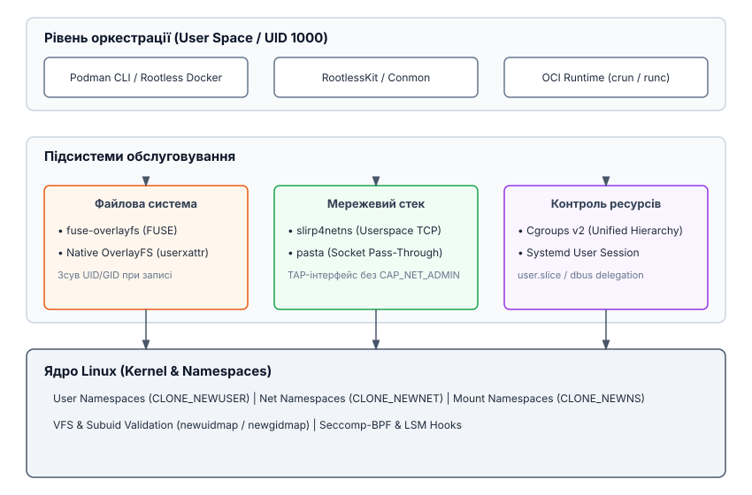
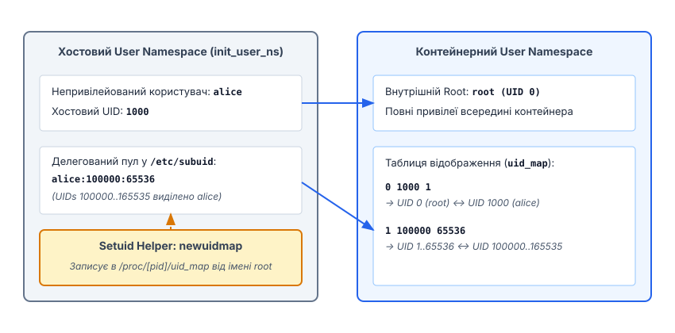

# Безкорінна контейнеризація

<preknowlist>
- [Юзер-простори імен (User Namespaces)](topic:unix-linux/user-namespaces-uid-mapping) — відображення ідентифікаторів користувачів і груп без привілеїв root.
- [Capabilities в Linux](topic:unix-linux/capabilities) — розділення привілеїв суперкористувача на окремі дискретні права.
- [Фільтрація системних викликів Seccomp-BPF](topic:unix-linux/seccomp-bpf-filtering) — обмеження системних викликів контейнера.
</preknowlist>

Коли централізований демон контейнеризації працює з правами суперкористувача `root` (з ідентифікатором UID 0), будь-яка помилка в коді демона або вразливість в ізоляції ядра перетворює безпечний контейнер на вектор повної компрометації хоста. Якщо процес всередині контейнера виконується від імені root і спроможний здійснити втечу за межі ізоляції (*container breakout*), він опиняється у фізичній системі з правами суперкористувача. **Безкорінна контейнеризація** (*rootless containerization*) змінює цю парадигму: вона дозволяє звичайному непривілейованому користувачеві створювати, запускати та управляти контейнерами, не маючи жодних привілеїв адміністратора на хост-системі.

Для реалізації безкорінного запуску недостатньо лише прибрати вимогу `sudo`. Потрібно повністю перевизначити взаємодію з підсистемами ядра Linux: трансляцією ідентифікаторів користувачів у віртуальній файловій системі VFS (від англ. *Virtual File System*), об'єднаними файловими системами, мережевими інтерфейсами та контролерами ресурсів cgroups.


*Взаємодія компонентів rootless-стека: Cgroups v2, FUSE/OverlayFS, slirp4netns/pasta та OCI Runtime.*

## Архітектурний зсув: від суперкористувача до непривілейованих просторів

У традиційній системі Docker демон `dockerd` слухає UNIX-сокет `/var/run/docker.sock`, який належить `root`. Запити на запуск контейнерів передаються цьому демону, який від імені root створює точки монтування через `mount(2)`, налаштовує мережеві пристрої `veth` (від англ. *virtual ethernet*) та запускає OCI runtime (від англ. *Open Container Initiative* — ініціатива відкритих контейнерних стандартів) `runc`.

У rootless контейнеризації весь стек — від командного інтерфейсу (Podman або Rootless Docker) до низькорівневого OCI runtime (`crun` або `runc`) — працює в межах сесії звичайного користувача (наприклад, з UID 1000).

Замість одного централізованого привілейованого демона використовується комбінація непривілейованих інструментів простору користувача. Історичний процес формування цієї архітектури від перших випусків ядра з юзер-просторами імен до сучасних виробничих стандартів описано у вставці [📜 Історія розвитку rootless-контейнеризації](topic:unix-linux/rootless-containers/hist-rootless-evolution.md).

Фундаментом архітектури є заміна привілейованих операцій системного рівня на їхні ізольовані аналоги в просторі користувача.

## Непривілейовані User Namespaces та мапінг ідентифікаторів

Ключовим механізмом, що створює ілюзію наявності прав root всередині контейнера, є непривілейований простір імен користувачів (*User Namespace*).

Створення нового user namespace виконується системним викликом `unshare(CLONE_NEWUSER)` або `clone(CLONE_NEWUSER)`. На відміну від усіх інших просторів імен Linux (Network, PID, Mount, UTS, IPC), створення `user namespace` **не вимагає привілеїв `CAP_SYS_ADMIN`**. Будь-який непривілейований процес може створити новий простір користувача.

```
# Створення непривілейованого user namespace через CLI
unshare --user --map-root-user /bin/bash
```

При створенні нового user namespace ядро надає процесу повний набір привілеїв *capabilities* (включно з `CAP_SYS_ADMIN`, `CAP_NET_ADMIN`, `CAP_DAC_OVERRIDE`), але **суворо обмежених цим конкретним простором імен**. Процес може виконувати конфігураційні дії щодо ресурсів, які належать цьому простору, але не має жодних прав над глобальними ресурсами хоста.


*Відображення UID хоста на внутрішні UID контейнера за допомогою subuid та newuidmap.*

Трансляція ідентифікаторів між хостом та контейнером задається у процедурній файловій системі через файли `/proc/[pid]/uid_map` та `/proc/[pid]/gid_map`. 

Ядро Linux із міркувань безпеки встановлює жорстке обмеження: непривілейований процес може записати у `/proc/[pid]/uid_map` **лише один рядок**, який відображає його власний поточний UID хоста на якийсь внутрішній UID (наприклад, UID 1000 хоста -> UID 0 у контейнері).

```
# Приклад одиночного відображення для непривілейованого процесу
0 1000 1
```

Проте повноцінному контейнеру одного UID 0 зазвичай недостатньо. Контейнерні образи містять системні файли та службові облікові записи (`daemon`, `nobody`, `www-data`), які мають інші ідентифікатори (UID 1..65535). Якщо процес всередині контейнера спробує змінити власника файла через `chown` на UID 33 (`www-data`), а цей UID не відображений у `uid_map`, ядро відхилить операцію з помилкою `EPERM` (*Operation not permitted*).

## Внутрішній механізм мапінгу VFS та перевірка ns_capable у ядрі

У ядрі Linux всі ідентифікатори власників inodes (`i_uid`, `i_gid`) усередині VFS зберігаються у вигляді внутрішніх глобальних структур ядра `kuid_t` та `kgid_t`.

Коли процес звертається до файлової системи (наприклад, виконує виклик `stat(2)` або `openat(2)`), ядро переводить глобальний `kuid_t` у локальний `uid_t` даного простору імен за допомогою внутрішньої функції `from_kuid(user_ns, kuid)`:

1. Ядро бере `kuid_t` файла (наприклад, хостовий UID `100032`).
2. Переглядає таблицю `uid_map` поточного `user_namespace`.
3. Знаходить рядок `1 100000 65536`, визначає зміщення (`100032 - 100000 = 32`) і додає внутрішній початковий ідентифікатор (`1 + 32 = 33`).
4. Повертає процесу значення `UID 33` (`www-data`).
5. Якщо `kuid_t` не має відповідного запису в `uid_map`, ядро повертає глобальний ідентифікатор `overflowuid` (за замовчуванням `65534` — `nobody`).

Аналогічно, коли процес викликає `chown(fd, 33, 33)`, ядро виконує зворотну функцію `make_kuid(user_ns, 33)`. Воно шукає UID 33 у таблиці `uid_map`, обчислює відповідний `kuid_t` (`100032`) і записує саме це глобальне значення в inode на фізичному диску.

Для перевірки привілеїв під час системних викликів підсистеми ядра використовують не глобальну функцію `capable(CAP_SYS_ADMIN)`, а прив'язану до простору імен функцію `ns_capable(user_ns, CAP_SYS_ADMIN)`:

* Якщо операція торкається ресурсу всередині поточного user namespace (наприклад, створення точок монтування у приватному Mount Namespace або налаштування loopback мережі у Net Namespace), `ns_capable()` повертає `true`.
* Якщо операція зачіпає глобальні ресурси хоста (наприклад, завантаження модуля ядра `init_module`, налаштування фізичного годинника `clock_settime` або зміна системного IP-адреси на eth0), ядро викликає `capable()` відносно початкового `init_user_ns`, і операція блокується з помилкою `EPERM`.

## Делегування ідентифікаторів: /etc/subuid та setuid-хелпери

Щоб надати непривілейованому користувачеві можливість використовувати діапазон ідентифікаторів без надання йому загальних прав `root` на хості, підсистема безпеки Linux застосовує систему делегування підпорядкованих UID (*subuid*) та GID (*subgid*).

Адміністратор хоста визначає виділені пули у файлах `/etc/subuid` та `/etc/subgid`. Рядок виділення має наступну структуру:

```
alice:100000:65536
```

Цей запис означає, що користувачу `alice` (з основним UID 1000) дозволено використовувати 65536 послідовних ідентифікаторів хоста, починаючи з UID 100000 (тобто діапазон `100000..165535`).

Оскільки сам процес користувача `alice` не має прав записувати складні діапазони у `/proc/[pid]/uid_map`, для налаштування мапінгу використовуються системні утиліти **`newuidmap`** та **`newgidmap`**.

Ці утиліти мають встановлений біт `setuid root` (`-rwsr-xr-x`). Коли контейнерний рушій (Podman або RootlessKit) створює новий user namespace, він викликає `newuidmap`, передаючи йому PID дочірнього процесу та бажану таблицю відображення:

```bash
# Системний виклик newuidmap від імені setuid-root
newuidmap <PID_контейнера> 0 1000 1 1 100000 65536
```

Утиліта `newuidmap` виконує наступну послідовність перевірок:
1. Зчитує реальний UID процесу, який її викликав (`getuid()`).
2. Відкриває файл `/etc/subuid` і переконується, що запитуваний діапазон `100000..165535` дійсно делегований користувачеві `alice`.
3. Переконується, що одиночний UID 0 мапиться саме на реальний UID `1000`.
4. Лише після успішної валідації `newuidmap` відкриває `/proc/[PID]/uid_map` від імені root і записує таблицю відображення.

Специфікацію синтаксису конфігураційних файлів, формати псевдофайлів `/proc` та параметри CLI-утиліт зібрано у вставці [📋 Інтерфейс конфігурації subuid та утиліт newuidmap](topic:unix-linux/rootless-containers/api-subuid-and-newuidmap.md).

Повний цикл створення простору імен, міжпроцесної синхронізації та запису мапінгу на C та C++ показано у вставці [⚙️ Програмне створення rootless простору імен](topic:unix-linux/rootless-containers/proj-rootless-ns-setup.md).

Для захисту від маніпуляцій з додатковими групами ядро також вимагає запису значення `deny` у файл `/proc/[pid]/setgroups` перед записом у `/proc/[pid]/gid_map`, якщо запис виконується без привілеїв `CAP_SETGID` у батьківському просторі імен.

## Файлова система: FUSE-OverlayFS проти Native Rootless OverlayFS

Контейнерні образи будуються з нашарованих файлових систем (UnionFS). Записи створюються на верхньому шарі (Copy-on-Write), тоді як нижні шари образів залишаються доступними лише для читання. Основним драйвером сховища в Linux є `overlayfs`.

Традиційно системний виклик `mount(2)` з типом файлової системи `overlay` вимагав привілеїв `CAP_SYS_ADMIN` у початковому просторі імен ядра (`init_user_ns`). Ядро забороняло непривілейованим user namespaces монтувати `overlayfs` через ризики безпеки: обхід перевірок прав VFS, фальсифікацію розширених атрибутів (*xattr*) та створення setuid-двійкових файлів на монтованому розділі.

Для вирішення цієї проблеми розробники створили два підходи:

### 1. Емуляція через FUSE (fuse-overlayfs)

Утиліта `fuse-overlayfs` реалізує файлову систему OverlayFS у просторі користувача через механізм FUSE (*Filesystem in Userspace*).

Коли контейнер створює чи змінює файл, виклики VFS перехоплюються ядром і передаються демону `fuse-overlayfs`, який працює як звичайний процес користувача. Демон самостійно виконує трансляцію власників файлів:
* Якщо файл всередині контейнера належить `root` (UID 0), `fuse-overlayfs` записує його на диск хоста від імені UID 1000 (`alice`).
* Якщо файл належить UID 33 (`www-data`), `fuse-overlayfs` записує його на диск хоста з UID 100032 (з делегованого пулу `subuid`).

> 🔧 **Навіщо це.** `fuse-overlayfs` дозволяє запускати rootless-контейнери на будь-якому старому ядрі Linux (починаючи з 4.18), де непривілейоване монтування overlayfs заборонене. Ціною є продуктивність: кожен виклик `read`, `write` або `stat` вимагає додаткових перемикань контексту (*context switches*) між ядром та процесом FUSE.

### 2. Native Rootless OverlayFS (Linux 5.11+)

Починаючи з ядра Linux 5.11, у ядро було додано нативну підтримку непривілейованого монтування `overlayfs` усередині User Namespaces.

Для гарантування безпеки ядро застосовує спеціальні механізми:
1. **Зсув атрибутів через `user.overlay.*`**: Замість використання привілейованих атрибутів `trusted.overlay.*` для збереження інформації про Copy-on-Write та видалені файли (*whiteouts*), непривілейована OverlayFS використовує простір атрибутів користувача `user.overlay.*`, доступний без `CAP_SYS_ADMIN`.
2. **Блокування setuid-бітів**: Будь-які файли з бітами `setuid` або `setgid`, створені у непривілейованому монтуванні `overlayfs`, ігноруються ядром при виконанні — вони втрачають свої привілеї під час виклику `execve(2)`.

Нативна OverlayFS працює безпосередньо в ядрі без накладних витрат FUSE, що забезпечує швидкість дискових операцій, ідентичну до привілейованого Docker.

## Мережева взаємодія без CAP_NET_ADMIN

Створення та налаштування мережевих інтерфейсів (створення `veth`-пари, додавання IP-адрес, конфігурація `iptables` або `nftables`) жорстко вимагає наявності capabilities `CAP_NET_ADMIN` у **хостовому** мережевому просторі імен (`init_net_ns`).

Хоча процес усередині нового user namespace має `CAP_NET_ADMIN` у своєму власному мережевому просторі (`CLONE_NEWNET`), він не має права створити мережевий міст чи віртуальний інтерфейс, який виходить у хостову мережу.

Для забезпечення мережевого зв'язку rootless-контейнерів використовуються мережеві стеки у просторі користувача.

### Стек slirp4netns

Утиліта `slirp4netns` створює віртуальний `TAP`-пристрій всередині мережевого простору імен контейнера. На іншому кінці цього TAP-пристрою знаходиться процес `slirp4netns`, який працює на хості з правами звичайного користувача.

```
+------------------------------------+       +-----------------------------------+
| Мережевий Namespace Контейнера     |       | Хостовий Namespace (init_net_ns)  |
|                                    |       |                                   |
| [Процес Додатка]                   |       | [slirp4netns / pasta daemon]      |
|        | (TCP/IP)                  |       |        | (POSIX Sockets)          |
|        v                           |       |        v                          |
|   [veth / TAP] <== (Ethernet) ====>|======>|==> [socket(), connect(), send()]  |
+------------------------------------+       +-----------------------------------+
```

Механізм роботи `slirp4netns`:
1. Процес контейнера надсилає мережевий пакет (наприклад, HTTP-запит) через свій `TAP`-інтерфейс.
2. `slirp4netns` зчитує сирі Ethernet/IP кадри з файлового дескриптора TAP-пристрою, переданого через UNIX-сокет за допомогою `SCM_RIGHTS`.
3. Внутрішній TCP/IP стек утиліти (бібліотека `libslirp`) розбирає пакети та конвертує їх у стандартні системні виклики сокетів простору користувача: `socket(AF_INET, SOCK_STREAM)`, `connect()`, `send()`.
4. Для ядра хоста цей трафік виглядає як звичайні мережеві сокети, відкриті програмою користувача `alice`.

Для перенаправлення вхідних портів (port forwarding) `slirp4netns` або допоміжний процес `rootlesskit-docker-proxy` відкриває сокет на хості та транслює вхідні з'єднання у TAP-інтерфейс контейнера.

### Сучасна альтернатива: pasta (passt)

Недоліком `slirp4netns` є високе навантаження на процесор та обмежена пропускна здатність через копіювання даних та розбір усіх пакетів в userspace.

Новим стандартом у Podman 5.0 стала утиліта **`pasta`** (з проєкту `passt` — *Packets Adaptation to Socket Translation Architecture*).

На відміну від `slirp4netns`, `pasta` не емулює повний стек TCP/IP в userspace. Вона здійснює пряме узгодження сокетів (*socket passthrough*). Для локального трафіку `pasta` безпосередньо відображає TCP/UDP сокети контейнера на сокети хоста з використанням механізмів zero-copy. Завдяки цьому Podman зробив `pasta` мережевим драйвером за замовчуванням, що значно знижує затримки (*latency*) та дозволяє досягати швидкостей передачі даних понад 10–20 Гбіт/с без значного навантаження на CPU.

## Управління ресурсами: Cgroups v2 та Systemd User Session

Обмеження ресурсів (пам'яті, процесорного часу, кількості процесів PID) є важливою складовою контейнеризації.

У першій версії контрольних груп (**Cgroups v1**) псевдофайлова система `/sys/fs/cgroup` вимагала прав root для створення нових піддерев та призначення обмежень. Це унеможливлювало безпечне використання cgroups у rootless-режимі.

З появою **Cgroups v2** (єдина ієрархія — *unified hierarchy*) ядро Linux запровадило підтримку безпечного непривілейованого делегування контролерів.

```
/sys/fs/cgroup/
└── user.slice/
    └── user-1000.slice/                <-- Належить UID 1000 (alice)
        └── user@1000.service/
            ├── podman-14205.scope/     <-- Cgroup контейнера
            └── memory.max              <-- Обмеження пам'яті
```

Делегування cgroups реалізується через системний менеджер **Systemd User Session**:

1. При вході користувача в систему `systemd-logind` створює для нього персональну контрольну групу в ієрархії cgroups v2: `/sys/fs/cgroup/user.slice/user-1000.slice`.
2. Systemd змінює власника цієї директорії на UID 1000 і делегує йому безпечні контролери: `cpu`, `memory`, `pids`, `io`.
3. Коли Podman або Rootless Docker запускає контейнер, він звертається через інтерфейс DBus до сесійного сервісу `systemd --user` або створює піддиректорії у своєму `user.slice`.
4. Рушій записує обмеження (наприклад, `memory.max = 512M` або `pids.max = 100`) безпосередньо у файли контролерів у межах наданого йому піддерева.

## Захист через Seccomp-BPF та маскування процедурних файлів

Незважаючи на наявність ізольованого User Namespace, ядро додатково обмежує поверхню атак непривілейованого root за допомогою фільтрації системних викликів **Seccomp-BPF** та маскування файлових систем.

1. **Фільтрація системних викликів**: OCI runtime (`crun`/`runc`) завантажує за замовчуванням Seccomp BPF-фільтр, який блокує небезпечні виклики ядра, навіть якщо процес вважає себе `root` (наприклад, `reboot(2)`, `kexec_load(2)`, `init_module(2)`, `syslog(2)` та `bpf(2)`).
2. **Маскування /proc та /sys у VFS**: Навіть якщо процес у rootless-контейнері отримав UID 0 всередині свого user namespace, ядро та OCI runtime маскують чутливі процедурні файли хоста. Директорії `/proc/sys`, `/sys/firmware`, `/proc/kcore` та `/proc/sysrq-trigger` перемонтовуються у режимі `read-only` або перекриваються порожніми точками монтування `tmpfs`. Це унеможливлює зміну параметрів ядра хоста навіть випадковим викликом від імені внутрішнього root.

## Простеження та діагностика станів через procfs

Системний адміністратор або розробник може повністю простежити стан rootless-контейнера через процедурну файлову систему хоста:

```bash
# 1. Перевірка простору імен користувача для PID контейнера
ls -l /proc/<PID>/ns/user

# 2. Перевірка дійсної таблиці відображення UID/GID
cat /proc/<PID>/uid_map
cat /proc/<PID>/gid_map

# 3. Перевірка належності процесу до контрольної групи cgroups v2
cat /proc/<PID>/cgroup
```

Якщо під час аналізу виявляється, що `/proc/<PID>/uid_map` містить лише один рядок `0 1000 1`, це свідчить про те, що контейнер запущено без допомоги `newuidmap` та без використання пулу `/etc/subuid`. У такому середовищі будь-які внутрішні виклики `chown` на інші UID повертатимуть помилку `EPERM`.

## Доступ до спеціальних пристроїв devfs

Робота з пристроями (`/dev`) у rootless-контейнерах підпорядковується суворим правилам VFS. Ядро Linux забороняє непривілейованим процесним просторам створювати нові файли пристроїв через системний виклик `mknod(2)`.

Для забезпечення контейнера базовими вузлами пристроїв (`/dev/null`, `/dev/zero`, `/dev/random`, `/dev/urandom`, `/dev/tty`, `/dev/pts`) OCI runtime створює приватний екземпляр `devpts` та монтує спеціально підготовлені вузли з прапорцем `bind mount` із хостової системи.

Якщо контейнеру потрібен доступ до спеціалізованих апаратних пристроїв (наприклад, графічного прискорювача `/dev/dri/renderD128` або пристрою віртуалізації `/dev/kvm`), хостовий користувач `alice` повинен мати прямий доступ до цих пристроїв через членство у відповідних хостових групах (`video`, `render`, `kvm`) або через налаштовані правила POSIX ACL.

## Безкорінний Kubernetes: Rootless containerd та CRI-O

Концепція rootless контейнеризації виходить за межі поодиноких контейнерів Podman і активно використовується в оркестрації Kubernetes.

Проєкти **Rootless containerd** та **Rootless CRI-O** дозволяють запускати весь вузол Kubernetes (включно з демоном `kubelet`, мережевим плагіном CNI та контейнерним runtime) від імені звичайного непривілейованого користувача на хостовому сервері:

1. Демон `containerd` запускається у середовищі `RootlessKit`, яке ініціалізує user namespace та `slirp4netns`/`pasta` мережу.
2. `kubelet` керує подами (Pods) через CRI (від англ. *Container Runtime Interface*), створюючи для кожного поди окремі юзер-простори імен з підпорядкованими `subuid` діапазонами.
3. Усі поди в кластері виявляються повністю захищеними від атак на рівні хостового вузла, що робить rootless-оркестрацію стандартом для багатокористувацьких хмарних платформ (*multi-tenant clusters*) та розрахункових HPC-кластерів.

## Безкорінні обчислення в HPC та FaaS середовищах

У високопродуктивних обчисленнях HPC (від англ. *High-Performance Computing*) та безсерверних середовищах FaaS (від англ. *Function-as-a-Service*) класичний привілейований Docker є абсолютно неприйнятним. Користувачі суперкомп'ютерів залишають наукові розрахунки на тисячах обчислювальних вузлів, де надання прав root унеможливлене заходами безпеки.

Завдяки rootless-контейнеризації (зокрема Podman та Singularity/Apptainer) дослідники можуть запускати складні контейнеризовані обчислювальні стеки (TensorFlow, PyTorch, OpenMPI) без залучення адміністраторів серверами. При цьому ядро гарантує, що процеси обчислювального завдання мають доступ лише до тих файлів хоста, до яких має доступ сам науковець.

Запуск графічних прискорювачів GPU у rootless-контейнерах виконується шляхом прокидання символьних пристроїв `/dev/nvidia*` або `/dev/dri/*` у простір контейнера. Оскільки користувач хоста вже має доступ до пристрою через POSIX ACL або групу `render`, OCI runtime монтує вузол пристрою у приватному Mount Namespace контейнера без використання `mknod(2)`.

## Безпека, системні пастки та обмеження

Незважаючи на високу ізоляцію, безкорінна контейнеризація має низку технічних обмежень та крайових випадків, які необхідно враховувати під час проектування систем.

### 1. Привілейовані мережеві порти (< 1024)

За замовчуванням ядро Linux забороняє непривілейованим процесам відкривати TCP/UDP порти нижче 1024. Якщо процес у rootless-контейнері намагається прив'язатися до порту 80 або 443, виклик `bind(2)` поверне помилку `EACCES` (*Permission denied*).

Рішення на рівні хоста — зміна системного параметра sysctl:

```bash
# Дозволити непривілейоване зв'язування з портами від 80
sysctl net.ipv4.ip_unprivileged_port_start=80
```

### 2. Сокети ICMP (Ping)

У багатьох дистрибутивах утиліта `ping` всередині rootless-контейнера може повертати помилку `Operation not permitted`, оскільки створення сирих сокетів (`SOCK_RAW`) вимагає `CAP_NET_RAW`.

Для вирішення цього використовують сокети `SOCK_DGRAM` для ICMP, які дозволяються параметром sysctl:

```bash
# Дозволити ICMP сокети для всіх користувачів хоста
sysctl net.ipv4.ping_group_range="0 2147483647"
```

### 3. Мережеві файлові системи NFS та SMB

При розміщенні домашньої директорії користувача на мережевих точках монтування NFSv3/NFSv4 або SMB/CIFS rootless контейнеризація стикається з обмеженнями. Сервер NFS перевіряє UID на власному боці і не має інформації про таблиці `uid_map` клієнта. Спроба виконання `chown` або створення файлів із `subuid` ідентифікаторами на NFS-розділі повертатиме помилку `EPERM`.

Для обходу цього обмеження контейнерні рушії рекомендують зберігати образи та локальні шари контейнерів на локальних файлових системах ext4, xfs або btrfs, або використовувати драйвер сховища `vfs` чи дискові образи у форматі loopback.

### 4. Взаємодія з LSM (SELinux та AppArmor)

Модулі безпеки ядра LSM (*Linux Security Modules*) працюють незалежно від namespaces. SELinux та AppArmor перевіряють дії процесу на рівні початкового простору імен ядра (`init_user_ns`).

Якщо на хості увімкнено SELinux, rootless-контейнери виконуються у домені `container_t`. Навіть якщо процес є root всередині user namespace, SELinux заблокує спробу такого процесу прочитати файли з контекстом `user_home_t` інших користувачів або системний контекст `etc_t` хоста, якщо файлові мітки не налаштовано відповідним чином (`chcon -t container_file_t`).

## Підсумок

Безкорінна контейнеризація усуває головний вектор атак класичних контейнерів — потребу у привілейованому демоні. Це не єдина функція ядра, а цілісний комплекс технологій:
* **User Namespaces** надають ізоляцію та ілюзію root всередині контейнера.
* **`/etc/subuid` та `newuidmap`** безпечно делегують додаткові пули ідентифікаторів.
* **`fuse-overlayfs` та нативна непривілейована OverlayFS** вирішують завдання нашарованого сховища.
* **`slirp4netns` та `pasta`** забезпечують мережевий стек без привілеїв `CAP_NET_ADMIN`.
* **Cgroups v2 та Systemd User Session** дають змогу безпечно лімітувати ресурси.

Завдяки цьому rootless-контейнери поєднують високу безпеку хостової системи із повноцінною функціональністю сучасного контейнерного середовища.
