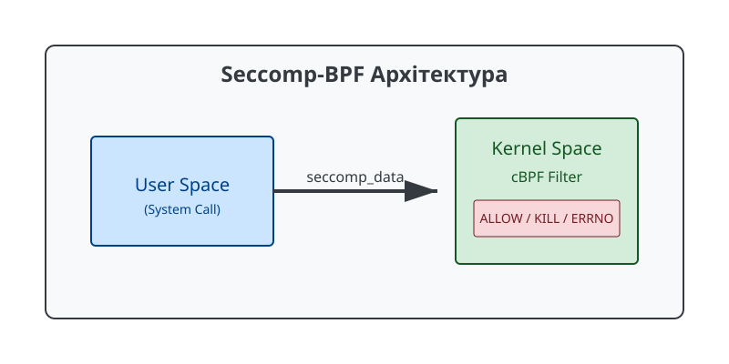

# Фільтрація системних викликів Seccomp-BPF

<preknowlist>
- [Концепції ядра Linux](book:unix-linux/processes/kernel-and-userspace) — базові поняття системних викликів та VFS.
</preknowlist>

## 1. Вступ до Secure Computing Mode (seccomp)

Сучасні операційні системи на базі ядра Linux пропонують розмаїття механізмів безпеки для обмеження привілеїв та ізоляції процесів. Одним із найважливіших механізмів є **seccomp** (Secure Computing Mode). Запроваджений у ядрі Linux ще у версії 2.6.12 (2005 рік), початково seccomp мав дуже обмежений функціонал: він дозволяв процесу здійснювати лише чотири системні виклики (`read`, `write`, `_exit`, та `sigreturn`). Цей режим відомий як **Strict Mode**. Якщо процес намагався здійснити будь-який інший системний виклик, ядро негайно завершувало його роботу, надсилаючи сигнал `SIGKILL`. Хоча цей режим був корисним для деяких вузькоспеціалізованих завдань обчислень (наприклад, для рендерингу або обробки аудіо/відео у воркерах), він був занадто суворим для більшості реальних застосунків.

З часом з'явилася потреба у більш гнучкому підході. У 2012 році в ядрі Linux 3.5 з'явилося значне розширення механізму — **seccomp-bpf** (або seccomp Filter Mode). Замість жорстко заданого списку з чотирьох викликів, seccomp-bpf дозволив процесам встановлювати спеціальні фільтри для перевірки всіх системних викликів, які вони роблять. Ці фільтри базуються на архітектурі **BPF** (Berkeley Packet Filter), яка спочатку була розроблена для фільтрації мережевих пакетів (наприклад, у `tcpdump`). У контексті seccomp, "пакетом", який аналізує BPF, є інформація про системний виклик та його аргументи.

Завдяки seccomp-bpf розробники отримали можливість створювати детальні "білі" або "чорні" списки системних викликів, а також перевіряти конкретні значення аргументів викликів (тільки за значенням, але не переходити за вказівниками). Це стало наріжним каменем у розвитку контейнерних технологій, таких як Docker, Kubernetes, containerd, а також пісочниць у веб-браузерах (Chrome, Firefox).



## 2. Режими роботи: SECCOMP_MODE_STRICT та SECCOMP_MODE_FILTER

Як було зазначено, seccomp може працювати у двох основних режимах. Вони активуються за допомогою системного виклику `prctl(PR_SET_SECCOMP, mode, ...)` або спеціалізованого системного виклику `seccomp(SECCOMP_SET_MODE_FILTER, flags, &prog)`.

### 2.1 SECCOMP_MODE_STRICT
У цьому режимі процес може виконувати лише `read(2)`, `write(2)`, `_exit(2)` та `rt_sigreturn(2)`.

:::tabs
== C

```c
#include <sys/prctl.h>
#include <linux/seccomp.h>
#include <unistd.h>
#include <stdio.h>

int main() {
    // Вмикаємо строгий режим
    if (prctl(PR_SET_SECCOMP, SECCOMP_MODE_STRICT) == -1) {
        perror("prctl");
        return 1;
    }
    
    // Цей виклик write() дозволений
    write(1, "Strict mode activated!
", 23);
    
    // Наступний виклик (getpid) не входить до списку дозволених,
    // тому ядро негайно вб'є процес через SIGKILL.
    pid_t pid = getpid();
    
    return 0; // До цієї лінії виконання ніколи не дійде
}
```

== Go

```go
package main

import (
	"fmt"
	"golang.org/x/sys/unix"
	"os"
)

func main() {
	// Вмикаємо строгий режим
	err := unix.Prctl(unix.PR_SET_SECCOMP, unix.SECCOMP_MODE_STRICT, 0, 0, 0)
	if err != nil {
		fmt.Println("prctl error:", err)
		os.Exit(1)
	}

	// Виклик write() дозволений
	unix.Write(1, []byte("Strict mode activated!
"))

	// Наступний виклик (getpid) призведе до SIGKILL.
	unix.Getpid()
}
```
:::
Суворий режим залишається в ядрі з міркувань зворотної сумісності та для специфічних вузьких задач, де програмі потрібні лише потоки введення-виведення.

### 2.2 SECCOMP_MODE_FILTER
Це розширений режим, який дозволяє завантажити програму BPF. Ця програма буде виконуватися ядром кожного разу, коли процес (або його нащадки) намагається зробити системний виклик. За результатами виконання цієї програми ядро ухвалює рішення: дозволити виклик, відмовити з помилкою, надіслати сигнал, або повністю вбити процес.

Для використання цього режиму процес повинен мати привілей `CAP_SYS_ADMIN`, або перед встановленням фільтра він має встановити прапорець `PR_SET_NO_NEW_PRIVS`. Цей прапорець гарантує, що процес (і його діти) не зможе отримати нові привілеї під час виконання, наприклад, через запуск `setuid` або `setgid` програм. Це ключова вимога безпеки: без неї недоброзичливий процес міг би встановити фільтр, який маніпулює викликами привілейованої `setuid` програми (наприклад, `sudo` чи `su`), щоб обійти перевірки або змусити її працювати некоректно, що могло б призвести до ескалації привілеїв.

```c
#include <sys/prctl.h>
#include <linux/seccomp.h>

// Спочатку потрібно вимкнути отримання нових привілеїв
prctl(PR_SET_NO_NEW_PRIVS, 1, 0, 0, 0);

// Після цього можна встановлювати фільтр
// prctl(PR_SET_SECCOMP, SECCOMP_MODE_FILTER, &prog);
```

## 3. Структура `seccomp_data`

Коли процес робить системний виклик, ядро формує структуру `seccomp_data` та передає її BPF-програмі. Ця структура містить базову інформацію про виклик і слугує "пакетом даних" для BPF. Структура визначена в `<linux/seccomp.h>`:

```c
struct seccomp_data {
    int   nr;                   /* Номер системного виклику */
    __u32 arch;                 /* Архітектура процесора (наприклад, AUDIT_ARCH_X86_64) */
    __u64 instruction_pointer;  /* Вказівник на інструкцію, що викликала syscall */
    __u64 args[6];              /* Аргументи системного виклику (максимум 6) */
};
```

Детальний аналіз полів:
1. **`nr`**: Номер системного виклику, який відповідає архітектурі системи (наприклад, у x86_64 системний виклик `read` має номер 0, `write` — 1, `open` — 2). Ці номери можна знайти у файлах заголовків, таких як `<asm/unistd.h>`.
2. **`arch`**: Значення, що ідентифікує архітектуру (з `<linux/audit.h>`). Це поле є критично важливим. Один і той самий номер системного виклику `nr` може мати різне значення і різну дію на різних архітектурах (наприклад, x86_64 vs x86_32/i386). Зловмисник міг би обійти фільтри x86_64, зробивши 32-бітний системний виклик на 64-бітній системі, якщо BPF фільтр не перевіряє архітектуру. Тому будь-який надійний seccomp-фільтр завжди починається з перевірки `arch`.
3. **`instruction_pointer`**: Адреса інструкції у просторі користувача, яка спричинила системний виклик (наприклад, інструкція `syscall` на x86_64). Зазвичай не використовується у звичайних фільтрах, але може бути корисною для специфічного профілювання або дебаггінгу.
4. **`args[6]`**: Масив із шести 64-бітних значень, які представляють аргументи системного виклику. Важливо розуміти, що seccomp дозволяє перевіряти лише ці значення як є (pass-by-value). Якщо аргумент є вказівником на структуру або рядок (як у `open(const char *pathname, int flags)`), seccomp BPF не може розіменувати цей вказівник і прочитати значення (наприклад, ім'я файлу). Це архітектурне обмеження зроблено для запобігання стану гонитви типу *TOCTOU (Time-Of-Check to Time-Of-Use)*, де значення у пам'яті користувача могло б змінитися після перевірки фільтром, але до фактичного використання ядром. Тому за допомогою seccomp не можна написати правило "дозволити `open` тільки для файлу `/etc/passwd`". Можна лише дозволити `open` взагалі або перевірити числові аргументи (наприклад, дозволити `mmap` лише з певними прапорцями).

## 4. Класичний BPF (cBPF) та написання фільтрів

Незважаючи на стрімкий розвиток eBPF (Extended BPF), seccomp використовує cBPF (Classic BPF) для фільтрації, хоча сучасні ядра транслюють cBPF в eBPF для виконання JIT-компілятором.

Програма cBPF — це масив інструкцій `struct sock_filter`. Кожна інструкція складається з коду операції, умовних переходів та операндів:

```c
struct sock_filter {
    __u16 code;  /* Код інструкції */
    __u8  jt;    /* Зміщення переходу при TRUE (Jump True) */
    __u8  jf;    /* Зміщення переходу при FALSE (Jump False) */
    __u32 k;     /* Загальне 32-бітне поле операнда */
};
```

Фільтр cBPF виконується на віртуальній машині з одним 32-бітним акумулятором (A) та одним індексним регістром (X). Хоча написання інструкцій BPF вручну за допомогою шістнадцяткових кодів можливе, розробники ядра надають зручні макроси у `<linux/bpf_common.h>` та `<linux/filter.h>`.

Основні операції BPF включають:
- `BPF_LD` (завантаження даних у регістр A)
- `BPF_CMP` (порівняння)
- `BPF_JMP` (умовний або безумовний перехід)
- `BPF_RET` (повернення результату)

### 4.1 Приклад BPF-програми на С

Розглянемо приклад, який дозволяє лише виклики `read`, `write`, `exit`, та `exit_group`, а всі інші — відхиляє.

```c
#include <stdio.h>
#include <stdlib.h>
#include <unistd.h>
#include <linux/audit.h>
#include <linux/filter.h>
#include <linux/seccomp.h>
#include <sys/prctl.h>
#include <sys/syscall.h>

#define syscall_nr (offsetof(struct seccomp_data, nr))
#define arch_nr (offsetof(struct seccomp_data, arch))

int main() {
    // 1. Створюємо BPF програму (масив інструкцій)
    struct sock_filter filter[] = {
        // [1] Завантажити номер архітектури у регістр A
        BPF_STMT(BPF_LD | BPF_W | BPF_ABS, arch_nr),
        
        // [2] Перевірити, чи це x86_64 (AUDIT_ARCH_X86_64). 
        // Якщо ТАК (jt=0, переходимо до наступної інструкції).
        // Якщо НІ (jf=4, перестрибнути 4 інструкції вниз, до KILL).
        BPF_JUMP(BPF_JMP | BPF_JEQ | BPF_K, AUDIT_ARCH_X86_64, 0, 4),
        
        // [3] Завантажити номер системного виклику (syscall_nr) у регістр A
        BPF_STMT(BPF_LD | BPF_W | BPF_ABS, syscall_nr),
        
        // [4] Якщо syscall == __NR_read, перестрибнути до ALLOW (на 3 інструкції вниз)
        BPF_JUMP(BPF_JMP | BPF_JEQ | BPF_K, __NR_read, 3, 0),
        // [5] Якщо syscall == __NR_write, перестрибнути до ALLOW (на 2 інструкції вниз)
        BPF_JUMP(BPF_JMP | BPF_JEQ | BPF_K, __NR_write, 2, 0),
        // [6] Якщо syscall == __NR_exit, перестрибнути до ALLOW (на 1 інструкцію вниз)
        BPF_JUMP(BPF_JMP | BPF_JEQ | BPF_K, __NR_exit, 1, 0),
        // [7] Якщо syscall == __NR_exit_group, перейти до ALLOW (на 0 інструкцій вниз)
        BPF_JUMP(BPF_JMP | BPF_JEQ | BPF_K, __NR_exit_group, 0, 1),
        
        // [8] SECCOMP_RET_ALLOW - дозволяємо виклик
        BPF_STMT(BPF_RET | BPF_K, SECCOMP_RET_ALLOW),
        
        // [9] SECCOMP_RET_KILL_PROCESS - вбиваємо процес для всіх інших викликів
        BPF_STMT(BPF_RET | BPF_K, SECCOMP_RET_KILL_PROCESS)
    };

    // Структура для завантаження програми
    struct sock_fprog prog = {
        .len = (unsigned short)(sizeof(filter) / sizeof(filter[0])),
        .filter = filter,
    };

    // Вмикаємо NO_NEW_PRIVS
    if (prctl(PR_SET_NO_NEW_PRIVS, 1, 0, 0, 0)) {
        perror("prctl(NO_NEW_PRIVS)");
        exit(1);
    }

    // Застосовуємо фільтр
    if (prctl(PR_SET_SECCOMP, SECCOMP_MODE_FILTER, &prog)) {
        perror("prctl(SECCOMP)");
        exit(1);
    }

    // Тестування
    printf("Фільтр застосовано успішно!\n");
    
    // Цей виклик (getpid) призведе до завершення процесу через SIGSYS,
    // тому що getpid не входить у наш білий список.
    pid_t p = getpid();
    printf("Мій PID: %d\n", p);

    return 0;
}
```

У наведеному коді макрос `BPF_STMT` створює одну BPF-інструкцію, а `BPF_JUMP` — інструкцію з розгалуженням. Останнім кроком є виклик BPF_RET зі значенням коду результату.

## 5. Дії при порушенні (Return Values)

Коли фільтр BPF завершує свою роботу, він повертає 32-бітне значення. Найстарші 16 біт визначають дію, яку ядро має застосувати (`SECCOMP_RET_ACTION`), а наймолодші 16 біт (`SECCOMP_RET_DATA`) можуть містити додаткові дані (наприклад, номер помилки).

Доступні дії, відсортовані від найжорсткішої до найм'якшої:

1. **`SECCOMP_RET_KILL_PROCESS` (з Linux 4.14)**: Негайно вбиває весь процес і всі його потоки. Процес завершується з сигналом `SIGSYS`.
2. **`SECCOMP_RET_KILL_THREAD` (або просто `SECCOMP_RET_KILL`)**: Негайно вбиває лише той потік (thread), який зробив недозволений системний виклик. Інші потоки процесу продовжують працювати (що може призвести до нестабільної роботи).
3. **`SECCOMP_RET_TRAP`**: Ядро надсилає потоку сигнал `SIGSYS` (Bad system call). Процес може встановити обробник для цього сигналу, щоб зібрати інформацію про помилку (обробник отримає структуру `siginfo_t`, яка містить номер виклику і архітектуру).
4. **`SECCOMP_RET_ERRNO`**: Системний виклик взагалі не виконується (ядро його блокує), але процес не вбивається. Замість цього, системний виклик миттєво повертає помилку `-1`, а змінна `errno` встановлюється у значення, передане в нижніх 16 бітах. Це дуже корисно для м'якого відключення фіч. Наприклад, можна повернути `EPERM` (Operation not permitted) або `ENOSYS` (Function not implemented).
5. **`SECCOMP_RET_TRACE`**: Якщо процес відстежується через `ptrace` (наприклад, `strace` або `gdb`), ядро зупинить потік і повідомить tracer (через `PTRACE_O_TRACESECCOMP`), що системний виклик був перехоплений. Якщо процес не відстежується, виклик поверне помилку `ENOSYS`.
6. **`SECCOMP_RET_LOG` (з Linux 4.14)**: Системний виклик дозволяється і виконується нормально, але подія записується у системний журнал (audit log, зазвичай у `/var/log/audit/audit.log` або `dmesg`). Ідеально для режиму навчання/дебаггінгу, щоб зрозуміти, які виклики робить програма, не ламаючи її.
7. **`SECCOMP_RET_USER_NOTIF` (з Linux 5.0)**: Передає обробку системного виклику в простір користувача (через спеціальний файловий дескриптор сповіщень). Інший процес (наприклад, менеджер контейнерів) отримує сповіщення про спробу виклику, може перевірити додаткові умови (навіть розіменувати вказівники), виконати виклик від імені контейнера, і повернути результат. Це дозволяє реалізувати складні політики, які неможливо зробити лише засобами BPF (наприклад, дозволити `mount` лише для певного шляху).
8. **`SECCOMP_RET_ALLOW`**: Повний дозвіл. Системний виклик передається до звичайного механізму обробки ядра без обмежень.

Приоритет: якщо до процесу застосовано кілька фільтрів (викликаючи prctl(SECCOMP) декілька разів, фільтри складаються у ланцюжок), ядро виконує всі фільтри. Остаточною дією буде найжорсткіша (найсуворіша) з усіх дій, повернутих усіма фільтрами. Наприклад, якщо один фільтр повертає `ALLOW`, а інший `KILL`, виклик буде вбито.

## 6. Високорівнева бібліотека `libseccomp`

Написання сирих BPF інструкцій є нудним, вразливим до помилок і складним для підтримки, особливо коли йдеться про розв'язання проблеми сумісності архітектур, правильну адресацію аргументів та little/big-endian систем.

Щоб абстрагувати цю складність, Пол Мур (Paul Moore) та інші розробники створили бібліотеку `libseccomp`. Ця C-бібліотека надає високорівневий API для побудови правил, які вона потім самостійно компілює у BPF байт-код і завантажує в ядро.

Приклад з `libseccomp`:

```c
#include <seccomp.h>
#include <stdio.h>
#include <unistd.h>
#include <stdlib.h>

int main() {
    // Ініціалізуємо контекст: за замовчуванням вбиваємо процес для всіх викликів
    scmp_filter_ctx ctx = seccomp_init(SCMP_ACT_KILL);
    if (ctx == NULL) {
        return 1;
    }

    // Додаємо дозволи (білий список)
    seccomp_rule_add(ctx, SCMP_ACT_ALLOW, SCMP_SYS(read), 0);
    seccomp_rule_add(ctx, SCMP_ACT_ALLOW, SCMP_SYS(write), 0);
    seccomp_rule_add(ctx, SCMP_ACT_ALLOW, SCMP_SYS(exit_group), 0);
    seccomp_rule_add(ctx, SCMP_ACT_ALLOW, SCMP_SYS(brk), 0);
    
    // Додаємо виклик openat, але тільки якщо певні прапорці не використовуються
    // (складні перевірки аргументів)
    
    // Завантажуємо фільтр у ядро
    if (seccomp_load(ctx) < 0) {
        seccomp_release(ctx);
        return 1;
    }

    seccomp_release(ctx);

    printf("Seccomp встановлено через libseccomp!\n");
    // getpid() призведе до SIGSYS
    pid_t pid = getpid();
    return 0;
}
```

Для компіляції такого коду потрібно встановити пакет `libseccomp-dev` і лінкувати з `-lseccomp`:
`gcc -o seccomp_test seccomp_test.c -lseccomp`

## 7. Використання Seccomp-BPF у контейнерах (Docker/containerd)

Одне з наймасовіших застосувань seccomp сьогодні — це ізоляція контейнерів. Контейнери (на відміну від віртуальних машин) спільно використовують єдине ядро хост-системи. Якщо процес всередині контейнера знайде вразливість у системному виклику ядра (наприклад, експлойт у специфічному мережевому протоколі або драйвері), він зможе зламати всю хост-систему і отримати доступ до інших контейнерів.

Щоб зменшити площу атаки (attack surface), Docker (через runc і containerd) за замовчуванням застосовує власний seccomp-профіль до кожного контейнера.

### 7.1 Профіль Docker за замовчуванням
Стандартний seccomp-профіль Docker створений як "білий список" з розширеннями. За замовчуванням ядро Linux має близько 300+ системних викликів. Docker дозволяє більшість стандартних, але блокує близько 44 викликів, які вважаються небезпечними або непотрібними у звичайних веб-додатках.

Ключові заблоковані виклики (дія `SECCOMP_RET_ERRNO` зі значенням `EPERM`):
- `mount`, `umount2` — заборона монтування файлових систем всередині контейнера (попереджає втечу через монтування proc/sys).
- `kexec_load` — заборона завантаження нового ядра.
- `bpf` — заборона виконання команд BPF зсередини контейнера (щоб контейнер сам не модифікував eBPF програми ядра).
- `ptrace` — відстеження процесів за замовчуванням вимкнено (тому `strace` в контейнері зазвичай каже "Operation not permitted", якщо не додати `--cap-add=SYS_PTRACE`).
- `userfaultfd` — блокується, оскільки часто використовувався в експлойтах типу use-after-free.
- `clone` (з прапорцем `CLONE_NEWUSER`) — обмеження на створення нових просторів імен користувачів (user namespaces).

### 7.2 Перевизначення профілю
Користувачі можуть застосовувати власні JSON-профілі seccomp при запуску контейнерів. Це дозволяє ще більше затягнути гайки для мікросервісів. Наприклад, якщо ваш сервіс на Nginx робить лише `read`, `write`, `epoll_wait`, `accept`, та `sendfile`, ви можете заборонити всі інші виклики.

Запуск контейнера зі своїм профілем:
```bash
docker run --rm -it --security-opt seccomp=/path/to/profile.json alpine sh
```

Структура JSON-профілю Docker:
```json
{
  "defaultAction": "SCMP_ACT_ERRNO",
  "architectures": [
    "SCMP_ARCH_X86_64",
    "SCMP_ARCH_AARCH64"
  ],
  "syscalls": [
    {
      "names": [
        "read", "write", "openat", "close", "exit_group"
      ],
      "action": "SCMP_ACT_ALLOW",
      "args": [],
      "includes": {}
    }
  ]
}
```

Щоб тимчасово вимкнути seccomp для контейнера (наприклад, для складного дебаггінгу за допомогою `perf` або `strace`), можна використовувати `unconfined`:
```bash
docker run --rm -it --security-opt seccomp=unconfined ubuntu bash
```
*(Примітка: вимикати seccomp у продакшені категорично не рекомендується)*

## 8. Продуктивність та накладні витрати (Performance Implications)

Хоча seccomp-bpf є відносно легковаговим механізмом, він все одно додає накладні витрати.
Оскільки програма BPF виконується при кожному системному виклику, погано написаний, довгий або неефективний фільтр може помітно знизити продуктивність програм з інтенсивним I/O.

Як оптимізувати фільтри BPF:
1. **Зменшення гілок (Branching)**: Оскільки BPF не має глибокого передбачення розгалужень (branch prediction), як сучасні процесори, велика кількість if/else для кожного системного виклику уповільнює роботу.
2. **Часті виклики на початку**: Якщо програма часто використовує `read` та `write` (або `epoll_pwait`), перевірка цих номерів викликів повинна бути на самому початку BPF графа. Чим швидше фільтр поверне `ALLOW` для найчастіших викликів, тим менший overhead. Бібліотека `libseccomp` та Docker намагаються автоматично сортувати правила або будувати збалансовані бінарні дерева для швидкого пошуку (`O(log N)`).
3. **Обмеження глибини**: JIT компілятор в ядрі перетворює cBPF на машинний код. Але навіть JIT-код займає ресурси процесора на виконання. Коротші BPF скрипти працюють швидше.

## 9. Дебаггінг та аудит фільтрів Seccomp

Найбільший головний біль при роботі з seccomp — дізнатися, **який саме** системний виклик був заблокований, особливо якщо ядро просто вбиває процес (`SECCOMP_RET_KILL`).

### 9.1 Використання SECCOMP_RET_LOG
Як згадувалося вище, найзручнішим способом розробки профілю є встановлення дії за замовчуванням `SECCOMP_RET_LOG` (якщо ядро >= 4.14). Процес продовжить роботу, але у `/var/log/audit/audit.log` будуть залишатися записи типу:
```
type=SECCOMP msg=audit(1620000000.123:456): auid=1000 uid=1000 gid=1000 ses=3 subj=unconfined pid=9876 comm="my_app" exe="/usr/bin/my_app" sig=0 arch=c000003e syscall=59 compat=0 ip=0x7ffff7a9b067 code=0x7ffc0000
```
Тут `syscall=59` означає виклик `execve` (на архітектурі x86_64, `arch=c000003e`).

### 9.2 Аналіз за допомогою strace
Якщо змінити код програми неможливо, але вона вбивається через seccomp, можна використати `strace`:
```bash
strace -f ./my_app
```
В кінці виводу `strace` ви побачите щось на кшталт:
```
...
socket(AF_INET, SOCK_STREAM, IPPROTO_TCP) = ?
+++ killed by SIGSYS (core dumped) +++
```
Це означає, що виклик `socket` не пройшов фільтр seccomp. 

Важливий нюанс: якщо фільтр повертає `SECCOMP_RET_ERRNO` з кодом помилки, `strace` покаже її так, ніби системний виклик виконався в ядрі і повернув помилку:
```
mkdir("/tmp/test", 0777) = -1 EPERM (Operation not permitted)
```
Це робить `strace` вкрай корисним для діагностики контейнерів.

### 9.3 Файлова система /proc
Можна перевірити стан seccomp для будь-якого запущеного процесу, прочитавши файл `/proc/[PID]/status`:
```bash
grep Seccomp /proc/$$/status
Seccomp:	2
Seccomp_filters:	1
```
Значення поля `Seccomp`:
- `0`: disabled
- `1`: strict mode
- `2`: filter mode (seccomp-bpf)

## 10. Підсумок

Seccomp-BPF є невід'ємною частиною сучасної екосистеми безпеки Linux. Перевівши контроль доступу від парадигми "все або нічого" (як у строгому seccomp) до мікрорівневої фільтрації на базі BPF, ядро Linux надало розробникам та адміністраторам потужний інструмент для реалізації принципу найменших привілеїв (Principle of Least Privilege). Незважаючи на появу нових технологій ізоляції, семантика блокування системних викликів на вході залишається надійним і перевіреним бар'єром проти експлуатації вразливостей (zero-days) у ядрі. Сучасні хмарні та контейнерні інфраструктури покладаються на seccomp-bpf як на перший рівень оборони в багатошаровій архітектурі безпеки.
