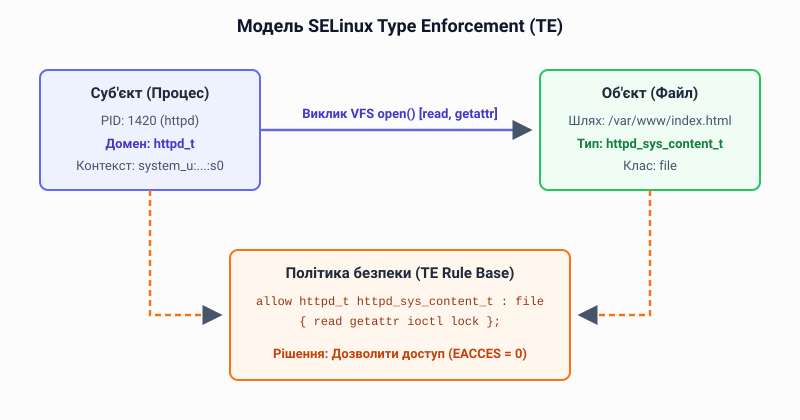
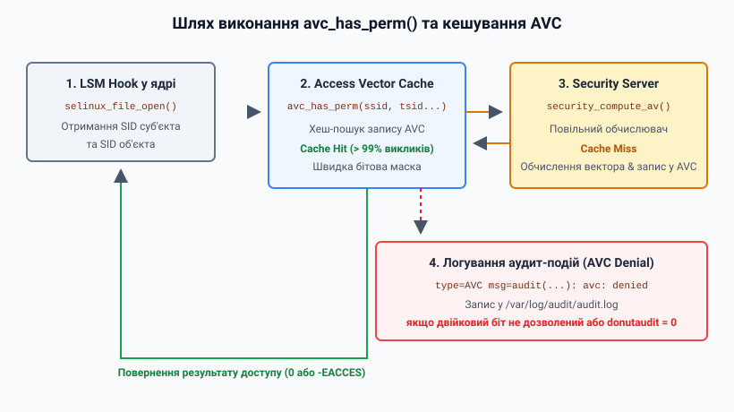

# SELinux: Type Enforcement та контексти безпеки

<preknowlist>
- [Концепції ядра Linux](book:unix-linux/kernel-and-userspace) — базові поняття системних викликів та VFS.
- [Біти прав і дискреційний доступ (POSIX DAC)](book:unix-linux/permission-bits) — класичні привілеї читання, запису та виконання для власника, групи та інших.
- [Розширені атрибути файлів (xattr) та атрибути безпеки VFS inode](book:unix-linux/acl-and-xattr) — збереження контекстів безпеки в інодах файлової системи.
</preknowlist>

Security-Enhanced Linux (SELinux) — це реалізація мандатного управління доступом (Mandatory Access Control, MAC) для ядра Linux, розроблена Агентством національної безпеки США (NSA) та спільнотою відкритого коду. На відміну від класичної моделі дискреційного управління доступом (Discretionary Access Control, DAC), де власник файлу може вільно визначати права доступу до нього, SELinux базується на суворих політиках, які визначають, які дії може виконувати кожен процес щодо кожного об'єкта в системі.

Цей розділ довідника детально розглядає основи SELinux, його ключову концепцію Type Enforcement (TE), контексти безпеки, кеш векторів доступу (Access Vector Cache, AVC), функцію `avc_has_perm()`, а також практичні аспекти управління SELinux за допомогою таких інструментів, як `semanage` та `restorecon`.

## 1. Архітектура SELinux та LSM

SELinux інтегрований у ядро Linux за допомогою фреймворку Linux Security Modules (LSM). LSM надає набір гачків (hooks) у ядрі, які викликаються безпосередньо перед тим, як ядро збирається надати доступ до внутрішнього об'єкта (наприклад, перед відкриттям файлу або створенням сокета).

Коли процес намагається виконати певну дію, відбувається таке:
1. Спочатку перевіряються стандартні права доступу DAC (читання, запис, виконання для власника, групи та інших). Якщо DAC відмовляє у доступі, дія одразу блокується.
2. Якщо DAC дозволяє доступ, викликається відповідний гачок LSM.
3. Модуль SELinux (через LSM) перевіряє свою політику безпеки, щоб з'ясувати, чи дозволена ця дія.
4. Якщо політика SELinux дозволяє дію, процес продовжує роботу; якщо ні — доступ забороняється (EACCES), і генерується повідомлення в аудит-лог.

Такий підхід означає, що SELinux може лише *обмежити* доступ, дозволений DAC, але не може надати доступ, який DAC забороняє. Глибший історичний контекст розділення обчислювача рішень політики та механізмів їх застосування висвітлює [історія архітектури FLASK](book:unix-linux/selinux-type-enforcement/hist-flask-architecture.md).

## 2. Контексти безпеки (Security Context)

Всі суб'єкти (процеси) та об'єкти (файли, сокети, порти) в системі з увімкненим SELinux мають мітку, яка називається **контекстом безпеки**.

### 2.1. User (Користувач SELinux)

Користувач SELinux — це сутність, яка авторизована в політиці. Користувачі SELinux не тотожні користувачам Linux (UID), хоча між ними існує мапінг (mapping). Один користувач SELinux може бути прив'язаний до кількох користувачів Linux. Наприклад, стандартний непривілейований користувач зазвичай зіставляється з `unconfined_u` або `user_u`.

### 2.2. Role (Роль)

Роль використовується в Role-Based Access Control (RBAC). У SELinux ролі виступають проміжним шаром між користувачами та типами. Користувач авторизується для використання певних ролей, а ролі авторизуються для доступу до певних типів (доменів). Для процесів роль зазвичай має значення `system_r` (для системних демонів) або `unconfined_r` (для звичайних користувачів), а для файлів використовується роль `object_r`.

### 2.3. Type (Тип) / Domain (Домен)

Це найважливіше поле в моделі Type Enforcement (TE).
- Коли тип застосовується до процесу, він називається **доменом** (domain). Домен визначає, які привілеї має процес.
- Коли тип застосовується до об'єкта (наприклад, файлу), він так і називається **типом** (type).

Більшість політик SELinux будуються саме навколо типів, тому ця модель називається Type Enforcement.

### 2.4. Sensitivity (Чутливість) та Category (Категорія)

Ці поля використовуються в Multi-Level Security (MLS) та Multi-Category Security (MCS). Чутливість визначає рівень секретності (наприклад, `s0`, `s1`, `s2`), а категорія використовується для розмежування доступу на одному рівні (наприклад, `c0`, `c1`, `c2`). У типовій системі з політикою `targeted` використовується один рівень `s0` та категорії для ізоляції (наприклад, ізоляція контейнерів через sVirt або Docker).

Поєднання цих полів формує рядкове представлення контексту безпеки:

`user:role:type:sensitivity[:category]`

Приклад контексту файлу конфігурації вебсервера:
`system_u:object_r:httpd_config_t:s0`

Приклад контексту процесу вебсервера:
`system_u:system_r:httpd_t:s0`

## 3. Type Enforcement (TE)

Type Enforcement — це основа політики безпеки SELinux. Ідея TE полягає в тому, що доступ до об'єкта надається на основі домену процесу (суб'єкта) та типу об'єкта.

*Архітектура Type Enforcement у SELinux*

За замовчуванням у SELinux **все заборонено**. Доступ надається лише тоді, коли в політиці існує явне правило `allow`.

### 3.1. Синтаксис правил `allow`

Головне правило Type Enforcement описує дозволений вектор доступу між джерелом та ціллю і будується на чотирьох складових елементах:

- `source_type`: Домен процесу, який намагається виконати дію.
- `target_type`: Тип об'єкта, до якого здійснюється доступ.
- `object_class`: Клас об'єкта (наприклад, `file`, `dir`, `tcp_socket`).
- `permission_set`: Набір дозволених дій (наприклад, `read`, `write`, `execute`).

Об'єднання цих складових елементів формує синтаксичний рядок правила `allow`:

`allow source_type target_type : object_class permission_set;`

Приклад:
`allow httpd_t httpd_sys_content_t : file { read getattr };`

Це правило означає: дозволити процесам з доменом `httpd_t` (вебсервер) виконувати операції `read` та `getattr` (отримання метаданих) над файлами (клас `file`), які мають тип `httpd_sys_content_t` (вміст вебсайту).

Якщо вебсервер спробує записати дані у файл з типом `httpd_sys_content_t`, дія буде заблокована (якщо немає іншого правила `allow`), оскільки дозвіл `write` не вказано.

### 3.2. Переходи типів (Type Transitions)

SELinux також керує тим, як процеси змінюють свої домени (наприклад, під час запуску програми) та які типи призначаються новим файлам.
- **Process Transition**: Наприклад, коли ініціалізаційний процес (з доменом `init_t`) запускає файл вебсервера (з типом `httpd_exec_t`), новий процес вебсервера має отримати домен `httpd_t`. Для цього в політиці має бути правило `type_transition`.
- **File Transition**: За замовчуванням новостворений файл успадковує тип каталогу, у якому його створено: файл, який процес `httpd_t` створює в каталозі типу `httpd_log_t`, теж дістане тип `httpd_log_t` — жодного правила для цього не потрібно. Правило `type_transition httpd_t httpd_log_t : file mydaemon_log_t;` навпаки, перекриває це успадкування й призначає новому файлові інший тип.

Практичні кроки зі створення власного домену та правила переходу викладені у матеріалі [розробка модуля політики TE](book:unix-linux/selinux-type-enforcement/proj-te-policy-module.md).

## 4. Access Vector Cache (AVC) та `avc_has_perm()`

Оскільки перевірка кожного звернення до файлу або сокета через складні структури політик була б надто повільною, SELinux використовує механізм кешування, який називається **Access Vector Cache (AVC)**.

*Шлях перевірки дозволу через AVC кеш*

Коли ядро (через LSM hook) потребує перевірити дозвіл, воно викликає функцію `avc_has_perm()`. Ця функція працює так:

1. Отримує Security Identifier (SID) суб'єкта (процесу) та об'єкта. SID — це цілочисельний ідентифікатор, який ядро використовує замість довгого рядкового контексту для оптимізації.
2. `avc_has_perm()` шукає в AVC кеші запис для цієї пари SID та класу об'єкта.
3. Якщо запис знайдено (cache hit), функція швидко повертає результат (дозволити або заборонити).
4. Якщо запису немає (cache miss), запит передається до **Security Server** (компонента SELinux всередині ядра), який обчислює вектор доступу на основі завантаженої політики, повертає результат до AVC (де він кешується) і до функції.

Повідомлення про заборону доступу (denials) часто називаються повідомленнями AVC і потрапляють в системний журнал (зазвичай `/var/log/audit/audit.log`). Вони виглядають приблизно так:

`type=AVC msg=audit(1633000000.123:456): avc:  denied  { read } for  pid=1234 comm="httpd" name="index.html" dev="sda1" ino=98765 scontext=system_u:system_r:httpd_t:s0 tcontext=unconfined_u:object_r:user_home_t:s0 tclass=file permissive=0`

У цьому прикладі процесу `httpd_t` було відмовлено в читанні файлу з типом `user_home_t`.

## 5. Targeted Policy (Цільова політика)

Історично SELinux був настільки суворим, що його було важко використовувати на звичайних системах (всі процеси обмежувалися). Тому в сучасних дистрибутивах (Red Hat, Fedora, CentOS) за замовчуванням використовується політика **Targeted**.

У політиці Targeted:
- Лише певні "цільові" демони (наприклад, `httpd`, `named`, `dhcpd`) обмежені суворими правилами SELinux (вони працюють у своїх власних доменах, як `httpd_t`).
- Більшість інших процесів, включаючи програми користувача, працюють у домені `unconfined_t`. Процеси в цьому домені практично не обмежуються Type Enforcement (вони покладаються лише на DAC).

Це робить SELinux значно зручнішим, оскільки він захищає критичні мережеві сервіси, не порушуючи звичну роботу користувача.

## 6. Управління SELinux: `semanage` та `restorecon`

Для адміністраторів важливо розуміти, як керувати контекстами SELinux, особливо коли файли переміщуються або створюються нові сервіси. Для низькорівневого маніпулювання параметрами та моніторингу стану безпосередньо через віртуальну файлову систему ядра використовується [системний інтерфейс selinuxfs](book:unix-linux/selinux-type-enforcement/api-selinuxfs-interface.md).

### 6.1. semanage

Утиліта `semanage` використовується для зміни конфігурації системної бази даних політики SELinux. Одним із найпоширеніших застосувань є налаштування правил відповідності файлових контекстів (file context mapping) в системній базі даних.

Приклад: ви хочете розмістити файли вебсайту в `/srv/www` замість стандартного `/var/www/html`.
1. Додаємо правило до політики:
   `semanage fcontext -a -t httpd_sys_content_t "/srv/www(/.*)?"`
   Це вказує системі, що всі файли в `/srv/www` повинні мати тип `httpd_sys_content_t`.
2. Застосовуємо правило:
   Сам `semanage` не змінює контексти існуючих файлів, він лише оновлює базу даних. Для застосування використовується `restorecon`.

Інше застосування `semanage` — керування портами:
`semanage port -a -t httpd_port_t -p tcp 8080` (дозволити вебсерверу слухати на нестандартному порту 8080).

### 6.2. restorecon та точкова зміна через chcon

Утиліта `restorecon` читає системну базу даних контекстів файлів (оновлену пакетами або за допомогою `semanage fcontext`) і застосовує ці контексти до файлів на диску:

`restorecon -R -v /srv/www`

Під час виконання `restorecon` або глобального релабелінгу системи (relabel) розширені атрибути файлів звіряються з еталоном у базі даних і відновлюються до правильних значень. Ця команда рекурсивно (`-R`) відновить (restore) правильні контексти для всіх файлів у `/srv/www` та покаже змінені файли (`-v`).

У разі потреби виконати тимчасову або точкову зміну контексту файла без внесення змін до системної бази даних політики використовується утиліта `chcon`:

`chcon -t httpd_sys_content_t /srv/mywebsite/index.html`

**Пастка:** Оскільки `chcon` записує новий контекст безпосередньо в розширений атрибут `security.selinux` самого файла, не чіпаючи бази даних політики, ця зміна є тимчасовою: наступний прохід `restorecon` або релабелінг файлової системи скине контекст до значення з бази даних.

## 7. Траблшутинг та логування

Найкращий спосіб розв'язання проблем із SELinux — перегляд логів та використання утиліт `audit2why` і `audit2allow`.

- Перевірка логів: `grep AVC /var/log/audit/audit.log`
- Аналіз причини: `cat /var/log/audit/audit.log | audit2why`
  Ця утиліта підкаже, чому доступ було заблоковано (наприклад, файл має неправильний контекст, або потрібно увімкнути певний булевий перемикач (boolean)).
- Створення власних правил (якщо це дійсно необхідно): `cat /var/log/audit/audit.log | audit2allow -M mypol; semodule -i mypol.pp`

## Висновок

SELinux та його модель Type Enforcement забезпечують надзвичайно детальний та глибокий рівень безпеки для систем Linux. Завдяки розумінню контекстів безпеки, взаємодії між суб'єктами та об'єктами через правила `allow`, а також правильному використанню таких інструментів, як `semanage` і `restorecon`, адміністратори можуть ефективно захищати системи від вразливостей, ізолюючи сервіси та мінімізуючи наслідки потенційних зламів.
