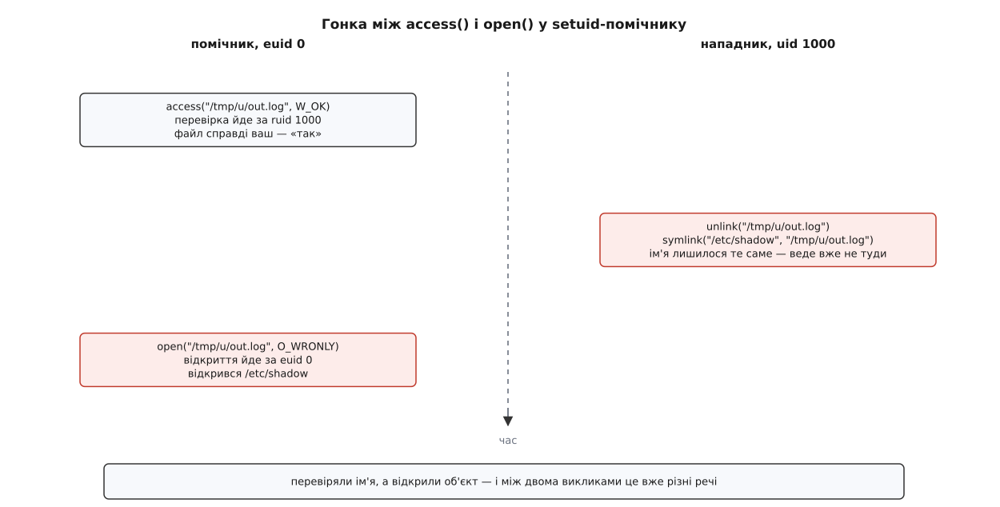

# ⚙️ Скелет setuid-помічника: перші рядки, до всякої корисної роботи

Маленька програма з бітом `s`, показана цілком — і цінна тут не корисна дія, яка займає три рядки, а два десятки рядків перед нею. Саме вони перетворюють процес, що дістався у спадок невідомо від кого, на процес, про який узагалі можна щось стверджувати.

## Задача

На машині без `logind` яскравість панелі міняється записом числа у файл [sysfs](book:unix-linux/sysfs-device-model) — скажімо, `/sys/class/backlight/intel_backlight/brightness`. Файл належить root, роздавати права окремим людям sysfs не вміє, а крутити яскравість має право кожен, хто сидить за цим екраном. Отже, потрібен помічник: `setbright 1200`.

## Ідея

Помічник ставлять `chown root:video` і `chmod 4750`. Група тут не дає жодного привілею — вона лише перелік тих, кому ядро взагалі дозволить запуск; це найдешевша половина політики, і вона діє ще до першої інструкції програми.

Далі важить порядок. Заради самої корисної дії потрібен рівно **один** виклик із правами root — `open` того файлу; усе решта (розібрати число, звірити з межею, записати) чудово робиться без жодних прав. Привілей знадобиться ще раз тільки в підготовці: підняти назад `RLIMIT_FSIZE`, зрізаний тим, хто запускав, теж можна лише поки права є — тому цей блок і стоїть до зниження. Тож будуємо програму так: спершу приводимо успадкований стан до відомого, потім робимо ту єдину привілейовану дію, одразу після неї знімаємо права остаточно — і лише тоді беремося за аргументи. Найризикованіший код, розбір чужого рядка, виконується вже без привілею; перевіряти його як привілейований більше не треба.

```c
/* setbright.c — виставити яскравість панелі.
 *   cc -O2 -Wall -Wextra -o setbright setbright.c
 *   chown root:video setbright && chmod 4750 setbright
 */
#define _GNU_SOURCE
#include <dirent.h>
#include <errno.h>
#include <fcntl.h>
#include <grp.h>
#include <signal.h>
#include <stdio.h>
#include <stdlib.h>
#include <string.h>
#include <sys/resource.h>
#include <sys/syscall.h>
#include <unistd.h>

#define PANEL "/sys/class/backlight/intel_backlight/brightness"
#define LIMIT "/sys/class/backlight/intel_backlight/max_brightness"

static void die(const char *msg)
{
    write(2, msg, strlen(msg));
    write(2, "\n", 1);
    _exit(1);
}

/* 1. Дескриптори 0, 1, 2 мусять існувати ДО першого open() у програмі */
static void ensure_std_fds(void)
{
    for (int fd = 0; fd <= 2; fd++) {
        if (fcntl(fd, F_GETFD) != -1)
            continue;
        if (errno != EBADF || open("/dev/null", O_RDWR) != fd)
            _exit(1);
    }
}

/* 2. Усе, що вище 2, — чуже */
static void close_inherited(void)
{
#ifdef SYS_close_range
    if (syscall(SYS_close_range, 3u, ~0u, 0) == 0)   /* Linux 5.9+ */
        return;
#endif
    DIR *d = opendir("/proc/self/fd");
    if (!d)
        _exit(1);                     /* не знаємо спадку — не працюємо */

    int keep = dirfd(d);
    struct dirent *e;
    while ((e = readdir(d)) != NULL) {
        int fd = atoi(e->d_name);     /* "." і ".." дають 0 */
        if (fd > 2 && fd != keep)
            close(fd);
    }
    closedir(d);
}

/* 3. Решта успадкованого стану */
static void reset_inherited_state(void)
{
    clearenv();                       /* своє оточення, а не чуже почищене */

    sigset_t none;
    sigemptyset(&none);
    sigprocmask(SIG_SETMASK, &none, NULL);    /* маска переживає exec */

    struct rlimit unbound = { RLIM_INFINITY, RLIM_INFINITY };
    if (setrlimit(RLIMIT_FSIZE, &unbound) != 0)
        die("не зняти обмеження на розмір запису");

    if (chdir("/") != 0)
        die("немає доступу до /");
    umask(022);
}

/* 4. Зниження прав остаточне — і перевірене */
static void drop_privileges_forever(void)
{
    uid_t ru = getuid();
    gid_t rg = getgid();

    if (setgroups(0, NULL) != 0 ||
        setresgid(rg, rg, rg) != 0 ||
        setresuid(ru, ru, ru) != 0)
        die("зниження прав не вдалося");

    uid_t r, e, s;
    gid_t gr, ge, gs;
    if (getresuid(&r, &e, &s) != 0 || r != ru || e != ru || s != ru)
        die("права лишилися підвищеними");
    if (getresgid(&gr, &ge, &gs) != 0 || gr != rg || ge != rg || gs != rg)
        die("групові права лишилися підвищеними");
}

static long panel_max(void)
{
    char buf[32];
    int fd = open(LIMIT, O_RDONLY | O_CLOEXEC);
    if (fd < 0)
        die("немає max_brightness");
    ssize_t n = read(fd, buf, sizeof buf - 1);
    close(fd);
    if (n <= 0)
        die("порожній max_brightness");
    buf[n] = '\0';
    return strtol(buf, NULL, 10);
}

int main(int argc, char **argv)
{
    ensure_std_fds();
    close_inherited();
    reset_inherited_state();

    if (argc != 2)                    /* argc == 0 сюди теж не пройде */
        die("вжиток: setbright <рівень>");

    /* єдина дія, заради якої потрібен root */
    int panel = open(PANEL, O_WRONLY | O_CLOEXEC);
    if (panel < 0)
        die("панель недоступна");

    drop_privileges_forever();

    /* далі — жодних прав понад ті, що має той, хто викликав */
    char *end;
    errno = 0;
    long want = strtol(argv[1], &end, 10);
    if (errno != 0 || end == argv[1] || *end != '\0')
        die("рівень має бути числом");

    long max = panel_max();
    if (want < 1 || want > max)
        die("рівень поза межами панелі");

    char out[32];
    int len = snprintf(out, sizeof out, "%ld", want);
    if (write(panel, out, len) != len)
        die("запис не пройшов");
    return 0;
}
```

## Кожен блок окремо

**Три перші [дескриптори](book:unix-linux/file-descriptor).** Якщо `1` закритий, то перший же `open` у програмі поверне саме одиницю — і все, що вона потім вважає виводом, потече у файл панелі, а всі діагностичні повідомлення — у щось, що обрав нападник. POSIX дозволяє системі відкрити тут «якийсь файл», але не вимагає цього. У Linux дірку затикає не ядро, а бібліотека: glibc має `__libc_check_standard_fds()` (файл `csu/check_fds.c`), який відкриває `/dev/null` на порожні місця — але **лише** коли зведений прапорець `AT_SECURE`, тобто коли `exec` справді підняв права. Запустіть той самий помічник з-під root — прав не додалося, `AT_SECURE` нуль, перевірка не працює, а програма й далі виконується з повними правами. Три виклики `fcntl` закривають цю щілину назавжди й до того ж не залежать від libc.

**Чуже вище двійки.** Кожен успадкований дескриптор — це готовий доступ, який ви нізвідки не брали й нікому не показували: відкритий каталог, чужий сокет, файл, у який вам радо дозволять писати. Виклик `close_range(3, ~0U, 0)` закриває все зайве одним рухом; він з'явився в Linux 5.9 (2020, Christian Brauner), обгортка в glibc — з 2.34. Запасний шлях — обхід теки `/proc/self/fd` через [procfs](book:unix-linux/proc-filesystem), і саме він, а не звична петля `for (fd = 3; fd < sysconf(_SC_OPEN_MAX); fd++) close(fd);`. Петля хибна двічі: за великого ліміту вона робить мільйон марних викликів, а якщо той, хто запускав, спершу відкрив дескриптор із високим номером, а потім опустив [ліміт `RLIMIT_NOFILE`](book:unix-linux/resource-limits), відкритий дескриптор лишиться живий вище нової межі — і петля до нього просто не дійде.

Симетрична половина цієї ж думки — прапорець `O_CLOEXEC` на всьому, що помічник відкриває сам. Ми щойно відмовилися успадковувати чужі дескриптори; так само не можна віддавати свої, і найдорожчий тут саме `panel` — дескриптор кореневого файлу, відкритий іще з правами root. Без прапорця він переживе будь-який `exec`, і те, що запуститься далі, дістане повний доступ до панелі, ніколи його не питавши.

**Оточення будуємо, а не чистимо.** Список змінних, які щось означають, скласти неможливо: `PATH` веде дочірні команди, `IFS` колись різав рядок в оболонці, `TZ` і `LOCPATH` кажуть бібліотеці, які файли відкрити, а кожна нова бібліотека в програмі додає свої. Чорний список тут програє за визначенням — тому `clearenv()` і, якщо щось таки потрібне, `secure_getenv()` замість `getenv()` (glibc 2.17 і новіші: у безпечному режимі вона повертає `NULL`). Чистити треба рано: `setlocale`, `tzset` і решта читають оточення в мить першого виклику, і після нього чистити вже пізно.

**Ніякого `system()` і `popen()`.** Обидва запускають `/bin/sh` і віддають йому ваш рядок — а оболонка застосує до нього власні правила [розбору й підстановок](book:unix-linux/expansion-and-quoting), яких ви не писали. Коли помічникові справді треба щось запустити, це робиться без оболонки взагалі — явний абсолютний шлях, явний вектор аргументів, власне оточення ([огляд способів породження](book:unix-linux/spawn-alternatives)):

```c
static char *const ENVP[] = { "PATH=/usr/bin:/bin", NULL };
static char *const ARGS[] = { "fsck", "-p", "/dev/sda1", NULL };

execve("/usr/sbin/fsck", ARGS, ENVP);
die("не вдалося запустити fsck");
```

**Хто просить і що просить.** Єдиний надійний факт про того, хто викликав, — `getuid()`; жодне число, передане аргументом чи змінною оточення, доказом не є. Груба політика вже стоїть у режимі файлу (`4750`), і коли її не вистачає, це радше знак, що привілей узагалі має жити в окремій службі з [розділеними правами](book:unix-linux/privilege-separation), ніж у біті. Аргументи ж перевіряються повністю: `argc != 2` відсікає і зайве, і випадок `argc == 0`, коли `argv[0]` дорівнює `NULL`; `strtol` разом із перевіркою `*end == '\0'` не пропускає ані `12abc`, ані порожнього рядка; діапазон звіряється з тим, що каже сама панель. І жодний рядок від того, хто викликав, ніколи не йде першим доводом у `printf`.

**Зниження — і доказ, що воно сталося.** `setresuid` може не вдатися: за вичерпаного `RLIMIT_NPROC` цільового користувача ядро відмовить, і програма, яка не подивилася на результат, поїде далі з правами root. Тому три виклики зі зниженням стоять під `if`, а потім `getresuid` і `getresgid` перечитують те, що вийшло насправді. Порядок теж не довільний: додаткові групи й `gid` знімаються **до** `uid`, бо після втрати root на це вже не буде права. Сама послідовність зниження — предмет [моделі uid і gid](book:unix-linux/uid-gid-model); тут важить лише те, що вона стоїть одразу за єдиною привілейованою дією, а не наприкінці програми.

## Чому не `access()` перед `open()`

Спокуса виглядає розумною: помічник збирається писати у файл і спершу питає ядро, чи має право на цей файл той, хто його викликав. Саме для цього `access()` і задумували — він перевіряє за **реальним** ідентифікатором, а не за діючим.



*Перевірка й дія розділені проміжком, а між ними лежить не файл, а ім'я — і те, куди воно веде, за цей проміжок встигає змінитися.*

Це класична [гонка перевірки й використання](book:programming/toctou-race), і полагодити її, зменшуючи проміжок, неможливо: нападникові досить повторювати підміну в петлі, поки не пощастить. Виходів рівно два, і обидва прибирають розрив, а не звужують його. Перший — не перевіряти чужі права, а **не мати своїх**: знизити права остаточно й тоді відкривати, після чого ядро зробить ту саму перевірку саме тоді, коли відкриває. Другий — не приймати від того, хто викликав, імен узагалі: у прикладі вище шлях до панелі зашитий у програмі, і жодної підміни там просто нема де влаштувати.

## Пастки, що лишаються

**Маска сигналів переживає `exec`.** Диспозиції обробників скидаються, а от [заблоковані сигнали](book:unix-linux/signal-mask-signalfd) переходять у нову програму як були. Той, хто запускає, може заблокувати `SIGTERM` — і ваше прибирання ніколи не спрацює, — або `SIGXFSZ`, і тоді запис понад `RLIMIT_FSIZE` не вб'є процес, а тихо поверне `EFBIG`. Разом ці дві успадковані речі дають обрізаний файл без жодного повідомлення в програмі, яка не дивиться на результат `write`. Тому маска чиститься, ліміт піднімається, а `write` перевіряється — у цьому помічнику запис іде в sysfs і ліміт на нього не діє, але той самий скелет із записом у звичайний файл трапляється частіше.

**Робочий каталог обирали не ви.** Відносний шлях, тимчасовий файл, аварійний дамп — усе це впаде туди, куди вас поставили. `chdir("/")` коштує один виклик; заразом він звільняє каталог, який без цього не дасть себе розмонтувати. Так само успадковується [маска `umask`](book:unix-linux/umask-and-defaults) — а `umask 0` у того, хто викликав, означає, що створений вами файл вийде відкритим на запис усьому світу.

**`argv[0]` — це не ім'я програми.** Це рядок, який склав той, хто запускав, і його може не бути зовсім. Помічник, який дивиться на `argv[0]`, щоб вирішити, як поводитися, віддає це рішення нападникові; помічник, який його друкує, друкує чужий текст, а за `argc == 0` ще й розіменовує `NULL`. Правило просте: у setuid-програмі `argv[0]` не читають.

Усе разом — це неповних сорок рядків, і вони пишуться однаково в кожному такому помічнику. Що коротший список того, що програма вміє, то менше з цього списку доводиться доводити: остаточний вигляд [найменшого привілею](book:programming/least-privilege) — це один `open` посередині, обкладений з обох боків недовірою.
