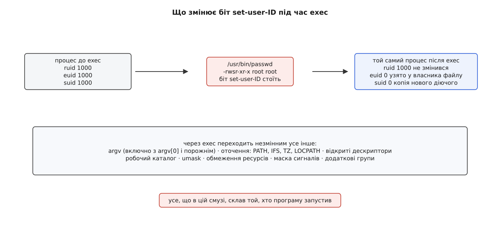
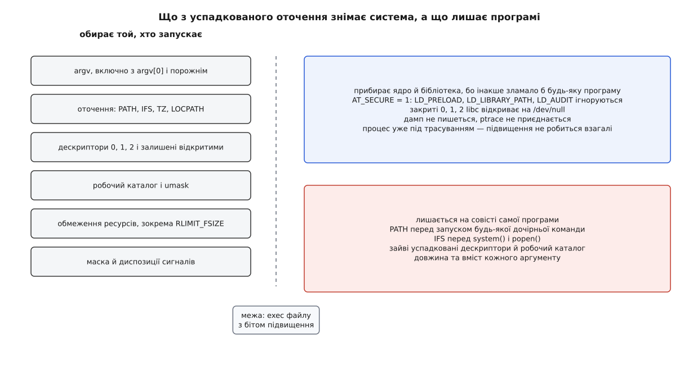
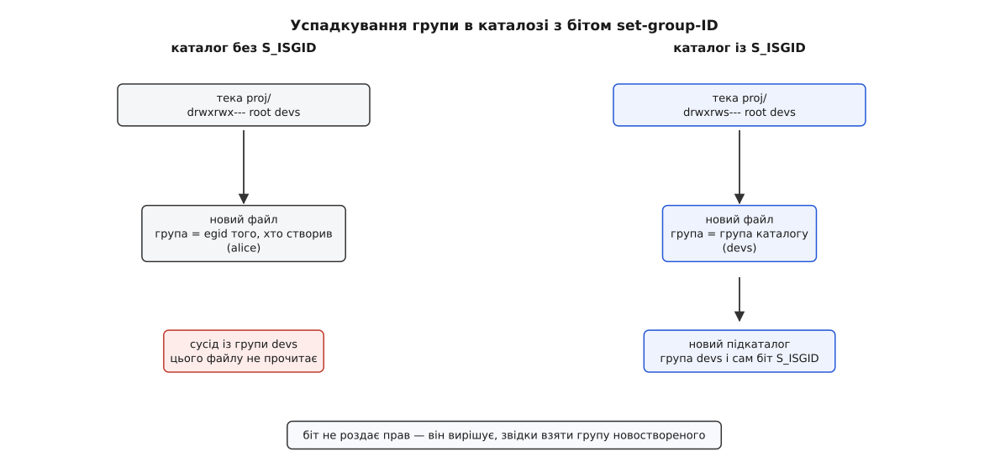

# setuid, setgid і підвищення прав

<preknowlist>
- [Біти прав і як їх перевіряють](topic:unix-linux/permission-bits) — дев'ять бітів у inode й драбина «власник → група → решта», де перше «так» вирішує остаточно.
- [Користувачі, групи й ідентичність процесу](topic:unix-linux/uid-gid-model) — процес несе числа ruid, euid і suid; на перевірках ядро дивиться на діючий, а реальний каже, чий це процес.
- [exec: заміна образу](topic:unix-linux/exec-semantics) — процес лишається тим самим, а код і адресний простір у ньому міняються цілком.
- [Inode: файл без імені](topic:unix-linux/inode-model) — власник, група й біти режиму лежать у самому об'єкті файлу, а не в його імені.
- [argv, оточення й що успадковує дитина](topic:unix-linux/argv-and-environment) — аргументи й змінні оточення складає той, хто запускає, і вони переходять у нову програму.
</preknowlist>

Погляньте на файл, у якому лежать хеші паролів:

```sh
$ ls -l /etc/shadow
-rw-r----- 1 root shadow 1837 /etc/shadow
$ id -u
1000
```

Ані прочитати, ані записати вам його не дозволено: ви не root, ви не в групі `shadow`, а для решти в режимі порожньо. І все ж команда `passwd` змінює вам пароль — отже, хтось у цю мить у цей файл таки записав.

Обходу перевірки при цьому не сталося. Ядро зробило все як завжди: узяло числа процесу, порівняло їх із власником і групою inode, дозволило. Просто числа в тому процесі були не ваші. Питання, з якого росте вся тема: **звідки процес узяв чужі числа** — і на чому тримається впевненість, що давати їх було безпечно.

## Єдина мить, на якій підвищення можна тримати

Ідентичність у Unix тече вниз по дереву процесів і тільки звужується: дитина дістає числа батька, а взяти чужі процес сам не може. Щоб `passwd` спрацював, десь має бути виняток — стрілка вгору. Питання лише, **де** її поставити так, щоб вона не завалила всю конструкцію.

Найпростіше на вигляд — дозволити процесові попросити ядро: «підніми мене». Але тоді треба вирішити, кому таке прохання задовольняти. Процес — це не програма. Це адресний простір, який уже кілька мілісекунд щось читав із мережі, з файлів, з аргументів; його поточний стан і те, яким кодом він зараз піде, залежать від даних, що прийшли ззовні. Про такий об'єкт ядро не може сказати нічого певного, крім чисел, які воно й так має. Ставити на нього стрілку вгору — те саме, що дозволити підвищення будь-кому.

Тепер знайдімо мить, коли ядро знає **точно, який код зараз почне виконуватися**. Така мить рівно одна: [`exec`](topic:unix-linux/exec-semantics). У цю мить старий адресний простір викидають, новий будують із конкретного файлу, і в ядра на руках лежить inode цього файлу — з власником, групою й бітами режиму. Це єдина точка, де підвищення можна прив'язати не до процесу, а до **перевіреного вмісту**.

Лишається друге питання — чиїм коштом. Право не береться нізвідки: хтось має його віддати. Природний кандидат — **власник файлу**: він віддає свої власні повноваження, а не чужі. Ця відповідь ще й безкоштовно самообмежується. Поставити такий біт дозволено власникові файлу, а віддати файл іншому користувачеві непривілейований не може — `chown` на чуже ім'я вимагає привілею. Отже, файл, що підіймає до root, здатний створити лише root; ви можете зробити такий файл щонайбільше на самого себе.

Обидві відповіді разом дають механізм: **один біт у режимі файлу, що при `exec` ставить діючий ідентифікатор процесу рівним ідентифікатору власника цього файлу**. Біт для користувача зветься set-user-ID (англ. *set user identifier* — «встанови ідентифікатор користувача»; константа `S_ISUID`, вісімкове `4000`), біт для групи — set-group-ID (`S_ISGID`, `2000`). У виводі `ls` вони видні тим, що на місці букви `x` стоїть `s`:

```sh
$ ls -l /usr/bin/passwd
-rwsr-xr-x 1 root root 68208 /usr/bin/passwd
   ↑ s замість x у трійці власника
```

Велика `S` замість малої означає, що біт стоїть, а `x` під ним немає: підвищувати нема кого, бо файл ніхто не виконає.

## Що саме міняється при запуску

Механіка коротка й варта того, щоб знати її поіменно.



*Підвищення торкається рівно трьох чисел. Усе, чим той, хто запускає, може впливати на поведінку програми, переходить через `exec` недоторканим — і саме звідси беруться майже всі біди цього механізму.*

```
до exec (оболонка користувача)      після exec (passwd)
ruid  = 1000                        ruid  = 1000        ← не змінився: процес і далі ваш
euid  = 1000                        euid  = 0           ← узято у власника файлу
suid  = 1000                        suid  = 0           ← копія нового діючого
групи = 1000, 27                    групи = 1000, 27    ← додаткові групи недоторкані
```

Реальний ідентифікатор лишається вашим — тому `ps` покаже процес вашим, ліміт на кількість процесів витратиться ваш, і саме тому `passwd` знає, **чий** пароль міняти: він читає `getuid()`. Збережений дістає копію нового діючого, і це дає програмі право вимкнути привілей на час небезпечної роботи, а потім увімкнути назад.

Набір із set-group-ID дзеркальний: міняються `egid` і збережений груповий, а список додаткових груп лишається як був. І підвищення — це не «стати root», а **стати власником файлу**: файл, що належить `alice` з бітом `s`, дає рівно права alice.

> 🔧 **Навіщо це.** Звідси перше практичне правило: коли програмі бракує доступу до одного каталогу чи пристрою, `setuid root` — найгірший з можливих способів. Достатньо зробити файл `setgid` на вузьку групу, якій дозволено писати саме туди. Класика — ігри з таблицею рекордів: гра стоїть `setgid games`, спільний файл рекордів належить групі `games`, і навіть повністю зламана гра дістає рівно право псувати чужі рекорди. Ціна помилки в setgid-програмі обмежена тим, що дозволено групі; у setuid-root — нічим.

## Програма починає життя в чужих руках

Тепер найважливіший наслідок, і він читається просто з таблиці вище: змінилися **тільки** числа. Усе інше `exec` переносить без змін — а складав це «інше» той, хто програму запустив.

Він обирає аргументи `argv` — усі, включно з `argv[0]`, який заведено вважати іменем програми, і включно з можливістю не передати жодного. Він обирає весь набір змінних оточення: `PATH`, за яким програма шукатиме допоміжні команди; `IFS`, за яким оболонка ріже рядок на слова; `TZ`, `LOCPATH`, `NLSPATH`, за якими бібліотека відкриває свої файли. Він обирає, які [дескриптори](topic:unix-linux/file-descriptor) лишити відкритими — і може закрити `0`, `1` і `2`, щоб перший же файл, який відкриє програма, дістав номер 1 і почав приймати те, що вона вважає діагностикою. Він обирає робочий каталог, [маску `umask`](topic:unix-linux/umask-and-defaults), [обмеження ресурсів](topic:unix-linux/resource-limits) — зокрема `RLIMIT_FSIZE`, який урве запис посеред файлу, — і маску заблокованих сигналів.



*Довірили коду, а разом із кодом дістали все оточення, що склав нападник. Ядро й libc прибирають лише те, що інакше зламало б будь-яку програму без її участі.*

Частину цього неможливо залишити на розсуд програми — бо це зламало б навіть бездоганно написану. Тому ядро, зробивши підвищення, ставить у [допоміжному векторі](topic:unix-linux/auxiliary-vector) запис `AT_SECURE` рівним одиниці. Це прапорець «режим безпечного виконання», і [динамічний завантажувач](topic:unix-linux/dynamic-loader) читає його першим ділом: у такому режимі він ігнорує `LD_PRELOAD`, `LD_LIBRARY_PATH`, `LD_AUDIT` і решту змінних, що [впливають на пошук бібліотек](topic:unix-linux/library-search-order). Без цього все підвищення тривало б рівно до першого виклику `printf`, підміненого чужою бібліотекою. Той самий прапорець видно програмі через `secure_getenv()`, який у безпечному режимі повертає `NULL` замість значення — саме ним бібліотеки відсіюють змінні, яким не можна довіряти.

Ще дві речі система робить мовчки. Якщо при запуску setuid-файлу дескриптори `0`, `1` або `2` закриті, їх відкриває на `/dev/null` не ядро, а libc: той самий `AT_SECURE` вмикає в glibc перевірку, яка затикає порожні місця, — щоб описана вище підміна стандартних потоків не спрацьовувала автоматично. А ядро знімає з процесу ознаку «можна знімати дамп»: [аварійний дамп](topic:unix-linux/core-dump) привілейованого процесу не пишеться (поведінку крутить `fs.suid_dumpable`), а [`ptrace`](topic:unix-linux/ptrace-model) до нього не приєднається — інакше пам'ять із чужими секретами читав би будь-хто. З того самого міркування ядро **не робить** підвищення взагалі, якщо процес у мить `exec` уже під трасуванням: трасувальник керував би кожним кроком привілейованої програми.

Решта лишається на совісті автора програми — і це не риторика, а перелік: `PATH` перед будь-яким запуском дочірньої команди, `IFS` перед `system()`, зайві успадковані дескриптори, робочий каталог, довжина й вміст кожного аргументу. Тридцять років цей перелік поповнювався справжніми вразливостями, і кожна з них по черзі виштовхувала якийсь захист із програм у ядро й libc: [хроніка дірок, що виросли з оточення](topic:unix-linux/setuid-and-privilege/hist-environment-holes.md) — від `IFS` у ранніх оболонках до `PwnKit` у 2022 році — показує, наскільки повільно цей механізм учився. Практичний бік — що конкретно робити в перших рядках такої програми — зібрано окремо: [скелет setuid-помічника](topic:unix-linux/setuid-and-privilege/proj-setuid-helper.md).

> 🔧 **Навіщо це.** Перевірити, що саме на машині має цю властивість, коштує однієї команди: `find / -xdev -perm /6000 -type f -ls`. На звичайній системі список короткий — десяток файлів на кшталт `su`, `sudo`, `passwd`, `mount`, `pkexec`. Кожен зайвий рядок у ньому — це ще одна програма, яка починає роботу в оточенні, повністю складеному тим, хто її запустив. Найдешевший спосіб прибрати рядок — не залатати програму, а примонтувати її файлову систему з `nosuid`.

## Ворота, крізь які підвищення може не пройти

Біт у режимі файлу — умова необхідна, але аж ніяк не достатня. Ядро дорогою до підвищення проходить кілька перевірок, і кожна з них існує через конкретну біду.

**Монтування з `nosuid`.** Прапорець [монтування](topic:unix-linux/mount-model) `nosuid` каже ядру ігнорувати обидва біти на всьому, що лежить під цією точкою. Без нього будь-хто, кому дозволено підмонтувати свій носій чи образ, приносив би на машину власний `setuid root` файл. Тому знімні носії, `/tmp`, домашні теки на багатокористувацьких машинах і майже всі шари контейнерів монтують саме так.

**Скрипт із `#!`.** Linux ніколи не виконує біт підвищення на скрипті. Причина в тому, що між миттю, коли ядро прочитало перший рядок і запустило інтерпретатор, і миттю, коли інтерпретатор відкрив файл **за іменем**, лежить проміжок, у який ім'я можна перенаправити на інший файл — класична [гонка перевірки й використання](topic:programming/toctou-race). Плюс інтерпретатор сам читає своє оточення (`PERL5LIB`, `PYTHONPATH`, `BASH_ENV`) і зазвичай віддає доступ до системи прямо з мови. Біт на самому інтерпретаторі, звісно, діє — і саме тому `setuid`-копія `/bin/sh` є повноцінним чорним ходом.

**Прапорець `no_new_privs`.** Процес може добровільно й **назавжди** пообіцяти за себе й за всіх нащадків: жоден майбутній `exec` не дасть більше прав, ніж є зараз. Викликом `prctl(PR_SET_NO_NEW_PRIVS, 1, …)` він піднімає прапорець, який не знімається, успадковується при породженні й переживає `exec`; після цього і біти підвищення, і файлові можливості просто не діють. Механізм з'явився в Linux 3.5 (2012, Andy Lutomirski) і потрібен був не сам по собі: без нього непривілейованому процесові не можна дозволити ставити фільтр [seccomp](topic:unix-linux/seccomp-filtering), бо фільтр переживає `exec` і міг би перекрутити поведінку setuid-програми, запущеної з-під нього. Сьогодні цей прапорець піднімає під собою майже кожна пісочниця й майже кожен юніт systemd із увімкненою ізоляцією.

**Простори імен користувачів.** У [просторі імен](topic:unix-linux/namespaces) число має сенс лише разом із таблицею перекладу. Підвищення там працює як завжди, але дає ідентифікатор власника файлу **всередині** простору; якщо цей номер не відображений назовні, зовні процес лишається кимось без жодних прав. Тому непривілейований контейнер може мати всередині власний `setuid root` файл і не становити загрози для машини.

**Записали у файл — біт зник.** Ядро гасить `S_ISUID` (і `S_ISGID` у виконуваних файлів), щойно у файл щось записали — крім випадку, коли пише процес із `CAP_FSETID`, — і щойно змінили власника чи групу, а тут винятку вже немає. Інакше право «писати в чужу привілейовану програму» тихо означало б «стати її власником», а `chown` перенаправляв би всі майбутні запуски на нову людину.

## Той самий біт на каталозі означає інше

`S_ISGID` — рідкісний випадок, коли один біт у двох різних об'єктах робить дві не пов'язані речі. Пояснення в тому, що каталог виконати неможливо, отже, для нього біт вільний, а потреба, яку ним закрили, стосується не прав, а **успадкування групи**.

Коли ви створюєте файл, група береться з `egid` процесу — тобто з вас. У спільному дереві проєкту це руйнівно: кожен кладе файли зі своєю особистою групою, і сусід їх не прочитає. Історично гілка BSD розв'язувала це інакше за гілку System V: у BSD новий файл успадковував групу **каталогу**, у System V — групу процесу. Linux дав обидві поведінки, зробивши другу вмикачем: `S_ISGID` на каталозі означає «нові записи тут беруть мою групу».



*Біт не роздає прав — він лише вирішує, звідки взяти групу новоствореного. Наслідування біта підкаталогами й робить властивість дійсною для цілого піддерева, а не для одного рівня.*

Новий підкаталог успадковує не лише групу, а й сам біт — і саме це робить прийом придатним для дерев довільної глибини. Разом із маскою `umask 002`, яка лишає групі право запису, це і є звичайний рецепт спільної теки: одна група, `chmod g+s` на корені дерева, і далі все всередині виходить спільним само собою.

Є і третя, майже вимерла роль. У Linux `S_ISGID` на **невиконуваному** файлі колись позначав, що на файл діють обов'язкові [замки](topic:unix-linux/file-locking) — комбінація «біт стоїть, `x` для групи немає» була вибрана саме тому, що інакше вона нічого не означає. Механізм давно вважали помилкою (він дозволяв підвісити читача назавжди), відключали типово, а в ядрі 5.15 прибрали код зовсім. Знати про нього варто рівно для того, щоб не лякатися такої комбінації в старому дереві.

## Відступ від setuid

Механізм, у якому одна помилка в програмі коштує всієї машини, довго терпіти не будуть. Останні двадцять років розвиток моделі прав у Linux — це, по суті, послідовне відбирання роботи в `setuid`, і напрямів рівно три.

**Дати вужче право замість усіх.** Замість повноважень root програмі видають одну іменовану [можливість](topic:unix-linux/capabilities): з ядра 2.6.24 набір можливостей вішається на сам файл — розширеним атрибутом `security.capability` ([xattr](topic:unix-linux/acl-and-xattr)), яким і керує `setcap`. Канонічний приклад — `ping`: колись `setuid root` заради одного лише права відкрити сирий сокет, потім файл із `cap_net_raw+ep` і без жодного підвищення UID.

**Прибрати саму потребу.** Найкраще право — те, якого не треба. Історія того ж `ping` на цьому й закінчилася: у травні 2011 року в ядро прийняли сокети `IPPROTO_ICMP` (автор Васілій Куліков), які вміють слати ехо-запит без будь-яких привілеїв, а `net.ipv4.ping_group_range` вирішує, яким групам це дозволено. Сучасний `ping` у багатьох дистрибутивах — звичайна програма без жодного біта й без жодної можливості.

**Винести привілей із програми в окремий процес.** Замість того щоб піднімати права тому, хто просить, привілейовану дію виконує служба, що вже працює з потрібними правами й слухає сокет. Той, хто просить, лишається собою, а на тому кінці сокета сидить маленька програма, яку можна прочитати очима: саме так побудовані [polkit](topic:unix-linux/polkit) і [розділення привілеїв](topic:unix-linux/privilege-separation) усередині демонів на кшталт `sshd`. Різниця принципова: перевіряти доводиться не всю програму й не її оточення, а вузький перелік повідомлень, які вміє прийняти служба.

> 🔧 **Навіщо це.** Коли своя служба потребує привілею, порядок вибору саме такий: чи можна взагалі без нього (група на пристрій, `ping_group_range`, налаштування systemd)? Якщо ні — чи вистачить однієї можливості на файлі або в юніті? Якщо ні — чи можна зробити привілейованою окрему маленьку програму, що вміє рівно одну дію? І тільки коли всі три відповіді «ні», лишається `setuid`, і тоді разом із ним береться весь тягар: очищення оточення, дескриптори, зниження прав із перевіркою результату. Загальне формулювання цього порядку — [принцип найменших привілеїв](topic:programming/least-privilege).

І все ж цей біт нікуди не подівся. Він єдиний з усіх механізмів не потребує ані працюючої служби, ані політики, ані підтримки з боку файлової системи понад один біт в inode — тому він працює там, де ще нічого не працює: у режимі порятунку, на ранньому завантаженні, у зібраному вручну образі. Ціна цієї невибагливості завжди та сама: система переклала доведення власної безпеки на програму, а програма починає життя в оточенні, яке склав той, від кого вона мала б захищати.
